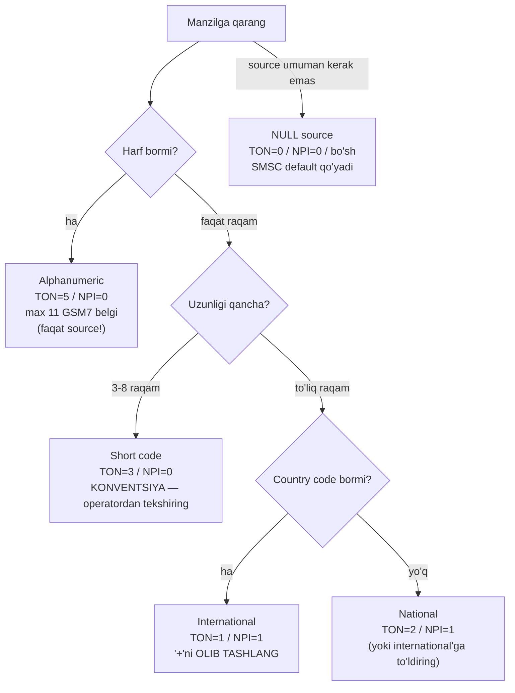

# 6-bob. Addressing: TON/NPI va manzillar

> **Bu bobda:** SMPP manzillarining ikki sirli bayti — TON va NPI: rasmiy jadvallar, real hayotdagi kombinatsiyalar, alphanumeric sender'ning 11 belgilik siri va `+` belgisi atrofidagi klassik janjal. Kodda `Address` to'liq shaklga keladi: konstruktorlar va `Validate()`.

5-bobda manzil uchligi (TON + NPI + matn) shunchaki "field" edi. Endi savol tug'iladi: `998901234567` uchun TON nima bo'lishi kerak? "Bank" uchun-chi? `1234` short code uchun? Bu savollar SMPP integratsiyasida ENG KO'P beriladigan savollar — chunki spec jadval beradi-yu, TANLASH qoidasini bermaydi, natijada har operator o'z konventsiyasini o'ylab topgan. Bu bob ikkala qatlamni ajratib beradi: spec nima DEYDI va amaliyot nima QILADI.

TON (Type of Number) — "bu qanday TURDAGI raqam/manzil", NPI (Numbering Plan Indicator) — "bu manzil QAYSI raqamlash rejasiga tegishli". Ikkalasi birga SMSC'ga manzil matnini qanday talqin qilishni aytadi.

## 6.1 Rasmiy jadvallar

**TON (§5.2.5, Table 5-3)** — to'liq ro'yxat:

| Qiymat | Nomi | Ma'nosi |
|---|---|---|
| 0x00 | Unknown | Format noma'lum — SMSC o'zi aniqlasin |
| 0x01 | International | To'liq xalqaro format: country code bilan (998901234567) |
| 0x02 | National | Milliy format: country code'siz (901234567) |
| 0x03 | Network Specific | Operator ichki raqami |
| 0x04 | Subscriber Number | Abonent raqami (mahalliy qism) |
| 0x05 | Alphanumeric | Harf-raqamli sender ("Bank", "MyBrand") |
| 0x06 | Abbreviated | Qisqartirilgan raqam |
| boshqa | reserved | |

**NPI (§5.2.6, Table 5-4)** — to'liq ro'yxat:

| Qiymat | Nomi | Ma'nosi |
|---|---|---|
| 0x00 | Unknown | |
| 0x01 | ISDN (E.163/E.164) | Oddiy telefon raqamlari — 99% holat |
| 0x03 | Data (X.121) | |
| 0x04 | Telex (F.69) | |
| 0x06 | Land Mobile (E.212) | |
| 0x08 | National | Milliy raqamlash rejasi |
| 0x09 | Private | Xususiy reja |
| 0x0A | ERMES | Paging tizimi (tarixiy) |
| 0x0E | Internet (IP) | IP manzil |
| 0x12 | WAP Client Id | |
| boshqa | reserved | |

> **⚠ OGOHLANTIRISH — NPI qiymatlari ketma-ket EMAS.** Jadvalga diqqat bilan qarang: 0, 1, **3**, 4, **6**, 8, 9, 10, 14, 18 — ikki (0x02) qiymati YO'Q, besh ham, yetti ham yo'q. "NPI'lar tartib bilan sanalgan" deb faraz qilib enum yozish yoki NPI=2 yuborish — reserved qiymat, qattiq SMSC'da xato. Kodimizda konstantalar aynan Table 5-4 raqamlari bilan yozilgan va test bilan qotirilgan (`TestNPIValuesNotSequential`).

## 6.2 Real kombinatsiyalar: amaliyot jadvali

Endi eng muhim jadval — u spec'da YO'Q, bu **industriya konventsiyasi** (NowSMS, Aerialink, Infobip va boshqa aggregator hujjatlaridan jamlangan):

| Manzil turi | TON | NPI | Misol | Izoh |
|---|---|---|---|---|
| International (E.164) | 1 | 1 | 998901234567 | Eng portativ variant; **`+`siz!** |
| National | 2 | 1 (ba'zan 8) | 901234567 | Country code'siz; kam ishlatiladi |
| Alphanumeric sender | 5 | 0 | Bank | Faqat source sifatida |
| Short code | 3 | 0 | 1234 | **Standartlashmagan** — 6/0 va 0/1 kutuvchilar ham bor |
| Unknown/aralash | 0 | 1 | har xil | "SMSC o'zi aniqlasin" |

Tanlash algoritmi diagrammada:



Amaliy maslahat: **destination'ni har doim international'ga normalizatsiya qiling** (901234567 → 998901234567, TON=1/NPI=1) — bu eng portativ yo'l; national format esa operatorga bog'liq talqin xavfini tashiydi. Short code TON'i esa protokolning haqiqiy "bo'sh joyi": spec aniq javob bermaydi, provider'lar 3/0, 6/0, 0/1 variantlarini kutadi — integratsiya so'rovnomasidagi majburiy savol (16-bob checklist'iga kiradi).

Normalizatsiya application qatlamining ishi ekanini aniq belgilab olaylik — SMPP kutubxonasi foydalanuvchi kiritgan `+998 90 123-45-67`ni tuzatib o'tirmasligi kerak (qaysi mamlakat? qaysi default prefiks?). To'g'ri mehnat taqsimoti: forma/backend raqamni E.164'ga keltiradi (bo'shliq/defis/qavs olib tashlanadi, milliy `0` prefiks country code bilan almashtiriladi — masalan Buyuk Britaniyada `07911...` → `447911...`), SMPP qatlami esa tayyor raqamni `International()` orqali o'tkazadi. Bizning konstruktor faqat oxirgi chegara nazorati: `+` tozalash, raqam-emaslarni rad etish, E.164'ning 15 raqamlik limiti.

Kam uchraydigan TON'lar haqida ikki og'iz, jadvalda ko'rganda taniysiz: **TON=4 (Subscriber)** — raqamning faqat abonent qismi (prefikslarsiz); **TON=6 (Abbreviated)** — qisqartirilgan raqamlar; ikkalasi ham ayrim operatorlarning short code yoki ichki xizmat konventsiyalarida suzib chiqadi. **TON=0 (Unknown)** esa alohida hodisa: "formatni o'zing aniqlab ol" — ko'p SMSC'lar buni xushmuomalalik bilan qabul qilib, matnga qarab talqin qiladi; lekin qattiq server'lar aniq TON talab qilib RINVSRCTON/RINVDSTTON (0x48/0x50) qaytarishi ham mumkin. "0/1 hammasini hal qiladi" degan taxmin ishonchli emas — portativ yo'l baribir aniq 1/1.

### `+` muammosi

`+998901234567` ko'rinishi odamlar uchun standart, SMPP uchun esa mina. Sabab: TON=1 allaqachon "bu xalqaro format" deyapti — `+` shu ma'noning MATNDAGI dublikati, va spec manzil matni formatini umuman belgilamagani uchun har SMSC o'zicha hal qiladi: ba'zilari `+`ni jimgina olib tashlaydi, ko'plari **ESME_RINVDSTADR (0x0B)** yoki RINVSRCADR (0x0A) bilan rad etadi. Xavfsiz qoida bitta: **TON=1 + faqat raqamlar**. Bizning `International()` konstruktori `+`ni o'zi olib tashlaydi, `Validate()` esa qolib ketganini ushlaydi.

## 6.3 Alphanumeric sender: 11 belgilik sahna nomi

"Bank", "OLX", "eGov" — abonent telefonida raqam o'rniga ko'rinadigan brend nomlari. SMPP darajasida hammasi sodda: TON=5, NPI=0, manzil matni = nom. Qiziq savollar chuqurroqda:

**Nega aynan 11 belgi?** Bu SMPP limiti EMAS — SMPP field'i 20 belgigacha sig'diradi. Limit havo interfeysidan: TS 23.040 §9.1.2.5 bo'yicha TP-OA (Originating Address) field'ida alphanumeric manzil uchun **10 oktet** joy bor, matn esa GSM 7-bit packing bilan zichlanadi (7-bobda batafsil). Arifmetikasi: 10 oktet = 80 bit; har belgi 7 bit; 80 / 7 = 11.4 → **11 to'liq belgi** (11 × 7 = 77 bit, 3 bit ortadi). SMPP'da 15 belgili sender yuborsangiz, SMSC yo rad etadi, yo 11 belgigacha KESADI — telefongacha baribir 11 tadan ortiq yetmaydi. Bu hisob keyingi bobda katta aks-sadosini topadi: xuddi shu packing 140 oktetlik xabar tanasidan 160 belgi yasaydi.

**Faqat GSM7 belgilar.** Xuddi shu sababdan: TP-OA'dagi matn GSM 7-bit default alphabet'da kodlanadi. Kirill harfli yoki U+02BB'li sender bo'lmaydi (7-bobda bu belgilar bilan to'liq tanishamiz). Amalda operatorlar bundan ham torroq talab qo'yadi: ko'pincha faqat harf-raqam va bo'sh joy, ba'zi mamlakatlarda bo'sh joy ham taqiq.

**Javob yozib bo'lmaydi.** Alphanumeric sender — "raqam" emas, unga reply yo'li yo'q: abonent "javob berish"ni bossa ham xabar hech qayerga keta olmaydi. OTP/notification uchun ideal (javob kutilmaydi), ikki tomonlama xizmatlar uchun yaroqsiz — ularga short code yoki oddiy raqam kerak.

> **⚠ Amaliyotda — sender sizniki emas, operatorniki.** Yuborgan sender'ingiz bilan yetib borgan sender bir xil bo'lishiga kafolat YO'Q: (1) ko'p mamlakatlarda alphanumeric sender **oldindan ro'yxatdan o'tkazilishi shart** (Hindistonda butun boshli DLT tizimi; ro'yxatsiz — xabar umuman bloklanadi yoki sender generik raqamga almashtiriladi); (2) AQSh/Kanada alphanumeric'ni UMUMAN qo'llamaydi — u yerlarga 10DLC/toll-free/short code kerak; (3) ayrim operatorlar filtrlardan o'tkazish uchun sender'ni o'zi qayta yozadi. Xulosa: sender strategiyasi — protokol emas, mamlakat-ma-mamlakat compliance masalasi; SMPP sizga faqat "so'rash" imkonini beradi.

## 6.4 source_addr va destination_addr

Ikki manzilning semantik farqlari (§5.2.8–5.2.9):

- **source_addr** — xabarni yaratgan SME. Bo'sh bo'lishi MUMKIN (TON=0/NPI=0/"") — bunda SMSC hisobga bog'langan default sender'ni qo'yadi. MO/DLR oqimida esa (5-bob) source abonent raqami bo'lib keladi.
- **destination_addr** — MT xabarda qabul qiluvchi MS raqami. Bo'sh bo'lishi MUMKIN EMAS.
- Ikkalasi submit_sm/deliver_sm'da **max 21 oktet** (20 belgi + NULL); data_sm'da esa max **65** — 10-bobda data_sm codec'i shu farqni hisobga oladi. Farqning sababi data_sm'ning kelib chiqishida: u WAP/internet ilovalar uchun kiritilgan (§4.7), manzil sifatida telefon raqamidan uzunroq narsalar — email uslubidagi identifikatorlar, IP'lar — ko'zda tutilgan. Telefon raqamlari uchun 20 belgi ortig'i bilan yetadi (E.164 max 15 raqam), shuning uchun submit_sm'ning tor limiti amalda hech kimga xalaqit bermaydi.
- IP manzillar `aaa.bbb.ccc.ddd` notatsiyasida, NPI=0x0E bilan; **IPv6 v3.4'da yo'q** (1999!). IP-manzilli SMS bugungi amaliyotda ekzotika — lekin NPI jadvalida ko'rsangiz sababini bilasiz.

RINV*ADR va RINV*TON/NPI xatolarini tashxislashda farqni biling: **RINVSRCTON/RINVDSTTON (0x48/0x50 oilasi)** — TON/NPI QIYMATI SMSC'ga yoqmadi (masalan reserved qiymat yoki siyosatga zid kombinatsiya); **RINVSRCADR/RINVDSTADR (0x0A/0x0B)** — manzil MATNI yaroqsiz (`+`, harf raqamli TON bilan, bo'sh dest...). Birinchisida kombinatsiya jadvalini, ikkinchisida matn formatini tekshiring.

Manzillar simda qanday turishini 5-bob goldenidan bilamiz — endi ongli o'qiymiz. submit_sm dump'idagi ikki parcha:

```
05 00 42 61 6E 6B 00                    <- source: TON=05 NPI=00 "Bank"+NULL
01 01 39 39 38 39 30 31 ... 37 00       <- dest:   TON=01 NPI=01 "998901234567"+NULL
```

Har manzil — uch qism: 1 oktet TON, 1 oktet NPI, C-Octet String matn. `05 00` juftligini ko'rdingizmi — alphanumeric; `01 01` — xalqaro raqam. Wireshark'siz dump o'qiyotganda manzil chegaralarini topishning teskari usuli ham foydali: NULL (0x00) baytdan keyingi ikki oktet — katta ehtimol keyingi manzilning TON/NPI jufti.

> **⚠ Amaliyotda — TON/NPI'ni SMSC ham o'zgartiradi.** Yuborganingiz 5/0 "Bank" — yetib borgani 3/0 "1234" bo'lishi mumkin: operator sender'ni qayta yozganda (6.3-bo'lim) TON/NPI ham unga mos almashadi. DLR'dagi manzillarga ham xuddi shu ko'z bilan qarang: source/dest almashgani ustiga (5-bob), qiymatlar operator normalizatsiyasidan o'tgan bo'ladi — masalan siz `+`siz international yuborgansiz, DLR'da national formatda qaytishi mumkin. Manzil bo'yicha korrelyatsiya qilayotgan kod (9-bob) shuning uchun ham message_id'ga tayanadi, manzil matniga emas.

## 6.5 address_range va esme_addr: chetdagi ikki qarindosh

**address_range** (§5.2.7) bilan 4-bobda tanishganmiz — bind_receiver/transceiver'da ESME xizmat qiladigan manzillar to'plami, **UNIX regular expression** notatsiyasida (Appendix A): `^1234` (1234 bilan boshlanadi), `5678$` (tugaydi), `^123456$` (aynan), `[13579]$` (toq raqam bilan tugaydi), `[^13579]$` (inkor). Chiroyli mexanizm — va deyarli o'lik: zamonaviy SMSC'lar MO routing'ni account konfiguratsiyasida qiladi, address_range'ni ignore qiladi (ayrimlari notanish qiymatga bind'ni rad ham etadi). Default: bo'sh.

**esme_addr** (§5.2.10) — alert_notification PDU'sidagi (10-bob) ESME manzili: qaysi ESME'ga "abonent yana available" xabari ketayotgani. TON/NPI + max 65 belgili matn — xuddi manzil, faqat ESME'ni ko'rsatadi. Kam uchraydi, lekin Table'da ko'rsangiz endi tanisiz.

## 6.6 Kod: Address to'liq shaklda

5-bobda kiritilgan `Address` struct'iga konstruktorlar va semantik validatsiya qo'shildi (`code/pdu/address.go`). Konstruktorlar "to'g'ri yo'lni oson" qiladi:

```go
// International to'liq xalqaro (E.164) raqamdan manzil yasaydi: TON=1/NPI=1.
// Bosh '+' OLIB TASHLANADI — ko'p SMSC'lar TON=1 bilan faqat raqam kutadi,
// '+' bilan kelganini ESME_RINVDSTADR (0x0B) bilan rad etadi.
func International(msisdn string) (Address, error) {
	s := strings.TrimPrefix(msisdn, "+")
	if s == "" {
		return Address{}, fmt.Errorf("pdu: bo'sh msisdn")
	}
	if !allDigits(s) {
		return Address{}, fmt.Errorf("pdu: international manzilda raqam bo'lmagan belgi: %q", msisdn)
	}
	if len(s) > 15 {
		return Address{}, fmt.Errorf("pdu: %q — E.164 max 15 raqam, keldi %d", s, len(s))
	}
	return Address{TON: TONInternational, NPI: NPIISDN, Addr: s}, nil
}
```

`Alphanumeric(name)` 11 belgi + GSM7 tekshiruvi bilan (tekshiruv ASCII qismga tayanadi — to'liq GSM7 jadvali 7-bobda keladi, sender'lar uchun ASCII qismi amalda yetarli), `ShortCode(s)` esa 3/0 konventsiyasini beradi — doc-comment'ida "standartlashmagan, operatordan tekshiring" ogohlantirishi bilan. `Validate()` TON'ga qarab qoidalarni qo'llaydi:

```go
	case TONInternational:
		if a.Addr == "" {
			return fmt.Errorf("pdu: international manzil bo'sh bo'lmaydi")
		}
		if strings.HasPrefix(a.Addr, "+") {
			return fmt.Errorf("pdu: TON=International bilan '+' yuborilmaydi (ko'p SMSC RINVDSTADR qaytaradi) — International() konstruktori '+'ni o'zi olib tashlaydi")
		}
```

Muhim dizayn chegarasi: **Validate'ni codec chaqirmaydi.** Decode har qanday kelgan baytni o'qiydi (spec buzgan peer'dan kelganini ham ko'rish kerak), encode ham semantikaga aralashmaydi — Validate yuborish yo'lida, 13-bob client'ida ishlaydi: xatoni SMSC round-trip'idan emas, lokal va darhol olish uchun. Testlar (`address_test.go`) valid/invalid jadvalni qamraydi — bir parcha:

```go
		{"Bank", true},
		{"MyBrand 24", true},    // bo'sh joy GSM7'da bor
		{"O'zBank", true},       // ASCII apostrof GSM7'da bor
		{"ELEVENCHARS", true},   // aynan 11 belgi
		{"TWELVECHARSX", false}, // 12 belgi — TP-OA limiti
```

`+998...` konstruktorda tozalanadi, struct'da qolib ketsa Validate ushlaydi; U+02BB'li sender rad etiladi ("O'zBank" esa ASCII apostrof bilan o'tadi — 7-bob normalizatsiyasiga to'g'ridan-to'g'ri ishora); bo'sh manzil faqat 0/0 uchlikda qonuniy; IP manzil NPI=14 bilan raqam-tekshiruvsiz o'tadi.

### Tashxis jadvali: simptom → ehtimoliy sabab

Addressing xatolari log'da qanday ko'rinishi va birinchi qayerga qarash:

| Simptom | Ehtimoliy sabab | Birinchi tekshiruv |
|---|---|---|
| RINVDSTADR (0x0B) har submit'da | destination'da `+` yoki harf/bo'shliq | dest matnini hex'da ko'ring — 0x2B (`+`) bormi? |
| RINVSRCADR (0x0A) har submit'da | ro'yxatdan o'tmagan/ruxsatsiz sender | operator bilan sender ro'yxati |
| RINVDSTTON (0x50) | TON qiymati siyosatga zid (masalan national taqiqlangan) | kombinatsiya jadvali + operator hujjati |
| Xabar ketdi, sender boshqacha ko'rindi | operator qayta yozgan | 6.3 "⚠" bloki — bu bug emas |
| Ba'zi raqamlarga ketadi, ba'zilariga RINVDSTADR | normalizatsiya chala (national aralash) | barcha dest'ni E.164'ga keltirish |

### Operator bilan kelishiladigan savollar

Bob materialini integratsiya so'rovnomasi shakliga jamlaymiz — addressing bo'yicha operator/aggregator'dan yozma javob olinishi kerak bo'lgan punktlar (16-bobdagi katta checklist'ning bir bo'limi bo'ladi):

1. destination uchun qaysi TON/NPI kutilasiz? `+` qabul qilinadimi?
2. Alphanumeric sender ruxsatmi? Ro'yxatdan o'tkazish jarayoni va muddati qanday? Qaysi belgilar (bo'sh joy? raqam aralash?) mumkin?
3. Short code source uchun qaysi TON/NPI?
4. Bo'sh source yuborilsa nima bo'ladi — default sender qo'yiladimi, xato qaytadimi?
5. Sender qayta yozilish holatlari bormi (filtr, regulyatsiya)?
6. National formatdagi destination qabul qilinadimi yoki faqat international'mi?

Olti savolning har biriga "hujjatda bor" degan javob — yaxshi provider belgisi; "bilmaymiz, sinab ko'ring" — oldindan ogohlantirish.

```
$ cd code && go vet ./... && go test ./... -race
ok      smpp/pdu
ok      smpp/session
ok      smpp/smsc
ok      smpp/tlv
```

## Xulosa

Manzil ikki baytining siri ochildi: TON "qanday tur", NPI "qaysi raqamlash rejasi"; rasmiy jadvallar (NPI'da 2 yo'q!) bilan amaliy kombinatsiyalar jadvali (spec emas — konventsiya!) alohida yashaydi. destination — har doim `+`siz international; alphanumeric sender — 11 GSM7 belgi (TP-OA'ning 10 okteti sabab), javobsiz va ko'p joyda ro'yxat talab qiladi; short code TON'i — kelishuv masalasi; address_range — chiroyli o'lik. `Address` endi konstruktorlar va Validate bilan to'liq — client (13-bob) undan foydalanadi. Keyingi bob manzildan MATNGA o'tadi: data_coding, GSM7 alphabet va o'zbek matnining ikki yozuvi.

**Takrorlash savollari** (javoblar matnda bor — o'zingizni tekshiring):

1. NPI=2 yuborsangiz nima bo'ladi va nega bunday qiymat umuman paydo bo'lishi mumkin?
2. Alphanumeric sender limiti nega 20 emas, 11 belgi? Limit qaysi spec'dan keladi?
3. `+998901234567`ni TON=1 bilan yuborishning xavfi nima va to'g'ri variant qanday?
4. RINVDSTTON bilan RINVDSTADR farqi — har birida nimani tekshirasiz?
5. Qaysi holatda source_addr bo'sh yuboriladi va SMSC bunga nima qiladi?
6. Nega Validate codec ichida chaqirilmaydi?

**Mashqlar:** [exercises/06-addressing.md](../exercises/06-addressing.md) — 5 manzilga TON/NPI tanlash, alphanumeric'ka javob yozib bo'lmasligining sababi va address_range regex tahlili.

---

**Oldingi bob:** [5-bob. submit_sm va deliver_sm](05-submit-deliver.md) · **Keyingi bob:** [7-bob. Text encoding](07-encoding.md) — data_coding, GSM7/UCS2, belgi limitlari matematikasi va o'zbek matni strategiyasi.

## Manbalar

- [SMPP v3.4 spec, Issue 1.2](../resources/SMPP_v3_4_Issue1_2.pdf) — §5.2.5 (Table 5-3), §5.2.6 (Table 5-4), §5.2.7–5.2.10, Appendix A
- 3GPP TS 23.040 §9.1.2.5 — TP-OA alphanumeric 10 oktet / 11 belgi limiti (normativ manba)
- Tashqi: NowSMS TON/NPI qoidalari (`+` bilan ishlash), Aerialink/Infobip TON-NPI reference'lari, sender ID registratsiya talablari bo'yicha aggregator hujjatlari (AQSh/Kanada, Hindiston DLT) — izohlangan ro'yxat: [resources/links.md](../resources/links.md)
