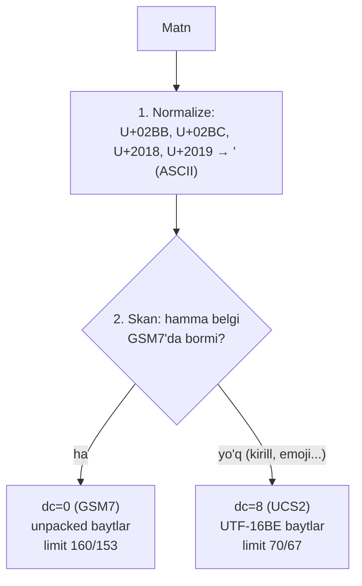

# 7-bob. Text encoding: GSM7, UCS2 va o'zbek matni

> **Bu bobda:** short_message baytlari ortidagi butun dunyo — data_coding jadvali va uning eng katta tuzog'i, GSM 7-bit alphabet (kimlar bor, kimlar yo'q), septet packing matematikasi, UCS2 va belgi limitlari isbotlari — hamda kitobning eng "milliy" mavzusi: o'zbek matnini ikkala yozuvda to'g'ri va tejamli yuborish. Kodda yangi `coding` package tug'iladi.

5-bobda short_message'ga ASCII "Salom" solib yubordik va data_coding=0 deb qo'ydik — go'yo hammasi o'z-o'zidan tushunarli. Endi hisob-kitob vaqti: "Assalomu alaykum! Kodingiz: 5521" nechta SMS bo'ladi? "Ассалому алайкум"-chi? Nega xabarga bitta oʻ harfi qo'shilsa narx ikki baravar oshishi mumkin? Bu savollarning hammasi bitta baytga — data_coding'ga — va uning ortidagi uch encoding dunyosiga borib taqaladi. SMS'da encoding shunchaki "texnik detal" emas: u belgi limitini, segment sonini, ya'ni to'g'ridan-to'g'ri PULNI belgilaydi.

## 7.1 data_coding: bitta bayt, katta kelishmovchilik

data_coding (§5.2.19) short_message baytlarini QANDAY talqin qilishni aytadi. To'liq jadval:

| Qiymat | Encoding | Izoh |
|---|---|---|
| 0x00 | **SMSC Default Alphabet** | Quyidagi ogohlantirishga qarang! |
| 0x01 | IA5 (CCITT T.50) / ASCII | |
| 0x02 | 8-bit binary | (telematik) |
| 0x03 | **Latin-1 (ISO-8859-1)** | G'arbiy Yevropa |
| 0x04 | **8-bit binary** | GSM/TDMA/CDMA umumiy — binary payload'lar |
| 0x05 | JIS (X 0208-1990) | Yaponcha |
| 0x06 | Cyrillic (ISO-8859-5) | Qog'ozda bor, hayotda yo'q — quyida |
| 0x07 | Latin/Hebrew (ISO-8859-8) | |
| 0x08 | **UCS2 (ISO/IEC-10646)** | Universal — kirill, arab, xitoy, emoji... |
| 0x09 | Pictogram Encoding | |
| 0x0A | ISO-2022-JP | |
| 0x0D | Extended Kanji JIS | |
| 0x0E | KS C 5601 | Koreys |
| 0x0B–0x0C, 0x0F–0xBF | reserved | |
| 0xC0–0xDF | GSM MWI control | Message Waiting — TLV muqobili bor |
| 0xE0–0xEF | reserved | |
| 0xF0–0xFF | GSM message class control | Quyidagi flash eslatmasiga qarang |

Amalda uchta qiymat ishlaydi: **0x00** (oddiy matn), **0x08** (UCS2 — "murakkab" matn) va **0x04** (binary — 8-bobdagi UDH'li maxsus yuklar). Qolgani yo ekzotika, yo tarix.

Jadvalning pastki ikki diapazoni izohga loyiq, chunki ular "encoding" emas — **boshqaruv signallari**:

**MWI diapazoni (0xC0–0xDF)** — Message Waiting Indication: telefon ekranidagi "sizda N ta ovozli xabar bor" belgisini yoqish/o'chirish mexanizmi. data_coding'ning quyi bitlari indikator turini (voicemail/fax/email/other) va yoqish-o'chirishni kodlaydi. Spec'ning o'zi (note d) bu diapazon o'rniga `ms_msg_wait_facilities` TLV'sini (0x0030 — 3-bob jadvalida ko'rgansiz) tavsiya qiladi — TLV aniqroq va matn encoding'i bilan aralashmaydi. Voicemail-notification xizmatini qurayotgan bo'lsangizgina kerak bo'ladi.

**Message class diapazoni (0xF0–0xFF)** — GSM'ning 4 sinfli xabar tizimi: **class 0** — "flash": darhol ekranda ochiladi, telefonga SAQLANMAYDI; **class 1** — telefon xotirasiga; **class 2** — SIM'ga; **class 3** — terminal equipment'ga (masalan telefonga ulangan kompyuter). data_coding 0xF0–0xF3 = GSM7 + class 0–3, 0xF4–0xF7 = 8-bit + class. Spec bu diapazonga ham TLV muqobilini (dest_addr_subunit) tavsiya qiladi (note e). Class 2 (SIM'ga yozish) SIM-tool xizmatlarining, class 0 esa "flash SMS"ning asosi.

**dc=1 (IA5/ASCII) haqida ogohlantirish**: "toza ASCII — eng xavfsiz" degan intuitsiya bilan dc=1 tanlash ham tuzoq: ayrim SMSC'lar uni chindan ASCII deb, boshqalari "GSM7'ning sinonimi" deb talqin qiladi — dc=0 bilan aynan bir xil kelishuv muammosi, faqat kamroq hujjatlashtirilgan. Oddiy matn uchun sanoat yo'li — dc=0 (talqinini kelishib olgan holda).

Yuboruvchi sifatidagi yakuniy qaror jadvalimiz shunday qisqaradi:

| Yuk turi | dc | Qayerdan keladi |
|---|---|---|
| Oddiy matn (GSM7'ga sig'adi) | 0x00 | `Choose` avtomatik |
| Matn (GSM7'ga sig'maydi: kirill, emoji...) | 0x08 | `Choose` avtomatik |
| Binary yuk (UDH bilan) | 0x04 | 8-bob splitter/qo'lda |
| Flash | 0x10/0x18 | FAQAT operator tasdig'i bilan |

> **⚠ OGOHLANTIRISH — dc=0 "default" degani EMAS.** Spec'ning note (c)'si aniq aytadi: "There is no default setting for the data_coding parameter". 0x00 qiymati "standart encoding" emas — "**SMSC nimani xohlasa o'sha**" degani: GSM7 bo'lishi mumkin (eng keng tarqalgan), Latin-1 (ayrim aggregator'lar, masalan provisioning'da tanlanadigan), sof ASCII, hattoki UTF-8 yoki hisob-ma-hisob sozlanadigan. Ikki tomon buni BIR XIL tushunmasa, natija — mojibake (buzilgan belgi) yoki noto'g'ri limit hisobi. **Klassik simptom: `@` belgisi buzilib chiqishi** — GSM7'da `@` kodi 0x00, Latin-1'da esa 0x40; dc=0'ni "Latin-1/ASCII" deb encode qilgan kutubxonaning `@`i GSM7 kutgan zanjirda boshqa belgiga aylanadi (0x40 = GSM7'da `¡`!). Integratsiya so'rovnomasining birinchi savollaridan biri: **"data_coding=0 sizda qanday talqin qilinadi?"**

Va yana bitta amaliy hodisa — **flash SMS**: ekranda darhol ochiladigan, saqlanmaydigan xabar. Buning rasmiy SMPP'dagi yo'li TLV'lar (dest_addr_subunit) yoki §5.2.19 note'lari bo'yicha message-class diapazon, lekin amalda keng tarqalgan usul — dc=0x10 (GSM7 + class 0) yoki 0x18 (UCS2 + class 0) yuborish. E'tibor bering: **0x10 va 0x18 v3.4 jadvalida RESERVED** — bu qiymatlar ishlashi "SMSC baytni havo interfeysi DCS'iga pass-through qilishi"ga tayanadi (ko'pchilik shunday qiladi). Ishlatishdan oldin operator bilan tasdiqlashning yana bir sababi.

## 7.2 GSM 7-bit default alphabet: 128 o'rinlik klub

data_coding=0 (GSM7 kelishilgan holda) matn **GSM 03.38 default alphabet**'ida kodlanadi (bugungi normativ nomi TS 23.038 §6.2.1). Bu 7 bitli, ya'ni 128 o'rinlik jadval — va o'rinlar taqsimoti 1980-yillar Yevropa telekomining portretidek: lotin harflari va raqamlardan tashqari £ ¥ è é ù Ç Ø å kabi G'arbiy Yevropa harflari, hattoki to'liq grek to'plami (Δ Φ Γ Λ Ω Π Ψ Σ Θ Ξ) bor. ASCII bilan QISMAN mos: harf-raqamlar o'z o'rnida, lekin `@` → 0x00, `_` → 0x11, `$` → 0x02 — cast qilib bo'lmaydi, jadval kerak. To'liq 128 o'rinlik jadval — [Appendix D](appendix-d.md)'da; kod ichida esa `coding/gsm7.go`'ning `gsm7Basic` massivida yashaydi.

Kim YO'Q — bu biz uchun muhimroq ro'yxat: **kirill** (butunlay), **arab, xitoy**, aksariyat diakritikali lotin (ç bor-u, č yo'q; ö bor-u, ō yo'q), va — o'zbek dasturchi uchun eng og'riqlisi — **U+02BB (ʻ) va U+02BC (ʼ)**, ya'ni oʻ/gʻ va tutuq belgisining rasmiy imlodagi belgilari (7.6-bo'lim).

Nega umuman 7 bit? 1985-yil dizayni: SMS asli signaling kanalining "bo'sh joyiga" tiqishtirilgan qo'shimcha xizmat edi — har bit qimmat, 8-bitlik "keng" alphabet isrofgarchilik tuyulgan. 128 o'rin Yevropa GSM konsortsiumi tillariga yetdi — dunyoning qolgan qismiga esa keyin UCS2 eshigi ochildi. Bugungi arxitektura g'alatiliklarining ildizi ko'pincha o'sha davr tejamkorligida.

GSM7 bilan ASCII farqini jonli his qilish uchun mini-misol — "a_b@c" matni (golden testda):

| Belgi | a | _ | b | @ | c |
|---|---|---|---|---|---|
| ASCII | 0x61 | 0x5F | 0x62 | 0x40 | 0x63 |
| **GSM7** | 0x61 | **0x11** | 0x62 | **0x00** | 0x63 |

Harflar mos — `_` va `@` esa butunlay boshqa kodda. Endi tasavvur qiling: GSM7 baytlarini ASCII deb o'qigan tizim `a_b@c` o'rniga `a<DC1>b<NUL>c` ko'radi (0x11 ASCII'da control-belgi!), teskarisi esa `a§b¡c` beradi. dc=0 kelishmovchiligining mexanikasi aynan shu.

Bunday muammoni production'da tashxislash retsepti ham shu jadvaldan chiqadi: abonent "xabarda g'alati belgi ko'rinyapti" desa, (1) yuborilgan PDU'ning short_message hex'ini oling (log yoki Wireshark, 15-bob); (2) baytlarni QO'LDA ikkala jadvalda o'qing — GSM7 talqini to'g'ri matnni bersa, muammo SMSC'ning boshqacha talqinida (dc kelishuvi); baytlarning O'ZI noto'g'ri bo'lsa, muammo sizning encoder'ingizda; (3) muammoli belgilar ro'yxatiga qarang: faqat `@ _ $ £` kabi "farqli o'rinlar" buzilgan — dc talqin mojarosi; hamma narsa buzilgan — encoding butunlay noto'g'ri (masalan UTF-8 ketgan, mashqlarda ko'ramiz). Belgi darajasidagi tashxis jadvallari — Appendix D.

Yana 10 belgi **extension table**'da (ESC mexanizmi): matnda 0x1B (ESC) kodi kelsa, KEYINGI bayt extension jadvalidan o'qiladi:

| Belgi | Kod (ESC dan keyin) | | Belgi | Kod |
|---|---|---|---|---|
| € | 0x65 | | \[ | 0x3C |
| { | 0x28 | | \] | 0x3E |
| } | 0x29 | | ~ | 0x3D |
| \\ | 0x2F | | \| | 0x40 |
| ^ | 0x14 | | FF (form feed) | 0x0A |

Ikki muhim qoida: **extension belgi = 2 septet** (ESC + kod) — "€" bitta ko'rinsa ham limit hisobida IKKI o'rin egallaydi; va eski qurilma extension'ni tushunmasa, TS 23.038 bo'yicha ESC'ni bo'sh joy deb ko'rsatadi (bizning `DecodeGSM7` ham notanish extension kodga shunday tolerant — testda bor).

Extension mexanizmining kelib chiqishi ham ibratli: 1998-yilda yevro valyutasi paydo bo'lganda 128 o'rinlik jadval allaqachon to'la edi — € belgisini qo'shishning yagona yo'li escape-mexanizm bo'ldi (shu bilan birga dasturchilar uchun {, }, [, ], \\, |, ~, ^ ham kirdi — matnda kod yuborish davri boshlanayotgan edi). Keyinchalik TS 23.038 bu mexanizmni **National Language Shift Tables**'ga kengaytirdi: turk, ispan, portugal, hind tillari uchun alohida jadvallar — UDH orqali "men falon milliy jadvalni ishlataman" deb e'lon qilinadi. Nazariy jihatdan chiroyli, amaliy jihatdan biz uchun o'lik: o'zbek uchun milliy jadval YO'Q, mavjudlari uchun ham SMPP zanjirida end-to-end qo'llov kafolatlanmagan — sanoat bu yo'l o'rniga UCS2'ni tanlagan. Bilib qo'yish kifoya: "turkcha SMS'da İ ç ğ GSM7'da ketyapti-ku" degan kuzatuv ortida aynan shu shift-jadvallar yoki operator pass-through'i turadi.

## 7.3 Septet packing: 160 raqamining kelib chiqishi

SMS'ning mashhur "160 belgi" limiti qayerdan? Havo interfeysida (TS 23.040) xabar tanasi — TP-UD — maksimal **140 oktet**. GSM7 belgisi esa 7 bit. 140 oktet = 1120 bit; 1120 / 7 = **160 belgi**. Bu ishlashi uchun belgilar oktetlarga ZICHLAB joylanadi — septet packing (TS 23.038 §6.1.2.1): birinchi belgining 7 biti birinchi oktetning quyi bitlariga, ikkinchi belgining bitlari qolgan joyga "oqib o'tadi" — natijada har 8 belgi 7 oktetni egallaydi.

Kichik misolda ko'ramiz — "hello" (5 belgi, kodlari 0x68 0x65 0x6C 0x6C 0x6F):

```
septet:   h=1101000  e=1100101  l=1101100  l=1101100  o=1101111
oktet 0:  [e ning 1 biti][h ning 7 biti]         = 1 1101000 = 0xE8
oktet 1:  [l ning 2 biti][e ning qolgan 6 biti]  = 00 110010 = 0x32
oktet 2:  [l ning 3 biti][l ning qolgan 5 biti]  = 100 11011 = 0x9B
oktet 3:  [o ning 4 biti][l ning qolgan 4 biti]  = 1111 1101 = 0xFD
oktet 4:  [padding 0][o ning qolgan 3 biti]      = 00000 110 = 0x06
```

Natija: `E8 32 9B FD 06` — 5 belgi 5 oktetda emas... 5 belgi baribir 5 oktet chiqdi-ku? To'g'ri: tejash faqat 8-belgidan boshlab seziladi (formula: n belgi → ⌈7n/8⌉ oktet; n=8'da birinchi marta 7 chiqadi). Bu baytlar golden testda (`TestPackHelloGolden`) — sanoatdagi klassik reference misol bilan aynan mos.

Packing dunyosining mashhur latifasi — **oxirgi @ muammosi**. Septet soni 8'ga karrali bo'lmaganda oxirgi oktetda bo'sh bitlar qoladi va ular 0 bilan to'ldiriladi. Lekin septet soni aynan "oktet soni × 8/7" chegarasiga tushganda (masalan 7 belgi = 49 bit = 6.125 oktet → 7 oktetda 7 bo'sh bit) oxirgi oktetning yuqori 7 biti 0 bo'ladi — decoder buni... **0x00 kodli belgi, ya'ni `@`** deb o'qiydi! Shu sabab TS 23.038 maxsus qoida kiritgan: aynan 7 bo'sh bit qolganda ular 0 emas, **CR (0x0D)** bilan to'ldiriladi (CR'ni oxirida ko'rsatmaslik oson, @ ni esa foydalanuvchi ko'radi). Eski telefonlarda SMS oxirida sirli @ paydo bo'lishi — aynan shu qoidani bilmagan encoder'lar merosi. Bizning `Unpack` septet SONINI parametr qilib olgani uchun bu muammodan tabiiy himoyalangan: ortiqcha bitlar umuman o'qilmaydi.

> **⚠ ALOHIDA BLOK — SMPP'da GSM7 odatda UNPACKED yuboriladi.** Mana protokolning eng mashhur "yozilmagan qoida"laridan biri: SMPP short_message field'ida GSM7 matn deyarli hamisha **1 belgi = 1 oktet** (yuqori bit 0, packing YO'Q) ko'rinishida yuriladi — zichlashni SMSC o'zi havo interfeysiga chiqarayotganda qiladi. SMPP spec buni... umuman belgilamagan (shuning uchun "quirk"). Amaliyot esa bir ovozdan unpacked: Kannel jamoasi tajribasida packed kutadigan SMSC'lar juda kam (ZTE SMSC'lari mashhur istisno — ular uchun Kannel'ga maxsus patch yozilgan). Oqibatlari: (1) sm_length = BELGI soni emas, OKTET soni — unpacked GSM7'da ular teng, lekin extension belgilar 2 oktet; (2) unpacked'da 160 belgi 160 oktet egallaydi — SMPP field'iga (254) bemalol sig'adi, havoda esa baribir 140-oktet/160-septet limiti hukmron: SMSC ortiqchasini kesadi yoki segmentlaydi; (3) provider bilan "packed yoki unpacked?" savolini kelishish — integratsiya checklist'ida. Bizning kutubxona default'i unpacked (`EncodeGSM7`/`DecodeGSM7`); `Pack`/`Unpack` esa o'rganish va TP-OA hisoblari uchun yozilgan.

## 7.4 Latin-1, 8-bit binary va UCS2

**Latin-1 (dc=3)** — ISO-8859-1: 1 belgi = 1 oktet, to'g'ridan-to'g'ri kod nuqtasi = bayt. 140 oktet = 140 belgi. G'arbiy Yevropa matnlari uchun GSM7'ga yaqin qamrov, lekin JADVALI BOSHQA (yuqoridagi `@` misoli). Kirillga ham, o'zbek maxsus harflariga ham joy yo'q.

**8-bit binary (dc=4)** — matn emas, XOM BAYTLAR: ringtone'lar, WAP push, OTA konfiguratsiya kabi binary yuklar uchun (ko'pincha UDH bilan birga — 8-bob). Belgi limiti tushunchasi yo'q — 140 oktet va nuqta.

Latin-1'ni yuboruvchi sifatida QACHON tanlash kerak degan savolga halol javob: **deyarli hech qachon**. G'arbiy Yevropa matni GSM7'ga ham katta qismi sig'adi (è é ù Ç ö ü — hammasi bor), GSM7 esa 160 limit beradi (Latin-1'ning 140'iga qarshi) va universal qo'llab-quvvatlanadi. Latin-1 asosan QABUL tomonida uchraydi (ayrim zanjirlar dc=3 bilan yuboradi) va dc=0'ni "Latin-1" deb talqin qiladigan hisoblarda — ya'ni bilish kerak, tanlash shart emas. Bizning `Choose` ham uni tanlamaydi: GSM7 → UCS2 ikkilik strategiya soddaroq va portativroq.

**UCS2 (dc=8)** — universal javob: har belgi 2 oktetlik unit, **big-endian**, **BOM'siz**. 140 / 2 = **70 belgi**. Rasmiy ta'rifda UCS2 faqat BMP'ni (U+0000–U+FFFF) qamraydi, lekin real zanjir UTF-16 kabi ishlaydi: emoji kabi BMP tashqarisidagi belgilar **surrogate pair** bo'lib ketadi — 1 ko'rinadigan belgi = 2 unit = **4 oktet** (limitdan 2 belgi o'rni!). "Салом"ning UCS2 baytlari — golden testdagi `04 21 04 30 04 3B 04 3E 04 3C`. Ikki klassik xato: little-endian yuborish (telefonda xitoycha belgilar ko'rinadi — 0x0421 o'rniga 0x2104 o'qilyapti) va sm_length'ni belgida hisoblash (70 belgi = **140 oktet**, sm_length=140!).

**Cyrillic ISO-8859-5 (dc=6)** haqida alohida: jadvalda bor, va nazariy jihatdan kirill uchun 1-bayt/belgi imkonini beradi — lekin bu qiymatni real SMSC-telefon zanjiri deyarli hech qayerda to'liq qo'llamaydi. Kirill uchun de-fakto YAGONA ishlaydigan yo'l — UCS2. dc=6'ga umid qilib yozilgan kod chiroyli nazariya bilan qoladi.

> **⚠ Amaliyotda — Unicode normalizatsiya shakllari (NFC vs NFD).** UCS2 "hamma narsani qamraydi" degani "hamma ko'rinish bir xil" degani emas. Bitta ko'rinadigan belgi Unicode'da ikki xil ifodalanishi mumkin: **NFC** (composed — masalan é = U+00E9, bitta kod nuqtasi) va **NFD** (decomposed — e + combining accent U+0301, IKKITA kod nuqtasi). macOS fayl tizimi, ayrim kutubxona va copy-paste zanjirlari NFD chiqarishi mumkin. Oqibatlari: NFD'li matn UCS2'da har "belgi" uchun 2 unit egallaydi (limit yarmiga tushadi), eski telefon combining belgini alohida ko'rsatishi mumkin, va string taqqoslash (masalan DLR matnida qidiruv) mos kelmay qoladi. Amaliy qoida: SMS yuborish yo'lida matnni **NFC'ga normalizatsiya qilish** (Go'da `golang.org/x/text/unicode/norm` — core kutubxonamiz stdlib-only bo'lgani uchun bu tekshiruvni client qatlamining hujjatlashtirilgan tavsiyasi sifatida qoldiramiz, 13-bob).

## 7.5 Limitlar matematikasi

Barcha raqamlar bitta manbadan — havo interfeysining 140 okteti — kelib chiqadi. Concatenation (8-bob) UDH sarlavhasi uchun 6 oktet olganda limitlar yana o'zgaradi:

| Encoding | 1 segment | Segment (UDH 6 oktet bilan) | Isbot |
|---|---|---|---|
| GSM7 | **160** | **153** | 140×8/7 = 160; (140−6)×8 = 1072 bit; 1072/7 = 153.14 → **153** septet (0.14 septet = 1 ta to'ldiruvchi fill bit, septet chegarasiga tekislash uchun) |
| 8-bit | 140 | 134 | 140−6 = 134 |
| UCS2 | **70** | **67** | 140/2 = 70; (140−6)/2 = 67 |

153'ning isbotidagi nozik joy: 1072 bit 7 ga qoldiqsiz bo'linmaydi — 153 septet 1071 bit egallaydi, qolgan 1 bit **fill bit** bo'lib to'ldiriladi (UDH'dan keyingi matn septet chegarasidan boshlanishi uchun). Shu bir bit tufayli 153.14 emas, aynan 153.

Va takror e'tibor: **extension belgilar hisobni buzadi**. "€" li 160 belgilik matn aslida 161 septet — bitta segmentga SIG'MAYDI. Segment kalkulyatori (8-bob) belgi emas, SEPTET sanashi shart — bizning `SeptetLen` aynan shuning uchun yozildi.

> **⚠ ALOHIDA BLOK — sm_length OKTETLARDA, belgilarda emas.** Bu xato shunchalik tez-tez uchraydiki, alohida urg'u talab qiladi. sm_length (§5.2.21) — short_message field'ining **oktet** uzunligi. Uch encoding'da "belgi soni" bilan munosabati uch xil: unpacked GSM7'da extension'siz matn uchun teng (32 belgi = 32 oktet), extension'li matnda farq (€ = 2 oktet); Latin-1'da teng; **UCS2'da esa IKKI BAROBAR: 70 belgi = sm_length 140** (surrogate'li belgi esa 4 oktet!). "70 belgilik UCS2 xabarga sm_length=70 yozish" — matnning yarmini kesib yuborish degani: SMSC 70 oktet = 35 belgini oladi, qolgani... TLV tail deb parse qilinishga urinadi va katta ehtimol RINVOPTPARSTREAM chiqadi. Bizning codec'da bu xato bo'lishi mumkin emas — sm_length har doim `len(ShortMessage)`dan avtomatik olinadi (5-bob), lekin baytlarni QO'LDA yasayotganda (test, mashq, debugging) yodda tuting.

Umumiy narx jadvali — matn uzunligiga qarab segment soni (GSM7 extension'siz deb):

| Belgi soni | GSM7 segmentlar | UCS2 segmentlar |
|---|---|---|
| 70 | 1 | 1 |
| 71 | 1 | 2 (67+4) |
| 160 | 1 | 3 (67+67+26) |
| 161 | 2 (153+8) | 3 |
| 300 | 2 (153+147) | 5 |
| 459 | 3 (aynan 3×153) | 7 |

Ikki "sakrash nuqtasi"ni yodlab oling: GSM7'da 160→161 (1→2 segment), UCS2'da 70→71 (1→2 segment). Limit atrofidagi matnlarda bitta belgi — bitta segment narxi.

### Qabul tomoni: kelgan matnni o'qish

Yuborishda dc'ni biz tanlaymiz; deliver_sm'da esa (MO xabar, DLR matni) dc'ni QARSHI TOMON tanlagan — bizning ish to'g'ri o'qish. Qaror jadvali:

| Kelgan dc | Decoder | Izoh |
|---|---|---|
| 0x00 | `DecodeGSM7` (kelishuvga qarab) | provisioning'da nima kelishilgan bo'lsa — ko'pincha GSM7; ba'zi zanjirlar Latin-1 |
| 0x01 | `DecodeGSM7` yoki ASCII | operator talqiniga qarab — dc=0 bilan bir xil savol |
| 0x03 | `DecodeLatin1` | |
| 0x04 | decode YO'Q | binary — baytligicha saqlanadi/uzatiladi |
| 0x08 | `DecodeUCS2` | |
| boshqa/notanish | baytligicha saqlash + log | taxmin qilib decode qilishdan ko'ra xom baytni asrash yaxshi |

Oxirgi qator muhim printsip: **notanish dc'ni taxmin bilan decode qilmang** — noto'g'ri talqin ma'lumotni QAYTARIB BO'LMAS buzadi (baytlar saqlangan bo'lsa keyin qayta o'qish mumkin, "decode qilingan buzuq matn"dan esa asl baytga qaytib bo'lmaydi). Gateway bazasida MO matni bilan birga xom baytlar va dc'ni saqlash — production hikmatlaridan (16-bob).

## 7.6 O'zbek matni: ikki yozuv, ikki strategiya

Endi bobning amaliy cho'qqisi. O'zbek matni SMS'da ikki ko'rinishda yashaydi va ikkalasining o'z muammosi bor.

### Kirill yozuvi: UCS2 va uning narxi

"Ассалому алайкум" — kirill harflari GSM7'da YO'Q, ISO-8859-5 (dc=6) esa amalda ishlamaydi (7.4). Demak yo'l bitta: **UCS2 (dc=8)**. Narxi: limit 160 → 70 (concat'da 153 → 67), ya'ni bir xil uzunlikdagi matn uchun **~2.3 barobar ko'p segment** — to'g'ridan-to'g'ri pul. 300 belgilik kirill xabar: 300/67 → 5 segment; xuddi shu matn lotinda (GSM7'da) 300/153 → 2 segment. Katta hajmli notification tizimlarida bu farq oyiga sezilarli summa bo'ladi — ko'p kompaniyalarning lotinga o'tishidagi sabablardan biri shu.

Uchinchi yo'l ham mavjud — **transliteratsiya**: kirill matnni yuborish oldidan lotinga avtomatik o'girish (Салом → Salom). Texnik jihatdan oson (harf-map), iqtisodiy jihatdan maksimal tejamli — lekin MAHSULOT qarori, texnik emas: foydalanuvchi o'z tanlagan yozuvida xabar kutayotgan bo'lishi mumkin, rasmiy hujjat-xabarlarda (shartnoma kodi, yuridik matn) o'zgartirishga umuman ruxsat yo'q. Shuning uchun kutubxonamiz transliteratsiyani O'Z ICHIGA OLMAYDI — bu qatlam yuqorida, biznes-qoidalar yonida yashashi kerak. Bizning zimmamizda halol hisob: `Choose` qaysi dc tanlagani va natijada nechta segment ketishini (8-bob `CountSegments`) aniq aytib berish.

### Lotin yozuvi: bitta belgi — ikki barobar narx

Lotin yozuvi GSM7'ga deyarli to'liq sig'adi... "deyarli"da hamma gap. 1995-yilgi imlo islohotidan beri oʻ va gʻ harflari `o`/`g` + **U+02BB MODIFIER LETTER TURNED COMMA (ʻ)** bilan, tutuq belgisi esa **U+02BC MODIFIER LETTER APOSTROPHE (ʼ)** bilan yoziladi — Unicode nuqtai nazaridan bular tinish belgisi emas, HARF QISMI. Muammo: **U+02BB ham, U+02BC ham GSM7'da yo'q.** Ularning ustiga klaviatura va CMS'lardan "aqlli" qo'shtirnoqlar (U+2018/U+2019) ham keladi — ular ham yo'q.

Natija dramatik: "Kodingiz: 5521. Uni hech kimga aytmang!" — GSM7, 160 limit. Xuddi shu xabarga "soʻm" so'zi qo'shilsa — bitta ʻ tufayli BUTUN xabar UCS2'ga tushadi: 160 → 70, narx ikki-uch barobar. Bitta belgi — butun xabarning taqdiri.

Sanoat yechimi — **normalizatsiya**: yuborishdan oldin U+02BB/U+02BC/U+2018/U+2019 → oddiy ASCII apostrof `'` (0x27 — GSM7'da BOR): "soʻm" → "so'm". Imloviy jihatdan bu kelishuv: rasmiy imlo U+02BB talab qiladi, lekin ASCII apostrof — o'zbek internetining (jumladan rasmiy saytlarning ham) amaldagi standarti; SMS notification kontekstida to'liq maqbul. Xohlagan kompaniya ongli ravishda "imlo to'liq, narx baland" (UCS2) yo'lini ham tanlashi mumkin — muhimi, bu TANLOV bo'lsin, tasodif emas.

Ikkala yozuv strategiyasini yonma-yon, konkret misolda: xabar — "Hisobingizga 50 000 soʻm tushdi" (31 belgi, bitta ʻ bilan):

| Strategiya | dc | sm_length | Segment | Izoh |
|---|---|---|---|---|
| Hech narsa qilmaslik | 8 (UCS2) | 62 | 1 | Ishlaydi, lekin 70 limitda yashaydi — matn sal uzaysa 2 segment |
| Normalize (bizning yo'l) | 0 (GSM7) | 31 | 1 | 160 limit — matn 5 barobar o'sishga chidaydi |
| Kirillga o'girish | 8 (UCS2) | ~58 | 1 | Yozuvni o'zgartirish — mahsulot qarori |

Bir segmentda farq yo'qdek — lekin "limitgacha zaxira" farqi katta: notification matnlari vaqt o'tishi bilan O'SADI (yangi qo'shimcha, izoh, havola), va GSM7 yo'lidagi matn 160 gacha bemalol kengayadi, UCS2 yo'lidagisi 70'da devorga uriladi.

### Auto-detect: tartib hal qiladi

Ikkala yozuv uchun ishlaydigan algoritm:



**Tartib muhim**: avval normalize, KEYIN skan. Teskari qilinsa "soʻm"dagi ʻ skan'da "GSM7'da yo'q" deb topiladi va matn behuda UCS2'ga ketadi — normalizatsiyaning butun foydasi yo'qoladi. Bu xato real kutubxonalarda uchraydi; bizning `Choose`'da tartib testda qotirilgan (`TestChooseNormalizeOrderMatters`).

Normalizatsiya ro'yxati ham ongli chegara: faqat to'rt belgi (U+02BB, U+02BC, U+2018, U+2019) → `'`. Nega ko'proq emas? U+201C/U+201D qo'sh qo'shtirnoqlarni `"` ga, uzun tirelarni `-` ga, ellipsisni `...` ga almashtirish ham mumkin — lekin har qo'shimcha almashtirish "matnni o'zgartirdik" chegarasini kengaytiradi. To'rtlik — imloviy jihatdan eng "beozor" to'plam: bularning ASCII apostrofga almashishi o'zbek matnida allaqachon norma. Kengaytirilgan almashtirishlar kerak bo'lsa (masalan marketing matnlarida), ularni ALOHIDA, hujjatlashtirilgan qatlamda qiling — Appendix D'ning D.3 jadvali tayyor ro'yxat beradi.

Auto-detect'ning yana bir chekkasi: matn ARALASH bo'lsa (bitta xabarda lotin va kirill), algoritm to'g'ri ishlayveradi — bitta kirill harf butun xabarni UCS2'ga tortadi. Bu bug emas, encoding'ning tabiati: SMS'da segment YAXLIT bitta alphabet'da kodlanadi. "Salom, Сардор!" — UCS2, 70 limit. Aralash matnlarda tejash kerak bo'lsa — matnni tozalash (bitta yozuvga keltirish) yuqori qatlamning ishi.

## 7.7 Kod: coding package

Yangi package — `code/coding/`: `gsm7.go` (alphabet + codec + pack), `latin1.go`, `ucs2.go`, `detect.go` (Normalize + Choose). PDU qatlamiga ATAYLAB bog'lanmagan: coding faqat matn ↔ baytlar bilan ishlaydi, data_coding baytini PDU'ga qo'yish esa chaqiruvchining ishi (8-bobdagi splitter va 13-bobdagi client shu ikkisini bog'laydi).

API xaritasi:

| Funksiya | Vazifasi |
|---|---|
| `IsGSM7(r)` | bitta belgi alphabet'da bormi (basic yoki extension) |
| `SeptetLen(s)` | matnning septet uzunligi — segment matematikasi uchun (extension = 2) |
| `EncodeGSM7/DecodeGSM7` | unpacked codec — SMPP short_message uchun asosiy yo'l |
| `Pack/Unpack` | septet zichlash/yoyish — o'rganish, TP-OA hisoblari, packed-SMSC ekzotikasi |
| `EncodeLatin1/DecodeLatin1` | ISO-8859-1 |
| `EncodeUCS2/DecodeUCS2` | UTF-16BE, BOM'siz, surrogate-safe |
| `Normalize(s)` | U+02BB oilasi → ASCII apostrof |
| `Choose(text)` | normalize + skan → (DataCoding, baytlar) |

Alphabet — ikki jadval va ularning teskarilari (`init`'da quriladi):

```go
// gsm7Ext — extension table (TS 23.038 §6.2.1.1): ESC + kod → belgi.
// 10 ta belgi; har biri simda 2 septet egallaydi.
var gsm7Ext = map[byte]rune{
	0x0A: '\f', // Form Feed (sahifa uzilishi)
	0x14: '^',
	0x28: '{',
	0x29: '}',
	0x2F: '\\',
	0x3C: '[',
	0x3D: '~',
	0x3E: ']',
	0x40: '|',
	0x65: '€',
}
```

Packing — bit-oqim sifatida o'n qatorli algoritm:

```go
func Pack(septets []byte) []byte {
	if len(septets) == 0 {
		return nil
	}
	out := make([]byte, 0, (len(septets)*7+7)/8)
	var acc uint16
	accBits := 0
	for _, s := range septets {
		acc |= uint16(s&0x7F) << accBits
		accBits += 7
		for accBits >= 8 {
			out = append(out, byte(acc))
			acc >>= 8
			accBits -= 8
		}
	}
	if accBits > 0 {
		out = append(out, byte(acc))
	}
	return out
}
```

`acc` — bit akkumulyatori: har septet 7 bitini yuqoriga qo'shadi, 8 bit yig'ilgan zahoti bitta oktet chiqariladi. `Unpack` aynan teskarisi — muhim farqi bilan: septet SONI parametr bo'lib keladi, chunki packed oqimning o'zidan uzunlikni bilib bo'lmaydi (7 belgi ham, 8 belgi ham 7 oktet!).

Segment matematikasi uchun asosiy g'isht — `SeptetLen`:

```go
// SeptetLen matnning septet hisobidagi uzunligi: basic belgi = 1 septet,
// extension belgi (€, {, [, ...) = 2 septet. Segment matematikasi (8-bob)
// aynan shu son ustida ishlaydi.
func SeptetLen(s string) (int, error) {
	n := 0
	for _, r := range s {
		switch {
		case gsm7ExtRev[r] != 0:
			n += 2
		default:
			if _, ok := gsm7BasicRev[r]; !ok {
				return 0, fmt.Errorf("coding: %q GSM7 alphabet'da yo'q", r)
			}
			n++
		}
	}
	return n, nil
}
```

Go detali muhim: iteratsiya `for _, r := range s` — bu string BAYTLARI emas, RUNE'lari bo'ylab yuradi (Go string'lari UTF-8). Baytma-bayt yurgan kod ko'p baytli belgini (masalan ʻ ning UTF-8'dagi 2 bayti) ikkita "notanish belgi" deb ko'radi — klassik Go xatosi. Xuddi shu sabab `Normalize` ham `strings.NewReplacer` bilan: u UTF-8'ni to'g'ri kesadi va barcha almashtirishlarni BITTA o'tishda qiladi (to'rtta ketma-ket `strings.ReplaceAll`'dan farqli — mayda, lekin million-xabarlik oqimda sezilarli). O'zbek qatlami `detect.go`'da:

```go
// Choose matn uchun data_coding tanlaydi va matnni shu encoding'da baytlaydi.
// Algoritm: AVVAL Normalize (tartib muhim — aks holda oʻ'li matn behuda
// UCS2'ga ketadi), KEYIN skan: hamma belgi GSM7'da bo'lsa → DCDefault +
// unpacked GSM7 baytlar; aks holda → DCUCS2 + UTF-16BE baytlar.
func Choose(text string) (DataCoding, []byte) {
	text = Normalize(text)
	if b, err := EncodeGSM7(text); err == nil {
		return DCDefault, b
	}
	return DCUCS2, EncodeUCS2(text)
}
```

coding package'ning kitob bo'ylab o'rni ham aniq bo'lsin — u uch joyda ishlaydi: **6-bobga orqaga** (Alphanumeric sender tekshiruvi hozircha o'zining ASCII-subset ro'yxatida — endi to'liq `IsGSM7` mavjud, lekin sender'lar uchun torroq ro'yxat ataylab qoldirilgan: operatorlar baribir undan ham qattiq), **8-bobga oldinga** (`SeptetLen` va `Choose` splitter'ning poydevori: qaysi limitda bo'lish, nechta segment) va **13-bob client'iga** (`SubmitLong(text)` ichida butun zanjir: Choose → split → har segmentga submit_sm).

Testlar bob da'volarini baytlargacha qotiradi: barcha 127 basic belgi round-trip; 10 extension belgining har biri 2 oktet/2 septet, € = `1B 65`; "a_b@c" = `61 11 62 00 63` (GSM≠ASCII isboti); "hello" packed = `E8 32 9B FD 06` (klassik reference); "Салом" UCS2 = `04 21 04 30 04 3B 04 3E 04 3C`; emoji surrogate = `D8 3D DE 00`; "oʻzbekcha" → Normalize → GSM7 dc=0; normalize tartibi (`TestChooseNormalizeOrderMatters`). To'rt fayl, o'ttizdan ortiq test-case:

```
$ cd code && go vet ./... && go test ./... -race
ok      smpp/coding
ok      smpp/pdu
ok      smpp/session
ok      smpp/smsc
ok      smpp/tlv
```

> **⚠ Amaliyotda — jonli qurilmada encoding-matritsa testi.** Encoding to'g'riligining yakuniy hakami test emas — REAL TELEFON: zanjirda sizdan keyin aggregator, operator SMSC va qurilma firmware turibdi, har biri o'z talqinini qo'shishi mumkin. Yangi operator/route bilan ishga tushishdan oldin telefonga shu matritsani yuborib, ko'zda ko'ring: (1) `@ _ $ £ & ' " ?` belgili matn — dc=0 talqinini fosh qiladi; (2) `€ { } [ ]` — extension o'tishini; (3) "oʻzbekcha gʻoya, maʼno" — normalizatsiya zanjirini; (4) kirill matn — UCS2 yo'lini; (5) aynan 160 belgili va 161 belgili matnlar — segmentlash chegarasini (8-bobdan keyin); (6) emoji — surrogate'larni. Olti xabar — va route'ning encoding sog'lig'i haqida to'liq rasm. Bu matritsani saqlab qo'ying: operator "hech narsa o'zgarmadi" degan kunlarda regression sifatida qayta yuborish ham foydali.

## Xulosa

Endi short_message baytlari sirli emas: data_coding talqinni tanlaydi (va dc=0 — kelishuv, standart emas!); GSM7 — 128+10 belgilik zich dunyo (septet packing 140 oktetdan 160 belgi yasaydi, SMPP'da esa unpacked yuriladi); UCS2 — universal-qimmat yo'l (70 belgi, big-endian, surrogate'lar 4 oktet); limitlarning har raqami 140 oktetdan isbotlab chiqariladi. O'zbek matni uchun strategiya aniq: kirill → UCS2 (narxini bilib), lotin → normalize (U+02BB oilasi → ') + auto-detect, tartibga rioya qilib. `coding` package endi 8-bobning xizmatida: segmentlash aynan shu septet/oktet hisoblari ustiga quriladi.

**Takrorlash savollari** (javoblar matnda bor — o'zingizni tekshiring):

1. dc=0 bilan yuborilgan `@` belgisi nega buzilib chiqishi mumkin? Zanjirni ayting.
2. 160 raqami qanday isbotlanadi? 153-chi (fill bit bilan)?
3. SMPP'da "unpacked" nima degani va u sm_length hisobiga qanday ta'sir qiladi?
4. "€100 chegirma!" matni necha septet? Nega?
5. Kirill matn uchun dc=6 nega ishlatilmaydi va nima ishlatiladi?
6. "soʻm" so'zli xabar normalizatsiyasiz nechta belgi limitiga tushadi va nega?
7. Auto-detect'da normalize bilan skan tartibini almashtirsangiz nima buziladi?

**Mashqlar:** [exercises/07-encoding.md](../exercises/07-encoding.md) — dc/segment hisoblari, UTF-8 vs UCS2 tashxisi, qo'lda packing va "160+1 belgi" savoli.

---

**Oldingi bob:** [6-bob. Addressing](06-addressing.md) · **Keyingi bob:** [8-bob. Concatenation](08-concat.md) — UDH, sar_* va message_payload: uzun xabarlarni bo'lish san'ati. · **Ilova:** [Appendix D — GSM 03.38 alphabet jadvali](appendix-d.md)

## Manbalar

- [SMPP v3.4 spec, Issue 1.2](../resources/SMPP_v3_4_Issue1_2.pdf) — §5.2.19 (data_coding jadvali va note'lari)
- 3GPP TS 23.038 §6.1.2.1 (septet packing), §6.2.1 (default alphabet + extension) — normativ manba; TS 23.040 (TP-UD 140 oktet)
- Tashqi: Wikipedia GSM 03.38 (alphabet + extension to'liq), Kannel mailing-list (packed/unpacked amaliyoti, ZTE istisnosi), Wikipedia "Modifier letter turned comma" (U+02BB'ning o'zbek imlosidagi o'rni — "yagona to'g'ri belgi"), Twilio/Sinch belgi limiti hujjatlari — izohlangan ro'yxat: [resources/links.md](../resources/links.md)
