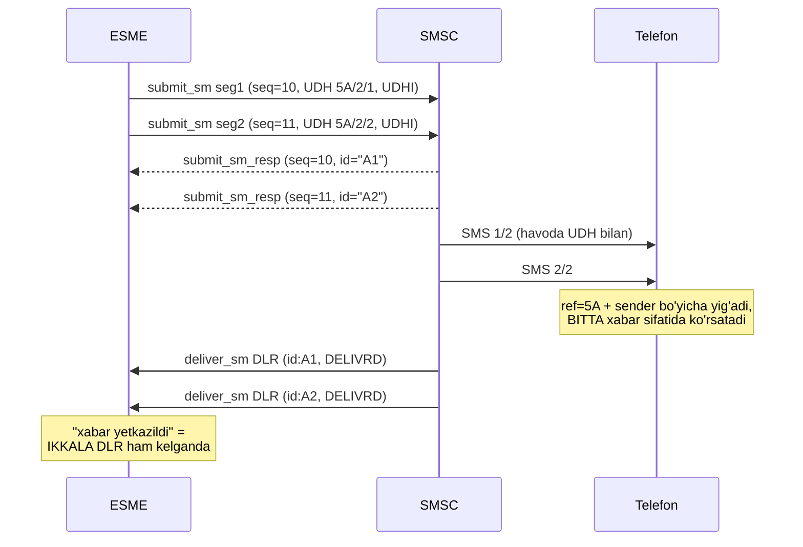
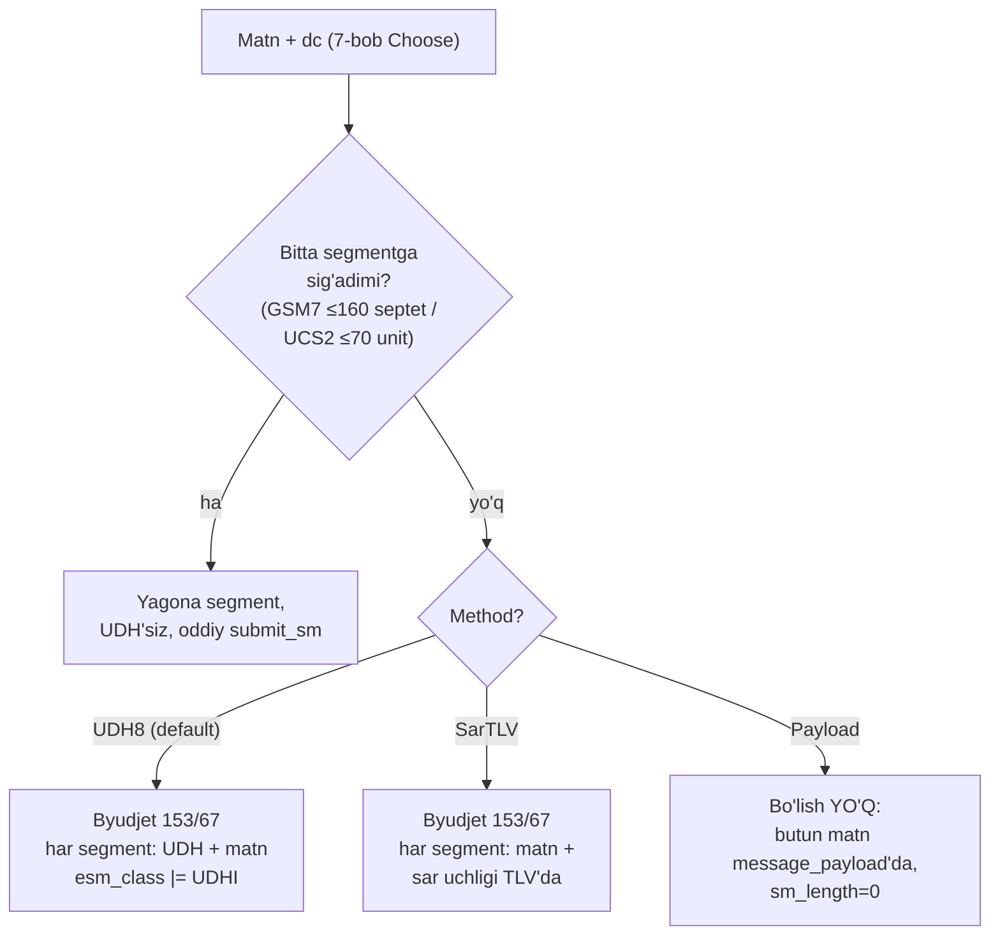

# 8-bob. Uzun xabarlar: concatenation

> **Bu bobda:** 161-belgilik xabarning taqdiri — uch bo'lish usuli (UDH, sar_* TLV, message_payload) byte darajasida, ularni qachon tanlash, chegara nozikliklari (extension juftligi, surrogate pair, ref kolliziyasi) va `coding` package'ining splitter'i. 7-bob matematikasi endi ishga tushadi.

SMS 140 oktetlik dunyo, foydalanuvchi matni esa bu ramkaga qaramaydi. 7-bobda ko'rdik: 161 belgilik GSM7 matn bitta segmentga sig'maydi. Endi savol: uni QANDAY bo'lib yuboramiz va telefon qanday qilib qayta yig'adi? SMPP bunga uchta javob beradi — biri GSM darajasida (UDH), biri SMPP metadata darajasida (sar_* TLV), biri "SMSC, o'zing hal qil" darajasida (message_payload). Uchalasini byte darajasida bilish shart: birinchisini o'zimiz yozamiz, qolgan ikkisini simda uchratganda taniymiz.

Avval umumiy mexanikani mahkamlaylik. Concatenated SMS'da har segment MUSTAQIL SMS sifatida yuboriladi va yetkaziladi — tarmoq ularni "bog'liq" deb bilmaydi. Yig'ish TELEFONDA bo'ladi, uch qiymat asosida: **reference number** (barcha segmentlarda bir xil — "bular bitta xabarning qismlari"), **total** (jami nechta) va **seqnum** (bu nechanchisi, 1'dan). Telefon segmentlarni ref + **yuboruvchi manzil** juftligi bo'yicha guruhlab, seqnum tartibida teradi va hammasi kelganda bitta xabar sifatida ko'rsatadi. Shu uch raqamni segmentlarga qanday ilova qilish — uch usulning farqi.

Nega usul UCHTA? Tarix qatlamlari: **UDH** birinchi — u GSM standartining o'zida (1990-yillar boshi), SMPP'dan mustaqil tug'ilgan; telefonlar faqat shuni tushunadi. **sar_* TLV'lar** v3.4 bilan keldi (1999): SMPP o'z metadata mexanizmini (TLV) olgach, "protokolning o'z darajasida ifodalash toza-ku" degan me'moriy istak tabiiy edi. **message_payload** ham v3.4'ning TLV to'lqinida — "254 oktet sig'mayapti" muammosiga eng dangasa javob sifatida. Natijada bitta ish uchun uch mexanizm — va ular ORTIDAGI yagona haqiqat baribir UDH: qaysi usulni tanlamang, havoga chiqishda xabar UDH'li segmentlarga aylanadi. Farq faqat KIM va QAYERDA aylantirishida.

Yana bir o'zgarmas qoida: **bitta xabarning barcha segmentlari BITTA data_coding'da ketadi.** 7-bobdagi `Choose` butun matn uchun bir marta chaqiriladi; "GSM7 qismini GSM7'da, kirill qismini UCS2'da" degan aralash segmentlash YO'Q — telefon segmentlarni baytma-bayt ulaydi, har xil encoding'dagi qismlarni birlashtira olmaydi.

## 8.1 UDH: GSM darajasidagi usul (default tanlov)

**UDH (User Data Header)** — ma'lumotni short_message'ning O'Z ICHIGA joylash: matn oldidan kichik binary sarlavha. Muhimi, UDH SMPP ixtirosi emas — u GSM havo interfeysining bir qismi (TS 23.040 §9.2.3.24), shuning uchun operatorlar zanjiridan O'ZGARMASDAN, end-to-end o'tadi. Shu xususiyati uni de-fakto standart qilgan.

SMPP tomonda ikkita majburiy qadam: (1) short_message = UDH baytlari + matn baytlari; (2) **esm_class'da UDHI flag (0x40)** o'rnatiladi (§5.2.12 Notes: "If an ESME encodes GSM User Data Header information in the short message user data, it must set the UDHI flag") — 5-bobdagi `WithUDHI()` endi ishga tushdi.

UDH'ning o'zi — IE (Information Element)'lar ro'yxati. Concatenation uchun ikki IE bor:

**IEI 0x00 — 8-bit reference (jami 6 oktet):**

| Oktet | Qiymat | Ma'nosi |
|---|---|---|
| 0 | `05` | UDHL — header'ning QOLGAN uzunligi (5 oktet) |
| 1 | `00` | IEI — Concatenated SM, 8-bit reference |
| 2 | `03` | IEDL — IE ma'lumot uzunligi (3 oktet) |
| 3 | `RR` | reference number — barcha segmentlarda BIR XIL |
| 4 | `TT` | jami segmentlar (1–255) |
| 5 | `SS` | segment raqami, 1'dan boshlanadi |

**IEI 0x08 — 16-bit reference (jami 7 oktet):**

| Oktet | Qiymat | Ma'nosi |
|---|---|---|
| 0 | `06` | UDHL = 6 |
| 1 | `08` | IEI — Concatenated SM, 16-bit reference |
| 2 | `04` | IEDL = 4 |
| 3–4 | `RR RR` | reference (big-endian 2 oktet) |
| 5 | `TT` | jami |
| 6 | `SS` | raqami |

Jonli misol — 161 ta 'a' harfli xabarning ikki segmenti (ref=0x5A; golden testdan):

```
seg1: 05 00 03 5A 02 01 | 61 61 61 ... (153 ta 'a')     esm_class=0x40
seg2: 05 00 03 5A 02 02 | 61 61 61 61 61 61 61 61        esm_class=0x40
```

To'liq protokol oqimi ikkala yo'nalishda qanday ko'rinishini ham ko'rib qo'yaylik — bitta uzun xabarning butun hayoti:



Diagrammadan uchta kuzatuv: har segment o'z sequence'i bilan MUSTAQIL submit_sm; har biriga ALOHIDA message_id qaytadi ("bitta xabar yubordim-ku, nega ikkita id?" — savoliga javob shu); va yetkazilganlik N ta DLR'ning YIG'INDISI — bittasi UNDELIV kelsa, xabar abonentda chala (ko'pincha umuman ko'rinmaydi). Billing ham segment boshiga: 161 belgilik xabar 2 SMS narxida — foydalanuvchiga "1 xabar" ko'rinadi, hisob-kitobda 2 birlik.

UDH concatenation'dan boshqa ishlarga ham yaraydi — IE ro'yxatida o'nlab tur bor: **port addressing (IEI 0x05)** — WAP push va binary ilova xabarlari uchun "port raqami" (SMPP'dagi source/destination_port TLV'larining havo interfeysidagi aksi), maxsus ringtone/logo formatlari (tarixiy) va boshqalar. Bizga muhimi: qabul qilgan UDH'imizda concat IE'dan TASHQARI IE'lar ham bo'lishi mumkin — parser ularni buzmasdan o'tkazib yuborishi kerak (`ParseUDH` shunday qiladi, testda port+concat kombinatsiyasi bor).

Limitlarga UDH ta'siri (7-bob isbotlarining davomi): 8-bit ref'da UDH 6 oktet oladi → GSM7 **153** / 8-bit **134** / UCS2 **67**; 16-bit ref'da 7 oktet → **152 / 133 / 66**. Bitta belgilik shu farq tufayli amalda **deyarli hamma 8-bit reference ishlatadi** — 256 qiymat yetarli (pastda ref kolliziyasiga qaytamiz). E'tibor: SMPP'da GSM7 unpacked yurgani uchun (7-bob) short_message uzunligi seg1'da 6+153=159 oktet — SMPP field'iga bemalol sig'adi, 140-oktet hisobi esa havo interfeysining ishi.

> **⚠ Amaliyotda — UDHI'ni unutish.** Eng klassik concat xatosi: UDH baytlari qo'yilgan, esm_class esa 0x00 qolgan. SMSC UDH'ni ODDIY MATN deb qabul qiladi va telefonga "matn" sifatida uzatadi — abonent xabar boshida `♦♦♦Z♦♦` uslubidagi g'alati belgilar ko'radi, xabar esa yig'ilmasdan alohida-alohida keladi. Teskarisi ham bor: UDHI bor-u UDH yo'q — telefon matnning birinchi baytlarini UDH deb yeb yuboradi. Bizning splitter UDH qo'ygan segmentda `Segment.UDH != nil` qaytaradi — client (13-bob) shu belgiga qarab UDHI'ni avtomatik o'rnatadi, unutish strukturaviy imkonsiz bo'ladi.

Muhim taqiq ham shu yerda (§5.2.12 Notes): **UDHI bilan sar_* TLV'larni yoki source/destination_port TLV'larni BIRGA ishlatish MUMKIN EMAS** — port addressing allaqachon UDH'ning o'z IE'si (0x05) orqali ifodalanadi, sar bilan UDH esa bitta ma'lumotning ikki nusxasi bo'lib qoladi. Ikkalasini birga yuborgan tizimlar qabul tomonida double-processing chalkashligiga sabab bo'ladi (Kannel ro'yxatlarida real case'lar bor) — usullardan BITTASINI tanlang.

## 8.2 sar_* TLV'lar: SMPP metadata darajasi

Ikkinchi usul UDH'siz ishlaydi: segment ma'lumoti short_message ichida emas, PDU'ning TLV tail'ida yuradi — 3-bob jadvalidan tanish uchlik (§5.3.2.22–24):

| TLV | Tag | Value | Qoida |
|---|---|---|---|
| `sar_msg_ref_num` | 0x020C | 2 oktet Integer | barcha segmentlarda bir xil |
| `sar_total_segments` | 0x020E | 1 oktet (1–255) | jami |
| `sar_segment_seqnum` | 0x020F | 1 oktet | 1'dan boshlab |

Temir qoida (§5.3.2.22): **uchchalasi BIRGA bo'lishi SHART** — bittasi yetishmasa qabul qiluvchi butun uchlikni "kelmagan" deb IGNORE qiladi (xato qaytarmaydi — jim!). esm_class'da UDHI KERAK EMAS — matn toza, metadata alohida. Bu usulning nazariy afzalligi ham shu: matn bilan boshqaruv ma'lumoti aralashmaydi. Amaliy zaifligi esa yo'lda: sar TLV'lar faqat SMPP dunyosida yashaydi — SMSC ularni havo interfeysiga chiqarishda baribir UDH'ga O'GIRISHI kerak, va zanjirdagi biror hop TLV'ni tashlab yuborsa (3-bobdagi "notanish TLV → ignore" qoidasi bu yerda dushmanga aylanadi!) segmentlar bog'lanmagan alohida SMS'lar bo'lib yetib boradi. Shu sabab sar_* faqat SMSC aniq qo'llashini tasdiqlaganda ishlatiladi.

Segment sig'imi masalasi ham nozik: sar segmentining matni SMSC tomonidan UDH qo'shib uzatilishini hisobga olib, xavfsiz hisob — UDH8 bilan bir xil byudjet (153/67). "TLV'da yuboryapman, demak 160 sig'adi" degan hisob SMSC'ni har segmentni QAYTA bo'lishga majburlashi mumkin — natijada abonentga kutilganidan ko'p SMS boradi.

## 8.3 message_payload: "SMSC, o'zing bo'l"

Uchinchi usul eng dangasasi: butun matnni **message_payload TLV**'siga (0x0424, §5.3.2.32) solib yuborasiz, sm_length=0 (3-bob mashqidagi qoida!), segmentlash SMSC zimmasida. Value hajmi "SMSC and network implementation specific" — 64K faqat TLV Length field'ining nazariy shifti, kafolat emas.

Qulaylik evaziga nazorat ketadi: ref/tartibni SMSC tanlaydi, qaysi chegarada bo'lishni u hal qiladi, va eng muhimi — **DLR semantikasi noaniqlashadi**: bitta submit_sm → bitta message_id, lekin havoda N segment. DLR nechta keladi? Vendor'ga bog'liq: ko'pchiligida bitta (butun xabar bo'yicha), ba'zilarida har segmentga. UDH usulida esa hamma narsa aniq: N submit_sm → N message_id → N DLR — har segmentning taqdiri alohida kuzatiladi (9-bobdagi "multipart DLR yig'ish" shu aniqlikka tayanadi).

message_payload'ning yana bir MAJBURIY qo'llanish holati borligini unutmang: short_message field'i 254 oktetdan oshiq matnni JISMONAN sig'dira olmaydi (sm_length 1 bayt, §5.2.21). UDH usulida bu limit hech qachon bosilmaydi (eng katta segment 6+153=159 oktet), lekin "butun matnni bitta PDU'da yuborish" kerak bo'lgan har qanday holatda 254+ oktetlik yuk uchun yagona transport — message_payload TLV. Ya'ni payload usuli sar'ning muqobili emas, alohida sig'im kategoriyasi hamdir.

## 8.4 Taqqoslash va tanlov

| Mezon | UDH | sar_* TLV | message_payload |
|---|---|---|---|
| Segmentlashni kim qiladi | ESME (biz) | ESME (biz) | SMSC |
| End-to-end yetib boradimi | **HA — havo interfeysining o'zi** | SMSC o'girishi kerak; TLV yo'lda yo'qolishi mumkin | SMSC o'zi UDH qo'yadi |
| Support darajasi | universal, de-fakto standart | SMSC'ga bog'liq | SMSC'ga bog'liq |
| DLR | har segmentga alohida (N ta) | har segmentga alohida | odatda bitta (vendor'ga bog'liq) |
| Nazorat (ref, chegara, tartib) | to'liq bizda | o'rtacha | minimal |

**Default tanlov — UDH (8-bit ref).** Aggregator hujjatlari konsensusi ham shu: operator zanjiridan o'zgarmasdan o'tadigan yagona usul. sar_* — SMSC hujjati aniq va'da berganda; message_payload — tez prototip yoki "SMSC'im shuni afzal ko'radi" holatlarida. Bizning `Split` uchchalasini ham beradi — tanlov `Method` parametri.

Uch stsenariyda qaror qanday ko'rinadi:

- **Ko'p operatorli production gateway** (bizning asosiy nishon): UDH8. Sabab: yagona kod yo'li hamma route'da ishlaydi, har segment DLR'i alohida kuzatiladi, ref nazorati bizda.
- **Bitta aniq SMSC, hujjatida "long message uchun message_payload yuboring" deyilgan**: payload — SMSC o'z tavsiyasi bilan yaxshiroq ishlaydi; lekin DLR semantikasini SINAB aniqlang (bitta kelyaptimi, N tami) va shuni korrelyatsiya kodiga yozing.
- **SMSC hujjati sar_*'ni qo'llashini aniq aytgan ichki/yopiq integratsiya**: sar ishlatish mumkin — matn toza qoladi; lekin oradan boshqa hop qo'shilishi bilanoq (aggregator almashdi, marshrut o'zgardi) UDH'ga qaytishga tayyor turing.

> **⚠ Amaliyotda — provider "hammasini qabul qiladi" degani bir xil ishlaydi degani emas.** Ko'p kommersial SMSC'lar uchchala usulni ham QABUL QILADI — lekin ichkarida baribir o'z usuliga o'giradi va shu o'girishda tafovutlar tug'iladi: sar'ni UDH'ga aylantirishda ref'ni O'ZI tanlaydi (sizning ref'ingiz yo'qoladi), payload'ni bo'lishda chegara qoidalari sizniki bilan mos kelmaydi (masalan surrogate chegarasini tekshirmaydigan eski SMSC). Integratsiya so'rovnomasiga qo'shiladigan savollar: "long message uchun qaysi usulni TAVSIYA qilasiz? sar'da ref saqlanadimi? payload'da DLR nechta?" — va 7-bobdagi jonli test-matritsaga "161 belgili GSM7 + 71 belgili UCS2 xabar" bandini qo'shing.



## 8.5 Chegara nozikliklari

**Ref kolliziyasi.** 8-bit ref — atigi 256 qiymat. Telefon segmentlarni ref + yuboruvchi manzil bo'yicha guruhlaydi: bitta sender'dan bitta abonentga PARALLEL ikkita uzun xabar ketsa va ref to'qnashsa — telefon ikki xabarning segmentlarini BITTAGA aralashtirib yig'adi (abrakadabra yoki "yig'ilmay qolgan" xabar). Davo: ref'ni **per-destination counter** bilan yuritish — har qabul qiluvchi uchun alohida ketma-ketlik (`RefCounter`). Global counter ham yomon emas, lekin bitta destination'ga 256 xabardan keyin aylanadi; per-dest'da kolliziya uchun BITTA abonentga qisqa vaqtda 256 uzun xabar kerak — real emas.

**Bo'linmas juftliklar.** GSM7'da extension belgi ESC+kod juftligi (7-bob) — chegara hisobida 2 septet va juftlik O'RTASIDAN BO'LINMAYDI: ESC segment oxirida, kod keyingisining boshida qolsa, birinchi segment "ESC bilan tugagan buzuq oqim", ikkinchisi esa boshqa belgi bilan boshlanadi. UCS2'da xuddi shu rol'da surrogate pair (emoji = 2 unit): o'rtasidan kesilsa ikkala segmentda ham yaroqsiz unit qoladi — telefon "kvadratcha" ko'rsatadi. Splitter'imiz RUNE darajasida ishlab har belgining narxini so'raydi (`runeCost`: extension→2 septet, BMP tashqarisi→2 unit) — sig'masa BUTUN belgi keyingi segmentga o'tadi. Ikkala chegara case ham alohida testda.

**Segment tartibi.** SMPP darajasida segmentlar tartibda YETIB BORISHI kafolatlanmagan — ayniqsa window > 1 bilan yuborilganda (12-bob) 2-segment 1-dan oldin SMSC'ga yetishi normal. Telefon uchun muammo emas (seqnum bo'yicha yig'adi), lekin ayrim eski SMSC'lar qabul tartibiga injiq — muammo chiqsa segmentlarni ketma-ket (javobini kutib) yuborish variant. Va MUHIM: **har segment o'z sequence_number'i bilan alohida submit_sm** (2-bob korrelyatsiyasi) — "bitta xabar, demak bitta seq" degan intuitsiya xato (gosmpp'da shu xato #178-issue bo'lgan; 12-bobda qaytamiz).

**Yo'qolgan segment va yig'ilish timeout'i.** Segmentlardan biri yetmasa nima bo'ladi? Telefon kelganlarini ref bo'yicha buferda ushlab, qolganini KUTADI — kutish muddati qurilmaga bog'liq (odatda daqiqalardan sutkagacha). Muddat o'tsa xulq yana qurilmaga bog'liq: ba'zilari kelgan qismlarni alohida SMS sifatida ko'rsatadi, ba'zilari jimgina tashlaydi. ESME nuqtai nazaridan bittagina himoya bor: har segmentning DLR'ini kuzatish — birortasi UNDELIV/EXPIRED bo'lsa, xabar chala; retry strategiyasi esa qiziq savol: BITTA segmentni qayta yuborish nazariy jihatdan ishlaydi (telefon ref bo'yicha qabul qiladi), lekin ref'ni to'g'ri takrorlash va vaqt oynasiga sig'ish kerak — amalda ko'p tizimlar butun xabarni (yangi ref bilan) qayta yuborishni afzal ko'radi.

### Qabul tomoni: uzun MO xabarlar

Concatenation ikkala yo'nalishda ishlaydi: abonent ham telefonidan uzun xabar yozishi mumkin — u ESME'ga **UDH'li bir nechta deliver_sm** bo'lib keladi (esm_class'da UDHI, har birida bir xil ref). Endi yig'ish BIZNING vazifamiz — `ParseUDH` aynan shu yerda ishga tushadi. Reassembly dizayni telefonnikiga o'xshaydi, server sharoitiga moslashadi:

1. **Kalit** — (source_addr, ref, total) uchligi: bir xil abonentdan parallel ikki uzun xabar farqlansin.
2. **Bufer** — kelgan segmentlar seq bo'yicha saqlanadi; deliver_sm_resp esa DARHOL qaytariladi (5-bob qoidasi — yig'ilishni kutmasdan!).
3. **Timeout** — qolgan segmentlar kelmasa buferni tozalash (aks holda xotira oqadi); muddat o'tganda qaror: chala matnni yuqoriga berish yoki tashlash — biznes tanlovi.
4. **Tartibsizlik normal** — seq=2 seq=1'dan oldin kelishi mumkin; bufer massiv/map, oqim emas.

Bu logika session/client qatlamiga tegishli (server holatli bufer talab qiladi) — 13-bobda `OnDeliver` oqimiga reassembly-helper sifatida qo'shish ixtiyoriy mashq bo'ladi; kerakli primitiv (`ParseUDH`) shu bobda tayyor bo'ldi.

### Yarim yo'lda xato: segmentlardan biri rad etilsa

Uzun xabar yuborishning eng noqulay stsenariysi — N segmentdan bir qismi qabul qilinib, bittasi rad etilishi: seg1 va seg3 status=0 oldi, seg2 esa RTHROTTLED yedi. Endi nima? Variantlar: (1) **seg2'ni retry qilish** (backoff bilan, XUDDI SHU ref bilan) — eng to'g'risi: telefon buferida seg1/seg3 kutib turibdi, seg2 yetib borsa xabar yig'iladi; (2) faqat transient bo'lmagan xatoda (RINVDSTADR kabi) — butun xabarni fail deb belgilash: qolgan segmentlarni yuborishda ham ma'no yo'q, ular abonent telefonida timeout'gacha osilib qoladi xolos. Amaliy soddalashtirish: segmentlarni KETMA-KET yuborib (har birining resp'ini kutib), birinchi permanent xatoda to'xtash — throughput'ni biroz yutqazasiz (12-bob window'i bir xabar ichida ishlamaydi), lekin "chala yuborilgan xabar" holatlari keskin kamayadi. Katta hajmda esa pipeline + per-segment retry siyosati (11-bob tasnifi bilan) — client dizayni shu tanlovni sozlanadigan qiladi (13-bob `SubmitLong`).

### Kuzatuv (monitoring) nuqtai nazari

Concat gateway metrikalariga ikki o'lchov qo'shadi (16-bobda to'liq ro'yxatga kiradi): **segment/xabar nisbati** — o'rtacha qiymatning keskin o'sishi kimdir limitdan sakraganini (yangi uzun shablon, normalizatsiya buzilgani — 7-bob) darrov ko'rsatadi; va **chala yetkazilgan multipart ulushi** — N segmentdan kamida bittasi UNDELIV/EXPIRED bo'lgan xabarlar foizi: bu ko'rsatkich oddiy DLR-success-rate'da ko'rinmaydi (4 tadan 3 tasi yetgan xabar 75% "muvaffaqiyat"dek tuyuladi, abonent uchun esa 0%). Billing tomonda ham segment haqiqati: hisobot "yuborilgan SMS" sonini segmentda yuritadi, mahsulot esa "xabar"da o'ylaydi — ikkala raqamni alohida ko'rsatish kelishmovchiliklarni oldini oladi.

> **⚠ Amaliyotda — barcha qismlar bitta yo'ldan.** Concatenated xabarning segmentlari **bitta system_id/session orqali, bitta route bilan** ketishi kerak — operator TZ'larida shu talab ochiq yoziladi. Sabab: telefon ref+sender bo'yicha yig'adi; segmentlar har xil route'dan borib sender har xil normalizatsiya qilinsa (6-bob: operator qayta yozishi!) yoki har xil SMSC orqali har xil vaqtda yetsa, yig'ilish buziladi. Load-balancer ortidagi multi-session gateway'da (16-bob) buni unutish — "uzun xabarlar ba'zan yig'ilmayapti" ko'rinishidagi izsiz bug.

## 8.6 Kod: udh.go va split.go

`coding` package ikki fayl bilan boyidi. UDH codec ixcham (`coding/udh.go`):

```go
// Encode UDH baytlarini qaytaradi:
//
//	8-bit:  05 00 03 RR TT SS
//	16-bit: 06 08 04 RR RR TT SS
func (u UDH) Encode() []byte {
	if u.Is16bit {
		return []byte{0x06, ieiConcat16, 0x04, byte(u.RefNum >> 8), byte(u.RefNum), u.Total, u.Seq}
	}
	return []byte{0x05, ieiConcat8, 0x03, byte(u.RefNum), u.Total, u.Seq}
}
```

`ParseUDH` esa qabul tomoni uchun: UDHL bo'yicha header chegarasini topadi, IE'lar ro'yxatini aylanib concat IE'sini (0x00/0x08) qidiradi, **notanish IE'larni jim o'tkazib yuboradi** (masalan WAP push'ning port addressing 0x05'i — testda aynan shu kombinatsiya bor) va header'dan keyingi toza payload'ni qaytaradi. TLV'lardagi kabi: tanimaganingni buzma, o'tkazib yubor.

Splitter'ning yuragi — belgi narxi bilan byudjet yurishi (`coding/split.go`):

```go
	var chunks []string
	var cur []rune
	used := 0
	for _, r := range text {
		cost, err := runeCost(r, dc)
		if err != nil {
			return nil, err
		}
		if used+cost > budget {
			chunks = append(chunks, string(cur))
			cur = cur[:0]
			used = 0
		}
		cur = append(cur, r)
		used += cost
	}
```

Oddiy greedy algoritm — lekin `runeCost` tufayli extension juftligi ham, surrogate pair ham hech qachon bo'linmaydi. `Split`ning shartnomasi: matn sig'sa — UDH'siz yagona segment (method nima bo'lishidan qat'i nazar — 160 belgilik matnga UDH qo'shib 2 segment qilish isrofgarchilik); sig'masa — metod bo'yicha UDH/sar/payload. Yordamchilar: `SarInfo.TLVs()` uchlikni PDU'ga tayyorlaydi, `SarFromTLVs` qabul tomonida spec qoidasini aynan bajaradi (chala uchlik → found=false, xato EMAS — testda qotirilgan), `CountSegments` esa 7-bobdagi narx savollariga bir qatorli javob: normalize + detect + split → (dc, n).

Byudjet konstantalari kodda o'z isbotlari bilan turadi — kitob bilan kod bir tilda gaplashsin:

```go
// Segment sig'imlari: hammasi havo interfeysining 140 oktetidan (7-bob).
const (
	singleGSM7  = 160 // septet
	singleUCS2  = 70  // 16-bit unit
	udh8GSM7    = 153 // (140-6)*8/7 = 153 (+1 fill bit)
	udh8UCS2    = 67  // (140-6)/2
	udh16GSM7   = 152 // (140-7)*8/7 = 152
	udh16UCS2   = 66  // (140-7)/2 = 66.5 → 66
	maxSegments = 255 // Total field'i 1 oktet
)
```

`RefCounter` esa ref kolliziyasi davosining kodlangan shakli — API'si ataylab destination'ni so'raydi:

```go
// Next dest uchun navbatdagi reference'ni qaytaradi (uint16 aylanib ketishi
// normal — muhimi qo'shni xabarlar farqli bo'lsin).
func (rc *RefCounter) Next(dest string) uint16 {
	rc.mu.Lock()
	defer rc.mu.Unlock()
	rc.m[dest]++
	return rc.m[dest]
}
```

Mutex bilan — chunki 12-bobdan boshlab submit oqimi ko'p goroutine'li bo'ladi va ref generatori ular orasida bo'linadi (`-race` testlarimiz shu kabi joylarni qo'riqlaydi). uint16 qaytaradi: UDH8'da quyi bayt ishlatiladi (256 qiymat per-dest — yetarli), UDH16/sar'da to'lig'icha.

Testlar chegaralarni qamraydi: 161 'a' → 2 segment golden UDH bilan (`05 00 03 5A 02 01`); 68 kirill belgi → 1 segment (70 sig'imga e'tibor!), 71 → 67+4; 152 'a'+'€' → € butun holda 2-segmentda; emoji 67-unit chegarasida butun ko'chadi; sar uchligi round-trip + chala uchlik ignore; payload — bo'linmasdan; RefCounter per-dest mustaqilligi.

```
$ cd code && go vet ./... && go test ./... -race
ok      smpp/coding
ok      smpp/pdu
ok      smpp/session
ok      smpp/smsc
ok      smpp/tlv
```

## Xulosa

Uzun xabar uch yo'ldan biri bilan ketadi: **UDH** (default — havo interfeysining o'zi, to'liq nazorat, har segmentga DLR), **sar_* TLV** (toza metadata, lekin yo'lda yo'qolish xavfi; uchlik BIRGA yoki hech biri), **message_payload** (qulay, nazoratsiz). Limitlar 7-bob matematikasidan: 153/134/67 (8-bit ref), 152/133/66 (16-bit). Chegaralarda uch dushman bor — ESC juftligi, surrogate pair va ref kolliziyasi — uchalasi ham splitter dizaynida hal qilingan. Va katta rasm: N segment = N mustaqil submit_sm = N message_id = N DLR — bu haqiqat keyingi bobning markaziy masalasiga olib kiradi: DLR'larni original xabar bilan TO'G'RI bog'lash.

**Takrorlash savollari** (javoblar matnda bor — o'zingizni tekshiring):

1. `05 00 03` bilan boshlangan short_message'da keyingi uch bayt nimani anglatadi?
2. Nega 16-bit reference amalda kam ishlatiladi?
3. sar uchligidan bittasi yetishmasa qabul qiluvchi nima qiladi va bu qaysi umumiy qoidaning xususiy holi?
4. UDH bilan sar_*'ni birga yuborish nega taqiqlangan?
5. Telefon segmentlarni qaysi IKKI qiymat bo'yicha guruhlaydi va bu ref kolliziyasiga qanday aloqador?
6. message_payload usulida DLR nechta keladi?
7. Splitter nega bayt emas, rune darajasida ishlaydi?

**Mashqlar:** [exercises/08-concat.md](../exercises/08-concat.md) — UDH'dan segment aniqlash, 300 belgilik UCS2 hisobi va unutilgan sar_total_segments savoli.

---

**Oldingi bob:** [7-bob. Text encoding](07-encoding.md) · **Keyingi bob:** [9-bob. Delivery receipt (DLR)](09-dlr.md) — DLR parsing, hex/decimal message_id balosi va korrelyatsiya.

## Manbalar

- [SMPP v3.4 spec, Issue 1.2](../resources/SMPP_v3_4_Issue1_2.pdf) — §5.2.12 (UDHI va taqiqlar), §5.3.2.22–24 (sar uchligi), §5.3.2.32 (message_payload)
- 3GPP TS 23.040 §9.2.3.24 — UDH IE strukturalari (normativ manba)
- Tashqi: Wikipedia Concatenated SMS (byte strukturalar), Nordic Messaging tech-notes (vendor taqqosi), Inetlab concatenation (kutubxona misollari), reassembly ref+sender kaliti bo'yicha aggregator hujjatlari — izohlangan ro'yxat: [resources/links.md](../resources/links.md)
