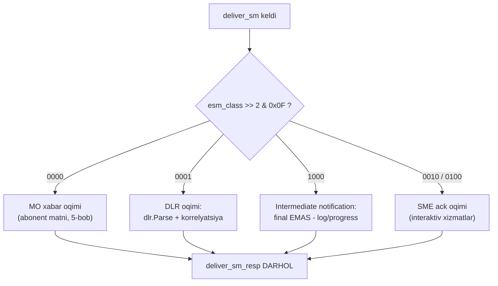
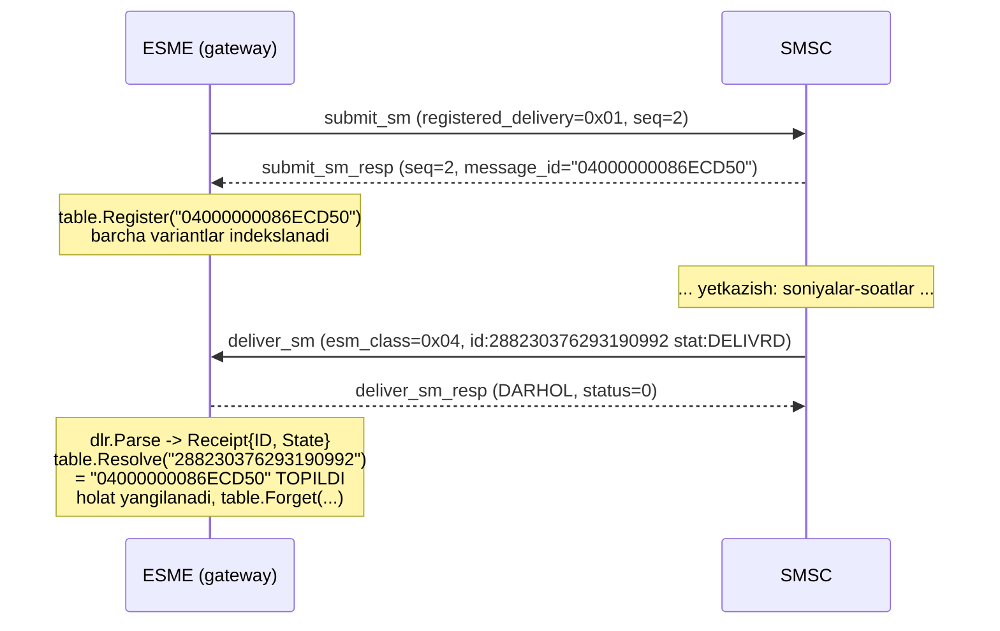

# 9-bob. Delivery receipt (DLR): so'rash, parse qilish, bog'lash

5-bobda devorga osib qo'ygan qoidamizni eslang: **submit_sm_resp status=0 "SMS yetkazildi" degani EMAS** — u faqat "SMSC navbatga oldi" degani. Xabarning haqiqiy taqdiri — telefonga yetdimi, validity tugab o'ldimi, operator rad etdimi — keyinroq, alohida xabar bilan keladi. O'sha xabar **SMSC Delivery Receipt (DLR)** deb ataladi va bu bob unga to'liq bag'ishlangan: DLR'ni qanday so'raladi, kelganda qanday taniladi, ichidagi matn qanday parse qilinadi va — eng muhimi, eng ko'p og'riq beradigani — DLR original xabar bilan qanday TO'G'RI bog'lanadi.

"Eng ko'p og'riq" — mubolag'a emas. DLR protokolning eng kam standartlashgan burchagi: receipt matni formati spec'ning o'zi tan olishicha **vendor-specific**, message_id esa submit javobida bir yozuvda (hex), DLR'da boshqa yozuvda (decimal) kelishi mumkin — va string solishtirishga qurilgan korrelyatsiya jimgina "yo'qolgan DLR"larga aylanadi. Bu bobda ikkala muammoni ham kod bilan hal qilamiz: `dlr` package — tolerant parser + hex/dec'ga chidamli korrelyatsiya jadvali. Bu PDU codec emas (deliver_sm'ni 5-bobdagi `pdu` package decode qiladi) — bu deliver_sm'ning short_message va TLV tail'i USTIDAGI biznes-mantiq, shuning uchun alohida package.

## 9.1 DLR'ni so'rash: registered_delivery (qisqa takror)

DLR o'z-o'zidan kelmaydi — uni submit_sm'ning `registered_delivery` baytida buyurtma qilasiz (v3.4 §5.2.17, batafsil 5-bobda). Eslatma jadvali:

| Bitlar | Qiymat | Ma'no |
|---|---|---|
| 1–0 | 00 | DLR so'ralmagan (default) |
| 1–0 | 01 | Final holatda DLR — muvaffaqiyat HAM, xato HAM (eng tipik: **0x01**) |
| 1–0 | 10 | Faqat XATO final holatida DLR |
| 3–2 | 01/10/11 | SME ack so'rovlari (interaktiv xizmatlar, 5-bob) |
| 4 | 1 | Intermediate notification (oraliq holat xabarlari) |

Va 5-bobdagi erratum eslatmasi shu yerda ham kuchda: **intermediate notification biti — spec sarlavhasida "bit 5", bit-jadvalida bit 4 (0x10)**. v3.4'ning ichki ziddiyati; amaliyot (cloudhopper, jSMPP) va v5.0 bo'yicha to'g'risi — **bit 4**. Bizning `RegisteredDelivery` helper'i ham 0x10 ishlatadi.

Intermediate notification'ni so'rasangiz, xabar final holatga yetmasidan (masalan telefon o'chiq, SMSC retry qilyapti — ENROUTE) ham deliver_sm'lar kelishi mumkin. Ular DLR'ga o'xshaydi, lekin esm_class'da boshqa message type ko'tarib yuradi (quyida) va **final emas** — ularga qarab "xabar yetdi/yetmadi" deb hukm chiqarmang. Spec'ning o'zi ogohlantiradi: intermediate notification support "SMSC implementation'ga xos" — hamma operator bermaydi.

## 9.2 DLR'ni tanish: deliver_sm'ning ikki yuzi

DLR alohida PDU emas — u **deliver_sm** sifatida keladi (§2.11): SMSC ESME'ga yuboradigan o'sha xabar formati, 5-bobda codec'ini yozganmiz. Bitta PDU turi ikki butunlay boshqa yukni tashiydi: abonentdan kelgan **MO xabar** va **DLR**. Ajratish kaliti — esm_class'ning Message Type bitlari (5–2):

```go
// code/pdu/esm.go (5-bob):
// MessageType — deliver yo'nalishidagi type bitlari (5-2).
func (e EsmClass) MessageType() uint8 { return uint8(e>>2) & 0x0F }

// IsDeliveryReceipt — deliver_sm DLR'mi (bit 5-2 == 0001).
func (e EsmClass) IsDeliveryReceipt() bool { return e.MessageType() == 0x01 }
```

| Message Type (bit 5–2) | Qiymat | Ma'no |
|---|---|---|
| 0000 | 0x00 | MO xabar — abonent matni |
| 0001 | 0x04 (bayt ko'rinishida) | **SMSC Delivery Receipt** |
| 0010 | 0x08 | SME Delivery Ack |
| 0100 | 0x10 | SME Manual/User Ack |
| 1000 | 0x20 | **Intermediate Delivery Notification** |

5-bobdagi ogohlantirishning takrori (chunki bu sanoatdagi eng keng tarqalgan DLR bug'i): **butun baytni solishtirmang**. `esm_class == 0x04` degan kod UDHI flag bilan kelgan DLR'da (0x44) sinadi — to'g'ri usul faqat bit maydonini ajratish: `(esm_class >> 2) & 0x0F == 0x01`.

DLR'da yana bir muhim tafsilot — **manzillar ALMASHGAN** (§2.11 mantiqi: receipt "abonent tomonidan sizga qaytayotgan xabar"): DLR'ning source_addr'i — original xabarning DESTINATION'i (abonent raqami), destination_addr'i — original SOURCE (sizning sender'ingiz). Buni bilmasangiz "998901234567 bizga nimadir yuboribdi" deb MO oqimga adashtirib yuborasiz.

Yakuniy dispatch mantiqi (12–13-boblarda handler'ga aylanadi):



Qaysi tarmoqqa tushishidan qat'i nazar oxirgi qadam bir xil: **deliver_sm_resp darhol qaytariladi** — bu bobning oxirida alohida "⚠ Amaliyotda" bloki bor.

## 9.3 Appendix B: receipt matni anatomiyasi

DLR'ning asosiy yuki — short_message field'idagi matn. v3.4 Appendix B uni shunday tasvirlaydi:

```
id:IIIIIIIIII sub:SSS dlvrd:DDD submit date:YYMMDDhhmm done date:YYMMDDhhmm stat:DDDDDDD err:E Text:.........
```

Va shu yerda butun bobning eng muhim jumlasi turadi — spec'ning O'ZINIKI: *"The format for this Delivery Receipt message is **SMSC vendor specific** but following is a typical example"*. Ya'ni Appendix B — **normativ EMAS, shunchaki namuna**. Bu bitta jumla parser dizaynining butun falsafasini belgilaydi: qat'iy format kutish mumkin emas, parser TOLERANT bo'lishi shart. Real SMSC'lar field tashlab ketadi, tartibni o'zgartiradi, `Text:` o'rniga `text:` yozadi, sanaga soniya qo'shadi, `stat:`ga "DELIVRD" o'rniga "DELIVERED" yozadi — bularning bari "buzuq DLR" emas, shunchaki "boshqa vendor".

Table B-1 bo'yicha field'lar (bizning izohlar bilan):

| Field | Spec o'lchami | Ma'no | Amaliy izoh |
|---|---|---|---|
| `id:` | 10, C-Octet **Decimal** | SMSC bergan message_id (submit paytidagi) | Amalda 10 belgidan uzun va HEX ham keladi — "aniq 10 belgi decimal" deb parse qilish xato (9.6-bo'lim dramasi) |
| `sub:` | 3, Decimal | Nechta SM submit qilingan | Leading zero bilan: `001`; submit_multi/distribution list uchun >1 |
| `dlvrd:` | 3, Decimal | Nechta SM yetkazilgan | `000` — ma'noli qiymat ("hech biri yetmadi"), "yo'q" bilan adashtirmang |
| `submit date:` | 10 | Qabul qilingan vaqt `YYMMDDhhmm` | Sekundli 12-belgili variantlar keng tarqalgan; timezone spec'da YO'Q — operator lokali |
| `done date:` | 10 | Final holatga yetgan vaqt | Format o'sha |
| `stat:` | 7 | Final holat qisqartmasi (Table B-2) | 7 belgidan uzun variantlar uchraydi (DELIVERED) |
| `err:` | 3 | Network/SMSC xato kodi | **Operator-specific** — universal jadvali YO'Q (§ pastda) |
| `text:` | 20 | Original matnning boshi | Faqat ma'lumot uchun; ko'p SMSC umuman yubormaydi |

Baytlarda qanday ko'rinishini 5-bobdagi 175-oktetlik golden deliver_sm'imizning receipt qismida ko'ramiz (to'liq frame dump'i 5-bobda; baytlar `code/pdu/submit_deliver_test.go`dagi `TestDeliverSMDLRGolden`da qotirilgan, matn esa shu bobning `code/dlr/receipt_test.go`sida ham xuddi shu konstantada):

```
67                                            <- sm_length = 103
69 64 3A 37 46 33 41 39 42 20                 <- "id:7F3A9B "
73 75 62 3A 30 30 31 20                       <- "sub:001 "
64 6C 76 72 64 3A 30 30 31 20                 <- "dlvrd:001 "
73 75 62 6D 69 74 20 64 61 74 65 3A           <- "submit date:"
32 36 30 37 31 37 31 32 30 35 20              <- "2607171205 "
64 6F 6E 65 20 64 61 74 65 3A                 <- "done date:"
32 36 30 37 31 37 31 32 30 36 20              <- "2607171206 "
73 74 61 74 3A 44 45 4C 49 56 52 44 20        <- "stat:DELIVRD "
65 72 72 3A 30 30 30 20                       <- "err:000 "
74 65 78 74 3A 53 61 6C 6F 6D                 <- "text:Salom"
00 1E 00 07 37 46 33 41 39 42 00              <- TLV receipted_message_id="7F3A9B"
04 27 00 01 02                                <- TLV message_state=2 (DELIVERED)
04 23 00 03 03 00 00                          <- TLV network_error_code: GSM(3), kod 0
```

Uch narsaga e'tibor bering. Birinchi: receipt matni — oddiy ASCII, data_coding o'yinlari yo'q (spec Appendix B shunday nazarda tutadi; matn qismini `string(shortMessage)` deb o'qish xavfsiz). Ikkinchi: `id:7F3A9B` — 2-bobdan beri davom etayotgan golden zanjirimiz: submit_sm_resp (5-bob) bergan message_id aynan shu. Uchinchi: matndan KEYIN uchta TLV keladi — 3-bobdagi golden TLV tail'imiz aynan shu edi. Kitob baytlari bir-biriga ulanishda davom etyapti.

## 9.4 message_state va stat: — raqamlar va qisqartmalar

Xabar holati protokolda ikki ko'rinishda yashaydi: **raqam** (§5.2.28 Table 5-6 — message_state TLV'sida va query_sm javobida) va **7 belgilik qisqartma** (Appendix B Table B-2 — stat: matnida). To'liq mos jadval:

| Holat | Raqam (§5.2.28) | Qisqartma (B-2) | Final? | Ma'no |
|---|---|---|---|---|
| ENROUTE | 1 | — (B-2'da YO'Q) | yo'q | Yo'lda — yagona "tirik" no-final holat |
| DELIVERED | 2 | `DELIVRD` | **ha** | Telefonga yetdi |
| EXPIRED | 3 | `EXPIRED` | **ha** | Validity tugadi, yetmadi |
| DELETED | 4 | `DELETED` | **ha** | SMSC/operator o'chirdi (masalan cancel_sm) |
| UNDELIVERABLE | 5 | `UNDELIV` | **ha** | Yetkazib BO'LMAYDI (raqam yo'q, bloklangan) |
| ACCEPTED | 6 | `ACCEPTD` | yo'q* | "Operator nomidan qabul qilindi" — g'alati oraliq holat |
| UNKNOWN | 7 | `UNKNOWN` | yo'q* | SMSC ham bilmaydi |
| REJECTED | 8 | `REJECTD` | **ha** | Qabul qilinib, keyin rad etildi |

ENROUTE'ning B-2'da yo'qligi bejiz emas: DLR final holat haqida xabar beradi, ENROUTE esa final emas — u faqat intermediate notification va query_sm javoblarida uchraydi. ACCEPTD esa (*) amaliyotning kulgili burchagi: spec uni "customer service qo'lda qabul qildi" deb ta'riflaydi, real operatorlarda esa "telefonga emas, lekin qabul markaziga/hamkor tarmoqqa topshirildi" ma'nosida keladi — ba'zi route'larda xabar ACCEPTD'da to'xtab qoladi va boshqa DLR kelmaydi. Uni DELIVERED deb sanash — hisobotlardagi klassik xato; UNKNOWN bilan birga ikkalasini "noaniq, final emas" toifasida saqlang va route sifati metrikasida alohida ko'rsating.

Kodda bu jadval `dlr.MessageState` bo'lib yashaydi (`code/dlr/state.go`): qiymatlar 1–8, zero qiymat "holat yo'q" (spec'da 0 ishlatilmagan — bo'sh qiymat uchun qulay); `Final()` — beshta final holat; `Abbrev()` — B-2 qisqartmasi; va eng muhimi, tolerant teskari mapping:

```go
// StateFromStat DLR matnidagi stat: qiymatini MessageState'ga aylantiradi.
// Tolerant: katta-kichik farqsiz va PREFIKS bo'yicha — chunki vendor'lar
// "DELIVRD" o'rniga "DELIVERED", "REJECTD" o'rniga "REJECTED" yozib yuboradi
// (format Appendix B bo'yicha normativ emas). Tanilmasa 0 qaytadi.
func StateFromStat(stat string) MessageState {
	u := strings.ToUpper(strings.TrimSpace(stat))
	switch {
	case strings.HasPrefix(u, "DELIV"):
		return StateDelivered
	case strings.HasPrefix(u, "EXPIR"):
		return StateExpired
	...
```

Prefiks bo'yicha solishtirish — aggregator amaliyotidan olingan qoida: "DELIV bilan boshlangan hamma narsa delivered" (Adobe Campaign hujjatlaridagi kabi). `==` bilan qat'iy solishtirsangiz birinchi "DELIVERED" yozadigan operator'da hisobot nolga tushadi.

## 9.5 TLV'lar: strukturali haqiqat manbai

Spec mualliflari Appendix B'ning ojizligini bilishgan — shuning uchun v3.4'da DLR ma'lumotini STRUKTURALI uzatish yo'li ham bor (Table 5-7; 3-bobda codec'ini yozganmiz):

| TLV | Tag | Value | Spec talabi |
|---|---|---|---|
| `receipted_message_id` | 0x001E | C-Octet String, max 65 — original message_id | DLR va Intermediate'da "SHART" |
| `message_state` | 0x0427 | 1 oktet Integer (§5.2.28 raqamlari) | DLR va Intermediate'da "SHART" |
| `network_error_code` | 0x0423 | 3 oktet: network type (1=ANSI-136, 2=IS-95, 3=GSM) + 2 oktet kod | Ixtiyoriy — xato tafsiloti |

"SHART" yana qo'shtirnoqda — 5-bobda aytganimizdek, bu spec talabi-yu, amaliyot emas: **ko'p real SMSC'lar TLV'siz, faqat matnli DLR yuboradi** (shuning uchun matn parser'idan qochib bo'lmaydi). Lekin teskari xato ham keng tarqalgan: TLV kelgan-u, kod faqat matnga qaraydi. Undan ham yomoni — ikkalasi kelib, BIR-BIRIGA ZID bo'lishi: matndagi `id:` kesilgan (10 belgi limitiga sig'dirilgan), TLV'dagi to'liq; matnda stat yo'q, TLV'da bor.

Qoidamiz qat'iy va bir yo'nalishli: **TLV bor bo'lsa — TLV haqiqat manbai, matn faqat to'ldiruvchi.** Sabab: TLV strukturali (parse xatosi deyarli mumkin emas), encoding'ga bog'liq emas va spec'ning "to'g'ri yozilgan SMSC" ta'rifiga mos. Bizning `Parse` aynan shu tartibda ishlaydi: avval matn skan qilinadi, keyin TLV'lar USTIGA yoziladi.

## 9.6 Katta dard: message_id hex'mi, decimal'mi?

Endi bobning "drama" qismi. 5-bobda message_id'ga ikki temir qoida bergan edik: **opaque** (formatiga taxmin qilmang) va **saqlang** (DLR korrelyatsiyasi uchun kalit). Endi nima uchun "raqamga o'xshab turibdi-ku" yo'li jarlikka olib borishini ko'rasiz.

Stsenariy (minglab integratsiyada takrorlangan): submit_sm_resp'da SMSC sizga `04000000086ECD50` qaytardi. Siz uni bazaga yozdingiz. Bir daqiqadan keyin DLR keldi: `id:288230376293190992`. String solishtirasiz — mos emas. DLR "yo'qoldi", xabar hisobotda abadiy "yuborilgan, holati noma'lum" bo'lib qoladi. Holbuki ikkalasi **bir xil son**: `0x04000000086ECD50 == 288230376293190992` — SMSC submit javobida hex, DLR matnida decimal yozgan, xolos.

Bu ekzotika emas, hujjatlangan sanoat dardi:

- **Kannel bug #334** — "SMPP Message IDs break delivery report if they are hexadecimal": Kannel'ga auto-detect patch kiritilgan (id faqat raqamlardan iboratmi — decimal, aks holda hex deb o'qib, ikkala formatda lookup) va konfiguratsiyaga `msg-id-type` bayrog'i qo'shilgan (0x01: resp hex / DLR decimal kabi kombinatsiyalar uchun).
- **Vonage/Nexmo**'da "DLR Format Message Id is Hex" — alohida ACCOUNT SETTING: operator'dan so'rab yoqtirasiz/o'chirasiz. Ya'ni bir xil SMSC turli account'larga turli formatda DLR yuborishi mumkin!
- Appendix B'ning o'zi chalkashlikka hissa qo'shadi: `id:` field'ini "Decimal" deb e'lon qiladi — resp'dagi message_id esa hech qanday formatga bog'lanmagan opaque string. Spec'ga sodiq SMSC resp'da hex berib, Appendix B'ga sodiq bo'lib DLR'da decimal yozsa — ikkalasi ham "to'g'ri" ishlagan bo'ladi.

Yechim — Kannel yondashuvining umumlashtirilgani: id'ning barcha aqlga sig'adigan talqinlarini chiqarib, lookup'ni shu variantlar to'plami bo'yicha qilish (`code/dlr/correlate.go`):

```go
// NormalizeID id'ning lookup uchun kanonik variantlarini qaytaradi:
//
//   - id'ning o'zi (katta harfga keltirilgan — hex registri farq qilmasin);
//   - faqat raqamlardan iborat bo'lsa: decimal deb o'qib hex yozuvi
//     (va juft uzunlikka yetkazish uchun "0" prefiksli varianti — SMSC'lar
//     hex id'ni bayt chegarasiga to'ldirib yozadi);
//   - valid hex bo'lsa: hex deb o'qib decimal yozuvi.
func NormalizeID(id string) []string
```

Ikki nozik tafsilotga e'tibor bering. Birinchi: konversiya `math/big` bilan — message_id 65 belgigacha, `uint64`ga sig'maydi (Kannel ham 32-bit mashinalarda aynan shu overflow'ga qoqilgan — bug #345). Ikkinchi: **leading zero muammosi** — `288230376293190992`ni hex'ga o'girsangiz `4000000086ECD50` chiqadi (15 belgi), SMSC esa `04000000086ECD50` yozgan edi (16 belgi, bayt chegarasiga to'ldirilgan). Shuning uchun NormalizeID juft uzunlikka "0" qo'shilgan variantni HAM qaytaradi, va teskari yo'nalish uchun leading-zero'lari kesilgan variantni ham. Bu raqamlar test'da python bilan tekshirib qotirilgan (`TestNormalizeID`).

Lookup tomonini `Table` yig'ib beradi — thread-safe korrelyatsiya jadvali:

```go
// Register submit_sm_resp'dan kelgan message_id'ni jadvalga kiritadi.
func (t *Table) Register(messageID string)

// Resolve DLR id'sini kanonik message_id'ga qaytaradi.
func (t *Table) Resolve(dlrID string) (string, bool)

// Forget yakuniy DLR qabul qilingandan keyin jadvalni tozalaydi.
func (t *Table) Forget(messageID string)
```

Register har variant → kanonik id mapping'ini yozadi; Resolve kelgan DLR id'sining O'Z variantlarini ham chiqarib qidiradi — shunda ikkala tomon qaysi yozuvda bo'lishidan qat'i nazar uchrashadi. Forget — oddiy, lekin unutilsa production'da xotira oqizadigan tafsilot: final DLR kelib bo'lgach entry'ni o'chirish kerak, aks holda uzoq yashaydigan gateway'da jadval cheksiz o'sadi. (Bizning in-memory Table — o'quv minimal; real gateway'da bu mapping Redis/PG'da yashaydi, lekin kalitlash printsipi aynan shu.)

To'liq oqim endi shunday ko'rinadi:



## 9.7 Kod: tolerant parser

Endi parserning o'zi. Uslubimiz bo'yicha avval testni ko'ramiz — parser NIMANI yeya olishi kerakligi testda hujjatlangan (`code/dlr/receipt_test.go`, qisqartirilgan):

```go
// Turli operator formatlari — research'dagi real og'ishlar asosida.
func TestParseOperatorVariants(t *testing.T) {
	tests := []struct {
		name string
		text string
		want Receipt
	}{
		{
			// Appendix B'ning "tipik misoli" — 5-bob golden DLR'i.
			name: "appendix-b-canonical",
			text: goldenReceiptText,
			...
		},
		{
			// Tartib boshqacha (stat oldinda), text: umuman yo'q.
			name: "reordered-no-text",
			text: "stat:DELIVRD err:000 id:ab021099504969 sub:001 dlvrd:001 submit date:1704181518 done date:1704181519",
			...
		},
		{
			// Sekundli sana + sub/dlvrd tashlab ketilgan (real vendor case).
			name: "seconds-date-missing-sub",
			text: "id:1526758174 submit date:170124090433 done date:170124090455 stat:DELIVRD err:000 text:hellow",
			...
		},
		{
			// Katta-kichik harf aralash, to'liq nom "DELIVERED", err harfli.
			name: "case-insensitive-long-stat",
			text: "ID:0D9A2F Sub:001 Dlvrd:001 Submit Date:2607181200 Done Date:2607181201 Stat:DELIVERED Err:00A Text:OK",
			...
		},
```

Beshta turli "operator" — bitta parser. Natija struct'i va asosiy kirish nuqtasi (`code/dlr/receipt.go`):

```go
// Receipt — bitta DLR'dan ajratib olingan ma'lumot. Matn (Appendix B uslubi)
// va TLV'lar birga hisobga olinadi; TLV bor bo'lsa — u haqiqat manbai.
type Receipt struct {
	ID    string       // original xabar message_id'si (TLV ustun, keyin id:)
	State MessageState // yakuniy holat (TLV ustun, keyin stat:); 0 = topilmadi

	// Matn field'lari — topilmagani uchun Sub/Dlvrd = -1 (0 ma'noli qiymat:
	// "dlvrd:000" = hech biri yetmadi), sanalar zero time.Time.
	Sub        int       // sub: — nechta qism submit qilingan
	Dlvrd      int       // dlvrd: — nechta qism yetkazilgan
	SubmitDate time.Time // submit date: — YYMMDDhhmm yoki YYMMDDhhmmss
	DoneDate   time.Time // done date:
	Stat       string    // stat: — xom matn (State unga tolerant mapping)
	Err        string    // err: — operator-specific kod; universal jadvali YO'Q
	Text       string    // text: — original matnning boshi (faqat ma'lumot)

	NetErr *tlv.NetworkError // network_error_code TLV'si kelgan bo'lsa
}

func Parse(shortMessage []byte, tlvs []tlv.TLV) (Receipt, error)
```

API dizaynidagi qarorlar va sabablari:

- **`Sub`/`Dlvrd` uchun -1 = "topilmadi"**: `dlvrd:000` (hech biri yetmadi) bilan "dlvrd umuman kelmadi"ni farqlash kerak — Go zero-value bu yerda dushman, shuning uchun aniq sentinel.
- **`Stat` xom saqlanadi, `State` alohida**: hisobotda "operator aynan nima yozgani" kerak bo'ladi (ayniqsa notanish stat qiymatlarini o'rganish uchun), mantiq esa raqamli State bilan ishlaydi.
- **Xato faqat bitta holatda**: kirishda umuman receipt belgisi bo'lmasa (`ErrNotReceipt`). Yarim-yorti, buzuq, qisqartirilgan DLR — XATO EMAS, qisman to'lgan Receipt: buzuq `sub:` shunchaki tashlanadi, buzuq sana zero time bo'ladi. Sabab: DLR'da xato qaytarib hech narsa yutmaysiz — SMSC uni qayta yubormaydi (deliver_sm_resp'ni baribir 0 bilan qaytargansiz), yig'lab o'tirgandan ko'ra topilganini olish foydali. `ErrNotReceipt` esa boshqa kasallikni ushlaydi: esm_class tekshirilmasdan MO xabar DLR parser'ga kelib qolgan.

Matn skaneri — tartibga bog'lanmaslikning kaliti: har kalitning matndagi pozitsiyasi topiladi, pozitsiya bo'yicha saralanadi va qiymat "keyingi kalitgacha" deb olinadi:

```go
// Matnda qidiriladigan kalitlar. Bir kalitning bir nechta imlosi bor —
// format vendor-specific, "submit_date" yoki "sub date" yozadiganlar uchraydi.
var receiptKeys = []struct {
	name  string // kanonik nom
	forms []string
}{
	{"id", []string{"id:"}},
	{"sub", []string{"sub:"}},
	{"dlvrd", []string{"dlvrd:"}},
	{"submitdate", []string{"submit date:", "submit_date:", "sub date:"}},
	{"donedate", []string{"done date:", "done_date:", "donedate:"}},
	{"stat", []string{"stat:", "status:"}},
	{"err", []string{"err:"}},
	{"text", []string{"text:"}},
}
```

Bitta nozik joy — kalitni istalgan joydan qidirsangiz `resubmit:` ichidan `sub:`ni, `receipted_id:` ichidan `id:`ni "topib" olasiz. Shuning uchun kalit faqat **token boshida** qabul qilinadi (satr boshi yoki oldingi belgi harf-raqam emas):

```go
// indexKey kalitni faqat token BOSHIda qidiradi: yo satr boshi, yo oldingi
// belgi harf-raqam emas.
func indexKey(lower, key string) int {
	from := 0
	for {
		i := strings.Index(lower[from:], key)
		if i < 0 {
			return -1
		}
		i += from
		if i == 0 || !isAlnum(lower[i-1]) {
			return i
		}
		from = i + 1
	}
}
```

Sana parseri ikkala formatni oladi va timezone haqidagi haqiqatni doc-comment'da ochiq aytadi:

```go
// parseReceiptDate YYMMDDhhmm (10) yoki YYMMDDhhmmss (12) raqamli formatni
// o'qiydi. DIQQAT: timezone spec'da YO'Q — operator o'z lokal vaqtini yozadi;
// biz UTC deb qaytaramiz, real integratsiyada offset operator bilan
// kelishiladi.
```

Bu mayda ko'ringan, lekin hisobotlarda doim chiqadigan masala: `done date:` operator SMSC'sining lokal vaqti — sizning serveringiz UTC+5'da bo'lsa va operator UTC'da yozsa, "SMS kecha yetdi"mi yoki "bugun"mi degan savol 5 soatga suriladi. Spec yordam bermaydi; operator bilan kelishiladi (16-bobdagi integratsiya so'rovnomasiga kiradi).

Va yakuniy yig'uvchi — TLV ustuvorligi bilan:

```go
func Parse(shortMessage []byte, tlvs []tlv.TLV) (Receipt, error) {
	r := Receipt{Sub: -1, Dlvrd: -1}
	found := r.parseText(string(shortMessage))

	// TLV'lar — ustuvor manba (§5.3.2.12, §5.3.2.35): matn bilan zid kelsa
	// TLV yutadi, chunki u strukturali va encoding'ga bog'liq emas.
	if t, ok := tlv.Find(tlvs, tlv.ReceiptedMessageID); ok {
		if id, err := t.CStringValue(); err == nil && id != "" {
			r.ID = id
			found = true
		}
	}
	if t, ok := tlv.Find(tlvs, tlv.MessageState); ok {
		if v, err := t.Uint8Value(); err == nil {
			r.State = MessageState(v)
			found = true
		}
	}
	if t, ok := tlv.Find(tlvs, tlv.NetworkErrorCode); ok {
		if ne, err := t.NetworkError(); err == nil {
			r.NetErr = &ne
		}
	}

	// TLV holat bermagan bo'lsa — stat: matnidan tolerant mapping.
	if r.State == 0 && r.Stat != "" {
		r.State = StateFromStat(r.Stat)
	}
	if !found {
		return r, ErrNotReceipt
	}
	return r, nil
}
```

`TestParseTLVPriority` bu tartibni qotiradi: matn ataylab `id:7F3A9B stat:DELIVRD` deydi, TLV'lar `TLVID99`/`EXPIRED` — natijada TLV yutadi, matn field'lari esa xom holida saqlanib qoladi.

## 9.8 Multipart xabar va DLR: N segment = N receipt

8-bobning yakuniy haqiqati shu yerda amaliy masalaga aylanadi: UDH (yoki sar_*) bilan yuborilgan 3 segmentli xabar — bu SMSC ko'zida **3 MUSTAQIL xabar**: 3 submit_sm, 3 message_id, 3 alohida DLR. "Xabar abonentga yetdi" degan biznes-hukm faqat **barcha segment DLR'lari** DELIVRD bo'lganda chiqariladi. Amaliy oqibatlar:

- Korrelyatsiya jadvalida har segment message_id'si alohida Register qilinadi, biznes-daraja esa "xabar → segment id'lari to'plami" mapping'ini yuritadi (message_id → xabar+segment raqami).
- Segmentlar DLR'lari **tartibsiz va katta vaqt farqi bilan** keladi: 1- va 3-segment bir soniyada DELIVRD, 2-segment telefon qayta yoqilganda — ertaga. "Birinchi DLR keldi = xabar yetdi" deb hisoblash noto'g'ri hisobot beradi.
- Aralash natija bo'lishi mumkin: 2 segment DELIVRD, 1 segment EXPIRED — xabar abonentda "kesik" ko'rinadi. Buni qanday hisoblash (delivered? failed? partial?) — biznes qaror; muhimi, protokol darajasida bu holat NORMAL.
- message_payload orqali yuborilgan bo'lsa (SMSC o'zi segmentlagan) — ko'pincha BITTA DLR keladi (SMSC'ga bog'liq): qulaylik, lekin segment-darajali ko'rinishni yo'qotasiz.

> **⚠ Amaliyotda — DLR submit_sm_resp'dan OLDIN kelishi mumkin.** Bu paradoks emas, real production case (12-bobda tahlil qilinadigan gateway'da kuzatilgan): siz submit_sm yubordingiz, SMSC ichkarida xabarni qabul qilib yetkazdi ham, DLR'ni boshqa TCP session (receiver bind) orqali yubordi — u sizning resp'ingizni tashiyotgan session'dan TEZROQ yetib keldi. Yoki: resp kelgan-u, uni bazaga yozadigan worker navbatda turibdi, DLR handler esa allaqachon Resolve qilmoqchi. Ikkala holda ham korrelyatsiya jadvalida id hali yo'q — naive kod DLR'ni "notanish" deb tashlab yuboradi. Davolar: (1) topilmagan DLR'ni DARHOL tashlamaslik — qisqa TTL bilan "kutish xonasi"ga qo'yib, resp kelgach qayta Resolve qilish; (2) resp'ni qabul qilish yo'lini sinxron qilish (bazaga yozilmaguncha keyingi ishga o'tmaslik) va DLR handler'da retry. Eng yomoni — bu race haqida bilmaslik: u kamdan-kam otadi va "ba'zi DLR'lar yo'qoladi" degan sirli bug bo'lib yashaydi.

> **⚠ Amaliyotda — deliver_sm_resp'ni HECH QACHON kechiktirmang.** 5-bobda aytilgan qoidaning DLR-maxsus takrori, chunki eng ko'p shu yerda buziladi: DLR keldi → parse → korrelyatsiya → bazaga yozish → webhook otish... va resp shu zanjirning OXIRIDA. Bunday kodda baza sekinlashsa resp'lar kechikadi, SMSC javobsiz deliver_sm'larni qayta yuboradi (duplicate DLR!) yoki window'si to'lib session'ni uzadi (12-bob kaskadi). To'g'ri tartib: **resp read path'da sinxron va DARHOL; parse/korrelyatsiya/baza — bounded queue orqali async.** Duplicate DLR kelganda esa (retry tufayli baribir keladi!) Resolve+Forget juftligi idempotent ishlashi kerak — ikkinchi marta kelgan final DLR jimgina e'tiborsiz qoldiriladi.

## 9.9 err: va command_status — ikki alohida fazo

Oxirgi chalkashlik manbai: DLR matnidagi `err:` bilan submit_sm_resp'dagi `command_status` — **butunlay boshqa ikki dunyo**, garchi ikkalasi "xato kodi" bo'lsa ham:

| | command_status (11-bob) | DLR `err:` |
|---|---|---|
| Qachon | submit paytida, sinxron | yetkazish yakunida, asinxron |
| Nima haqida | "SMSC xabarni QABUL QILDIMI" | "Tarmoq xabarni YETKAZA OLDIMI" |
| Fazo | SMPP spec Table 5-2 — standart | **operator-specific** — standart YO'Q |
| Misol | 0x58 RTHROTTLED — sekinla | `err:034` — bu operatorda "absent subscriber" bo'lishi mumkin, boshqasida boshqa narsa |

`err:` kodlari uchun universal jadval tuzib BO'LMAYDI — spec ochiq aytadi: "Network specific error code or an SMSC error code". Bir xil `err:001` ikki operatorda ikki xil ma'no. Yagona to'g'ri yo'l: har operator integratsiyasida ularning kod jadvalini so'rab olish (GSM MAP xatolari, CDMA kodlari yoki ichki kodlar bo'lishi mumkin) va mapping'ni konfiguratsiyada saqlash. network_error_code TLV'si kelsa — undagi (network_type, code) juftligi hech bo'lmasa QAYSI fazoda ekanini aytadi (3=GSM bo'lsa GSM MAP kodlari jadvaliga qarash mumkin).

## 9.10 Milestone yakuni

`dlr` package tayyor: `state.go` (MessageState + tolerant mapping), `receipt.go` (tolerant parser, TLV ustuvorligi), `correlate.go` (NormalizeID + Table). Testlar: 6 operator-variant matni, TLV priority/TLV-only, partial/buzuq kirishlar, ErrNotReceipt, hex↔dec korrelyatsiya (python bilan tekshirilgan juftlik), Table lifecycle:

```
$ go vet ./... && go test ./... -race
ok      smpp/coding
ok      smpp/dlr
ok      smpp/pdu
ok      smpp/session
ok      smpp/smsc
ok      smpp/tlv
```

## Xulosa

DLR — deliver_sm ichida keladigan, formati normativ bo'lmagan receipt: esm_class bit 5–2 == 0001 bilan taniladi, manzillari almashgan bo'ladi, matni Appendix B'ning faqat "tipik misoli"ga o'xshaydi. Parser tolerant (tartib/registr/qisman field'larga chidamli), TLV'lar matndan ustun, holat ikkitilda yashaydi (raqam ↔ 7-belgilik qisqartma, prefiks bo'yicha tolerant o'qiladi). Korrelyatsiya string tengligi emas — NormalizeID variantlari bo'yicha lookup (hex↔dec, leading zero, katta-kichik harf), chunki submit javobidagi id bilan DLR'dagi id bir sonning ikki yozuvi bo'lishi mumkin. Multipart xabarda har segment o'z DLR'i bilan yashaydi; resp'dan oldin kelgan DLR — real race; deliver_sm_resp esa doim darhol. Keyingi bobda protokolning qolgan operatsiyalarini yopamiz — query_sm o'sha message_id bilan xabar holatini SO'RAB olish yo'li ekanini ham ko'rasiz (va nega DLR-driven arxitektura undan yaxshi ekanini).

**Takrorlash savollari** (javoblar matnda bor — o'zingizni tekshiring):

1. Kelgan deliver_sm DLR ekanini qaysi YAGONA to'g'ri tekshiruv aniqlaydi va nega `esm_class == 0x04` xato?
2. Appendix B formatiga qat'iy parser yozish nega xato? Spec'ning qaysi jumlasi buni asoslaydi?
3. `dlvrd:000` bilan "dlvrd field'i yo'q" farqi nima uchun muhim va kodda qanday ifodalangan?
4. `id:288230376293190992` va bazadagi `04000000086ECD50` qanday bog'lanadi? Leading zero qayerdan chiqadi?
5. stat:ACCEPTD kelganda nega "yetkazildi" deb hisoblamaslik kerak?
6. DLR submit_sm_resp'dan oldin kelishi qanday mumkin va kod bunga qanday tayyorlanadi?
7. `err:` kodini nega spec jadvalidan qidirib bo'lmaydi?

**Mashqlar:** [exercises/09-dlr.md](../exercises/09-dlr.md) — uch xil operator DLR'ini parse qilish, hex/dec bog'lash kodi va ACCEPTD savoli.

---

**Oldingi bob:** [8-bob. Uzun xabarlar: concatenation](08-concat.md) · **Keyingi bob:** [10-bob. Qolgan operatsiyalar](10-boshqa-operatsiyalar.md) — data_sm, query_sm, cancel_sm, replace_sm, submit_multi, alert_notification.

## Manbalar

- [SMPP v3.4 spec, Issue 1.2](../resources/SMPP_v3_4_Issue1_2.pdf) — §5.2.17 (registered_delivery), §5.2.12 (esm_class), §5.2.28 (message_state), §5.3.2.12/.31/.35 (TLV'lar), Appendix B (Table B-1/B-2)
- [smpp.org — SMPP Delivery Receipt Format](https://smpp.org/smpp-delivery-receipt.html) — Appendix B'ning rasmiy izohi va TLV tavsiyasi
- [Kannel bug #334](https://redmine.kannel.org/issues/334) — hex/decimal message_id balosi, auto-detect patch tarixi (bug #345 — 32-bit overflow davomi)
- [Vonage — DLR Format Message Id is Hex](https://api.support.vonage.com/hc/en-us/articles/204015803-How-to-receive-Message-ID-in-Delivery-Receipt-in-the-Same-Format-as-MT-SMPP-) — hex/dec formatning operator account setting ekanining rasmiy dalili
- [OpenMarket — Delivery receipt codes](https://www.openmarket.com/docs/Content/apis/v4smpp/deliveryreceiptcodes.htm) — yirik aggregator'ning message_state/err mapping amaliyoti
- [jSMPP issue #62](https://github.com/opentelecoms-org/jsmpp/issues/62) — vendor-specific DLR formati kutubxonani sindirgan real case
