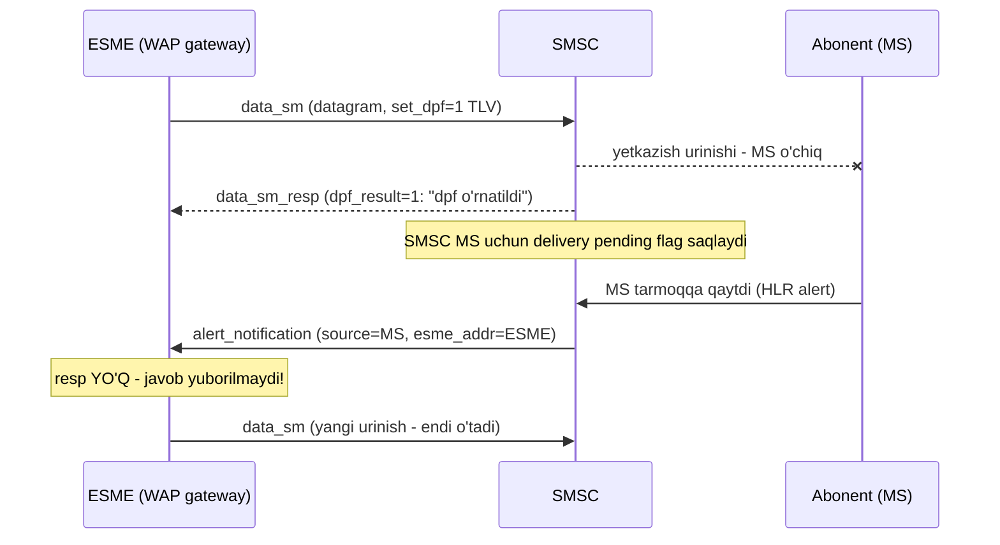
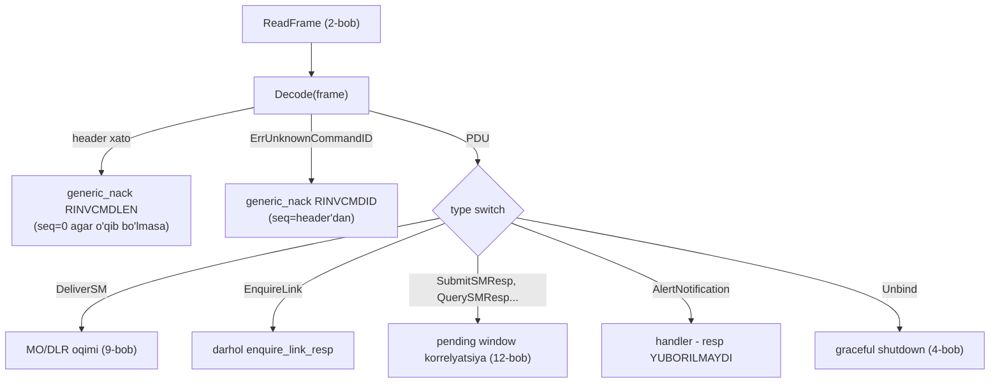

# 10-bob. Qolgan operatsiyalar: data_sm, query_sm, cancel_sm, replace_sm, submit_multi, alert_notification

Kitobning shu yerigacha SMPP'ning "katta yo'li"ni bosib o'tdik: bind → submit_sm → deliver_sm → DLR. Bu to'rttasi real traffic'ning 99%'i. Lekin Table 5-1'da yana olti operatsiya turibdi — va "to'liq va to'g'ri qayta yoza olish" mezonimiz (1-bob) ularni chetlab o'tishga yo'l qo'ymaydi. Bu bobda protokol qamrovini yopamiz: har birining field'lari, semantikasi, hex'i — va, ehtimol eng foydalisi, **qaysi biri amalda ishlaydi-yu qaysi biri qog'ozda qolgani**. Bob oxirida kod tomonda ham muhim bosqich bor: barcha 15 PDU'ni bitta kirish nuqtasidan taniydigan umumiy `Decode` dispatcher — 12-bobdagi session engine aynan unga quriladi.

Oldindan halol xarita (bu jadval spec emas — aggregator hujjatlari va integratsiya tajribasi):

| Operatsiya | Nima qiladi | Amalda support |
|---|---|---|
| data_sm | submit/deliver'ga muqobil, interaktiv | Kam — ko'p aggregator'lar umuman qo'llamaydi |
| query_sm | Xabar holatini so'rash | Kam-o'rtacha; polling anti-pattern |
| cancel_sm | Kutayotgan xabarni bekor qilish | Kam |
| replace_sm | Kutayotgan xabarni almashtirish | Juda kam (VMN dunyosi merosi) |
| submit_multi | Bitta PDU, 254 tagacha qabul qiluvchi | Kam; N×submit_sm afzal ko'riladi |
| alert_notification | "Abonent qaytdi" signali (dpf zanjiri) | Deyarli yo'q |

Masalan Sinch (dunyodagi eng yirik aggregator'lardan biri) cloud SMPP hujjatida ochiq yozadi: data_sm, query_sm, cancel_sm, replace_sm va submit_multi qo'llanmaydi. Ko'pchilik kommersial provider'lar faqat submit_sm/deliver_sm/enquire_link (+bind/unbind) ni to'liq qo'llaydi. Xo'sh, nega o'rganamiz? Uch sabab: (1) operator-darajali to'g'ridan-to'g'ri ulanishlarda (aggregator emas, SMSC'ning o'zi) bular ishlaydi; (2) server tomonni (14-bob mock SMSC) yozganda hammasini tanish SHART; (3) protokolni to'liq bilmasdan "bilaman" deyish — bu kitob falsafasiga zid.

## 10.1 data_sm: submit_sm'ning "yengil" egizagi

data_sm (§4.7) — protokoldagi yagona **ikki yo'nalishli** xabar operatsiyasi: ham ESME→SMSC (submit o'rnida), ham SMSC→ESME (deliver o'rnida) yuboriladi. U WAP kabi interaktiv application'lar uchun kiritilgan: so'rov-javob almashinuvi ko'p bo'lgan oqimlarda submit_sm'ning 17 field'lik yuki ortiqcha edi.

Mandatory body — submit_sm'nikidan uch barobar qisqa:

| # | Field | O'lcham | Izoh |
|---|---|---|---|
| 1 | `service_type` | max 6, C-Octet | submit_sm'dagi bilan bir xil (§5.2.11) |
| 2–4 | `source_addr_ton/npi/addr` | 1+1+**max 65** | ⚠ manzil max 65 — submit_sm'dagi 21 EMAS! |
| 5–7 | `dest_addr_ton/npi/addr` | 1+1+**max 65** | o'sha |
| 8 | `esm_class` | 1 | mode bitlari bu yerda TO'LIQ ishlaydi (transaction ham!) |
| 9 | `registered_delivery` | 1 | DLR so'rash — submit_sm'dagi kabi |
| 10 | `data_coding` | 1 | 7-bob jadvali |

E'tibor bering, nima YO'Q: protocol_id, priority, schedule/validity, replace_if_present, sm_default_msg_id — va eng muhimi, **sm_length/short_message yo'q**. Matn FAQAT `message_payload` TLV'sida (0x0424) tashiladi. 8-bobda uchinchi concatenation usuli sifatida ko'rgan mexanizmimiz bu yerda yagona yo'l.

"Yo'qotilgan" mandatory field'lar aslida yo'qolmagan — TLV'larga ko'chgan, va bu dizayn evolyutsiyasining qiziq namunasi: v3.4 mualliflari data_sm'da "hamma narsa optional, keragini qo'sh" falsafasini sinab ko'rishgan (v5.0'da bu yondashuv submit_sm'ga ham tarqaladi). Muhim ekvivalentlar:

| submit_sm field'i | data_sm ekvivalenti | Farq |
|---|---|---|
| validity_period | `qos_time_to_live` (0x0017, 4 oktet) | Vaqt formati emas — SEKUNDLARDA relative TTL |
| (yo'q edi) | `more_messages_to_send` (0x0426) | "Ketma-ket yana xabar kelyapti" belgisi — SMSC radio-kanalni ochiq ushlab turadi |
| UDH port addressing | `source_port`/`destination_port` | 8-bobdagi taqiq bu yerda ham: UDHI bilan birga EMAS |
| schedule_delivery_time | YO'Q | data_sm kechiktirilgan yuborishni umuman qo'llamaydi |

Golden hex (51 = 0x33 oktet, testda `goldenDataSMHex`) — "Bank" 998901234567'ga message_payload orqali "Salom" yubormoqda, DLR so'ralgan:

```
00 00 00 33                                     <- command_length = 51
00 00 01 03                                     <- command_id = data_sm
00 00 00 00                                     <- command_status = 0 (request)
00 00 00 04                                     <- sequence_number = 4
00                                              <- service_type: bo'sh
05 00 42 61 6E 6B 00                            <- source: 5/0 "Bank"
01 01 39 39 38 39 30 31 32 33 34 35 36 37 00    <- dest: 1/1 "998901234567"
00                                              <- esm_class = 0x00
01                                              <- registered_delivery = 0x01 (DLR!)
00                                              <- data_coding = 0x00
04 24 00 05 53 61 6C 6F 6D                      <- TLV: message_payload = "Salom"
```

Mandatory qism bor-yo'g'i 25 oktet — matn esa TLV tail'da. 3-bobdan tanish format: tag 0x0424, length 0x0005, value "Salom".

### Messaging mode'lar: datagram va transaction to'liq izohi

1-bobda tanishgan §2.10 mode'lariga endi to'liq qaytamiz, chunki ularning haqiqiy uyi — data_sm. esm_class bit 1–0:

- **Store-and-forward (default, 00 yoki majburan 11)** — SMSC xabarni O'ZIDA saqlaydi, yetkazishga qayta-qayta urinadi, taqdiri DLR bilan keladi. submit_sm dunyosi shu.
- **Datagram (01)** — UDP falsafasi: SMSC saqlamaydi, bir marta uradi, retry yo'q, registered_delivery ma'nosiz. "Yo'qolsa achinarli emas" oqimlar uchun.
- **Transaction (10)** — eng qiziq rejim: SMSC resp'ni USHLAB TURADI va xabarning yetkazish natijasi ma'lum bo'lgandagina qaytaradi — ya'ni **data_sm_resp sinxron ravishda end-to-end natijani tashiydi**. DLR kutish yo'q: resp'ning o'zi "yetdi/yetmadi" deydi.

Va mode'larning PDU'larga taqsimoti (spec qat'iy belgilagan):

| Mode | submit_sm | submit_multi | data_sm |
|---|---|---|---|
| Store-and-forward | HA (asosiy) | HA | HA |
| Datagram | HA (§2.10.2 "tezkor port qilish uchun") | YO'Q | HA (asosiy uy) |
| Transaction | **YO'Q** (§4.4) | **YO'Q** (§4.5) | **HA — faqat shu yerda** |

Transaction mode'da data_sm_resp'ga uch maxsus TLV keladi (§4.7.2): `delivery_failure_reason` (0x0425: 0=dest yo'q, 1=dest band...), `network_error_code` (9-bobdan tanish 3-oktetlik struktura) va `dpf_result` (0x0420 — quyida). Bizning `DataSMResp` struct'i shu TLV tail'ni to'liq tashiydi. Yana bir amaliy fakt: transaction mode telefonning javobini kutgani uchun resp latency'si SEKUNDLAR bo'ladi — 12-bobdagi response timer'ni bunga moslamasangiz, ishlaydigan operatsiyani timeout bilan o'zingiz o'ldirasiz.

> **⚠ Amaliyotda.** data_sm support'i aggregator'larda deyarli nol, operator SMSC'larida ham transaction mode ko'pincha o'chirilgan. Undan ham qiziq quirk: ba'zi SMSC'lar data_sm'ni qabul qiladi-yu, ichkarida submit_sm'ga aylantirib store-and-forward qiladi — siz datagram so'raysiz, u saqlaydi. Mode bitlari "so'rov", kafolat emas (5-bobdagi ogohlantirishning data_sm versiyasi). Integratsiyadan oldin bitta savol hal qiladi: "data_sm qo'llaysizmi, qaysi mode'larda?" — javob deyarli hamisha "submit_sm ishlating" bo'ladi.

## 10.2 query_sm: xabar taqdirini SO'RAB olish

query_sm (§4.8) — "7F3A9B nima bo'ldi?" savolining protokoldagi shakli. Body ikki qismdan iborat: `message_id` (max 65) + source manzil uchligi. Matching qoidasi qattiq: **message_id + source ORIGINAL submit'dagi bilan aynan mos** bo'lishi shart — original'da source NULL yuborgan bo'lsangiz query'da ham NULL yuborasiz (§4.8), aks holda SMSC "topa olmadim" (RINVMSGID/RQUERYFAIL) deydi.

query_sm_resp body'si — xabarning joriy portreti:

| Field | O'lcham | Izoh |
|---|---|---|
| `message_id` | max 65 | so'ralgan id (aks-sado) |
| `final_date` | 1 yoki 17 | final holatga o'tgan vaqt; hali ENROUTE bo'lsa NULL |
| `message_state` | 1 | §5.2.28 raqamlari — 9-bob jadvalining aynan o'zi (2=DELIVERED...) |
| `error_code` | 1 | network-specific kod — DLR `err:` fazosi, command_status EMAS |

Golden juftligimiz (testda): query "7F3A9B" + Bank → resp: state=2 (DELIVERED), final_date `260717120600004+` — 5-bobdagi submit va 9-bobdagi DLR bilan bitta hikoya: o'sha xabar, endi so'rov bilan tekshirilyapti.

Nega DLR-driven arxitektura query polling'dan yaxshi? Chunki polling — O(N) so'rov har tekshiruv davri uchun: 100 000 xabar yuborib har 30 soniyada holat so'rasangiz, siz SMSC'ga sun'iy DDoS uyushtirasiz (va RTHROTTLED olasiz); DLR esa O(1) — holat o'zgargan xabargina xabar beradi. query_sm'ning to'g'ri o'rni — **istisno vositasi**: DLR kelmay qolgan (yo'qolgan?) yakka xabarlarni tekshirish, incident paytida "kutish xonasi"dagi (9-bob) id'larni qo'lda so'rash. Qoida: query_sm — pinset, konveyer emas.

> **⚠ Amaliyotda — query_sm'ning uch tuzog'i.** (1) *Source mosligi:* eng ko'p uchraydigan xato — submit'da source NULL yuborilgan (SMSC default sender qo'ygan), query'da esa "o'sha default"ni qo'lda yozib yuborish. Matching ORIGINAL PDU'dagi qiymat bilan — NULL yuborgan bo'lsangiz NULL so'raysiz, SMSC nima qo'ygani bilan ishingiz yo'q. (2) *Geografiya:* katta operatorlarning distributed SMSC'larida query/cancel/replace faqat original submit KETGAN saytda ishlaydi (Oracle hujjatlarida ochiq talab) — load-balancer ortidagi ikki bind'dan birida submit, ikkinchisida query qilsangiz RINVMSGID olasiz, xabar esa bor. (3) *message_id muddati:* SMSC'lar id'ni final holatdan keyin qancha saqlashi noma'lum (spec'da yo'q) — kechagi DELIVERED xabarni bugun query qilsangiz "topilmadi" normal. Uchchalasi ham "xabar yo'qoldi" degan yolg'on tashxisga olib boradi.

## 10.3 cancel_sm va replace_sm: kutayotgan xabarni boshqarish

Ikkalasi ham faqat **hali yetkazilmagan** (ENROUTE, scheduled) xabar ustida ishlaydi — DELIVERED bo'lganini na bekor qilib, na almashtirib bo'ladi (SMS'ni "qaytarib olish" texnologiyasi mavjud emas!).

**cancel_sm (§4.9)** — ikki rejimli operatsiya. Body: service_type, message_id, source uchligi, dest uchligi.

- **Rejim 1 — yakka:** message_id berilgan → o'sha bitta xabar bekor qilinadi (source mos kelsa); dest NULL bo'lishi mumkin.
- **Rejim 2 — guruh:** message_id NULL → source+dest (+service_type berilgan bo'lsa) mos kelgan **BARCHA kutayotgan xabarlar** bekor qilinadi. Ehtiyot bo'ling: bu supurgi — "Bank'dan 998901234567'ga ketayotgan hammasi" degani.

Bizning `CancelSM.Encode` hech qaysi rejimga tushmaydigan holatni (message_id ham, dest ham bo'sh) lokal xato qiladi — SMSC'gacha bormasdan. cancel_sm_resp — body'siz, faqat header: muvaffaqiyatsizlik `ESME_RCANCELFAIL` (0x11) bilan keladi.

**replace_sm (§4.10)** — matching yana message_id + source. Yangi qiymatlar: schedule_delivery_time, validity_period, registered_delivery, sm_default_msg_id, short_message. Ikki narsa YO'QLIGI dizayn qarori:

- **destination yo'q** — xabarni boshqa raqamga "ko'chirib" bo'lmaydi;
- **data_coding yo'q** — yangi matn ORIGINAL xabarning kodlashida talqin qilinadi. Bu jimgina sinadigan tuzoq: UCS2 yuborilgan xabarni GSM7 matn bilan replace qilsangiz, telefon baytlarni UCS2 deb o'qiydi — abonent ieroglif ko'radi. Bizning struct'da bu field'lar umuman yo'q — API'ning o'zi xatoni imkonsiz qiladi.

replace_sm'ning submit_sm+replace_if_present (5-bob) bilan farqini bir jumlaga siqamiz: **replace_sm mos xabar topilmasa XATO qaytaradi (RREPLACEFAIL), replace_if_present esa YANGI xabar yaratadi.** Birinchisi "almashtir, bo'lmasa hech nima qilma"; ikkinchisi "almashtir, bo'lmasa yubor". VMN (voice mail notification) dunyosi — "sizda 3 ta yangi xabar" ni "4 ta"ga yangilash — shu operatsiyalarning asl vatani.

Ikkala operatsiyaning zamonaviy A2P'dagi real qo'llanish holati bitta: **scheduled xabarlar bilan ishlash**. schedule_delivery_time bilan ertaga soat 9:00 ga rejalashtirilgan kampaniyani bugun kechqurun bekor qilish (cancel_sm guruh rejimi — aynan shu stsenariy uchun yaratilganday) yoki matnini tuzatish (replace_sm) — xabarlar hali SMSC navbatida yotgani uchun ishlaydi. Oddiy real-time traffic'da esa (OTP, notification) xabar soniyalar ichida final holatga o'tadi — cancel/replace ulgurmaydi ham. Shuning uchun bu juftlikni qo'llamaydigan aggregator'lar hech narsa yo'qotmayapti: ular baribir scheduled delivery'ni ham qo'llamaydi.

## 10.4 submit_multi: bitta PDU, 254 manzil

submit_multi (§4.5) — submit_sm'ning "ko'p manzilli" versiyasi: body deyarli bir xil, faqat yakka dest bloki o'rniga `number_of_dests` (1 oktet, 1–254) + shuncha **dest_address** strukturasi. Har dest_address — protokoldagi yagona UNION tipi (§5.2.25): birinchi oktet `dest_flag` — 1 bo'lsa ortidan SME manzili (ton+npi+addr max 21), 2 bo'lsa `dl_name` (max 21) — SMSC'da OLDINDAN ro'yxatlangan Distribution List nomi.

Golden hex (86 = 0x56 oktet, testda `goldenSubmitMultiHex`) — 2 SME + 1 DL:

```
00 00 00 56                                     <- command_length = 86
00 00 00 21                                     <- command_id = submit_multi
00 00 00 00  00 00 00 07                        <- status=0, seq=7
00                                              <- service_type: bo'sh
05 00 42 61 6E 6B 00                            <- source: 5/0 "Bank"
03                                              <- number_of_dests = 3
01                                              <- dest_flag = 1 (SME)
01 01 39 39 38 39 30 31 32 33 34 35 36 37 00    <-   1/1 "998901234567"
01                                              <- dest_flag = 1 (SME)
01 01 39 39 38 39 30 37 36 35 34 33 32 31 00    <-   1/1 "998907654321"
02                                              <- dest_flag = 2 (Distribution List)
76 69 70 5F 6D 69 6A 6F 7A 6C 61 72 00          <-   dl_name "vip_mijozlar"
00 00 00                                        <- esm_class, protocol_id, priority
00 00                                           <- schedule, validity: NULL
01                                              <- registered_delivery = 0x01
00                                              <- replace_if_present: RESERVED!
00 00                                           <- data_coding, sm_default_msg_id
05 53 61 6C 6F 6D                               <- sm_length=5, "Salom"
```

`replace_if_present` qatoriga e'tibor: submit_sm'da bu ishlaydigan flag edi, submit_multi'da esa **Reserved — NULL bo'lishi SHART** (§4.5.1). Bizning `SubmitMulti` struct'ida bu field ataylab yo'q: encoder doim 0 yozadi, "mavjud bo'lmagan imkoniyat"ga API'da joy yo'q. Transaction mode ham yo'q (datagram ham — 10.1 jadvali).

submit_multi_resp — protokoldagi eng boy resp (§4.5.2): `message_id` + `no_unsuccess` (1 oktet) + har muvaffaqiyatsiz manzil uchun `unsuccess_sme` strukturasi: ton+npi+addr + **error_status_code** (4 oktet — command_status fazosidagi kod, Table 5-2). Bu yerda protokolning boshqa joyida uchramaydigan semantika bor — **qisman muvaffaqiyat**: PDU'ning umumiy command_status'i 0, lekin ro'yxatda 2 manzil "0x0B RINVDSTADR" bilan turibdi. Ya'ni "xabar qabul qilindi, LEKIN bu ikkitasiga ketmaydi". Golden resp'imizda aynan shu holat: message_id "7F3AA0" muvaffaqiyatli, 998907654321 esa unsuccess ro'yxatida. Kod tomonda tekshiruv `len(resp.Unsuccess) == 0` — faqat shu "hammasi qabul qilindi" degani; `Status == 0`ga qarash yetarli EMAS.

DL haqida amaliy izoh: distribution list'lar SMSC'da provisioning paytida yaratiladi (SMPP'ning o'zida DL yaratish operatsiyasi YO'Q — v3.4 uni "SMSC ma'muriyati" ishiga qoldirgan), shuning uchun dl_name faqat operator bilan kelishuvda ma'noga ega. DL bilan bog'liq maxsus xato kodlari ham bor (11-bob jadvalida uchraganda ajablanmang): RINVDLNAME (0x34) — bunday ro'yxat yo'q; RCNTSUBDL (0x44) — bu account DL'ga yuborolmaydi; RINVNUMDESTS (0x33) — number_of_dests 0 yoki 254'dan katta; RINVDESTFLAG (0x40) — dest_flag 1/2 emas (bizning decoder buni lokal xato qiladi — simda ko'rganda SMSC ham shu kodni qaytargan bo'lardi).

Va katta savol: **DLR'lar qanday keladi?** Har SME uchun alohida deliver_sm — DL a'zolari uchun ham. 254 manzilli submit_multi + registered_delivery = 254 DLR to'foni; 9-bob korrelyatsiya jadvali bunga tayyor bo'lishi kerak (message_id BITTA, manzil har xil — korrelyatsiya kaliti endi id+dest juftligi!). Aynan shu murakkablik tufayli sanoat submit_multi o'rniga N ta yakka submit_sm'ni afzal ko'radi: oqim nazorati oson, DLR mantiq bir xil, window baribir parallellik beradi.

## 10.5 alert_notification va dpf zanjiri

alert_notification (§4.12) — protokoldagi eng ekzotik PDU: SMSC'dan ESME'ga **"abonent qaytdi"** signali. Zanjir uch qadamdan iborat:



1. ESME data_sm'da `set_dpf` TLV (0x0421, qiymat 1) bilan yuboradi: "yetkaza olmasang, delivery pending flag o'rnat".
2. Yetkazish muvaffaqiyatsiz → SMSC flag o'rnatadi va data_sm_resp'da `dpf_result` (0x0420, qiymat 1) bilan tasdiqlaydi.
3. Abonent tarmoqqa qaytganda (telefon yoqildi, coverage'ga kirdi — SMSC buni GSM tarmog'ining o'zidan, HLR alert mexanizmidan biladi) SMSC ESME'ga alert_notification otadi: source = abonent manzili (max 65), esme_addr = flag o'rnatgan ESME manzili (max 65), ixtiyoriy `ms_availability_status` TLV (0x0422: 0=available).

Ikki o'ziga xoslik: manzillar data_sm o'lchamida (max 65 — kodda `readAddressLong`) va **response PDU YO'Q** — Table 5-1'da alert_notification_resp qiymati Reserved. Bu bizning dispatcher va kelajakdagi session engine uchun muhim istisno: har kelgan request'ga resp qaytaradigan umumiy qoidaga "alert_notification'dan tashqari" bandi qo'shiladi (outbind bilan birga — 4-bob).

Amaliyotda bu zanjir A2P dunyosida deyarli uchramaydi (WAP push davri merosi), lekin mexanizm sifatida chiroyli: SMS'ning "presence" xizmatiga aylanishi. Uni bilish server tomonda (14-bob) to'g'ri stub yozish uchun ham kerak.

## 10.6 Kod: dispatcher — 15 PDU, bitta eshik

Olti yangi codec (`data_sm.go`, `query_sm.go`, `cancel_sm.go`, `replace_sm.go`, `submit_multi.go`, `alert_notification.go`) shu bobda yozildi — hammasi tanish qoliplarda: golden hex testlar, `Status != 0 → body yo'q` qoidasi (data_sm_resp, query_sm_resp, submit_multi_resp'da ham amal qiladi), tolerant decode. Yangi struktura elementi faqat submit_multi'ning union'i:

```go
// DestAddress — submit_multi'dagi bitta qabul qiluvchi: UNION tipi
// (§4.5.1, Table 4-13/14/15): yo SME manzili, yo SMSC'da oldindan
// ro'yxatlangan Distribution List nomi. DLName bo'sh bo'lmasa — DL rejimi,
// aks holda SME rejimi.
type DestAddress struct {
	SME    Address // dest_flag=1 bo'lganda
	DLName string  // dest_flag=2 bo'lganda (bo'sh emas = DL rejimi)
}
```

Endi bobning asosiy inshooti — dispatcher (`code/pdu/decode.go`). Motivatsiya testdan (uslubimiz bo'yicha): `TestDecodeDispatcher` 23 turdagi frame yasab (15 PDU + resp'lari), har birini bitta funksiyaga beradi va konkret tur qaytishini talab qiladi. Buning uchun umumiy interfeys kerak:

```go
// PDU — Decode qaytaradigan umumiy interfeys: har konkret PDU turi o'zining
// command_id'sini biladi. Header ma'lumotlari (status, sequence) Decode'ning
// ikkinchi qaytish qiymatida.
type PDU interface {
	Cmd() CommandID
}

func Decode(frame []byte) (PDU, Header, error)
```

Decode ichida hech qanday sehr yo'q — header o'qiladi, command_id bo'yicha katta switch tegishli `DecodeXxx` funksiyasiga uzatadi. Header-only PDU'lar (enquire_link, unbind, generic_nack...) uchun yengil struct'lar kiritildi — 4-bobda ular faqat `Encode*` funksiyalar edi, endi decode natijasini type switch'da farqlash uchun tipga ega:

```go
// EnquireLink — enquire_link (§4.11): body'siz "tirikmisan" so'rovi.
type EnquireLink struct{}

// GenericNack — generic_nack (§4.3): faqat header'li salbiy javob.
// Status'da sabab (RINVCMDLEN/RINVCMDID), Sequence — original PDU'niki
// yoki decode bo'lmagan bo'lsa 0 (§4.3.1).
type GenericNack struct{ Status uint32 }
```

Eng muhim dizayn qarori — notanish command_id bilan nima qilish:

```go
// ErrUnknownCommandID — frame'dagi command_id Table 5-1'da yo'q. To'g'ri
// reaksiya (§4.3): generic_nack + ESME_RINVCMDID (0x03). Sentinel xato —
// caller errors.Is bilan ushlab nack yuboradi.
var ErrUnknownCommandID = errors.New("pdu: notanish command_id")
```

Decode notanish id'da ham header'ni QAYTARADI (xato bilan birga) — chunki generic_nack'ka original sequence_number kerak (§4.3.1). Testda bu qotirilgan: `0x000000AA` id'li frame → `errors.Is(err, ErrUnknownCommandID)` true VA `h.Sequence` o'qilgan bo'lishi shart. Nack yuborishning o'zi esa session engine'ning ishi (12-bob) — codec siyosat yurgizmaydi, faqat fakt aytadi. Shu bilan 2-bobda boshlangan savol yopildi: "frame keldi — endi nima?" javobi endi to'liq: `ReadFrame → Decode → type switch`.

Dispatch oqimining to'liq xaritasi:



## 10.7 Milestone yakuni

```
$ go vet ./... && go test ./... -race
ok      smpp/coding
ok      smpp/dlr
ok      smpp/pdu
ok      smpp/session
ok      smpp/smsc
ok      smpp/tlv
```

Yangi testlar: data_sm/data_sm_resp, submit_multi (2 SME + 1 DL) va resp'i (qisman muvaffaqiyat bilan), query_sm juftligi — hammasi python bilan mustaqil yasalgan golden hex'larga bog'langan; cancel_sm ikki rejimi + rejimsiz holat xatosi; replace_sm round-trip; alert_notification TLV bilan; dispatcher 23 frame + notanish id sentinel'i.

## Xulosa

Protokol qamrovi yopildi. data_sm — qisqa body, matn faqat message_payload'da, manzillar max 65 va transaction mode'ning yagona uyi (resp end-to-end natija tashiydi). query_sm — message_id+source bo'yicha holat so'rovi; pinset sifatida foydali, polling sifatida zararli — DLR-driven arxitektura yutadi. cancel_sm — yakka (message_id) yoki supurgi (source+dest) rejimlari; replace_sm — data_coding'siz va dest'siz almashtirish, topilmasa xato (replace_if_present'dan farqi shu). submit_multi — 254 manzil, dest_flag union'i, replace_if_present bu yerda Reserved, resp'da qisman muvaffaqiyat ro'yxati. alert_notification — set_dpf→dpf_result→alert zanjirining javobi yo'q yakuni. Va kodda: 15 PDU'ni taniydigan `Decode` dispatcher + `ErrUnknownCommandID` sentinel'i — session engine poydevori tayyor. Keyingi bob protokolning "yomon kunlari"ga bag'ishlanadi: command_status'ning to'liq jadvali, generic_nack'ning aniq o'rni va xatoga TO'G'RI reaksiya strategiyasi.

**Takrorlash savollari** (javoblar matnda bor — o'zingizni tekshiring):

1. data_sm'da short_message field'i yo'qligi qaysi TLV'ni majburiy amaliyotga aylantiradi va manzil o'lchami submit_sm'dan qanday farq qiladi?
2. Transaction mode qaysi PDU'larda ishlaydi va data_sm_resp'ning qaysi TLV'lari faqat shu mode'da ma'noli?
3. query_sm polling nega anti-pattern va query_sm'ning to'g'ri qo'llanish o'rni nima?
4. cancel_sm'da message_id=NULL yuborilsa nima bekor bo'ladi?
5. replace_sm bilan submit_sm+replace_if_present orasidagi tub farq nima?
6. submit_multi_resp'da Status=0 "hammasi yuborildi" deganimi? Qaysi field hal qiladi?
7. Qaysi ikki PDU'ga resp qaytarilmaydi?
8. Decode notanish command_id'da nima uchun xato BILAN BIRGA header'ni ham qaytaradi?

**Mashqlar:** [exercises/10-boshqa-operatsiyalar.md](../exercises/10-boshqa-operatsiyalar.md) — query vs DLR jadvali, cancel_sm shartlari va submit_multi qisman muvaffaqiyat kodi.

---

**Oldingi bob:** [9-bob. Delivery receipt (DLR)](09-dlr.md) · **Keyingi bob:** [11-bob. Error handling](11-error-handling.md) — command_status to'liq jadvali, generic_nack va retry strategiyasi.

## Manbalar

- [SMPP v3.4 spec, Issue 1.2](../resources/SMPP_v3_4_Issue1_2.pdf) — §2.10 (mode'lar), §4.5 (submit_multi), §4.7–4.10 (data_sm/query/cancel/replace), §4.12 (alert_notification), §5.2.24–5.2.27, §5.3.2.28–30
- [Sinch — Cloud SMPP](https://developers.sinch.com/docs/sms/other/sms-other-cloud-smpp) — yirik aggregator'da data_sm/query_sm/cancel_sm/replace_sm/submit_multi YO'Qligining rasmiy dalili
- [Inetlab — SubmitMulti](https://docs.inetlab.com/smpp/v2/articles/submitmulti.html) — unsuccess_sme bilan ishlashning kutubxona-darajali misoli
- [Oracle — Native SMPP](https://docs.oracle.com/cd/E16625_01/doc.50/e21362/com_native_smpp.htm) — cancel/query/replace'ni original submit bilan BIR sayt orqali yuborish talabi (distributed gateway nuance'i)
