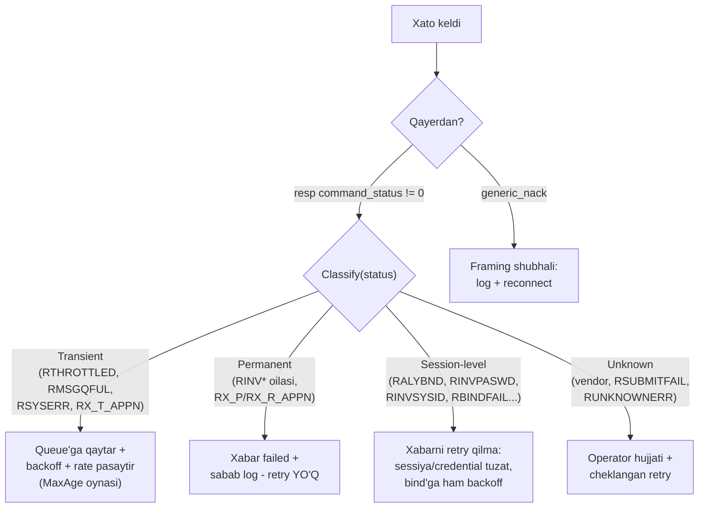

# 11-bob. Error handling: command_status, generic_nack va retry strategiyasi

Protokolni to'liq bilish — hamma narsa yaxshi ketganda nima bo'lishini bilish emas; **yomon ketganda nima qilishni bilish**. SMPP'da xato ikki qatlamda yashaydi: protokol-qatlam (resp'dagi command_status — "SMSC so'rovingga nima dedi") va yetkazish-qatlam (9-bobdagi DLR `err:` — "tarmoq xabaringga nima qildi"). Bu bob birinchi qatlamni to'liq yopadi: Table 5-2'ning har muhim kodi, generic_nack'ning aniq (va juda tor!) o'rni, va eng asosiysi — har xato toifasiga TO'G'RI reaksiya strategiyasi. Chunki xatoni o'qiy bilish yarim ish; ikkinchi yarmi — unga qarab nima qilish: retry? rebind? taslim? Bu savolga noto'g'ri javob berish "ishlamayapti"dan ham yomon oqibatlarga — duplicate SMS, IP ban, o'z-o'zini kuchaytiruvchi throttling spiraliga olib boradi.

Va boshlashdan oldin bitta tan olish. Bu kursning eski avlodi — SMPP bo'yicha overview-darajadagi eski dars — error-kod jadvalida qo'pol xatolarga yo'l qo'ygan edi: 0x06 "RINVPASWD" deb yozilgan (aslida RINVPRTFLG; RINVPASWD — 0x0E), 0x0A "RMSGQFUL" deb (aslida RINVSRCADR; RMSGQFUL — 0x14), va v3.4'da umuman YO'Q "ESME_RINVDCS 0x53" kodi bor edi (0x53 — RINVSYSTYP; RINVDCS v5.0'ning 0x104 kodi). Bu xatolarni shu yerda ochiq ko'rsatayapmiz, chunki ular saboqli: **error-kod jadvalini hech qachon ikkilamchi manbadan ko'chirmang** — internetdagi jadvallarning yarmi bir-biridan ko'chirilgan va bir xil xatolarni tashiydi. Yagona haqiqat manbai — spec Table 5-2'ning o'zi. Bizning `pdu/status.go` undan aynan ko'chirilgan va testda eng adashtiriladigan qiymatlar alohida qotirilgan.

## 11.1 command_status: xarita

To'liq jadval 48 nomlangan koddan iborat — bu bobda ularni yod olmaymiz, o'qiy bilishni o'rganamiz. Kodlar semantik guruhlarga tushadi (to'liq lookup — [Appendix B](appendix-b.md)):

| Guruh | Kodlar (asosiylari) | Umumiy ma'no |
|---|---|---|
| Muvaffaqiyat | 0x00 ROK | Yagona "hammasi joyida" |
| Framing/PDU | 0x01 RINVMSGLEN, 0x02 RINVCMDLEN, 0x03 RINVCMDID | Baytlar darajasidagi buzuqlik — 2-bob dunyosi |
| Bind/sessiya | 0x04 RINVBNDSTS, 0x05 RALYBND, 0x0D RBINDFAIL, 0x0E RINVPASWD, 0x0F RINVSYSID | Sessiya holati/credential muammolari — 4-bob dunyosi |
| Field validatsiya | 0x06 RINVPRTFLG, 0x07 RINVREGDLVFLG, 0x0A **RINVSRCADR**, 0x0B RINVDSTADR, 0x43 RINVESMCLASS, 0x48/0x49 RINVSRCTON/NPI, 0x50/0x51 RINVDSTTON/NPI, 0x61/0x62 RINVSCHED/RINVEXPIRY | "PDU'ing sog'lom, lekin MAZMUNI xato" |
| Operatsiya | 0x0C RINVMSGID, 0x11 RCANCELFAIL, 0x13 RREPLACEFAIL, 0x67 RQUERYFAIL, 0x42 RINVSUBREP | 10-bob operatsiyalarining "topilmadi/bo'lmadi"lari |
| submit_multi/DL | 0x33 RINVNUMDESTS, 0x34 RINVDLNAME, 0x40 RINVDESTFLAG, 0x44 RCNTSUBDL, 0x55 RINVNUMMSGS | 10-bobda ko'rganlarimiz |
| Resurs/oqim | 0x08 RSYSERR, **0x14 RMSGQFUL**, **0x58 RTHROTTLED** | "Hozir emas" — eng muhim amaliy guruh |
| ESME javoblari | 0x64 RX_T_APPN, 0x65 RX_P_APPN, 0x66 RX_R_APPN | Teskari yo'nalish: SIZ SMSC'ga aytadigan kodlar |
| TLV | 0xC0–0xC4 (RINVOPTPARSTREAM...RINVOPTPARAMVAL) | 3-bob forward-compat qoidalari buzilganda |
| Maxsus | 0xFE RDELIVERYFAILURE (data_sm), 0xFF RUNKNOWNERR | |
| Vendor | 0x400–0x4FF | Operator hujjatisiz ma'nosi YO'Q |

Uch dona "temir mix" (log o'qishda eng ko'p qoqiladigan joylar):

1. **0x14 = decimal 20 = RMSGQFUL.** Log kutubxonasi statusni decimal chiqarsa "command_status=20" ko'rasiz. Uni "0x20" deb o'qish — boshqa kod (0x20 Table 5-2'da yo'q — reserved!). Hex'mi-decimal'mi — log formatini ANIQ biling; bizning `String()` har doim rasmiy nom qaytaradi, shuning uchun log'da raqam emas `ESME_RMSGQFUL` yozing.
2. **Qiymatlar zich EMAS.** 0x09, 0x10, 0x12, 0x16–0x32... — reserved bo'shliqlar. "0x30 keldi — jadvalda yo'q, demak vendor" degan xulosa xato: vendor diapazoni FAQAT 0x400–0x4FF; qolgan notanish qiymatlar — reserved (buggy SMSC yoki versiya aralashuvi belgisi). `String()` shu farqni ko'rsatadi: `vendor(0x...)` vs `unknown(0x...)`.
3. **RINVDCS'ni qidirmang.** v3.4'da data_coding xatosi uchun maxsus kod YO'Q — noto'g'ri dc odatda RSYSERR, RSUBMITFAIL yoki vendor kod bilan (yoki undan yomoni — jim qabul qilinib telefon axlat ko'rsatishi bilan) qaytadi. RINVDCS oilasi (0x104+) — v5.0 ixtirosi.

Yana bir foydali o'qish ko'nikmasi — **kod qaysi resp'da kelganiga qarab ma'no toraytirish**. Bir xil kod turli operatsiyalarda turli hikoya aytadi:

- `RINVMSGID (0x0C)` submit_sm_resp'da kelmaydi (siz hali id bermagansiz!) — u query/cancel/replace_resp'ning kodi: "bunday xabar topilmadi" (id xato YOKI allaqachon final YOKI boshqa saytga tushdingiz — 10-bob).
- `RINVBNDSTS (0x04)` bind_resp'da kelsa — bind'ni noto'g'ri holatda yubordingiz (allaqachon bound sessiyada ikkinchi bind — bunga RALYBND ham keladi); submit_sm_resp'da kelsa — BOUND_RX'dan submit qilyapsiz (4-bob Table 2-1 buzilgan).
- `RSYSERR (0x08)` — protokolning "javob berolmayman, ichimda nimadir sindi" kodi: eng axborotsiz xato. Transient deb tasniflaymiz (SMSC tuzalib qolishi mumkin), lekin DOIMIY RSYSERR oqimi — operator bilan aloqa signali, retry bilan davolab bo'lmaydi.

Vendor diapazoni (0x400–0x4FF) haqida ham bir amaliy lavha: aggregator'lar bu bloklarga o'z biznes-xatolarini joylaydi — tipik misollar: "balans tugadi", "route yo'q / bu yo'nalish yopiq", "sender ro'yxatdan o'tmagan", "kontent filtrdan o'tmadi". Bularning KODLARI har provider'da har xil (0x407 birida balans, boshqasida filtr) — shuning uchun `Classify` ularni ClassUnknown qiladi va integratsiya checklist'ida (16-bob) "vendor xato kodlari jadvalini bering" bandi turadi. Jadvalni olgach mapping'ni konfiguratsiyada saqlaysiz — kodda hardcode emas, chunki ikkinchi operator ulanishida u boshqa bo'ladi.

## 11.2 generic_nack: juda tor eshik

generic_nack (§4.3) protokolning eng noto'g'ri tushuniladigan PDU'si. Uning qo'llanish sohasi AYNAN ikki holat — va faqat shu ikkisi:

1. **Invalid command_length** — frame chegarasi buzilgan: length<16, absurd katta, decode paytida "stream buzilgan" hissi. Data korrupt deb hisoblanadi → generic_nack (status RINVCMDLEN 0x02).
2. **Unknown command_id** — 10-bob dispatcher'imizning `ErrUnknownCommandID` holati → generic_nack (status RINVCMDID 0x03).

Hammasi. Boshqa BARCHA xatolar o'z resp'ida qaytadi. Eng keng tarqalgan xato ishlatish: submit_sm'dagi mazmun xatosiga (aytaylik buzuq manzil) generic_nack yuborish — XATO; to'g'risi status'li submit_sm_resp. Nega bu muhim? Chunki yuboruvchi submit_sm_resp kutyapti: uning pending window'ida (12-bob) seq raqami submit_sm_resp bilan korrelyatsiya qilinadi; generic_nack kelsa yaxshi kutubxona uni baribir seq bo'yicha topadi, yomoni esa timeout'gacha osilib qoladi.

sequence_number bilan qiziq ziddiyat bor. §4.3.1: PDU decode qilib BO'LMASA seq = NULL (0). Lekin §5.1.4: seq diapazoni 0x00000001–0x7FFFFFFF — 0 unga kirmaydi! Bu v3.4'ning ichki nomuvofiqligi; v5.0 buni ochiq tan olib qonunlashtirgan. Amaliy qoida (bizning implementatsiya ham shunday): **yuborishda** — header'dan seq o'qib olishning iloji bo'lsa o'shani, bo'lmasa 0; **qabul qilishda** — seq=0'li generic_nack'ni normal deb bilish ("qaysidir PDU'ing o'lik keldi, qaysiligini bilmayman").

Va ikki halokatli stsenariy:

- **nack'ka nack.** Tomonlardan biri buzuq generic_nack yuborsa, ikkinchisi unga generic_nack qaytarsa... cheksiz ping-pong. Qoida: **generic_nack'ka HECH QACHON javob qaytarilmaydi** — u terminal PDU.
- **generic_nack oldingiz — framing'ga ishonmang.** RINVCMDLEN'li nack kelishi ko'pincha "sizning oqimingiz siljigan" degani: qaysidir PDU'ni xato uzunlik bilan yozgansiz va qarshi tomon endi frame chegaralarini noto'g'ri joydan o'qiyapti. Bunday holda sessiyada davom etish — har keyingi PDU ham axlat degani. Eng xavfsiz reaksiya: **log + unbind urinish + TCP yopish + qayta ulanish.** Yangi sessiya = toza framing.



## 11.3 Tasnif: transient / permanent / session-level

Spec kodlarni beradi, lekin "qaysi biriga retry qilish kerak" demaydi — bu tasnif **industriya konsensusi** (NowSMS, Kannel va aggregator amaliyotidan; spec'da faqat RX_**T**_APPN/RX_**P**_APPN nomlarida ishora bor). Bizning `client.Classify` shu konsensusni kodlaydi:

**Transient** (RTHROTTLED 0x58, RMSGQFUL 0x14, RSYSERR 0x08, RX_T_APPN 0x64) — "hozir emas, keyinroq bo'ladi". Xabar SOG'LOM, muammo vaqtda. Reaksiya: queue'ga qaytarish + exponential backoff + (RTHROTTLED'da) yuborish rate'ini pasaytirish. Bu toifaga **max-attempts emas, max-age** to'g'ri: "3 marta urindim — tashladim" siyosati soat cho'qqisidagi 10 daqiqalik throttling'da minglab sog'lom xabarni o'ldiradi; to'g'risi "validity oynasi ichida urinaver" (bizning `RetryPolicy.MaxAge`).

**Permanent** (butun "Invalid *" oilasi: RINVSRCADR, RINVDSTADR, RINVESMCLASS, RINVSCHED...; RX_P_APPN, RX_R_APPN) — "so'roving O'ZI xato". Ming marta qayta yuborsangiz ming marta shu kod keladi. Reaksiya: xabarni failed deb belgilash, sababni log/DB'ga yozish, ODAM aralashuvi (raqam formati, konfiguratsiya). Bu toifani retry qilish shunchaki foydasiz emas — zararli: operator monitoringi bir xil xato PDU'ni takrorlayotgan client'ni "misbehaving" deb belgilaydi.

**Session-level** (RINVBNDSTS 0x04, RALYBND 0x05, RINVPASWD 0x0E, RINVSYSID 0x0F, RBINDFAIL 0x0D) — muammo xabarda EMAS, sessiyada. RINVBNDSTS — noto'g'ri state'da PDU yubordingiz (BOUND_RX'da submit — 4-bob Table 2-1); qolganlari bind bosqichining o'zida. Xabarni retry qilish ma'nosiz — avval sessiyani tuzating. Va SHU YERDA eng qimmat saboq:

> **⚠ Amaliyotda — rebind loop = IP ban.** Klassik halokat zanjiri (jasmin gateway issue #835 — real case): parol o'zgargan → bind RINVPASWD → kutubxona 10 soniyada qayta bind → yana RINVPASWD → ... Soatiga 360 muvaffaqiyatsiz login urinishi. Operator tomonda bu brute-force'dan farq qilmaydi: avtomatika IP'ni ban qiladi, endi TO'G'RI parol bilan ham ulana olmaysiz, ticket ochib kutasiz. Qoida: **bind xatosiga ham exponential backoff** (1s→2s→...→5min plato) va RINVPASWD/RINVSYSID'da N urinishdan keyin BUTUNLAY to'xtab alert otish — parol o'z-o'zidan tuzalmaydi, admin kerak. `Classify`da bu toifaning alohida ekani aynan shu siyosat uchun.

**Unknown** (RSUBMITFAIL 0x45, RUNKNOWNERR 0xFF, RDELIVERYFAILURE 0xFE, vendor 0x400–0x4FF, reserved bo'shliqlar) — spec/tajriba aniq javob bermaydi. RSUBMITFAIL ayniqsa yoqimsiz: "submit bo'lmadi" — sababi noma'lum, ba'zi SMSC'larda transient sabablar uchun ham keladi. Default siyosat: cheklangan retry (bizda MaxAge/4) + operator hujjatidan kodni aniqlashtirish. Har yangi vendor kod — operator bilan aloqaga savol.

RTHROTTLED'ga alohida to'xtash joiz, chunki bu eng ko'p noto'g'ri ishlanadigan kod:

> **⚠ Amaliyotda — throttling spirali.** RTHROTTLED "sekinla" degan signal. Unga darhol retry qilish — signal teskarisini qilish: yuk YANADA oshadi. NowSMS hujjatlashtirgan real xulq: SMSC avval RTHROTTLED qaytaradi; client e'tibor bermay bosishda davom etsa, ayrim SMSC'lar keyingi PDU'larni **javobsiz tashlab yuboradi** — endi sizda RTHROTTLED ham yo'q, shunchaki timeout'lar; kutubxonangiz "sessiya o'ldi" deb reconnect qiladi; reconnect'dan keyin queue to'la — yana bosasiz — yana throttling... O'z-o'zini kuchaytiruvchi spiral. To'g'ri reaksiya UCHTA harakat birga: (1) throttled xabar queue'ga qaytadi (DROP EMAS), (2) global yuborish rate'i pasayadi (token bucket — 13-bob), (3) backoff bilan retry. Va empirik qoida (Nordic Messaging): window ≤ 2–3 × operator MPS — window'ni katta qilib "tezlashtirish" throttling'ni faqat tezlashtiradi.

## 11.4 Uchinchi rejim: umuman javob kelmasa

command_status'lar — "SMSC gapirdi" dunyosi. Lekin xatolarning butun bir sinfi **jimlik**: submit yubordingiz, resp KELMADI. Bu holat status'li xatodan tubdan farq qiladi va uni tasnifga alohida qator qilib qo'shish kerak:

| Rejim | Nimani bilasiz | Retry xavfi |
|---|---|---|
| status = 0 | SMSC oldi, navbatda | — |
| status != 0 | SMSC OLMADI (yoki olmadi deb aytdi) | Classify bo'yicha — xavfsiz: xabar SMSC'da YO'Q |
| **resp yo'q (timeout)** | **HECH NARSA bilmaysiz** | Retry = ehtimoliy DUPLICATE: SMSC olgan-u resp yo'lda o'lgan bo'lishi mumkin |

Permanent xatoga retry qilmaslik oson qaror; timeout'dagi qaror esa og'ir: qayta yuborsangiz abonentga ikki OTP ketishi mumkin (5-bobdagi at-least-once/at-most-once dilemmasi), yubormasangiz xabar umuman ketmagan bo'lishi mumkin. Bu bobning tasnif mashinasi bu yerda OJIZ — chunki tasniflanadigan kod yo'q. Qarorni siyosat qiladi (12-bobda kod bo'ladi): kritik bo'lmagan traffic'da retry (duplicate arzon), pul/OTP'da — avval DLR/query orqali taqdirni aniqlash, so'ng ehtiyotkor qaror. Hozircha muhimi — bu REJIMNI alohida ko'rish: "timeout ham RSYSERR'ga o'xshagan narsa-da" degan soddalashtirish duplicate SMS'ning bosh manbai.

Va bitta yarim-jimlik holati ham bor: resp keldi-yu, IKKI MARTA keldi (SMSC bug'i, tarmoq dublikati) yoki umuman siz yubormagan seq bilan keldi. 12-bob window'i bunga tayyor bo'ladi: birinchi resp match, ikkinchisi "notanish seq" logiga; notanish seq'li resp — e'tiborsiz (unga generic_nack YUBORILMAYDI — u request emas!).

## 11.5 Ikki xato fazosi: yana bir bor, chunki muhim

9-bobda aytilganning qisqa mustahkamlash jadvali — chunki bu chalkashlik hisobot va alertlarda qayta-qayta chiqadi:

| | command_status | DLR `err:` |
|---|---|---|
| Manba | SMSC protokol qatlami | Tarmoq (GSM MAP, CDMA...) yoki SMSC ichki kodi |
| Standart | Table 5-2 — universal | YO'Q — operator-specific |
| "0x58 / 058" | RTHROTTLED — sekinla | Bu operatorda istalgan narsa bo'lishi mumkin |
| Retry hal qiluvchi | Classify(status) | stat: (UNDELIV vs EXPIRED) + operator jadvali |

Bitta raqam ikki fazoda ikki xil ma'no — kod NOMINI emas RAQAMINI solishtirish xatosi ayniqsa monitoring dashboard'larida uchraydi ("err:8 ko'paydi — RSYSERR'mi?" — yo'q, bu DLR fazosi, u yerda 8 boshqa narsa).

## 11.6 Teskari yo'nalish: ESME sifatida xato QAYTARISH

Siz faqat xato oluvchi emassiz — deliver_sm'ga (MO xabar, DLR) javob berayotganda xato QAYTARUVCHI ham bo'lasiz. Buning uchun uchta maxsus kod ajratilgan (5-bobda tanishgan edik, endi semantikasi):

- **RX_T_APPN (0x64)** — "VAQTINCHA olmayman, keyinroq qayta urinib ko'r": bazangiz yotibdi, queue to'la. Yaxshi SMSC xabarni saqlab keyinroq qayta yuboradi.
- **RX_P_APPN (0x65)** — "DOIMIY olmayman, qayta urinma": bu turdagi xabarni umuman qayta ishlamaysiz.
- **RX_R_APPN (0x66)** — "RAD etaman": xabar qabul qilinmadi (kontent/siyosat sababli).

Nozik joy: SMSC bu kodlarga qanchalik hurmat ko'rsatishi implementatsiyaga bog'liq — ba'zilari RX_T_APPN'da chiroyli retry qiladi, ba'zilari farqlamay DLR'ni yo'qotadi. Shuning uchun oltin qoida o'zgarmaydi: **iloji boricha deliver_sm_resp status=0 qaytaring va muammoni o'z tomoningizda async hal qiling** (9-bob: ack sync, processing async). RX_T_APPN — oxirgi chora (masalan qabul queue'ingiz REALDAN to'lgan), odatiy ish rejimi emas. Va e'tibor bering — bu kodlar Classify'da Transient (0x64) va Permanent (0x65/0x66) toifalariga tushadi: SMSC nuqtai nazaridan siz aytgan kod ham xuddi shu tasnif bilan o'qiladi.

## 11.7 Kod: status.go va retry.go

Milestone ikki qismli. Birinchisi — `pdu/status.go`: `CommandStatus uint32` tipi, Table 5-2'ning barcha 48 nomlangan kodi konstanta sifatida, `String()` (rasmiy ESME_* nomlar; vendor blok `vendor(0x...)`, reserved `unknown(0x...)`) va `IsVendor()`. Header struct'i xom uint32'ligicha qoladi (2-bob codec'iga tegmaymiz) — tip nomlash/tasnif chegarasida ishlaydi: `pdu.CommandStatus(h.Status).String()`. Testda uch narsa qotirilgan: eng adashtiriladigan qiymatlar jadvali (0x06/0x0A/0x0E/0x14 — eski dars xatolarining regression testi!), 48 nomning to'liq qamrovi va v5.0'ning 0x104'i bizda `unknown` ekani.

Ikkinchisi — yangi `client` package'ining birinchi fayli `retry.go`:

```go
// Class — command_status'ga TO'G'RI reaksiya toifasi.
type Class int

const (
	ClassTransient Class = iota // backoff bilan retry ma'noli
	ClassPermanent              // retry MA'NOSIZ
	ClassSessionLevel           // avval sessiya tuzatiladi
	ClassUnknown                // vendor/noaniq - cheklangan retry
)

func Classify(status pdu.CommandStatus) Class
```

va retry siyosati skeleti:

```go
// RetryPolicy — transient xatolar uchun exponential backoff siyosati.
//
// MaxAge — "necha URINISH" emas, "qancha VAQT" chegarasi: RTHROTTLED va
// RMSGQFUL "keyinroq albatta o'tadi" degan signal bo'lgani uchun ularga
// attempt-limit emas, muddat-limit to'g'ri (NowSMS amaliyoti).
type RetryPolicy struct {
	BaseDelay time.Duration // 1-urinishdan keyingi kutish (masalan 1s)
	MaxDelay  time.Duration // backoff shifti (masalan 60s)
	MaxAge    time.Duration // birinchi urinishdan beri jami muddat chegarasi
}

func (p RetryPolicy) NextDelay(attempt int) time.Duration
func (p RetryPolicy) ShouldRetry(status pdu.CommandStatus, firstAttempt, now time.Time) bool
```

`NextDelay` — 2x o'sish MaxDelay platosigacha (jitter ATAYIN yo'q: bir sessiya ichidagi retry'da determinizm testlarni soddalashtiradi; jitter reconnect'da qo'shiladi — 12-bob, chunki U YERDA "hamma bir vaqtda qayta uriladi" thundering herd muammosi bor). `ShouldRetry` — Classify'ga qurilgan siyosat: Transient MaxAge ichida, Unknown MaxAge/4, qolganlar hech qachon. Testlarda tasnif jadvali (0x14/0x0A tuzoq juftligi bilan), delay o'sishi/platosi (attempt=200'da overflow yo'qligi!) va ShouldRetry oynalari qotirilgan.

```
$ go vet ./... && go test ./... -race
ok      smpp/client
ok      smpp/coding
ok      smpp/dlr
ok      smpp/pdu
ok      smpp/session
ok      smpp/smsc
ok      smpp/tlv
```

## Xulosa

command_status — 48 nomlangan kod, lekin amaliy xarita to'rt toifa: **transient** (backoff + max-age oynasida retry, RTHROTTLED'da rate ham pasayadi), **permanent** (failed + log, retry taqiqlangan), **session-level** (xabar emas sessiya tuziladi; bind'ga ham backoff — rebind loop IP ban'ga olib boradi), **unknown** (vendor/noaniq — ehtiyotkor retry + operator hujjati). generic_nack faqat ikki holat uchun (buzuq length, notanish id), unga javob qaytarilmaydi va uni OLISH framing shubhasi — reconnect eng xavfsizi. Xato fazolari ikkitaligini unutmang: command_status ≠ DLR err. Va teskari yo'nalishda o'zingiz ham uch kod bilan gapira olasiz (RX_T/P/R_APPN) — lekin default har doim "0 qaytar, muammoni async hal qil". Shu bilan protokol bilimi yakunlandi — keyingi uch bob sof muhandislik: session engine, client API va mock SMSC.

**Takrorlash savollari** (javoblar matnda bor — o'zingizni tekshiring):

1. Log'da `command_status=20` — bu qaysi kod va qaysi toifa? "0x20" deb o'qisangiz nima bo'ladi?
2. generic_nack qaysi IKKI holatda yuboriladi va submit xatosiga yuborish nega noto'g'ri?
3. generic_nack'dagi seq=0 qaysi ikki spec-qoidaning to'qnashuvi?
4. RTHROTTLED'ga darhol retry qilsangiz qanday zanjir boshlanadi?
5. Nega transient xatolarga max-attempts emas, max-age to'g'ri?
6. RINVPASWD'ga backoff'siz rebind qilishning oqibati nima va to'g'ri siyosat qanday?
7. 0x30 kodi keldi — bu vendor kodimi? Qayerdan bilasiz?
8. Qaysi holatda o'zingiz RX_T_APPN qaytarasiz va nega bu odatiy rejim emas?

**Mashqlar:** [exercises/11-error-handling.md](../exercises/11-error-handling.md) — hex/dec tuzoq, RTHROTTLED zanjiri va buzuq PDU'ga javob yig'ish.

---

**Oldingi bob:** [10-bob. Qolgan operatsiyalar](10-boshqa-operatsiyalar.md) · **Keyingi bob:** [12-bob. Session engine](12-session-engine.md) — goroutine'lar, pending window, flow control.

## Manbalar

- [SMPP v3.4 spec, Issue 1.2](../resources/SMPP_v3_4_Issue1_2.pdf) — §4.3 (generic_nack), §5.1.3 Table 5-2 (barcha kodlar shu yerdan aynan), §5.1.4 (sequence diapazoni)
- [smpp.org — SMPP Error Codes](https://smpp.org/smpp-error-codes.html) — jadvalning qulay HTML versiyasi (tezkor lookup)
- [NowSMS — SMPP Error Code Handling](https://nowsms.com/smpp-error-code-handling-in-nowsms) — transient/permanent tasnif va uzaytirilgan retry (max-age) amaliyotining manbasi
- [NowSMS — SMSC Speed Limits](https://nowsms.com/smsc-speed-limits) — RTHROTTLED'da "javobsiz tashlab yuborish" xulqi va window ≤ 2–3×MPS qoidasi
- [jasmin issue #835](https://github.com/jookies/jasmin/issues/835) — RINVPASWD rebind loop'ining real hujjatlangan case'i
