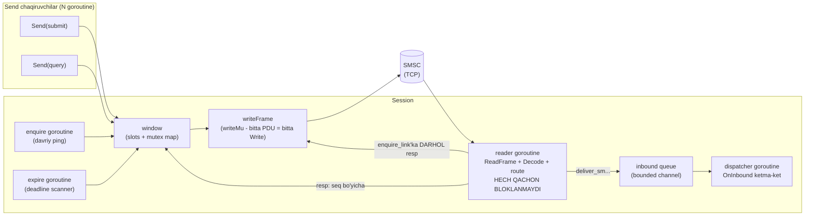

# 12-bob. Session engine: goroutine'lar, pending window, flow control

Protokolni bilish tugadi — endi uni YASHATISH kerak. Codec'larimiz baytlarni PDU'ga aylantiradi, lekin real gateway'da bir vaqtning o'zida: yuzlab submit javob kutyapti, SMSC DLR'lar oqizyapti, enquire_link'lar yurib turibdi, kimdir Close chaqirdi — va bularning bari BITTA TCP ulanish ustida. Bu bobda shu orkestrni boshqaradigan **session engine**'ni quramiz: deadlock'siz, backpressure'li, o'z-o'zini o'ldirmaydigan runtime. Bu kitobning eng katta muhandislik bobi va uning markazida bitta haqiqiy voqea turadi — real production gateway'ning "sirli uzilishlar" kasalligi, uning anatomiyasi va davosi.

Oldindan aytib qo'yay: bu bobdagi deyarli har qaror bitta tamoyilning oqibati — **read loop hech qachon bloklanmasligi kerak**. Uni yodda tutib o'qing; bob oxirida u sizga tabiiy ko'rinadi.

## 12.1 Nega window: throughput matematikasi

Eng sodda client shunday ishlaydi: submit_sm yubor → resp kut → keyingisini yubor. Bu **stop-and-wait** (sync mode, window=1) va uning shifti — RTT (round-trip time):

```
throughput = 1 / RTT
RTT = 50ms  →  maksimum 20 xabar/soniya
RTT = 100ms →  maksimum 10 xabar/soniya
```

Operator bilan shartnomangizda 300 TPS yozilgan bo'lsa, stop-and-wait bilan unga HECH QACHON yetmaysiz — muammo kodda emas, fizikada. Yechim protokolning o'zida: SMPP asinxron (§2.9) — javob kutmasdan bir nechta request yuborish mumkin, korrelyatsiya sequence_number orqali (2-bob). Javob kutilayotgan request'lar soni cheklanadi va bu chegara **window** deb ataladi:

```
throughput ≈ window / RTT
window=10, RTT=50ms  →  ~200 TPS
window=32, RTT=100ms →  ~320 TPS
```

Ikki muhim ogohlantirish. Birinchi: **"window" so'zi spec'da YO'Q** — §2.5.2 Note'da "10 tagacha outstanding operatsiya" degan guideline bor, xolos; limit — implementatsiya va operator kelishuvi. Ikkinchi: katta window tekin emas — ulanish uzilsa window'dagi HAMMA submit'ning taqdiri noma'lum bo'ladi (window=100 → 100 ta "yubordimmi-yo'qmi?"), va 11-bobdan tanish empirik qoida bor: window ≤ 2–3 × operator TPS'i, aks holda batch oxirida RTHROTTLED to'planadi. Amaliy diapazon — 10 dan 100 gacha.

## 12.2 Goroutine arxitekturasi

Session engine to'rt goroutine'da yashaydi (+Send chaqiruvchilarning o'z goroutine'lari):



Rollar qat'iy ajratilgan:

- **reader** — yagona o'quvchi: `ReadFrame` → `Decode` (10-bob dispatcheri) → marshrut. Uning ichida OG'IR ISH YO'Q: resp'lar window'ga uzatiladi (mutex ostidagi map amali — nanosekundlar), kelgan request'lar bounded queue'ga NON-BLOCKING joylanadi, enquire_link'ka javob shu yerning o'zida yoziladi.
- **dispatcher** — foydalanuvchi kodini (`OnInbound`) chaqiradigan YAGONA joy. Handler qancha sekin bo'lsa ham reader'ga ta'sir qilmaydi — faqat queue to'ladi (va bu holat protokol darajasida halol hal qilinadi — quyida).
- **enquire** va **expire** — timer goroutine'lari.
- **Yozish alohida goroutine EMAS** — `writeMu` mutex ostidagi to'liq-frame `Write`. Ikki goroutine bitta conn'ga parallel yozsa PDU baytlari aralashadi (interleave) — mutex + "bitta PDU = bitta Write chaqiruvi" qoidasi buni istisno qiladi. Writer-goroutine + channel varianti ham to'g'ri; mutex sodda va bizning yozuvlar qisqa bo'lgani uchun yetarli.

Bu arxitekturaning API'ga chiqadigan yuzi — **sync-over-async** degan qaror. Ikki qutb bor: sof callback API (gosmpp yo'li: hamma narsa OnPDU/OnSubmitError hook'lari — to'liq nazorat, lekin "yubordim, javobi nima bo'ldi?"ni foydalanuvchi o'zi seq bo'yicha yig'ishi kerak) va sof sync API (fiorix yo'li: Submit bloklanadi — qulay, lekin sodda implementatsiyada bu stop-and-wait demakdir). Bizning `Send` ikkalasining yaxshisini oladi: chaqiruvchi uchun BLOKLANUVCHI oddiy funksiya (kod chiziqli o'qiladi, xato oddiy `error`), ichkarida esa window tufayli TO'LIQ asinxronlik — 50 goroutine parallel Send qilsa, 50 request simda yonma-yon uchadi (window ruxsat bergancha), javoblar esa qaysi tartibda kelsa ham egalarini topadi. Go'ning goroutine'lari aynan shu pattern uchun arzon: "har kutish — alohida goroutine" boshqa tillarda thread isrofi bo'lardi, Go'da esa tabiiy uslub. Callback'lar faqat bitta joyda qoladi — inbound oqim (`OnInbound`), chunki deliver_sm'lar bizning so'rovimizga javob emas, SMSC tashabbusi: ularga "kutish" semantikasi mos kelmaydi. Bu taqsimot 13-bobda Client API'ga ko'tariladi va u yerda uch kutubxona bilan batafsil solishtiramiz.

Va TCP darajasidagi ikki tafsilot, ikkalasi ham "kichik PDU'lar oqimi" tabiatidan: (1) **TCP_NODELAY** — Nagle algoritmi + delayed ACK kombinatsiyasi kichik yozuvlarni 40–200ms ushlab turib SMPP latency'sini o'ldiradi; yaxshi yangilik — **Go'da TCP_NODELAY DEFAULT yoqiq** (net paketi har TCP conn'da SetNoDelay(true) qiladi), shuning uchun kodda maxsus hech narsa qilmaymiz — faqat uni bilib qo'yish va O'CHIRMASLIK kerak; (2) to'liq serialize qilib bitta Write — yuqoridagi qoida Nagle'siz dunyoda "har Write alohida segment ketishi mumkin" degani bilan ham hamohang: PDU'ni bo'lak-bo'lak yozish har bo'lakni alohida segmentga aylantirib isrof qiladi.

## 12.3 Production kaskadi: bu arxitektura nimadan himoya qiladi

Endi va'da qilingan voqea — real production gateway (gosmpp asosida) va uning "№12 sirli uzilishlar"i. Anatomiya, qadam-baqadam:

1. gosmpp har ulanishga bitta read-loop goroutine yuritadi: TCP'dan o'qi → parse → **OnPDU callback'ni SINXRON chaqir**.
2. Gateway'ning OnPDU'si kelgan PDU'ni sig'imi 500 lik jobQueue kanaliga soladi; u yerdan 5 worker olib qayta ishlaydi (DB, webhook...).
3. DLR burst keldi (operator kechasi to'plangan DLR'larni ertalab quyadi) — worker'lar DB bilan band, jobQueue TO'LDI.
4. Navbatdagi deliver_sm'da OnPDU jobQueue'ga yozolmay **BLOKLANDI** → read loop keyingi baytni o'qiy olmaydi.
5. O'qilmagan baytlar orasida **enquire_link_resp'lar ham bor** — gateway o'z ping'iga javob "olmayapti" (aslida javob kelgan, socket buferida yotibdi!).
6. 30 soniya "jimlik" → gosmpp ulanishni o'lik deb topib YOPADI → barcha yo'ldagi Submit'lar `ErrConnectionClosing` → alert, panika, qayta ulanish, queue yana to'la — sikl boshiga.

Diqqat qiling: ildiz sabab tarmoqda ham, SMSC'da ham emas — **o'z read path'ining bloklanishi o'z keepalive'ini o'ldirgan**. Bu SMPP session engine'laridagi eng klassik o'lim turi va bizning arxitektura unga uch qatlamli davo beradi: (1) reader OnInbound'ni chaqirmaydi — dispatcher chaqiradi; (2) queue'ga joylash non-blocking — to'la bo'lsa PDU tashlanadi va SMSC'ga **RX_T_APPN** ("vaqtincha ololmayman, qayta urin" — 11-bob) qaytadi: yo'qotish jim emas, protokol darajasida HALOL; (3) enquire_link'ka javob umuman queue'ga bormaydi — read path'ning o'zida yoziladi.

> **⚠ Amaliyotda — "ack sync, processing async" bu yerda kod bo'ldi.** 9-bobda qoida sifatida aytilgan gap endi `handleInboundRequest`da yashaydi: deliver_sm keldi → AVVAL queue'ga joylash urinishi → KEYIN ack (muvaffaqiyatda status=0, to'lganda RX_T_APPN). Tartib ham muhim: teskarisi ("avval ack, keyin joylashga urinish") to'lgan queue'da "ack qildik-u tashladik" degan JIM yo'qotishga aylanadi — SMSC yetkazdim deb hisoblaydi, siz esa DLR'ni ko'rmadingiz. Bizning tartibda yo'qotish yo'q: yo qabul qildik (ack 0), yo halol rad etdik (RX_T_APPN — SMSC keyinroq qayta yuboradi).

> **⚠ Amaliyotda — worker ichida uxlamang.** O'sha gateway'ning ikkinchi kasali (9-bobda tanishgan out-of-order DLR race'ining "davosi"): DLR uchun DB'da xabar topilmasa worker `time.Sleep(1s)` bilan 3 martagacha qayta uringan. Natija: (1) sleep ochiq DB tranzaksiyasi ichida — connection 3 soniya band; (2) uxlayotgan worker ishlamaydi — DLR burst'ida beshala worker ham uxlab qoladi → jobQueue to'ladi → yuqoridagi kaskad. Saboq umumiy: **cheklangan worker pool'da hech qachon in-place kutish qilmang** — "keyinroq qayta ishla"ning to'g'ri shakli xabarni (TTL bilan) qaytarib qo'yib worker'ni BO'SHATISH, 9-bobdagi "kutish xonasi" pattern'i. Bizning engine'da bu xato strukturaviy qiyinlashtirilgan: OnInbound bitta dispatcher goroutine'da — unda uxlasangiz queue to'ladi va RX_T_APPN oqadi, ya'ni muammo metrikalarda BAQIRIB ko'rinadi, jimgina session o'ldirmaydi.

## 12.4 Pending window: mutex'li map

Window'ning ma'lumotlar strukturasi — savolga o'xshamagan savol: "concurrent map kerak — sync.Map olamizmi?" **Yo'q.** sync.Map faqat ikki holatda yutadi: key bir marta yozilib KO'P o'qilsa, yoki goroutine'lar kesishmaydigan key to'plamlarida ishlasa (victoriametrics tahlili). SMPP window'da har entry **bir marta yoziladi, bir marta o'chiriladi** — write-heavy, doim yangi key'lar — bu sync.Map'ning eng yomon case'i. Ustiga `len()` (window depth metrikasi) va deadline bo'yicha iteratsiya (expire scan) kerak — sync.Map'da noqulay. Oddiy `sync.Mutex + map[uint32]*pending` — to'g'ri javob; 10–100 entry'lik map'da mutex contention haqida gapirishga ham arzimaydi.

Bizning `window` uch qismdan iborat (`code/session/window.go`):

```go
type window struct {
	slots chan struct{} // bo'sh joylar semafori — to'lganda Send bloklanadi

	mu sync.Mutex
	m  map[uint32]*pending
}
```

- **slots** — sig'imi WindowSize bo'lgan kanal-semafor: Send avval slot oladi (`acquire`), window to'la bo'lsa **ctx bekor bo'lguncha bloklanadi**. Backpressure shu tarzda chaqiruvchiga OQIB CHIQADI: "SMSC ulgurmayapti" sizning submit-oqimingizni tabiiy sekinlashtiradi. (Muqobil dizayn — darhol ErrWindowFull qaytarish, fiorix uslubi; bloklanish sodda va ctx bilan boshqariladi.)
- **map** — seq → pending{cmd, deadline, ch}. Javob kelganda `resolve` entry'ni topib, natijani sig'imi 1 kanalga yozadi va slotni bo'shatadi.
- **resolve'dagi ikki tekshiruv**: seq topilishi SHART (topilmasa — kechikkan/duplicate javob: log, e'tiborsiz, nack YO'Q — 11-bob) va resp command_id request'ning `Resp()`iga mos kelishi kerak (buggy SMSC seq'ni to'g'ri, turini noto'g'ri qaytarishi mumkin; generic_nack istisno — u har qanday request'ga javob sanaladi).

Expire scanner — window'ning axlat yig'uvchisi: deadline'i o'tgan entry'lar `ErrResponseTimeout` bilan yakunlanadi. Busiz javobsiz qolgan har submit map'da ABADIY qoladi: xotira oqadi va sloti qaytmagani uchun window asta "toraya" boradi — bir necha soatda window=10 lik sessiya window=0 ga aylanib to'liq qotadi. Bu bug'ning production'dagi ko'rinishi: "gateway sekinlashib-sekinlashib butunlay to'xtaydi, restart davolaydi" — tanish simptommi?

`Send`ning to'liq hayoti endi bir zanjir: seq olish (Sequencer) → encode → slot olish (bloklashi mumkin) → map'ga yozish → writeFrame → kanaldan kutish. Kutish nuqtasi to'rt tomondan uzilishi mumkin va har biri o'z ma'nosiga ega: **resp keldi** (reader `resolve` qildi), **expire** (`ErrResponseTimeout` — javobsizlik), **ctx bekor** (chaqiruvchi kutishdan voz kechdi) va **sessiya o'limi** (`failAll` → `ErrSessionClosed`). Kodda eng nozik joyi — ctx holati:

```go
select {
case r := <-p.ch:
	return r.resp, r.err
case <-ctx.Done():
	// Poyga: resolve allaqachon yozgan bo'lishi mumkin. fail entry
	// mavjud bo'lsagina yozadi — har ikki holda ch'da AYNAN bitta
	// natija bor.
	s.win.fail(seq, ctx.Err())
	r := <-p.ch
	if r.err == nil {
		return r.resp, nil // javob ctx bilan bir vaqtda yetib keldi
	}
	return Resp{}, r.err
}
```

Nega bunchalik ehtiyotkorlik? ctx bekor bo'lish bilan javob kelish orasida millisekundlik poyga bor: chaqiruvchi endigina voz kechayotganda reader javobni topib kanalga yozayotgan bo'lishi mumkin. Invariant oddiy, lekin uni ushlab turish intizom talab qiladi: **kanalga yozuvchi HAR DOIM aynan bitta** — `resolve`, `fail`, `expire` va `failAll`ning bari entry'ni mutex ostida map'dan O'CHIRIB keyin yozadi, ya'ni entry'ni kim birinchi o'chirsa, yozish huquqi faqat unda. Shu invariant tufayli ctx case'ida `<-p.ch` hech qachon qotib qolmaydi va sig'imi 1 kanal hech qachon ikki marta to'lmaydi. Bunday "kim yozadi" intizomisiz yozilgan window'lar production'da ikki xil sinadi: goroutine leak (hech kim yozmadi — Send abadiy kutadi) yoki panic/yutilgan javob (ikkisi yozdi).

E'tibor bering, ctx bekor bo'lganda ham javob KELGAN bo'lsa biz uni qaytaramiz — "bekor qildim-u javob keldi" holatida javobni tashlash isrof: chaqiruvchi undan foydalanadimi yo'qmi — o'z ishi, lekin "xabar aslida qabul qilingan"ligini bilish duplicate-qarorlar uchun oltin ma'lumot. Va yana bir tafsilot: ctx bekor qilingan request simda KETIB BO'LGAN — SMSC uni qayta ishlayveradi, faqat javobini endi kutmaymiz; kechikkan resp kelganda reader uni "notanish seq" sifatida log qiladi. SMPP'da "so'rovni chaqirib olish" degan narsa yo'q (cancel_sm xabarni bekor qiladi, so'rovni emas — 10-bob).

## 12.5 Sequence generator: atomic + wrap

```go
func (s *Sequencer) Next() uint32 {
	for {
		cur := s.n.Load()
		next := cur + 1
		if next > maxSequence {
			next = 1
		}
		if s.n.CompareAndSwap(cur, next) {
			return next
		}
	}
}
```

Uch nozik nuqta: (1) diapazon 1..0x7FFFFFFF (§5.1.4) — 0 request uchun valid EMAS (u generic_nack'ning "bilmayman"i); (2) wrap spec'da YO'Q — 0x7FFFFFFF'dan keyin 1'ga qaytish industriya konventsiyasi (cloudhopper manbasida aynan shu); oddiy `atomic.AddUint32` wrap'ni bilmaydi, shuning uchun CAS loop; (3) **har PDU alohida seq oladi** — shu jumladan multipart split'ning HAR segmenti. gosmpp'ning #178 bug'i aynan shu qoidaning buzilishi edi: `Split()` qismlariga bitta seq berilgan → SMSC uchta submit'ga uchta resp qaytaradi, uchalasi bitta seq bilan — korrelyatsiya vayron. Bizning dizaynda bu xato strukturaviy imkonsiz: seq'ni Send'ning o'zi oladi, PDU'da "tayyor seq" degan tushuncha yo'q.

Yana bir tafsilot: submit ham, enquire_link ham, query ham — hammasi BITTA seq fazosidan oladi. "PDU turiga qarab alohida counter" degan g'oya chiroyli ko'rinadi-yu, resp'da faqat seq keladi (command_id resp'niki bo'ladi) — fazolar ajratilsa 88123-submit bilan 88123-query'ni farqlab bo'lmay qoladi.

## 12.6 Out-of-order va korrelyatsiya intizomi

Spec ochiq aytadi (§2.5.2): javoblar so'rovlar tartibida kelishi SHART EMAS. SMSC ichida submit'lar turli ichki queue'larga tushadi, turli tezlikda qayta ishlanadi — seq=88123 va seq=88124 yuborsangiz, javoblar 88124, 88123 tartibida kelishi mutlaqo normal. Shuning uchun **korrelyatsiyaning yagona kaliti — sequence_number**; "oxirgi yuborganimga javob keldi" degan har qanday taxmin buziladi. `TestSendOutOfOrderResponses` buni ataylab sahnalashtiradi: server javoblarni teskari tartibda beradi, message_id ichiga seq yashiriladi ("MSG-88124") va test har Send AYNAN o'z javobini olganini tekshiradi.

Lekin faqat seq'ga ishonish ham yetarli emas — uch chekka holat intizom talab qiladi:

1. **Resp turi tekshiruvi.** resolve seq mosligini topgach resp command_id'si request'ning `Resp()`iga tengligini ham tekshiradi. Buggy SMSC'lar (yoki noto'g'ri routing qiluvchi oraliq proxy'lar) seq'ni to'g'ri, turini xato qaytargan holatlar hujjatlangan — submit_sm'ga query_sm_resp kelsa, uni submit javobi deb qabul qilish ma'lumot korruptsiyasi. Bunday resp "bizniki emas" deb log'ga tushadi, entry esa expire'gacha kutadi.
2. **generic_nack istisnosi.** U HAR QANDAY request'ga javob bo'la oladi (turi mos kelmasa ham) — sizning submit'ingiz serverda decode bo'lmagan bo'lishi mumkin. seq'li nack window orqali egasiga boradi va Send uni oladi; seq=0 nack esa (server "qaysi PDU'ing buzuqligini ham bilmayman" deydi — 11-bob) hech kimga tegishli emas — log + framing shubhasi.
3. **Duplicate/kechikkan resp.** Expire bo'lib ketgan request'ning javobi keyin kelsa — map'da entry yo'q, resolve false, log, E'TIBORSIZ. Muhim taqiq: notanish resp'ga generic_nack YUBORILMAYDI (resp'ga nack degan tushuncha yo'q — 11-bob), aks holda buggy juftlik bir-biriga nack otib o'ynaydi.

`WindowDepth()` — bu intizomning monitoring darchasi: sog'lom sessiyada depth pulsatsiya qilib 0 atrofida yuradi; barqaror o'sish "javoblar yo'qolyapti" (yoki expire scanner ishlamayapti) degani; doim WindowSize'da qotib turish — SMSC ulgurmayapti yoki window juda kichik. 16-bobda bu gauge Prometheus'ga chiqadi.

## 12.7 RTHROTTLED va oqim boshqaruvi zanjiri

11-bobda RTHROTTLED'ga "queue'ga qaytar + rate pasaytir + backoff" deb aytgan edik. Endi mas'uliyat qatlamlarga qanday taqsimlanishini aniqlashtiramiz, chunki "hammasi session'da bo'lsin" degan intuitsiya noto'g'ri:

| Qatlam | Mas'uliyati | Nima QILMAYDI |
|---|---|---|
| session (bu bob) | Window (outstanding chegara), backpressure'ni Send'ga oqizish | Retry QILMAYDI, rate BILMAYDI — u faqat "bir vaqtda nechta" |
| client (13-bob) | Rate limiter (token bucket — "soniyasiga nechta"), RTHROTTLED'da Classify→queue'ga qaytarish, reconnect | Window'ni chetlab o'tmaydi |
| application | Retry queue'ning o'zi (DB/Redis), biznes-prioritetlar | Protokol tafsilotini bilmaydi |

Window bilan rate limiter'ni adashtirish — keng tarqalgan dizayn xatosi. **Window "parallelizm"ni cheklaydi, rate "tezlik"ni**: window=100 bo'lsa-yu RTT=10ms bo'lsa, nazariy 10 000 TPS chiqadi — operator limiti 200 bo'lsa RTHROTTLED yomg'iri boshlanadi; teskarisi, rate=200 TPS to'g'ri sozlangan bo'lsa window katta bo'lishi zararsiz (u hech qachon to'lmaydi). Session ataylab faqat window'ni biladi: u protokol-darajali invariant ("javobsiz so'rovlar soni"); rate esa biznes/shartnoma kattaligi — u yuqori qatlamda yashaydi (`golang.org/x/time/rate`, 13-bob). RTHROTTLED kelganda session hech narsa qilmaydi — u shunchaki resp: Send uni chaqiruvchiga qaytaradi, chaqiruvchi (client) Classify qilib transient deb topadi va o'z siyosatini yurgizadi. Qatlamlar toza: session transportni, client siyosatni, application biznesni boshqaradi.

## 12.8 Timer'lar: enquire_link, expire va half-open

Session'da uch timer yashaydi (4-bob §7.2 jadvalidan ikkitasi + expire):

- **enquire_link ticker** — davriy ping. Bizning siyosat: bound holatda har intervalda yuboriladi (traffic bo'lsa ham — soddalik; spec har qanday PDU'ni tiriklik belgisi deydi, lekin fixed-interval zarari yo'q va kodni soddalashtiradi). Javob `ResponseTimeout` ichida kelmasa sessiya **o'zini o'lik deb topadi** — terminate.
- **expire scanner** — 12.4'dagi window tozalovchi; interval ResponseTimeout/4.
- **inactivity timer bizda YO'Q** — u qabul tomonining himoyasi (SMSC "jim client'ni uzaman" uchun) va 14-bob serverida paydo bo'ladi; client uchun enquire_link + response timeout yetarli.

Intervalni tanlash — 4-bobdan tanish "spec'da qiymat YO'Q" hududi. Industriya tavsiyalari 15 soniyadan 15 daqiqagacha tarqoq; eng keng konsensus — **30–60 soniya**, va uch qiymatning munosabati o'zgarmas: `response_timeout < enquire_link < inactivity` (SMSC'ning inactivity timeout'i odatda 60–120s — sizning enquire intervalingiz undan KICHIK bo'lishi shart, aks holda jim daqiqalarda SMSC sizni uzadi). Eski darsdagi operator TZ misolini eslang: "enquire_link 30s" — bu bir operatorning shartnoma sharti, spec fakti emas; boshqa operator 60s so'raydi. Shuning uchun `Config.EnquireLink` — konfiguratsiya, konstanta emas. Default'larimiz jadvali (har biri "nega aynan shu" javobi bilan):

| Parametr | Default | Asos |
|---|---|---|
| WindowSize | 10 | Spec'dagi yagona raqamli ishora — §2.5.2 "10 outstanding" guideline |
| ResponseTimeout | 10s | Konsensus oralig'i (10–60s) ning pastki cheti: tez fail → tez qaror |
| EnquireLink | 30s | 30–60s konsensusining pastki cheti; operator TZ'si bilan almashtiriladi |
| InboundQueue | 64 | DLR burst'ini yumshatadigan, lekin "cheksiz buffer" illyuziyasini bermaydigan o'lcham |
| MaxPDUSize | 64KB | TLV length nazariy maksimumi — undan katta frame ISHONCHSIZ (2-bob OOM himoyasi) |

enquire_link nimadan himoya qilishini aniq bilish kerak: **half-open connection**. TCP'da bir tomon o'lganini (kabel uzildi, NAT state tashladi, server panic) ikkinchi tomon YOZMAGUNCHA sezmaydi — o'qib turgan socket shunchaki jim. TCP keepalive (L4) bor-ku deysizmi? U default'da 2 SOATDAN keyin ishga tushadi va faqat TCP stack tirikligini tekshiradi: server protsessi hang bo'lsa (deadlock, GC-death) kernel keepalive'ga javob beraveradi, SMPP esa o'lik. enquire_link — L7 tekshiruv: javob kelishi butun zanjir (socket → reader → writeFrame) ishlayotganini isbotlaydi. `TestEnquireLinkDeath` aynan shu stsenariyni qotiradi: server enquire_link'ni O'QIYDI (L4 tirik!), lekin javob bermaydi — sessiya o'zini belgilangan vaqtda o'ldirishi SHART.

Bizning enquire ham window'dan slot oladi — bu tasodif emas: ping oddiy request, unga ham javob korrelyatsiyasi kerak. Yon effekti foydali: window butunlay to'lib qolgan (SMSC javob bermayotgan) sessiyada enquire ham o'tolmaydi → ResponseTimeout → sessiya o'ladi — "javobsiz, lekin tirikday ko'ringan" zombi holat o'z-o'zidan hal bo'ladi.

## 12.9 Graceful shutdown va sessiya o'limi

Ikki xil tugash bor va ularni aralashtirmaslik kerak.

**Graceful (`Close`)** — §4.2 tartibi, to'rt qadam: (1) yangi Send'lar STOP (closing flag — darhol `ErrSessionClosed`); (2) **drain**: window bo'shashini kutish (ctx chegarasida) — yo'ldagi submit'lar javobini olsin; (3) unbind → unbind_resp kutish; (4) TCP close. Drain'siz yopish — window'dagi har xabar "noma'lum taqdir"ga aylanadi; unbind'siz yopish — qo'pollik: ko'p SMSC'lar buni xato deb log qiladi va ba'zilari qisqa banga olib boradi.

**Terminate** — qattiq o'lim (o'qish xatosi, enquire javobsizligi, peer unbind): state=CLOSED, conn yopiladi, window'dagi HAMMA pending `ErrSessionClosed` bilan yakunlanadi. Va shu yerda kitobning takrorlanuvchi savoli qaytadi: **eski window'dagi xabarlar yangi ulanishga ko'chadimi?** Bizning javob — YO'Q, ataylab: ular resp olmagan, ya'ni taqdiri noma'lum (11-bob "uchinchi rejim"); avtomatik resend at-least-once tanlovini JIMGINA qilib qo'ygan bo'lardi (duplicate OTP xavfi). Buning o'rniga har biri caller'ga xato bilan qaytadi — retry siyosatini biladigan qatlam (13-bob client + 11-bob Classify) ongli qaror qiladi.

Bu tanlovning to'liq xaritasi (chunki "resend qilaymi" savoli har SMPP integratsiyasida bir marta albatta og'riq bilan hal qilinadi):

- **At-least-once** (uzilishda resend): xabar YO'QOLMAYDI, lekin duplicate mumkin — SMSC olgan-u resp o'lgan bo'lsa abonentga ikki nusxa boradi. Marketing/notification uchun odatda maqbul.
- **At-most-once** (resend yo'q, bizning default): duplicate YO'Q, lekin xabar yo'qolgan bo'lishi mumkin. OTP/tranzaksion xabarlar uchun xavfsizroq default — yo'qolgan OTP'ni foydalanuvchi "qayta yuborish" tugmasi bilan hal qiladi, ikkita kelgan OTP esa ishonchni buzadi (qaysi biri to'g'ri?).
- **Aqlli oraliq** (production maqsadi): resend'dan OLDIN taqdirni aniqlash — DLR kelganmi (9-bob korrelyatsiya jadvali), query_sm nima deydi (10-bob) — va faqat "izi yo'q" xabarlarni qayta yuborish. Bu dedup kalitiga tayanadi: har xabarga o'z UUID'ingiz (SMSC message_id emas — u resp bilan keladi, resp esa yo'q!) va SMSC tomonda... afsuski, SMPP'da client idempotency kaliti YO'Q — shuning uchun mutlaq kafolat yo'q, faqat ehtimolni kichraytirish bor.

Bu uchlikni bilib qo'yish 13-bob Client'ining `Submit` xatolarini to'g'ri o'qish uchun zarur: `ErrSessionClosed` olgan xabar "yuborilmagan" EMAS — "taqdiri noma'lum". Farqni yo'qotgan kod duplicate fabrikasiga aylanadi.

Reconnect'ning o'zi 13-bobda (Client qatlami), lekin siyosatini shu yerda aytib qo'yamiz: exponential backoff (1s→2s→4s...→plato 60s) + **jitter** (har kutishga tasodifiy ulush). Jitter nima uchun majburiy: operator SMSC'si restart bo'lsa YUZLAB ESME bir sekundda uziladi va jitter'siz hammasi aynan bir vaqtda qayta uriladi — **thundering herd**: sinxron to'lqinlar SMSC'ni qayta-qayta cho'ktiradi. Tasodifiylik to'lqinni vaqtga surkaydi. Va muvaffaqiyatli bind'da backoff RESET qilinadi — 11-bobdagi RetryPolicy'da jitter yo'qligi esda bo'lsa kerak: u yerda bitta sessiya ichidagi xabar retry'si (determinizm testga qulay), bu yerda ko'p-client reconnect to'lqini — ikki xil dunyo.

## 12.10 Kod: session package sayohati

Milestone fayllari: `sequencer.go` (12.5'da to'liq ko'rdik), `window.go` (12.4), va yakunlovchi `session.go`. API minimal:

```go
func New(conn net.Conn, cfg Config) *Session

func (s *Session) Bind(ctx context.Context, b pdu.Bind) (pdu.BindResp, error)
func (s *Session) Send(ctx context.Context, req Request) (Resp, error)
func (s *Session) Close(ctx context.Context) error
func (s *Session) Done() <-chan struct{} // reconnect signali (13-bob)
func (s *Session) State() State
func (s *Session) WindowDepth() int      // monitoring (16-bob)
```

`Request` — 10-bob dispatcherining aksi bo'lgan kichik interfeys: `Encode(seq) ([]byte, error)` + `Cmd() CommandID` — pdu package'idagi barcha request turlari unga avtomatik mos. `Send` sync-over-async: chaqiruvchi uchun oddiy blocking chaqiruv, ichkarida esa window orqali parallellik — N goroutine bir vaqtda Send qilsa, N ta request simda yonma-yon uchadi (window chegarasida). Table 2-1 enforcement ham shu yerda: OPEN holatda submit_sm yuborishga urinish SMSC'gacha bormasdan lokal xato (4-bob `CanSend`).

Reader'ning marshrutlash mantig'i — 10-bob dispatcherining "endi nima qilamiz" davomi:

```go
switch p.(type) {
case pdu.EnquireLink:
	// Read path'da DARHOL — queue'siz (half-open davosi).
	s.writeFrame(pdu.EncodeEnquireLinkResp(h.Sequence))
case pdu.Unbind:
	// Peer-initiated unbind: resp → yopish (§4.2).
	s.writeFrame(pdu.EncodeUnbindResp(0, h.Sequence))
	s.terminate(fmt.Errorf("session: peer unbind qildi"))
	return
case pdu.GenericNack:
	...
default:
	if h.ID.IsResponse() {
		if !s.win.resolve(h.Sequence, Resp{PDU: p, Header: h}) {
			s.logf("session: notanish seq=%d (%s) — e'tiborsiz", h.Sequence, h.ID)
		}
		continue
	}
	s.handleInboundRequest(p, h)
}
```

Testlar bobning haqiqiy qahramonlari — har biri yuqoridagi tamoyillardan birini qotiradi (hammasi net.Pipe ustida: sinxron, buffersiz — deadlock'lar darhol ko'rinadi; yakuniy test esa real listener bilan):

| Test | Nimani isbotlaydi |
|---|---|
| `TestSendOutOfOrderResponses` | Teskari tartibda kelgan javoblar seq bo'yicha TO'G'RI egalariga boradi (message_id="MSG-seq" hiylasi bilan) |
| `TestWindowFullBlocks` | Window to'la → Send ctx'gacha bloklanadi; slot bo'shashi bilan davom |
| `TestResponseTimeout` | Javobsiz request `ErrResponseTimeout` oladi (ctx emas!) va window bo'shaydi |
| `TestEnquireLinkAutoResp` | Kelgan ping'ga javob handler'siz, read path'dan |
| `TestEnquireLinkDeath` | O'z ping'iga javob olmagan sessiya o'zini o'ldiradi (half-open) |
| `TestInboundQueueFullNeverBlocksReader` | Queue to'la → deliver_sm'ga RX_T_APPN, reader TIRIK qoladi (anti-kaskad!) |
| `TestCloseGracefulDrain` | Close: yangi Send rad → drain → unbind → resp → yopiq |
| `TestPeerUnbind` | SMSC unbind'iga resp + toza yopilish |
| `TestSequencerWrap` | 0x7FFFFFFF → 1 (0 hech qachon chiqmaydi) |
| `TestSessionAgainstTestServer` | Real TCP listener bilan to'liq lifecycle: bind → avto-enquire'lar → graceful close |

Test harness haqida ikki og'iz — chunki transport tanlovi testning MAZMUNINI o'zgartiradi. Deyarli barcha testlar `net.Pipe` ustida: u sinxron va BUFFERSIZ — yozuvchi o'quvchi olguncha bloklanadi. Bu real TCP'dan qattiqroq muhit va aynan shunisi qimmatli: reader biror joyda yashirincha bloklansa, net.Pipe testi darhol qotib qoladi (real TCP'da esa kernel buferi gunohni bir muddat yashirib turadi — bug production'gacha omon qoladi). Yakuniy test (`TestSessionAgainstTestServer`) esa ataylab real listener bilan: realistic buffering, real dial/close semantikasi — ikkala rejimning qachon-qaysi ekani 15-bobda alohida mavzu.

```
$ go test ./session/ -race -count=5
ok      smpp/session
$ go vet ./... && go test ./... -race
ok      smpp/client
ok      smpp/coding
ok      smpp/dlr
ok      smpp/pdu
ok      smpp/session
ok      smpp/smsc
ok      smpp/tlv
```

`-race` bilan 5 marta — timing'ga bog'liq testlarda bir martalik "ok" yolg'onchi bo'lishi mumkin (15-bobda bu mavzuga qaytamiz).

## Xulosa

Session engine — to'rtta ajratilgan rol (reader/dispatcher/enquire/expire) + ikkita himoyalangan resurs (window map'i, write yo'li) + bitta muqaddas qoida: **read loop hech qachon bloklanmaydi**. Window sync-over-async Send'ni beradi: throughput = window/RTT, backpressure slot semafori orqali chaqiruvchiga oqadi, javobsizlar expire bilan tozalanadi (aks holda window "torayib o'ladi"). Seq — atomic CAS + wrap, har PDU'ga (segmentga ham!) alohida. enquire_link — L7 half-open davosi (TCP keepalive L4 va 2 soat — boshqa hikoya); o'z ping'iga javob olmagan sessiya o'zini o'ldiradi. Yopilish ikki xil: graceful (stop→drain→unbind→close) va terminate (pending'lar xato bilan, resend YO'Q — duplicate qarori yuqori qatlamga). Va o'sha production kaskadi endi shunchaki qayg'uli hikoya emas — har kasaliga testda qotirilgan davo bor. Keyingi bobda bu dvigatel ustiga foydalanuvchi ko'radigan qatlamni quramiz: Client API — bind mode'lar, auto-reconnect, SubmitLong va rate limiting.

**Takrorlash savollari** (javoblar matnda bor — o'zingizni tekshiring):

1. Window=25 va RTT=80ms'da nazariy maksimal TPS qancha? 1000 xabar qancha vaqt oladi?
2. Production kaskadining olti qadamini ayting va bizning kodda uni qaysi UCH nuqta uzadi.
3. Nega pending window uchun sync.Map yomon tanlov?
4. Expire scanner'siz sessiya qanday "sekin o'ladi"?
5. Nega multipart'ning har segmenti alohida seq olishi SHART (qaysi real bug shu qoidani buzgan)?
6. TCP keepalive nima uchun enquire_link'ning o'rnini bosolmaydi? Go'da TCP_NODELAY haqida nima esda tutish kerak?
7. Terminate'da pending xabarlarni avtomatik resend qilmaslik qaysi tanlovni kimga qoldiradi?
8. Reconnect backoff'ida jitter nima uchun majburiy, xabar-retry backoff'ida esa yo'q?

**Mashqlar:** [exercises/12-session-engine.md](../exercises/12-session-engine.md) — kaskad diagrammasi, window matematikasi va read-loop-ichida-Submit deadlock isboti.

---

**Oldingi bob:** [11-bob. Error handling](11-error-handling.md) · **Keyingi bob:** 13-bob. ESME client API (`13-client-api.md`) — uch kutubxona taqqosi, auto-reconnect va SubmitLong.

## Manbalar

- [SMPP v3.4 spec, Issue 1.2](../resources/SMPP_v3_4_Issue1_2.pdf) — §2.5.2 (asinxronlik, "10 outstanding" Note), §2.9 (§7.2 timer'lar), §4.2 (unbind tartibi), §5.1.4 (seq diapazoni)
- Real production gateway (gosmpp asosida) tajribasi — kaskad va getMessageWithRetry anti-pattern'ining birlamchi bayoni (bob matniga singdirilgan)
- [Nordic Messaging — Window size explained](https://nordicmessaging.se/tech-notes/window-size-explained/) — window/throughput matematikasi va tanlash tavsiyalari
- [VictoriaMetrics — Go sync.Map](https://victoriametrics.com/blog/go-sync-map/) — sync.Map qachon yutadi/yutqazadi (benchmark'lar bilan)
- [gosmpp issues](https://github.com/linxGnu/gosmpp/issues) — #178 (split'da bitta seq), #151 (rebind qotishi), #170 (OnClosed chaqirilmasligi)
- [Marc Brooker — It's always TCP_NODELAY](https://brooker.co.za/blog/2024/05/09/nagle.html) va [Gopher Academy — TCP_NODELAY in Go](https://blog.gopheracademy.com/advent-2019/control-packetflow-tcp-nodelay/) — Nagle+delayed ACK va Go default xulqi
- [NowSMS — SMPP Async mode](https://nowsms.com/smpp-async-mode) — sync/async farqi amaliy tomondan