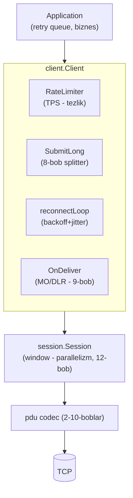

# 13-bob. ESME client API dizayni

Session engine (12-bob) protokol mexanikasini hal qildi — lekin uni har kuni ishlatadigan dasturchi "window slot'i", "terminate semantikasi" haqida o'ylamasligi kerak. Bu bobda session ustiga **foydalanuvchi qatlami** quramiz: `client.Client` — bind qilib beradigan, uzilsa o'zi qayta ulanadigan, uzun matnni o'zi bo'lib yuboradigan, operator TPS'ini hurmat qiladigan API. Va uni bo'shliqda emas, uch real Go kutubxonasining yonida loyihalaymiz — ularning har biri bitta savolga o'zicha javob bergan va har birining javobida o'rganish uchun ham, qaytarmaslik uchun ham narsa bor.

## 13.1 Uch kutubxona — uch falsafa

Go ekotizimida uchta tanish SMPP client bor (2026 holati; hammasi research'da GitHub/pkg.go.dev'dan bevosita tekshirilgan):

| Jihat | linxGnu/gosmpp | fiorix/go-smpp | ajankovic/smpp |
|---|---|---|---|
| API shakli | Event-driven callback'lar (OnPDU, OnAllPDU, OnSubmitError, OnClosed...) | Sync/blocking `Submit(sm)` — javob kelguncha kutadi | `Session.Send(ctx, pdu)` — context-first |
| Window | Opt-in `WindowedRequestTracking` (MaxWindowSize uint8, expire callback'lari) | `WindowSize` + `RespTimeout` (**default 1s!**) | SendWinSize/WindowTimeout |
| Auto-rebind | Bor (rebindingInterval) | Bor (BindInterval, status channel) | YO'Q — o'zing qurasan |
| Rate limit | Yo'q | `RateLimiter` interface (x/time/rate mos) | Rejada, API'da yo'q |
| Server tomon | Yo'q | `smpptest` (test server) | To'liq (net/http'ga o'xshash Handler) |
| Holat | Faol, eng ommabop | Faol, "not fully compliant" (halol disclaimer) | WIP, deyarli tashlab qo'yilgan |

**gosmpp** — eng to'liq lifecycle (auto-rebind, enquire, TLS), lekin sof callback dunyosi: "submit yubordim — javobi qani?" degan oddiy savolga javob yo'q, korrelyatsiyani OnPDU ichida seq bo'yicha O'ZINGIZ yig'asiz (12-bobdagi production gateway aynan shunday qilardi — Redis'da seq→msg mapping). **fiorix** — qulay sync API + RateLimiter, lekin ikki tuzoq: `RespTimeout` default **1 soniya** (SMSC 1.5s o'ylab qolsa sog'lom submit "timeout" bo'ladi — va 11-bobdan bilamiz: timeout'dagi retry duplicate xavfi!) va spec qamrovi to'liq emas. **ajankovic** — dizayn jihatdan eng toza (context-first, pluggable Sequencer, server Handler — bizning session API'ga ilhom bergan), lekin production'da sinalmagan WIP.

Farqni his qilish uchun bitta vazifani — "OTP yubor, natijasini bil" — ikki uslubda yozib ko'ramiz. Callback dunyosida (gosmpp uslubi, soddalashtirilgan):

```go
// Callback uslubi: natija KODNING BOSHQA JOYIDA, keyinroq, boshqa goroutine'da.
pending := map[uint32]chan string{} // korrelyatsiyani O'ZIMIZ yuritamiz
settings.OnPDU = func(p pdu.PDU, h pdu.Header) {
	if r, ok := p.(pdu.SubmitSMResp); ok {
		if ch, ok := pending[h.Sequence]; ok { // mutex ham kerak edi!
			ch <- r.MessageID
		}
	}
}
// ... yuborish joyida:
seq := nextSeq()
pending[seq] = make(chan string, 1)
sendSubmit(seq, sm)
select {
case id := <-pending[seq]: // o'zimiz yasagan "sync-over-async"
case <-time.After(10 * time.Second):
}
```

Sync-over-async dunyosida (bizniki):

```go
id, err := c.Submit(ctx, sm) // korrelyatsiya, timeout, window - hammasi ichkarida
```

E'tibor bering: callback uslubida foydalanuvchi 12-bobning YARMINI (pending map, korrelyatsiya, timeout) o'z kodida QAYTA yozishga majbur — va odatda xato yozadi (mutex unutiladi, expire yo'q, map leak). 12-bob gateway'idagi Redis'da seq→msg mapping — aynan shu majburiyatning production'dagi izi. Callback API "past darajali to'liq nazorat" sifatida o'z o'rniga ega (kutubxona yozuvchilar uchun!), lekin application dasturchisiga sync API to'g'ri abstraksiya.

Bizning tanlov shu uchlikning sintezi: **context-first + sync-over-async** (Send/Submit bloklanadi, ichkarida window paralelligi — 12-bob) + gosmpp darajasidagi lifecycle (auto-reconnect) + fiorix'dan RateLimiter g'oyasi (tuzatilgan default'lar bilan). Ikkala mashhur gosmpp bug'i esa testlarda regression sifatida qotirilgan: #178 (multipart segmentlariga bitta seq) — `TestSubmitLongUniqueSequences`, #151 (rebind ishlamay qolishi) — `TestReconnectAfterDrop`.

## 13.2 Qatlamlar va API



```go
func Dial(ctx context.Context, cfg Config) (*Client, error)

func (c *Client) Submit(ctx context.Context, sm pdu.SubmitSM) (string, error)
func (c *Client) SubmitLong(ctx context.Context, m LongMessage) ([]string, error)
func (c *Client) Close(ctx context.Context) error
// + Config.OnDeliver — kelgan deliver_sm'lar (MO ham, DLR ham)
```

Dizayn qarorlari, birma-bir:

**Dial sinxron bind qiladi.** Birinchi ulanish+bind muvaffaqiyatli bo'lmaguncha Dial qaytmaydi — noto'g'ri parol/manzil DARHOL xato beradi. Muqobil ("background'da ulanaveradi") konfiguratsiya xatosini "abadiy reconnect" shovqiniga yashiradi — deploy paytida sezilmay qoladigan turdagi xato. Keyingi uzilishlar esa background reconnect ishi.

**Bind mode — Config'da, default TRX.** v3.4'ning transceiver'i (4-bob) bitta ulanishda ikkala yo'nalish — zamonaviy integratsiyalarning standarti. TX+RX juftligi kerak bo'lsa (eski SMSC'lar TRX'ni qo'llamasligi mumkin — "Invalid Command ID" olsangiz shu belgi, 4-bob) — ikkita Client ochasiz: biri CmdBindTransmitter (Submit uchun), biri CmdBindReceiver (OnDeliver uchun); har biri o'z reconnect hayotini yashaydi. Buni bitta "juft client" abstraksiyasiga o'rashni ATAYLAB qilmadik: ikki mustaqil sessiyaning ikki mustaqil holati bor (biri tirik, biri o'lik bo'lishi normal — masalan RX uzilib TX ishlayotganda submit oqimi davom etadi, faqat DLR'lar kechikadi), ularni bitta obyekt qilib bog'lash holat kombinatorikasini yashiradi va "juftlikning yarmi o'lik" degan MUHIM operativ holatni ko'rinmas qiladi. Ikkala client bir xil system_id bilan bog'lanadi (operator odatda bitta account beradi) — RALYBND olsangiz, operator "bir system_id = bir sessiya" cheklovi qo'ygan bo'ladi (14-bob serverida bu rejimni implement qilamiz); u holda TRX yagona yo'l.

**Holat kuzatuvi ham API'ning qismi.** Load balancer/health check dunyosida "client tirikmi?" degan savolga javob kerak: `Client` uni ikki darchadan beradi — hozirgi sessiya bor-yo'qligi (Submit'ning ErrNotBound'i shu savolning inline javobi) va session'ning `State()`/`WindowDepth()` qiymatlari (16-bobda Prometheus gauge'lariga aylanadi). Bu kuzatuvchanlik gosmpp #170 saboqlaridan: holatni faqat callback'lar orqali bilib bo'ladigan client "jimgina o'lik" bo'lib qolishi mumkin.

**Submit — bitta xabar, uch xil xato.** Muvaffaqiyatda message_id (9-bob korrelyatsiyasi uchun DARHOL saqlanadigan qiymat). Xatoda esa turi muhim:

```go
// StatusError — SMSC resp'ida command_status != 0. Xatoning O'ZI tasnifga
// tayyor: errors.As bilan olib Classify(e.Status) qilinadi.
type StatusError struct {
	Status pdu.CommandStatus
}
```

`StatusError` (SMSC gapirdi — Classify bilan transient/permanent/session-level), `ErrNotBound` (hozir sessiya yo'q), `session.ErrResponseTimeout` (11-bobning "uchinchi rejimi" — taqdiri noma'lum, retry ehtiyot bilan). Chaqiruvchi kod shu uchlikni farqlagani uchun 11-bob siyosatini TO'G'RI qura oladi — xato turini yo'qotadigan API (hammasi bitta "error string") o'sha bobdagi butun tasnif mashinasini foydasiz qilardi.

## 13.3 Reconnect: fail-fast tanlovi

Reconnect siyosatining mexanikasi 12-bobdan tanish: exponential backoff (Base×2ⁿ, Max plato) + **jitter** (bizda delay/2 + rand(delay/2)) + muvaffaqiyatda reset. Bind xatosiga ham backoff — 11-bobning RINVPASWD tight-loop → IP ban saboqlari. Bu bobning YANGI qarori boshqa savolda: **reconnect ketayotganda Submit chaqirilsa nima bo'ladi?**

Ikki maktab bor. **Buffer maktabi**: client ichida queue — Submit'lar navbatga tushib, ulanish qaytgach oqib ketadi. Qulay ko'rinadi, lekin uch yashirin muammo: queue chegarasi baribir kerak (cheksiz buffer = OOM), undagi xabarlarning "yoshi" nazoratsiz o'sadi (5 daqiqalik uzilishdan keyin eskirgan OTP'lar jo'nab ketadi!), va eng yomoni — xabarlar client ichida KO'RINMAS holatda: application ularni na kuzata oladi, na bekor qila oladi. **Fail-fast maktabi** (bizning tanlov, industriya konsensusiga mos — Oracle gateway hujjatlarida ham "queue to'lsa/kutish oshsa xato qaytar" siyosati): sessiya yo'q — `ErrNotBound` DARHOL qaytadi; navbat, retry, eskirish siyosati — application qatlamining retry queue'sida (u baribir bor: RTHROTTLED uchun kerak edi — 11-bob). Client "pochtachi", "ombor" emas. `TestReconnectAfterDrop` bu xulqni aynan tekshiradi: uzilishdan keyingi Submit'lar ErrNotBound/ErrSessionClosed oladi (yo'qolmaydi, YOLG'ON "ok" ham olmaydi), reconnect bitgach esa yana o'tadi.

Reconnect loop'ning o'zi — 12-bob siyosatlarining kodlashuvi:

```go
attempt++
delay := c.backoff(attempt)
c.logf("client: reconnect #%d muvaffaqiyatsiz: %v — %v kutamiz", attempt, err, delay)
// Bind xatosiga HAM backoff (11-bob: RINVPASWD tight-loop = IP ban).
select {
case <-time.After(delay):
case <-c.closed:
	return
}
```

Bitta savol ochiq qoldirilgan ko'rinishi mumkin: tarmoq xatosi bilan bind xatosini (RINVPASWD) FARQLI siyosat bilan ishlash-chi — 11-bob "N urinishdan keyin to'xtab alert ot" demaganmi edi? Ha, va bu QASDDAN client'ning yuqorisiga qoldirilgan: connect xatosi StatusError bo'lsa Classify(e.Status)==ClassSessionLevel ekanini Logf oqimidan (yoki wrapper yozib) application o'zi ko'radi va o'z alert'ini otadi. Client baribir urinaveradi (backoff platosida — soatiga ~60 urinish, ban xavfisiz), chunki "to'xtash" qarori ham biznesniki: ba'zi operatorlarda parol rotatsiyasi avtomatik tuzaladi (yangi parol config-reload bilan keladi) va "to'xtagan client"ni qo'lda uyg'otish kerak bo'lardi. Trade-off'ni bilib qo'ying: bizning default — "hech qachon taslim bo'lma, lekin sekin urin"; qattiqroq siyosat kerak bo'lsa Close chaqirish chaqiruvchining qo'lida.

> **⚠ Amaliyotda — gosmpp #151/#170 nima o'rgatadi.** Ikkala bug bitta ildizdan: lifecycle holati callback'lar orqali BILVOSITA kuzatiladi (#151 — enquire expire'dan keyin auto-rebind qayta tirilmaydi; #170 — sessiya o'lganda OnClosed ba'zan chaqirilmaydi → foydalanuvchi cleanup'i osilib qoladi). Bizning dizaynda lifecycle'ning yagona haqiqat manbai — `session.Done()` kanali: reconnectLoop FAQAT unga qaraydi (callback kutmaydi), Done esa terminate'ning `sync.Once`'ida YOPILADI — "chaqirilmay qolish"i strukturaviy imkonsiz. Kanal semantikasi callback semantikasidan kuchli: yopilgan kanal har qancha o'quvchiga, har qachon, kafolatli signal beradi.

## 13.4 SubmitLong: 7–8-boblar Client'ga ulanadi

Uzun xabar oqimi endi bitta chaqiruv:

```go
ids, err := c.SubmitLong(ctx, client.LongMessage{
	Source: pdu.Address{TON: pdu.TONAlphanumeric, Addr: "Bank"},
	Dest:   pdu.Address{TON: pdu.TONInternational, NPI: pdu.NPIISDN, Addr: "998901234567"},
	Text:   uzunMatn, // encoding avtomatik: Normalize + Choose (7-bob)
})
```

Ichkarida tanish zanjir: `coding.Normalize` (U+02BB → ' — o'zbek matni 160 limitida qoladi) → `coding.Choose` (GSM7'mi UCS2'mi) → `coding.Split` (UDH 8-bit, per-dest RefCounter — 8-bob) → har segmentga alohida `Submit`. Uch nozik semantika:

1. **Har segment — alohida seq, alohida rate-limit tokeni.** Segment ham to'la huquqli submit_sm: operator TPS'i segmentlarda hisoblanadi (300 belgilik xabar = 3 "xabar" — narx ham shunday!). #178 regression testi server message_id'ni seq'dan yasashiga tayanadi: ikkala segment bir xil seq olsa id'lar ham bir xil chiqib test yiqiladi.
2. **UDHI avtomatik.** Segment UDH'li bo'lsa `EsmClass.WithUDHI()` — 8-bobdagi "UDHI'siz UDH = telefonda g'alati belgilar" xatosi API darajasida imkonsiz.
3. **Qisman muvaffaqiyat halol.** 3 segmentdan 2-chisi xato olsa SubmitLong o'sha paytgacha olingan id'larni HAM qaytaradi (xato bilan birga): 1-segment allaqachon SMSC'da — uni "yo'q" deb hisoblash hisobotni buzadi. Qolganini qayta yuborish/butun xabarni failed sanash — chaqiruvchi qarori (abonentga "yarim xabar" borishi mumkinligini yodda tutgan holda).

DLR tomoni ham shu yerda yopiladi: `Config.OnDeliver` kelgan har deliver_sm'ni beradi (session allaqachon resp yuborgan — "ack sync, processing async"). Handler ichida butun 9-bob zanjiri to'liq ko'rinishda — bu parcha e2e demoda (16-bob) aynan shu shaklda ishlaydi:

```go
table := dlr.NewTable() // Submit'dan keyin: table.Register(messageID)

cfg.OnDeliver = func(d pdu.DeliverSM, h pdu.Header) {
	if !d.EsmClass.IsDeliveryReceipt() {
		handleMO(d) // abonent xabari - boshqa biznes-oqim (5-bob)
		return
	}
	r, err := dlr.Parse(d.ShortMessage, d.TLVs)
	if err != nil {
		log.Printf("DLR emasga o'xshaydi: %v", err)
		return
	}
	canonID, ok := table.Resolve(r.ID)
	if !ok {
		// 9-bob out-of-order case'i: resp hali yozilmagan bo'lishi
		// mumkin - "kutish xonasi"ga, tashlamaymiz!
		parkForRetry(r)
		return
	}
	markSegment(canonID, r.State) // multipart: BARCHA id'lar final bo'lganda hukm
	if r.State.Final() {
		table.Forget(canonID)
	}
}
```

Handler'ning o'zi session dispatcher goroutine'ida KETMA-KET chaqirilishini unutmang (12-bob): ichida sekin ish (DB, webhook) bo'lsa — o'z worker pool'ingizga uzating, handler'da faqat marshrutlang; handler qotsa inbound queue to'lib RX_T_APPN oqa boshlaydi (bu halol degradatsiya, lekin baribir degradatsiya).

## 13.5 RateLimiter: interfeys va bitta amaliy qaror

```go
// RateLimiter — submit oqimini operator TPS limitiga moslash nuqtasi.
type RateLimiter interface {
	Wait(ctx context.Context) error
}
```

Interfeys ATAYLAB `golang.org/x/time/rate.Limiter`ning Wait imzosiga mos — token bucket kerak bo'lsa u drop-in o'rnashadi (`Config.RateLimiter = rate.NewLimiter(200, 20)`). Lekin default implementatsiyamiz stdlib'da qoldi — `PerSecond(n)`: yuborishlar orasida kamida 1/n soniya, burst'siz TEKIS oqim. Bu ongli qaror va uni yozib qo'yamiz (loyihaning 2-ochiq savoli shu yerda yopiladi): x/time/rate'ga RUXSAT bor edi, lekin (a) SMPP uchun burst'siz tekis oqim ko'p operatorlarga aynan mosroq ("sekundiga 100" deganda ular 10ms'lik tekislikni kutadi, sekund boshidagi 100 talik portlashni emas); (b) repo dependency'siz qoladi; (c) interfeys tufayli hech narsa yo'qotilmadi — xohlagan foydalanuvchi bir qatorda almashtiradi.

Rate limiter Submit'ning ENG BOSHIDA turadi (session Send'idan ham oldin) — 12.7 qatlamlar jadvalining amali: tezlik siyosati window'ga yetmasdan hal bo'ladi. SubmitLong'da esa HAR SEGMENT limiter'dan alohida o'tadi (Submit orqali) — operator hisobida segment = xabar, limit ham shunga mos. Burst haqida ikki og'iz: `rate.NewLimiter(200, 20)` degani "o'rtacha 200/s, lekin bir zumda 20 tagacha ruxsat" — burst ba'zi operatorlarga ma'qul (ular sekundlik o'rtachani o'lchaydi), boshqalariga emas (millisekund darajasida o'lchaydiganlar burst'ni throttle qiladi). Operator qanday o'lchashini bilmasangiz — tekis oqim (bizning PerSecond) xavfsizroq default; bilsangiz — x/time/rate'ni mos burst bilan qo'yasiz. Bu ham 16-bob integratsiya so'rovnomasining bandi.

RTHROTTLED baribir kelsa (limit noto'g'ri sozlangan) — StatusError → Classify → transient → application queue'siga; Client o'zi retry QILMAYDI, chunki retry qarori (max-age, prioritet) biznes bilimi. Application tomonidagi to'liq naqsh — 11-bob mashinasining ishlatilishi:

```go
id, err := c.Submit(ctx, sm)
switch {
case err == nil:
	table.Register(id) // 9-bob korrelyatsiyasi darhol
case errors.Is(err, session.ErrResponseTimeout):
	quarantine(sm) // taqdiri noma'lum - DLR/query orqali aniqlash (11-bob)
case errors.Is(err, client.ErrNotBound):
	requeue(sm, shortDelay) // reconnect tugashini kutamiz
default:
	var se client.StatusError
	if errors.As(err, &se) {
		switch client.Classify(se.Status) {
		case client.ClassTransient:
			requeue(sm, policy.NextDelay(attempt))
		case client.ClassPermanent:
			markFailed(sm, se.Status.String())
		default:
			requeueLimited(sm) // vendor/noaniq - ehtiyotkor
		}
	}
}
```

## 13.6 Kod va testlar

Milestone: `client/client.go` (Dial/Submit/SubmitLong/Close, reconnectLoop, StatusError), `client/ratelimit.go` (interfeys + PerSecond), 11-bobdan qolgan `retry.go` endi kontekstga ega (Classify'ni StatusError ishlatadi). Test to'plami — hammasi real TCP listener bilan (4-bob test-server skeleti 13-bob uchun submit_sm'ga o'rgatildi: message_id = "TST" + seq — to'liq server 14-bobda):

| Test | Nimani qotiradi |
|---|---|
| `TestDialAndSubmit` | To'liq oqim: sinxron bind → Submit → "TST..." id |
| `TestReconnectAfterDrop` | Qo'pol uzilish → fail-fast xatolar → avto qayta bind → Submit yana ishlaydi (#151 regression) |
| `TestSubmitLongUniqueSequences` | 200 belgi → 2 segment → 2 UNIQUE id (#178 regression) |
| `TestSubmitLongSingle` | Qisqa matn → segmentatsiyasiz yakka submit |
| `TestRateLimiterThrottlesSubmit` | 100/s bilan 5 submit ≥ 40ms; Wait ctx'ni hurmat qiladi |
| `TestCloseStopsEverything` | Close → reconnect to'xtaydi, Submit rad |

```
$ go vet ./... && go test ./... -race
ok      smpp/client
ok      smpp/coding
ok      smpp/dlr
ok      smpp/pdu
ok      smpp/session
ok      smpp/smsc
ok      smpp/tlv
```

## Xulosa

Client — session ustidagi siyosat qatlami: sinxron Dial (konfiguratsiya xatosi darhol ko'rinadi), uch turga ajratilgan Submit xatolari (StatusError+Classify / ErrNotBound / ResponseTimeout — har biriga o'z siyosati), fail-fast reconnect (buffer emas — xabar taqdiri doim application ko'z o'ngida), lifecycle'ning yagona manbai Done() kanali (callback'ka ishonmaslik — #151/#170 saboqlari), SubmitLong'da segment=to'la huquqli submit (alohida seq, alohida token, qisman muvaffaqiyat halol) va drop-in RateLimiter (tekis PerSecond default, x/time/rate mos). Uch kutubxonaning kuchli tomonlari olindi, tuzoqlari regression testlarga aylandi. Keyingi bobda stolning narigi tomoniga o'tamiz: mock SMSC — server holat mashinasi, DLR generatori va eng qimmatlisi, operator quirk'larini ATAYLAB qaytaradigan rejimlar.

**Takrorlash savollari** (javoblar matnda bor — o'zingizni tekshiring):

1. fiorix'ning RespTimeout=1s default'i nima uchun xavfli va bu 11-bobning qaysi "rejimi" bilan bog'liq?
2. Nega Dial bind'ni sinxron qiladi, reconnect esa background'da?
3. Buffer vs fail-fast: uzilish paytidagi Submit'larga bizning javob nima va uch sabab?
4. TX+RX juftligini nega bitta abstraksiyaga o'ramadik?
5. SubmitLong qisman muvaffaqiyatda nima qaytaradi va nega?
6. RateLimiter bilan window bir-biridan nimani cheklaydi? Nima uchun limiter Submit boshida turadi?
7. #178 regression testi server'ning qaysi xususiyatiga tayanadi?
8. Lifecycle uchun kanal callback'dan nimasi bilan kuchli?

**Mashqlar:** [exercises/13-client-api.md](../exercises/13-client-api.md) — RespTimeout stsenariysi, ErrBusy siyosati va #178 qayta yaratish.

---

**Oldingi bob:** [12-bob. Session engine](12-session-engine.md) · **Keyingi bob:** [14-bob. Mock SMSC](14-mock-smsc.md) — server state machine, DLR generatori va quirk rejimlari.

## Manbalar

- [linxGnu/gosmpp](https://github.com/linxGnu/gosmpp) — WindowedRequestTracking, auto-rebind; issues #178/#151/#170
- [fiorix/go-smpp](https://github.com/fiorix/go-smpp) — sync API, RateLimiter interface, RespTimeout default'i ([transmitter.go](https://github.com/fiorix/go-smpp/blob/main/smpp/transmitter.go))
- [ajankovic/smpp](https://pkg.go.dev/github.com/ajankovic/smpp) — context-first dizayn namunasi
- [golang.org/x/time/rate](https://pkg.go.dev/golang.org/x/time/rate) — token bucket; bizning interfeys unga drop-in mos
- [Oracle — Native SMPP](https://docs.oracle.com/communications/E64613_01/doc.61/e64618/com_native_smpp.htm) — windowing queue'da "to'lsa/eskirsa xato qaytar" (fail-fast) sanoat namunasi