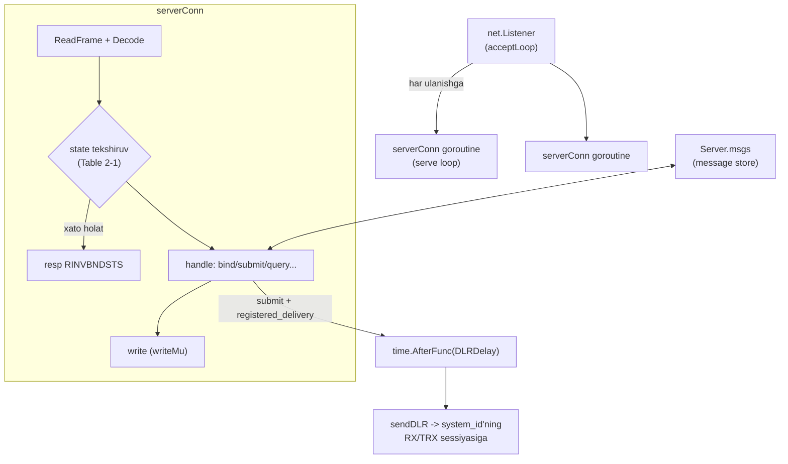

# 14-bob. Mock SMSC: stolning narigi tomoni

Protokolni chinakam bilishning eng qattiq imtihoni — uni IKKI tomonlama yozish. Shu paytgacha ESME (client) ko'zi bilan qaradik; endi SMSC rolini o'ynaymiz: bind so'rovlarini TEKSHIRUVCHI, state'ni MAJBURLOVCHI, DLR'larni YARATUVCHI tomon. Buning ikki mukofoti bor. Birinchisi — tushunish: "server nega bunday javob berdi?" degan savollar endi sizda javobsiz qolmaydi, chunki server o'zingizniki. Ikkinchisi — amaliy oltin kon: **quirk simulyatsiya rejimlari**. Kitob davomida yig'ilgan operator "g'alati"liklari (hex/dec id, TLV'siz DLR, throttling, jim server...) endi bayroq bilan YOQILADIGAN xususiyatlarga aylanadi — va client kodimizning har himoya qatlami ularga qarshi testda isbotlanadi. Tashqi simulyatorlar (SMPPSim, Melrose Labs) "ideal spec" serverni beradi; ideal server bilan test esa eng kerakli narsani — nosozlikka chidamlilikni — tekshirmaydi.

## 14.1 Server arxitekturasi

Model tanish (12-bob aksincha ko'zgusi): listener → har ulanishga goroutine → "frame o'qi → dispatch → javob yoz" sikli:



Client'dagi murakkab window/dispatcher apparati bu yerda YO'Q — server request'larga javob beradi, o'zi kam so'raydi (DLR/MO — resp kutilmaydigan yoki javobi shunchaki qabul qilinadigan oqimlar). Lekin uch qoidasi client bilan bir xil: `io.ReadFull` asosidagi framing (2-bob `ReadFrame`), **to'liq frame = bitta Write** (`writeMu` — DLR goroutine'lari bilan resp'lar interleave bo'lmasligi uchun; serverda bu client'dagidan ham dolzarb, chunki yozuvchilar ko'p: serve loop + DLR timer'lar + InjectMO), va buzuq frame'ga generic_nack (RINVCMDLEN/RINVCMDID — dispatcher xato turini ajratadi).

Server holati ikki qatlamda: per-connection (`serverConn`: state, system_id, o'z Sequencer'i — server yuboradigan deliver_sm'lar ham seq fazosiga muhtoj!) va global (`Server.msgs` — message store: query/cancel va DLR uchun; `Server.conns` — DLR routing uchun ro'yxat).

Serve sikli — butun server xulqining skeleti (`code/smsc/server.go`):

```go
func (c *serverConn) serve() {
	defer c.conn.Close()
	// session_init_timer (§7.2): bind kelgunicha deadline.
	c.conn.SetReadDeadline(time.Now().Add(c.srv.cfg.SessionInitTimeout))
	for {
		frame, err := pdu.ReadFrame(c.conn, maxPDUSize)
		if err != nil {
			var ne net.Error
			if errors.As(err, &ne) && ne.Timeout() {
				st, _ := c.status()
				c.srv.logf("smsc: %s timer otdi (state=%s) — ulanish yopildi", timerName(st), st)
			}
			return
		}
		p, h, err := pdu.Decode(frame)
		if err != nil {
			// §4.3: notanish id yoki buzuq length → generic_nack.
			status := pdu.StatusRInvCmdID
			if !errors.Is(err, pdu.ErrUnknownCommandID) {
				status = pdu.StatusRInvCmdLen
			}
			c.write(pdu.EncodeGenericNack(uint32(status), h.Sequence))
			continue
		}
		if closeAfter := c.handle(p, h); closeAfter {
			return
		}
		// Inactivity timer: har PDU'dan keyin yangilanadi.
		...
	}
}
```

`handle`ning kirishida esa state enforcement — 4-bob jadvalining server-tomonlama ijrosi:

```go
// Server-tomon state enforcement (Table 2-1): noto'g'ri holatdagi
// PDU'ga RINVBNDSTS. Bind PDU'lari bundan mustasno ko'rib chiqiladi
// (ular uchun RALYBND aniqroq kod).
switch p.(type) {
case pdu.Bind:
default:
	if !session.CanSend(h.ID, st) {
		c.write(errorResp(h, pdu.StatusRInvBndSts))
		return false
	}
}
```

E'tibor bering: 10-bob dispatcheri (`pdu.Decode`) va 4-bob state jadvali (`session.CanSend`) bu yerda YOZILMADI — ular allaqachon bor edi va server ularni shunchaki ISHLATDI. Kitob kodining qatlamliligi shu nuqtada o'zini oqlaydi: server ~400 qator chiqdi, chunki og'ir ish pastki qavatlarda yotardi.

## 14.2 Bind, auth va timer'lar — server tomondan

4-bobda o'quvchi sifatida ko'rgan qoidalar endi ijrochi qo'lida:

- **session_init_timer (§7.2 — "SMSC'da AKTIV bo'lishi KERAK")**: connect qilib bind yubormay o'tirgan ulanish resurs band qiladi (va yomon niyatda — DoS vektori). Implementatsiya go'zal darajada sodda: bind kelgunicha `conn.SetReadDeadline(now + SessionInitTimeout)` — muddat o'tsa ReadFrame timeout xatosi bilan qaytadi, ulanish yopiladi.
- **inactivity_timer**: bound sessiyada ham jimlikka chek — har PDU'dan keyin deadline yangilanadi. Client tomonda buni enquire_link "to'ydirib" turadi: intervali inactivity'dan kichik bo'lishi shartligining sababi endi ikkala tomondan ko'rinadi.
- **Auth zanjiri**: system_id ro'yxatda yo'q → `RINVSYSID`; parol xato → `RINVPASWD`; allaqachon bound holatda yana bind → `RALYBND`. Muvaffaqiyatsiz auth'dan keyin ulanish YOPILADI (status'li, body'siz bind_resp bilan — §4.1.2 Note qoidasi BindResp codec'imizda avtomatik). Bizning `TestAuth` uchala kodni tekshiradi — va client tomonda Dial xatosi ichida `ESME_RINVPASWD` nomi ko'rinadi (11-bob String() mehnati).

**State enforcement** — serverning eng muhim intizomiy vazifasi. 4-bobda yozgan `session.CanSend` (Table 2-1) endi ikkinchi ishga tushdi: har kelgan PDU joriy state'ga qarshi tekshiriladi, mos kelmasa — o'sha PDU'ning RESP turida `RINVBNDSTS` (generic_nack EMAS — 11-bob: resp'i bor PDU'ga o'z resp'i bilan javob beriladi). Bu yerda nozik test bor — `TestServerStateEnforcement` XOM frame'lar bilan yozilgan: bind_receiver → submit_sm. Nega xom? Chunki bizning session/client qatlami bu xatoni LOKAL to'sib qo'yadi (o'sha CanSend!) — "noto'g'ri" PDU'ni simga chiqarish uchun himoya qatlamlarini chetlab o'tish kerak. O'z himoyangizni test qilish uchun uni aylanib o'tishga majbur bo'lish — to'g'ri qurilgan qatlamlarning belgisi.

## 14.3 message_id fabrikasi va DLR generatori

Submit qabul qilinganda server uch ish qiladi: id juftligini yasaydi, xabarni store'ga yozadi, resp qaytaradi — va registered_delivery so'ragan bo'lsa (bit tekshiruvi — `WantsDLR()`, 5-bob) `time.AfterFunc(DLRDelay)` bilan DLR'ni rejalashtiradi.

**Id juftligi** — quirk mexanizmining yuragi:

```go
// newMessageID id juftligini yasaydi: resp'dagi va DLR matnidagi.
// Quirk yoqiq bo'lsa ular BIR SONNING IKKI YOZUVI bo'ladi.
func (s *Server) newMessageID() (respID, dlrID string) {
	n := s.idCounter.Add(1) + 0x4000000000 // "real"ga o'xshagan katta qiymat
	if s.cfg.Quirks.HexIDDecimalDLR {
		return fmt.Sprintf("%X", n), strconv.FormatUint(n, 10)
	}
	id := fmt.Sprintf("%X", n)
	return id, id
}
```

**DLR generatori** 9-bobning barcha qoidalarini serverda qayta yaratadi: manzillar ALMASHADI (source ↔ dest — §2.11), esm_class=0x04, matn — Appendix B uslubi, TLV'lar (`receipted_message_id` — resp'dagi ko'rinishda! + `message_state`) — `DLRTextOnly` quirk'ida esa TLV'lar tushirib qoldiriladi:

```go
receipt := fmt.Sprintf(
	"id:%s sub:001 dlvrd:%s submit date:%s done date:%s stat:%s err:000 text:%s",
	msg.dlrID,
	map[bool]string{true: "001", false: "000"}[state == dlr.StateDelivered],
	msg.submitAt.UTC().Format("0601021504"),
	now.Format("0601021504"),
	state.Abbrev(),
	text,
)
d := pdu.DeliverSM{SMFields: pdu.SMFields{
	Source:       msg.sm.Dest,   // ALMASHGAN (§2.11)
	Dest:         msg.sm.Source, // ALMASHGAN
	EsmClass:     0x04,          // SMSC Delivery Receipt
	ShortMessage: []byte(receipt),
}}
```

`state.Abbrev()` — 9-bobda yozgan `dlr.MessageState` bu yerda TESKARI yo'nalishda xizmatda: client uni parse qilardi, server yasayapti. Bir jadval, ikki tomonlama foyda — va agar Abbrev bilan StateFromStat bir-biriga mos kelmasa, integratsiya testlari (client server DLR'ini parse qiladi!) darhol yiqiladi: round-trip nazorati testga bepul qo'shildi. Routing qoidasi SMPPSim'nikidek: DLR **shu system_id'ning RX yoki TRX sessiyasiga** boradi — TX-only bound client DLR ololmaydi (real hayotda ham: TX+RX juftligida DLR'lar RX oqimidan keladi, 13-bob). Mos sessiya topilmasa — log bilan tashlanadi (haqiqiy SMSC saqlab keyin qayta uringan bo'lardi; mock uchun soddalik yutadi, farqi hujjatlangan).

Message store esa 10-bob operatsiyalarini jonlantiradi: `query_sm` id bo'yicha holatni qaytaradi (topilmasa RINVMSGID), `cancel_sm` ENROUTE xabarni DELETED'ga o'tkazadi — va chiroyli zanjir: DLR timer'i otganda xabar DELETED bo'lsa, DLR **stat:DELETED bilan baribir yuboriladi** (registered_delivery so'ragan edi — yakuniy taqdir DELETED bo'ldi, xabar berish shart). `TestCancelAndQueryFlow` shu zanjirni to'liq bosib o'tadi: submit → cancel → query DELETED ko'rsatadi → DLR stat:DELETED keladi. replace_sm — halol RREPLACEFAIL (mock replace'ni saqlamaydi); data_sm/submit_multi — minimal to'g'ri resp'lar.

## 14.4 Quirk katalogi: nosozlik xonasi

Olti rejim, har biri kitobdagi hujjatlangan dardga mos va har biri testda client himoyasini isbotlaydi:

| Quirk | Simulyatsiya qiladi | Client himoyasi (test) |
|---|---|---|
| `HexIDDecimalDLR` | resp'da hex, DLR matnida decimal id (Kannel #334, 9-bob) | `dlr.NormalizeID` — `TestQuirkHexIDDecimalDLR` |
| `DLRTextOnly` | "SHART" TLV'larsiz, faqat matnli DLR (9-bob) | tolerant matn parser — o'sha test |
| `ThrottleEveryN` | har N-chi submit RTHROTTLED (11-bob) | StatusError→Classify transient — `TestQuirkThrottleEveryN` |
| `SlowResp` | sekin SMSC (12-bob response timer) | `ErrResponseTimeout` — `TestQuirkSlowResp` |
| `IgnoreEnquireLink` | half-open: L4 tirik, L7 jim (12-bob) | sessiya o'zini o'ldiradi — `TestQuirkIgnoreEnquireLink` |
| `OutOfOrderResp` | javoblar juft-juft teskari (§2.5.2) | window seq-korrelyatsiya — `TestQuirkOutOfOrderResp` |

Eng ta'sirlisi — hex/dec testi, chunki u IKKI quirk'ni birlashtiradi (`HexIDDecimalDLR` + `DLRTextOnly`): TLV'lar bilan korrelyatsiya "tekinga" ishlagan bo'lardi (receipted_message_id'da resp ko'rinishi bor), TLV'siz esa faqat matndagi decimal id qoladi — va string tengligi YO'Q joyda `dlr.Table.Resolve` NormalizeID variantlari orqali topadi. Test buni ochiq tekshiradi: `r.ID != respID` (quirk haqiqatan buzgan!) LEKIN `Resolve` topdi.

Out-of-order quirk'ining implementatsiyasida kichik injenerlik bor: javoblar juft-juft almashtiriladi (1-chisi ushlab turiladi, 2-chisi kelganda ikkalasi teskari yuboriladi) — va testda MUHIM detal: ikkala Submit PARALLEL ketishi shart, chunki sync client ketma-ket yuborsa 1-javob 2-submit'gacha ushlab turilib deadlock'ka o'xshab qoladi. Bu tasodifiy noqulaylik emas — sync-over-async client aynan window>1 va parallel chaqiruvlar bilan yashashini yana bir bor eslatadi.

> **⚠ Amaliyotda — mock'ning chegarasi ham hujjat.** Mock SMSC "haqiqiy"dan uch joyda ataylab sodda: (1) DLR yo'naltirib bo'lmasa saqlanmaydi (real SMSC retry qiladi); (2) store xotirada va o'chirilmaydi (real'da TTL/persist); (3) submit matni telefon tomon "yetkazilmaydi" — hayot faqat DLR'gacha. Bu chegaralarni bilib turish testlarni to'g'ri o'qishga yordam beradi: mock bilan PROTOKOL xulqini tekshiramiz, biznes-oqim to'liqligini emas. Tashqi simulatorlarning o'rni ham shu nuqtada: Melrose Labs (onlayn, bepul, v3.4/v5.0) va SMPPSim (Java, Docker) — "boshqa birov yozgan implementatsiya bilan gaplasha olamanmi" degan interop savoliga; quirk'lar uchun esa o'z mock'imiz yagona yo'l — ideal simulator ATAYLAB buzilmaydi (15-bobda ikkalasiga yo'riqnoma bor).

## 14.5 examples/localsmsc: qo'lda o'ynash uchun

Mock endi test ichida qamalib qolgani yo'q — `code/examples/localsmsc` uni jonli serverga aylantiradi:

```
$ go run ./examples/localsmsc -hexdec -throttle 5 -dlr 2s
2026/07/19 ... mock SMSC tinglayapti: 127.0.0.1:52341 (system_id=esme1, password=secret)
2026/07/19 ... quirk'lar: hexdec=true textonly=false throttle=5 slow=0s
```

Unga o'z client'imiz bilan ham, istalgan tashqi SMPP tool bilan ham ulanish mumkin — va Wireshark'ni oraga qo'yib (15-bob) o'z traffic'ingizni "jonli" o'qish — protokolni his qilishning eng yaxshi mashqi.

## 14.6 Milestone yakuni

`smsc` package endi ikki qavat: `testserver.go` (4-bobdan beri xizmatdagi skelet — 13-bob testlari ishlatadi) va `server.go` (to'liq server: auth, state enforcement, store, DLR, MO injection, 6 quirk). Testlar — 10 ta, barchasi real TCP ustida, ko'pchiligi client package bilan to'liq stack integratsiyasi:

```
$ go vet ./... && go test ./... -race
ok      smpp/client
ok      smpp/coding
ok      smpp/dlr
ok      smpp/pdu
ok      smpp/session
ok      smpp/smsc
ok      smpp/tlv
```

## Xulosa

Server yozish protokol bilimini ikki tomonlama qildi: session_init/inactivity timer'lari read-deadline'ning bir satri bo'lib chiqdi, auth zanjiri (RINVSYSID/RINVPASWD/RALYBND) status'li body'siz bind_resp bilan gapirdi, Table 2-1 endi ikkala uchida tekshiriladi (client lokal to'sadi, server RINVBNDSTS bilan javob beradi — testlash uchun xom frame kerak bo'ldi!), DLR generatori 9-bob qoidalarini teskari yo'nalishda qayta yaratdi (almashgan manzillar, Appendix B matni, TLV'lar, RX/TRX routing) va message store query/cancel'ga jon berdi. Eng qimmatlisi — quirk rejimlari: kitobdagi har hujjatlangan operator dardi endi yoqiladigan bayroq va har bayroqqa client himoyasining regression testi to'g'ri keladi. Keyingi bob shu poydevor ustida test strategiyasini yakunlaydi: fuzzing, benchmark, golden fayllar, Wireshark va CI.

**Takrorlash savollari** (javoblar matnda bor — o'zingizni tekshiring):

1. session_init_timer'ni implement qilishning eng sodda usuli nima va u nimadan himoya qiladi?
2. Nega state-enforcement testini xom frame'lar bilan yozishga majbur bo'ldik?
3. DLR qaysi sessiyalarga yo'naltiriladi va TX-only client nima uchun DLR olmaydi?
4. Cancel qilingan xabarga DLR kelishi kerakmi? Qaysi stat bilan?
5. Hex/dec quirk testida nima uchun DLRTextOnly ham yoqilgan?
6. Out-of-order quirk testida Submit'lar nega parallel bo'lishi shart?
7. Mock bilan tashqi simulatorning vazifalari qanday bo'linadi?
8. Serverda writeMu client'dagidan nega ham muhimroq?

**Mashqlar:** [exercises/14-mock-smsc.md](../exercises/14-mock-smsc.md) — RALYBND cheklovi, BOUND_TX'ga deliver_sm va duplicate-DLR quirk'i.

---

**Oldingi bob:** [13-bob. ESME client API](13-client-api.md) · **Keyingi bob:** 15-bob. Testing va tooling (`15-testing.md`) — fuzzing, golden fayllar, benchmark, Wireshark, CI.

## Manbalar

- [SMPP v3.4 spec, Issue 1.2](../resources/SMPP_v3_4_Issue1_2.pdf) — Table 2-1 (state enforcement), §4.1.2 (auth xato resp'lari), §7.2 (session_init/inactivity SMSC'da)
- [SMPPSim](https://github.com/haifzhan/SMPPSim) — klassik Java simulator: DLR routing "same system_id RX/TRX" qoidasi, message lifecycle probability, deliver_sm injection UI
- [Melrose Labs SMSC Simulator](https://melroselabs.com/services/smsc-simulator/) — onlayn bepul simulator (v3.3/3.4/5.0, TLS, sozlanadigan DLR)
- [MikeSafonov/smpp-server-mock](https://github.com/MikeSafonov/smpp-server-mock) — test-mock server g'oyasining boshqa ekotizimdagi (JUnit) namunasi
- [StarTrinity SMPP tester](http://startrinity.com/SmppTester/SmppSmsTester.aspx) — DLR foiz/kechikish simulyatsiyasi va throttling limitlari bilan tester