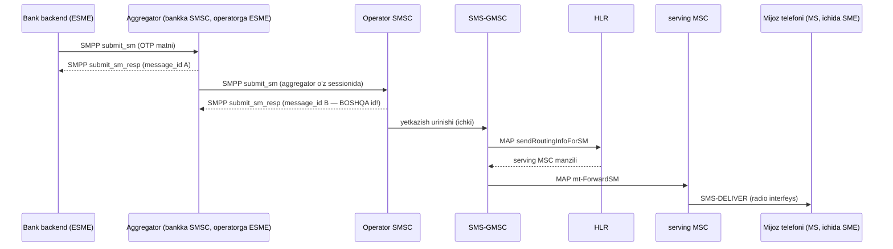

# 1-bob mashqlari: SMS ekotizimi va SMPP'ning o'rni

> Avval mashqlarni mustaqil bajaring, keyin yechimlarga qarang. Bob matni: [book/01-sms-ekotizimi.md](../book/01-sms-ekotizimi.md)

---

## Mashq 1. Banking SMS'ning to'liq yo'li

Bank ilovasi mijozga OTP kod yubormoqchi. Bank o'z gateway'ini aggregator'ga ulagan, aggregator esa mijoz operatoriga ulangan. OTP xabarning bank backend'idan mijoz telefonigacha bosib o'tadigan yo'lini **komponent-komponent** chizing (diagramma yoki ro'yxat). Har bo'g'in uchun ko'rsating:

- komponent nomi va roli (ESME? SMSC? SS7 elementi?),
- ishlatiladigan protokol (SMPP? MAP? radio?),
- shu bo'g'inda qaysi SMPP PDU (agar SMPP bo'lsa) ishlaydi.

Bonus: delivery receipt'ning qaytish yo'lini ham chizing.

## Mashq 2. SMPP nega HTTP API'dan tezroq bo'lishi mumkin?

Yuqori hajmli SMS traffic (masalan soniyasiga 500 xabar) uchun SMPP ko'pincha HTTP API'dan yuqori throughput beradi. Kamida **3 ta texnik sabab** yozing. Har sababni bir-ikki gap bilan asoslang ("tezroq chunki tezroq" emas — mexanizmni ayting).

## Mashq 3. 0x80000005 siri

Log'da shunday yozuv ko'rdingiz: `rx PDU command_id=0x80000005`.

1. Bu qaysi PDU? Qanday aniqladingiz (bit'lar bo'yicha ko'rsating)?
2. Bu PDU'ni kim kimga yuboradi?
3. U qaysi session state'larda uchrashi mumkin? (Eslatma: state'lar 4-bobda batafsil o'rganiladi — hozircha 1-bobdagi TX/RX/TRX intuitsiyasi yetarli.)
4. `code/pdu` package'idan foydalanib buni dasturiy tekshiring: qaysi ifodalar `true` qaytaradi — `CmdDeliverSMResp.IsResponse()`, `CmdDeliverSM.Resp() == CmdDeliverSMResp`, `CommandID(0x80000005).String() == "deliver_sm_resp"`?

---

# Yechimlar

## Yechim 1

OTP yo'li (yuqoriga — MT yo'nalish):



Komponentlar bo'yicha:

| Bo'g'in | Rol | Protokol | PDU |
|---|---|---|---|
| Bank backend | ESME | SMPP (TCP) | submit_sm yuboradi |
| Aggregator | bankka nisbatan SMSC, operatorga nisbatan ESME | SMPP ikki tomonda ham (ikki ALOHIDA session) | qabul: submit_sm; uzatish: submit_sm |
| Operator SMSC | SMSC (store-and-forward) | SMPP (aggregator bilan), MAP (tarmoq bilan) | submit_sm_resp qaytaradi |
| SMS-GMSC | SMSC'ning tarmoq darvozasi | MAP | — |
| HLR | abonent qaysi MSC'da ekanini biladi | MAP (sendRoutingInfoForSM) | — |
| serving MSC | abonentga radio orqali yetkazadi | MAP (mt-ForwardSM), radio | — |
| Telefon (MS) | SME (lekin ESME EMAS — tarmoq ichida) | radio | — |

DLR qaytish yo'li (pastga): telefon → MSC → SMSC (delivery report, SS7 darajasida) → aggregator'ga SMPP `deliver_sm` (esm_class'ida DLR belgisi) → aggregator uni bankka o'z `deliver_sm`'i bilan uzatadi. Muhim nuance: har session o'z `message_id` fazosiga ega — bankdagi id bilan operatordagi id BOSHQA raqamlar; har hop o'zida mapping saqlaydi (9-bobda korrelyatsiya muammosi shu yerdan chiqadi).

## Yechim 2

Kuchli javob variantlari (istalgan 3 tasi):

1. **Doimiy connection, handshake yo'q.** SMPP'da bitta uzoq yashaydigan TCP session bor; har xabar uchun yangi TCP + TLS handshake, HTTP request/response sikli yo'q. HTTP'da (ayniqsa connection reuse'siz) har xabar bir necha RTT to'laydi.
2. **Async pipelining.** SMPP'da javobni kutmasdan ketma-ket ko'plab submit_sm yuborish mumkin (outstanding window, 12-bob); korrelyatsiya sequence_number orqali. Klassik HTTP API'da bitta request javobi kelmaguncha o'sha connection band (parallellik uchun ko'p connection ochish kerak).
3. **Kichik binary overhead.** SMPP PDU header — 16 bayt; HTTP'da header'lar yuzlab bayt + JSON body + base64 kabi encoding'lar. Katta hajmda bu bandwidth va parsing farqini beradi.
4. **DLR'lar push bilan, xuddi shu session orqali.** deliver_sm real-time keladi; HTTP dunyosida buning uchun alohida webhook endpoint, retry mexanizmi va public URL kerak — bu ham latency, ham murakkablik.

(E'tibor bering: bu ustunliklar "yuqori hajmda" ma'noli. Kuniga 100 SMS uchun HTTP API'ning soddaligi SMPP'ning hamma afzalligidan ustun keladi.)

## Yechim 3

1. **deliver_sm_resp.** Bit 31 (0x80000000) o'rnatilgan → bu response PDU. Qolgan bitlar: 0x80000005 & 0x7FFFFFFF = 0x00000005 = deliver_sm (Table 5-1). Demak "deliver_sm'ning javobi".
2. deliver_sm'ni SMSC → ESME yuboradi (MO xabar yoki DLR bilan); demak **deliver_sm_resp'ni ESME → SMSC** yuboradi — har qabul qilingan deliver_sm'ga ack.
3. deliver_sm faqat receiver imkoniyatli session'larda oqadi: **BOUND_RX va BOUND_TRX** (v3.4 Table 2-1). Demak deliver_sm_resp ham aynan shu ikki state'da uchraydi. BOUND_TX'da deliver_sm bo'lmaydi — shuning uchun uning resp'i ham yo'q.
4. Uchala ifoda ham `true`:

```go
pdu.CmdDeliverSMResp.IsResponse()                       // true — bit 31 o'rnatilgan
pdu.CmdDeliverSM.Resp() == pdu.CmdDeliverSMResp         // true — 0x05 | 0x80000000
pdu.CommandID(0x80000005).String() == "deliver_sm_resp" // true — Table 5-1 nomi
```

Buni tezda tekshirish uchun `code/` ichida mini-test yozib ko'ring yoki mavjud `pdu/command_test.go`'dagi `TestRespRoundTrip`'ga qarang — aynan shu xossalar u yerda qotirilgan.
