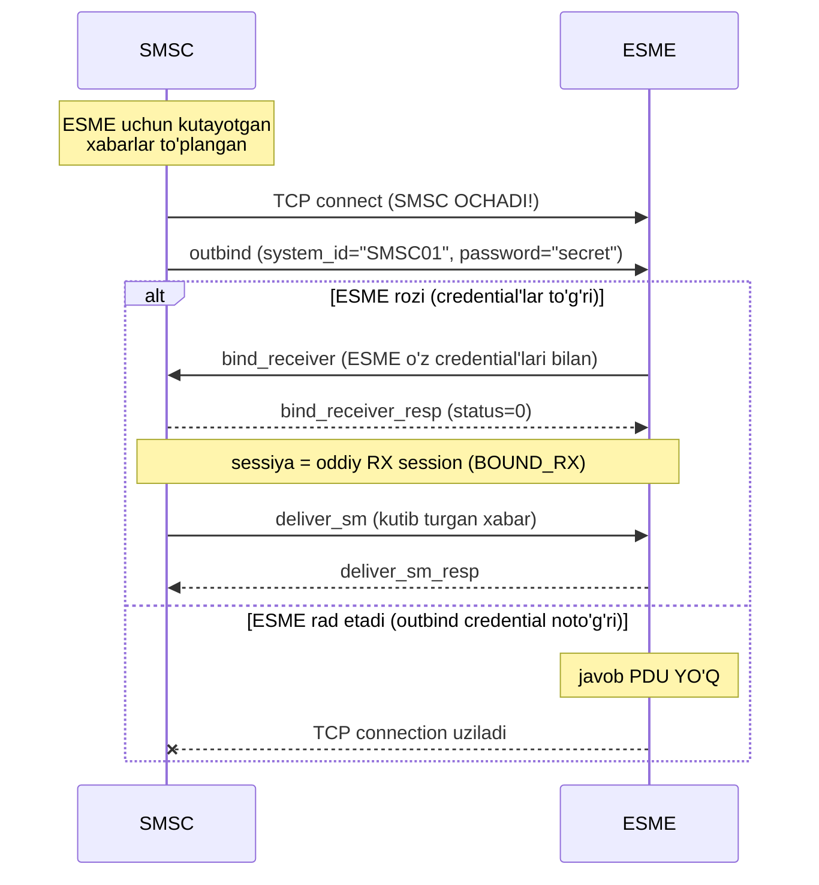

# 4-bob mashqlari: Bind va session lifecycle

> Avval mashqlarni mustaqil bajaring, keyin yechimlarga qarang. Bob matni: [book/04-bind-session.md](../book/04-bind-session.md)

---

## Mashq 1. Buzuq bind'ni tashxislash

Operator log'idan quyidagi bind_transceiver frame olindi (client shikoyat qilyapti: "bind ishlamayapti"):

```
00 00 00 21 00 00 00 09 00 00 00 00 00 00 00 01
75 7A 73 6D 73 73 33 63 72 33 74 00 00 34 00 00
00
```

Client aslida yubormoqchi bo'lgani: system_id "uzsms", password "s3cr3t", system_type bo'sh, interface_version 0x34.

1. Frame'ni qo'lda parse qiling: header, so'ng body'ni field-ma-field. Nima noto'g'ri ketgan?
2. Bizning `DecodeBind` bu frame'da qanday natija beradi — qaysi field'da, qanday xato bilan to'xtaydi? (Kod bilan tekshirib ko'ring.)
3. Server bunga qanday javob berishi to'g'ri: generic_nack'mi yoki bind_transceiver_resp'mi? Nega?
4. Client kodidagi ildiz sabab nima bo'lishi mumkin?

## Mashq 2. BOUND_RX'da submit_sm

ESME bind_receiver bilan ulandi (BOUND_RX) va xato tufayli submit_sm yuborib qo'ydi.

1. Server nima qaytarishi kerak — qaysi PDU, qaysi command_status bilan? Spec §'ini keltiring.
2. Nega bu holatda generic_nack NOTO'G'RI javob?
3. `session.CanSend` bilan bu tekshiruvni kod darajasida ko'rsating (kichik test yozing).
4. Xuddi shu savol data_sm uchun: BOUND_RX'da data_sm kelsa-chi?

## Mashq 3. Outbind sekvensi

Outbind oqimini (§2.2.1, §4.1.7) Mermaid sequenceDiagram qilib chizing. Diagrammada bo'lishi kerak: TCP connect'ni KIM ochishi; outbind PDU va uning body'sidagi ikkala field; ESME'ning ijobiy javobi va undan keyingi to'liq zanjir (deliver_sm'gacha); hamda rad etish stsenariysi (alt bloki). Savol: outbind'dagi password kimni kimga tanitadi va nega bu odatiy bind'dagidan teskari?

---

# Yechimlar

## Yechim 1

**1. Parse:** Header to'g'ri: length=0x21=33, id=bind_transceiver, status=0, seq=1. Body (17 oktet): `75 7A 73 6D 73` = "uzsms" — lekin undan keyin NULL YO'Q, to'g'ridan-to'g'ri `73 33 ...` ("s3cr3t") davom etyapti. **Ildiz muammo: system_id NULL terminatorsiz yozilgan.** C-Octet String'da terminator yo'qolsa, hamma keyingi field chegaralari siljiydi:

| Decoder nimani o'qiydi | Qiymat | Aslida nima bo'lishi kerak edi |
|---|---|---|
| system_id | "uzsmss3cr3t" (11 belgi — s3cr3t'ning NULL'igacha) | "uzsms" |
| password | "" (system_type'ning bo'sh NULL'i) | "s3cr3t" |
| system_type | "4" (0x34 '4' belgisi + addr_ton'ning 00'i!) | "" |
| interface_version | 0x00 (addr_npi'ning bayti) | 0x34 |
| addr_ton | 0x00 (address_range'ning NULL'i) | 0x00 |
| addr_npi | — stream tugadi | 0x00 |

**2.** `DecodeBind` addr_npi'gacha yetib (yuqoridagi kaskad bo'yicha), so'ng `pdu: addr_npi field'ini o'qishda stream tugadi` xatosi bilan qaytadi. Sinab ko'rish: hex'ni `mustHex` bilan baytga aylantirib `DecodeBind`'ga bering — xato matni field nomini ko'rsatadi (2-bobdagi "har helper field nomini oladi" qarori aynan shu tashxis uchun edi).

**3. bind_transceiver_resp** (xato status bilan — amalda ESME_RBINDFAIL 0x0D yoki ESME_RSYSERR 0x08; ayrim serverlar RINVSYSID qaytaradi, chunki ular system_id'ni "juda uzun" ko'radi). **generic_nack EMAS**: generic_nack faqat HEADER darajasidagi xatolar uchun (§4.3 — invalid command_length yoki notanish command_id); bu frame'ning header'i mutlaqo sog'lom, muammo body'da. §4.1.2 Note'ni ham eslang: xatoli resp'da body qaytarilmaydi — client 16 oktetlik javob oladi.

**4.** Tipik ildiz sabab: qo'lda buffer yig'ishda `WriteString(systemID)` deb yozib, NULL'ni unutish; yoki "max 16" ni "null'siz 16" deb tushunib, aynan chegaradagi string'larda terminatorni kesib qo'yadigan off-by-one. Bizning `writeCString` bunday xatoni qilib BO'LMAYDIGAN qilib qo'yadi — terminator har doim funksiya ichida yoziladi.

## Yechim 2

**1.** Server **submit_sm_resp** qaytaradi, command_status = **ESME_RINVBNDSTS (0x04, "Incorrect BIND Status for given command")**. Asos: v3.4 §2.3 Table 2-1 — submit_sm faqat BOUND_TX/BOUND_TRX'da joiz; §5.1.3 Table 5-2 — mos xato kodi. (Status ≠ 0 bo'lgani uchun resp'da message_id body'si ham bo'lmaydi.)

**2.** generic_nack faqat ikki holat uchun (§4.3): buzuq command_length yoki NOTANISH command_id. submit_sm — mutlaqo tanish, to'g'ri formatlangan PDU; muammo faqat SESSIYA HOLATIda. Tanish request'ning har qanday mantiqiy rad etilishi o'zining `*_resp`'i orqali, status bilan qaytadi. (11-bobda bu chegara batafsil.)

**3.**

```go
func TestSubmitInBoundRX(t *testing.T) {
	if session.CanSend(pdu.CmdSubmitSM, session.BoundRX) {
		t.Error("submit_sm BOUND_RX'da taqiqlangan bo'lishi kerak (Table 2-1)")
	}
	// Solishtirish uchun: to'g'ri holatlarda ruxsat bor.
	if !session.CanSend(pdu.CmdSubmitSM, session.BoundTX) ||
		!session.CanSend(pdu.CmdSubmitSM, session.BoundTRX) {
		t.Error("submit_sm BOUND_TX/TRX'da ruxsatli bo'lishi kerak")
	}
}
```

(Server tomonda bu 14-bobda shunday ishlatiladi: `if !session.CanSend(h.ID, st) { javob RINVBNDSTS }`.)

**4.** data_sm — **joiz!** Table 2-1 bo'yicha data_sm uchala bound holatda, ikkala yo'nalishda yuradigan YAGONA message PDU'si. `session.CanSend(pdu.CmdDataSM, session.BoundRX)` → `true`. Server uni normal qayta ishlaydi (data_sm_resp, status=0 — agar boshqa muammo bo'lmasa).

## Yechim 3



**Password savoli:** outbind'dagi password **SMSC'ni ESME'ga** tanitadi — ESME "menga TCP ochib 'bind qil' deyotgan bu server haqiqatan mening SMSC'immi?" deb tekshiradi. Odatiy bind'da teskari: ESME o'zini SMSC'ga tanitadi. Sabab — rollarning almashgani: bu stsenariyda CONNECTION'NI OCHGAN tomon (SMSC) o'zini isbotlashi kerak, chunki ESME nuqtai nazaridan unga noma'lum kimdir ulanib kelyapti. Va e'tibor bering: keyingi bind_receiver'da ESME baribir O'Z credential'larini yuboradi — ikki tomonlama tanishuvning ikkinchi yarmi.
