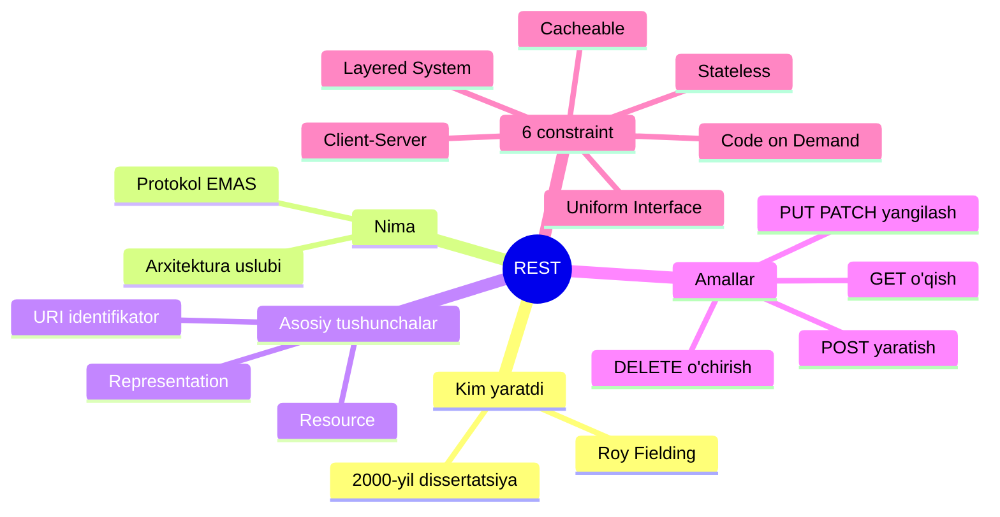
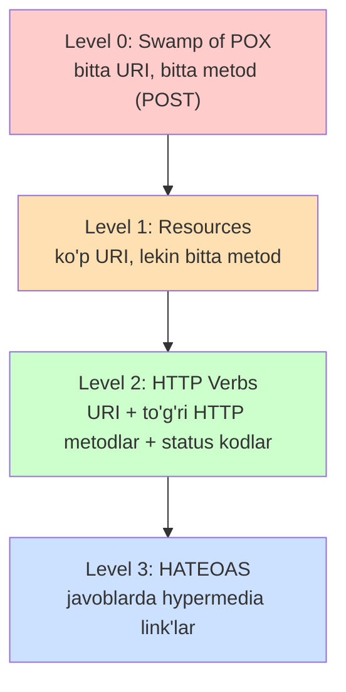

# REST nima?

## Muammo: har bir dasturchi o'z tilida gaplashsa

Tasavvur qil: mobil ilova serverdan foydalanuvchi ma'lumotini so'ramoqchi.
Bir jamoa `getUserData(5)` deb chaqiradi, boshqasi `fetch_user?uid=5`,
uchinchisi `user.load(5)`. Har kim o'z uslubini o'ylab topsa, integratsiya
qilish har safar noldan o'rganishni talab qiladi. Xarita yo'q, qoida yo'q.

**REST** aynan shu tartibsizlikni yo'qotish uchun paydo bo'ldi: u
"tarmoqdagi ilovalar bir-biri bilan qanday gaplashishi kerak" degan umumiy
qoidalar to'plamini beradi. Bir marta REST'ni o'rgangan dasturchi dunyodagi
minglab API'ni deyarli hujjatsiz tushuna oladi.

## Analogiya: restoran menyusi

REST'ni **restoran menyusi**ga o'xshat.

- Menyu (API) — nima buyurtma qilish mumkinligini ko'rsatadi.
- Sen (client) taom nomini aytasan, oshpaz (server) tayyorlaydi.
- Har bir taomning o'z nomi bor (`/users`, `/orders`) — bu **resurs**.
- Buyurtma berish usullari cheklangan: "olib kel", "yangisini pishir",
  "o'chir" (GET, POST, DELETE) — bular **HTTP metodlar**.

Farqi shundaki: restoranda ofitsiant seni eslab qoladi, REST'da esa server
**hech narsani eslamaydi** (buni pastda `stateless` deb ko'ramiz). Har safar
kim ekanligingni qaytadan aytishing kerak.

## Sodda ta'rif

> **REST** (Representational State Transfer) — tarmoq orqali ishlaydigan
> ilovalar uchun **arxitektura uslubi** (architecture style), ya'ni API
> qanday qurilishi kerakligi haqidagi qoidalar to'plami.

Uni **Roy Fielding** 2000-yilda o'z doktorlik dissertatsiyasida taqdim etgan.
REST prinsiplariga amal qilib qurilgan API **REST API** (yoki **RESTful API**)
deb ataladi.

Muhim nozik nuqta: REST — bu **protokol emas, standart ham emas**. U shunchaki
"qanday ishlash kerak" degan dizayn falsafasi. Xuddi "toza kod yozish
prinsiplari" kabi — majburlovchi qonun emas, balki kelishilgan yondashuv.

## Diagramma: REST xaritasi



Bu diagramma butun modulning skeletini ko'rsatadi. Har bir shox alohida
darsda ochib boriladi — hozircha umumiy manzarani ko'z oldingga keltir.

---

## 1-qism: Resource — REST'ning yuragi

REST'da hamma narsa **resurs** (resource) atrofida quriladi.

> **Resource** — API orqali boshqariladigan, nomlanishi mumkin bo'lgan
> har qanday ma'lumot yoki tushuncha.

Resurs juda keng tushuncha. Bu quyidagilar bo'lishi mumkin:

- Real obyekt: foydalanuvchi, mahsulot, buyurtma
- Hujjat yoki rasm
- Vaqtinchalik xizmat: "Toshkentdagi bugungi ob-havo"
- Boshqa resurslar to'plami (collection)

**Nozik g'oya:** resurs — bu aniq bir yozuv (entity) emas, balki tushunchaga
**conceptual mapping** (kontseptual bog'lanish). Masalan:

- `/reports/latest` — "eng so'nggi hisobot" har doim yangilanib turadi
- `/reports/2024-05-15` — "15-may hisoboti" abadiy o'zgarmaydi

Ikkalasi ham alohida resurs, garchi bugun bir xil ma'lumotni ko'rsatsa ham.

### Resource turlari

| Turi | Ta'rifi | URI namunasi |
| --- | --- | --- |
| **Singleton** | Yagona obyekt | `/users/123` |
| **Collection** | Obyektlar to'plami | `/users` |
| **Sub-collection** | Ichma-ich to'plam | `/users/123/orders` |

### Representation — resurs "surati"

Resursning o'zi mavhum tushuncha. Client bilan server esa uning
**representation**'i (ko'rinishi) orqali ish qiladi — masalan JSON yoki XML.

Bir resursning bir nechta representation'i bo'lishi mumkin: bir xil
foydalanuvchi JSON, XML yoki hatto PDF ko'rinishida qaytishi mumkin.

```json
{
  "id": 123,
  "title": "REST nima",
  "author": {
    "id": 456,
    "name": "John Doe",
    "profile_url": "https://api.example.com/authors/456"
  },
  "comments": {
    "count": 5,
    "comments_url": "https://api.example.com/posts/123/comments"
  },
  "self": "https://api.example.com/posts/123"
}
```

E'tibor ber: bu JSON'da nafaqat ma'lumot, balki boshqa resurslarga
**link'lar** (`profile_url`, `comments_url`, `self`) ham bor. Bu — REST'ning
eng yuqori darajasi bo'lgan **HATEOAS** g'oyasi (pastda ko'ramiz).

---

## 2-qism: HTTP metodlar — resurs ustidagi amallar

Resursga murojaat qilish uchun standart HTTP metodlar ishlatiladi. Ular
CRUD (Create, Read, Update, Delete) amallariga mos keladi.

| Metod | CRUD | Ma'nosi | Idempotent? |
| --- | --- | --- | --- |
| **GET** | Read | Ma'lumot o'qish | Ha |
| **POST** | Create | Yangi resurs yaratish | Yo'q |
| **PUT** | Update | To'liq almashtirish | Ha |
| **PATCH** | Update | Qisman yangilash | Yo'q |
| **DELETE** | Delete | O'chirish | Ha |

**Idempotent** degani: bir xil so'rovni 10 marta yuborsang ham natija
bir xil bo'ladi. `DELETE /users/5` ni ikki marta chaqirsang, foydalanuvchi
baribir o'chgan holatda qoladi. `POST` esa har safar yangi obyekt yaratadi —
shuning uchun idempotent emas.

### URI dizayni namunasi

```
GET    /users        -> barcha foydalanuvchilar ro'yxati
GET    /users/10     -> ID=10 foydalanuvchi
POST   /users        -> yangi foydalanuvchi yaratish
PUT    /users/10     -> foydalanuvchini to'liq yangilash
PATCH  /users/10     -> foydalanuvchini qisman yangilash
DELETE /users/10     -> foydalanuvchini o'chirish
```

E'tibor ber: bitta URI (`/users/10`) — bir nechta amal. **Fe'l URI'da emas,
HTTP metodda.** URI faqat resursni ko'rsatadi, amalni metod belgilaydi.
Bu naming qoidasini keyingi darsda chuqur ko'ramiz.

---

## 3-qism: Richardson Maturity Model — REST'ning 4 darajasi

Amalda hamma API bir xil darajada "RESTful" emas. **Leonard Richardson**
yuzlab API'ni tahlil qilib, ularni 4 darajaga ajratdi. Bu model API'ning
"yetuklik" (maturity) darajasini o'lchaydi.



| Level | Nomi | Tavsif |
| --- | --- | --- |
| **0** | Swamp of POX | Bitta endpoint, hamma narsa POST orqali (RPC uslubi) |
| **1** | Resources | Har resurs uchun alohida URI, lekin metodlar noto'g'ri |
| **2** | HTTP Verbs | To'g'ri metodlar (GET/POST/...) va status kodlar |
| **3** | HATEOAS | Javoblarda keyingi amallar uchun link'lar |

**Zamonaviy amaliyot (2025):** ko'pchilik ishlab chiqarishdagi (production)
API'lar **Level 2**'da to'xtaydi — bu prinsiplar va amaliylik o'rtasidagi
eng yaxshi muvozanat. **Level 3 (HATEOAS)** nazariy jihatdan "sof REST",
lekin real hayotda kamdan-kam uchraydi: u faqat juda katta, uzoq yashaydigan
va ko'p xil clientga xizmat qiluvchi tizimlarda (masalan ochiq SaaS
platformalar) o'zini oqlaydi.

Xulosa: Level 3 — ideal, lekin Level 2 — pragmatik standart.

---

## Worked example: real REST API bilan ishlash

Keling, `curl` yordamida haqiqiy REST API bilan gaplashamiz.

```bash
# --- 1-qadam: barcha foydalanuvchilarni o'qish (GET) ---
curl https://jsonplaceholder.typicode.com/users
```

```bash
# --- 2-qadam: bitta foydalanuvchini o'qish ---
curl https://jsonplaceholder.typicode.com/users/1
```

Natija (qisqartirilgan):

```json
{
  "id": 1,
  "name": "Leanne Graham",
  "email": "Sincere@april.biz"
}
```

```bash
# --- 3-qadam: yangi post yaratish (POST) ---
curl -X POST https://jsonplaceholder.typicode.com/posts \
  -H "Content-Type: application/json" \
  -d '{"title": "REST darsi", "body": "matn", "userId": 1}'
```

Natija: server `201 Created` status va yangi yaratilgan obyektni qaytaradi:

```json
{
  "title": "REST darsi",
  "body": "matn",
  "userId": 1,
  "id": 101
}
```

E'tibor ber: har bir so'rovda `-H "Content-Type: application/json"` orqali
biz ma'lumot formatini bildiryapmiz. Bu — **self-descriptive** xabar prinsipi.

### 🤔 O'ylab ko'r

`GET /users/1` so'rovini 100 marta yuborsak, serverda nechta o'zgarish bo'ladi?
Endi `POST /posts` ni 100 marta yuborsak-chi?

<details>
<summary>💡 Javobni ko'rish</summary>

`GET` — **idempotent va xavfsiz (safe)**: 100 marta o'qisang ham serverda
hech narsa o'zgarmaydi, faqat ma'lumot qaytadi.

`POST` — idempotent emas: har chaqiruv **yangi post yaratadi**, natijada
100 ta yangi obyekt paydo bo'ladi. Shuning uchun to'lov yoki buyurtma kabi
POST so'rovlarida takrorlanishdan himoya (idempotency key) kerak bo'ladi.

</details>

---

## Muhim: REST ≠ HTTP

Eng ko'p uchraydigan noto'g'ri tushuncha: "REST bu HTTP bilan ishlash".

Aslida Roy Fielding dissertatsiyasida **hech qanday protokolni**, hatto
HTTP'ni ham majburiy qilmagan. Agar 6 ta asosiy prinsipga amal qilsang,
interfeys qaysi protokol ustida qurilganidan qat'i nazar RESTful bo'ladi.

Amalda esa HTTP eng qulay tanlov bo'lgani uchun REST deyarli har doim HTTP
ustida quriladi — lekin bu majburiyat emas, tarixiy tanlov.

---

## ⚠️ Ko'p uchraydigan xatolar

**1-xato: URI'da fe'l ishlatish.**
Noto'g'ri: `GET /getUsers`, `POST /createUser`.
Nega noto'g'ri: HTTP metod allaqachon fe'lni bildiradi, URI'da takrorlash
ortiqcha va RPC uslubiga aylanib qoladi.
To'g'risi: `GET /users`, `POST /users`.

**2-xato: REST va RPC'ni chalkashtirish.**
Bitta `/api` endpoint'iga hamma so'rovni POST bilan yuborish — bu Level 0,
RPC. REST'da har resurs o'z URI'siga ega bo'ladi.

**3-xato: "resurs" so'zini faqat DB jadvali deb tushunish.**
Resurs — bu kengroq tushuncha. "Ob-havo", "hisobot", "izlash natijasi" ham
resurs bo'lishi mumkin, garchi ular alohida jadval bo'lmasa ham.

---

## Xulosa

- **REST** — protokol emas, tarmoqdagi ilovalar uchun **arxitektura uslubi**.
- Uni Roy Fielding 2000-yilda kiritgan; asosi — **resource** tushunchasi.
- Har resurs **URI** bilan aniqlanadi va **representation** (JSON/XML) orqali
  namoyon bo'ladi.
- Amallar standart **HTTP metodlar** (GET/POST/PUT/PATCH/DELETE) bilan qilinadi.
- **Richardson Maturity Model** REST yetukligini 4 darajaga ajratadi; amalda
  ko'pchilik **Level 2**'da to'xtaydi.
- **HATEOAS** (Level 3) — javoblarda link'lar bilan; ideal, lekin kam ishlatiladi.
- REST HTTP'ga bog'liq emas, lekin amalda deyarli har doim HTTP ustida quriladi.

## 🧠 Eslab qol

- REST — qoidalar to'plami, protokol emas.
- Resurs URI'da, amal HTTP metodda.
- Server hech narsani eslamaydi (stateless).
- Ko'pchilik API Level 2, HATEOAS kam uchraydi.

## ✅ O'z-o'zini tekshir (retrieval practice)

**1. Nega URI'ga `/getUsers` deb yozish REST prinsipiga zid?**

<details>
<summary>Javob</summary>

Chunki HTTP metod (`GET`) allaqachon "olish" amalini bildiradi. URI faqat
resursni (`/users`) ko'rsatishi kerak, fe'lni emas. `GET /getUsers` — RPC
uslubi, REST emas.

</details>

**2. `PUT` va `POST` orasidagi asosiy farq nima?**

<details>
<summary>Javob</summary>

`POST` yangi resurs yaratadi va **idempotent emas** (har chaqiruv yangi obyekt).
`PUT` mavjud resursni to'liq almashtiradi va **idempotent** (100 marta yuborsang
ham natija bir xil).

</details>

**3. Agar API bitta `/api` endpoint'iga hamma so'rovni POST bilan yuborsa, u
Richardson modelida qaysi darajada?**

<details>
<summary>Javob</summary>

**Level 0 (Swamp of POX).** Bu aslida REST emas, RPC uslubi — bitta URI,
bitta metod.

</details>

**4. HATEOAS bo'lgan javobni oddiy JSON javobdan qanday farqlaysan?**

<details>
<summary>Javob</summary>

HATEOAS javobida ma'lumotdan tashqari **keyingi amallar uchun link'lar**
bo'ladi (`self`, `next`, `comments_url` kabi). Client bu link'lar orqali
API bo'ylab harakatlanadi va barcha endpoint'larni oldindan bilishi shart emas.

</details>

## 🛠 Amaliyot

**1. Oson (Modify).** Yuqoridagi `curl` misolini o'zgartirib,
`jsonplaceholder.typicode.com/posts/1` postini `GET` bilan o'qib ol, keyin
`DELETE` bilan o'chirishga urin. Qaysi status kod qaytdi?

**2. O'rta (faded example).** Quyidagi blog API uchun URI jadvalini to'ldir:

```
# TODO: barcha postlarni olish        -> _______________
# TODO: 42-postni olish               -> _______________
# TODO: yangi post yaratish           -> _______________
# TODO: 42-post izohlarini olish      -> _______________
```

<details>
<summary>Hint</summary>

Ko'plik ot, ierarxiya uchun `/`, fe'l yo'q. Masalan: `GET /posts`,
`GET /posts/42`, `POST /posts`, `GET /posts/42/comments`.

</details>

**3. Qiyin (Make).** Kutubxona (library) tizimi uchun REST API dizayn qil:
kitoblar, mualliflar, o'quvchilar va ijaralar (loans). Har bir resurs uchun
CRUD endpoint'larni yoz va qaysi biri Level 2, qaysi biri Level 3 (HATEOAS
link'lar bilan) bo'lishini ko'rsat.

<details>
<summary>Hint</summary>

`/books`, `/authors`, `/readers`, `/loans`. Ijara — bu `/loans` collection'i
(kim, qaysi kitob, qachon). Level 3 uchun har kitob javobiga
`"loan_url": "/books/5/loan"` kabi link qo'sh.

</details>

## 🔁 Takrorlash

- Bu dars keyingi darslar uchun poydevor. Navbatdagi mavzular:
  [REST constraints](02-rest-constraints.md) va
  [Resource naming](03-rest-resource-naming.md).
- Takrorlash jadvali: **ertaga** "O'z-o'zini tekshir" 1-2 savoliga qayt →
  **3 kundan keyin** Richardson darajalarini xotiradan chiz →
  **1 haftadan keyin** kutubxona API'sini qaytadan dizayn qil.
- **Feynman testi:** REST'ni kod ishlatmasdan, restoran menyusi analogiyasi
  orqali bir do'stingga 3 jumlada tushuntirib ber. "Resurs", "URI" va
  "server eslamaydi" so'zlarini ishlatsang, tushunibsan.

## 📚 Manbalar

- Roy Fielding, "Architectural Styles and the Design of Network-based
  Software Architectures" (2000)
- Richardson Maturity Model — https://restfulapi.net/richardson-maturity-model/
- Richardson Maturity Model and HATEOAS —
  https://medium.com/@liberatoreanita/richardson-maturity-model-and-hateoas-understanding-the-evolution-of-restful-apis-53702173a138
- REST API Tutorial — https://restfulapi.net/
