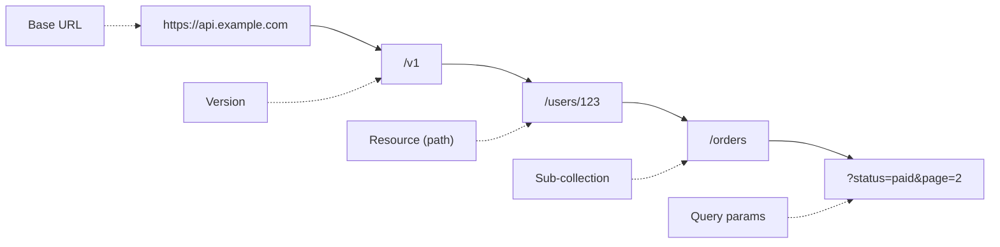
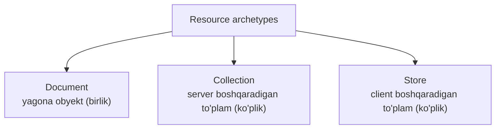

# REST Resource Naming — URI dizayni

## Muammo: chalkash URL'lar API'ni o'ldiradi

Quyidagi API'ni ko'r va o'zingdan so'ra — bu yerda nechta amal bor?

```
GET  /getUsers
POST /user/create
GET  /Users/123
PUT  /user-profile/update/123
GET  /products.json
DELETE /DeleteProduct/456
```

Har endpoint o'z uslubida yozilgan: fe'l bor, katta harf bor, kengaytma bor,
ba'zi birlik ba'zi ko'plik. Bunday API'ni har safar hujjatga qarab
o'rganishga to'g'ri keladi. Dasturchi bitta pattern'ni yodlab, qolgan hammasini
taxmin qila olmaydi.

**Yaxshi URI dizayni** aynan shu muammoni yechadi: izchil qoidalar bilan API
**o'z-o'zini tushuntiradigan** bo'ladi. Bir endpoint'ni ko'rgan dasturchi
qolganlarini taxmin qiladi.

## Analogiya: kutubxona javon raqamlari

URI'ni **kutubxona javon manzili**ga o'xshat.

- Har kitob aniq manzilga ega: `Fan / Fizika / Kvant / Kitob-42`.
- Manzil **ierarxik**: umumiydan xususiyga qarab toraydi.
- Manzil kitob nima **ekanini** ko'rsatadi, u bilan **nima qilishni** emas.

REST URI ham xuddi shunday: `/users/123/orders/5` — ierarxik manzil.
"Kitobni o'qi" yoki "kitobni chiqar" degan fe'l manzilda emas — bu HTTP
metodning ishi.

> **Oltin qoida:** URI resursni **identifikatsiya qiladi** (ot), amalni
> **HTTP metod** belgilaydi (fe'l). Ikkalasini aralashtirsang, RPC'ga
> aylanib qolasan.

## Diagramma: URI anatomiyasi



To'liq URI: `https://api.example.com/v1/users/123/orders?status=paid&page=2`.
Har bir bo'lakning o'z vazifasi bor — pastda hammasini ko'ramiz.

---

## 1-qism: 3 ta resource archetype

Har bir resurs 3 ta asosiy turdan biriga kiradi. Bu turlarni tushunsang,
naming o'z-o'zidan to'g'ri chiqadi.



**Document** — collection ichidagi bitta element. O'z maydonlari va boshqa
resurslarga link'lari bor:

```
/users/admin
/devices/D-12345
/articles/rest-best-practices
```

**Collection** — server tomonidan boshqariladigan to'plam. Yangi element
qabul qiladi, lekin uni qabul qilish yoki qilmaslikni **collection o'zi** hal
qiladi (masalan ID'ni server beradi):

```
/users
/devices
/users/123/orders          # sub-collection
```

**Store** — client tomonidan boshqariladigan repozitoriy. Bu yerda
**client o'zi** resurs qo'yadi va o'chiradi; URI'ni ham client belgilaydi
(server yangi ID o'ylab topmaydi):

```
/users/123/playlists
/users/123/favorites
/users/123/bookmarks
```

Farqni his qil: `POST /users`da server yangi ID (`124`) yaratadi (Collection).
`PUT /users/123/playlists/my-rock`da esa ID'ni (`my-rock`) client belgiladi (Store).

---

## 2-qism: 10 oltin qoida

### 1. Ot ishlat, fe'l emas

HTTP metod allaqachon fe'l. URI'da fe'l takrorlash — RPC uslubi.

```
Noto'g'ri:  GET /getUsers      POST /createUser
To'g'ri:    GET /users         POST /users
```

Login/logout ham shu qoidaga bo'ysunadi. "Login" — bu aslida yangi **session**
yaratish:

```
POST   /sessions    # login (yangi session yaratish)
DELETE /sessions    # logout (session'ni o'chirish)
```

### 2. Collection uchun ko'plik ishlat

```
Noto'g'ri:  /product        /product/123     # birlikmi yoki hammami?
To'g'ri:    /products       /products/123    # to'plam va uning elementi
```

Istisno — **singleton** resurslar (bitta nusxada bo'lganlari):

```
/profile     # joriy foydalanuvchi profili (yagona)
/cart        # joriy savatcha (yagona)
```

### 3. Hyphen (-) bilan so'zlarni ajrat

```
Noto'g'ri:  /userprofiles   /userProfiles   /user_profiles
To'g'ri:    /user-profiles  /device-management  /order-history
```

Hyphen o'qishni osonlashtiradi va qidiruv tizimlari uni so'z ajratuvchi deb
tushunadi. **Underscore (_)** ishlatma — ba'zi shriftlarda link ostiga chizilganda
u ko'rinmay qoladi.

### 4. Kichik harf (lowercase) ishlat

```
Noto'g'ri:  /Users    /Products/123    /Order-History
To'g'ri:    /users    /products/123    /order-history
```

**Muhim:** URI path **case-sensitive**! `/Users` va `/users` — ikki xil
endpoint. Domain (`API.EXAMPLE.COM`) case-insensitive, lekin path emas.

### 5. Forward slash (/) ierarxiyani bildiradi

Har `/` "...ning ichidagi" degan ma'noni beradi:

```
/users                       # userlar
/users/123                   # konkret user
/users/123/orders            # user'ning buyurtmalari
/users/123/orders/456        # konkret buyurtma
/users/123/orders/456/items  # buyurtma ichidagi tovarlar
```

### 6. Oxirgi slashni qo'yma

```
Noto'g'ri:  /users/     /products/123/
To'g'ri:    /users      /products/123
```

Oxirgi slash semantik ma'no bermaydi va ba'zi serverlar `/users` va `/users/`
ni turli URL deb hisoblab, keraksiz redirect (301) qiladi.

### 7. Fayl kengaytmasini qo'yma

```
Noto'g'ri:  /users.json    /products/123.xml
To'g'ri:    /users         /products/123
```

Format URI'da emas, **header**da bildiriladi. Buni **content negotiation**
deb ataymiz:

```
GET /products/123
Accept: application/json        # client shu formatni so'raydi

HTTP/1.1 200 OK
Content-Type: application/json  # server shu formatni qaytaradi
```

Bir xil URI — turli formatlar. `Accept: application/xml` yuborsang, XML keladi.

### 8. CRUD amallarini URI'ga qo'shma

```
Noto'g'ri:  POST /users/create    GET /users/get/123    DELETE /users/delete/123
To'g'ri:    POST /users           GET /users/123        DELETE /users/123
```

| HTTP metod | CRUD | Misol |
| --- | --- | --- |
| POST | Create | `POST /users` |
| GET | Read | `GET /users/123` |
| PUT | Update (to'liq) | `PUT /users/123` |
| PATCH | Update (qisman) | `PATCH /users/123` |
| DELETE | Delete | `DELETE /users/123` |

### 9. Filtrlash/saralash/pagination uchun query parameter ishlat

Yangi endpoint yaratma — query parametrlaridan foydalan:

```
GET /products                                    # hammasi
GET /products?category=electronics               # filtrlash
GET /products?category=electronics&price_max=500 # bir nechta filtr
GET /products?sort=price&order=asc               # saralash
GET /products?page=2&limit=20                    # pagination
```

Real API'lar aynan shunday qiladi:

```
# GitHub
GET /repos/facebook/react/issues?state=open&labels=bug&page=1
```

### 10. Izchillik (consistency) — eng muhimi

Bir xil pattern'ni hamma joyda qo'lla. Izchil API — o'rganish oson, xato kam,
developer experience yaxshi.

```
GET    /users        GET    /products      GET    /orders
POST   /users        POST   /products      GET    /orders/789
GET    /users/123    GET    /products/456  POST   /users/123/orders
DELETE /users/123    DELETE /products/456
```

---

## 3-qism: Anti-pattern — fe'llardan qochish

Eng ko'p uchraydigan muammo: murakkab amalni URI'ga fe'l qilib tiqish.

```
Noto'g'ri (RPC-style):
POST /scripts/456/execute
POST /users/123/activate
POST /orders/789/cancel
```

Bu RPC, REST emas. Uch xil to'g'ri yechim bor.

**Yechim 1: holatni PATCH bilan o'zgartirish.**

```
PATCH /orders/789
Body: { "status": "cancelled" }
```

**Yechim 2: action'ni yangi resurs qilish.** "Bekor qilish" — bu aslida
"bekor qilish yozuvi" degan resurs:

```
POST /order-cancellations
Body: { "order_id": 789, "reason": "..." }
```

Bu yangi obyekt yaratadi, keyin uning statusini kuzatish mumkin:

```
GET /script-executions/789
{
  "id": 789,
  "script_id": 456,
  "status": "running",
  "started_at": "2025-10-24T10:30:00Z"
}
```

**Yechim 3: Google'ning custom method pattern'i** (munozarali). Google Cloud
API'lari `:` bilan maxsus amal qo'shadi:

```
POST /devices/123:restart
POST /files/456:duplicate
```

Ba'zilar buni REST prinsiplariga zid deydi, lekin Google keng qo'llaydi.
Amalda: agar amal aniq CRUD'ga tushmasa, avval PATCH yoki yangi resurs'ni
sina, custom method — oxirgi chora.

---

## 4-qism: Zamonaviy best practice qo'shimchalari (2025)

Manba qoidalariga bugungi kunning muhim standartlarini qo'shamiz.

### Versiyalash (versioning) — birinchi kundan

API'ni birinchi kundanoq versiyala. Eng ko'p ishlatiladigan usul — **URI path
versioning**:

```
/api/v1/users
/api/v2/users
```

Bu clientlarni sindirmasdan API'ni rivojlantirishga imkon beradi: eski
clientlar `v1`'da qoladi, yangilari `v2`'ga o'tadi.

### Pagination — offset emas, cursor

Manbada `?page=2&limit=20` (offset pagination) ko'rsatilgan. Bu kichik ma'lumot
uchun yaxshi, lekin katta jadvalda **sekinlashadi**: `OFFSET 100000` ma'lumotlar
bazasini har so'rovda 100 000 qatorni skanerlab, tashlab yuborishga majbur qiladi.

Katta hajm uchun **cursor pagination** ishlatiladi — barqaror identifikator
(masalan oxirgi ko'rilgan ID) bo'yicha:

```
GET /products?limit=20&after=cursor_abc123
```

Kelishuv: cursor'da "istalgan sahifaga sakrash" yo'qoladi, lekin scale barqaror.

### Xatolarni standartlash — RFC 9457 (Problem Details)

Har jamoa o'z xato formatini o'ylab topmasin. **RFC 9457** (2023-yil, RFC 7807
o'rniga) mashinaga tushunarli xato formatini standartlashtiradi. Media type:
`application/problem+json`:

```json
{
  "type": "https://api.example.com/errors/insufficient-funds",
  "title": "Yetarli mablag' yo'q",
  "status": 403,
  "detail": "Hisobingizda 30.5 so'm bor, lekin 50 so'm kerak",
  "instance": "/accounts/12345/transactions/67890"
}
```

5 ta asosiy maydon: `type`, `title`, `status`, `detail`, `instance`.
Qo'shimcha (extension) maydonlar ham qo'shsa bo'ladi — masalan validatsiya
xatolari uchun `errors` massivi.

### Idempotency key — takroriy yozuvdan himoya

`POST` idempotent emas (esingdami, 1-dars). Agar to'lov so'rovi tarmoq xatosi
tufayli takrorlansa, ikki marta pul yechilishi mumkin. Buni oldini olish uchun
client noyob **`Idempotency-Key`** header yuboradi:

```
POST /payments
Idempotency-Key: 8e03978e-40d5-43e8-bc93-6894a57f9324
Body: { "amount": 50, "currency": "UZS" }
```

Server bu kalitni eslab qoladi va bir xil kalit bilan kelgan takroriy so'rovda
amalni **qayta bajarmaydi**, avvalgi natijani qaytaradi.

---

## Worked example: e-commerce API dizayni

To'liq real loyiha misoli. E'tibor ber — hamma joyda bir xil pattern:

```
# Foydalanuvchilar (Collection)
GET    /users                          # ro'yxat
POST   /users                          # ro'yxatdan o'tish
GET    /users/123                      # profil
PATCH  /users/123                      # qisman yangilash
DELETE /users/123                      # o'chirish

# Mahsulotlar
GET    /products?category=electronics  # filtrlangan katalog
GET    /products/456                   # konkret mahsulot

# Buyurtmalar (user'ning sub-collection'i)
GET    /users/123/orders               # user buyurtmalari
POST   /users/123/orders               # yangi buyurtma
PATCH  /users/123/orders/789           # status yangilash

# Savatcha (Store archetype - client boshqaradi)
GET    /users/123/cart                 # savatcha
POST   /users/123/cart/items           # tovar qo'shish
DELETE /users/123/cart/items/456       # tovar olib tashlash

# Izohlar (mahsulotning sub-collection'i)
GET    /products/456/reviews           # izohlar
POST   /products/456/reviews           # izoh qoldirish
```

### 🤔 O'ylab ko'r

Foydalanuvchini "faollashtirish" (activate) uchun endpoint kerak. Quyidagi
uch variantdan qaysi biri eng RESTful va nega?

```
A) POST /users/123/activate
B) PATCH /users/123   Body: { "status": "active" }
C) POST /activateUser/123
```

<details>
<summary>💡 Javobni ko'rish</summary>

**B eng RESTful.** "Faollashtirish" aslida foydalanuvchi **holatini**
(`status`) o'zgartirish — bu PATCH uchun ideal.

A — fe'l (`activate`) URI'da, RPC uslubiga yaqin, lekin ba'zan qabul qilinadi.
C — eng yomon: fe'l ham bor, birlik ham, camelCase ham. To'liq anti-pattern.

Agar faollashtirish murakkab jarayon bo'lsa (email tasdiqlash va h.k.),
uni yangi resurs qilsa ham bo'ladi: `POST /user-activations`.

</details>

---

## ⚠️ Ko'p uchraydigan xatolar

**1-xato: singular/plural aralashtirish.** `/user` va `/users` bir API'da
birga ishlatilsa, dasturchi qaysi biri qaerda ekanini yodlashi kerak. Doim
ko'plik ishlat (singleton'dan tashqari).

**2-xato: chuqur ierarxiya.** `/users/1/orders/2/items/3/reviews/4/likes/5` —
juda chuqur. 2-3 darajadan oshirma. Chuqurroq bo'lsa, resursni to'g'ridan-to'g'ri
`/likes/5` qilib ol.

**3-xato: pagination'siz collection.** Katta `GET /users` millionlab qator
qaytarishi mumkin. Har collection'ni **doim** pagination bilan chekla.

**4-xato: xato holatda 200 qaytarish.** Xato bo'lsa `200 OK` + `{"error": ...}`
qaytarma. To'g'ri status kod ishlat (`400`, `404`, `403`) va RFC 9457 formatida.

---

## Xulosa

- URI resursni **identifikatsiya qiladi** (ot), amalni HTTP metod belgilaydi.
- 3 archetype: **Document** (birlik), **Collection** (server boshqaradi),
  **Store** (client boshqaradi) — hammasi ko'plik.
- 10 oltin qoida: ot, ko'plik, hyphen, lowercase, ierarxiya, oxirgi slashsiz,
  kengaytmasiz, CRUD'siz, query param, izchillik.
- Murakkab amalni fe'l qilma — PATCH, yangi resurs yoki custom method ishlat.
- Zamonaviy qo'shimchalar: versioning (`/v1`), cursor pagination, RFC 9457
  xato formati, `Idempotency-Key`.

## 🧠 Eslab qol

- URI = ot, metod = fe'l.
- Collection ko'plik, singleton birlik.
- Filtr/saralash/sahifa = query param, yangi endpoint emas.
- Xatoda to'g'ri status kod, 200 emas.

## ✅ O'z-o'zini tekshir (retrieval practice)

**1. Nega `/products?category=electronics` `/products/electronics`dan yaxshiroq?**

<details>
<summary>Javob</summary>

`/products/electronics` "electronics" degan mahsulotni anglatadi (Document),
kategoriyani emas. Filtrlash — bu query param ishi. Aks holda har kategoriya
uchun alohida endpoint kerak bo'lib, izchillik buziladi.

</details>

**2. Collection va Store archetype orasidagi farq nima?**

<details>
<summary>Javob</summary>

**Collection**'da yangi resurs URI/ID'ni **server** beradi (`POST /users` ->
server `124` yaratadi). **Store**'da URI/ID'ni **client** belgilaydi
(`PUT /users/1/playlists/rock` — `rock`ni client tanladi).

</details>

**3. Nega URI path'da katta harf xavfli?**

<details>
<summary>Javob</summary>

URI path **case-sensitive**. `/Users` va `/users` — ikki xil endpoint. Katta
harf ishlatsang, client tomonda kichik/katta harf chalkashib `404` xatosi
chiqishi mumkin. Doim lowercase ishlat.

</details>

**4. `POST` idempotent emasligini `Idempotency-Key` qanday yechadi?**

<details>
<summary>Javob</summary>

Client noyob kalit yuboradi; server uni eslab qoladi. Bir xil kalit bilan
kelgan takroriy so'rovda server amalni **qayta bajarmaydi**, avvalgi natijani
qaytaradi. Shunday qilib takroriy to'lov/buyurtma oldi olinadi.

</details>

## 🛠 Amaliyot

**1. Oson (Modify).** Quyidagi noto'g'ri endpoint'larni tuzat:

```
GET /getAllProducts
POST /product/new
DELETE /products/remove/55
```

<details>
<summary>Hint</summary>

`GET /products`, `POST /products`, `DELETE /products/55`.

</details>

**2. O'rta (faded example).** Ijtimoiy tarmoq API'sini to'ldir:

```
# TODO: 5-foydalanuvchi postlari       -> _________________
# TODO: yangi post yaratish            -> _________________
# TODO: 9-postga like bosish           -> _________________ (fe'lsiz o'yla!)
# TODO: postlarni saralab olish        -> _________________
```

<details>
<summary>Hint</summary>

`GET /users/5/posts`, `POST /users/5/posts`, `POST /posts/9/likes`
(like — yangi resurs), `GET /posts?sort=-created_at`.

</details>

**3. Qiyin (Make).** Aviabilet bron qilish API'sini to'liq dizayn qil: reyslar
(flights), yo'lovchilar (passengers), bronlar (bookings), to'lovlar (payments).
Har biriga versioning, pagination va RFC 9457 xato javobini qo'sh.

<details>
<summary>Hint</summary>

`/v1/flights?from=TAS&to=IST&date=2025-08-01`, `/v1/bookings`,
`POST /v1/payments` + `Idempotency-Key`. Xatoda `application/problem+json`.

</details>

## 🔁 Takrorlash

- Oldingi darslar: [REST nima](01-rest-nima.md),
  [REST constraints](02-rest-constraints.md). Keyingi:
  [API autentifikatsiya](04-api-autentifikatsiya.md).
- Takrorlash jadvali: **ertaga** 10 oltin qoidani xotiradan yoz →
  **3 kundan keyin** e-commerce API'sini qaytadan dizayn qil →
  **1 haftadan keyin** anti-pattern (fe'l) yechimlarini takrorla.
- **Feynman testi:** "Yaxshi URI dizayni" ni kutubxona javon analogiyasi bilan
  3 jumlada tushuntir. Nega fe'l URI'da bo'lmasligi kerak?

## 📚 Manbalar

- REST Resource Naming Guide — https://restfulapi.net/resource-naming/
- RFC 9457 (Problem Details for HTTP APIs) —
  https://datatracker.ietf.org/doc/html/rfc9457
- REST API Design 2026 —
  https://www.digitalapplied.com/blog/rest-api-design-2026-engineering-reference-best-practices
- API Design Patterns (pagination, versioning) —
  https://zuplo.com/learning-center/api-design-patterns
