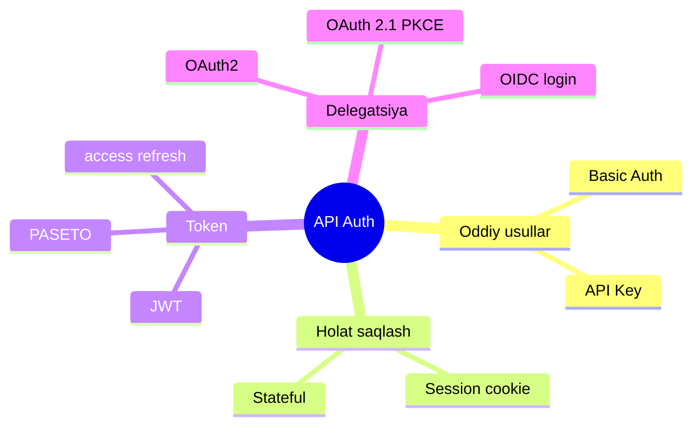
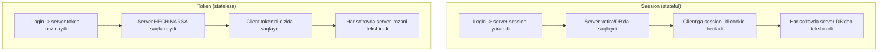
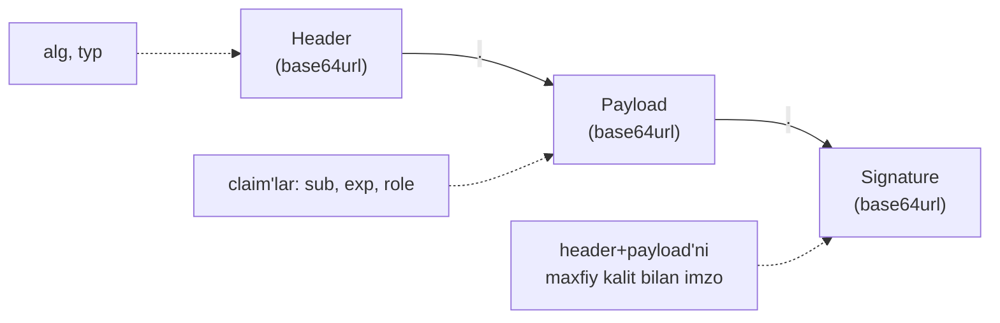
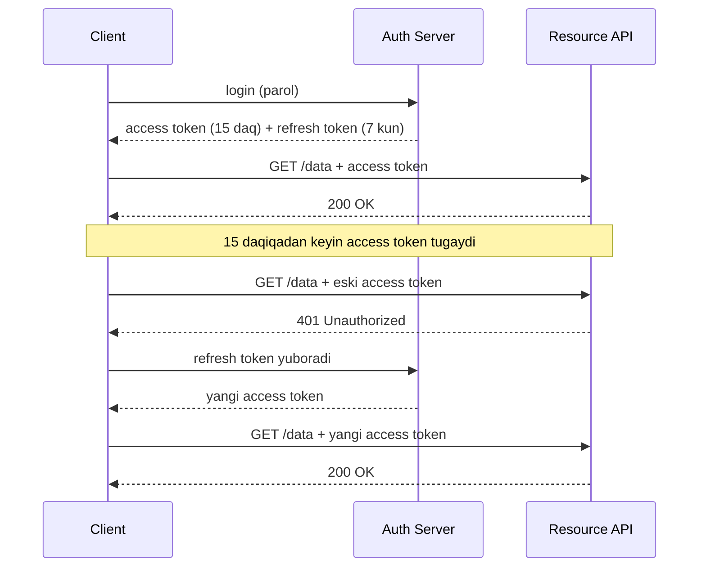
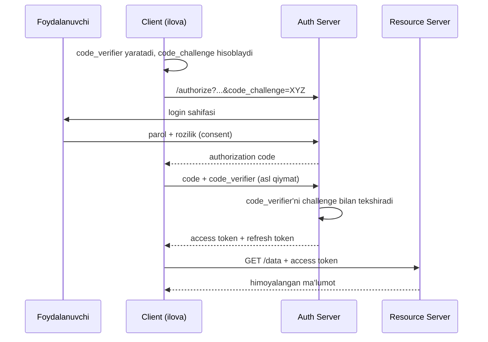

# API autentifikatsiya

## Muammo: server "sen kimsan?" degan savolga qanday javob oladi?

REST server **stateless** (esingdami, 2-dars) — u seni eslamaydi. Demak har
so'rovda "men kimman va menga nima ruxsat bor" degan savolga javob berishing
kerak. Aks holda istalgan odam `DELETE /users/123` yuborib, boshqaning
hisobini o'chirib tashlaydi.

Bu darsda **autentifikatsiya** (authentication — "sen kimsan?") va
**avtorizatsiya** (authorization — "senga nima ruxsat?") mexanizmlarini
ko'ramiz: Basic Auth'dan tortib OAuth 2.1 va PASETO gacha.

> **Ikki so'zni chalkashtirma:**
> **Authentication** = kimligingni isbotlash (pasport ko'rsatish).
> **Authorization** = nimaga ruxsating borligi (VIP zalga kira olasanmi).

## Analogiya: klub eshigidagi soqchi

- **Basic Auth** — har safar eshikda ism-familiyangni aytasan. Oddiy, lekin
  har safar ochiq aytilgani xavfli.
- **API key** — sende maxsus kartochka bor, uni ko'rsatasan. Kim bergani
  bilinadi, lekin karta o'g'irlansa — tamom.
- **Token (JWT)** — sende muhrlangan bilet bor: ichida kimliging va muddati
  yozilgan, soqchi muhrni tekshiradi va bazaga qo'ng'iroq qilmaydi.
- **OAuth2** — sen Google'dan "bu odam menikidir" degan xat olib kelasan;
  klub Google'ga ishonadi, sening parolingni umuman ko'rmaydi.

## Diagramma: usullar xaritasi



---

## 1-qism: Basic Auth — eng oddiy usul

Har so'rovda `username:password` ni Base64 qilib header'ga qo'yasan.

```bash
curl https://api.example.com/data \
  -H "Authorization: Basic YWxpOnBhc3N3b3Jk"
```

Bu yerda `YWxpOnBhc3N3b3Jk` — `ali:password` ning Base64 ko'rinishi.

> **Diqqat:** Base64 — bu **shifrlash EMAS**, faqat kodlash. Uni istalgan
> odam ochib o'qiydi. Shuning uchun Basic Auth **faqat HTTPS ustida**
> ishlatilishi shart, aks holda parol ochiq uzatiladi.

**Kamchiliklari:** har so'rovda parol yuboriladi (o'g'irlanish xatari yuqori),
logout qilib bo'lmaydi, muddat yo'q. Amalda faqat ichki (internal) yoki oddiy
servislar uchun mos.

---

## 2-qism: API Key — kim chaqirayotganini bilish

**API key** — bu servis (ko'pincha inson emas, dastur) uchun beriladigan
uzun tasodifiy satr. Client uni har so'rovda yuboradi:

```bash
curl https://api.example.com/weather \
  -H "X-API-Key: sk_live_a1b2c3d4e5f6..."
```

API key ko'proq **identifikatsiya va rate limiting** uchun ishlatiladi: server
"bu kim chaqiryapti va sekundiga necha marta" ni biladi. Lekin u odatda
foydalanuvchi darajasidagi ruxsatlarni ajratmaydi.

**Kamchiliklari:** o'g'irlansa, cheklovsiz ishlaydi (muddati bo'lmasa); kodga
yozib qo'yilsa (Git'ga tushib ketsa) — jiddiy tahdid. API key'ni **doim
maxfiy saqla** va faqat backend'da ishlat.

---

## 3-qism: Session vs Token — ikki falsafa

Foydalanuvchi login qilganidan keyin uni qanday "eslab qolamiz"? Ikki yo'l bor.



| Xususiyat | Session | Token (JWT) |
| --- | --- | --- |
| Holat qayerda | Serverda (DB/xotira) | Client'da |
| Server eslaydi? | Ha (stateful) | Yo'q (stateless) |
| Scale (ko'p server) | Qiyin (umumiy DB kerak) | Oson |
| Bekor qilish (revoke) | Oson (DB'dan o'chir) | Qiyin (muddat kutasan) |
| REST'ga mos | Kamroq | Ko'proq |

REST stateless bo'lgani uchun **token** yondashuvi tabiiyroq. Lekin session'ning
ham afzalligi bor: tokenni darhol bekor qilib bo'lmaydi, session'ni esa DB'dan
o'chirish yetarli. Amalda ko'p tizim ikkalasini birlashtiradi.

---

## 4-qism: JWT — imzolangan bilet

**JWT** (JSON Web Token) — bu o'zida ma'lumot tashiydigan, **imzolangan**
token. Uch qismdan iborat, nuqta bilan ajratilgan: `xxxxx.yyyyy.zzzzz`.



**1. Header** — token turi va imzo algoritmi:

```json
{ "alg": "HS256", "typ": "JWT" }
```

**2. Payload** — **claim**'lar (da'volar), ya'ni foydalanuvchi haqidagi
ma'lumot va token muddati:

```json
{
  "sub": "1234567890",
  "name": "Ali Valiyev",
  "role": "admin",
  "iat": 1516239022,
  "exp": 1516242622
}
```

`sub` — subject (kim), `iat` — issued at (qachon berilgan), `exp` — expiration
(qachon tugaydi). Payload — **base64url**, ya'ni **ochiq o'qiladi**!

**3. Signature** — header va payload'ni maxfiy kalit bilan imzolash natijasi:

```
HMACSHA256(base64url(header) + "." + base64url(payload), secret)
```

Server tokenni qabul qilganda imzoni qaytadan hisoblaydi. Agar payload
o'zgartirilgan bo'lsa, imzo mos kelmaydi — token rad etiladi. Shuning uchun
hech kim `role: user` ni `role: admin` ga o'zgartira olmaydi.

### JWT decode misoli

```bash
# Payload'ni ko'rish (2-qism, ochiq o'qiladi):
echo "eyJzdWIiOiIxMjM0IiwibmFtZSI6IkFsaSIsInJvbGUiOiJhZG1pbiJ9" | base64 -d
# Natija: {"sub":"1234","name":"Ali","role":"admin"}
```

> **Muhim:** JWT'ni imzo himoya qiladi (tampering'dan), lekin **shifrlamaydi**.
> Payload'ga parol yoki maxfiy ma'lumot yozma — u ochiq o'qiladi.

---

## 5-qism: Access token va Refresh token

Agar JWT'ning muddati uzoq bo'lsa (masalan 30 kun) va o'g'irlansa — hujumchi
30 kun kirib turadi. Agar juda qisqa bo'lsa — foydalanuvchi har 5 daqiqada
qayta login qiladi. Yechim: **ikki xil token**.



- **Access token** — qisqa muddatli (15-30 daqiqa), har so'rovda ishlatiladi.
  O'g'irlansa ham tez tugaydi.
- **Refresh token** — uzoq muddatli (kun/hafta), faqat yangi access token
  olish uchun ishlatiladi va **xavfsiz saqlanadi**.

**Refresh token rotation** (2025 best practice): har refresh'da eski refresh
token bekor qilinadi va yangisi beriladi. Agar o'g'irlangan eski token qayta
ishlatilsa, server hujumni sezadi va butun zanjirni bekor qiladi.

---

## 6-qism: OAuth2 — parolni bermasdan ruxsat berish

Muammo: uchinchi tomon ilovasi (masalan foto tahrirlovchi) sening Google
Drive'ingga kirmoqchi. Unga Google parolingni berasanmi? **Yo'q!** Parol
bersang, u hamma narsangga cheksiz kiradi.

**OAuth2** aynan shuni yechadi: sen parolingni faqat Google'ga aytasan,
ilovaga esa faqat **cheklangan ruxsat (token)** beriladi.

> **OAuth2 — bu autentifikatsiya emas, avtorizatsiya delegatsiyasi.** Sen
> "bu ilovaga mening fotolarimni ko'rishga ruxsat" deysan, parolingni bermaysan.

### Asosiy rollar

- **Resource Owner** — sen (foydalanuvchi)
- **Client** — ruxsat so'rayotgan ilova
- **Authorization Server** — ruxsat beruvchi (Google Auth)
- **Resource Server** — himoyalangan ma'lumot (Google Drive API)

### Authorization Code Flow + PKCE (2025 standart)

Bu — eng ko'p ishlatiladigan va eng xavfsiz oqim. **PKCE** (Proof Key for
Code Exchange, "piksi" deb o'qiladi) — code'ni yo'lda o'g'irlashdan himoya.



**PKCE nega kerak?** Agar authorization code brauzer tarixi, log yoki
referer orqali o'g'irlansa ham, hujumchida `code_verifier` yo'q — u tokenni
ololmaydi. Code yolg'iz o'zi foydasiz.

### OAuth 2.1 — 2025 yangiliklari

OAuth 2.1 (va RFC 9700 "Security Best Current Practice") quyidagilarni
majburiy qildi:

- **PKCE hamma client uchun majburiy** (public ham, confidential ham)
- **Implicit grant** va **Resource Owner Password** flow'lari **bekor qilindi**
  (xavfsiz emas)
- **Refresh token rotation** va qisqa muddatli tokenlar tavsiya etiladi

---

## 7-qism: OIDC — OAuth2 ustida login

OAuth2 avtorizatsiya uchun, lekin ko'pchilik uni "Google bilan kirish" uchun
ishlatadi — bu esa **autentifikatsiya**. Shu bo'shliqni **OIDC** (OpenID
Connect) to'ldiradi.

OIDC — OAuth2 ustiga qurilgan qatlam. U qo'shadi:

- **ID Token** — foydalanuvchi haqidagi JWT (`sub`, `email`, `name` claim'lari
  bilan). Bu "bu odam kim" degan savolga javob.
- **UserInfo endpoint** — foydalanuvchi profilini olish uchun.

Sodda qoida: **access token** — "menga API'ga ruxsat" (avtorizatsiya),
**ID token** — "men kimman" (autentifikatsiya). "Login with Google"
tugmasi ortida aynan OIDC turadi.

---

## 8-qism: PASETO — JWT'ning xavfsizroq muqobili

JWT'ning eng katta muammosi — **algoritm moslashuvchanligi** xatarli. PASETO
(Platform Agnostic Security Tokens) bu muammoni ildizidan yechadi:

| Xususiyat | JWT | PASETO |
| --- | --- | --- |
| Algoritm tanlash | Header'da (`alg`) | Yo'q, versiya belgilaydi |
| `alg: none` hujumi | Mumkin | Imkonsiz |
| Algoritm chalkashligi | Xatar bor | Yo'q |
| Foydalanish | Juda keng | O'smoqda |

PASETO'da token turi va versiya oldindan belgilangan (`v4.public`), shuning
uchun hujumchi algoritmni o'zgartira olmaydi. Yangi loyihalarda ko'pchilik uni
JWT'ga xavfsizroq muqobil deb tavsiya qiladi.

---

## ⚠️ Ko'p uchraydigan xatolar (xavfsizlik)

**1-xato: JWT'ni `localStorage`da saqlash.**
Nega xavfli: `localStorage`'ga JavaScript kira oladi. Agar saytga XSS hujumi
bo'lsa, hujumchi tokenni o'g'irlaydi.
To'g'risi: access token'ni **xotirada (in-memory)**, refresh token'ni
**HttpOnly + Secure cookie**'da saqla. HttpOnly cookie'ga JavaScript kirolmaydi,
demak XSS token'ni o'qiy olmaydi. OWASP cookie'ni tavsiya qiladi.

**2-xato: `alg: none` hujumiga ochiqlik.**
Nega xavfli: agar server token header'idagi `alg` maydoniga ko'r-ko'rona
ishonsa, hujumchi `"alg": "none"` qilib, imzoni olib tashlaydi. Server
imzosiz tokenni qabul qilsa — hujumchi payload'ni erkin o'zgartirib,
o'zini admin qiladi.
To'g'risi: serverda **kutilayotgan algoritmni qattiq belgila** (masalan faqat
`HS256`), token'dagi `alg` ga ishonma. Yoki PASETO ishlat.

**3-xato: payload'ga maxfiy ma'lumot yozish.**
JWT payload ochiq o'qiladi. Parol, karta raqami yoki maxfiy kalitni unga yozma.

**4-xato: HTTPS'siz Basic Auth yoki token.**
HTTPS'siz hamma token/parol ochiq uzatiladi. **Doim TLS ustida** ishla.

**5-xato: uzoq muddatli access token.**
30 kunlik access token o'g'irlansa — 30 kun tahdid. Access token qisqa
(15-30 daq), refresh token orqali yangila.

---

## Xulosa

- **Authentication** = kimligingni isbotlash; **authorization** = ruxsating.
- **Basic Auth** oddiy lekin har so'rovda parol; faqat HTTPS'da.
- **API key** servisni identifikatsiya qiladi, rate limiting uchun.
- **Session** stateful (server saqlaydi), **token** stateless (client saqlaydi).
- **JWT** = header.payload.signature; imzolangan, lekin shifrlanmagan.
- **Access + refresh token** — qisqa va uzoq muddatli tokenlar juftligi.
- **OAuth2** — parolni bermasdan ruxsat delegatsiyasi; 2025 standarti PKCE.
- **OIDC** — OAuth2 ustida login (ID token).
- **PASETO** — JWT'ning `alg`-xavfsizroq muqobili.

## 🧠 Eslab qol

- JWT payload ochiq o'qiladi, imzo faqat o'zgartirishdan himoya qiladi.
- Token'ni localStorage'da emas, HttpOnly cookie/xotirada saqla.
- OAuth2 = avtorizatsiya, OIDC = autentifikatsiya.
- PKCE endi hamma OAuth client uchun majburiy.

## ✅ O'z-o'zini tekshir (retrieval practice)

**1. JWT payload'ga foydalanuvchi parolini yozish nega xavfli?**

<details>
<summary>Javob</summary>

Payload **base64url** bilan kodlangan, ya'ni shifrlanmagan — istalgan odam
uni ochib o'qiydi. Imzo faqat **o'zgartirishdan** himoya qiladi, **yashirmaydi**.
Shuning uchun maxfiy ma'lumot payload'da bo'lmasligi kerak.

</details>

**2. `alg: none` hujumi qanday ishlaydi va qanday to'sib qo'yiladi?**

<details>
<summary>Javob</summary>

Hujumchi header'da `"alg": "none"` qilib imzoni olib tashlaydi. Agar server
token'dagi `alg`ga ishonsa, imzosiz (soxta) tokenni qabul qiladi. To'sish:
serverda kutilayotgan algoritmni **qattiq kodla**, `alg`ga ishonma.

</details>

**3. Nega OAuth2'da ilovaga parolni bermaslik yaxshiroq?**

<details>
<summary>Javob</summary>

Parol bersang, ilova hamma narsangga cheksiz kiradi va parolni saqlab qolishi
mumkin. OAuth2'da ilovaga faqat **cheklangan token** beriladi (masalan faqat
fotolarni o'qish), parol esa faqat Auth Server'da qoladi.

</details>

**4. Access token va refresh token nima uchun ajratiladi?**

<details>
<summary>Javob</summary>

Access token qisqa muddatli — o'g'irlansa tez tugaydi va har so'rovda ishlatiladi.
Refresh token uzoq muddatli, xavfsiz saqlanadi va faqat yangi access token
olish uchun. Bu xavfsizlik va qulaylik o'rtasidagi muvozanat.

</details>

**5. Session va token'da "logout" (bekor qilish) qaysi biri osonroq va nega?**

<details>
<summary>Javob</summary>

**Session** — server DB'da saqlaydi, o'chirsang darhol bekor bo'ladi. **JWT**
stateless — server saqlamaydi, shuning uchun uni darhol bekor qilib bo'lmaydi,
muddati tugashini kutasan (yoki blacklist yuritasan).

</details>

## 🛠 Amaliyot

**1. Oson (Modify).** Quyidagi Basic Auth so'rovini API key'ga o'zgartir:

```bash
curl https://api.example.com/data -H "Authorization: Basic YWxpOnBhc3M="
# TODO: X-API-Key header bilan qayta yoz
```

<details>
<summary>Hint</summary>

`curl https://api.example.com/data -H "X-API-Key: sk_live_..."`.

</details>

**2. O'rta (faded example).** JWT payload skeletini to'ldir (admin, 1 soat muddat):

```json
{
  "sub": "1001",
  "role": "____",     // TODO
  "iat": 1700000000,
  "exp": ________     // TODO: iat + 3600
}
```

<details>
<summary>Hint</summary>

`"role": "admin"`, `"exp": 1700003600`.

</details>

**3. Qiyin (Make).** "Google bilan kirish" oqimini sequence diagramma qilib chiz:
foydalanuvchi, sening ilovang, Google Auth Server, Google UserInfo. Qayerda
PKCE, qayerda ID token paydo bo'lishini belgila.

<details>
<summary>Hint</summary>

Boshda ilova code_challenge yuboradi. Oxirida Auth Server access token +
**ID token** (OIDC) qaytaradi. UserInfo endpoint'dan profil olinadi.

</details>

## 🔁 Takrorlash

- Oldingi darslar: [REST constraints](02-rest-constraints.md) (stateless),
  [Resource naming](03-rest-resource-naming.md). Keyingi:
  [WebSocket](05-websocket.md).
- Takrorlash jadvali: **ertaga** JWT'ning 3 qismini xotiradan chiz →
  **3 kundan keyin** OAuth2 + PKCE sequence diagrammasini qayta chiz →
  **1 haftadan keyin** 5 ta xavfsizlik xatosini takrorla.
- **Feynman testi:** OAuth2'ni "klub soqchisi + Google'dan xat" analogiyasi
  bilan 3 jumlada tushuntir. Nega parolni bermaslik afzal?

## 📚 Manbalar

- RFC 9700 (OAuth 2.0 Security Best Current Practice) —
  https://datatracker.ietf.org/doc/rfc9700/
- Auth0: Authorization Code Flow with PKCE —
  https://auth0.com/docs/get-started/authentication-and-authorization-flow/authorization-code-flow-with-pkce
- JWT vulnerabilities & best practices —
  https://www.vaadata.com/en/blog/jwt-json-web-token-vulnerabilities-common-attacks-and-security-best-practices/
- Why PASETO is better than JWT —
  https://dev.to/techschoolguru/why-paseto-is-better-than-jwt-for-token-based-authentication-1b0c
- OWASP: Testing JSON Web Tokens —
  https://owasp.org/www-project-web-security-testing-guide/latest/4-Web_Application_Security_Testing/06-Session_Management_Testing/10-Testing_JSON_Web_Tokens
