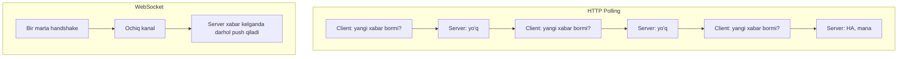
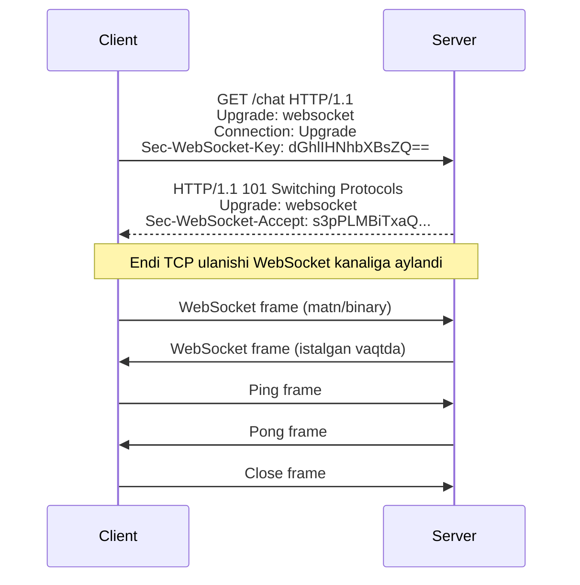
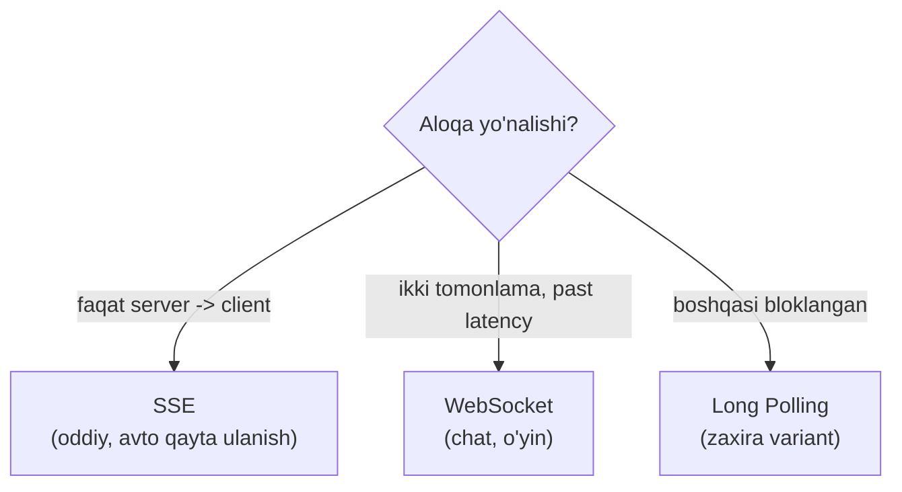

# WebSocket

## Muammo: HTTP "so'ra-javob ol" bilan chat qilib bo'lmaydi

Oddiy HTTP bir tomonlama: **client so'raydi, server javob beradi**. Server
o'zi tashabbus bilan client'ga xabar yubora olmaydi.

Endi chat ilovasini tasavvur qil: do'sting xabar yuborsa, sen darhol ko'rishing
kerak. HTTP bilan buni qilishning yagona yo'li — har soniyada serverga
"yangi xabar bormi?" deb so'rab turish (**polling**). Bu:

- tarmoqni behuda band qiladi (aksariyat so'rovlar "yo'q" javobini oladi),
- server yukini oshiradi,
- xabar kelishida kechikish (latency) beradi.

**WebSocket** aynan shuni yechadi: bir marta ulanib, keyin **ikki tomon ham
istalgan vaqtda** xabar yuboradigan **doimiy kanal** ochadi.

## Analogiya: telefon qo'ng'irog'i vs xat yozish

- **HTTP** — xat yozish: har safar konvert, marka, manzil (header'lar) yozib,
  yuborib, javobni kutasan. Har xat — alohida.
- **WebSocket** — telefon qo'ng'irog'i: bir marta ulanasan (**handshake**),
  keyin ikkalangiz ham istalgan payt gapirasan, har gap uchun qayta terish
  shart emas.

Farqi shundaki: qo'ng'iroqda liniya ochiq turadi (resurs band), lekin
har xabar arzon. HTTP'da liniya yopiq, lekin har xabar qimmat.

## Sodda ta'rif

> **WebSocket** — bitta **doimiy TCP ulanishi** ustida **full-duplex**
> (ikki tomonlama, bir vaqtda) aloqa beruvchi protokol. Ulanish HTTP
> **handshake** bilan ochiladi, keyin ochiq qoladi.

Original ruscha manba aytganidek: WebSocket — bu yangilangan (upgrade qilingan)
HTTP ulanish bo'lib, u client yoki server uzmaguncha yashaydi. Aynan shu bitta
uzoq yashovchi TCP ulanishi orqali barcha ma'lumot almashinadi — bu real
vaqtli (real-time) ilovalar uchun tarmoq xarajatini keskin kamaytiradi.

## Diagramma: HTTP polling vs WebSocket



---

## 1-qism: Handshake — HTTP'dan WebSocket'ga o'tish

WebSocket ulanishi oddiy **HTTP so'rovi**dan boshlanadi, lekin unda maxsus
header bor: `Upgrade: websocket`. Bu serverdan "keldik-ketdik" HTTP'dan
doimiy WebSocket kanaliga o'tishni so'raydi.



**Handshake bosqichlari:**

1. Client `GET` so'rovi yuboradi: `Upgrade: websocket`,
   `Connection: Upgrade` va tasodifiy `Sec-WebSocket-Key`.
2. Server **`101 Switching Protocols`** javobi bilan roziligini bildiradi va
   kalitdan hisoblangan `Sec-WebSocket-Accept` qaytaradi.
3. Shu paytdan boshlab **bir xil TCP ulanishi** WebSocket sifatida ishlaydi —
   ikkala tomon ham frame yuboradi.

`Sec-WebSocket-Key` va `Sec-WebSocket-Accept` juftligi — bu handshake'ning
haqiqiy WebSocket bilan bo'layotganini tasdiqlaydi (oddiy HTTP proxy bilan
adashib qolmaslik uchun).

### Handshake curl misoli

```bash
curl -i -N \
  -H "Connection: Upgrade" \
  -H "Upgrade: websocket" \
  -H "Sec-WebSocket-Key: dGhlIHNhbXBsZSBub25jZQ==" \
  -H "Sec-WebSocket-Version: 13" \
  http://localhost:8080/chat
```

Muvaffaqiyatli bo'lsa, server `HTTP/1.1 101 Switching Protocols` qaytaradi.

---

## 2-qism: Frame'lar — WebSocket xabar birligi

HTTP'da har xabar katta header bilan keladi. WebSocket'da esa ma'lumot
**frame** (kadr) deb ataluvchi ixcham bo'laklarda uzatiladi.

Frame juda arzon: server->client frame'ning minimal sarlavhasi bor-yo'g'i
**2 bayt**, client->server esa **6 bayt** (mask tufayli). HTTP'ning yuzlab
baytlik header'iga solishtir — bu ulkan tejamkorlik.

Har frame **opcode** (amal kodi) ga ega:

| Opcode | Turi | Vazifasi |
| --- | --- | --- |
| `0x1` | Text | Matn (UTF-8) ma'lumot |
| `0x2` | Binary | Ikkilik ma'lumot |
| `0x8` | Close | Ulanishni yopish |
| `0x9` | Ping | Tirikligini tekshirish |
| `0xA` | Pong | Ping'ga javob |

---

## 3-qism: Ping/Pong — kanalni tirik ushlash

WebSocket ulanishi soatlab ochiq turishi mumkin. Lekin oradagi proxy yoki
NAT "bu ulanish o'lgan" deb uzib qo'yishi mumkin, ayniqsa uzoq jimlikda.

Yechim — **ping/pong** (heartbeat). Bir tomon `Ping` frame yuboradi, ikkinchisi
`Pong` bilan javob beradi. Bu:

- ulanish tirikligini isbotlaydi,
- proxy/NAT'ni "ulanish faol" deb ishontiradi,
- javob kelmasa, ulanish uzilganini tez aniqlaydi.

> **Production qoidasi:** har 15-30 soniyada ping/pong yuborish **majburiy**.
> Aks holda "zombi" ulanishlar to'planib, resurs behuda band bo'ladi.

---

## 4-qism: WebSocket vs SSE vs Long Polling

Real vaqtli aloqaning uch yo'li bor. To'g'ri tanlash muhim — WebSocket har
doim ham eng yaxshi tanlov emas.



| Xususiyat | Long Polling | SSE | WebSocket |
| --- | --- | --- | --- |
| Yo'nalish | Ikki tomonlama (sekin) | Faqat server->client | Ikki tomonlama |
| Protokol | HTTP | HTTP | TCP (upgrade) |
| Ulanish | Har javobda yangi | Bitta uzoq | Bitta doimiy |
| Avto qayta ulanish | Qo'lda | **Ha (built-in)** | Qo'lda |
| Binary qo'llab-quvvatlash | Ha | Yo'q (faqat matn) | Ha |
| Murakkablik | Past | Past | O'rta/yuqori |

**Long Polling** — client so'rov yuboradi, server ma'lumot bo'lguncha (yoki
timeout'gacha) ulanishni ushlab turadi, keyin darhol yangi so'rov ochiladi.
Eski, lekin hamma joyda ishlaydi.

**SSE** (Server-Sent Events) — server->client bir tomonlama oqim, oddiy HTTP
ustida. Handshake yo'q, binary yo'q. Eng katta afzalligi: **avtomatik qayta
ulanish** — ulanish uzilsa, brauzer o'zi qayta ulanadi va `Last-Event-ID`
header orqali qaysi joydan davom etishni aytadi.

**WebSocket** — to'liq ikki tomonlama, past latency, binary qo'llab-quvvatlaydi.

### Zamonaviy tavsiya (2025)

Amaliyotchilar quyidagini maslahat beradi:

- **Server->client yangilanishlar uchun avval SSE'ni sina** — u soddaroq,
  o'zi qayta ulanadi va mavjud HTTP infratuzilma bilan ishlaydi.
- **WebSocket'ni faqat chinakam ikki tomonlama, past latencyli holatlarda**
  ishlat (chat, birgalikda tahrirlash, ko'p o'yinchili o'yinlar).
- **Long Polling'dan yangi tizimda qoch** — faqat boshqa variantlar infratuzilma
  tomonidan bloklangan bo'lsa ishlat.

---

## 5-qism: Qachon WebSocket ishlatiladi?

**Mos holatlar:**

- Chat va messenjerlar
- Real vaqtli o'yinlar
- Birgalikda hujjat tahrirlash (Google Docs kabi)
- Jonli sport/birja narxlari (ikki tomonlama boshqaruv bilan)
- IoT qurilma boshqaruvi

**Mos kelmaydigan holatlar:**

- Faqat server yangilanish yuboradigan holat -> SSE yetarli
- Kamdan-kam yangilanish (har necha daqiqada) -> oddiy HTTP polling arzonroq
- Oddiy so'ra-javob API -> REST ishlat

### Kichik Go misoli (nazariy ko'rinish)

WebSocket amaliyoti (gorilla/websocket bilan) alohida Go modulida chuqur
ko'riladi. Bu yerda faqat handshake mantiqini his qilish uchun:

```go
// --- Handshake'ni WebSocket ulanishiga aylantiramiz ---
var upgrader = websocket.Upgrader{}

func chat(w http.ResponseWriter, r *http.Request) {
    // HTTP so'rovni WebSocket kanaliga upgrade qilamiz
    conn, _ := upgrader.Upgrade(w, r, nil)
    defer conn.Close()

    for {
        // Frame'ni o'qiymiz (matn yoki binary)
        _, msg, err := conn.ReadMessage()
        if err != nil {
            break // ulanish uzildi
        }
        // Xuddi shu xabarni qaytaramiz (echo)
        conn.WriteMessage(websocket.TextMessage, msg)
    }
}
```

E'tibor ber: `Upgrade` — bu handshake'ni bajaradigan qism. Undan keyin
`for` sikli ichida frame'lar uzluksiz o'qib-yoziladi. HTTP'dagi kabi har
so'rovga alohida funksiya chaqirilmaydi.

### 🤔 O'ylab ko'r

Faqat birja narxlarini ekranga chiqaradigan (foydalanuvchi hech narsa
yubormaydigan) ilova uchun WebSocket kerakmi yoki SSE yetarlimi?

<details>
<summary>💡 Javobni ko'rish</summary>

**SSE yetarli.** Ma'lumot faqat bir tomonlama (server->client) oqadi,
foydalanuvchi hech narsa yubormaydi. SSE soddaroq, avtomatik qayta ulanadi
va mavjud HTTP infratuzilma bilan ishlaydi. WebSocket bu yerda ortiqcha
murakkablik bo'lardi.

Agar keyinchalik foydalanuvchi buyurtma yubora boshlasa (ikki tomonlama),
o'shanda WebSocket'ga o'tish mantiqiy bo'ladi.

</details>

---

## ⚠️ Ko'p uchraydigan xatolar

**1-xato: har narsaga WebSocket ishlatish.**
Faqat server yangilanish yuboradigan holatda WebSocket ortiqcha. SSE soddaroq
va o'zi qayta ulanadi. Ehtiyojga qarab tanla.

**2-xato: ping/pong'ni unutish.**
Heartbeat bo'lmasa, proxy/NAT ulanishni jimgina uzadi va "zombi" ulanishlar
to'planadi. Har 15-30 soniyada ping yubor.

**3-xato: qayta ulanishni (reconnect) qo'lda yozmaslik.**
WebSocket SSE'dan farqli — o'zi qayta ulanmaydi. Ulanish uzilganda **client
kodida** qayta ulanish (exponential backoff bilan) yozishing shart.

**4-xato: `ws://` ni production'da ishlatish.**
`ws://` shifrlanmagan. Doim **`wss://`** (WebSocket over TLS) ishlat — xuddi
HTTP->HTTPS kabi.

---

## Xulosa

- **WebSocket** — bitta doimiy TCP ustida full-duplex aloqa beradi.
- Ulanish HTTP **handshake** (`Upgrade` + `101 Switching Protocols`) bilan ochiladi.
- Ma'lumot ixcham **frame**'larda uzatiladi; header 2-6 bayt.
- **Ping/pong** kanalni tirik ushlaydi va zombi ulanishlarni oldini oladi.
- **SSE** — bir tomonlama, oddiy, o'zi qayta ulanadi; **WebSocket** — ikki
  tomonlama, past latency; **Long Polling** — eski zaxira variant.
- 2025 tavsiya: avval SSE'ni sina, chinakam ikki tomonlama kerak bo'lsa WebSocket.

## 🧠 Eslab qol

- WebSocket = HTTP handshake -> doimiy full-duplex kanal.
- `101 Switching Protocols` — ulanish o'tdi degani.
- Faqat server->client bo'lsa SSE yetarli.
- Production'da `wss://` va ping/pong majburiy.

## ✅ O'z-o'zini tekshir (retrieval practice)

**1. Nima uchun WebSocket handshake oddiy HTTP so'rovidan boshlanadi?**

<details>
<summary>Javob</summary>

Mavjud HTTP infratuzilma (portlar, proxy'lar) bilan mos ishlash uchun.
Client oddiy `GET` yuboradi, lekin `Upgrade: websocket` header bilan; server
`101 Switching Protocols` bilan roziligini bildiradi va **bir xil TCP
ulanishi** WebSocket kanaliga aylanadi.

</details>

**2. WebSocket va SSE orasidagi eng muhim farq nima?**

<details>
<summary>Javob</summary>

**Yo'nalish.** SSE — faqat server->client (bir tomonlama) va o'zi qayta
ulanadi. WebSocket — ikki tomonlama (full-duplex), lekin qayta ulanishni
qo'lda yozish kerak. Faqat server xabar yuboradigan holatda SSE afzal.

</details>

**3. Ping/pong bo'lmasa qanday muammo yuzaga keladi?**

<details>
<summary>Javob</summary>

Oradagi proxy yoki NAT uzoq jimlikdan keyin ulanishni "o'lgan" deb uzib
qo'yadi. Server esa client'ning uzilganini bilmaydi va "zombi" ulanishlar
resurs band qiladi. Ping/pong bularni oldini oladi.

</details>

**4. Nima uchun frame'ning header'i HTTP'dan ancha kichik?**

<details>
<summary>Javob</summary>

HTTP'da har so'rov o'zida to'liq header (metod, yo'l, ko'plab meta-maydonlar)
olib keladi. WebSocket'da esa ulanish bir marta o'rnatilgach, kontekst allaqachon
ma'lum — shuning uchun har frame'ga faqat minimal sarlavha (2-6 bayt) kifoya.
Bu real vaqtli, tez-tez xabar almashishda katta tejamkorlik beradi.

</details>

**5. Nima uchun `ws://` o'rniga `wss://` ishlatiladi?**

<details>
<summary>Javob</summary>

`ws://` shifrlanmagan — ma'lumot ochiq uzatiladi. `wss://` — WebSocket over
TLS, ya'ni shifrlangan (xuddi HTTP->HTTPS kabi). Production'da doim `wss://`
ishlatilishi shart, aks holda xabarlar va tokenlar o'g'irlanishi mumkin.

</details>

## 🛠 Amaliyot

**1. Oson (Modify).** Yuqoridagi Go echo misolini o'zgartir: kelgan xabarni
qaytarishdan oldin oldiga `"echo: "` matnini qo'sh.

<details>
<summary>Hint</summary>

`conn.WriteMessage(websocket.TextMessage, append([]byte("echo: "), msg...))`.

</details>

**2. O'rta (faded example).** WebSocket handshake so'rovini to'ldir:

```
GET /chat HTTP/1.1
Host: example.com
Upgrade: ________          # TODO
Connection: ________       # TODO
Sec-WebSocket-Key: dGhlIHNhbXBsZQ==
Sec-WebSocket-Version: ____ # TODO
```

<details>
<summary>Hint</summary>

`Upgrade: websocket`, `Connection: Upgrade`, `Sec-WebSocket-Version: 13`.

</details>

**3. Qiyin (Make).** Jonli auktsion (auction) ilovasi uchun transport tanla:
foydalanuvchilar narx taklif qiladi (yuboradi) va boshqalarning takliflarini
darhol ko'radi (oladi). Qaysi transport (SSE/WebSocket/Long Polling) va nega?
Handshake'dan yopilishgacha sequence diagramma chiz.

<details>
<summary>Hint</summary>

Ikki tomonlama (taklif yuborish + boshqalarnikini olish) -> **WebSocket**.
SSE yetmaydi, chunki foydalanuvchi ham yuboradi.

</details>

## 🔁 Takrorlash

- Oldingi darslar: [API autentifikatsiya](04-api-autentifikatsiya.md),
  [REST constraints](02-rest-constraints.md) (stateless bilan solishtir).
  Keyingi: [gRPC](06-grpc.md).
- Takrorlash jadvali: **ertaga** handshake sequence diagrammasini xotiradan
  chiz -> **3 kundan keyin** WebSocket/SSE/Long Polling jadvalini to'ldir ->
  **1 haftadan keyin** "qachon qaysi transport" qarorini takrorla.
- **Feynman testi:** WebSocket'ni "telefon qo'ng'irog'i vs xat" analogiyasi
  bilan 3 jumlada tushuntir. Nega u chat uchun HTTP polling'dan yaxshi?

## 📚 Manbalar

- WebSocket Protocol (RFC 6455) — https://datatracker.ietf.org/doc/html/rfc6455
- WebSockets vs SSE vs Long Polling —
  https://www.techplained.com/websockets-sse-long-polling-comparison
- WebSocket vs SSE (websocket.org) — https://websocket.org/comparisons/sse/
- WebSocket Protocol Explained —
  https://justprotocols.com/protocols/websocket