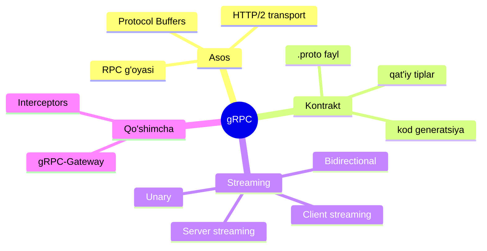
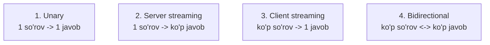
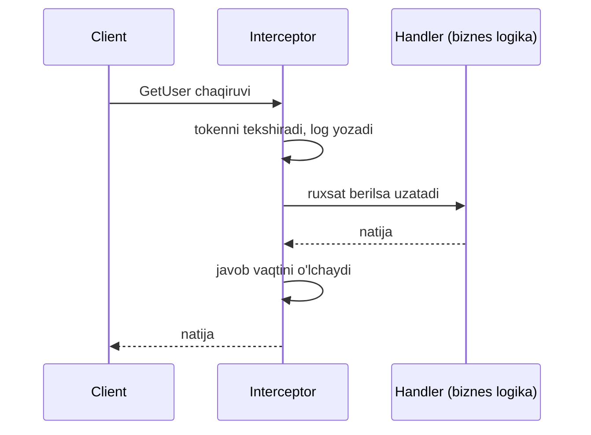
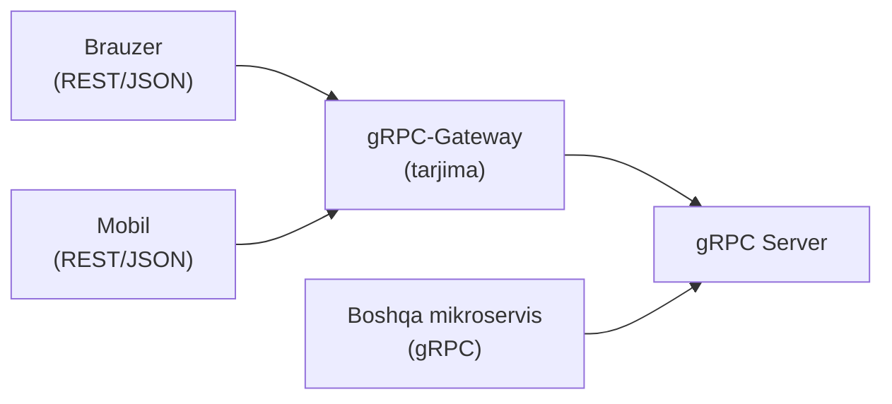
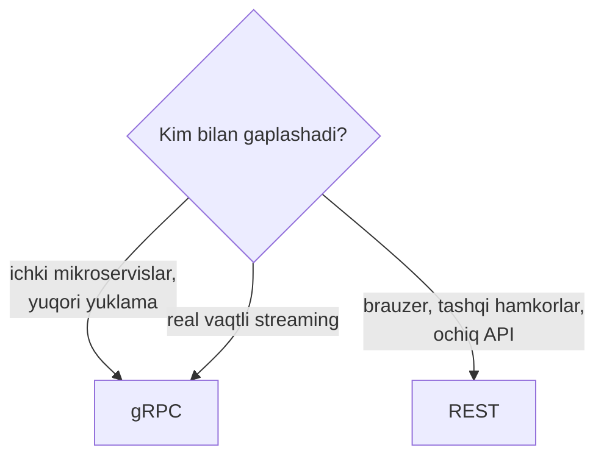

# gRPC

## Muammo: mikroservislar bir-biri bilan sekin va noaniq gaplashadi

Tasavvur qil: 50 ta mikroservis bor va ular soniyasiga million marta bir-biriga
murojaat qiladi. Agar har chaqiruv JSON'ni matnga o'girib, HTTP header'lari
bilan yuborsa:

- **Sekin** — JSON'ni parse qilish, matnni o'qish qimmat.
- **Katta** — JSON so'zma-so'z ("name", "email") har safar takrorlanadi.
- **Noaniq** — "bu maydon string edi yoki number?" degan xatolar runtime'da chiqadi.

REST bu holatda ortiqcha xarajat. **gRPC** aynan servislararo (service-to-service)
tez, ixcham va qat'iy tipli aloqa uchun yaratilgan.

## Analogiya: mahalliy funksiya chaqirgandek

REST'da sen "server bilan gaplashaman" deb o'ylaysan. gRPC'da esa boshqa
serverda turgan funksiyani **xuddi o'z kodingdagi funksiyadek** chaqirasan:

```go
user := client.GetUser(ctx, &pb.UserRequest{Id: 42})
```

Bu `GetUser` aslida boshqa mashinada bajariladi, lekin sen buni sezmaysan.
**RPC** (Remote Procedure Call — masofaviy protsedura chaqiruvi) g'oyasi shu:
tarmoq tafsilotlarini yashirib, uzoq funksiyani mahalliydek ko'rsatish.

Ruscha manba aytganidek: REST — bu ilg'or usullar to'plami, gRPC esa
**to'liq funksional aloqa freymvorki** — xuddi SOAP, Thrift yoki CORBA kabi,
u client'ga boshqa tizimdagi funksiyani mahalliydek chaqirishga imkon beradi.

## Sodda ta'rif

> **gRPC** — Google yaratgan, **Protocol Buffers** va **HTTP/2** ustida
> ishlaydigan yuqori unumli RPC freymvorki. Ma'lumot matn emas, ixcham
> **binary** formatda uzatiladi.

## Diagramma: gRPC anatomiyasi



---

## 1-qism: Protocol Buffers — kontrakt va format

gRPC'ning yuragi — **Protocol Buffers** (protobuf). Bu ikki narsa:

1. **Kontrakt tili** — servis va ma'lumot tuzilmasini `.proto` faylda ta'riflaysan.
2. **Serializatsiya formati** — ma'lumotni ixcham binary'ga o'giradi.

```protobuf
// user.proto
syntax = "proto3";

// --- Ma'lumot tuzilmasi (message) ---
message User {
  int64 id = 1;
  string name = 2;
  string email = 3;
}

// --- So'rov tuzilmasi ---
message GetUserRequest {
  int64 id = 1;
}

// --- Servis: qanday funksiyalar bor ---
service UserService {
  rpc GetUser(GetUserRequest) returns (User);
}
```

E'tibor ber: har maydonda **raqam** (`= 1`, `= 2`) bor. Bu — maydonning binary
formatidagi tartib raqami (tag). JSON'da "name" so'zi har safar yuboriladi;
protobuf'da esa faqat `2` raqami yuboriladi — shuning uchun u ancha ixcham.

### Kod generatsiya

`.proto` fayldan `protoc` kompilyatori istalgan til uchun kod yaratadi
(Go, Java, Python...):

```bash
protoc --go_out=. --go-grpc_out=. user.proto
```

Natijada sen yozmagan, lekin tayyor `GetUser` funksiyasi, `User` struct'i va
hokazolar paydo bo'ladi. Bu — **kod generatsiya pipeline'i**. Bir `.proto`
fayl — barcha tillar uchun bir xil, mos client va server.

> **Bu qat'iy tiplashning kuchi:** maydon tipi `.proto`da belgilangan. "String
> edi yoki number?" degan xato runtime'da emas, kompilyatsiyada tutiladi.

---

## 2-qism: Nega HTTP/2?

gRPC **HTTP/2** ustida ishlaydi (REST odatda HTTP/1.1). HTTP/2 quyidagilarni beradi:

- **Multiplexing** — bitta ulanish ustida ko'plab so'rov bir vaqtda oqadi
  (HTTP/1.1'da har so'rov navbat kutadi).
- **Binary framing** — ma'lumot binary kadrlarda, matn emas.
- **Header siqish (HPACK)** — takrorlanuvchi header'lar siqiladi.
- **Server push va streaming** — ikki tomonlama oqim imkoniyati.

Aynan HTTP/2'ning multiplexing va streaming imkoniyatlari gRPC'ning
**4 xil streaming turini** mumkin qiladi.

---

## 3-qism: 4 xil streaming turi

Bu gRPC'ning eng kuchli tomoni. RPC har doim ham "bitta so'rov -> bitta javob"
bo'lishi shart emas.



| Turi | So'rov | Javob | Misol |
| --- | --- | --- | --- |
| **Unary** | 1 | 1 | Oddiy `GetUser` |
| **Server streaming** | 1 | ko'p | Fayl yuklab olish, jonli lenta |
| **Client streaming** | ko'p | 1 | Katta faylni bo'lak'lab yuklash |
| **Bidirectional** | ko'p | ko'p | Chat, real vaqtli o'yin |

`.proto`da `stream` kalit so'zi bilan belgilanadi:

```protobuf
service ChatService {
  // Unary
  rpc SendMessage(Message) returns (Ack);
  // Server streaming
  rpc Subscribe(Topic) returns (stream Message);
  // Client streaming
  rpc Upload(stream Chunk) returns (UploadStatus);
  // Bidirectional
  rpc Chat(stream Message) returns (stream Message);
}
```

E'tibor ber: `stream` so'zi qayerda turishiga qarab tur o'zgaradi.
`returns (stream Message)` — server oqim yuboradi; `(stream Chunk)` — client
oqim yuboradi; ikkalasida ham `stream` bo'lsa — bidirectional.

---

## 4-qism: Interceptors — middleware

**Interceptor** — bu gRPC chaqiruvlarini "ushlab", ular oldidan/keyinidan kod
bajaradigan mexanizm (REST'dagi middleware analogi). Ular quyidagilar uchun:

- **Autentifikatsiya** — har chaqiruvda tokenni tekshirish
- **Logging va monitoring** — kim, qachon, qancha vaqtda chaqirdi
- **Xatolarni qayta ishlash** — markazlashgan error handling



Interceptor bir joyda yoziladi va **barcha** RPC'larga qo'llanadi — har
funksiyada tokenni qayta-qayta tekshirish shart emas.

---

## 5-qism: gRPC vs REST

Ikkalasi ham API qurish uchun, lekin turli maqsadlarga xizmat qiladi.

| Xususiyat | REST | gRPC |
| --- | --- | --- |
| Transport | HTTP/1.1 | HTTP/2 |
| Format | JSON (matn) | Protocol Buffers (binary) |
| Kontrakt | Ixtiyoriy (OpenAPI) | Majburiy (`.proto`) |
| Tezlik | Sekinroq | Tez (binary + HTTP/2) |
| O'qilishi | Odam o'qiy oladi | Odam o'qiy olmaydi |
| Streaming | Cheklangan (SSE) | 4 xil to'liq streaming |
| Brauzer | To'g'ridan-to'g'ri | gRPC-Web/gateway kerak |
| Debug | Oson (curl) | Qiyinroq (maxsus vosita) |

**gRPC afzalliklari** (ruscha manbadan):

- **Ixchamlik** — xabar kichik, kam tarmoq I/O.
- **Tezlik** — binary format tez o'qiladi va o'giriladi.
- **Qat'iy tiplash** — xabarlar tiplangan, ko'p keng tarqalgan xatolarni yo'qotadi.
- **Ko'p funksiyalilik** — autentifikatsiya, shifrlash, timeout, siqish o'rnatilgan.

**gRPC kamchiliklari** (ruscha manbadan):

- **Kontraktga bog'liq** — tashqi (external) servislar bilan ishlashda noqulay.
- **Binary format** — odam o'qiy olmaydi, tekshirish va debug qiyin.

---

## 6-qism: gRPC-Gateway — REST va gRPC birga

Muammo: brauzer to'g'ridan-to'g'ri gRPC bilan gaplasha olmaydi (HTTP/2 frame'lari
ustida ishlash kerak), tashqi hamkorlar esa oddiy REST/JSON'ni afzal ko'radi.

Yechim — **gRPC-Gateway**. U `.proto` fayldagi annotatsiyalarni o'qib,
REST/JSON so'rovlarini gRPC chaqiruvlariga tarjima qiluvchi **reverse proxy**
yaratadi.



Shunday qilib bitta backend ikki xil client'ga xizmat qiladi: ichki servislar
tez gRPC bilan, tashqi/brauzer client'lar esa oddiy REST bilan. `.proto`da
`google.api.http` annotatsiyasi qaysi REST yo'l qaysi RPC'ga mos kelishini
belgilaydi.

---

## 7-qism: Qachon gRPC tanlanadi?



**gRPC tanla:**

- Ichki mikroservislar orasidagi aloqa (service-to-service)
- Yuqori unumdorlik va past latency kerak
- Streaming (jonli ma'lumot oqimi) kerak
- Ko'p tilli (polyglot) tizim — bir `.proto`, hamma til

**REST tanla:**

- Ochiq (public) API, tashqi dasturchilar uchun
- Brauzerdan to'g'ridan-to'g'ri chaqiriladigan
- Oddiy CRUD, debug qulayligi muhim
- Keng qo'llab-quvvatlanish kerak

### Kichik Go misoli (nazariy)

To'liq gRPC amaliyoti alohida Go modulida ko'riladi. Bu yerda faqat client
chaqiruvining "mahalliy funksiyadek" ko'rinishini his qilish uchun:

```go
// --- gRPC serverga ulanamiz ---
conn, _ := grpc.Dial("localhost:50051", grpc.WithInsecure())
defer conn.Close()

// --- Generatsiya qilingan client yaratamiz ---
client := pb.NewUserServiceClient(conn)

// --- Uzoq funksiyani mahalliydek chaqiramiz ---
user, err := client.GetUser(ctx, &pb.GetUserRequest{Id: 42})
if err == nil {
    fmt.Println(user.Name) // xuddi mahalliy struct kabi
}
```

E'tibor ber: `client.GetUser(...)` — bu tarmoq orqali bajarilyapti, lekin
kod xuddi mahalliy funksiya chaqirgandek ko'rinadi. Bu — RPC g'oyasining amaldagi ko'rinishi.

### 🤔 O'ylab ko'r

Ommaviy (public) ob-havo API'sini istalgan dasturchi brauzerdan chaqira olsin.
gRPC yoki REST tanlaysanmi?

<details>
<summary>💡 Javobni ko'rish</summary>

**REST.** Ochiq API, brauzerdan to'g'ridan-to'g'ri chaqiriladi va keng
qo'llab-quvvatlanish kerak. gRPC brauzerda to'g'ridan-to'g'ri ishlamaydi
(gRPC-Web yoki gateway kerak) va tashqi dasturchilar uchun `.proto` kontrakti
qo'shimcha to'siq bo'ladi.

Agar bu API ichki mikroservislar orasida million marta chaqirilsa edi, u holda
gRPC afzal bo'lardi.

</details>

---

## ⚠️ Ko'p uchraydigan xatolar

**1-xato: hamma joyda gRPC ishlatish.**
gRPC ichki servislar uchun zo'r, lekin ochiq/brauzer API uchun REST soddaroq.
Client'ni bilib tanla.

**2-xato: `.proto`da maydon raqamini o'zgartirish.**
Maydon raqami (`= 1`, `= 2`) — binary formatning kaliti. Uni o'zgartirsang,
eski client'lar ma'lumotni noto'g'ri o'qiydi. Yangi maydonga **yangi** raqam ber,
eskisini o'chirma.

**3-xato: gRPC'ni brauzerdan to'g'ridan-to'g'ri chaqirishga urinish.**
Brauzer standart gRPC bilan gaplasha olmaydi. gRPC-Web yoki gRPC-Gateway kerak.

**4-xato: streaming turini noto'g'ri tanlash.**
Chatga unary ishlatib, har xabarda yangi so'rov ochish — samarasiz.
Real vaqtli ikki tomonlama holatga bidirectional streaming mos.

---

## Xulosa

- **gRPC** — HTTP/2 va Protocol Buffers ustidagi tez, binary RPC freymvorki.
- **`.proto` fayl** — servis va ma'lumot kontrakti; undan barcha tillar uchun
  kod generatsiya qilinadi.
- **HTTP/2** — multiplexing va streaming imkonini beradi.
- **4 xil streaming**: unary, server, client, bidirectional.
- **Interceptor** — auth/logging uchun markazlashgan middleware.
- **gRPC** ichki servislararo tez aloqa uchun; **REST** ochiq/brauzer API uchun.
- **gRPC-Gateway** REST/JSON so'rovlarini gRPC'ga tarjima qiladi.

## 🧠 Eslab qol

- gRPC = HTTP/2 + Protocol Buffers (binary).
- `.proto` — bitta kontrakt, hamma til uchun kod.
- 4 streaming turi: unary, server, client, bidirectional.
- Ichki servis -> gRPC, ochiq/brauzer -> REST.

## ✅ O'z-o'zini tekshir (retrieval practice)

**1. Nima uchun protobuf JSON'dan ixchamroq?**

<details>
<summary>Javob</summary>

JSON har xabarda maydon nomlarini (`"name"`, `"email"`) matn sifatida
takrorlaydi. Protobuf esa faqat maydonning **raqamli tag'ini** (`2`, `3`)
binary shaklda yuboradi. Shuning uchun xabar kichikroq va tez o'qiladi.

</details>

**2. HTTP/2'ning qaysi xususiyati gRPC streaming'ni mumkin qiladi?**

<details>
<summary>Javob</summary>

**Multiplexing** va **binary framing** — bitta ulanish ustida ko'plab so'rov/javob
oqimlarini bir vaqtda uzatish imkoni. Bu 4 xil streaming turini (ayniqsa
bidirectional) mumkin qiladi.

</details>

**3. `.proto`da maydon raqamini o'zgartirish nega xavfli?**

<details>
<summary>Javob</summary>

Maydon raqami — binary formatning kaliti. Uni o'zgartirsang, eski client'lar
maydonlarni noto'g'ri joyda o'qiydi (masalan `name` o'rniga `email`). Yangi
maydonga yangi raqam ber, eskisini o'chirma yoki qayta ishlatma.

</details>

**4. Nima uchun ochiq brauzer API uchun REST gRPC'dan afzal?**

<details>
<summary>Javob</summary>

Brauzer standart gRPC bilan to'g'ridan-to'g'ri gaplasha olmaydi (gRPC-Web/gateway
kerak). REST oddiy HTTP/JSON, `curl` bilan test qilinadi, keng qo'llab-quvvatlanadi
va tashqi dasturchilar uchun `.proto` kontrakti to'sig'i yo'q.

</details>

**5. gRPC-Gateway qanday muammoni yechadi?**

<details>
<summary>Javob</summary>

Bir backend'ni ikki xil client'ga ochish. Ichki mikroservislar tez gRPC bilan,
brauzer/tashqi client'lar esa oddiy REST/JSON bilan gaplashadi. Gateway
REST so'rovlarini gRPC chaqiruvlariga tarjima qiladi.

</details>

## 🛠 Amaliyot

**1. Oson (Modify).** Yuqoridagi `User` message'iga `bool is_active = 4;`
maydonini qo'sh. Nega raqam `4`, `1` emas?

<details>
<summary>Hint</summary>

`1`, `2`, `3` band. Yangi maydonga keyingi bo'sh raqam (`4`) beriladi.

</details>

**2. O'rta (faded example).** Fayl yuklash servisini to'ldir. Katta fayl
bo'laklarda yuklanadi (client oqim), server bitta status qaytaradi:

```protobuf
service FileService {
  // TODO: client streaming rpc yoz
  rpc Upload(______ Chunk) returns (______);  // TODO
}
```

<details>
<summary>Hint</summary>

`rpc Upload(stream Chunk) returns (UploadStatus);` — `stream` so'rov tomonida,
javob tomonida emas.

</details>

**3. Qiyin (Make).** Real vaqtli chat servisini `.proto` faylda to'liq dizayn
qil: xabar yuborish (unary), kanalga obuna (server streaming) va to'liq chat
(bidirectional). Har rpc uchun message'larni ham ta'rifla.

<details>
<summary>Hint</summary>

`rpc Send(Message) returns (Ack)`, `rpc Subscribe(Topic) returns (stream Message)`,
`rpc Chat(stream Message) returns (stream Message)`.

</details>

## 🔁 Takrorlash

- Oldingi darslar: [REST nima](01-rest-nima.md) (solishtir),
  [WebSocket](05-websocket.md) (streaming bilan solishtir).
  Modul yakuni: [README](README.md).
- Takrorlash jadvali: **ertaga** 4 streaming turini xotiradan yoz ->
  **3 kundan keyin** gRPC vs REST jadvalini to'ldir ->
  **1 haftadan keyin** "qachon gRPC" qarorini takrorla.
- **Feynman testi:** gRPC'ni "mahalliy funksiya chaqirgandek" analogiyasi bilan
  3 jumlada tushuntir. Nega u mikroservislar orasida REST'dan tez?

## 📚 Manbalar

- gRPC rasmiy hujjatlari — https://grpc.io/docs/
- Protocol Buffers — https://protobuf.dev/
- gRPC vs REST (IBM) — https://www.ibm.com/think/topics/grpc-vs-rest
- What is gRPC? (Apache APISIX) — https://apisix.apache.org/learning-center/what-is-grpc/
- gRPC vs REST: Decision Guide 2026 — https://graftcode.com/blog/grpc-vs-rest
