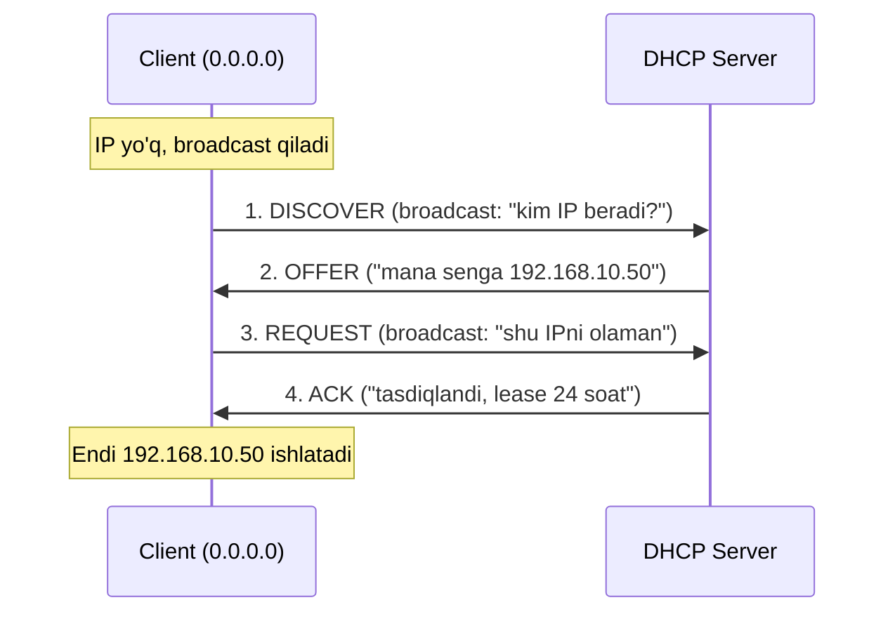
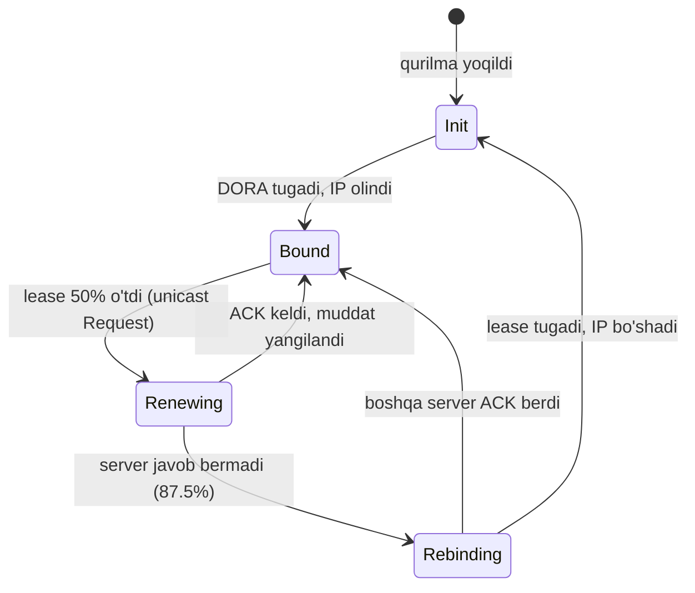
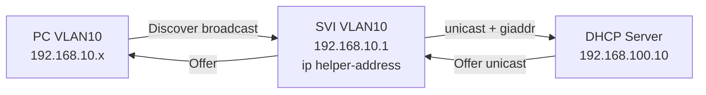

# DHCP: IP manzillarni avtomatik tarqatish (DORA, lease, relay)

## Muammo: har bir qurilmaga qo'lda IP yozish - dahshat

Tasavvur qil: ofisda 300 ta kompyuter, 50 ta telefon, 40 ta printer bor.
Har biriga qo'lda IP address, subnet mask, default gateway va DNS server yozib
chiqsang - kunlar ketadi. Bittasida xato qilsang (masalan ikki qurilmaga bir xil
IP bersang) - **IP conflict** paydo bo'ladi va tarmoq ishlamay qoladi.

Yangi noutbuk kelsa yana qo'lda sozlash. Xodim uyga ketib boshqa tarmoqqa ulansa
yana. Bu yondashuv 5 ta qurilmada ishlaydi, 500 tada esa kabusga aylanadi.

Kerakli narsa: qurilma tarmoqqa ulanganda **o'zi** kerakli IP sozlamalarini olsin.

## Analogiya: mehmonxona resepsheni

DHCP - bu mehmonxona **resepsheni** kabi.

- Mehmon (qurilma) kelib "menga xona kerak" deydi.
- Resepshen (DHCP server) bo'sh xonani (IP address) beradi va kalit muddatini
  (lease time) aytadi: "bu xona sizniki, lekin 24 soatga".
- Muddat tugasa mehmon uzaytiradi yoki xonani bo'shatadi.
- Resepshen daftarida qaysi xona kimda ekani yozilib boradi - shuning uchun
  ikki mehmonga bir xona berilmaydi.

**Analogiya chegarasi:** mehmonxonada xonani odam so'raydi, DHCPda esa qurilma
avtomatik so'raydi va odam buni sezmaydi ham.

## Sodda ta'rif

> **DHCP** (Dynamic Host Configuration Protocol) - tarmoqqa ulangan qurilmaga
> IP address, subnet mask, default gateway va DNS serverni avtomatik beruvchi
> protocol.

DHCP odatda 5 narsani beradi:

| Sozlama | Nima uchun kerak |
|---|---|
| IP address | Qurilmaning tarmoqdagi manzili |
| Subnet mask | Qaysi qism tarmoq, qaysi qism host ekanini bilish |
| Default gateway | Boshqa tarmoqqa chiqish yo'li (router) |
| DNS server | Domen nomini IPga aylantiruvchi server |
| Lease time | IP qancha muddatga berilgani |

## DORA: DHCP'ning 4 qadamli suhbati

Qurilma boshida IP address'ga ega emas, shuning uchun aniq bir serverga
murojaat qila olmaydi - u **broadcast** (hammaga qichqirish) ishlatadi.
Bu jarayon 4 bosqichdan iborat va uni **DORA** deb ataymiz:

**D**iscover -> **O**ffer -> **R**equest -> **A**cknowledge



Har bir qadamning ma'nosi:

1. **Discover** - client broadcast yuboradi: "tarmoqda DHCP server bormi?"
   Source IP `0.0.0.0`, Destination IP `255.255.255.255`.
2. **Offer** - server bo'sh IPni taklif qiladi. Bir nechta server bo'lsa,
   client bir nechta offer olishi mumkin.
3. **Request** - client birinchi kelgan offerni tanlab, yana **broadcast** qiladi.
   Nega broadcast? Chunki boshqa serverlarga "men bittasini tanladim, sizniki
   kerak emas" deb bildiradi.
4. **Acknowledge (ACK)** - server tasdiqlaydi va lease muddatini beradi.

DHCP portlari:

| Rol | Port |
|---|---|
| Server | UDP 67 |
| Client | UDP 68 |

## Lease: IP abadiy emas, ijaraga beriladi

**Lease** - IP address qancha muddatga berilgani. Muddat tugashini kutmasdan,
client odatda yarmida (50% da) uzaytirishga urinadi. Buni **renew** deb ataymiz.



Muhim nuqta: **renew unicast** bo'ladi (aynan o'sha serverga), chunki client
allaqachon server manzilini biladi. Faqat u javob bermasa broadcast'ga o'tadi.

## DHCP ishlamasa: 169.254.x.x belgisi

Agar client DHCP serverga yeta olmasa, ko'p OS o'ziga **APIPA** (Automatic
Private IP Addressing) manzilini beradi:

```text
169.254.x.x
```

Bu manzil faqat lokal segmentda cheklangan aloqa beradi, Internetga chiqmaydi.
Troubleshootingda `169.254.x.x` ko'rsang, birinchi gumonlar:

- DHCP server ishlamayapti;
- client DHCP serverga yetib bormayapti;
- VLAN noto'g'ri;
- DHCP relay / helper-address yo'q;
- switch yoki firewall DHCPni bloklayapti.

## Muammo: server boshqa subnetda bo'lsa-chi?

Discover **broadcast** edi. Lekin broadcast paketlar **routerdan o'tmaydi**
(router broadcast domenlarni ajratadi). Demak DHCP server client bilan bir
subnetda bo'lmasa, Discover serverga yetmaydi.

Real hayotda esa odatda **bitta markaziy DHCP server** butun ofisga xizmat
qiladi, VLANlar esa ko'p. Bu ziddiyatni **DHCP relay** hal qiladi.

## DHCP Relay va ip helper-address

> **DHCP relay** - router yoki L3 switch client'ning broadcast Discover'ini
> olib, uni DHCP serverga **unicast** qilib uzatadi.

Cisco IOSda buni **ip helper-address** buyrug'i bilan yoqamiz. U client'ning
**gateway interfeysida** yoziladi (server tomonda emas!).



Relay paketiga router **giaddr** (gateway IP address) maydonini qo'shadi.
Server aynan shu `giaddr` orqali qaysi subnetdan IP berishni tushunadi.

### Worked example: L3 switch'da DHCP relay

```cisco
! --- 1-qadam: client gateway interfeysiga kiramiz (VLAN 10 SVI) ---
conf t
interface vlan 10
 description USERS_VLAN10_GATEWAY
 ip address 192.168.10.1 255.255.255.0
 ! --- 2-qadam: DHCP serverni ko'rsatamiz ---
 ip helper-address 192.168.100.10
 no shutdown
end
```

Agar router subinterface (router-on-a-stick) ishlatilsa:

```cisco
conf t
interface gigabitEthernet0/0.10
 encapsulation dot1Q 10
 ip address 192.168.10.1 255.255.255.0
 ip helper-address 192.168.100.10
end
```

DHCP server tomonda VLAN 10 uchun pool bo'lishi shart:

```text
Network:          192.168.10.0/24
Default gateway:  192.168.10.1
DNS server:       8.8.8.8
```

### ip helper-address nimalarni uzatadi?

Default holatda Cisco `ip helper-address` faqat DHCP emas, bir nechta UDP
broadcast xizmatlarini relay qiladi:

| Port | Xizmat |
|---|---|
| UDP 67/68 | BOOTP/DHCP |
| UDP 69 | TFTP |
| UDP 53 | DNS |
| UDP 37 | Time |
| UDP 49 | TACACS |
| UDP 137/138 | NetBIOS |

Keraksizlarini o'chirish uchun:

```cisco
conf t
no ip forward-protocol udp tftp
no ip forward-protocol udp domain
end
```

### Tekshirish buyruqlari

```cisco
show running-config interface vlan 10
show ip interface vlan 10
show ip route 192.168.100.10
ping 192.168.100.10 source vlan 10
debug ip dhcp server packet
```

`debug` buyruqlarni real tarmoqda ehtiyot bilan ishlat - CPUga yuk beradi.

> Router chertadigan output: `show ip route 192.168.100.10` serverga marshrut
> borligini ko'rsatsa, va `ping ... source vlan 10` javob bersa - relay yo'li
> ochiq demak.

## Predict: nima bo'ladi?

> 🤔 **O'ylab ko'r:** Agar `ip helper-address` ni xato qilib DHCP server
> joylashgan interfeysga (VLAN 100 SVI'ga) yozsang nima bo'ladi?

<details>
<summary>💡 Javobni ko'rish</summary>

Client umuman IP olmaydi. Chunki relay client Discover'ini eshitadigan joyda,
ya'ni **client gateway interfeysida** turishi kerak. Server tomondagi interfeys
allaqachon server bilan bir subnetda - u yerda relay qilishning ma'nosi yo'q,
client Discover'i esa u interfeysga umuman yetib bormaydi. VLAN 10 client'i
`169.254.x.x` (APIPA) oladi.
</details>

## DHCPv6 va zamonaviy holat (2025-2026)

IPv6da ikki xil avtomatik manzil olish usuli bor:

| Usul | Qanday ishlaydi | Kim boshqaradi |
|---|---|---|
| **SLAAC** | Router Advertisement (RA) orqali prefix beriladi, host o'zi manzil yasaydi | Router (RFC bo'yicha) |
| **DHCPv6** | IPv4 DHCPga o'xshash, server manzil va DNS beradi | Server |

Zamonaviy tavsiya: **enterprise (korporativ) muhitda DHCPv6'ni afzal ko'rish**
kerak, chunki u kim qaysi manzilni olganini ro'yxatlaydi (audit, forensika uchun
muhim). SLAAC esa oddiyroq, lekin manzillarni markazdan boshqarish qiyinroq.

**Xavfsizlik muhim:** IPv4 tarmoqda **DHCP snooping** yoqiladi - switch faqat
ishonchli portdan kelgan DHCP javoblarini o'tkazadi. Bu **rogue DHCP server**
(soxta DHCP server) hujumidan himoya qiladi. IPv6 uchun ekvivalenti - **RA Guard**
(RFC 6105), u soxta Router Advertisement'larni bloklaydi. Bularsiz hujumchi
o'zini gateway qilib ko'rsatib, butun trafikni o'g'irlashi mumkin.

```cisco
! Access switch'da DHCP snooping (soxta serverdan himoya)
conf t
ip dhcp snooping
ip dhcp snooping vlan 10
interface gigabitEthernet0/1
 ip dhcp snooping trust
end
```

`trust` faqat haqiqiy DHCP server yoki uplink portiga qo'yiladi. Boshqa barcha
portlar untrusted qoladi - ular faqat client bo'la oladi, server bo'la olmaydi.

## Ko'p uchraydigan xatolar

⚠️ **Xato 1: helper-address'ni server interfeysiga yozish.**
Noto'g'ri tasavvur: "server qayerda bo'lsa, o'sha yerni ko'rsataman".
To'g'risi: relay client Discover'ini eshitishi kerak - `ip helper-address`
har doim **client gateway interfeysida** turadi.

⚠️ **Xato 2: serverda pool yaratmaslik.**
Relay ishlaydi, lekin server VLAN 10 uchun pool bilmasa IP bermaydi. Server
`giaddr` bo'yicha pool qidiradi.

⚠️ **Xato 3: qaytish marshrutini unutish.**
Server client subnetiga qaytish route'iga ega bo'lmasa, Offer client'ga
qaytmaydi. `ping` bir tomonlama emas, ikki tomonlama ishlashi kerak.

⚠️ **Xato 4: trunk'da VLAN o'tkazilmagan.**
`show interfaces trunk` bilan tekshir - kerakli VLAN allowed ro'yxatida bo'lsin.

## Xulosa

- DHCP qurilmaga IP, mask, gateway, DNS va lease'ni avtomatik beradi.
- Jarayon DORA: **D**iscover -> **O**ffer -> **R**equest -> **A**ck.
- Client boshida IPsiz, shuning uchun Discover va Request **broadcast** bo'ladi.
- Server UDP 67, client UDP 68 portidan foydalanadi.
- Lease - IP ijara muddati; client odatda 50% da unicast bilan renew qiladi.
- Broadcast routerdan o'tmaydi, shuning uchun boshqa subnetdagi server uchun
  **DHCP relay** (`ip helper-address`) client gateway'ida yoziladi.
- `169.254.x.x` (APIPA) - DHCP muvaffaqiyatsiz belgisi.
- Xavfsizlik uchun **DHCP snooping** (IPv4) va **RA Guard** (IPv6) yoqiladi.

## 🧠 Eslab qol

- DORA: Discover, Offer, Request, Acknowledge.
- `ip helper-address` client gateway interfeysida turadi, server tomonda emas.
- Relay `giaddr` maydoni bilan serverga qaysi subnet ekanini aytadi.
- `169.254.x.x` = DHCP ishlamayapti.
- DHCP snooping soxta DHCP serverdan himoya qiladi.

## ✅ O'z-o'zini tekshir (retrieval practice)

**1.** Nega DORA'dagi Request qadami ham broadcast bo'ladi, unicast emas?

<details>
<summary>Javob</summary>

Chunki client bir nechta serverdan Offer olgan bo'lishi mumkin. Request'ni
broadcast qilib, u tanlagan serverga "sizniki olaman" va tanlanmagan serverlarga
"sizniki kerak emas, IPingizni qaytaring" deb bildiradi.
</details>

**2.** DHCP server VLAN 20'da, client'lar VLAN 10 va VLAN 30'da. `ip helper-address`
qayerlarga yozasan?

<details>
<summary>Javob</summary>

VLAN 10 SVI va VLAN 30 SVI - ya'ni har bir **client** VLAN gateway'iga. VLAN 20
(server tomon) ga yozilmaydi. Ikkalasi ham `192.168.20.x` (server IP) ni
ko'rsatadi.
</details>

**3.** Client `169.254.5.10` olgan. Muammo nimada bo'lishi mumkin va birinchi
nima tekshirasan?

<details>
<summary>Javob</summary>

DHCP serverga yeta olmayapti (APIPA). Tekshirish: switch portida to'g'ri VLAN
bormi (`show vlan brief`), gateway'da `ip helper-address` bormi, server ishlayaptimi,
trunk'da VLAN o'tkazilganmi.
</details>

**4.** Renew nega unicast, lekin dastlabki Request broadcast?

<details>
<summary>Javob</summary>

Dastlab client server manzilini bilmaydi va tanlov bildirishi kerak - broadcast.
Renew paytida client allaqachon o'z serverini biladi, shuning uchun to'g'ridan-to'g'ri
unicast qiladi. Server javob bermasagina broadcast'ga (rebinding) o'tadi.
</details>

**5.** DHCP snooping'da `trust` qaysi portga qo'yiladi va nega?

<details>
<summary>Javob</summary>

Faqat haqiqiy DHCP serverga yoki server tomonga boradigan uplink portiga.
Chunki DHCP Offer/ACK faqat ishonchli portdan kelishi kerak. Client portlari
untrusted qoladi - shunda soxta (rogue) server ulanib, client'larga yolg'on
gateway bera olmaydi.
</details>

## 🛠 Amaliyot

**1. Oson (Modify).** Yuqoridagi VLAN 10 relay konfiguratsiyasiga **ikkinchi**
DHCP serverni (192.168.100.11) zaxira sifatida qo'sh.

<details>
<summary>Hint</summary>

Bitta interfeysga bir nechta `ip helper-address` yozish mumkin:
`ip helper-address 192.168.100.10` va `ip helper-address 192.168.100.11`.
</details>

**2. O'rta (faded example).** Quyidagi skeletni to'ldir - VLAN 30 client'lari
(192.168.30.0/24) markaziy server 10.0.0.5'dan IP olsin:

```cisco
conf t
interface vlan 30
 ip address 192.168.30.1 255.255.255.0
 ! TODO: relay buyrug'ini yoz
 ! TODO: interfeysni yoq
end
```

<details>
<summary>Hint</summary>

`ip helper-address 10.0.0.5` va `no shutdown`. Server tomonda 192.168.30.0/24
pool va serverdan bu subnetga qaytish route ham kerak.
</details>

**3. Qiyin (Make).** Noldan: ikki VLAN'li (VLAN 10 users, VLAN 20 servers)
L3 switch topologiyasini yoz. DHCP server VLAN 20'da (192.168.20.10). VLAN 10
client'lari IP olsin. Qo'shimcha: VLAN 10 access portlarida DHCP snooping yoq.

<details>
<summary>Hint</summary>

Kerak bo'ladi: ikki SVI (VLAN 10 va 20), VLAN 10 SVI'da `ip helper-address
192.168.20.10`, global `ip dhcp snooping` + `ip dhcp snooping vlan 10`, uplink
portida `ip dhcp snooping trust`.
</details>

## 🔁 Takrorlash

- Bog'liq mavzular: subnetting va broadcast domen tushunchasi (02-network-layer-ip
  modulidagi IP asoslari), DNS (05-application-layer). Bu darsda DHCP DNS serverni
  ham beradi - ikkisi bir-birini to'ldiradi.
- Takrorlash jadvali:
  - **Ertaga:** DORA 4 qadamini xotiradan yozib chiq.
  - **3 kundan keyin:** `ip helper-address` qayerga yoziladi va nega - tushuntir.
  - **1 haftadan keyin:** DHCP snooping va RA Guard nimadan himoya qiladi - ayt.
- **Feynman testi:** DHCP'ni kod/buyruq ishlatmasdan, do'stingga 3 jumlada
  tushuntir: qurilma qanday IP oladi, nega broadcast kerak, va server boshqa
  subnetda bo'lsa nima qilinadi?

## 📚 Manbalar

- DHCP Snooping va DHCP security best practices: https://cibersafety.com/en/DHCP-snooping-DHCP-security-2/
- DHCPv6 vs SLAAC (enterprise tavsiyalari): https://blogs.infoblox.com/ipv6-coe/choosing-static-slaac-or-dhcpv6-part-4-privacy-addressing/
- Dual Stack IPv4/IPv6 best practices: https://subnetlab.com/dual-stack-best-practices/
- IPv6 SLAAC snooping va RA Guard: https://www.juniper.net/documentation/us/en/software/junos/security-services/topics/topic-map/ipv6-neighbor-discovery-securing.html
