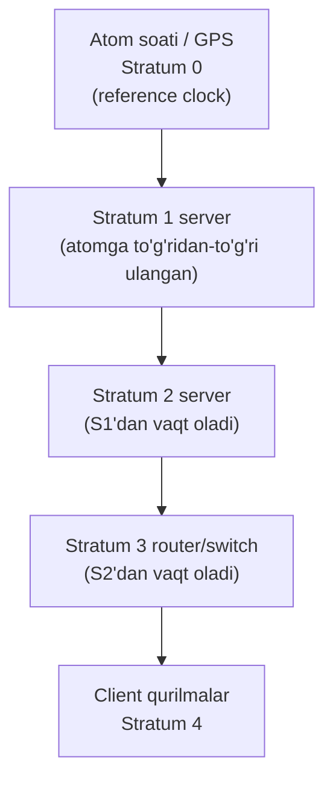
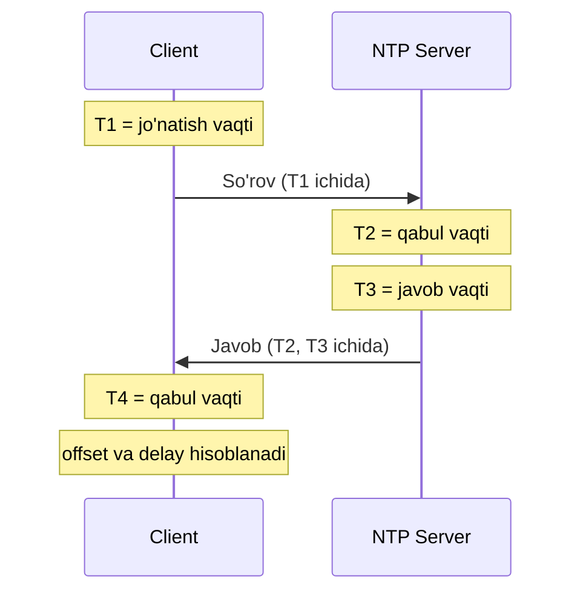
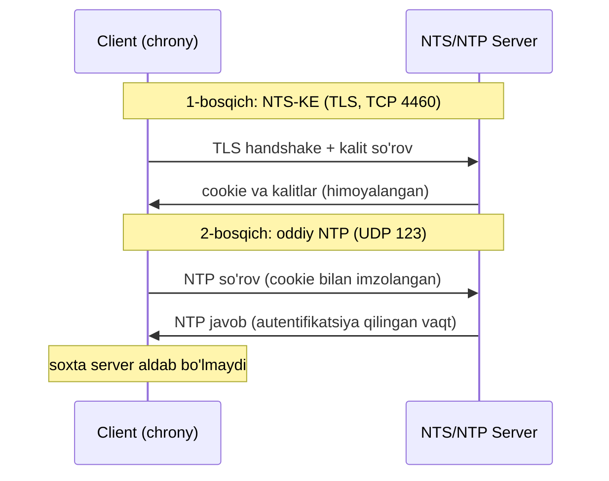

# NTP: qurilma vaqtini sinxronlash (stratum, konfiguratsiya, NTS)

## Muammo: har bir qurilmada vaqt boshqacha

Tunda tarmoqda buzilish bo'ldi. Ertalab uch qurilmaning logiga qaraysan:

```text
Router A:  Mar 1 00:00:12  Interface Gi0/1 down
Switch B:  Jan 5 14:22:47  BGP neighbor lost
Firewall:  Dec 31 09:11:03  Blocked connection
```

Qaysi voqea birinchi bo'ldi? Qaysisi sababchi? **Bilib bo'lmaydi** - chunki har
qurilmaning soati boshqacha. Log vaqtlarini solishtira olmaysan, sabab-oqibat
zanjiri uziladi.

Vaqt xato bo'lganda faqat log emas, ko'p narsa buziladi: TLS sertifikatlar
"amal qilish muddati" bo'yicha rad etiladi, Kerberos autentifikatsiya ishlamaydi,
audit yozuvlariga ishonib bo'lmaydi.

Kerakli narsa: butun tarmoqdagi barcha soatlar **bitta aniq vaqtga** moslashsin.

## Analogiya: orkestr dirijyori

NTP - bu orkestr **dirijyori** kabi.

- 50 ta musiqachi (qurilma) bor, har biri o'z asbobida chaladi.
- Agar har biri o'z tezligida chalsa - kakofoniya (log chalkashligi).
- Dirijyor (NTP server) bitta tempo (aniq vaqt) beradi.
- Musiqachilar dirijyorga qarab o'zini moslaydi - hammasi bir maromda chaladi.

**Analogiya chegarasi:** dirijyor bitta, lekin NTPda ierarxiya bor - dirijyorning
ham "bosh dirijyori" (yuqori stratum manbasi) bo'ladi.

## Sodda ta'rif

> **NTP** (Network Time Protocol) - tarmoqdagi qurilmalar soatini ishonchli vaqt
> manbasiga sinxronlaydigan protocol. UDP porti **123**.

NTP har doim **UTC** (universal vaqt) ni sinxronlaydi. Sizning mahalliy vaqtingiz
(masalan Toshkent) esa **timezone** sozlamasi orqali ko'rsatiladi. Bu ikkisini
aralashtirmaslik muhim.

## Stratum: vaqt ishonchliligi darajasi

**Stratum** - NTP manbasi haqiqiy vaqtga qanchalik yaqinligini bildiradigan
raqam. Kichik raqam = ishonchliroq.



| Stratum | Nima |
|---|---|
| 0 | Atom soati, GPS - haqiqiy vaqt manbasi (tarmoqda emas) |
| 1 | Stratum 0'ga to'g'ridan-to'g'ri ulangan server |
| 2 | Stratum 1'dan vaqt oladi |
| 3-15 | Har biri yuqoridagidan bir pog'ona pastroq |
| 16 | "Sinxron emas" - ishlatib bo'lmaydi |

Har o'tgan pog'onada aniqlik biroz kamayadi. Enterprise'da odatda stratum 2-4
yetarli.

## NTP suhbati qanday ketadi

Client serverdan vaqt so'raydi, lekin shunchaki "hozir soat necha?" emas.
NTP tarmoqdagi **kechikishni** (delay) hisobga oladi, shuning uchun 4 ta vaqt
belgisi almashinadi:



Client shu 4 belgidan **offset** (o'z soati qancha xato) va **delay** (yo'ldagi
kechikish) ni hisoblaydi va soatini sekin-asta to'g'rilaydi. Vaqtni keskin
sakratmaydi (bu boshqa jarayonlarni buzardi), asta-sekin moslaydi.

## Worked example: routerni NTP client qilish

```cisco
! --- 1-qadam: timezone belgilaymiz (Toshkent = UTC+5) ---
conf t
clock timezone UZT 5 0
! --- 2-qadam: NTP serverni ko'rsatamiz ---
ntp server 192.168.100.20
! --- 3-qadam: manba interfeysni belgilaymiz (barqarorlik uchun) ---
ntp source loopback0
end
```

`ntp source loopback0` - routing o'zgarganda ham NTP paketlari bir xil manba
IP'dan chiqadi, bu server tomonda ishonch va ACL uchun barqarorlik beradi.

### Tekshirish buyruqlari

```cisco
show clock detail
show ntp status
show ntp associations
show running-config | include ntp
```

Nima ko'rishing kerak:

```text
R1# show ntp status
Clock is synchronized, stratum 3, reference is 192.168.100.20
```

> `synchronized` so'zi - eng muhim signal. Bo'lmasa, vaqt hali olinmagan.
> `show ntp associations` da server yonida `*` (tanlangan) belgisi paydo bo'lishi
> kerak.

## NTP autentifikatsiya: soxta vaqt manbasidan himoya

Muammo: hujumchi soxta NTP server qo'yib, qurilma vaqtini buzsa - sertifikatlarni
"muddati o'tgan" qilib rad ettirishi yoki log vaqtlarini chalkashtirishi mumkin.
Yechim: client va server **umumiy kalit** (key) ishlatadi, faqat kalitni bilgan
server ishonchli sanaladi.

```cisco
conf t
ntp authenticate
ntp authentication-key 1 md5 CCNA_NTP_KEY
ntp trusted-key 1
ntp server 192.168.100.20 key 1
end
```

## Router NTP server sifatida (lab uchun)

Lab yoki tashqi Internet yo'q yopiq tarmoqda bitta router vaqt manbasi bo'lishi
mumkin:

```cisco
conf t
clock set 10:30:00 21 May 2026
ntp master 5
end
```

`ntp master 5` - router o'zini stratum 5 manbasi deb e'lon qiladi. Productionda
ehtiyot bilan ishlat: tashqi ishonchli manba borida undan foydalanish yaxshiroq.

## Syslog bilan bog'lash

Log vaqtlari aniq chiqishi uchun timestamp'ni yoq:

```cisco
conf t
service timestamps log datetime msec localtime show-timezone
service timestamps debug datetime msec localtime show-timezone
end
```

Endi har log qatorida aniq millisekundgacha vaqt va timezone ko'rinadi - bu
Syslog darsida yig'iladigan loglarni foydali qiladi.

## Predict: nima bo'ladi?

> 🤔 **O'ylab ko'r:** `ntp server` sozlangan, `show ntp associations` da server
> ko'rinadi, lekin `show ntp status` da "unsynchronized" turibdi. Vaqt hali ham
> noto'g'ri. Sabab nima bo'lishi mumkin?

<details>
<summary>💡 Javobni ko'rish</summary>

Bir nechta ehtimol: (1) serverning stratum'i juda yuqori yoki o'zi sinxron emas;
(2) `ntp source` bergansan-u, server tomonda o'sha manba IP'ga qaytish route yo'q,
shuning uchun javob kelmayapti; (3) NTP hali barqarorlashmagan - sinxronlash
bir necha daqiqa vaqt oladi (NTP vaqtni keskin sakratmaydi, asta moslaydi);
(4) UDP 123 ACL/firewall bilan bloklangan.
</details>

## NTS: zamonaviy NTP xavfsizligi (2025-2026)

Klassik NTP autentifikatsiya (MD5 kalit) endi zaif hisoblanadi. Zamonaviy yechim -
**NTS** (Network Time Security).

> **NTS** - NTP'ga TLS asosidagi kriptografik himoya qo'shadigan kengaytma.
> U vaqt ma'lumotini autentifikatsiya qiladi va man-in-the-middle hujumidan
> himoya qiladi.

Qanday ishlaydi: avval **NTS-KE** (Key Establishment) bosqichi TLS orqali
(TCP port 4460) kalitlarni avtomatik yaratadi. Keyin oddiy NTP paketlari shu
kalitlar bilan imzolanadi.



Amaliy holat:

- **chrony** (Linux NTP client) 4.0 versiyasidan NTS'ni qo'llaydi.
- **Ubuntu 25.10+** chrony'ni NTS bilan default yoqadi - katta burilish nuqtasi.
- Xavfsiz default: NTS o'rnatilmasa, chrony vaqtni umuman olmaydi. "Autentifikatsiyasiz
  sinxronlashdan ko'ra, umuman sinxronlamaslik yaxshiroq" tamoyili.

Linux serverda chrony NTS namunasi:

```text
# /etc/chrony/chrony.conf
server time.cloudflare.com iburst nts
```

Muhim cheklov: dunyoda hozircha atigi 60-70 ta ochiq NTS server bor (Cloudflare
shulardan biri). An'anaviy NTP "pool" mexanizmi NTS bilan mos kelmaydi, chunki
har bir server o'z TLS sertifikatini talab qiladi. Bu masalani hal qilish ustida
2025-2027 yillarda ICANN moliyalashtirgan loyiha ishlamoqda.

CCNA darajasida: NTP UDP 123 orqali ishlaydi, MD5 autentifikatsiya asosini bil.
Zamonaviy productionda esa NTS yo'nalishi haqida xabardor bo'l.

## Ko'p uchraydigan xatolar

⚠️ **Xato 1: reachability tekshirmasdan NTPni ayblash.**
NTP ishlamasa avval `ping <ntp-server>` va `show ip route` qil. Ko'pincha
muammo NTP'da emas, oddiy marshrut yo'qligida.

⚠️ **Xato 2: timezone va NTPni aralashtirish.**
NTP UTC'ni sinxronlaydi, timezone faqat ko'rsatishni o'zgartiradi. Vaqt 5 soat
farq qilsa - bu odatda timezone muammosi, NTP emas.

⚠️ **Xato 3: ntp source berib, qaytish route'ini unutish.**
Manba IP'ni loopback qilding-u, server o'sha loopback subnet'iga route bilmasa,
javob qaytmaydi.

⚠️ **Xato 4: labda clock set qilib, reload'dan keyin unutish.**
`clock set` vaqtinchalik. Reload bo'lsa vaqt yana adashadi - shuning uchun
`ntp master` yoki tashqi server kerak.

## Xulosa

- NTP butun tarmoq soatini bitta ishonchli manbaga moslaydi (UDP 123).
- To'g'ri vaqt log, sertifikat, autentifikatsiya va audit uchun hayotiy.
- **Stratum** - vaqt manbasining ishonchlilik darajasi; kichik raqam yaxshiroq.
- Client offset va delay hisoblab, vaqtni keskin emas, asta-sekin to'g'rilaydi.
- NTP UTC'ni sinxronlaydi; mahalliy vaqtni **timezone** ko'rsatadi.
- `ntp master` router'ni lab uchun vaqt manbasi qiladi.
- Zamonaviy xavfsizlik: klassik MD5 emas, **NTS** (TLS asosidagi) yo'nalishda.

## 🧠 Eslab qol

- NTP porti UDP 123, NTS-KE porti TCP 4460.
- Stratum: kichik raqam = manba ishonchliroq. 16 = sinxron emas.
- `show ntp status` da "synchronized" - asosiy signal.
- NTP UTC bilan, timezone alohida ko'rsatish.
- NTS = TLS bilan himoyalangan zamonaviy NTP.

## ✅ O'z-o'zini tekshir (retrieval practice)

**1.** Nega vaqt xato bo'lsa TLS/HTTPS ulanishlar buziladi?

<details>
<summary>Javob</summary>

Sertifikatning "amal qilish muddati" (valid from / valid to) vaqtga bog'liq.
Qurilma soati sertifikat muddatidan tashqarida bo'lsa (masalan 2020 yilga qaytib
qolgan), sertifikatni "hali yaroqsiz" yoki "muddati o'tgan" deb rad etadi.
</details>

**2.** Ikki router bor: biri stratum 2, biri stratum 4. Qaysinisi ishonchliroq
va nega?

<details>
<summary>Javob</summary>

Stratum 2 ishonchliroq. U haqiqiy vaqt manbasiga (stratum 0) yaqinroq - faqat
ikki pog'ona uzoqda. Stratum 4 to'rt pog'ona uzoqda, har pog'onada ozgina
aniqlik yo'qoladi.
</details>

**3.** Router vaqti Toshkentda 5 soat orqada. NTP muammosimi yoki timezone?

<details>
<summary>Javob</summary>

Katta ehtimol timezone. NTP UTC'ni to'g'ri sinxronlagan bo'lishi mumkin, lekin
`clock timezone UZT 5 0` yozilmagani uchun UTC ko'rsatilmoqda (Toshkent UTC+5).
`show clock detail` bilan tekshir.
</details>

**4.** NTS klassik MD5 autentifikatsiyadan qaysi jihati bilan ustun?

<details>
<summary>Javob</summary>

NTS TLS asosida ishlaydi: kalitlar avtomatik va xavfsiz almashinadi (NTS-KE),
zamonaviy kriptografiya ishlatiladi va man-in-the-middle hujumidan himoya qiladi.
MD5 esa qo'lda kalit taqsimlashni talab qiladi va kriptografik jihatdan zaif.
</details>

**5.** `ntp source loopback0` bergansan, lekin sinxron bo'lmayapti. Route jihatidan
nimani tekshirasan?

<details>
<summary>Javob</summary>

NTP server loopback0 subnet'iga qaytish marshrutiga egami? Javob paketi manba
IP'ga (loopback) qaytishi kerak. Route bo'lmasa, so'rov ketadi-yu javob qaytmaydi.
</details>

## 🛠 Amaliyot

**1. Oson (Modify).** Yuqoridagi client konfiguratsiyasiga **ikkinchi** NTP server
(192.168.100.21) ni zaxira sifatida qo'sh va ikkalasiga bir xil timezone qoldir.

<details>
<summary>Hint</summary>

Yana bir qator `ntp server 192.168.100.21`. NTP bir nechta serverdan eng
ishonchlisini o'zi tanlaydi.
</details>

**2. O'rta (faded example).** Skeletni to'ldir - NTP autentifikatsiya bilan
xavfsiz client:

```cisco
conf t
clock timezone UZT 5 0
ntp authenticate
! TODO: key 1 uchun md5 parol belgila
! TODO: key 1 ni ishonchli deb belgila
! TODO: serverni key 1 bilan bog'la
end
```

<details>
<summary>Hint</summary>

`ntp authentication-key 1 md5 <parol>`, `ntp trusted-key 1`,
`ntp server 192.168.100.20 key 1`.
</details>

**3. Qiyin (Make).** Noldan yopiq lab tarmog'i uchun yoz: bitta router (R1)
`ntp master 3` bo'lib vaqt beradi, ikkinchi router (R2) undan vaqt oladi.
Ikkalasida ham to'g'ri timezone va log timestamp bo'lsin. Tekshirish buyruqlarini
ham yoz.

<details>
<summary>Hint</summary>

R1: `clock set ...`, `ntp master 3`. R2: `ntp server <R1-IP>`. Ikkalasi:
`clock timezone`, `service timestamps log datetime msec localtime show-timezone`.
Tekshirish: `show ntp status`, `show ntp associations`.
</details>

## 🔁 Takrorlash

- Bog'liq mavzular: Syslog (keyingi dars) - log vaqtlari NTP'ga bog'liq;
  SSH/sertifikatlar (device management darsi) ham to'g'ri vaqt talab qiladi.
- Takrorlash jadvali:
  - **Ertaga:** stratum nima va nega kichik raqam yaxshi - ayt.
  - **3 kundan keyin:** NTP client konfiguratsiyasini xotiradan yozib chiq.
  - **1 haftadan keyin:** NTS klassik NTP'dan nima bilan farq qiladi - tushuntir.
- **Feynman testi:** NTP'ni buyruq ishlatmasdan 3 jumlada tushuntir: nega barcha
  qurilma vaqti bir xil bo'lishi kerak, stratum nimani anglatadi, va vaqt xato
  bo'lsa qanday muammolar chiqadi?

## 📚 Manbalar

- Network Time Security (NTS) - chrony bilan: https://docs.redhat.com/en/documentation/red_hat_enterprise_linux/10/html/configuring_time_synchronization/overview-of-network-time-security-nts-in-chrony
- Cloudflare NTS time service: https://developers.cloudflare.com/time-services/nts/
- Secure NTP with NTS (Fedora Magazine): https://fedoramagazine.org/secure-ntp-with-nts/
- chrony best practices: https://www.besthub.dev/articles/mastering-linux-server-time-synchronization-with-ntp-and-chrony-best-practices-980e91140a01
