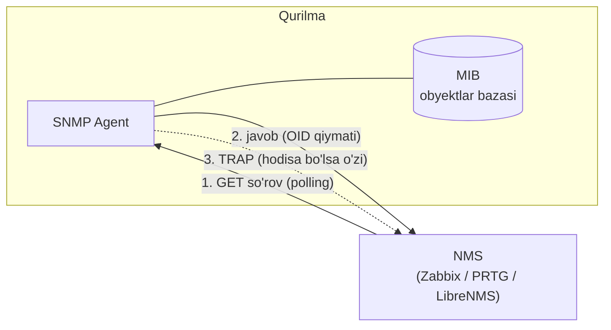
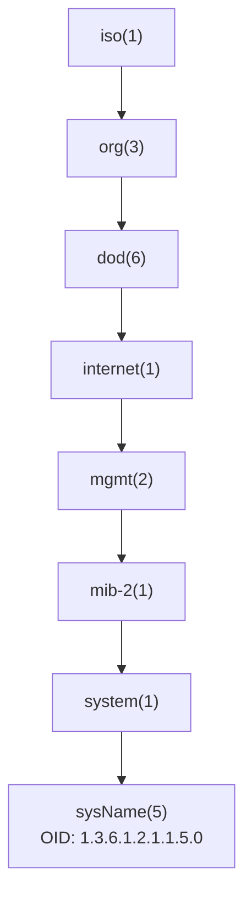
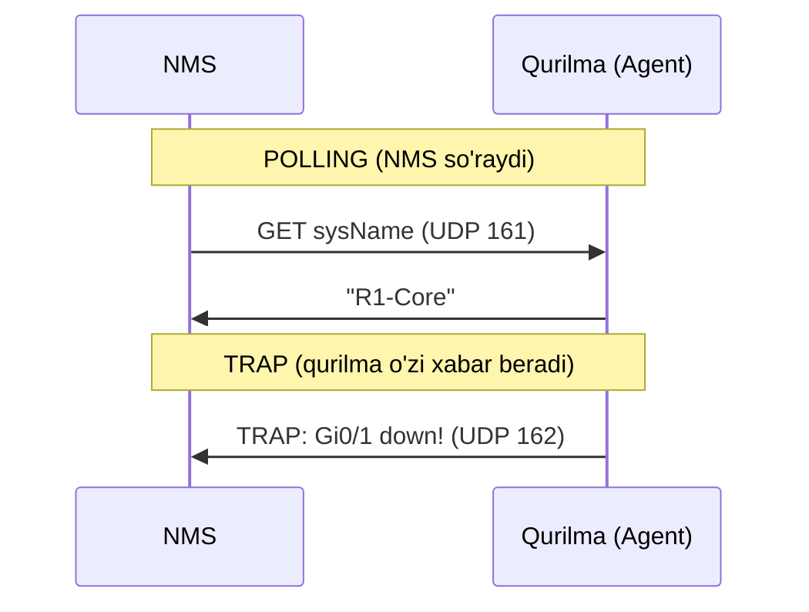

# SNMP: qurilmalarni monitoring qilish (versiyalar, MIB/OID, trap, telemetry)

## Muammo: 200 ta qurilma qanday ishlayotganini qanday bilasan?

Tarmoqda 200 ta router va switch bor. Qaysi biri qizib ketyapti? Qaysi
interfeys 95% band? Qaysi qurilma kecha reload bo'lgan? Har biriga alohida
SSH bilan kirib `show` qilib chiqsang - butun kun ketadi va baribir real vaqtda
kuzatib bo'lmaydi.

Sen uchun kerak: bitta markazdan **avtomatik** ravishda har bir qurilmadan CPU,
xotira, interfeys trafigi, uptime kabi ko'rsatkichlarni yig'ib turadigan tizim.
Muammo bo'lsa, qurilma o'zi darrov xabar bersin.

## Analogiya: kasalxona monitor tizimi

SNMP - bu kasalxonadagi **bemor monitoring tizimi** kabi.

- Har bemorga (qurilmaga) datchik (SNMP agent) ulangan.
- Hamshira posti (NMS - monitoring server) barcha monitorlarni bir ekranda
  ko'radi.
- Hamshira vaqti-vaqti bilan har monitorga qarab qo'yadi - bu **polling**.
- Bemor holati keskin yomonlashsa, monitor **signal beradi** (alarm) - bu **trap**.

**Analogiya chegarasi:** kasalxonada hamshira o'zi qaraydi, SNMPda esa NMS
server soniyalar sayin so'rab turadi va odam faqat muammo chiqqanda aralashadi.

## Sodda ta'rif

> **SNMP** (Simple Network Management Protocol) - router, switch, firewall va
> serverlardan holat ma'lumotini o'qish va hodisa xabarnomalarini olish uchun
> ishlatiladigan protocol.

## SNMP komponentlari



| Komponent | Nima |
|---|---|
| **Managed device** | Kuzatiladigan router/switch |
| **NMS** | Network Management System - monitoring server |
| **Agent** | Qurilma ichidagi SNMP xizmati |
| **MIB** | Management Information Base - o'qish mumkin bo'lgan obyektlar bazasi |
| **OID** | Object Identifier - aniq bir obyekt "manzili" |

### MIB va OID: obyektlar daraxti

MIB - bu qurilma haqidagi barcha o'lchanadigan ko'rsatkichlarning **katalogi**.
OID esa shu katalogdagi aniq bir ko'rsatkichning **raqamli manzili**.



Ya'ni `sysName` (qurilma nomi) ning to'liq OID'i - `1.3.6.1.2.1.1.5.0`.
Bu telefon raqamiga o'xshaydi: har raqam daraxtda bir tarmoqni ko'rsatadi,
oxirida aniq obyektga yetib borasan.

## SNMP versiyalari

| Versiya | Xususiyat | Xavfsizlik | Eslatma |
|---|---|---|---|
| **SNMPv1** | Eski, community string | Yo'q darajasida | Ishlatilmaydi |
| **SNMPv2c** | Tez, community string | Community ochiq matnda ketadi | Ko'p labda uchraydi |
| **SNMPv3** | User, auth, encryption | Eng xavfsiz | Productionda afzal |

**Community string** - bu SNMPv1/v2c'dagi oddiy "parol" (masalan `public`).
Muammosi: u ochiq matnda uzatiladi, tinglagan odam ko'ra oladi. Shuning uchun
v2c faqat ishonchli management tarmoqda va ACL bilan ishlatiladi.

## Polling va Trap: ikki yo'nalish

Bu ikkisi SNMP'ning yuragi:



| | Polling | Trap |
|---|---|---|
| Kim boshlaydi | NMS so'raydi | Qurilma o'zi yuboradi |
| Qachon | Muntazam (masalan 60 sek) | Hodisa sodir bo'lganda |
| Port | UDP 161 (agent'ga) | UDP 162 (NMS'ga) |
| Misol | CPU, trafik grafiklari | Interfeys down, reload |

Ikkalasi birga ishlatiladi: polling doimiy grafik uchun, trap darhol ogohlantirish
uchun.

## Worked example: SNMPv2c (read-only + trap)

```cisco
! --- 1-qadam: faqat monitoring serverga ruxsat (ACL) ---
conf t
access-list 50 permit 192.168.100.50
! --- 2-qadam: read-only community, ACL 50 bilan cheklangan ---
snmp-server community CCNA-RO RO 50
! --- 3-qadam: qurilma haqida qo'shimcha ma'lumot ---
snmp-server location Tashkent-DC-Rack1
snmp-server contact netops@example.local
end
```

Bu yerda **faqat** `192.168.100.50` serveri SNMP o'qiy oladi (ACL 50). `RO`
degani read-only - server hech narsani o'zgartira olmaydi.

Trap yuborishni yoqish:

```cisco
conf t
snmp-server host 192.168.100.50 version 2c CCNA-RO
snmp-server enable traps
end
```

## Worked example: SNMPv3 (xavfsiz)

SNMPv3 uch narsa bilan ishlaydi: **username**, **authentication** (kimligini
tekshirish) va **privacy** (trafikni shifrlash).

```cisco
conf t
! --- 1-qadam: guruh yaratamiz, priv = auth + shifrlash talab ---
snmp-server group NMS-GROUP v3 priv
! --- 2-qadam: user: SHA bilan auth, AES bilan shifrlash ---
snmp-server user nmsuser NMS-GROUP v3 auth sha AuthPass123 priv aes 128 PrivPass123
! --- 3-qadam: trap manzili ---
snmp-server host 192.168.100.50 version 3 priv nmsuser
end
```

Ma'nolari:

| Element | Vazifasi |
|---|---|
| `auth` | Foydalanuvchini tekshiradi (kim ekanini) |
| `priv` | Trafikni shifrlaydi (o'qib bo'lmaydi) |
| `sha` | Authentication algoritmi |
| `aes` | Encryption algoritmi |

SNMPv3'da 3 daraja bor: `noAuthNoPriv` (hech nima), `authNoPriv` (faqat tekshirish),
`authPriv` (tekshirish + shifrlash). Productionda `authPriv` tavsiya etiladi.

### Tekshirish buyruqlari

```cisco
show snmp
show snmp user
show snmp group
show running-config | include snmp
```

NMS serverdan test (Linux):

```bash
snmpwalk -v2c -c CCNA-RO 192.168.1.1 sysName
snmpwalk -v3 -l authPriv -u nmsuser -a SHA -A AuthPass123 -x AES -X PrivPass123 192.168.1.1 sysName
```

## Predict: nima bo'ladi?

> 🤔 **O'ylab ko'r:** Sen `snmp-server host` va `snmp-server community` ni
> to'g'ri yozding, lekin trap NMS'ga umuman kelmayapti. Konfiguratsiyada nima
> yetishmayapti?

<details>
<summary>💡 Javobni ko'rish</summary>

Katta ehtimol `snmp-server enable traps` yozilmagan. `snmp-server host` faqat
"qayerga yuborish" ni aytadi, lekin trap generatsiyasini alohida yoqish kerak.
Yana tekshir: NMS UDP 162 portini eshityaptimi, oradagi ACL/firewall bloklamayaptimi.
</details>

## SNMP va xavfsizlik

- Community string'ni **parol** kabi ko'r - hech kimga aytma.
- `public` va `private` (default community'lar) dan foydalanma.
- SNMP'ni management VLAN va ACL bilan chekla.
- Imkon bo'lsa **SNMPv3** ishlat.
- SNMP Internet tomondan hech qachon ochiq qolmasin.

## Zamonaviy holat: SNMP'dan telemetry'ga (2025-2026)

SNMP 30 yildan ortiq ishlatilyapti, lekin katta zamonaviy tarmoqlarda kamchiligi
bor: u **pull** modeli - NMS har safar so'rab olishi kerak, bu kechikish beradi
va qurilma hamda NMS resursini yeydi.

Yangi yondashuv - **streaming telemetry** (**gNMI** + OpenConfig):

> **gNMI** - qurilma ma'lumotni o'zi, **push** qilib, doimiy oqim (stream)
> ko'rinishida NMS'ga yuboradigan zamonaviy protokol.

| Xususiyat | SNMP | Streaming telemetry (gNMI) |
|---|---|---|
| Model | Pull (NMS so'raydi) | Push (qurilma o'zi yuboradi) |
| Aniqlik | Sekundlar (polling oraliq) | Millisekundlar |
| Format | ASN.1/BER | Protobuf (gRPC over HTTP/2) |
| Ma'lumot modeli | MIB/OID | YANG / OpenConfig (vendor-neutral) |
| Yuk | Katta tarmoqda og'ir | Yengil, "on change" yuboradi |

Vendor holati: Cisco (model-driven telemetry), Juniper, Arista gNMI'ni qo'llaydi.
Lekin **SNMP hali o'lgani yo'q**: eski qurilmalar va statik ma'lumot (inventar,
qo'shni qurilmalar ro'yxati) uchun u hamon standart bo'lib qolmoqda. Amaliyotda
ko'p tarmoqlar ikkalasidan foydalanadi.

CCNA darajasida: SNMPv2c/v3, MIB/OID, polling vs trap'ni yaxshi bil. Karyera
o'sishi uchun telemetry/gNMI yo'nalishidan xabardor bo'l.

## Ko'p uchraydigan xatolar

⚠️ **Xato 1: community'ni ACLsiz ochib qo'yish.**
`snmp-server community CCNA-RO RO` (ACLsiz) yozsang, xohlagan kishi o'qiy oladi.
Har doim ACL bilan chekla.

⚠️ **Xato 2: SNMPv3 auth/priv darajalarini aralashtirish.**
Server `authPriv` kutadi, qurilma `authNoPriv` sozlangan bo'lsa ulanmaydi.
`show snmp user` bilan tekshir.

⚠️ **Xato 3: NMS IP o'zgarganda ACLni yangilamaslik.**
Monitoring server IP'si o'zgardi, lekin ACL 50 hali eski IP'ni ruxsat beryapti -
NMS qurilmani o'qiy olmay qoladi.

⚠️ **Xato 4: enable traps'ni unutish.**
`snmp-server host` yozildi-yu, `snmp-server enable traps` unutildi - trap kelmaydi.

## Xulosa

- SNMP markazdan qurilmalar holatini monitoring qilishga imkon beradi.
- Komponentlar: managed device, agent, NMS, MIB, OID.
- MIB - obyektlar katalogi, OID - aniq obyekt raqamli manzili.
- Versiyalar: v1 (eski), v2c (community, ochiq), v3 (auth+encryption, xavfsiz).
- **Polling** - NMS so'raydi (UDP 161); **Trap** - qurilma o'zi xabar beradi (UDP 162).
- Xavfsizlik: SNMPv3, ACL, management VLAN, default community'lardan qochish.
- Zamonaviy yo'nalish: **streaming telemetry (gNMI)** - push, real vaqt, YANG modeli.

## 🧠 Eslab qol

- MIB = katalog, OID = aniq obyekt manzili (masalan sysName = 1.3.6.1.2.1.1.5.0).
- Polling UDP 161 (agent), Trap UDP 162 (NMS).
- SNMPv3: auth = tekshirish, priv = shifrlash.
- v2c community ochiq matnda ketadi - ACL shart.
- gNMI = push, real vaqt, SNMP'ning zamonaviy o'rinbosari.

## ✅ O'z-o'zini tekshir (retrieval practice)

**1.** Polling va trap farqi nima va nega ikkalasi ham kerak?

<details>
<summary>Javob</summary>

Polling - NMS muntazam so'raydi (grafik, trend uchun). Trap - qurilma hodisa
sodir bo'lganda o'zi darrov xabar beradi (darhol ogohlantirish uchun). Faqat
polling bo'lsa, hodisa keyingi so'rovgacha bilinmay qoladi; faqat trap bo'lsa,
doimiy trend ma'lumoti bo'lmaydi. Ikkalasi bir-birini to'ldiradi.
</details>

**2.** Nega SNMPv2c faqat management tarmoqda va ACL bilan ishlatiladi?

<details>
<summary>Javob</summary>

Chunki community string ochiq matnda uzatiladi - kim tinglasa ko'radi va o'sha
community bilan qurilmani o'qiy oladi. ACL faqat ishonchli NMS IP'siga ruxsat
berib, xavfni kamaytiradi.
</details>

**3.** SNMPv3'da `priv` bo'lmasa (faqat `authNoPriv`) qanday xavf qoladi?

<details>
<summary>Javob</summary>

Foydalanuvchi tekshiriladi (auth), lekin trafik shifrlanmaydi. Ya'ni tinglagan
odam SNMP ma'lumotlarini (masalan konfiguratsiya, holatni) ochiq ko'ra oladi -
faqat o'zgartira olmaydi. To'liq himoya uchun `authPriv` kerak.
</details>

**4.** gNMI SNMP'dan qaysi asosiy jihat bilan farq qiladi?

<details>
<summary>Javob</summary>

gNMI push modeli - qurilma ma'lumotni o'zi doimiy oqim ko'rinishida yuboradi
(millisekund aniqlikda), SNMP esa pull - NMS har safar so'rashi kerak. gNMI YANG/
OpenConfig modeli va Protobuf formatidan foydalanadi, katta tarmoqlarda yengilroq.
</details>

**5.** `show snmp` da hech qanday trap statistikasi ko'rinmayapti, garchi
`snmp-server host` yozilgan. Nimani unutgan bo'lishing mumkin?

<details>
<summary>Javob</summary>

`snmp-server enable traps` - trap generatsiyasini yoqishni. Faqat `host` yozish
"qayerga yuborishni" belgilaydi, lekin trap'larni yoqmaydi.
</details>

## 🛠 Amaliyot

**1. Oson (Modify).** Yuqoridagi SNMPv2c misolida ACL'ni ikkinchi monitoring
server (192.168.100.51) ni ham qo'shadigan qilib kengaytir.

<details>
<summary>Hint</summary>

`access-list 50 permit 192.168.100.51` qatorini qo'sh. ACL 50'ga ikki host
ruxsat etiladi.
</details>

**2. O'rta (faded example).** SNMPv3 skeletini to'ldir - SHA auth va AES shifrlash
bilan:

```cisco
conf t
snmp-server group SECURE-GRP v3 priv
! TODO: monuser degan user yarat, SHA + AES 128 bilan
! TODO: trap host 192.168.100.50 ga version 3 priv bilan
end
```

<details>
<summary>Hint</summary>

`snmp-server user monuser SECURE-GRP v3 auth sha <parol> priv aes 128 <parol>`;
`snmp-server host 192.168.100.50 version 3 priv monuser`.
</details>

**3. Qiyin (Make).** Noldan xavfsiz SNMP sozla: SNMPv3 authPriv, faqat NMS
(192.168.100.50) o'qiy olsin, location va contact bo'lsin, interfeys down/up
trap'lari yoqilsin. Tekshirish buyruqlarini ham yoz.

<details>
<summary>Hint</summary>

Kerak: `snmp-server group`, `snmp-server user` (auth sha + priv aes),
`snmp-server host ... version 3 priv`, `snmp-server enable traps`,
`snmp-server location`, `snmp-server contact`. Tekshirish: `show snmp user`,
`show snmp group`, `show snmp`.
</details>

## 🔁 Takrorlash

- Bog'liq mavzular: NTP (oldingi dars) - trap vaqtlari to'g'ri bo'lishi uchun;
  Syslog (keyingi dars) - loglar va trap'lar birga monitoring rasmini beradi;
  ACL asoslari (routing/security modullaridan).
- Takrorlash jadvali:
  - **Ertaga:** polling va trap portlari (161/162) va farqini ayt.
  - **3 kundan keyin:** SNMPv3 auth va priv nima qilishini tushuntir.
  - **1 haftadan keyin:** gNMI/telemetry SNMP'dan nima bilan afzal - ayt.
- **Feynman testi:** SNMP'ni buyruq ishlatmasdan 3 jumlada tushuntir: NMS qurilma
  holatini qanday biladi, trap qachon yuboriladi, va nega v3 v2c'dan xavfsizroq?

## 📚 Manbalar

- SNMP vs streaming telemetry (Kentik): https://www.kentik.com/kentipedia/snmp-vs-streaming-telemetry/
- Why you should use gNMI over SNMP: https://kmcd.dev/posts/gnmi/
- SNMP to streaming telemetry (WWT): https://www.wwt.com/blog/modernizing-network-and-infrastructure-observability-snmp-to-streaming-telemetry
- Network management protocol evolution (SNMP, NETCONF, gNMI): https://plvision.eu/blog/networking/from-snmp-to-gnmi-how-network-management-protocols-are-being-rewritten-for-the-ai-era
