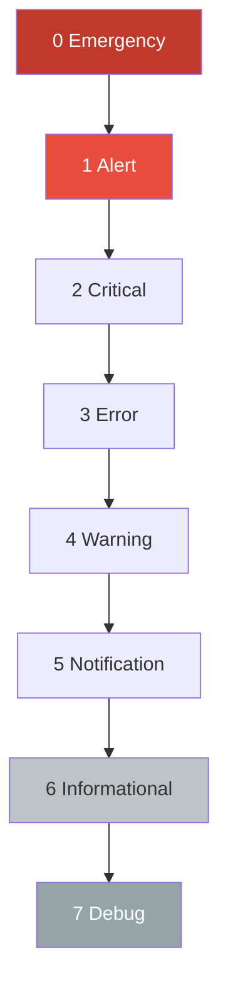
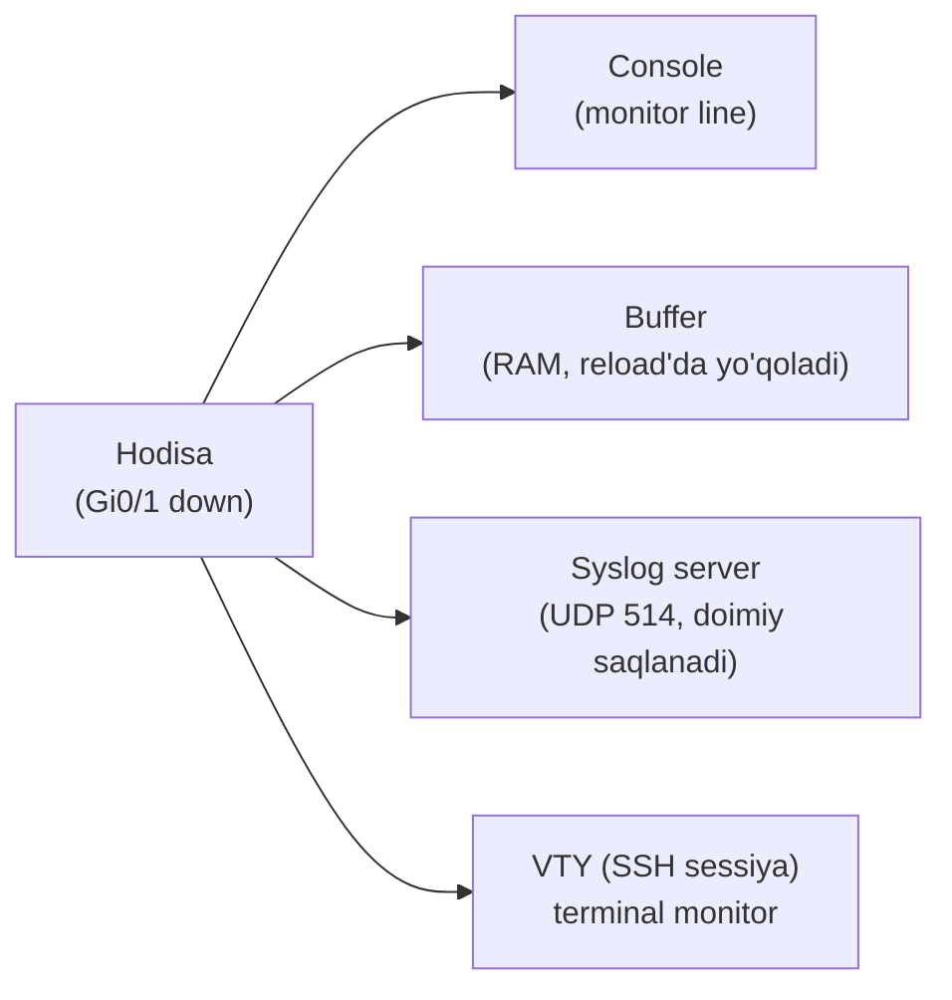
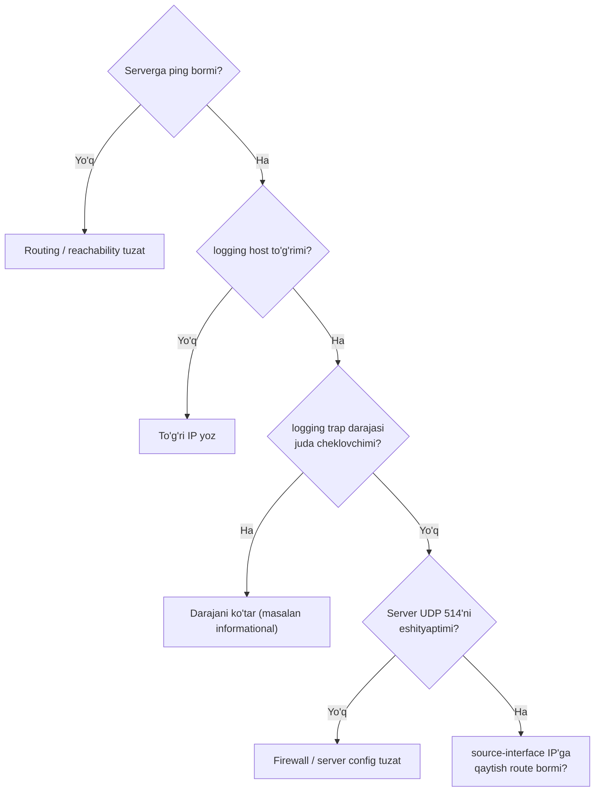
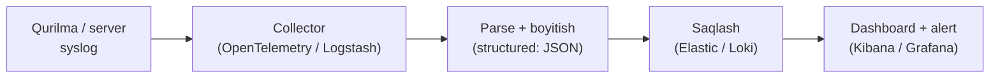

# Syslog: loglarni markazlashgan yig'ish (severity, facility, pipeline)

## Muammo: log qurilmada qoladi, qurilma o'chsa - yo'qoladi

Router yarim tunda reload bo'ldi. Nega? Loglarda javob bor edi - lekin ular
faqat qurilma xotirasida (buffer) turadi va reload'da **o'chib ketdi**. Endi
sababni bilib bo'lmaydi.

Boshqa muammo: 200 ta qurilma bor, har birida o'z logi. Bitta hodisani tekshirish
uchun 200 qurilmaga alohida kirib log ko'rish - imkonsiz. Xakerlik bo'lsa,
hujumchi birinchi ish - qurilmadagi logni o'chirib, izini yashiradi.

Kerakli narsa: har bir qurilma loglarni **darrov tashqi markaziy serverga**
yuborib tursin. Shunda loglar qurilmadan mustaqil saqlanadi va bir joyda
tahlil qilinadi.

## Analogiya: qora quti (flight recorder)

Syslog - bu samolyotdagi **qora quti** kabi.

- Samolyot (qurilma) har lahzada nima bo'layotganini yozib boradi.
- Yozuvlar samolyotning o'zida emas, mustahkam alohida qurilmada saqlanadi
  (markaziy syslog server).
- Halokat (buzilish) bo'lsa, tergovchilar shu yozuvlardan sababni topadi.
- Har yozuvda aniq **vaqt** bor - shuning uchun voqealar ketma-ketligi tiklanadi.

**Analogiya chegarasi:** qora quti bitta samolyotniki, syslog server esa yuzlab
qurilmaning loglarini bir joyga yig'adi.

## Sodda ta'rif

> **Syslog** - qurilma hodisalarini (interfeys up/down, login urinishi,
> konfiguratsiya o'zgarishi) yozib, ularni markaziy serverga yuboradigan
> standart logging protokoli. Odatda **UDP 514** porti.

## Syslog xabar tuzilishi

Cisco log namunasi:

```text
May 21 10:12:33.456 UZT: %LINK-3-UPDOWN: Interface GigabitEthernet0/1, changed state to up
```

Uni bo'laklarga ajratsak:

| Qism | Qiymat | Ma'no |
|---|---|---|
| Vaqt | `May 21 10:12:33.456 UZT` | Qachon sodir bo'lgani (NTP muhim!) |
| Facility | `%LINK` | Log manbasi (qaysi quyi tizim) |
| Severity | `3` | Muhimlik darajasi (0-7) |
| Mnemonic | `UPDOWN` | Hodisa turi |
| Matn | `Interface Gi0/1...` | Tafsilot |

## Severity darajalari: 0 dan 7 gacha

Bu jadval CCNA'da yodlanadi. **Eslatuvchi ibora:** *Every Awesome Cisco Engineer
Will Need Ice-cream Daily* (Emergency, Alert, Critical, Error, Warning,
Notification, Informational, Debug).

| Raqam | Nomi | Ma'nosi |
|---|---|---|
| 0 | Emergency | Tizim ishlamay qolgan |
| 1 | Alert | Zudlik bilan e'tibor kerak |
| 2 | Critical | Kritik xatolik |
| 3 | Error | Xatolik |
| 4 | Warning | Ogohlantirish |
| 5 | Notification | Muhim odatiy hodisa |
| 6 | Informational | Ma'lumot |
| 7 | Debug | Juda batafsil debug |

> **Muhim qoida:** kichik raqam = muhimroq. `logging trap 5` desang, serverga
> **0 dan 5 gacha** (ya'ni 5 va undan muhimroq) loglar yuboriladi. 6 va 7
> yuborilmaydi.



Yuqoridan pastga: eng jiddiydan eng batafsilgacha.

## Loglar qayerga borishi mumkin

Bitta log qatori bir vaqtning o'zida bir necha joyga ketishi mumkin:



Eng ishonchli joy - **tashqi syslog server**, chunki u qurilma reload/o'chsa
ham loglarni saqlab qoladi.

## Worked example: markaziy syslog

```cisco
! --- 1-qadam: har logga aniq vaqt tamg'asi (NTP bilan birga muhim) ---
conf t
service timestamps log datetime msec localtime show-timezone
! --- 2-qadam: markaziy syslog server manzili ---
logging host 192.168.100.60
! --- 3-qadam: qaysi darajagacha yuborish (informational = 6, ya'ni 0-6) ---
logging trap informational
! --- 4-qadam: barqaror manba IP (ACL va ishonch uchun) ---
logging source-interface loopback0
end
```

`logging trap informational` = severity 6 = 0 dan 6 gacha. Debug (7) yuborilmaydi.

Console spamini kamaytirish (ayniqsa productionda foydali):

```cisco
conf t
no logging console
logging buffered 16384 informational
end
```

`logging buffered` - loglarni qurilma RAM'ida ham saqlaydi (`show logging`
bilan ko'rasan), lekin bu reload'da yo'qoladi - shuning uchun tashqi server ham
kerak.

### VTY login loglari

Kim kirmoqchi bo'lganini ko'rish (xavfsizlik audit uchun):

```cisco
conf t
login on-failure log
login on-success log
end
```

### Tekshirish buyruqlari

```cisco
show logging
show running-config | include logging
show clock detail
ping 192.168.100.60
```

`show logging` boshida sozlamalar (host, trap darajasi), keyin bufferdagi
loglarni ko'rsatadi.

## Troubleshooting tartibi

Loglar serverga yetmayapti? Bu ketma-ketlikda tekshir:



## Predict: nima bo'ladi?

> 🤔 **O'ylab ko'r:** Sen `logging trap errors` (severity 3) qo'yding va
> interfeys down/up (severity 3) va oddiy hodisalarni (severity 5-6) syslog
> serverida kutyapsan. Nima ko'rasan?

<details>
<summary>💡 Javobni ko'rish</summary>

Faqat 0-3 darajali loglar (Emergency dan Error gacha) keladi. Interfeys UPDOWN
(severity 3) ko'rinadi, lekin severity 5-6 hodisalar (masalan konfiguratsiya
o'zgarishi, oddiy notification'lar) **kelmaydi** - chunki ular 3'dan yuqori
(ahamiyatsizroq) raqamda. Ularni ham kutyapsan degan taxming noto'g'ri edi.
Yechim: `logging trap informational` (6).
</details>

## Zamonaviy log pipeline (2025-2026)

An'anaviy syslog - matn qatorlarini serverga yuborish. Zamonaviy tizimlarda
loglar keyingi bosqichga o'tdi: **structured logging** va **observability**.



Asosiy g'oyalar:

- **Structured logging** - log oddiy matn emas, maydonlarga bo'lingan (JSON/
  RFC 5424). Bu qidirish va filtrlashni tezlashtiradi.
- **OpenTelemetry (OTel)** - loglar, metrikalar va trace'larni bitta standartda
  yig'ish; sanoat standarti bo'lib bormoqda.
- **Grafana Loki** - butun log matnini emas, faqat "label"larni indekslaydi,
  shuning uchun saqlash arzon.
- **ELK Stack** (Elasticsearch, Logstash, Kibana) - keng tarqalgan yechim;
  Elasticsearch tez to'liq matn qidiruvi beradi.
- **Korrelatsiya:** loglarga trace ID qo'shilsa, log va so'rovlarni bog'lab,
  distributed tizimlarda muammoni tezroq topish mumkin.

CCNA darajasida: severity 0-7, facility, `logging host/trap` ni bil. Zamonaviy
DevOps/SRE dunyosida esa loglar ana shu pipeline orqali observability'ning bir
qismiga aylanadi.

## Ko'p uchraydigan xatolar

⚠️ **Xato 1: NTP sozlamasdan loglarga ishonish.**
Vaqt noto'g'ri bo'lsa, log vaqtlari xato - voqealar ketma-ketligini tiklab
bo'lmaydi. NTP'ni **avval** sozla.

⚠️ **Xato 2: trap darajasini xato tanlash.**
`logging trap errors` (3) qo'yib, informational (6) hodisalarni kutish - ular
kelmaydi. Darajani ehtiyojga qarab tanla.

⚠️ **Xato 3: server UDP 514'ni bloklashi.**
Qurilma to'g'ri yuboryapti, lekin server firewall'i yoki config UDP 514'ni
qabul qilmayapti.

⚠️ **Xato 4: source-interface berib, qaytish route'ini unutish.**
`logging source-interface loopback0` desang, serverda o'sha loopback IP'ga
qaytish route bo'lishi shart (aslida syslog UDP bir tomonlama, lekin ba'zi
diagnostika va reverse aloqa uchun muhim).

⚠️ **Xato 5: debug'ni doimiy yoqib qo'yish.**
Severity 7 (debug) CPU va xotiraga og'ir yuk beradi. Faqat troubleshooting
paytida yoq, keyin o'chir.

## Xulosa

- Syslog qurilma hodisalarini yozib, markaziy serverga yuboradi (UDP 514).
- Log tuzilishi: vaqt, facility, severity, mnemonic, matn.
- Severity 0-7: kichik raqam muhimroq (0 Emergency ... 7 Debug).
- `logging trap X` = 0'dan X gacha yuboradi.
- Loglar console, buffer (RAM, o'chuvchan) va tashqi serverga borishi mumkin.
- To'g'ri log vaqti uchun **NTP shart**.
- Zamonaviy pipeline: structured logging + OpenTelemetry + Loki/ELK + dashboard.

## 🧠 Eslab qol

- Syslog porti UDP 514.
- Severity: 0 Emergency ... 7 Debug; kichik raqam muhimroq.
- `logging trap 5` = 0-5 yuboriladi, 6-7 emas.
- Buffer reload'da yo'qoladi - tashqi server ishonchli.
- NTP bo'lmasa log vaqtlariga ishonib bo'lmaydi.

## ✅ O'z-o'zini tekshir (retrieval practice)

**1.** `logging trap warning` (severity 4) qo'yilgan. Interfeys down (severity 3)
va debug (severity 7) hodisalari serverga boradimi?

<details>
<summary>Javob</summary>

Interfeys down (3) - ha, boradi (3 <= 4). Debug (7) - yo'q, bormaydi (7 > 4).
Trap darajasi 4 desak, faqat 0-4 yuboriladi.
</details>

**2.** Nega loglarni faqat qurilma bufferida saqlash yetarli emas?

<details>
<summary>Javob</summary>

Buffer RAM'da, reload yoki o'chganda yo'qoladi. Bundan tashqari hujumchi qurilmaga
kirsa logni o'chirib izini yashirishi mumkin. Tashqi markaziy server loglarni
qurilmadan mustaqil, doimiy saqlaydi.
</details>

**3.** Log vaqtlari noto'g'ri chiqyapti. Syslog konfiguratsiyasida muammomi?

<details>
<summary>Javob</summary>

Odatda yo'q - bu NTP muammosi. Syslog vaqtni qurilma soatidan oladi. Qurilma
soati (NTP) noto'g'ri bo'lsa, log vaqti ham noto'g'ri. `service timestamps log
datetime` yoqilganini va NTP sinxronligini tekshir.
</details>

**4.** `logging buffered` va `logging host` farqi nima?

<details>
<summary>Javob</summary>

`logging buffered` loglarni qurilmaning o'z RAM'ida saqlaydi (`show logging`
bilan ko'riladi, reload'da yo'qoladi). `logging host` esa loglarni tashqi
syslog serverga yuboradi (doimiy saqlanadi).
</details>

**5.** Zamonaviy structured logging an'anaviy matn logidan nima bilan afzal?

<details>
<summary>Javob</summary>

Structured log maydonlarga bo'lingan (JSON/RFC 5424), shuning uchun qidirish,
filtrlash va avtomatik tahlil ancha oson va tez. Matn logni har safar parse
qilish kerak, structured'da esa maydonlar tayyor. Bu observability pipeline'da
loglarni metrik va trace bilan bog'lashni ham osonlashtiradi.
</details>

## 🛠 Amaliyot

**1. Oson (Modify).** Yuqoridagi konfiguratsiyada trap darajasini `warning` (4)
ga o'zgartir va nima farq qilishini izohla.

<details>
<summary>Hint</summary>

`logging trap warning`. Endi faqat 0-4 yuboriladi; notification (5), informational
(6), debug (7) yuborilmaydi - kamroq log, faqat muhimroqlari.
</details>

**2. O'rta (faded example).** Skeletni to'ldir - ikkita syslog serverga (asosiy
va zaxira) yuborish va login urinishlarini loglash:

```cisco
conf t
service timestamps log datetime msec localtime show-timezone
! TODO: birinchi syslog server 192.168.100.60
! TODO: ikkinchi syslog server 192.168.100.61
logging trap informational
! TODO: muvaffaqiyatsiz login urinishlarini logla
! TODO: muvaffaqiyatli login'larni logla
end
```

<details>
<summary>Hint</summary>

Ikki `logging host` qatori (60 va 61); `login on-failure log`; `login on-success
log`.
</details>

**3. Qiyin (Make).** Noldan yoz: qurilma NTP bilan sinxron (vaqt to'g'ri),
loglar aniq millisekundgacha vaqt bilan markaziy serverga (10.0.0.60) informational
darajada yuborilsin, console spam o'chirilsin, buffer 32 KB. Tekshirish buyruqlarini
ham yoz.

<details>
<summary>Hint</summary>

Kerak: `service timestamps log datetime msec localtime show-timezone`, `logging
host 10.0.0.60`, `logging trap informational`, `no logging console`, `logging
buffered 32768 informational`. Tekshirish: `show logging`, `show clock detail`,
`ping 10.0.0.60`.
</details>

## 🔁 Takrorlash

- Bog'liq mavzular: NTP (oldingi dars) - log vaqtlari uchun hayotiy; SNMP
  (oldingi dars) - trap va syslog birga monitoring rasmini beradi.
- Takrorlash jadvali:
  - **Ertaga:** severity 0-7 ni tartib bilan xotiradan ayt.
  - **3 kundan keyin:** `logging trap 5` nima yuboradi, nima yubormaydi - tushuntir.
  - **1 haftadan keyin:** zamonaviy log pipeline bosqichlarini (collector -> parse
    -> store -> dashboard) ayt.
- **Feynman testi:** Syslog'ni buyruq ishlatmasdan 3 jumlada tushuntir: nega
  loglarni tashqi serverga yuborish kerak, severity raqami nimani anglatadi,
  va log vaqti nega NTP'ga bog'liq?

## 📚 Manbalar

- OpenTelemetry Logging spetsifikatsiyasi: https://opentelemetry.io/docs/specs/otel/logs/
- Getting more from your logs with OpenTelemetry (Elastic): https://www.elastic.co/observability-labs/blog/getting-more-from-your-logs-with-opentelemetry
- What Is Grafana Loki - log aggregation: https://middleware.io/blog/grafana-loki/
- Best open source log management tools: https://signoz.io/blog/best-open-source-log-management-tools/
