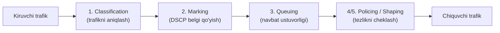
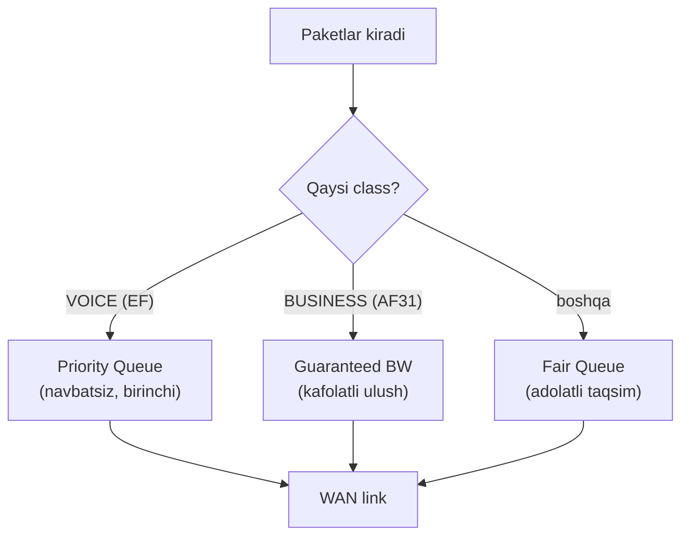
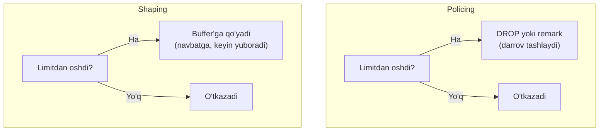

# QoS: muhim trafikni ustuvor qilish (classification, marking, queuing, policing/shaping)

## Muammo: hamma trafik teng bo'lsa, qo'ng'iroq uziladi

WAN linkida bir vaqtning o'zida: xodim katta fayl yuklamoqda, boshqasi video
qo'ng'iroqda, uchinchisi email yuboryapti. Link to'lib ketdi. Nima bo'ladi?

Router hammasiga bir xil qaraydi - "birinchi kelgan, birinchi ketadi". Natijada
ovozli qo'ng'iroq paketlari fayl paketlari orasida navbatda turib qoladi, kechikadi
va **qo'ng'iroq uziladi** yoki "robot ovozi" bo'ladi. Vaholanki, fayl yuklanishi
0.5 sekund kechiksa hech kim sezmaydi ham.

Muammo: **hamma trafik teng emas.** Ovoz kechikishga o'ta sezgir, fayl esa
sabrli. Router buni bilmasa - muhim trafik zarar ko'radi.

## Analogiya: kasalxona qabulxonasi (triage)

QoS - bu shifoxona **navbat tartiblash (triage)** tizimi kabi.

- Hamma bemor bir navbatda kelib turmaydi.
- Hamshira avval **saralaydi** (classification): kim jiddiy, kim yengil.
- Har biriga **belgi** qo'yiladi (marking): qizil (shoshilinch), sariq, yashil.
- Yurak xurujidagi bemor (ovoz trafigi) navbatsiz kiritiladi (priority queue).
- Yengil shamollagan (fayl) biroz kutadi - unga zarari yo'q.

**Muhim:** triage ko'proq shifokor yaratmaydi (bandwidth qo'shmaydi). U mavjud
shifokorlarni **to'g'ri taqsimlaydi**.

**Analogiya chegarasi:** triage'da bemor bir marta saralanadi; tarmoqda esa
har router qayta baholashi mumkin, shuning uchun belgi (marking) ni butun yo'l
bo'ylab "ishonish" (trust) kerak.

## Sodda ta'rif

> **QoS** (Quality of Service) - cheklangan bandwidth'ni muhim trafikka ustuvorlik
> berib taqsimlaydigan mexanizmlar to'plami.

> **Eng muhim qoida:** QoS bandwidth **yaratmaydi**. U mavjud bandwidth'ni
> tartibli taqsimlaydi. Internetni tezlashtirmaydi.

## QoS jarayoni: 5 bosqich



| Bosqich | Nima qiladi |
|---|---|
| **Classification** | Trafik turini aniqlaydi (ovoz? video? oddiy?) |
| **Marking** | Paketga belgi (DSCP) qo'yadi |
| **Queuing** | Navbatda ustuvorlik beradi |
| **Policing** | Limitdan oshgan trafikni drop/remark qiladi |
| **Shaping** | Trafikni silliqlab, belgilangan tezlikda yuboradi |

## 1. Classification: trafikni tanib olish

Trafikni ACL, protocol, DSCP yoki interfeys bo'yicha ajratamiz. Cisco'da buni
**class-map** qiladi.

```cisco
! --- ovoz RTP portlarini ACL bilan aniqlaymiz ---
conf t
access-list 101 permit udp any any range 16384 32767
class-map match-any VOICE-RTP
 match access-group 101
end
```

Yoki mavjud DSCP belgisi bo'yicha:

```cisco
class-map match-any VOICE
 match dscp ef
```

## 2. Marking: DSCP belgisi

**DSCP** (Differentiated Services Code Point) - IP header ichidagi 6 bitli
belgi. Har router shu belgiga qarab trafikga qanday munosabatda bo'lishni biladi.

Zamonaviy standart DSCP qiymatlari (2025 best practice):

| Trafik turi | DSCP | Decimal | Izoh |
|---|---|---|---|
| Ovoz (RTP) | EF | 46 | Expedited Forwarding - eng ustuvor |
| Ovoz signaling (SIP) | CS3 | 24 | Qo'ng'iroq o'rnatish |
| Video | AF41 | 34 | Interaktiv video |
| Muhim biznes | AF31 | 26 | Muhim ilovalar |
| Oddiy | Default (BE) | 0 | Best Effort |

```cisco
conf t
class-map match-any VOICE-RTP
 match access-group 101
policy-map MARK-VOICE
 class VOICE-RTP
  set dscp ef
 class class-default
  set dscp default
interface gigabitEthernet0/0
 service-policy input MARK-VOICE
end
```

> **Trust boundary (ishonch chegarasi):** marking trafik tarmoqqa **kirgan
> joyda** (access edge) qilinishi kerak - IP telefon yoki access switch'da.
> Chunki foydalanuvchi kompyuteri o'zini "ovoz" deb belgilab, tizimni aldashi
> mumkin. Ishonch chegarasidan tashqarida belgiga ishonmaymiz.

## 3. Queuing: navbatda kim oldin

Link band bo'lganda paketlar navbatga turadi. **LLQ** (Low Latency Queueing)
ovoz kabi kechikishga sezgir trafikka **priority queue** (navbatsiz o'tish)
beradi.



```cisco
conf t
class-map match-any VOICE
 match dscp ef
class-map match-any BUSINESS
 match dscp af31
policy-map WAN-OUT
 class VOICE
  priority percent 20
 class BUSINESS
  bandwidth percent 30
 class class-default
  fair-queue
interface serial0/0/0
 service-policy output WAN-OUT
end
```

> **Ehtiyot:** `priority` (ovoz) ga juda katta foiz bersang, boshqa trafik
> **och qoladi** (starvation). Best practice: ovozga link'ning 33% dan oshirma -
> shunda qolgan trafikga ham joy qoladi.

## 4 va 5. Policing va Shaping

Ikkalasi ham tezlikni cheklaydi, lekin usuli boshqacha:



**Policing** - limitdan oshgan paketni darrov drop qiladi (keskin):

```cisco
conf t
policy-map POLICE-GUEST
 class class-default
  police 10000000 conform-action transmit exceed-action drop
interface gigabitEthernet0/1
 service-policy input POLICE-GUEST
end
```

Bu misolda guest trafik 10 Mbps bilan cheklanadi, oshgani tashlanadi.

**Shaping** - oshgan paketni navbatga qo'yib, keyin yuboradi (silliq):

```cisco
conf t
policy-map SHAPE-WAN
 class class-default
  shape average 50000000
interface gigabitEthernet0/1
 service-policy output SHAPE-WAN
end
```

Bu misolda chiqish trafik 50 Mbps atrofida shakllantiriladi.

### Policing va shaping farqi

| Xususiyat | Policing | Shaping |
|---|---|---|
| Oshgan trafikka | Drop/remark qiladi | Navbatga qo'yadi (buffer) |
| Yo'nalish | Ko'pincha input | Ko'pincha output |
| Natija | Keskinroq (jitter ko'p) | Silliqroq |
| Qo'llanish | Trafikni cheklash | Provider tezligiga moslash |

**Qachon shaping?** Provider link tezligi (masalan 50 Mbps) physical interfeys
tezligidan (1 Gbps) past bo'lsa. Interfeys 1 Gbps yuborsa, provider ortiqchasini
tashlaydi - shuning uchun o'zimiz 50 Mbps'ga shape qilamiz.

## Tekshirish buyruqlari

```cisco
show policy-map
show policy-map interface
show class-map
show running-config | section policy-map
```

> `show policy-map interface` - eng foydali buyruq. U match, drop va queue
> statistikalarini ko'rsatadi. Trafik to'g'ri class'ga tushyaptimi - shu yerdan
> bilasan.

## Predict: nima bo'ladi?

> 🤔 **O'ylab ko'r:** Ovoz uchun `priority percent 80` qo'yding. Link band
> bo'lganda ovoz zo'r ishlaydi, lekin fayl download va email deyarli ishlamayapti.
> Nega?

<details>
<summary>💡 Javobni ko'rish</summary>

Priority queue link'ning 80% ini ovozga kafolatlab beradi va u boshqa
trafikdan oldin o'tadi. Ovoz ko'p bo'lsa, qolgan 20% ga barcha data trafik
tiqiladi - **starvation** (ochlik) yuz beradi. To'g'risi: ovozga real ehtiyojga
mos (odatda 20-33% dan oshirmaslik) foiz berish. Ovoz link'ning katta qismini
band qilishi kerak emas.
</details>

## Zamonaviy holat: SD-WAN va QoS (2025-2026)

Zamonaviy WAN'larda QoS **SD-WAN** bilan birga ishlaydi:

- SD-WAN ilovaga qarab **eng yaxshi yo'lni tanlaydi** (application-aware
  routing) - DSCP marking ustiga qo'shimcha qatlam.
- Ba'zi SD-WAN yechimlar DSCP belgisini overlay header ichiga o'raydi va QoS
  siyosatini ichida saqlaydi.
- **Microsoft Teams, Zoom** kabi ilovalar uchun uchdan-uchgacha (end-to-end)
  DSCP marking tavsiya etiladi: switch IP telefon/ilova belgisini trust qilishi
  va WAN interfeysda EF trafikni ustuvor qilishi kerak.

Muhim ogohlantirish (best practice): **ko'pchilik Internet provayderlari DSCP
belgisini o'chirib tashlaydi** yoki e'tibormaydi - hamma trafikni best-effort
qiladi. Shuning uchun QoS **o'z boshqaruvingizdagi** WAN va LAN'da ishlaydi,
ochiq Internet bo'ylab kafolat bermaydi. Doimiy monitoring kerak: belgi barcha
segmentlarda saqlanyaptimi va navbat kutilgandek ishlayaptimi.

## Ko'p uchraydigan xatolar

⚠️ **Xato 1: noto'g'ri yo'nalishda qo'llash.**
Marking odatda `input` (trafik kirganda), shaping esa `output` (chiqishda).
Yo'nalishni chalkashtirsang siyosat ishlamaydi.

⚠️ **Xato 2: ACL trafikni match qilmayapti.**
`show policy-map interface` da class 0 paket ko'rsatsa - classification xato.
Ovoz portlari yoki DSCP mos kelmayapti.

⚠️ **Xato 3: marking'ni keyingi qurilma trust qilmasligi.**
Bir router EF qo'ydi, keyingisi ishonmadi va default'ga qaytardi - marking
yo'qoldi. Butun yo'l bo'ylab trust zanjiri kerak.

⚠️ **Xato 4: ovoz priority'ga juda katta foiz.**
80% berma - boshqa trafik och qoladi. 20-33% oralig'ida qol.

⚠️ **Xato 5: shaping'ni physical tezlikka moslash.**
Provider 50 Mbps bersa, physical interfeys 1 Gbps bo'lsa ham `shape average`
ni **provider** tezligiga (50 Mbps) sozla, physical'ga emas.

## Xulosa

- QoS bandwidth yaratmaydi - mavjudini muhim trafikka ustuvorlik berib taqsimlaydi.
- 5 bosqich: classification, marking, queuing, policing, shaping.
- **DSCP** IP header ichidagi belgi; ovoz uchun **EF (46)** standart.
- Marking trust boundary'da (access edge) qilinadi.
- **LLQ** ovozga priority queue beradi, lekin foiz cheklangan (33% gacha).
- **Policing** oshgan trafikni drop qiladi (keskin), **shaping** navbatga qo'yadi
  (silliq).
- Zamonaviy: SD-WAN application-aware routing; ISP DSCP'ni odatda o'chiradi.

## 🧠 Eslab qol

- QoS bandwidth qo'shmaydi - tartiblaydi.
- Ovoz = DSCP EF = 46, priority queue, lekin 33% dan oshmasin.
- Policing = drop (input), Shaping = buffer (output).
- Marking access edge'da, trust zanjiri butun yo'l bo'ylab.
- ISP odatda DSCP belgisini o'chiradi.

## ✅ O'z-o'zini tekshir (retrieval practice)

**1.** Nega ovoz trafigi fayl download'dan ko'ra QoS'da ustuvorroq bo'lishi kerak?

<details>
<summary>Javob</summary>

Ovoz real vaqt trafigi - kechikish (delay/jitter) yoki paket yo'qolishi darrov
sezilib, qo'ng'iroq uziladi yoki buziladi. Fayl download esa bir necha yuz
millisekund kechiksa ham foydalanuvchi sezmaydi - u sabrli. Shuning uchun
cheklangan bandwidth'da ovozga ustuvorlik beriladi.
</details>

**2.** Policing va shaping oshgan trafikni qanday farqli boshqaradi?

<details>
<summary>Javob</summary>

Policing oshgan paketni **darrov drop** qiladi (yoki remark) - keskin, jitter
ko'p. Shaping esa oshgan paketni **buffer'ga qo'yib**, keyin yuboradi - silliqroq,
lekin kechikish qo'shishi mumkin. Policing ko'proq input'da (cheklash), shaping
output'da (provider tezligiga moslash).
</details>

**3.** Marking'ni core router'da emas, access switch'da qilish nega tavsiya
etiladi?

<details>
<summary>Javob</summary>

Access edge - trust boundary. Trafik tarmoqqa kirgan zahoti belgilansa, butun
yo'l bo'ylab ustuvorlik saqlanadi. Bundan tashqari core'da marking qilinsa,
foydalanuvchi kompyuteri o'zini "ovoz" deb belgilab tizimni aldashi mumkin -
access edge'da esa faqat ishonchli qurilmalar (IP telefon) belgisiga ishoniladi.
</details>

**4.** Ovozga `priority percent 60` bersang qanday xavf bor?

<details>
<summary>Javob</summary>

Starvation (ochlik). Ovoz ko'p bo'lsa, link'ning 60% ini band qiladi va priority
queue boshqa trafikdan oldin o'tadi - fayl, email, oddiy data trafik uchun juda
kam joy qoladi va ular sekinlashadi yoki uziladi. 20-33% oralig'ida qolish
kerak.
</details>

**5.** ISP orqali o'tgan DSCP belgisiga nega ishonib bo'lmaydi?

<details>
<summary>Javob</summary>

Ko'pchilik Internet provayderlari DSCP belgisini o'chiradi yoki e'tibormaydi -
hamma trafikni best-effort qiladi. QoS faqat o'z boshqaruvingizdagi LAN/WAN'da
kafolatli ishlaydi, ochiq Internet bo'ylab emas.
</details>

## 🛠 Amaliyot

**1. Oson (Modify).** Yuqoridagi `WAN-OUT` policy'da ovoz priority'ni 20% dan
30% ga ko'tar va business bandwidth'ni 30% da qoldir. class-default'ga zarar
bo'ladimi?

<details>
<summary>Hint</summary>

`priority percent 30`. 30 (ovoz) + 30 (business) = 60%, class-default'ga 40%
qoladi - hali xavfsiz (33% chegarasiga yaqin, lekin joy bor).
</details>

**2. O'rta (faded example).** Skeletni to'ldir - video (AF41) uchun class va
policy qo'sh:

```cisco
conf t
class-map match-any VIDEO
 ! TODO: dscp af41 ni match qil
policy-map WAN-OUT
 class VOICE
  priority percent 25
 ! TODO: VIDEO class'ga bandwidth percent 25 ber
 class class-default
  fair-queue
end
```

<details>
<summary>Hint</summary>

`match dscp af41`; `class VIDEO` ostida `bandwidth percent 25`.
</details>

**3. Qiyin (Make).** Noldan yoz: WAN interfeysi provider 100 Mbps beradi
(physical 1 Gbps). Ovoz (EF) 20%, video (AF41) 20%, muhim biznes (AF31) 20%,
qolgani fair-queue. Butun policy'ni 100 Mbps'ga shape ostida qo'y (nested policy).
Tekshirish buyrug'ini ham yoz.

<details>
<summary>Hint</summary>

Ichki policy (VOICE priority, VIDEO/BUSINESS bandwidth, class-default fair-queue)
yarat, keyin tashqi policy'da `class class-default` ostida `shape average
100000000` va `service-policy INNER-POLICY` (nested). Tekshir: `show policy-map
interface`.
</details>

## 🔁 Takrorlash

- Bog'liq mavzular: IP header va uning maydonlari (02-network-layer-ip modulidagi
  IP asoslari - DSCP shu header ichida); transport layer (04-transport-layer) -
  UDP ovoz trafigi uchun.
- Takrorlash jadvali:
  - **Ertaga:** QoS 5 bosqichini tartib bilan ayt.
  - **3 kundan keyin:** policing va shaping farqini tushuntir.
  - **1 haftadan keyin:** ovoz DSCP qiymati va priority foiz chegarasini ayt.
- **Feynman testi:** QoS'ni buyruq ishlatmasdan 3 jumlada tushuntir: nega hamma
  trafik teng emas, marking nima uchun kerak, va QoS internetni tezlashtiradimi?

## 📚 Manbalar

- QoS design - traffic prioritization for voice/video/data: https://www.networkershome.com/fundamentals/network-design/qos-design/
- DSCP vs CoS va trust boundary (CCNP): https://networkjourney.com/dscp-vs-cos-trust-boundary-network-marking-demystified-for-engineers-ccnp-enterprise/
- Implement QoS in Microsoft Teams: https://learn.microsoft.com/en-us/microsoftteams/qos-in-teams
- QoS va SD-WAN for multi-location VoIP: https://smartsmssolutions.com/resources/blog/business/multi-location-voip-qos-sd-wan-network
