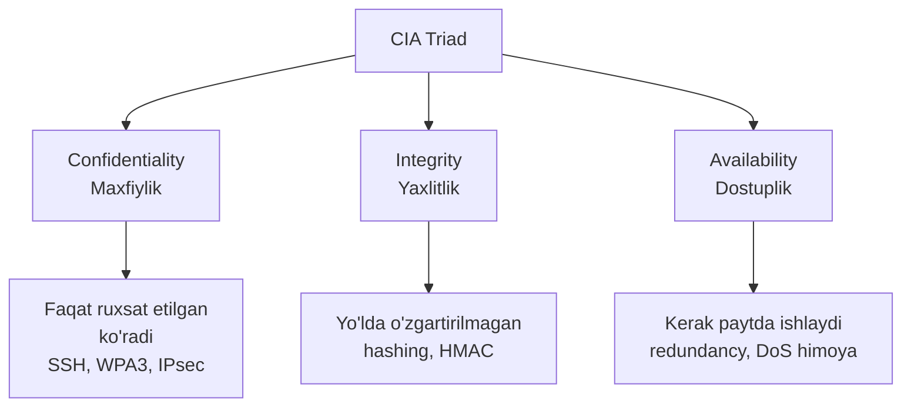
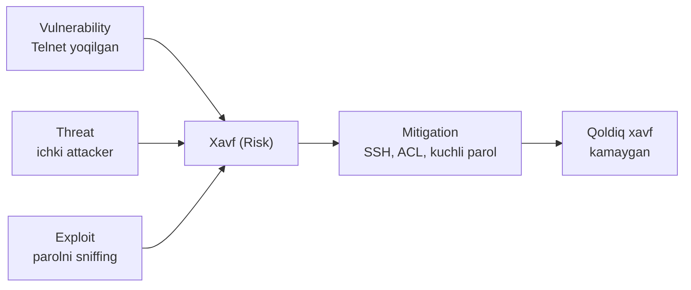
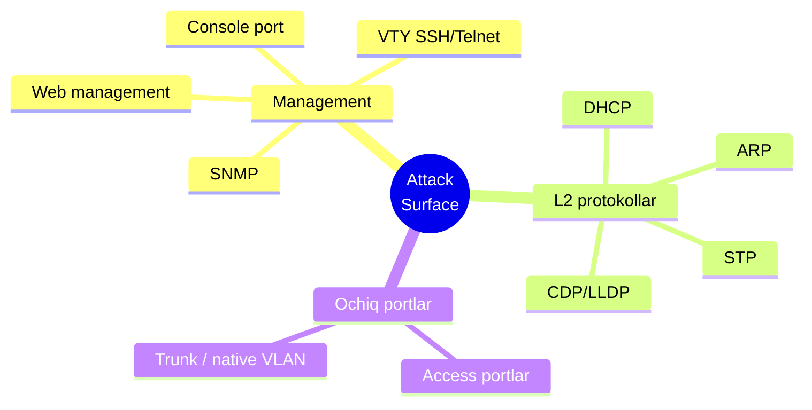
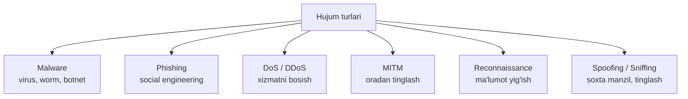
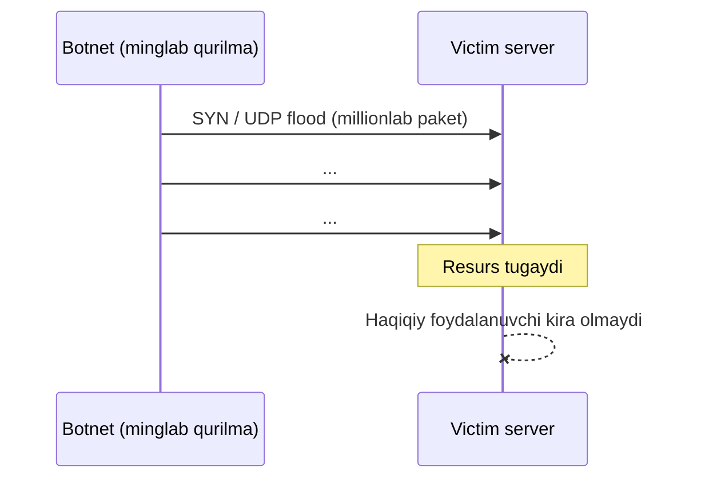
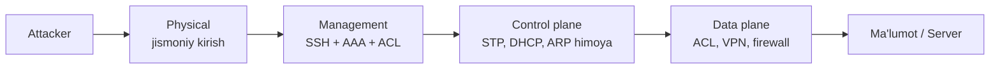

# 01. Security Concepts va Hujum Turlari

## Muammo: nega tarmoq xavfsizligi kerak?

Tasavvur qil: sen yangi ofis ochding. Ichkarida qimmatbaho serverlar,
mijozlar ma'lumotlari, moliyaviy hisoblar bor. Lekin eshiklar qulfsiz,
derazalar ochiq, va kim kirib-chiqayotganini hech kim yozib bormaydi.

Internetdagi har bir qurilma ana shunday ofis. 2025-yilda Cloudflare
**bir soatda o'rtacha 5376 ta DDoS hujumini** avtomatik to'xtatgan, eng katta
hujum esa **31.4 Tbps** ga yetgan (atigi 35 soniya davom etib). Tarmoq
xavfsizligi bo'lmasa, sening "ofis"ing shu oqim ichida bir zumda quriydi.

> Tarmoq xavfsizligi bitta buyruq emas. U qatlam-qatlam quriladigan devor:
> bittasi teshilsa, keyingisi to'xtatadi.

Bu birinchi darsda biz xavfsizlik **tili**ni (atamalarni) va dushmanni
(hujum turlarini) o'rganamiz. Keyingi darslarda ularga qarshi qurollarni.

---

## 1. CIA triad: xavfsizlikning uch ustuni

### Analogiya

Xavfsizlikni **bank seyfi** deb tasavvur qil:

- **Confidentiality** (maxfiylik) = seyf ichini faqat egasi ko'radi.
- **Integrity** (yaxlitlik) = ichidagi pul soxtalashtirilmagan, haqiqiy.
- **Availability** (dostuplik) = kerak paytda seyfni ocha olasan.

Uchtasi birga bo'lsagina xavfsizlik to'liq. Bittasi buzilsa, tizim zaif.

### Sodda ta'rif

**CIA triad** (Confidentiality, Integrity, Availability) — har qanday
xavfsizlik chorasini baholaydigan uchta o'lchov.



| O'lchov | Nima kafolatlaydi | Cisco/tarmoq misoli |
|---|---|---|
| **Confidentiality** | Ma'lumotni begona ko'rmaydi | SSH, WPA2/WPA3, IPsec encryption |
| **Integrity** | Ma'lumot yo'lda o'zgarmaydi | hashing, HMAC, routing authentication |
| **Availability** | Xizmat ishlab turadi | redundancy, DoS mitigation, monitoring |

---

## 2. Threat, Vulnerability, Exploit, Mitigation

Bu to'rt atama xavfsizlikning **grammatikasi**. Ularni chalkashtirmaslik
juda muhim, chunki CCNA imtihonida ham, real ishda ham doim uchraydi.

### Analogiya: eshik qulfi

- **Vulnerability** (zaiflik) = qulf zang bosgan, sindirsa bo'ladi.
- **Threat** (tahdid) = ko'chada yuradigan o'g'ri.
- **Exploit** = o'g'ri qulfni sindiradigan aniq usul (lom bilan).
- **Mitigation** (kamaytirish) = yangi po'lat qulf o'rnatish.

> Zaiflik + tahdid + exploit = xavf. Mitigation shu xavfni
> qabul qilinadigan darajaga tushiradi (ko'pincha nolga emas).



| Atama | Ma'nosi | Oddiy misol |
|---|---|---|
| **Threat** | Zarar yetkazuvchi manba yoki holat | Internetdan kelgan attacker |
| **Vulnerability** | Tizimdagi zaif joy | Telnet yoqilgan, parol oddiy |
| **Exploit** | Zaiflikdan foydalanish usuli | Telnet parolini sniffing qilish |
| **Mitigation** | Xavfni kamaytirish chorasi | Telnet o'rniga SSH, ACL, kuchli parol |

Real misol (switch uchun):

```text
Vulnerability: management VLAN hamma portlardan ochiq
Threat:        ichki tarmoqdagi ruxsatsiz foydalanuvchi
Exploit:       SSH brute-force yoki default parol bilan kirish
Mitigation:    management ACL + AAA + kuchli parol + login block-for
```

---

## 3. Attack surface: dushman qayerdan kiradi?

**Attack surface** (hujum yuzasi) — attacker foydalanishi mumkin bo'lgan
**barcha kirish nuqtalari** yig'indisi. Qancha eshik ochiq bo'lsa, shuncha
xavf. Xavfsizlikning oltin qoidasi: **keraksiz eshiklarni yop**.

Router/switch uchun attack surface:



### Worked example: attack surface kamaytirish

```cisco
! --- 1-qadam: keraksiz web management xizmatini o'chir ---
conf t
no ip http server
no ip http secure-server

! --- 2-qadam: running-config dagi parollarni yashir ---
service password-encryption

! --- 3-qadam: CDP ni hamma interfeysda o'chir (reconnaissance himoyasi) ---
no cdp run
end
```

Agar faqat bitta interfeysda CDP kerak bo'lmasa:

```cisco
conf t
interface g0/1
 no cdp enable
end
```

> Diqqat: `no cdp run` — global, HAMMA interfeysda o'chiradi.
> `no cdp enable` — faqat shu bitta interfeysda.

---

## 4. Ko'p uchraydigan hujum turlari

Endi dushmanni tanib olamiz. 2025-2026 tahdid manzarasida eng ko'p
uchraydigan hujumlar quyidagilar. Har biri uchun: **nima**, **qanday**,
**mitigation**.



### 4.1 Malware (zararli dastur)

**Malware** — kompyuterga zarar yetkazish uchun yozilgan dastur. Ikki asosiy turi:

- **Virus** — foydalanuvchi harakati kerak (fayl ochilganda faollashadi).
- **Worm** (qurt) — foydalanuvchisiz o'zi tarqaladi, tarmoq zaifligidan foydalanadi.

Zararlangan kompyuterlar **botnet** (zombi kompyuterlar tarmog'i)ga
qo'shiladi. Jinoyatchilar botnetdan spam, DDoS va ma'lumot o'g'irlash uchun
foydalanadi. Klassik misol: 2016-yilda **Mirai** botneti 600 000 IoT
qurilmani egallab, internet infratuzilmasiga katta zarar yetkazdi. 2025-yilda
esa Cloudflare rekord hujumlarni **Aisuru** kabi yangi botnetlarga bog'ladi.

### 4.2 Phishing

**Phishing** — foydalanuvchini aldab, parol yoki maxfiy ma'lumotni
oshkor qildirish (soxta email, soxta sayt). 2025-2026-da bu **eng asosiy
kirish yo'li** — barcha buzib kirishlarning ~60% i phishing bilan boshlanadi.

Yangi xavf: **generativ AI**. Attacker endi rahbaring ovozini
klonlaydi, deepfake video yasaydi, xatolarsiz sof matn yozadi. Eski
"imlo xatosi" belgisi endi ishlamaydi.

Mitigation: MFA (ko'p faktorli autentifikatsiya), foydalanuvchi ta'limi,
email filtrlar.

### 4.3 DoS va DDoS

**DoS** (Denial of Service) — xizmatni ishlamay qoladigan darajada trafik
yoki so'rov bilan band qilish. Uch xili:

1. **Vulnerability attack** — maxsus paket bilan dastur/OS ni qulatish.
2. **Bandwidth flooding** — kanalni to'ldiradigan paket toshqini.
3. **Connection flooding** — ko'p soxta TCP ulanish (masalan SYN flood).

**DDoS** (Distributed DoS) — bir vaqtda ko'p manbadan (botnetdan) hujum.
Bitta manbani bloklab bo'lmaydi, aniqlash qiyin.

Rekordlar tez o'zgaryapti: 2018-da GitHub'ga 1.35 Tbps, 2020-da AWS'ga
2.3 Tbps, 2025-yilda esa Cloudflare **31.4 Tbps** ni to'xtatdi. 2025-da
DDoS hujumlar hajmi **121% ga oshdi**.



Mitigation: rate limiting/policing, ACL, Control Plane Policing,
upstream provider (Cloudflare kabi) himoyasi, monitoring.

### 4.4 Man-in-the-Middle (MITM)

**MITM** — attacker ikki tomon orasiga kirib, trafikni o'qiydi yoki
o'zgartiradi. LAN ichida eng ko'p ko'rinadigan turi — **ARP spoofing**:
attacker "gateway MAC — bu men" deb yolg'on ARP reply yuboradi.

Mitigation: **Dynamic ARP Inspection**, **DHCP snooping** (6-darsda),
SSH/HTTPS, IPsec VPN.

### 4.5 Reconnaissance (razvedka)

**Reconnaissance** — hujumdan oldin ma'lumot yig'ish: IP range, ochiq
portlar, qurilma turi, OS versiya. 2025-da AI buni avtomatlashtiradi —
LinkedIn, sayt, hujjatlardan OSINT yig'ib qurbon profili tuzadi.

Mitigation: keraksiz xizmatlarni o'chirish, management ACL, bannerda
ortiqcha ma'lumot bermaslik, SNMPv3 yoki kuchli community string.

### 4.6 Packet Sniffing va IP Spoofing

- **Packet Sniffing** — tarmoqdagi paketlarni maxfiy nusxalash va o'qish
  (parol, PIN, xabar). Eng xavfli joy — ochiq Wi-Fi. **Himoya: shifrlash.**
- **IP Spoofing** — soxta source IP bilan paket yuborish, o'zini boshqa
  qurilma qilib ko'rsatish. **Himoya: authentication**, ingress/egress filtering.

---

## 5. Password attack va login himoyasi

Parolni **taxmin qilish** (guessing), **brute-force** (hamma variantni sinash),
**dictionary attack** (lug'atdagi so'zlar) — eng oddiy va eng keng tarqalgan
hujum. Cisco'da himoyani bir necha qator bilan quramiz:

```cisco
! --- 1-qadam: minimal parol uzunligini majburla ---
conf t
security passwords min-length 10

! --- 2-qadam: 60s ichida 3 xato bo'lsa, 120s bloklash ---
login block-for 120 attempts 3 within 60

! --- 3-qadam: kuchli enable secret va admin user ---
enable secret VeryStrongSecret123
username admin privilege 15 secret AnotherStrongSecret123
end
```

Tekshirish:

```cisco
show login
show run | include enable secret|username|login block-for
```

---

## 6. Defense in depth: qatlam-qatlam himoya

**Defense in depth** — bitta himoyaga ishonmaslik. Bir necha mustaqil
qatlam qurish. Bittasi teshilsa, keyingisi xavfni ushlab qoladi.



Amaliyotda: `SSH + AAA + ACL + logging + least privilege + backup config`.

Xavfsizlik siyosati (**security policy**) bu qatlamlarni tartibga soladi:
kim qaysi qurilmaga kiradi, qaysi protokol ruxsat etilgan, parol talabi,
log qayerga boradi, incident bo'lsa kim javob beradi.

---

## Worked example: qurilmani birinchi tekshirish

Xavfsizlik holatini ko'radigan buyruqlar to'plami:

```cisco
show running-config          ! umumiy sozlama
show version                 ! OS versiya, uptime
show users                   ! hozir kim ulangan
show line                    ! console/VTY holati
show logging                 ! log yozuvlari
show ip ssh                  ! SSH sozlamasi
show access-lists            ! ACL lar
show interfaces status       ! portlar holati
show mac address-table       ! MAC jadval
```

---

## Xulosa

- **Tarmoq xavfsizligi** — resurslarni ruxsatsiz kirish, buzish, o'g'irlash
  va xizmatni to'xtatishdan himoya qilish.
- **CIA triad** = Confidentiality + Integrity + Availability, har chorani
  shu uch o'lchovda baholaymiz.
- **Threat** (tahdid), **vulnerability** (zaiflik), **exploit** (foydalanish
  usuli), **mitigation** (kamaytirish) — xavfsizlikning to'rt asosiy atamasi.
- **Attack surface** ni kamaytirish = keraksiz xizmat va portlarni yopish.
- Asosiy hujumlar: **malware, phishing, DoS/DDoS, MITM, reconnaissance,
  sniffing, spoofing**. 2025-2026-da phishing (~60%) va DDoS (rekord 31.4 Tbps)
  yetakchi.
- **Defense in depth** — bir necha qatlam himoya, bitta buyruqqa ishonmaslik.

## 🧠 Eslab qol

- CIA = Confidentiality, Integrity, Availability.
- Vulnerability = zaif joy; Exploit = shu joydan foydalanish usuli.
- DDoS bir manbadan emas, minglab qurilmadan (botnet) keladi.
- ARP spoofing = LAN ichidagi eng ko'p uchraydigan MITM.
- Mitigation xavfni odatda nolga emas, qabul qilinadigan darajaga tushiradi.

## ✅ O'z-o'zini tekshir (retrieval practice)

<details>
<summary>1. Telnet yoqilgan bo'lsa — bu threat, vulnerability, exploit yoki mitigation?</summary>

Bu **vulnerability** (zaiflik). Telnet parolni ochiq matnda yuboradi.
Uni sniffing qilib parol o'g'irlash — bu **exploit**. SSH ga o'tish — **mitigation**.
</details>

<details>
<summary>2. Nega DDoS ni DoS dan to'xtatish qiyinroq?</summary>

DoS bitta manbadan keladi — o'sha IP ni bloklab qo'ya olasan. DDoS esa
minglab tarqalgan qurilmadan (botnet) keladi. Bitta IP ni bloklash yordam
bermaydi, va hujum haqiqiy trafikka o'xshaydi — shuning uchun aniqlash va
filtrlash ancha murakkab.
</details>

<details>
<summary>3. Attack surface ni kamaytirish nima uchun muhim, va bunga 2 misol ayt.</summary>

Qancha kirish nuqtasi bo'lsa, shuncha zaiflik. Kamaytirsak — attacker uchun
imkoniyat kamayadi. Misollar: `no ip http server` (web management o'chirish),
`no cdp run` (reconnaissance himoyasi), keraksiz portlarni shutdown qilish.
</details>

<details>
<summary>4. Confidentiality buzilsa nima bo'ladi, Availability buzilsa-chi?</summary>

**Confidentiality** buzilsa — maxfiy ma'lumot begonaga oshkor bo'ladi
(masalan sniffing orqali parol o'g'irlanadi). **Availability** buzilsa —
xizmat ishlamay qoladi (masalan DDoS server'ni band qiladi va foydalanuvchi
kira olmaydi).
</details>

<details>
<summary>5. Nega 2025-2026-da "imlo xatosi bor emasmi" degan phishing belgisi endi ishlamaydi?</summary>

Generativ AI attackerga xatosiz, sof matn yozib beradi, hatto rahbaring
ovozini klonlaydi va deepfake video yasaydi. Shuning uchun mazmunga emas,
MFA va texnik nazoratga tayanish kerak.
</details>

## 🛠 Amaliyot

1. **Oson (Modify):** Yuqoridagi attack surface kamaytirish misolidan
   `no cdp run` ni olib tashlab, o'rniga faqat `g0/0` interfeysida CDP ni
   o'chiradigan variantga o'zgartir.

2. **O'rta (Faded example):** Login himoyasini to'ldir:
   ```cisco
   conf t
   security passwords min-length ___        ! TODO: kamida 10
   login block-for ___ attempts ___ within ___  ! TODO: 60s da 3 xato -> 120s blok
   enable secret ___                         ! TODO: kuchli parol
   end
   ```
   <details><summary>Hint</summary>
   `min-length 10`, `block-for 120 attempts 3 within 60`, `enable secret VeryStrongSecret123`.
   </details>

3. **Qiyin (Make):** Bitta yangi switch uchun noldan "hardening" ro'yxati yoz:
   qaysi 5 ta buyruq bilan attack surface ni kamaytirasan va nega. Har biriga
   CIA triad'ning qaysi ustunini himoya qilishini yoz.
   <details><summary>Hint</summary>
   `service password-encryption` (C), `no ip http server` (attack surface),
   `enable secret` (C), `login block-for` (A — brute-force himoya),
   `transport input ssh` (C — Telnet o'chirish).
   </details>

## 🔁 Takrorlash

- **Bog'liq darslar:** [02. Firewall](./02-firewall.md),
  [03. ACL](./03-acl.md), [06. L2 Security](./06-l2-security.md).
- **Takrorlash jadvali:** ertaga → 3 kundan keyin → 1 haftadan keyin
  "O'z-o'zini tekshir" savollariga qaytib javob ber.
- **Feynman testi:** Do'stingga kod so'zlarisiz, 3 jumlada tushuntir:
  "Threat, vulnerability, exploit, mitigation nima va ular qanday bog'lanadi?"

## 📚 Manbalar

- [ENISA Threat Landscape 2025](https://www.enisa.europa.eu/sites/default/files/2026-01/ENISA%20Threat%20Landscape%202025_v1.2.pdf)
- [Cloudflare — 2025 Q4 DDoS threat report (31.4 Tbps)](https://blog.cloudflare.com/ddos-threat-report-2025-q4/)
- [Cloudflare — 7.3 Tbps DDoS blocked](https://blog.cloudflare.com/defending-the-internet-how-cloudflare-blocked-a-monumental-7-3-tbps-ddos/)
- [M-Trends 2026 (Google Cloud)](https://cloud.google.com/blog/topics/threat-intelligence/m-trends-2026)
- [WEF Global Cybersecurity Outlook 2026](https://reports.weforum.org/docs/WEF_Global_Cybersecurity_Outlook_2026.pdf)
