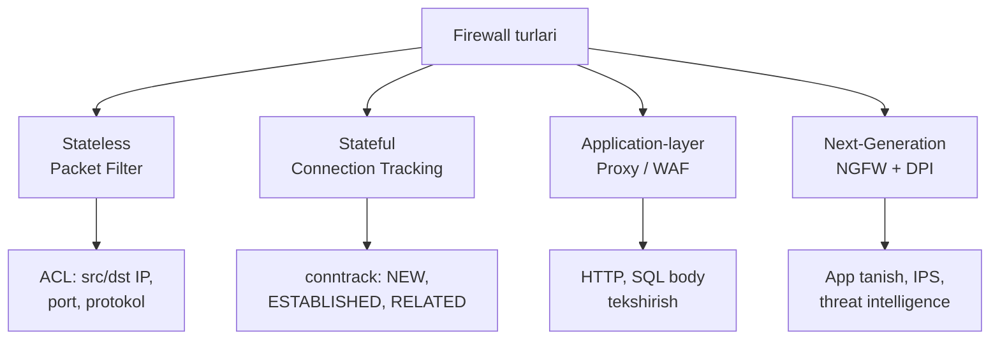
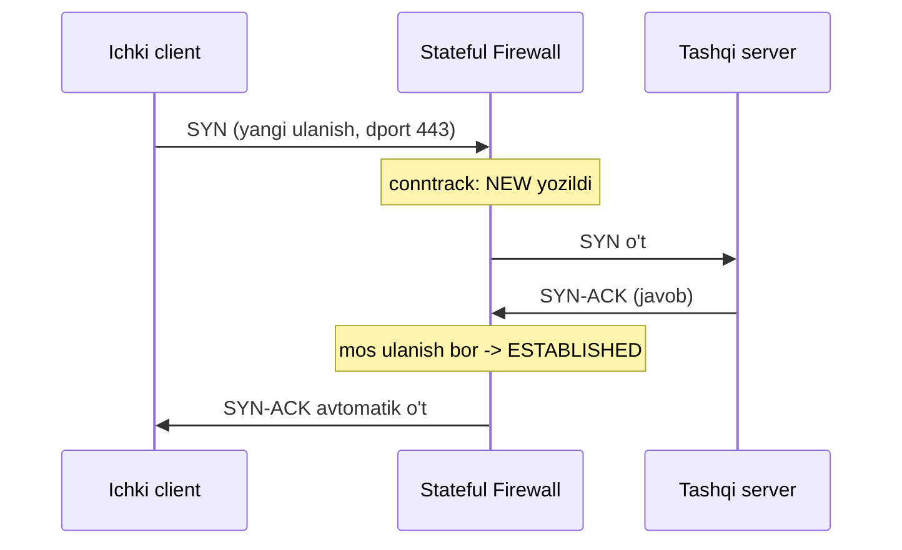
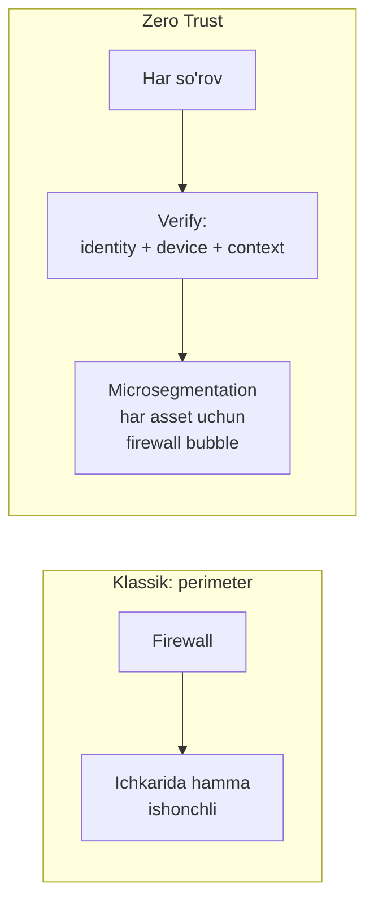

# 02. Firewall

## Muammo: kim kirsin, kim kirmasin?

Oldingi darsda **attack surface** — dushman kiradigan barcha eshiklarni
ko'rdik. Endi savol: shu eshiklarda **kim turadi va tekshiradi**?

Tarmoqni chegara nazoratisiz qoldirsang, har qanday paket ichkariga
bemalol kiradi. Serverlaring internetga to'g'ridan-to'g'ri "ochiq" turadi.
Bir necha soatda skanerlar, botlar, brute-force urinishlar seni topadi.

**Firewall** — ana shu chegaradagi qorovul. U har paketni ko'rib, oldindan
belgilangan qoidaga qarab **permit** (o't) yoki **deny** (to'xta) deydi.

> Firewall — tarmoq xavfsizligining birinchi himoya chizig'i.
> U bo'lmasa, qolgan himoyalar (ACL, VPN, IPS) ichkarida yakka qoladi.

---

## Analogiya: aeroportdagi nazorat

Firewall'ni **aeroport nazorati** deb tasavvur qil:

- **Stateless firewall** = har yo'lovchiga alohida qaraydigan, hech kimni
  eslamaydigan qorovul. "Pasporting bormi? O't." Kim bilan kirganini,
  qaytib chiqishini eslamaydi.
- **Stateful firewall** = jurnal yuritadigan qorovul. "Sen ertalab
  chiqib ketding, endi qaytyapsan — tanidim, o't." U **ulanishning holatini
  (state)** eslaydi.

Bu farq firewall tushunchasining yuragi. Keling, chuqurlashamiz.

---

## Firewall turlari



### 1. Stateless (packet filter)

Har paketni **alohida**, xotirasiz tekshiradi. Faqat header'ga qaraydi:
source/destination IP, port, protokol. Tez, lekin "aqli" yo'q — ulanish
kontekstini bilmaydi.

Cisco'da bunga **ACL** to'g'ri keladi (keyingi darsda chuqur). Masalan:

```cisco
! Stateless filter: faqat 10.10.10.0/24 dan SSH ga ruxsat
ip access-list extended MGMT
 permit tcp 10.10.10.0 0.0.0.255 any eq 22
 deny ip any any
```

Kamchiligi: return trafik uchun ham qoida yozish kerak, aks holda
javob paketlar bloklanadi.

### 2. Stateful (connection tracking)

Ulanish **holatini** eslaydi. Ichkaridan chiqqan ulanish uchun avtomatik
"orqaga yo'l" ochadi. Bu — hozirgi firewall'larning asosi.



TCP uchun firewall SYN, ESTABLISHED, FIN, TIME_WAIT holatlarini biladi.
UDP uchun "pseudo-state" — oxirgi paket vaqtiga qarab.

Linux'da bu `conntrack` jadvali orqali ishlaydi:

```bash
# Faqat ESTABLISHED va RELATED ni qabul qil, qolgani DROP
sudo iptables -A INPUT -m conntrack --ctstate ESTABLISHED,RELATED -j ACCEPT
sudo iptables -A INPUT -p tcp --dport 22 -j ACCEPT   # yangi SSH ga ruxsat
sudo iptables -A INPUT -j DROP                        # default-deny
```

> Oltin qoida: **default-deny**. Avval hammasini yop, keyin faqat
> kerakli trafikni och. Teskarisi (default-allow) — xavfli.

### 3. Application-layer / WAF

**WAF** (Web Application Firewall) — application qatlamda (Layer 7)
ishlaydi, HTTP so'rovning **ichini** o'qiydi. SQL injection, XSS kabi
web hujumlarni topadi. Oddiy firewall port 443 ni ko'radi, WAF esa
o'sha 443 ichidagi zararli so'rovni ko'radi.

2025-da WAF'lar **AI-powered** bo'ldi: statik qoidaga tayanmasdan,
foydalanuvchi xatti-harakatining "normal" chizig'ini o'rganadi va
og'ishni aniqlaydi.

### 4. NGFW (Next-Generation Firewall)

**NGFW** — stateful firewall + qo'shimcha aql. U Layer 3-4 **va** Layer 7 ni
birga ko'radi:

- **Application control** — Skype'ni HTTP'dan farqlaydi (port emas, ilova bo'yicha).
- **IPS/IDS** — hujum imzolarini (signature) topadi va bloklaydi.
- **DPI** (Deep Packet Inspection) — paket ichini chuqur tekshiradi.
- **TLS inspection**, **threat intelligence** (bulutdan yangilanadigan qora ro'yxat).

| Xususiyat | Stateless | Stateful | NGFW | WAF |
|---|---|---|---|---|
| Qatlam | L3-L4 | L3-L4 | L3-L4 + L7 | L7 (web) |
| Ulanish holati | Yo'q | Bor | Bor | Bor |
| App tanish | Yo'q | Yo'q | Bor | Web app |
| SQL/XSS himoya | Yo'q | Yo'q | Qisman | Ha |
| Tez/yengil | Eng tez | Tez | Og'irroq | O'rta |

> NGFW perimetrni, WAF esa ilovani himoya qiladi — **birga** ishlatiladi,
> biri ikkinchisini almashtirmaydi.

---

## Firewall va ACL: farqi nima?

Yangi o'rganuvchilar buni tez-tez chalkashtiradi.

- **ACL** — odatda **stateless** filtr (router/switch'da). Return trafik uchun
  alohida qoida kerak. Yengil, tez, lekin cheklangan.
- **Firewall** — odatda **stateful**, ba'zan L7 tahlili bilan. Ulanishni
  eslaydi, chuqur inspection qiladi.

> CCNA darajasida ACL — sening asosiy filtrlash quroling. Lekin stateful
> inspection, application control va advanced threat protection uchun
> firewall (masalan Cisco ASA yoki Firepower) kerak bo'ladi.

---

## Worked example: stateful filter (nftables)

Zamonaviy Linux'da `iptables` o'rniga `nftables` ishlatiladi (RHEL 9,
Debian 12, Ubuntu 22.04+ da default). Sodda default-deny setup:

```bash
# --- 1-qadam: allaqachon o'rnatilgan ulanishlarni qabul qil ---
sudo nft add rule inet filter input ct state established,related accept

# --- 2-qadam: SSH (22) uchun yangi ulanishga ruxsat ---
sudo nft add rule inet filter input tcp dport 22 accept

# --- 3-qadam: loopback ga ruxsat, qolgani default-deny (policy drop) ---
sudo nft add rule inet filter input iif "lo" accept
```

Tekshirish:

```bash
sudo nft list ruleset          # barcha qoidalar
sudo conntrack -L              # joriy ulanish holatlari
sudo conntrack -S              # statistika
```

Chiqish (namuna):

```text
tcp 6 86399 ESTABLISHED src=10.0.0.5 dst=140.82.121.4 sport=54321
    dport=443 [ASSURED]
```

Bu qator: ichki `10.0.0.5` GitHub (443) bilan **o'rnatilgan** ulanishda,
firewall uni eslab turibdi.

---

## Zero Trust: "hech kimga ishonma"

Klassik model: "ichki tarmoq ishonchli, tashqarisi ishonchsiz". Firewall
faqat chegarada turadi. Muammo: attacker bir marta ichkariga kirsa,
hamma joyga erkin harakat qiladi (lateral movement).

**Zero Trust** (nol ishonch) modeli buni o'zgartiradi:

> "Never trust, always verify" — hech kimga (hatto ichkaridagiga ham)
> ishonma, har so'rovni qayta tekshir.



2025-da tashkilotlarning ~46% i Zero Trust'ga o'tish jarayonida, 43% i
qisman qo'llagan. Amaliy tayanchlar:

- **Microsegmentation** — har asset atrofida alohida "firewall pufagi".
- **NGFW + SDP** (software-defined perimeter) — segmentlar orasini nazorat.
- **Continuous validation** — device holati, identity, kontekst doim tekshiriladi.

Zero Trust'siz tashkilotlarda buzilish narxi o'rtacha **38% qimmatroq**
(o'rtacha $1.76M ortiqcha).

---

## Firewall'ni chetlab o'tish (bypass) usullari

Firewall mutlaq emas. Attacker'lar chetlab o'tishga urinadi:

- **DNS tunneling** — ma'lumotni port 53 (DNS) ichida yashirish.
- **ICMP tunneling** — ping paketlari ichida ma'lumot.
- **Domain fronting** — CDN orqali haqiqiy manzilni yashirish.
- **Protocol smuggling** — ruxsat etilgan protokol ichiga boshqasini tiqish.

Shuning uchun firewall yolg'iz emas — **defense in depth**ning bir qatlami.

---

## Xulosa

- **Firewall** — tarmoq chegarasidagi qorovul: qoidaga qarab **permit** yoki
  **deny** qiladi.
- **Stateless** har paketni alohida ko'radi; **stateful** ulanish holatini
  (conntrack) eslaydi va return trafikni avtomatik ochadi.
- **WAF** Layer 7 web hujumlarini (SQLi, XSS), **NGFW** esa L3-L7 ni birga
  (app control, IPS, DPI) himoya qiladi. Ikkalasi birga ishlatiladi.
- **ACL** — asosan stateless; **firewall** — stateful + chuqur inspection.
- **Default-deny** — oldin hammasini yop, keyin kerakligini och.
- **Zero Trust** — "never trust, always verify", microsegmentation bilan.

## 🧠 Eslab qol

- Stateless = xotirasiz; stateful = conntrack bilan ulanishni eslaydi.
- WAF = web (L7); NGFW = L3-L7 + IPS + app control.
- Default-deny har doim default-allow'dan xavfsizroq.
- Zero Trust = ichki tarmoqqa ham ishonmaslik.
- NAT firewall EMAS — u faqat address translation qiladi.

## ✅ O'z-o'zini tekshir (retrieval practice)

<details>
<summary>1. Stateless firewall'da nega return trafik uchun alohida qoida kerak?</summary>

Stateless firewall ulanish holatini eslamaydi. Ichkaridan chiqqan so'rovni
"ko'rmagan" bo'ladi, shuning uchun tashqaridan kelgan javob paketni tanimaydi.
Uni o'tkazish uchun aniq qoida yozish kerak. Stateful firewall esa conntrack
orqali javobni avtomatik taniydi va ochib beradi.
</details>

<details>
<summary>2. Port 443 ochiq, lekin sayt SQL injection'dan azob chekyapti. Qaysi firewall yordam beradi — NGFW-ning oddiy filtri yoki WAF?</summary>

**WAF**. Oddiy filtr faqat port 443 ochiq/yopiqligini ko'radi, ichidagi
HTTP so'rovni o'qimaydi. SQL injection so'rov **ichida** (payload'da) bo'ladi.
WAF (yoki DPI bilan NGFW) L7'da so'rov mazmunini tekshirib, zararli payload'ni
topadi va bloklaydi.
</details>

<details>
<summary>3. "NAT bor, demak firewall shart emas" — to'g'rimi?</summary>

Yo'q, noto'g'ri. NAT faqat manzil o'zgartirish (address translation) qiladi,
xavfsizlik uning maqsadi emas. Himoya stateful conntrack va default-deny
qoidalardan keladi. IPv6'da esa NAT umuman yo'q — har qurilma public IP'da,
shuning uchun firewall yana ham muhim.
</details>

<details>
<summary>4. Zero Trust modelida attacker bir hostni buzsa, nega hamma joyga erkin o'ta olmaydi?</summary>

Zero Trust'da "ichki tarmoq ishonchli" degan taxmin yo'q. Microsegmentation
har asset atrofida alohida nazorat qo'yadi va har so'rov qayta tekshiriladi
(identity + device + kontekst). Shuning uchun bitta hostni buzish boshqa
segmentlarga avtomatik kirish bermaydi — lateral movement cheklanadi.
</details>

## 🛠 Amaliyot

1. **Oson (Modify):** Yuqoridagi nftables misolida SSH (22) o'rniga
   HTTPS (443) uchun ruxsat beradigan qoidaga o'zgartir.

2. **O'rta (Faded example):** Default-deny stateful filter to'ldir:
   ```bash
   sudo iptables -A INPUT -m conntrack --ctstate ___ -j ACCEPT   # TODO: established,related
   sudo iptables -A INPUT -p tcp --dport ___ -j ACCEPT           # TODO: SSH porti
   sudo iptables -A INPUT -j ___                                 # TODO: default deny
   ```
   <details><summary>Hint</summary>
   `--ctstate ESTABLISHED,RELATED`, `--dport 22`, oxirgi `-j DROP`.
   </details>

3. **Qiyin (Make):** Kichik ofis uchun firewall siyosatini yoz: (a) ichki
   foydalanuvchilar internetga chiqsin, (b) tashqaridan faqat web server'ning
   443 portiga kirilsin, (c) qolgan hamma inbound bloklansin. Qaysi qoidalar
   stateful bo'lishi kerakligini belgila.
   <details><summary>Hint</summary>
   Outbound: default-allow ichkidan tashqariga + conntrack established qaytishga.
   Inbound: faqat `dport 443` web server IP'ga, qolgani default-deny.
   </details>

## 🔁 Takrorlash

- **Bog'liq darslar:** [01. Security concepts](./01-security-concepts-va-hujumlar.md),
  [03. ACL](./03-acl.md), [08. VPN va IPsec](./08-vpn-ipsec.md).
- **Takrorlash jadvali:** ertaga → 3 kundan keyin → 1 haftadan keyin
  "O'z-o'zini tekshir" savollariga qayt.
- **Feynman testi:** Do'stingga 3 jumlada tushuntir: "Stateless va stateful
  firewall farqi nima, va nega default-deny xavfsizroq?"

## 📚 Manbalar

- [Palo Alto — WAF vs NGFW farqi](https://www.paloaltonetworks.com/cyberpedia/difference-between-wafs-and-ngfws)
- [Check Point — NGFW va WAF birga](https://www.checkpoint.com/cyber-hub/cloud-security/what-is-web-application-firewall/ngfw-vs-waf/)
- [NIST — Zero Trust Architecture (SP 800-207)](https://nvlpubs.nist.gov/nistpubs/SpecialPublications/NIST.SP.800-207.pdf)
- [NIST — 19 ways to build Zero Trust (2025)](https://www.nist.gov/news-events/news/2025/06/nist-offers-19-ways-build-zero-trust-architectures)
- [Linux Netfilter / nftables docs](https://wiki.nftables.org/)
