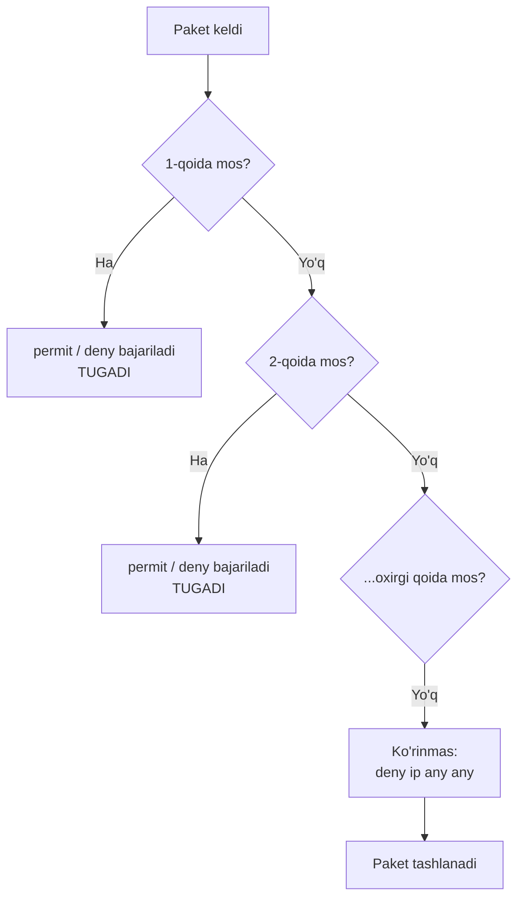
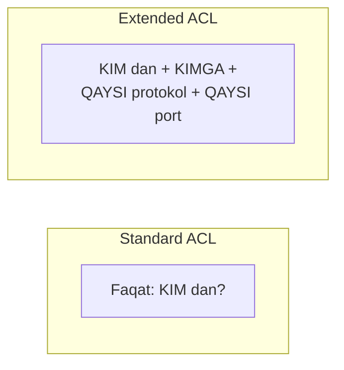
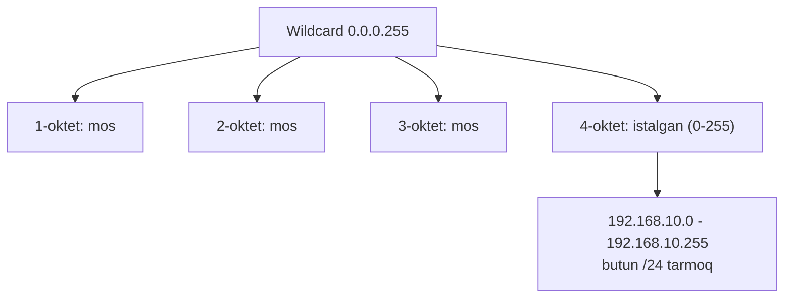
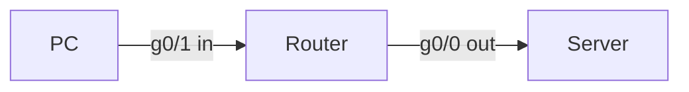
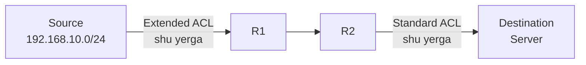

# 03. ACL (Access Control List)

## Muammo: tarmoq ichida kim kim bilan gaplashsin?

Oldingi darsda firewall — tarmoq **chegarasida** turadi dedik. Lekin
tarmoq ichida ham nazorat kerak. Masalan:

- Guest Wi-Fi foydalanuvchisi HR serveriga **kirmasligi** kerak.
- Ishlab chiqarish (production) tarmog'iga faqat ma'lum bo'lim kira olsin.
- Foydalanuvchilar web serverga faqat 443-portdan bog'lansin, boshqa
  portlar yopiq bo'lsin.

Firewall har router ichida yo'q. Lekin **har router** trafikni filtrlay
oladi — **ACL** yordamida.

> **ACL** — router yoki multilayer switch orqali o'tayotgan trafikni
> **permit** (o't) yoki **deny** (to'xta) qiladigan qoidalar ro'yxati.

CCNA imtihonida ham, real ishda ham ACL — eng ko'p ishlatiladigan xavfsizlik
quroli. Va eng ko'p **xato** qilinadigan mavzu. Shuning uchun uni chuqur o'rganamiz.

---

## Analogiya: qorovul va mehmonlar ro'yxati

ACL'ni **restoran eshigidagi qorovul va ro'yxat** deb tasavvur qil:

- Qorovul ro'yxatni **yuqoridan pastga** o'qiydi.
- **Birinchi mos** kelgan qatorda to'xtaydi ("Bu — Ali, o't" yoki "Bu — Vali, yo'q").
- Keyingi qatorlarni **umuman ko'rmaydi**.
- Ro'yxat oxirida ko'rinmas qoida bor: **"Ro'yxatda yo'q bo'lsang — kirma"**.

Bu oxirgi ko'rinmas qoida — ACL'ning eng muhim va eng ko'p unutiladigan qismi.

---

## ACL qanday ishlaydi?



Ikki muhim tamoyil:

1. **Tartib muhim** — qoidalar yuqoridan pastga, birinchi mos kelgan ishlaydi.
2. **Implicit deny** — har ACL oxirida ko'rinmas `deny ip any any` bor.

> Shuning uchun kerakli trafikni **albatta permit qilish** kerak. Aks holda
> u ko'rinmas deny'ga tushib bloklanadi.

---

## Standard vs Extended ACL

Ikki asosiy tur bor. Farqi — **nimaga qaray olishi**.

| Xususiyat | Standard ACL | Extended ACL |
|---|---|---|
| Nimaga qaraydi | Faqat **source IP** | Source + destination + protokol + port |
| Raqam oralig'i | 1-99, 1300-1999 | 100-199, 2000-2699 |
| Aniqlik | Qo'pol | Aniq (granular) |
| Qayerga qo'yiladi | Destination'ga yaqin | Source'ga yaqin |



### Standard ACL misoli

`192.168.10.0/24` tarmog'iga ruxsat, qolganini bloklash:

```cisco
! --- 1-qadam: ACL qoidalarini yoz (faqat source IP) ---
conf t
access-list 10 permit 192.168.10.0 0.0.0.255
access-list 10 deny any

! --- 2-qadam: interfeysga in yo'nalishida bog'la ---
interface g0/0
 ip access-group 10 in
end
```

Named (nomli) variant — o'qish oson, boshqarish qulay:

```cisco
conf t
ip access-list standard MGMT_ONLY
 permit 192.168.10.0 0.0.0.255
 deny any
line vty 0 4
 access-class MGMT_ONLY in
end
```

> Diqqat: VTY line uchun `access-class` ishlatiladi, interfeys uchun esa
> `ip access-group`. Buni chalkashtirish — klassik xato.

### Extended ACL misoli

`192.168.10.0/24` foydalanuvchilari web server `172.16.1.10` ga faqat
HTTP/HTTPS bilan borsin, qolgani deny:

```cisco
conf t
ip access-list extended USERS_TO_WEB
 permit tcp 192.168.10.0 0.0.0.255 host 172.16.1.10 eq 80
 permit tcp 192.168.10.0 0.0.0.255 host 172.16.1.10 eq 443
 deny ip 192.168.10.0 0.0.0.255 any
 permit ip any any
interface g0/1
 ip access-group USERS_TO_WEB in
end
```

Oxirgi `permit ip any any` — boshqa tarmoqlar trafikini tasodifan
bloklab qo'ymaslik uchun. Real tarmoqda security policy bo'yicha aniqroq
yoziladi.

---

## Wildcard mask: subnet mask'ning teskarisi

**Wildcard mask** — ACL qaysi bitlarni tekshirishini belgilaydi:

- **0** = bu bit **aynan mos** kelishi kerak.
- **1** = bu bit **e'tiborsiz** (do not care).

Bu subnet mask'ning **teskarisi**. Tez hisoblash:

```text
255.255.255.255
-  subnet mask
=  wildcard mask
```

Misollar:

```text
/24  ->  subnet 255.255.255.0    ->  wildcard 0.0.0.255
/30  ->  subnet 255.255.255.252  ->  wildcard 0.0.0.3
```

Ikkita maxsus qisqartma:

| Yozuv | Teng | Ma'nosi |
|---|---|---|
| `host 192.168.1.10` | `192.168.1.10 0.0.0.0` | Aniq bitta host |
| `any` | `0.0.0.0 255.255.255.255` | Har qanday manzil |



---

## Direction: in yoki out?

ACL interfeysga **ikki yo'nalishda** qo'yiladi. Buni router nuqtai
nazaridan tushunish kerak:

- **in** — trafik interfeysga **kirayotganda** tekshiriladi.
- **out** — trafik interfeysdan **chiqayotganda** tekshiriladi.



PC'dan kelgan trafikni routerga **kirishda** to'xtatmoqchimisan:

```cisco
interface g0/1
 ip access-group ACL_NAME in
```

Server tomonga **chiqayotgan** trafikni tekshirmoqchimisan:

```cisco
interface g0/0
 ip access-group ACL_NAME out
```

---

## Placement: qayerga qo'yish kerak?

Bu — CCNA'ning eng muhim qoidasi:

> **Standard ACL** — destination'ga yaqin (faqat source IP ko'radi, erta
> qo'ysang ko'p narsani keraksiz bloklaydi).
> **Extended ACL** — source'ga yaqin (aniq, keraksiz trafikni erta to'xtatadi,
> tarmoqni behuda band qilmaydi).



Sabab: extended ACL aniq ("faqat 443 ga") bo'lgani uchun uni source'ga
yaqin qo'ysang, bloklanadigan trafik butun tarmoqni kesib o'tmaydi. Standard
ACL esa faqat source IP ni biladi — source'ga yaqin qo'ysang, o'sha source'ning
**hamma** trafigini (hatto ruxsat berilishi kerak bo'lganini ham) bloklaydi.

---

## Sequence number: qoidalarni boshqarish

Named ACL ichida har qoidaning raqami bor. Bu bilan qoidani **o'rtaga
qo'shish** yoki **o'chirish** mumkin:

```cisco
conf t
ip access-list extended USERS_TO_WEB
 10 permit tcp 192.168.10.0 0.0.0.255 host 172.16.1.10 eq 443
 20 deny ip 192.168.10.0 0.0.0.255 any
end
```

Orasiga qoida qo'shish (10 va 20 orasiga 15):

```cisco
conf t
ip access-list extended USERS_TO_WEB
 15 permit tcp 192.168.10.0 0.0.0.255 host 172.16.1.10 eq 80
end
```

Qoida o'chirish:

```cisco
conf t
ip access-list extended USERS_TO_WEB
 no 20
end
```

---

## VTY access uchun ACL

Management kirishni faqat admin tarmog'idan ruxsat berish — juda muhim
xavfsizlik chorasi:

```cisco
conf t
ip access-list standard ADMIN_NET
 permit 10.10.10.0 0.0.0.255
 deny any
line vty 0 4
 access-class ADMIN_NET in
 transport input ssh
end
```

Bu qurilmaga SSH qilishni faqat `10.10.10.0/24` dan ruxsat qiladi.

---

## Troubleshooting

```cisco
show access-lists                          ! barcha ACL + counterlar
show ip access-lists
show running-config | section access-list
show running-config interface g0/1         ! qaysi ACL qayerga bog'langan
show ip interface g0/1                      ! in/out ACL nomi
show logging                                ! deny log
clear access-list counters                  ! counterlarni tozalash
```

Tekshirish tartibi:

1. ACL interfeysga qo'yilganmi?
2. Direction (in/out) to'g'rimi?
3. Source va destination joyi almashib ketmaganmi?
4. Wildcard mask to'g'rimi?
5. Kerakli `permit` implicit deny'dan **oldin** turibdimi?
6. NAT yoki routing ACL'dan oldin/keyin trafikni o'zgartiryaptimi?

---

## Ko'p uchraydigan xatolar

⚠️ **Xato 1: source va destination almashib ketishi (extended ACL).**
Noto'g'ri: qaysi tomon "kimdan", qaysisi "kimga" — chalkashtirish.
To'g'risi: `permit tcp SOURCE dst-port` — birinchi manzil doim source.

⚠️ **Xato 2: `deny` ni yuqoriga, `permit` ni pastga yozish.**
ACL yuqoridan pastga o'qiladi. `deny ip any any` yuqorida bo'lsa, undan
keyingi `permit` hech qachon ishlamaydi. Kerakli permit'ni deny'dan
**oldin** yoz.

⚠️ **Xato 3: standard ACL ni source'ga yaqin qo'yib, hamma trafikni bloklash.**
Standard faqat source IP ni ko'radi — source'ga yaqin qo'ysang, o'sha
source'ning kerakli trafigini ham bloklaydsan. Uni destination'ga yaqin qo'y.

⚠️ **Xato 4: VTY uchun `ip access-group` ishlatish.**
VTY line'da `access-class` kerak. `ip access-group` faqat interfeys uchun.

⚠️ **Xato 5: wildcard mask o'rniga subnet mask yozish.**
`0.0.0.255` (wildcard) to'g'ri; `255.255.255.0` (subnet) — noto'g'ri.

---

## Xulosa

- **ACL** — trafikni permit/deny qiladigan qoidalar ro'yxati, yuqoridan
  pastga o'qiladi, **birinchi mos** ishlaydi.
- Har ACL oxirida ko'rinmas **implicit deny** bor — kerakligini permit qil.
- **Standard** faqat source IP ni ko'radi (destination'ga yaqin qo'y);
  **Extended** source+dst+protokol+port ni ko'radi (source'ga yaqin qo'y).
- **Wildcard mask** = subnet mask'ning teskarisi; 0 = mos, 1 = e'tiborsiz.
- **Direction:** in = kirishda, out = chiqishda tekshiriladi.
- Interfeys uchun `ip access-group`, VTY uchun `access-class`.

## 🧠 Eslab qol

- Implicit deny hamma ACL oxirida — kerakligini albatta permit qil.
- Standard -> destination'ga yaqin; Extended -> source'ga yaqin.
- Wildcard 0 = "tekshir", 1 = "e'tibor berma".
- `host X` = `X 0.0.0.0`; `any` = `0.0.0.0 255.255.255.255`.
- VTY = access-class, interfeys = ip access-group.

## ✅ O'z-o'zini tekshir (retrieval practice)

<details>
<summary>1. ACL da barcha qoida to'g'ri, lekin hech qanday trafik o'tmayapti. Birinchi nima gumon qilasan?</summary>

Implicit deny. Ehtimol kerakli `permit ip any any` yoki `permit` qoidasi
yozilmagan, yoki `deny` qatoridan pastda qolgan. ACL oxirida ko'rinmas
`deny ip any any` bor — permit qatorlari undan oldin bo'lishi shart.
</details>

<details>
<summary>2. Nega standard ACL ni source'ga yaqin qo'yish yomon fikr?</summary>

Standard ACL faqat source IP ni ko'radi. Source'ga yaqin qo'ysang, o'sha
tarmoqning **butun** trafigini bloklaysan — hatto ruxsat berilishi kerak
bo'lgan (masalan ichki serverga) trafikni ham. Shuning uchun uni
destination'ga yaqin qo'yiladi: shunda faqat kerakli joyga kirish cheklanadi.
</details>

<details>
<summary>3. /26 tarmoq uchun wildcard mask nechchi?</summary>

/26 = subnet mask 255.255.255.192. Wildcard = 255.255.255.255 - 255.255.255.192
= **0.0.0.63**. Ya'ni oxirgi 6 bit e'tiborsiz (64 ta manzil).
</details>

<details>
<summary>4. VTY line'ga `ip access-group ADMIN in` yozdim, ishlamayapti. Nega?</summary>

VTY line'da `ip access-group` ishlamaydi — u faqat interfeys uchun. VTY uchun
**`access-class ADMIN in`** kerak. Bu klassik chalkashlik.
</details>

<details>
<summary>5. Extended ACL da "192.168.10.0/24 dan 172.16.1.10:443 ga ruxsat" ni to'g'ri yozgin, source/dst tartibiga e'tibor ber.</summary>

`permit tcp 192.168.10.0 0.0.0.255 host 172.16.1.10 eq 443`. Birinchi manzil
(source) — foydalanuvchi tarmog'i, ikkinchisi (destination) — web server,
`eq 443` — destination port.
</details>

## 🛠 Amaliyot

1. **Oson (Modify):** Yuqoridagi `USERS_TO_WEB` ACL'iga HTTP (80) o'rniga
   DNS (53, udp) ruxsatini qo'sh.

2. **O'rta (Faded example):** VTY management ACL to'ldir:
   ```cisco
   ip access-list standard SSH_ADMIN
    permit ___                    ! TODO: 10.1.1.0/24 admin tarmog'i
    deny any
   line vty 0 4
    ___ SSH_ADMIN in              ! TODO: VTY uchun to'g'ri buyruq
    transport input ___           ! TODO: faqat SSH
   ```
   <details><summary>Hint</summary>
   `permit 10.1.1.0 0.0.0.255`, `access-class SSH_ADMIN in`, `transport input ssh`.
   </details>

3. **Qiyin (Make):** Quyidagi siyosatni noldan ACL bilan yoz va qayerga
   (interfeys + direction) qo'yishni tushuntir: "`192.168.20.0/24` guest
   tarmog'i `10.0.0.0/8` ichki tarmoqqa **kira olmasin**, lekin internetga
   chiqa olsin." Extended ACL ishlat.
   <details><summary>Hint</summary>
   `deny ip 192.168.20.0 0.0.0.255 10.0.0.0 0.255.255.255` keyin
   `permit ip 192.168.20.0 0.0.0.255 any`. Source'ga yaqin (guest interfeysi) in.
   </details>

## 🔁 Takrorlash

- **Bog'liq darslar:** [02. Firewall](./02-firewall.md),
  [04. Device access security](./04-device-access-security.md),
  [07. Wireless security](./07-wireless-security.md) (guest ACL).
- **Takrorlash jadvali:** ertaga → 3 kundan keyin → 1 haftadan keyin
  savollarga qayt.
- **Feynman testi:** 3 jumlada tushuntir: "Standard va extended ACL farqi
  nima, va nega ularni turli joyga qo'yamiz?"

## 📚 Manbalar

- [Cisco — Configure IP Access Lists](https://www.cisco.com/c/en/us/support/docs/security/ios-firewall/23602-confaccesslists.html)
- [Cisco Press — Wildcard Masks in ACLs](https://www.ciscopress.com/articles/article.asp?p=3089353&seqNum=5)
- [NetworkUstad — IPv4 ACLs guide (2025)](https://networkustad.com/2025/10/12/ipv4-access-control-lists-acls-cisco/)
