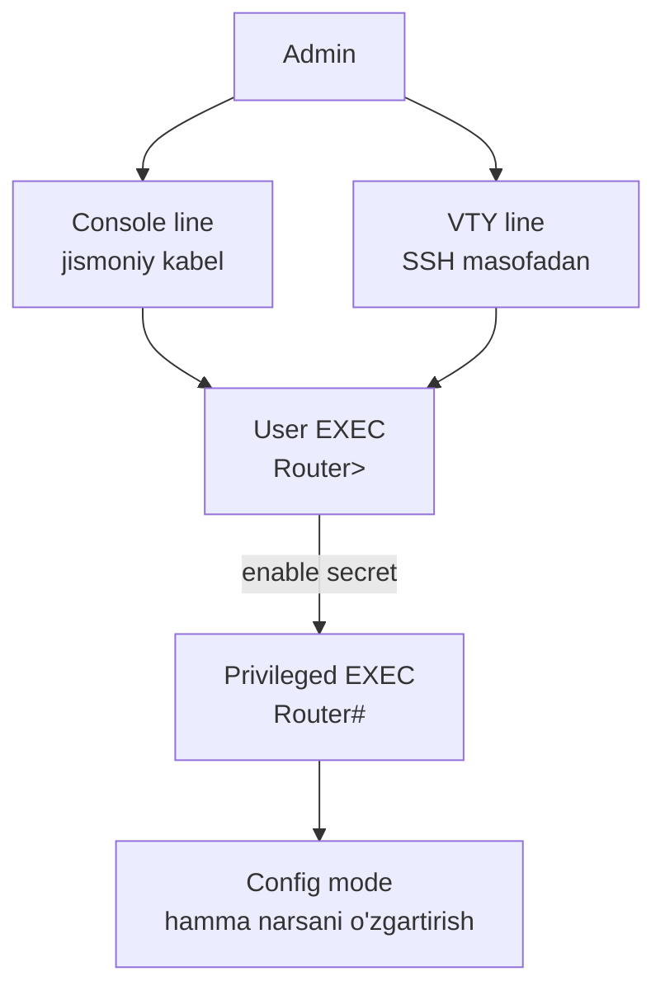
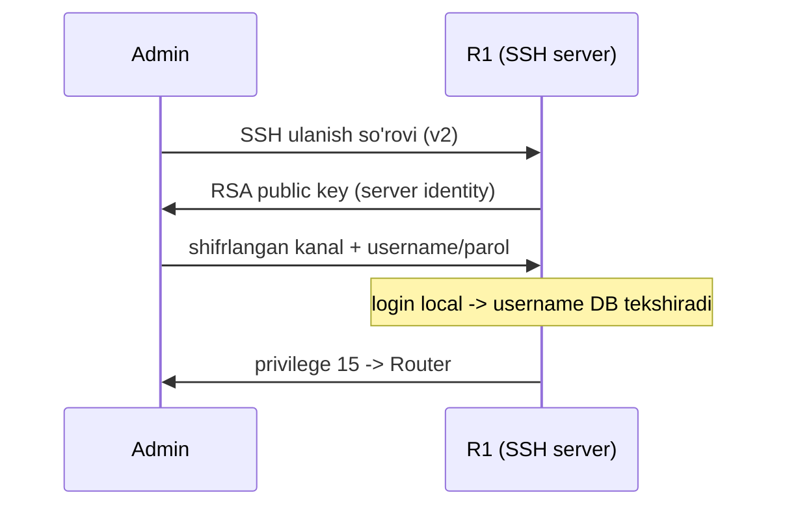

# 04. Device Access Security

## Muammo: qurilmaning o'zi qulf ostidami?

Sen ACL yozding, firewall qo'yding, tarmoqni segmentladin. Lekin bir savol
qoldi: attacker **router yoki switch'ning o'ziga** kirib olsa nima bo'ladi?

Javob: **hammasi tugadi.** Qurilma CLI'siga kirgan odam ACL'ni o'chiradi,
VLAN'larni o'zgartiradi, trafikni o'ziga yo'naltiradi. Ya'ni sening barcha
himoyalaring — o'sha bitta qurilmaga kirish parolidan zaifroq emas.

> Qurilma boshqaruvini himoyalash — xavfsizlikning **birinchi** bosqichi.
> Uni sozlamasdan qolgan hamma narsa qumga qurilgan devor.

Bu darsda qurilmaga kirishning barcha yo'llarini (console, VTY, enable)
qanday qulflashni o'rganamiz.

---

## Analogiya: bino kaliti va nazorat jurnali

Qurilmani **serverxona** deb tasavvur qil:

- **Console line** = eshik oldidagi jismoniy kalit (qo'lda kirish).
- **VTY line** = masofadan ochish paneli (SSH/Telnet).
- **Privileged EXEC** (`enable`) = eng maxfiy xonaga kirish (to'liq admin).
- **Banner** = eshikdagi "Ruxsatsiz kirish taqiqlanadi" yozuvi.
- **Logging + NTP** = kim qachon kirganini yozib boradigan kamera.

Har bir yo'l alohida qulflanadi. Bittasini unutsang — teshik qoladi.

---

## Kirish nuqtalari



Uch daraja: `Router>` (user) → `Router#` (privileged) → `config` (o'zgartirish).
Har o'tishda parol so'raladi.

---

## 1-qadam: minimal himoya

```cisco
conf t
! --- enable secret: privileged mode paroli (kuchli hash bilan) ---
enable secret Str0ngEnableSecret

! --- running-config dagi oddiy parollarni yashir ---
service password-encryption

! --- console line himoyasi ---
line console 0
 password ConsolePass123
 login
 exec-timeout 5 0
 logging synchronous

! --- VTY line: faqat SSH ---
line vty 0 4
 password VtyPass123
 login
 exec-timeout 5 0
 transport input ssh
end
```

Nima nima qiladi:

- `enable secret` — `enable password`dan **kuchliroq** (hash bilan saqlanadi).
  Amalda doim `enable secret` ishlat.
- `service password-encryption` — kuchli kripto emas, lekin config'da
  parollarni ochiq matnda qoldirmaydi.
- `exec-timeout 5 0` — 5 daqiqa harakatsizlikdan keyin sessiya yopiladi.
- `transport input ssh` — Telnet'ni o'chiradi (faqat SSH).

---

## 2-qadam: local user bilan login

Bitta umumiy parol emas — **har admin uchun alohida user**. Bu accounting
(kim nima qildi) uchun ham muhim.

```cisco
conf t
! Zamonaviy kuchli hash: algorithm-type sha256 (Type-8)
username admin privilege 15 algorithm-type sha256 secret AdminSecret123
username netops privilege 5 algorithm-type sha256 secret NetopsSecret123
line vty 0 4
 login local
 transport input ssh
end
```

**Privilege level** — foydalanuvchi nima qila olishini belgilaydi:

| Level | Ma'nosi |
|---|---|
| `0` | Juda cheklangan |
| `1` | User EXEC (`Router>`) |
| `15` | To'liq admin |

> 2025 best practice: parollarni **Type-8 (PBKDF2-SHA-256)** yoki
> undan ham kuchli **Type-9 (scrypt)** bilan saqlash. Eski Type-7
> (`service password-encryption`) osongina qaytariladi (reversible).

---

## 3-qadam: SSH sozlash

SSH uchun 3 narsa kerak: **hostname**, **domain name**, **RSA key**.

```cisco
conf t
! --- 1-qadam: hostname va domain (key nomi shundan tuziladi) ---
hostname R1
ip domain-name example.local

! --- 2-qadam: RSA kalit yaratish (kamida 2048 bit) ---
crypto key generate rsa modulus 2048

! --- 3-qadam: SSHv2 majburla, timeout va retry cheklovi ---
ip ssh version 2
ip ssh time-out 60
ip ssh authentication-retries 3

! --- 4-qadam: user va VTY ---
username admin privilege 15 algorithm-type sha256 secret AdminSecret123
line vty 0 4
 login local
 transport input ssh
end
```

Zamonaviy hardening: zaif cipher'larni olib tashlab, kuchli MAC majburla:

```cisco
conf t
no ip ssh server algorithm encryption 3des-cbc
ip ssh server algorithm mac hmac-sha2-256 hmac-sha2-512
ip ssh dh-min-size 2048
end
```

Tekshirish:

```cisco
show ip ssh          ! versiya, timeout, algoritmlar
show ssh             ! aktiv SSH sessiyalar
show users           ! kim ulangan
```



---

## Management ACL: kimdan SSH qilinsin?

SSH'ni faqat admin subnetdan ruxsat berish (3-darsdagi ACL bilan bog'lash):

```cisco
conf t
ip access-list standard SSH_MGMT
 permit 10.10.10.0 0.0.0.255
 deny any log
line vty 0 4
 access-class SSH_MGMT in
end
```

Bu ACL faqat **qurilmaga SSH qilishni** cheklaydi. Router orqali o'tayotgan
oddiy trafikni filtrlamaydi (u interfeys ACL'i vazifasi).

---

## Login protection: brute-force'ni sekinlashtirish

```cisco
conf t
security passwords min-length 10
login block-for 120 attempts 3 within 60
login delay 2
login on-failure log
login on-success log
end
```

Ma'nosi:

- `min-length 10` — parol kamida 10 belgi.
- `block-for 120 attempts 3 within 60` — 60s ichida 3 xato bo'lsa,
  120s bloklash ("quiet mode").
- `login on-failure log` — har xato loginni logga yozadi.

---

## Banner: legal ogohlantirish

```cisco
conf t
banner motd #
Unauthorized access is prohibited.
All activities may be monitored.
#
end
```

> ⚠️ Bannerda qurilma modeli, joylashuvi, IP yoki admin ismini **yozma**.
> Bu attacker uchun reconnaissance ma'lumot bo'ladi. "Welcome to R1 in
> Data Center 2" — yomon banner.

---

## Keraksiz xizmatlarni o'chirish

```cisco
conf t
no ip http server
no ip http secure-server
no service tcp-small-servers
no service udp-small-servers
no ip source-route
end
```

CDP/LLDP — ichki tarmoqda foydali, lekin **untrusted** portlarda ortiqcha
ma'lumot chiqaradi:

```cisco
conf t
interface g0/1
 no cdp enable
 no lldp transmit
 no lldp receive
end
```

---

## NTP va logging: incident uchun vaqt

Buzilish tekshirilganda vaqt to'g'ri bo'lishi shart — aks holda loglar
foydasiz.

```cisco
conf t
clock timezone UZT 5
ntp server 10.10.10.5
logging host 10.10.10.20
logging trap informational
service timestamps log datetime msec
end
```

Tekshirish:

```cisco
show clock
show ntp status
show logging
```

---

## Configuration backup

Running config'ni saqlash — buzilishdan tez tiklanish uchun:

```cisco
copy running-config startup-config     ! reboot'da yo'qolmasin
copy running-config tftp:               ! tashqi backup
```

---

## Ko'p uchraydigan xatolar

⚠️ **Xato 1: `transport input telnet ssh` qoldirish.**
Telnet parolni ochiq matnda yuboradi (sniffing oson). Faqat `transport
input ssh` yoz. SSH sozlansa, Telnet avtomatik o'chadi.

⚠️ **Xato 2: RSA key yaratmasdan SSH ishlatmoqchi bo'lish.**
SSH shifrlangan kanal uchun kalit kerak. `crypto key generate rsa`siz
SSH ishga tushmaydi.

⚠️ **Xato 3: `login local` yozmasdan username yaratish.**
Username DB bo'lsa-yu, `login local` bo'lmasa, VTY hech qachon o'sha DB'ni
ishlatmaydi.

⚠️ **Xato 4: domain name sozlamasdan `crypto key generate rsa`.**
Kalit nomi `hostname.domain` dan tuziladi. Domain yo'q bo'lsa, xato beradi.

⚠️ **Xato 5: VTY ACL'da o'z admin IP'ini unutib, o'zini bloklash.**
`access-class` da o'z tarmog'ingni permit qilmasang, keyin qurilmaga
kira olmaysan. Console orqali tiklashga to'g'ri keladi.

---

## Xulosa

- Qurilma boshqaruvini himoyalash — xavfsizlikning birinchi bosqichi.
- Uch kirish: **console** (jismoniy), **VTY** (masofa), **enable** (admin).
- `enable secret` > `enable password`; zamonaviy hash **Type-8/Type-9**.
- SSH uchun **hostname + domain + RSA key** kerak; `transport input ssh` bilan
  Telnet o'chadi.
- **Management ACL** (`access-class`) SSH'ni faqat admin subnetdan ruxsat qiladi.
- **login block-for** brute-force'ni sekinlashtiradi; **NTP + logging**
  incident tahlili uchun shart.

## 🧠 Eslab qol

- `transport input ssh` = Telnet o'ldi, faqat shifrlangan kirish.
- SSH = hostname + domain + RSA key (aks holda ishlamaydi).
- `login local` bo'lmasa, username DB ishlatilmaydi.
- Type-7 (service password-encryption) qaytariladi; Type-8/9 emas.
- Bannerda hech qachon qurilma/IP/joy ma'lumotini yozma.

## ✅ O'z-o'zini tekshir (retrieval practice)

<details>
<summary>1. `enable password` va `enable secret` farqi nima, qaysi biri ishlatiladi?</summary>

`enable secret` kuchliroq hash bilan saqlanadi va `enable password`dan
ustun turadi (ikkalasi bo'lsa secret ishlaydi). `enable password` zaif.
Amalda **doim `enable secret`** ishlat, iloji bo'lsa Type-8/Type-9 bilan.
</details>

<details>
<summary>2. SSH ishlamayapti. Qaysi 4 narsani ketma-ket tekshirasan?</summary>

(1) `show ip ssh` — SSH yoqilganmi, versiya 2mi. (2) hostname va domain-name
sozlanganmi. (3) RSA key yaratilganmi (`crypto key generate rsa`).
(4) `line vty` ichida `login local` va `transport input ssh` bormi, hamda
management ACL o'z IP'ingni bloklamayaptimi.
</details>

<details>
<summary>3. Nega console portga ham parol kerak? U jismoniy-ku?</summary>

Aynan jismoniy kirish bo'lgani uchun. Kimdir serverxonaga kirsa, console
kabel ulab, parolsiz to'g'ridan-to'g'ri config mode'ga tushadi va hamma
himoyani o'chira oladi. Jismoniy xavfsizlik ham xavfsizlikning bir qatlami.
</details>

<details>
<summary>4. `service password-encryption` parollarni to'liq himoya qiladimi?</summary>

Yo'q. U Type-7 shifrlash ishlatadi, bu osongina **qaytariladi** (reversible) —
onlayn dekoderlar mavjud. U faqat "yelka orqali qarash"dan (shoulder surfing)
himoya qiladi. Haqiqiy himoya uchun `secret` (Type-8/Type-9 hash) ishlat.
</details>

<details>
<summary>5. VTY management ACL'ni sozlaganda eng xavfli xato nima?</summary>

O'z admin tarmog'ing IP'ini `permit` qilishni unutish. Shunda `access-class`
seni ham bloklaydi va qurilmaga SSH qila olmaysan — faqat console orqali
tiklashga to'g'ri keladi. Har doim o'z manzilingni ro'yxatga qo'sh.
</details>

## 🛠 Amaliyot

1. **Oson (Modify):** Yuqoridagi SSH sozlash misolida `modulus 2048` ni
   `4096` ga o'zgartir va nega kattaroq kalit yaxshiroqligini bir jumlada yoz.

2. **O'rta (Faded example):** SSH-only management skeletonini to'ldir:
   ```cisco
   conf t
   hostname R1
   ip domain-name ___                  ! TODO: example.local
   crypto key generate rsa modulus ___ ! TODO: 2048
   ip ssh version ___                  ! TODO: 2
   username admin privilege 15 secret AdminPass1
   line vty 0 4
    login ___                          ! TODO: username DB ishlatish
    transport input ___                ! TODO: faqat SSH
   end
   ```
   <details><summary>Hint</summary>
   `example.local`, `2048`, `version 2`, `login local`, `transport input ssh`.
   </details>

3. **Qiyin (Make):** Yangi switch uchun to'liq "management hardening"
   konfiguratsiyasini noldan yoz: enable secret, local admin (Type-8),
   SSH-only, management ACL (10.10.10.0/24), login block-for, banner, NTP.
   <details><summary>Hint</summary>
   Tartib: hostname/domain → RSA key → enable secret → username sha256 →
   VTY (login local + transport ssh + access-class) → login block-for →
   banner motd → ntp server. Oxirida `copy run start`.
   </details>

## 🔁 Takrorlash

- **Bog'liq darslar:** [01. Security concepts](./01-security-concepts-va-hujumlar.md),
  [03. ACL](./03-acl.md) (management ACL),
  [05. AAA, RADIUS, TACACS+](./05-aaa-radius-tacacs.md) (markazlashgan login).
- **Takrorlash jadvali:** ertaga → 3 kundan keyin → 1 haftadan keyin
  savollarga qayt.
- **Feynman testi:** 3 jumlada tushuntir: "SSH nima uchun Telnet'dan xavfsiz,
  va uni yoqish uchun qanday 3 narsa kerak?"

## 📚 Manbalar

- [Cisco — Harden IOS Devices](https://www.cisco.com/c/en/us/support/docs/ip/access-lists/13608-21.html)
- [Cisco Community — Guide to better SSH-Security](https://community.cisco.com/t5/security-knowledge-base/guide-to-better-ssh-security/ta-p/3133344)
- [Cisco IOS Hardening Guide — Baseline 2026](https://focus.vpnetworks.co.uk/blog/cisco-ios-hardening-guide.html)
