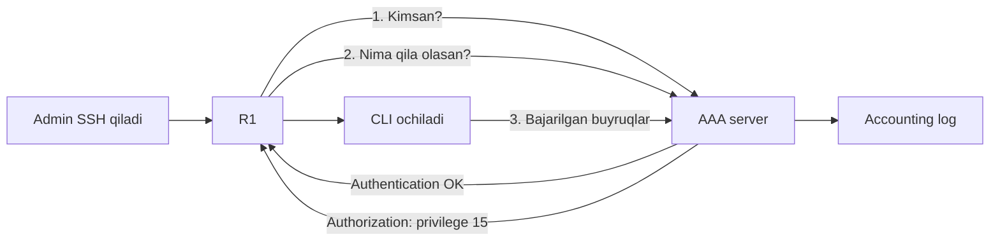
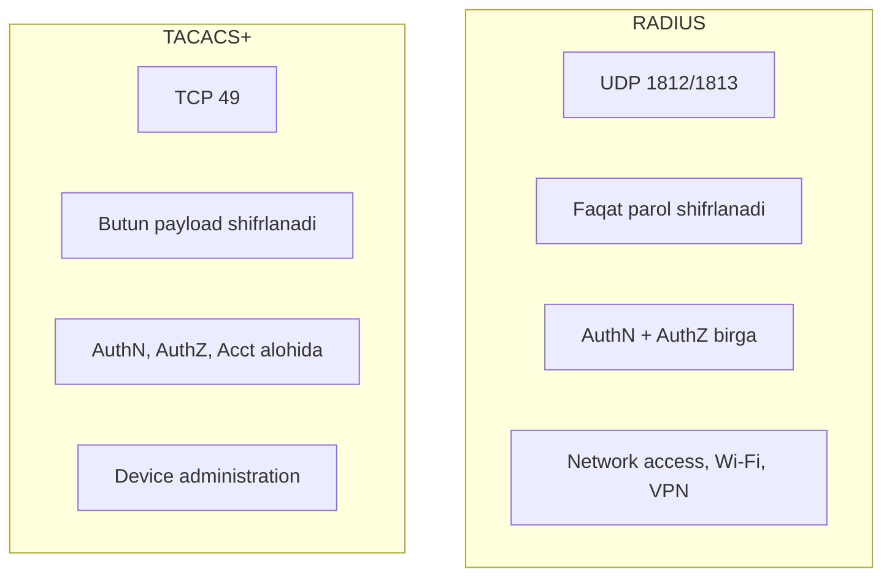

# 05. AAA, RADIUS, TACACS+

## Muammo: 500 ta qurilmada parolni qanday boshqarasan?

Oldingi darsda har qurilmada **local user** yaratdik. Bu 2-3 ta qurilma
uchun yaxshi. Lekin tasavvur qil: kompaniyada **500 ta** router va switch bor.

Yangi admin ishga kirdi — 500 ta qurilmaga alohida user qo'shasanmi?
Admin ishdan bo'shadi — 500 ta joydan userni o'chirasanmi? Parol
almashtirilishi kerak — 500 marta? Bu **imkonsiz** va **xavfli**: bittasini
unutasan, teshik qoladi.

> Yechim: **markazlashtirish**. Bitta serverda hamma user, parol va huquq.
> Har qurilma login paytida shu serverdan so'raydi. Bu — **AAA**.

Bu darsda AAA nima ekanini va uni yetkazadigan ikki protokol —
**RADIUS** va **TACACS+** ni o'rganamiz.

---

## Analogiya: kompaniya propuski

AAA'ni **kompaniya kirish propuski tizimi** deb tasavvur qil:

- **Authentication** (kimsan?) = propuskni o'quvchiga qo'yasan, tizim seni
  taniydi.
- **Authorization** (nima qila olasan?) = propuskingda qaysi xonalarga
  kirish ruxsati borligini belgilaydi.
- **Accounting** (nima qilding?) = tizim qachon kirding, qaysi xonaga
  o'tding — hammasini yozib boradi.

Uchtasi bitta markaziy tizimda. Yangi xodim — bitta joyda qo'shiladi,
hamma eshikda ishlaydi.

---

## AAA nima?



| A | To'liq nomi | Savol | Misol |
|---|---|---|---|
| **Authentication** | Autentifikatsiya | Kimsan? | Login/parol, token, sertifikat |
| **Authorization** | Avtorizatsiya | Nima qila olasan? | Faqat `show` yoki to'liq admin |
| **Accounting** | Hisobga olish | Nima qilding? | Login va buyruqlar logi |

Oddiy oqim: Admin SSH qiladi → R1 AAA serverdan tekshiradi → ruxsat bo'lsa
CLI ochiladi → bajarilgan buyruqlar accounting'ga yoziladi.

---

## RADIUS va TACACS+: ikki protokol

AAA — bu **g'oya**. Uni server bilan qurilma orasida yetkazadigan ikki
**protokol** bor: RADIUS va TACACS+.



| Xususiyat | RADIUS | TACACS+ |
|---|---|---|
| Transport | UDP | TCP |
| Port | UDP 1812/1813 | TCP 49 |
| Shifrlash | Faqat parol qismi | **Butun payload** |
| AAA ajratilishi | AuthN va AuthZ ko'proq birga | Uchalasi alohida |
| Egasi | Ochiq standart (RFC) | Cisco (endi ochiq) |
| Asosiy ishlatilishi | Network access, Wi-Fi, VPN | Device administration |

CCNA uchun eslab qol:

- **Wi-Fi 802.1X va VPN** → RADIUS (7 va 8-darslarda ko'ramiz).
- **Router/switch admin access** → TACACS+.

> Nega device administration uchun TACACS+? Chunki u **butun payload'ni
> shifrlaydi** (RADIUS faqat parolni) va **har buyruqni alohida
> avtorizatsiya** qila oladi — masalan "bu admin faqat `show` buyruqlarini
> ishlatsin". Cisco ISE ham aynan shu maqsadda TACACS+ ishlatadi.

---

## AAA yoqish

AAA global rejimda yoqiladi:

```cisco
conf t
aaa new-model
end
```

> ⚠️ Diqqat: `aaa new-model` mavjud login usullarini o'zgartiradi.
> Masofadan (SSH orqali) ishlayotgan bo'lsang, **local fallback** tayyor
> bo'lsin — aks holda o'zingni bloklab qo'yishing mumkin.

---

## Worked example: TACACS+ (local fallback bilan)

```cisco
conf t
! --- 1-qadam: AAA yoqish ---
aaa new-model

! --- 2-qadam: MAJBURIY zaxira local admin (server o'lsa ham kirasan) ---
username localadmin privilege 15 secret LocalAdminSecret123

! --- 3-qadam: TACACS+ serverni ta'riflash ---
tacacs server TAC1
 address ipv4 10.10.10.30
 key TacacsSharedKey123

! --- 4-qadam: serverlarni guruhga yig'ish ---
aaa group server tacacs+ TAC-GROUP
 server name TAC1

! --- 5-qadam: AAA metodlarini belgilash (avval server, keyin local) ---
aaa authentication login default group TAC-GROUP local
aaa authorization exec default group TAC-GROUP local
aaa accounting exec default start-stop group TAC-GROUP

! --- 6-qadam: VTY ga bog'lash ---
line vty 0 4
 login authentication default
 transport input ssh
end
```

`group TAC-GROUP local` ning ma'nosi: **avval** TACACS+ serverdan
tekshiradi, server ishlamasa **local** userga tushadi. Bu — hayotni
saqlaydigan qator.

Tekshirish:

```cisco
show aaa servers
show tacacs
test aaa group tacacs+ admin AdminPassword legacy
```

---

## RADIUS varianti

```cisco
conf t
aaa new-model
username localadmin privilege 15 secret LocalAdminSecret123

radius server RAD1
 address ipv4 10.10.10.40 auth-port 1812 acct-port 1813
 key RadiusSharedKey123

aaa group server radius RAD-GROUP
 server name RAD1

aaa authentication login default group RAD-GROUP local
aaa authorization exec default group RAD-GROUP local
aaa accounting exec default start-stop group RAD-GROUP

line vty 0 4
 login authentication default
 transport input ssh
end
```

Ko'rib turibsan: struktura bir xil, faqat `radius`/`tacacs+` va portlar farq qiladi.

---

## Method list: qaysi login qaysi usul bilan?

**Method list** — qaysi kirish uchun qaysi tekshiruv usuli ishlatilishini
belgilaydi. Ikki turi bor:

**Default** — nomi `default`, avtomatik hamma line'ga qo'llanadi:

```cisco
aaa authentication login default group TAC-GROUP local
```

**Named** — nomlangan, kerakli line'ga qo'lda bog'lanadi:

```cisco
aaa authentication login SSH_LOGIN group TAC-GROUP local
line vty 0 4
 login authentication SSH_LOGIN
```

Console'ni alohida qilish mumkin (masalan console'da faqat local):

```cisco
aaa authentication login CONSOLE_LOGIN local
line console 0
 login authentication CONSOLE_LOGIN
```

> ⚠️ Named method list yaratildi-yu, `line` ga bog'lanmasa — ishlamaydi.
> Bu klassik xato.

---

## Authorization va Accounting chuqurroq

**Command authorization** — TACACS+ ning kuchli tomoni. Har buyruqni
serverdan so'rab, ruxsat berilganini tekshiradi:

```cisco
! Exec shell ochishga ruxsat
aaa authorization exec default group TAC-GROUP local

! Privilege 15 buyruqlarini avtorizatsiya
aaa authorization commands 15 default group TAC-GROUP local
```

> ⚠️ Command authorization production'da foydali, lekin noto'g'ri sozlansa
> adminni kerakli buyruqdan **mahrum** qiladi. Ehtiyot bo'l, local
> fallback tayyor tur.

**Accounting** — kim nima qildi:

```cisco
! Login sessiyalarini yozish
aaa accounting exec default start-stop group TAC-GROUP

! Privilege 15 buyruqlarini yozish
aaa accounting commands 15 default start-stop group TAC-GROUP
```

Accounting **audit** va **troubleshooting** uchun juda muhim: "kecha kim
`shutdown` qildi?" degan savolga javob beradi.

---

## Troubleshooting

```cisco
! Serverga yetib boryapmizmi?
ping 10.10.10.30
traceroute 10.10.10.30

! AAA holati
show running-config | section aaa
show aaa servers
show tacacs
show radius statistics

! Sinov
test aaa group tacacs+ admin AdminPassword legacy
test aaa group radius admin AdminPassword legacy

! Debug (ehtiyotkorlik bilan!)
debug aaa authentication
debug tacacs
undebug all
```

---

## Ko'p uchraydigan xatolar

⚠️ **Xato 1: `aaa new-model`dan oldin local admin yaratmaslik.**
Server yetib bormasa yoki xato bo'lsa — o'zingni bloklab qo'yasan.
Doim avval `username localadmin ... secret ...` yarat.

⚠️ **Xato 2: `local` fallback qo'shmaslik.**
`aaa authentication login default group TAC-GROUP` (local'siz) — server
o'lsa hech kim kira olmaydi. Oxiriga `local` qo'sh.

⚠️ **Xato 3: shared key mos emas.**
Router'da `key TacacsSharedKey123`, serverda boshqacha — autentifikatsiya
ishlamaydi. Ikkalasi **aynan** bir xil bo'lishi shart.

⚠️ **Xato 4: RADIUS/TACACS+ portlari firewall'da bloklangan.**
UDP 1812/1813 (RADIUS) yoki TCP 49 (TACACS+) yopiq bo'lsa, so'rov yetib bormaydi.

⚠️ **Xato 5: qurilma source IP serverda ruxsat etilmagan.**
AAA server har NAS (qurilma) ni IP bo'yicha taniydi. Ro'yxatda bo'lmasa rad etadi.

⚠️ **Xato 6: NTP noto'g'ri — accounting vaqti chalkash.**
Log va accounting foydali bo'lishi uchun vaqt to'g'ri bo'lsin.

---

## Xulosa

- **AAA** = Authentication (kimsan?) + Authorization (nima qila olasan?)
  + Accounting (nima qilding?).
- AAA login, huquq va auditni **markazlashtiradi** — 500 qurilma uchun
  bitta joyda boshqariladi.
- **RADIUS**: UDP, faqat parol shifrlanadi, AuthN+AuthZ birga → network
  access, Wi-Fi, VPN.
- **TACACS+**: TCP, butun payload shifrlanadi, AAA alohida, per-command
  authorization → device administration.
- `aaa new-model` yoqilganda **local fallback** shart — aks holda server
  o'lsa bloklanasan.
- `group ... local` = avval server, keyin local user.

## 🧠 Eslab qol

- RADIUS = UDP + faqat parol shifr; TACACS+ = TCP + butun payload shifr.
- Wi-Fi/VPN -> RADIUS; router/switch admin -> TACACS+.
- Har doim local fallback yarat, aks holda o'zingni bloklaysan.
- Shared key ikki tomonda aynan bir xil bo'lsin.
- Accounting = "kim nima qildi" auditi.

## ✅ O'z-o'zini tekshir (retrieval practice)

<details>
<summary>1. AAA server o'lib qolsa, qurilmaga kira olamanmi?</summary>

Method list'da `local` fallback bo'lsa **va** local user mavjud bo'lsa — ha.
Masalan `aaa authentication login default group TAC-GROUP local` da server
yetib bormasa, `local` userga tushadi. Fallback bo'lmasa — bloklanasan.
</details>

<details>
<summary>2. Device administration uchun nega TACACS+ RADIUS'dan afzal?</summary>

Ikki sabab: (1) TACACS+ **butun payload'ni** shifrlaydi (RADIUS faqat
parolni), demak buyruqlar ham maxfiy. (2) TACACS+ **per-command
authorization** qila oladi — "bu admin faqat `show` ishlatsin" deb aniq
cheklash mumkin. RADIUS'da AuthN va AuthZ birlashgan, bunday nozik nazorat qiyin.
</details>

<details>
<summary>3. `group RAD-GROUP local` va `group RAD-GROUP` farqi nima?</summary>

`group RAD-GROUP local` — avval RADIUS serveridan tekshiradi, server yetib
bormasa (yoki javob bermasa) local userga tushadi. `group RAD-GROUP`
(local'siz) — faqat server, u o'lsa hech kim kira olmaydi. Ikkinchisi xavfli.
</details>

<details>
<summary>4. RADIUS portlari qaysi, TACACS+ chi?</summary>

RADIUS: UDP **1812** (authentication) va **1813** (accounting). TACACS+:
TCP **49**. Firewall bularni bloklamasligi kerak, aks holda AAA ishlamaydi.
</details>

<details>
<summary>5. Named method list yaratdim, lekin ishlamayapti. Nima unutdim?</summary>

Uni `line` ga **bog'lashni**. Masalan `aaa authentication login SSH_LOGIN
group TAC-GROUP local` yaratsang-u, `line vty 0 4` ostida `login
authentication SSH_LOGIN` yozmasang — u qo'llanmaydi. Default method list
avtomatik qo'llanadi, named esa qo'lda bog'lanishi kerak.
</details>

## 🛠 Amaliyot

1. **Oson (Modify):** Yuqoridagi TACACS+ misolini RADIUS'ga o'zgartir:
   `tacacs server` o'rniga `radius server` va to'g'ri portlar bilan.

2. **O'rta (Faded example):** AAA skeletonini to'ldir:
   ```cisco
   conf t
   aaa new-model
   username localadmin privilege 15 secret Backup1   ! zaxira admin
   tacacs server TAC1
    address ipv4 10.10.10.30
    key ___                                          ! TODO: shared key
   aaa group server tacacs+ TAC-GROUP
    server name TAC1
   aaa authentication login default group TAC-GROUP ___  ! TODO: fallback
   line vty 0 4
    login authentication ___                         ! TODO: qaysi method list
   end
   ```
   <details><summary>Hint</summary>
   `key TacacsSharedKey123`, oxiriga `local` fallback, `login authentication default`.
   </details>

3. **Qiyin (Make):** Kompaniya siyosati: (a) admin'lar TACACS+ orqali kirsin
   va faqat privilege 15 buyruqlar accounting'ga yozilsin, (b) console faqat
   local user bilan ishlasin (server ishtiroksiz), (c) server o'lsa ham
   kirish saqlanib qolsin. Shu uchta talabga to'liq AAA konfiguratsiyasini
   noldan yoz.
   <details><summary>Hint</summary>
   Named `CONSOLE_LOGIN local` console'ga; `default group TAC-GROUP local`
   VTY'ga; `aaa accounting commands 15 default start-stop group TAC-GROUP`;
   `username localadmin ... secret ...`.
   </details>

## 🔁 Takrorlash

- **Bog'liq darslar:** [04. Device access security](./04-device-access-security.md)
  (local login), [07. Wireless security](./07-wireless-security.md) (RADIUS 802.1X),
  [08. VPN va IPsec](./08-vpn-ipsec.md) (remote access AAA).
- **Takrorlash jadvali:** ertaga → 3 kundan keyin → 1 haftadan keyin
  savollarga qayt.
- **Feynman testi:** 3 jumlada tushuntir: "AAA nima, va nega TACACS+ ni
  qurilma boshqaruvi uchun tanlaymiz?"

## 📚 Manbalar

- [Cisco — Compare TACACS+ and RADIUS](https://www.cisco.com/c/en/us/support/docs/security-vpn/remote-authentication-dial-user-service-radius/13838-10.html)
- [Cisco ISE Mastery — TACACS+ Overview & Use Cases](https://networkjourney.com/day-12-cisco-ise-mastery-training-tacacs-overview-use-cases/)
- [Rublon — RADIUS vs TACACS+](https://rublon.com/blog/radius-vs-tacacs/)
