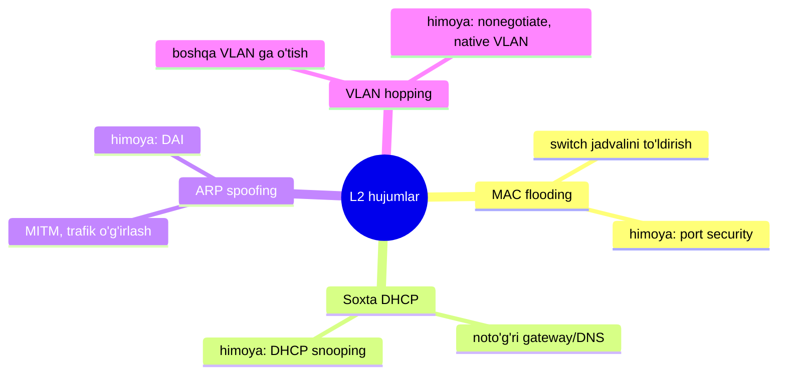
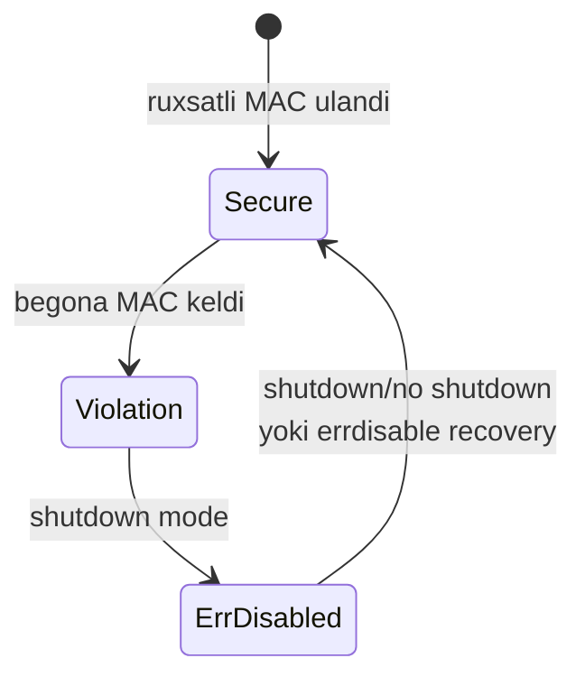
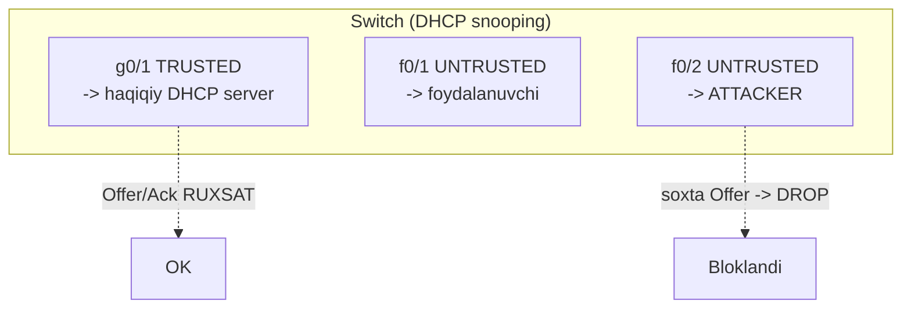
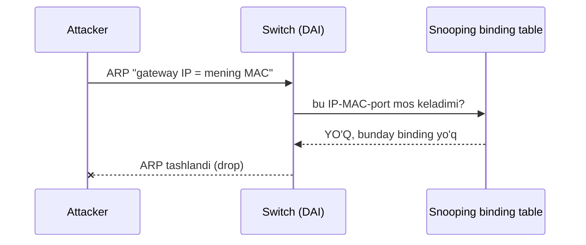

# 06. Layer 2 Security

## Muammo: dushman allaqachon ichkarida

Hozirgacha biz tarmoq **chegarasi** (firewall, ACL) va **qurilma
boshqaruvi**ni himoyaladik. Lekin bir haqiqat bor: eng xavfli hujumlar
ko'pincha **LAN ichida**, oddiy switch portidan boshlanadi.

Tasavvur qil: ofisda bo'sh stol, unda tarmoq roseti. Kimdir laptopini
ulaydi va:

- **soxta DHCP server** ishga tushiradi — hamma foydalanuvchini o'zi
  orqali yo'naltiradi;
- **ARP spoofing** qiladi — "gateway MAC — bu men" deb hammaning trafigini
  o'g'irlaydi;
- **MAC flooding** qiladi — switch jadvalini to'ldirib, uni "hub"ga aylantiradi.

Layer 2'da IP darajasidagi himoyalar (ACL, firewall) hali ishlamaydi. Bu
yerda alohida qurollar kerak.

> Layer 2 xavfsizligi — switch portidagi qulf. Port ochiq qolsa, boshqa
> hamma himoya chetlab o'tiladi.

---

## Analogiya: bino ichidagi soxta xodim

L2 hujumlarini **binoga soxta xodim kirib olishi** deb tasavvur qil:

- **Port security** = har stolga faqat bitta ruxsatli xodim o'tirsin
  (bitta MAC).
- **DHCP snooping** = "bo'lim raqamlarini" faqat rasmiy kotib (haqiqiy DHCP
  server) tarqatsin, soxta odam emas.
- **DAI** = "men falonchiman" degan har bir da'voni (ARP) rasmiy ro'yxat
  bilan solishtir.
- **VLAN himoyasi** = bir bo'lim xodimi ruxsatsiz boshqa bo'limga o'ta olmasin.

---

## L2 hujumlari xaritasi



---

## 1. Port Security

**Port security** — access portda ruxsat etilgan **MAC manzillar** sonini
va o'zini cheklaydi. Bu MAC flooding va ruxsatsiz ulanishga qarshi.

```cisco
conf t
interface f0/10
 ! --- 1-qadam: portni access rejimga qo'y ---
 switchport mode access
 switchport access vlan 10
 ! --- 2-qadam: port security yoq ---
 switchport port-security
 ! --- 3-qadam: faqat 1 ta MAC ga ruxsat ---
 switchport port-security maximum 1
 ! --- 4-qadam: MAC ni avtomatik "sticky" o'rgan ---
 switchport port-security mac-address sticky
 ! --- 5-qadam: qoida buzilsa portni o'chir ---
 switchport port-security violation shutdown
end
```

**Violation mode** — qoida buzilganda nima bo'ladi:

| Mode | Nima qiladi | Log |
|---|---|---|
| **shutdown** | Port err-disabled bo'ladi (eng qat'iy) | Ha |
| **restrict** | Trafik bloklanadi, port ishlaydi | Ha |
| **protect** | Trafik bloklanadi | Kamroq |



Tekshirish va tiklash:

```cisco
show port-security
show port-security interface f0/10
show interfaces status err-disabled

! Err-disabled portni qo'lda tiklash
interface f0/10
 shutdown
 no shutdown
```

Avtomatik recovery:

```cisco
conf t
errdisable recovery cause psecure-violation
errdisable recovery interval 300
end
```

---

## 2. DHCP Snooping

### Muammo: soxta DHCP server

DHCP jarayoni (**DORA**: Discover-Offer-Request-Acknowledge) hech qanday
autentifikatsiyasiz ishlaydi. Attacker soxta DHCP server qo'yib,
foydalanuvchilarga **o'zining IP'ini gateway** qilib beradi — natijada
hamma trafik u orqali o'tadi (MITM).

### Yechim

**DHCP snooping** — switch portlarni **trusted** va **untrusted**ga ajratadi:

- **Trusted port** — haqiqiy DHCP server yoki uplink tomoni. DHCP
  Offer/Ack shu yerdan kelishi mumkin.
- **Untrusted port** — foydalanuvchi portlari. Bu portdan DHCP Offer/Ack
  kelsa — **bloklanadi** (soxta server demak).



```cisco
conf t
! --- 1-qadam: global va VLAN darajada yoq ---
ip dhcp snooping
ip dhcp snooping vlan 10,20

! --- 2-qadam: DHCP serverga boradigan uplinkni TRUSTED qil ---
interface g0/1
 description Uplink-to-DHCP-server
 ip dhcp snooping trust

! --- 3-qadam: foydalanuvchi portlarida rate limit ---
interface range f0/1 - 24
 ip dhcp snooping limit rate 10
end
```

Tekshirish:

```cisco
show ip dhcp snooping
show ip dhcp snooping binding      ! IP-MAC-port jadvali
show ip dhcp snooping statistics
```

> Muhim: DHCP snooping **binding table** yaratadi (IP + MAC + port + VLAN).
> Bu jadval keyingi himoya — DAI uchun asos bo'ladi.

---

## 3. Dynamic ARP Inspection (DAI)

### Muammo: ARP ishonchsiz

IPv4 lokal tarmoqda MAC topish uchun **ARP**ga tayanadi. ARP autentifikatsiya
qilmaydi — attacker "Gateway IP menman, MAC mana shu" deb yolg'on ARP reply
yuborsa, hamma unga ishonadi. Bu — klassik **MITM**.

### Yechim

**DAI** har ARP paketni **DHCP snooping binding table** bilan solishtiradi.
Jadvalda "bu IP — bu MAC — bu port" degan yozuv bo'lmasa, ARP tashlanadi.



```cisco
conf t
! DHCP snooping bo'lishi SHART (DAI unga tayanadi)
ip dhcp snooping
ip dhcp snooping vlan 10
ip arp inspection vlan 10

! Uplinklarni trusted qil
interface g0/1
 description Uplink
 ip dhcp snooping trust
 ip arp inspection trust

! Foydalanuvchi portlarida rate limit
interface range f0/1 - 24
 ip arp inspection limit rate 15
end
```

Statik IP ishlatadigan hostlar uchun (DHCP olmaydi) **ARP ACL** kerak:

```cisco
conf t
arp access-list STATIC_HOSTS
 permit ip host 192.168.10.50 mac host 0011.2233.4455
ip arp inspection filter STATIC_HOSTS vlan 10
end
```

Tekshirish:

```cisco
show ip arp inspection
show ip arp inspection statistics
show ip dhcp snooping binding
```

> Trust chegarasi qoidasi: DAI'ni **access layer**da yoq, `trust`ni faqat
> boshqa switch va distribution'ga boradigan uplinklarga qo'y.

---

## 4. VLAN Hopping himoyasi

**VLAN hopping** — attacker o'z VLAN'idan boshqa VLAN'ga o'tishga urinadi.
Ikki asosiy usul: **switch spoofing** (o'zini switch qilib ko'rsatib trunk
ochish) va **double tagging**. Himoya:

```cisco
conf t
! --- Access portlarda trunk negotiation'ni o'chir ---
interface range f0/1 - 24
 switchport mode access
 switchport nonegotiate
 spanning-tree portfast
end
```

Trunk portlarda **native VLAN**ni foydalanuvchi VLAN'idan ajrat (default
VLAN 1'da qoldirma):

```cisco
conf t
vlan 999
 name NATIVE_UNUSED
interface g0/1
 switchport mode trunk
 switchport trunk native vlan 999
 switchport trunk allowed vlan 10,20,30
 switchport nonegotiate
end
```

Foydalanilmagan portlarni yop:

```cisco
conf t
vlan 998
 name UNUSED_PORTS
interface range f0/20 - 24
 switchport mode access
 switchport access vlan 998
 shutdown
end
```

---

## 5. STP Security

STP (Spanning Tree Protocol) ham hujum yuzasi. Uch himoya:

**PortFast** — end-device portlar tez ishga tushsin (switch-to-switch'da EMAS):

```cisco
interface range f0/1 - 24
 spanning-tree portfast
```

**BPDU Guard** — PortFast portga BPDU (STP xabari) kelsa, portni
err-disabled qiladi (soxta switch ulanganini bildiradi):

```cisco
conf t
spanning-tree portfast default
spanning-tree portfast bpduguard default
end
```

**Root Guard** — kutilmagan switch **root bridge** bo'lib qolmasin:

```cisco
interface g0/2
 spanning-tree guard root
```

---

## Ko'p uchraydigan xatolar

⚠️ **Xato 1: DHCP serverga boradigan uplinkni trusted qilmaslik.**
Uplink untrusted qolsa, haqiqiy DHCP Offer bloklanadi — hech kim IP olmaydi.

⚠️ **Xato 2: DHCP snooping'ni global yoqib, VLAN'da yoqmaslik.**
`ip dhcp snooping` yetmaydi, `ip dhcp snooping vlan 10,20` ham kerak.

⚠️ **Xato 3: DAI yoqilgan, lekin binding table bo'sh.**
DAI DHCP snooping'ga tayanadi. Snooping yo'q yoki binding bo'sh bo'lsa,
DAI hamma ARP'ni bloklaydi. Statik hostlar uchun ARP ACL qo'sh.

⚠️ **Xato 4: port security'ni trunk portda ishlatishga urinish.**
Port security access port uchun mo'ljallangan.

⚠️ **Xato 5: PortFast'ni switchlar orasidagi linkda yoqish.**
Bu loop xavfini keltiradi. PortFast faqat end-device portlar uchun.

⚠️ **Xato 6: native VLAN'ni default VLAN 1 holida qoldirish.**
Double tagging hujumini osonlashtiradi. Foydalanilmaydigan VLAN'ga o'zgartir.

---

## Xulosa

- **Layer 2 hujumlari LAN ichida** boshlanadi — IP darajasidagi himoyalar
  bu yerda ishlamaydi, alohida qurollar kerak.
- **Port security** — portdagi MAC sonini cheklaydi (MAC flooding, ruxsatsiz
  ulanishga qarshi).
- **DHCP snooping** — portni trusted/untrusted'ga ajratib, soxta DHCP
  serverni bloklaydi va **binding table** yaratadi.
- **DAI** — binding table bilan ARP'ni tekshirib, ARP spoofing (MITM)ni
  to'xtatadi; DHCP snooping'ga tayanadi.
- **VLAN hopping** himoyasi: `nonegotiate`, native VLAN'ni o'zgartirish,
  foydalanilmagan portlarni yopish.
- **STP security**: PortFast + BPDU Guard + Root Guard.

## 🧠 Eslab qol

- DAI DHCP snooping binding table'siz ishlamaydi.
- Trusted port = server/uplink; untrusted = foydalanuvchi.
- Port security = access port; trunk'da ishlamaydi.
- Native VLAN'ni hech qachon VLAN 1'da qoldirma.
- BPDU Guard PortFast portga BPDU kelsa portni o'chiradi.

## ✅ O'z-o'zini tekshir (retrieval practice)

<details>
<summary>1. DAI yoqdim, lekin hamma ARP bloklanyapti. Nega?</summary>

DAI DHCP snooping **binding table**ga tayanadi. Agar DHCP snooping yoqilmagan
yoki binding table bo'sh bo'lsa (masalan hostlar statik IP ishlatadi), DAI
hech qanday ARP'ni tasdiqlay olmaydi va hammasini tashlaydi. Yechim: DHCP
snooping'ni yoqish, statik hostlar uchun ARP ACL qo'shish.
</details>

<details>
<summary>2. Soxta DHCP server foydalanuvchiga qanday zarar yetkazadi?</summary>

U foydalanuvchiga o'zining IP'ini **gateway** va **DNS** qilib beradi.
Natijada foydalanuvchining butun trafigi attacker orqali o'tadi — u trafikni
o'qishi (sniffing), o'zgartirishi yoki soxta saytga yo'naltirishi mumkin.
Bu MITM. DHCP snooping soxta Offer'ni untrusted portda bloklaydi.
</details>

<details>
<summary>3. Port security violation "shutdown" va "restrict" farqi nima?</summary>

**shutdown** — port butunlay err-disabled bo'ladi, hech qanday trafik o'tmaydi,
qo'lda yoki errdisable recovery bilan tiklanadi (eng qat'iy). **restrict** —
port ishlashda davom etadi, faqat begona MAC trafigi bloklanadi va log/counter
yoziladi. shutdown xavfsizroq, restrict uzluksizroq.
</details>

<details>
<summary>4. Nega ARP spoofing IPv4 bilan bog'liq va ACL uni to'xtata olmaydi?</summary>

IPv4 lokal tarmoqda MAC topish uchun ARP'ga tayanadi, ARP esa
autentifikatsiya qilmaydi. ARP — Layer 2 hodisasi, ACL esa Layer 3
(IP) darajasida ishlaydi, shuning uchun soxta ARP reply'ni ko'rmaydi.
To'xtatish uchun L2 quroli — DAI kerak.
</details>

<details>
<summary>5. PortFast'ni switch-to-switch linkda yoqsam nima bo'ladi?</summary>

PortFast port darhol forwarding holatiga o'tadi, STP'ning listening/learning
bosqichlarini o'tkazib yuboradi. Switch-to-switch linkda bu **loop** yaratishi
mumkin — tarmoq broadcast storm bilan qulaydi. PortFast faqat end-device
(PC, printer) portlari uchun.
</details>

## 🛠 Amaliyot

1. **Oson (Modify):** Yuqoridagi port security misolida `maximum 1` ni `2` ga
   o'zgartir (IP telefon + PC uchun) va violation mode'ni `restrict` qil.

2. **O'rta (Faded example):** DHCP snooping + DAI skeletonini to'ldir:
   ```cisco
   conf t
   ip dhcp snooping
   ip dhcp snooping vlan ___          ! TODO: VLAN 10
   ip arp inspection vlan ___         ! TODO: VLAN 10
   interface g0/1
    ip dhcp snooping ___              ! TODO: uplinkni trusted
    ip arp inspection ___             ! TODO: uplinkni trusted
   end
   ```
   <details><summary>Hint</summary>
   `vlan 10` ikkala joyda, `ip dhcp snooping trust`, `ip arp inspection trust`.
   </details>

3. **Qiyin (Make):** Yangi access switch (24 port) uchun to'liq L2 hardening
   yoz: barcha foydalanuvchi portlarida port security (1 MAC, sticky,
   shutdown), DHCP snooping + DAI (VLAN 10), g0/1 uplink trusted, PortFast +
   BPDU Guard, foydalanilmagan f0/20-24 shutdown.
   <details><summary>Hint</summary>
   Global: `ip dhcp snooping`, `ip dhcp snooping vlan 10`, `ip arp inspection
   vlan 10`, `spanning-tree portfast bpduguard default`. Uplink g0/1: ikkala
   trust. Access range: port-security + portfast. Unused: shutdown.
   </details>

## 🔁 Takrorlash

- **Bog'liq darslar:** [01. Security concepts](./01-security-concepts-va-hujumlar.md)
  (MITM, ARP spoofing), [03. ACL](./03-acl.md),
  [07. Wireless security](./07-wireless-security.md) (rogue AP, port security).
- **Takrorlash jadvali:** ertaga → 3 kundan keyin → 1 haftadan keyin
  savollarga qayt.
- **Feynman testi:** 3 jumlada tushuntir: "DHCP snooping va DAI qanday
  birga ishlaydi va nega biri ikkinchisiga tayanadi?"

## 📚 Manbalar

- [HowToNetwork — DHCP Snooping va L2 Threat Mitigation](https://www.howtonetwork.com/free-ccna-study-guide-ccna-book/dhcp-snooping/)
- [9tut — Layer 2 Threats and Security Features](https://www.9tut.com/layer-2-threats-and-security-features)
- [AlphaPrep — DHCP Snooping va DAI (CCNA 200-301)](https://blog.alphaprep.net/ccna-200-301-dhcp-snooping-and-dynamic-arp-inspection-explained/)
