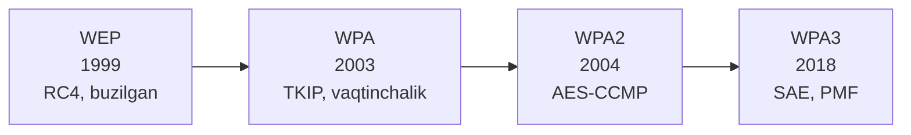
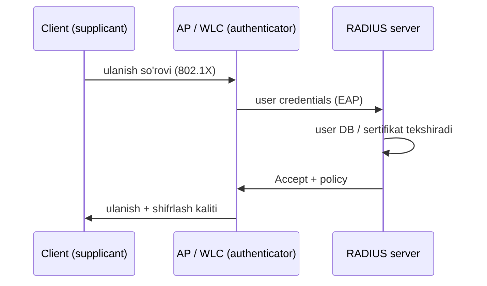
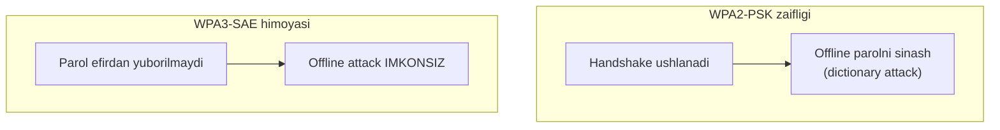
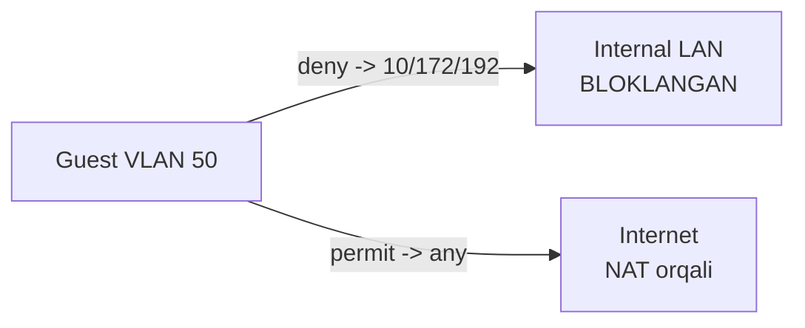

# 07. Wireless Security

## Muammo: signal devordan tashqariga chiqadi

Simli tarmoqda attacker ulanish uchun **jismonan** kabelga tegishi kerak.
Wi-Fi'da esa signal devordan o'tib, ko'chaga, qo'shni binoga chiqadi.

Ya'ni attacker sening ofisingga kirmasdan, mashinasida o'tirib:

- SSID'ni ko'radi;
- parolni sindirishga urinadi (offline);
- soxta access point (evil twin) yaratib foydalanuvchini aldaydi;
- himoyasiz trafikni tinglaydi.

Shuning uchun Wi-Fi'da xavfsizlik **shifrlash va autentifikatsiya**ga
tayanadi — jismoniy chegara yo'q.

> Wi-Fi xavfsizligining tarixi — WEP'dan WPA3'gacha bo'lgan "qurollanish
> poygasi". Har avlod oldingisining zaifligini yopadi.

---

## Analogiya: konvert va til

Wi-Fi shifrlashni **xat yuborish** deb tasavvur qil:

- **Open network** = ochiq otkritka — har kim yo'lda o'qiydi.
- **WEP** = zaif konvert — 10 daqiqada ochiladigan qulf.
- **WPA2** = yaxshi konvert, lekin hamma bitta kalitni biladi (PSK).
- **WPA3 (SAE)** = har kim o'z sirini isbotlaydi, lekin kalitni **hech qachon
  yubormaydi** — yo'lda tutib olsa ham foydasi yo'q.

---

## Asosiy tushunchalar

| Atama | Ma'nosi |
|---|---|
| **SSID** | Wi-Fi tarmoq nomi |
| **BSSID** | Access point radio MAC manzili |
| **PSK** | Pre-Shared Key — umumiy parol (uy/kichik ofis) |
| **Enterprise** | Har user alohida autentifikatsiya (802.1X + RADIUS) |
| **Open** | Parolsiz, himoyasiz tarmoq |
| **PMF** | Protected Management Frames — boshqaruv kadrlarini himoya |

---

## Evolyutsiya: WEP → WPA → WPA2 → WPA3



- **WEP** — birinchi standart, RC4 shifr. Bugun **butunlay buzilgan**,
  bir necha daqiqada ochiladi. **Hech qachon ishlatma.**
- **WPA** — WEP'ni tez almashtirish uchun TKIP. Vaqtinchalik yechim edi.
- **WPA2** — AES-CCMP bilan kuchli shifrlash. Uzoq yillar standart bo'ldi.
  Zaifligi: PSK'ga qarshi **offline dictionary attack** mumkin.
- **WPA3** — 2018-da chiqdi. **SAE** handshake bilan offline hujumni yopadi,
  **PMF**ni majburiy qiladi.

---

## WPA2-Personal (PSK)

**WPA2-Personal** bitta umumiy parol (PSK) ishlatadi — hamma qurilma shu
parolni biladi.

**Afzallik:** sodda, kichik tarmoq uchun qulay.

**Kamchilik:**
- Parol tarqalsa, **hamma** qurilmada almashtirish kerak.
- Zaif parol **dictionary attack**ga moyil.

> Tavsiya: kamida **14-16 belgi**, oddiy so'z emas, kompaniya nomi yoki
> telefon raqami emas.

---

## WPA2-Enterprise (802.1X + RADIUS)

Bu yerda 5-darsdagi **RADIUS** qaytib keladi. WPA2-Enterprise'da umumiy
parol yo'q — **har user yoki qurilma alohida** autentifikatsiya qilinadi.



**Afzallik:**
- Har user alohida — biri ketsa, faqat uning accounti o'chiriladi.
- Accounting va policy qo'llash oson.
- Parol tarqalsa, faqat bitta userni almashtirish kifoya.

> PSK vs Enterprise: uy uchun PSK, korxona uchun Enterprise. Enterprise
> RADIUS (5-dars) va 802.1X talab qiladi, lekin ancha xavfsizroq.

---

## WPA3: nima o'zgardi?

WPA3 asosiy yangiliklari:

- **SAE** (Simultaneous Authentication of Equals) — PSK o'rniga
  Diffie-Hellman uslubidagi handshake. Ikki tomon parolni **bilishini
  isbotlaydi**, lekin parolni **hech qachon efirdan yubormaydi**. Natijada
  offline dictionary attack **yo'qoladi**.
- **PMF** (Protected Management Frames) — majburiy. Deauth/DoS, honeypot va
  eavesdropping hujumlarini kamaytiradi.
- **WPA3-Enterprise** kuchliroq (192-bit) security variantini qo'llaydi.



### WPA3 adoption va transition mode (2025)

2025-da korxonalarda WPA3 **qisman** joriy etilishi ~53%, **to'liq** (hamma
AP'da) ~27%. Shimoliy Amerika yetakchi (~61% qisman). Amalda **WPA2/WPA3
mixed (transition) mode** ko'p uchraydi, chunki eski qurilmalar WPA3'ni
qo'llamasligi mumkin.

> ⚠️ Transition mode'da WPA2'ning barcha zaifliklari hali ham
> ekspluatatsiya qilinishi mumkin. Uni faqat **vaqtinchalik**, WPA2'ni
> tezda olib tashlash rejasi bilan ishlat.

**Muhim yangilik:** WPA3 endi **6 GHz** (Wi-Fi 6E, Wi-Fi 7) uchun
**majburiy**. Wi-Fi 7'ning Multi-Link Operation kabi imkoniyatlari WPA3'siz
ishlamaydi. Ya'ni yangi apparat sotib olsang, WPA3 avtomatik keladi.

---

## Guest Wi-Fi: mehmonlarni ajrat

Guest tarmoq ichki corporate LAN'dan **ajratilgan** bo'lishi shart. Bu —
segmentatsiya prinsipi (2-darsdagi zero trust g'oyasi).

Yaxshi amaliyot:

- Guest SSID alohida **VLAN**da.
- Guest VLAN'dan internal serverlarga **ACL bilan deny** (3-dars).
- Internetga NAT orqali chiqadi.
- Captive portal yoki vaqtinchalik access.
- Guest'dan management IP'ga kirish taqiqlanadi.

```cisco
conf t
ip access-list extended GUEST_FILTER
 ! RFC1918 private tarmoqlarga kirishni bloklash
 deny ip 192.168.50.0 0.0.0.255 10.0.0.0 0.255.255.255
 deny ip 192.168.50.0 0.0.0.255 172.16.0.0 0.15.255.255
 deny ip 192.168.50.0 0.0.0.255 192.168.0.0 0.0.255.255
 ! Qolgan (internet) trafikka ruxsat
 permit ip 192.168.50.0 0.0.0.255 any
interface vlan 50
 ip access-group GUEST_FILTER in
end
```



---

## Wireless threatlar

### Rogue AP

**Rogue AP** — ruxsatsiz access point tarmoqqa ulanadi (masalan xodim uyidan
olib kelgan router). U himoyasiz orqa eshik ochadi.

Mitigation: switch **port security** (6-dars), WLC rogue detection,
802.1X wired access, foydalanilmagan portlarni shutdown.

### Evil Twin

**Evil twin** — attacker haqiqiy SSID'ga o'xshash **soxta** SSID yaratadi.
Foydalanuvchi unga ulanib, parol yoki trafikni oshkor qiladi.

Mitigation: WPA2/WPA3-**Enterprise** (sertifikat tekshiruvi), foydalanuvchilarni
noma'lum sertifikatni qabul qilmaslikka o'rgatish.

### Weak PSK

Oddiy parol offline dictionary attack bilan topiladi.

Mitigation: kuchli PSK, davriy almashtirish, **WPA3-SAE** yoki Enterprise'ga o'tish.

---

## Cisco WLC tekshiruvlari

Klassik AireOS WLC:

```cisco
show wlan summary
show client summary
show ap summary
show client detail <client-mac>
```

Catalyst 9800 (IOS-XE) uslubi:

```cisco
show wireless summary
show wireless client summary
show wireless client mac-address aaaa.bbbb.cccc detail
show wlan summary
show ap summary
```

### AP switch porti

Lightweight AP bir necha SSID/VLAN tashisa, **trunk** kerak:

```cisco
conf t
interface g0/10
 description AP-01
 switchport mode trunk
 switchport trunk native vlan 10
 switchport trunk allowed vlan 10,20,50
 spanning-tree portfast trunk
end
```

Bitta VLAN AP uchun oddiy access port:

```cisco
conf t
interface g0/10
 description AP-01
 switchport mode access
 switchport access vlan 20
 spanning-tree portfast
end
```

---

## Ko'p uchraydigan xatolar

⚠️ **Xato 1: Guest Wi-Fi'ni internal VLAN'ga ulash.**
Guest foydalanuvchi ichki serverlarga kirib qoladi. Alohida VLAN + ACL kerak.

⚠️ **Xato 2: WPA2-Personal parolini hamma joyda bir xil ishlatish.**
Bittasi tarqalsa hammasi ochiq. Enterprise'ga o'tish yaxshiroq.

⚠️ **Xato 3: eski WEP yoki WPA'ni yoqib qo'yish.**
WEP buzilgan, WPA/TKIP zaif. Faqat WPA2-AES yoki WPA3 ishlat.

⚠️ **Xato 4: SSID'ni yashirishni (hide) xavfsizlik deb o'ylash.**
Yashirin SSID baribir wireless trafikdan aniqlanadi. Bu himoya emas.

⚠️ **Xato 5: RADIUS sertifikat tekshiruvini e'tiborsiz qoldirish.**
Enterprise'da sertifikat tekshirilmasa, evil twin osonlashadi.

⚠️ **Xato 6: AP trunk portida kerakli VLAN'larni allowed listga qo'shmaslik.**
Kerakli SSID/VLAN ishlamay qoladi.

---

## Xulosa

- Wi-Fi'da signal jismoniy chegaradan chiqadi — himoya **shifrlash va
  autentifikatsiya**ga tayanadi.
- Evolyutsiya: **WEP (buzilgan) → WPA (zaif) → WPA2 (AES) → WPA3 (SAE, PMF)**.
- **PSK** (bitta umumiy parol) uy/kichik ofis uchun; **Enterprise**
  (802.1X + RADIUS) korxona uchun — har user alohida.
- **WPA3-SAE** offline dictionary attack'ni yo'qotadi; WPA3 6 GHz (Wi-Fi
  6E/7) uchun majburiy.
- **Transition mode** vaqtinchalik — WPA2 zaifliklari saqlanib qoladi.
- **Guest Wi-Fi** alohida VLAN + ACL bilan internal LAN'dan ajratilsin.
- Threatlar: **rogue AP, evil twin, weak PSK**.

## 🧠 Eslab qol

- WEP o'lik, WPA zaif — faqat WPA2-AES yoki WPA3.
- WPA3-SAE parolni efirdan yubormaydi -> offline attack imkonsiz.
- PSK = uy; Enterprise (802.1X + RADIUS) = korxona.
- WPA3 6 GHz (Wi-Fi 6E/7) uchun majburiy.
- Guest Wi-Fi = alohida VLAN + ACL, hech qachon internal LAN'da emas.

## ✅ O'z-o'zini tekshir (retrieval practice)

<details>
<summary>1. Nega WPA3-SAE offline dictionary attack'ni to'xtata oladi, WPA2-PSK esa yo'q?</summary>

WPA2-PSK'da handshake ushlab olinsa, attacker offline'da parolni sinab
ko'radi (handshake parol asosida tuzilgan). WPA3-SAE esa Diffie-Hellman
uslubidagi almashinuv ishlatadi: ikki tomon parolni **bilishini isbotlaydi**,
lekin parolning o'zi yoki undan hosil qilingan tekshiriladigan qiymat
efirdan **yuborilmaydi**. Shuning uchun offline sinovga material yo'q.
</details>

<details>
<summary>2. PSK va Enterprise'dan qaysi biri, va nega, 500 xodimli korxona uchun?</summary>

**Enterprise** (802.1X + RADIUS). PSK'da hamma bitta parolni biladi — xodim
ketsa yoki parol tarqalsa, 500 qurilmada almashtirish kerak. Enterprise'da
har user alohida — ketgan xodimning faqat accountini o'chirasan, boshqalarga
ta'sir qilmaydi. Accounting va policy ham osonlashadi.
</details>

<details>
<summary>3. SSID'ni yashirish tarmoqni himoya qiladimi?</summary>

Deyarli yo'q. Yashirin SSID ham wireless trafikda (client probe, association)
aniqlanadi — oddiy vositalar bilan topiladi. Bu "security by obscurity",
haqiqiy himoya emas. Asosiy himoya — WPA2/WPA3 va to'g'ri autentifikatsiya.
</details>

<details>
<summary>4. Transition (mixed) mode'da qanday xavf saqlanib qoladi?</summary>

Transition mode WPA2 va WPA3'ni birga qo'llab-quvvatlaydi (eski qurilmalar
uchun). Lekin WPA2 yo'li ochiq bo'lgani uchun uning **barcha zaifliklari**
(offline dictionary attack, PMF yo'qligi) hali ham ekspluatatsiya qilinishi
mumkin. Shuning uchun uni faqat vaqtinchalik, WPA2'ni tez olib tashlash
rejasi bilan ishlatish kerak.
</details>

<details>
<summary>5. Evil twin va rogue AP farqi nima?</summary>

**Rogue AP** — tarmoqqa **ruxsatsiz ulangan** access point (masalan xodim
olib kelgan router), u ichki tarmoqqa orqa eshik ochadi. **Evil twin** —
haqiqiy SSID'ga o'xshatib yasalgan **soxta** AP, foydalanuvchini aldab
credentials/trafik o'g'irlaydi. Birinchisi ichki tahdid, ikkinchisi
foydalanuvchini aldash.
</details>

## 🛠 Amaliyot

1. **Oson (Modify):** Yuqoridagi guest ACL'da `192.168.50.0/24` ni
   `172.20.0.0/16` guest tarmog'iga o'zgartir (wildcard'ni ham to'g'rila).

2. **O'rta (Faded example):** AP trunk portini to'ldir:
   ```cisco
   interface g0/10
    switchport mode ___                    ! TODO: trunk
    switchport trunk native vlan ___       ! TODO: 10
    switchport trunk allowed vlan ___      ! TODO: 10,20,50
    spanning-tree portfast ___             ! TODO: trunk
   ```
   <details><summary>Hint</summary>
   `trunk`, `native vlan 10`, `allowed vlan 10,20,50`, `portfast trunk`.
   </details>

3. **Qiyin (Make):** Kichik korxona uchun wireless dizayn yoz: (a) xodimlar
   uchun WPA3-Enterprise (RADIUS), (b) mehmonlar uchun alohida guest VLAN 50
   + captive portal + internal LAN'ga deny ACL, (c) rogue AP'dan himoya
   strategiyasi. Har biriga qaysi darsdagi qurol kerakligini ko'rsat.
   <details><summary>Hint</summary>
   Enterprise -> 5-dars RADIUS; guest ACL -> 3-dars extended ACL; rogue AP ->
   6-dars port security + WLC rogue detection.
   </details>

## 🔁 Takrorlash

- **Bog'liq darslar:** [03. ACL](./03-acl.md) (guest filter),
  [05. AAA, RADIUS, TACACS+](./05-aaa-radius-tacacs.md) (802.1X Enterprise),
  [06. L2 Security](./06-l2-security.md) (rogue AP, port security).
- **Takrorlash jadvali:** ertaga → 3 kundan keyin → 1 haftadan keyin
  savollarga qayt.
- **Feynman testi:** 3 jumlada tushuntir: "WPA2-PSK va WPA3-SAE farqi nima,
  va nega WPA3 offline hujumdan xavfsizroq?"

## 📚 Manbalar

- [Cisco — WPA3 Deployment Guide](https://www.cisco.com/c/en/us/td/docs/wireless/controller/9800/technical-reference/wpa3-dg.html)
- [WWT — WPA3 nima va nimani bilish kerak](https://www.wwt.com/blog/wpa3-what-is-it-and-what-do-i-need-to-know)
- [Extreme Networks — Wireless Security in 6 GHz Wi-Fi 6E World](https://www.extremenetworks.com/resources/blogs/wireless-security-in-a-6-ghz-wi-fi-6e-world)
- [SecureW2 — WPA3 Ultimate Guide](https://securew2.com/blog/wpa3-the-ultimate-guide)
