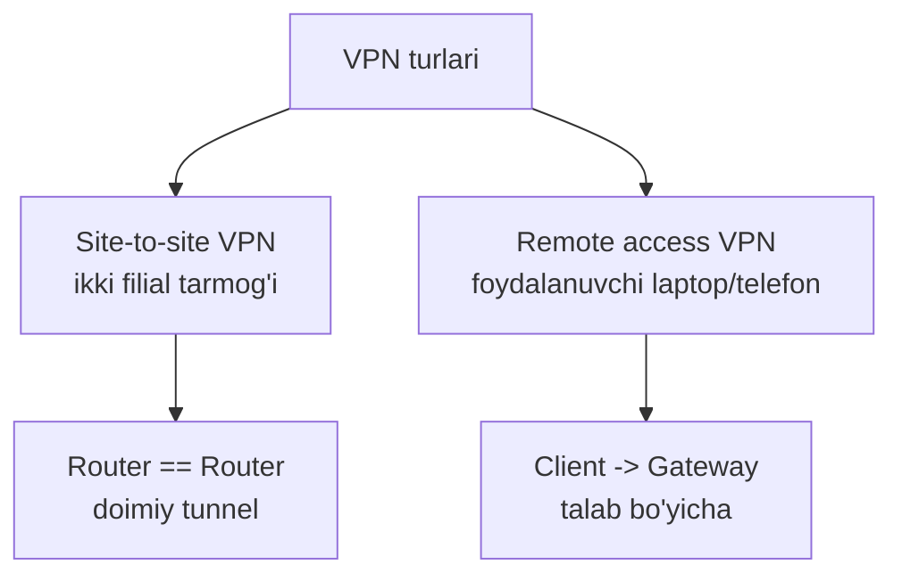
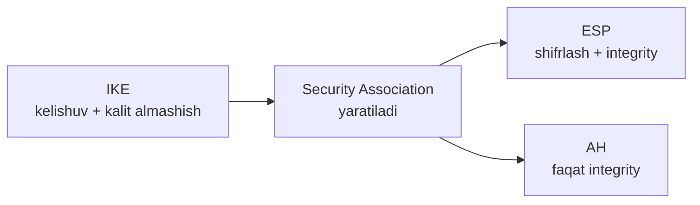
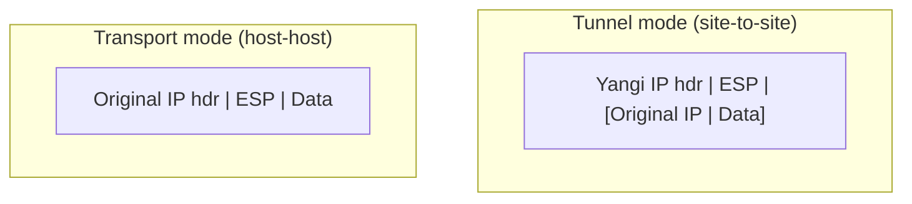
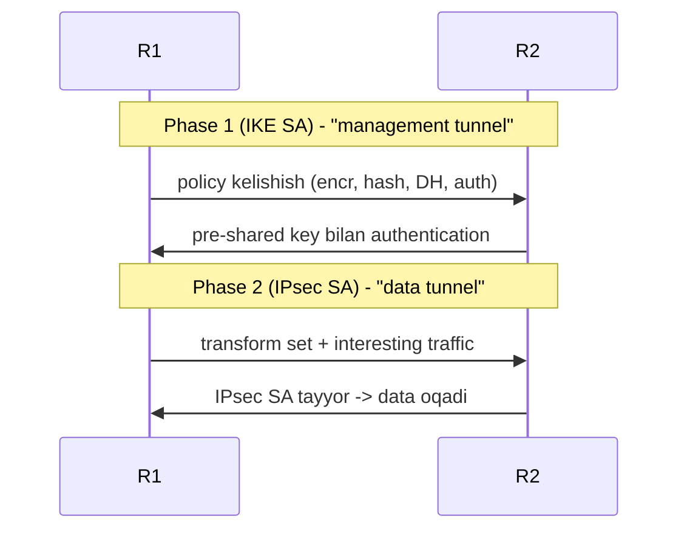

# 08. VPN va IPsec

## Muammo: internet orqali maxfiy gaplashish

Kompaniyaning ikki filiali bor: biri Toshkentda, biri Samarqandda. Ular
bir tarmoq bo'lib ishlashi kerak. Ular orasida faqat **internet** bor.

Lekin internet — ochiq maydon. Filiallar orasidagi trafik (moliyaviy
hisobotlar, mijoz ma'lumotlari) yo'lda **o'nlab router**dan o'tadi. Har
biri paketni o'qishi mumkin (1-darsdagi **sniffing**).

Xususiy liniya (leased line) ijaraga olish qimmat. Yechim: internet ustidan
**shifrlangan tunnel** qurish — go'yo ikki filial orasida maxfiy quvur bor.

> **VPN** (Virtual Private Network) — ishonchsiz tarmoq (internet) ustidan
> xususiy tarmoqlarni xavfsiz bog'lash usuli.

Bu darsda VPN turlarini va eng keng tarqalgan texnologiya — **IPsec**ni
o'rganamiz, oxirida zamonaviy **WireGuard** bilan solishtiramiz.

---

## Analogiya: diplomatik pochta qopi

VPN'ni **diplomatik pochta qopi** deb tasavvur qil:

- Qop oddiy pochta (internet) orqali boradi.
- Lekin uni **hech kim ocholmaydi** (shifrlangan).
- Faqat ikki tomondagi elchixona (peer) kalitga ega.
- Qop **muhrlangan** — yo'lda o'zgartirilsa bilinadi (integrity).

IPsec — ana shu qopni yasash va muhrlash qoidalari to'plami.

---

## VPN turlari



- **Site-to-site VPN** — ikki filial tarmog'i orasida, router'lar orasida
  doimiy tunnel. Foydalanuvchi hech narsa qilmaydi — hammasi shaffof.
- **Remote access VPN** — foydalanuvchi laptop/telefonidan kompaniya
  tarmog'iga (masalan uydan ishlayotgan xodim).

Misol topologiyasi:

```text
Branch LAN 192.168.10.0/24 -- R1 == Internet == R2 -- HQ LAN 10.10.10.0/24
```

---

## IPsec nima beradi?

**IPsec** (IP Security) — IP trafikni himoyalaydigan protokollar to'plami.
U 1-darsdagi CIA triad'ning hammasini beradi:

| Xususiyat | Nima | CIA |
|---|---|---|
| **Confidentiality** | Trafik shifrlanadi | C |
| **Integrity** | Paket o'zgarmaganini tekshiradi | I |
| **Authentication** | Peer haqiqiyligini tekshiradi | — |
| **Anti-replay** | Eski paketni qayta yuborishni bloklaydi | — |

---

## IPsec komponentlari: IKE, ESP, AH



### IKE (Internet Key Exchange)

**IKE** — peer'lar orasida xavfsiz **kelishuv** qiladi:

- peer authentication (kim bilan gaplashyapman?);
- shifrlash va hash algoritmlarini kelishish;
- kalit almashish (key exchange);
- **Security Association** (SA) yaratish.

Versiyalar: **IKEv1** (eski, hali uchraydi), **IKEv2** (yangi, soddaroq,
yaxshiroq).

### ESP (Encapsulating Security Payload)

**ESP** — trafikni **shifrlash + integrity** bilan himoyalaydi. Amaliy
tarmoqlarda eng ko'p ishlatiladigan.

### AH (Authentication Header)

**AH** — faqat **integrity/authentication** beradi, **shifrlamaydi**.
Amalda ESP ko'proq uchraydi (chunki shifrlash kerak).

> Eslab qol: ESP = shifrlash + integrity; AH = faqat integrity.
> Ko'p hollarda ESP ishlatiladi.

---

## Tunnel vs Transport mode

IPsec paketni ikki xil "o'raydi":

| Mode | Nima o'raladi | Qayerda |
|---|---|---|
| **Tunnel** | **Butun** original IP paket (header + data) | Site-to-site (router-router) |
| **Transport** | Faqat payload (original header qoladi) | Host-to-host |



Site-to-site VPN uchun **tunnel mode** ishlatiladi — butun paket
yashiriladi, faqat router'larning public IP'lari ko'rinadi.

---

## IKEv1 Phase 1 va Phase 2

IKEv1 tunnelni ikki bosqichda quradi:



- **Phase 1** — peer'lar orasida **IKE SA** yaratiladi ("management tunnel").
  Parametrlari: encryption (AES/3DES), hash (SHA), authentication (pre-shared
  key yoki sertifikat), DH group, lifetime.
- **Phase 2** — real data uchun **IPsec SA** yaratiladi. Parametrlari:
  transform set, interesting traffic, PFS (optional), lifetime.

---

## Interesting traffic: qaysi trafik tunnelga tushadi?

**Interesting traffic** — IPsec qaysi trafikni tunnelga solishini
belgilaydigan ACL. Bu **interfeys filter ACL'i EMAS** — bu "qaysi trafik
VPN'ga tushadi?" degan savolga javob.

```cisco
ip access-list extended VPN_TRAFFIC
 permit ip 192.168.10.0 0.0.0.255 10.10.10.0 0.0.0.255
```

> ⚠️ Bu ACL ikki tomonda **oyna** (mirror) bo'lishi shart: R1'da
> `10.0->10.10.10.0`, R2'da esa `10.10.10.0->192.168.10.0`.

---

## Worked example: site-to-site IPsec (crypto map)

R1 tomoni (klassik crypto map uslubi):

```cisco
conf t
! --- 1-qadam: Phase 1 policy (IKE SA) ---
crypto isakmp policy 10
 encr aes 256
 hash sha
 authentication pre-share
 group 14
 lifetime 86400

! --- 2-qadam: peer authentication kaliti ---
crypto isakmp key SharedKey123 address 203.0.113.2

! --- 3-qadam: interesting traffic ACL ---
ip access-list extended VPN_TRAFFIC
 permit ip 192.168.10.0 0.0.0.255 10.10.10.0 0.0.0.255

! --- 4-qadam: Phase 2 transform set (ESP) ---
crypto ipsec transform-set TS esp-aes 256 esp-sha-hmac
 mode tunnel

! --- 5-qadam: crypto map (hammasini bog'laydi) ---
crypto map VPN-MAP 10 ipsec-isakmp
 set peer 203.0.113.2
 set transform-set TS
 match address VPN_TRAFFIC

! --- 6-qadam: crypto map'ni OUTSIDE interfeysga qo'y ---
interface g0/0
 description Internet
 crypto map VPN-MAP
end
```

R2 tomonida **hammasi bir xil**, faqat peer IP va ACL teskari:

```cisco
crypto isakmp key SharedKey123 address 203.0.113.1
ip access-list extended VPN_TRAFFIC
 permit ip 10.10.10.0 0.0.0.255 192.168.10.0 0.0.0.255
crypto map VPN-MAP 10 ipsec-isakmp
 set peer 203.0.113.1
```

---

## NAT exemption: VPN trafik NAT'lanmasin

VPN trafik odatda **NAT qilinmasligi** kerak. Aks holda source IP
o'zgaradi va interesting traffic ACL mos kelmaydi.

```cisco
ip access-list extended NAT_EXEMPT
 deny ip 192.168.10.0 0.0.0.255 10.10.10.0 0.0.0.255   ! VPN -> NAT YO'Q
 permit ip 192.168.10.0 0.0.0.255 any                   ! internet -> NAT
```

`deny` bu yerda "NAT qilma" degani, `permit` esa "NAT qil". Chalkashtirma.

---

## Troubleshooting

```cisco
show crypto isakmp sa        ! Phase 1 holati (QM_IDLE = OK)
show crypto ipsec sa         ! Phase 2 + counterlar
show crypto map
show access-lists VPN_TRAFFIC
show ip route

! LAN source bilan test (OUTSIDE IP'dan EMAS!)
ping 10.10.10.1 source 192.168.10.1

! IKEv2 uchun
show crypto ikev2 sa
```

Muammoni topish tartibi:

1. Peer public IP ping bo'ladimi?
2. Crypto policy ikki tomonda mosmi?
3. Pre-shared key bir xilmi?
4. Interesting traffic ACL mirror holatidami?
5. Route bormi (return route)?
6. NAT exemption to'g'rimi?
7. Firewall UDP 500, UDP 4500 va ESP'ni bloklamayaptimi?
8. `show crypto ipsec sa` counter oshyaptimi?

---

## Zamonaviy holat: WireGuard

IPsec kuchli, lekin **murakkab** — kodi 400 000+ qatordan iborat, sozlash
xatolarga to'la. 2020-yildan **WireGuard** tez tarqaldi.

| Xususiyat | IPsec | WireGuard |
|---|---|---|
| Kod hajmi | ~400 000 qator | **~4 000 qator** |
| Sozlash | Murakkab (phase, transform...) | Sodda (public key almashish) |
| Tezlik | Hardware offload bilan yuqori | ~15% ko'proq throughput, ~20% kam latency |
| Kriptografiya | Ko'p variant (xato xavfi) | Qat'iy, zamonaviy (all-or-nothing) |
| Standart | IETF Standards Track | Yangiroq, keng qo'llanilmoqda |
| Ko'p ishlatiladi | Enterprise, carrier, site-to-site | Cloud, container, mobile, SMB |

> 2025-2026 amaliyoti: **IPsec** hali ham enterprise site-to-site va
> tartibga solingan (regulated) muhitlarda hukmron. **WireGuard** esa
> tezlik va soddalik kerak bo'lgan cloud, container va remote access
> stsenariylarida tez o'sib bormoqda. Ikkalasi ham zamonaviy va xavfsiz.

---

## Ko'p uchraydigan xatolar

⚠️ **Xato 1: interesting traffic ACL teskari yoki noto'g'ri.**
Ikki tomonda mirror bo'lmasa, tunnel ko'tarilmaydi. Source/destination'ni
diqqat bilan tekshir.

⚠️ **Xato 2: ikki tomonda transform set mos emas.**
Encryption/hash bir xil bo'lmasa, Phase 2 negotiate bo'lmaydi.

⚠️ **Xato 3: pre-shared key bir xil emas.**
Phase 1 authentication ishlamaydi.

⚠️ **Xato 4: NAT exemption yo'q.**
VPN trafik NAT'lanadi, source IP o'zgaradi, ACL mos kelmaydi.

⚠️ **Xato 5: crypto map'ni outside interfeysga qo'ymaslik.**
`crypto map VPN-MAP` internet tomon (g0/0) interfeysida bo'lishi shart.

⚠️ **Xato 6: tunnelni router'ning outside IP'sidan ping qilib test qilish.**
Interesting traffic LAN'dan LAN'ga. `ping ... source 192.168.10.1` bilan test qil.

⚠️ **Xato 7: return route yo'q yoki noto'g'ri.**
Trafik boradi, lekin javob qaytmaydi.

---

## Xulosa

- **VPN** — ishonchsiz internet ustidan xususiy tarmoqlarni xavfsiz bog'lash.
- Ikki tur: **site-to-site** (router-router, doimiy) va **remote access**
  (client-gateway).
- **IPsec** confidentiality + integrity + authentication + anti-replay beradi.
- Komponentlar: **IKE** (kelishuv/kalit), **ESP** (shifrlash+integrity),
  **AH** (faqat integrity). Ko'pincha ESP.
- **Tunnel mode** butun paketni o'raydi (site-to-site); **transport mode**
  faqat payload'ni (host-host).
- IKEv1: **Phase 1** (IKE SA) → **Phase 2** (IPsec SA). Interesting traffic
  ACL ikki tomonda **mirror** bo'lsin.
- **WireGuard** — sodda, tez zamonaviy alternativa; IPsec enterprise
  site-to-site'da hukmron bo'lib qolmoqda.

## 🧠 Eslab qol

- ESP = shifrlash + integrity; AH = faqat integrity.
- Site-to-site -> tunnel mode; interesting traffic ACL mirror bo'lsin.
- Phase 1 = IKE SA (management); Phase 2 = IPsec SA (data).
- VPN trafik NAT'lanmasligi kerak (NAT exemption).
- Tunnelni LAN source bilan test qil, outside IP bilan emas.

## ✅ O'z-o'zini tekshir (retrieval practice)

<details>
<summary>1. IPsec tunnel o'zi avtomatik ko'tariladimi?</summary>

Odatda **interesting traffic** chiqqanda tunnel negotiate bo'ladi (talab
bo'yicha). Shuning uchun uni tekshirish uchun LAN'dan LAN'ga ping qilish
kerak — masalan `ping 10.10.10.1 source 192.168.10.1`. Faqat outside IP'dan
ping qilsang, interesting traffic'ga tushmaydi va tunnel ko'tarilmaydi.
</details>

<details>
<summary>2. ESP va IKE farqi nima?</summary>

**IKE** kelishuv va kalit almashish qiladi (peer authentication, algoritm
kelishish, SA yaratish) — go'yo "diplomatik muzokaralar". **ESP** esa
haqiqiy data trafikni himoyalaydi (shifrlash + integrity) — "muhrlangan
qop". IKE tunnelni quradi, ESP undan foydalanadi.
</details>

<details>
<summary>3. Nega site-to-site VPN uchun tunnel mode ishlatiladi, transport emas?</summary>

Tunnel mode **butun** original IP paketni (header + data) o'raydi va yangi
IP header qo'shadi. Shunda ichki manzillar (192.168.10.x, 10.10.10.x)
yashiriladi, faqat router'larning public IP'lari ko'rinadi. Transport mode
faqat payload'ni shifrlaydi va original header'ni qoldiradi — bu host-host
uchun, router-router (butun tarmoqlar) uchun emas.
</details>

<details>
<summary>4. Interesting traffic ACL noto'g'ri bo'lsa qanday belgilar ko'rasan?</summary>

Tunnel umuman ko'tarilmaydi yoki trafik shifrlanmasdan ochiq ketadi.
`show crypto isakmp sa` da SA bo'lmasligi yoki `show crypto ipsec sa`
counter'ining o'smasligi. Sabab: ikki tomon ACL'i mirror emas — R1
"A->B" desa, R2 "B->A" demasa, mos kelmaydi.
</details>

<details>
<summary>5. WireGuard IPsec'dan qaysi jihatlari bilan farq qiladi, va qachon qaysi birini tanlaysan?</summary>

WireGuard ~4000 qator kod, sodda sozlash (public key almashish), qat'iy
zamonaviy kriptografiya (xato xavfi kam), umumiy serverlarda tezroq. IPsec
~400000 qator, murakkab, lekin IETF standart va hardware offload bilan juda
tez. **Enterprise site-to-site / tartibga solingan muhit -> IPsec; cloud,
container, mobile, remote access, soddalik -> WireGuard.**
</details>

## 🛠 Amaliyot

1. **Oson (Modify):** Yuqoridagi R1 crypto isakmp policy'da `encr aes 256`
   ni `aes 128` ga o'zgartir va DH `group 14` ni `group 19` ga (ikkala tomonda
   mos bo'lishini eslab qol).

2. **O'rta (Faded example):** Site-to-site skeletonini to'ldir:
   ```cisco
   crypto isakmp policy 10
    encr aes 256
    hash sha
    authentication ___              ! TODO: pre-share
    group 14
   crypto isakmp key ___ address 203.0.113.2   ! TODO: shared key
   ip access-list extended VPN_TRAFFIC
    permit ip 192.168.10.0 0.0.0.255 ___        ! TODO: HQ LAN
   crypto ipsec transform-set TS ___ ___        ! TODO: esp-aes 256, esp-sha-hmac
   crypto map VPN-MAP 10 ipsec-isakmp
    set peer ___                    ! TODO: 203.0.113.2
    match address VPN_TRAFFIC
   interface g0/0
    crypto map ___                  ! TODO: VPN-MAP
   ```
   <details><summary>Hint</summary>
   `pre-share`, `key SharedKey123`, `10.10.10.0 0.0.0.255`,
   `esp-aes 256 esp-sha-hmac`, `set peer 203.0.113.2`, `crypto map VPN-MAP`.
   </details>

3. **Qiyin (Make):** Ikki filial (Branch 192.168.10.0/24, HQ 10.10.10.0/24)
   uchun to'liq site-to-site IPsec'ni **ikkala** router'da noldan yoz.
   Interesting traffic ACL'ni mirror qil, NAT exemption qo'sh va tunnelni
   qanday test qilishni ko'rsat.
   <details><summary>Hint</summary>
   R1 ACL: `192.168.10.0 -> 10.10.10.0`; R2 ACL: `10.10.10.0 -> 192.168.10.0`.
   NAT_EXEMPT: `deny` VPN juftligi, `permit ... any`. Test:
   `ping 10.10.10.1 source 192.168.10.1`.
   </details>

## 🔁 Takrorlash

- **Bog'liq darslar:** [01. Security concepts](./01-security-concepts-va-hujumlar.md)
  (CIA, sniffing), [02. Firewall](./02-firewall.md) (UDP 500/4500),
  [03. ACL](./03-acl.md) (interesting traffic),
  [05. AAA, RADIUS, TACACS+](./05-aaa-radius-tacacs.md) (remote access AAA).
- **Takrorlash jadvali:** ertaga → 3 kundan keyin → 1 haftadan keyin
  savollarga qayt.
- **Feynman testi:** 3 jumlada tushuntir: "IPsec site-to-site VPN qanday
  ishlaydi, va nega interesting traffic ACL ikki tomonda mirror bo'lishi kerak?"

## 📚 Manbalar

- [Tailscale — IPsec vs WireGuard comparison](https://tailscale.com/compare/ipsec)
- [WunderTech — WireGuard vs IPsec (2026)](https://www.wundertech.net/wireguard-vs-ipsec/)
- [Contabo — IPsec vs WireGuard: differences and use cases](https://contabo.com/blog/ipsec-vs-wireguard-differences-use-cases/)
