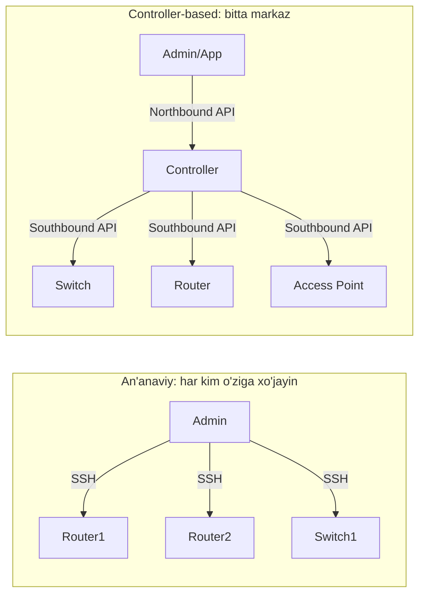
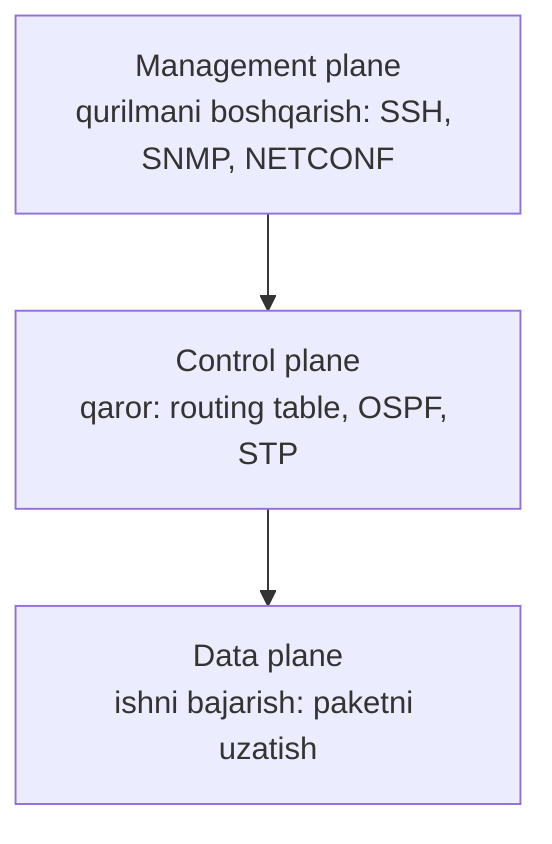
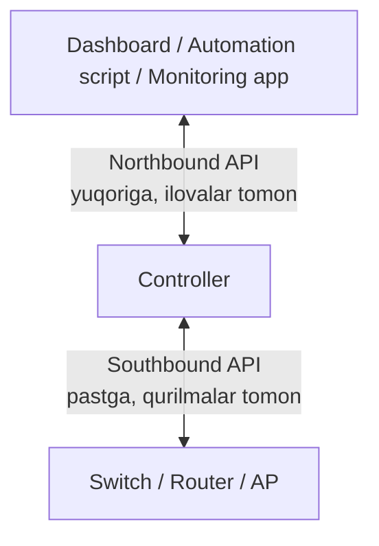
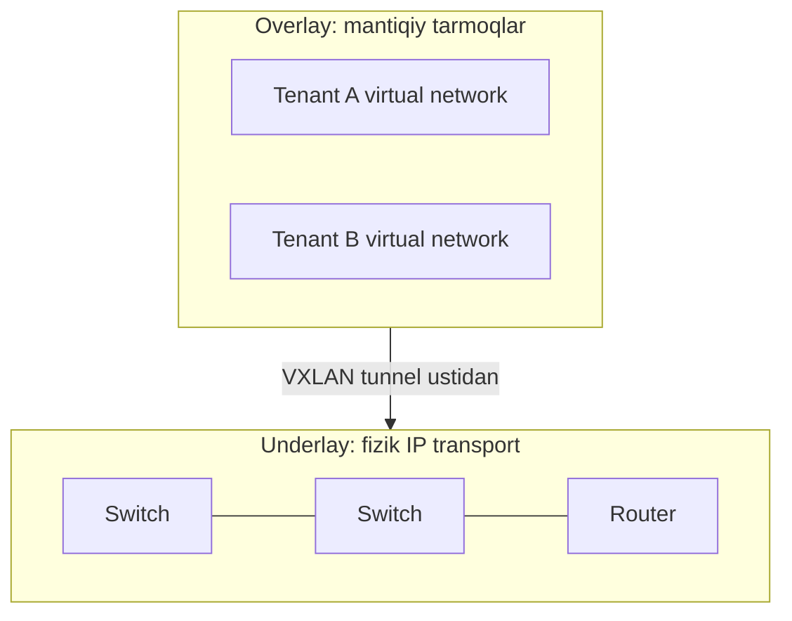

# SDN va Controller-Based Networking

## Muammo: 500 ta switch va bitta charchagan admin

Tasavvur qil: kompaniyada 500 ta switch bor. Rahbar aytadi: "Ertaga barcha
switch'larda yangi `VLAN 50` bo'lsin." An'anaviy yo'l bilan sen har biriga SSH
orqali kirasan, bitta buyruqni 500 marta yozasan. Bittasida `VLAN 05` deb
adashsang — kechqurun troubleshooting boshlanadi.

Muammo bitta buyruqda emas. Muammo shundaki, **har bir qurilma alohida "miya"ga
ega** va ularni bittalab boshqarish sekin, xato va nazoratsiz.

> SDN (Software-Defined Networking) aynan shu og'riqni yechish uchun tug'ilgan:
> qurilmalarning "miya"sini bitta markazga yig'ib, butun tarmoqni bir joydan
> boshqarish.

## Analogiya: taksi haydovchilar va Yandex dispetcheri

Eski davrda har bir taksi haydovchi o'zi qaror qilardi — qayerga borish, qaysi
ko'chadan yurishni. Yo'lovchi har bir mashinani alohida to'xtatib kelishishi
kerak edi.

**Yandex/Uber** kelgach, markaziy dispetcher (aqlli tizim) paydo bo'ldi. U
butun shaharni yuqoridan ko'radi, buyurtmani eng yaqin mashinaga yuboradi,
narxni belgilaydi. Haydovchi hali ham **o'zi rul boshqaradi** (mashinani
markaz haydab bermaydi), lekin **qaror** markazdan keladi.

- **Haydovchi = network qurilma** (switch, router) — trafikni real uzatadi.
- **Dispetcher = controller** — qaror qabul qiladi, siyosat tarqatadi.

Chegara: dispetcher o'chsa ham, ko'chadagi mashinalar to'xtab qolmaydi — ular
yo'lni davom ettiradi. Xuddi shunday, controller o'chsa ham, mavjud trafik
odatda oqishda davom etadi (bu haqda pastda).

## Sodda ta'rif

**SDN** — tarmoqning boshqaruv mantiqini (control) qurilmalardan ajratib olib,
markaziy **controller** (butun tarmoqni ko'radigan "dispetcher" dasturi) orqali
boshqarish yondashuvi.

## Ikki dunyo: traditional vs controller-based



Farqni jadvalda ko'raylik:

| Xususiyat | Traditional | Controller-based |
|---|---|---|
| Boshqaruv | har qurilma alohida CLI | markaziy controller |
| Tezlik (katta tarmoq) | sekin | tez, ommaviy |
| Inson xatosi | ko'p | kamroq (shablon, siyosat) |
| Umumiy holat ko'rinishi | qiyin | bitta dashboard |
| Troubleshooting | CLI juda qulay | dashboard + hali CLI kerak |

> CLI o'lmaydi. Controller-based dunyoda ham troubleshooting va tekshiruv uchun
> CLI muhim bo'lib qoladi. Automation faqat takroriy ishni oladi.

Real hayotda controller misollari: **Cisco Catalyst Center** (avvalgi nomi DNA
Center) — enterprise campus uchun, **Cisco Catalyst SD-WAN Manager** — WAN
uchun, **Wireless LAN Controller (WLC)** — access point'lar uchun.

## Uch plane: qurilma ichidagi uch "bo'lim"

Har bir network qurilma ichida uchta mantiqiy bo'lim ishlaydi. Bu SDN'ni
tushunishning kaliti.



### Control plane — "miya" (qaror qabul qiladi)

Control plane tarmoq **qarorlarini** tayyorlaydi: routing table quradi,
OSPF/BGP orqali marshrut o'rganadi, STP orqali loop'ni to'sadi.

```text
Router o'ylaydi: "10.10.10.0/24 ga borish -> next-hop 192.168.1.2"
```

### Data plane — "qo'l-oyoq" (ishni bajaradi)

Data plane **paketni real vaqtda uzatadi**, control plane tayyorlagan qarordan
foydalanadi. U eng tez ishlaydigan qism.

```text
Paket keldi -> forwarding table qaraldi -> kerakli portdan chiqdi
```

### Management plane — "eshik" (sen kirasan)

Management plane orqali sen qurilmani boshqarasan va kuzatasan: SSH, HTTPS web
UI, SNMP, syslog, NETCONF/RESTCONF, backup.

> Xatoga yo'l qo'yma: management plane qurilmani **boshqaradi**, control plane
> esa forwarding **qarorini tayyorlaydi**. Bular boshqa-boshqa narsa.

### SDN'da plane'lar qanday ajraladi?

Traditional routerda **hamma uch plane bir quti ichida**. SDN'da control plane
qisman yoki to'liq controllerga **ko'chadi**:

```text
Traditional:   Router = Control + Data + Management (hammasi ichida)

Controller-based:
   Controller = markaziy control + management
   Devices    = asosan data plane + ba'zi local qarorlar
```

## Northbound va southbound API

Controller ikki tomon bilan gaplashadi. Yo'nalishni **"controllerga nisbatan"**
eslab qol.



| API | Kim bilan gaplashadi | Misol protokollar |
|---|---|---|
| **Northbound** | controller <-> ilovalar/skriptlar | REST API |
| **Southbound** | controller <-> qurilmalar | NETCONF, RESTCONF, OpenFlow, gRPC/gNMI |

Eslab qolish formulasi:

```text
North = yuqoriga (ilovalar, odam, dashboard)
South = pastga (temir qurilmalar)
```

## Underlay, overlay va fabric

Zamonaviy campus va data center'da tarmoq ikki qatlamga bo'linadi.



- **Underlay** — fizik, asosiy IP tarmoq (switch'lar orasidagi haqiqiy linklar,
  OSPF/IS-IS bilan). U "yo'l"ni beradi.
- **Overlay** — underlay ustiga qurilgan **mantiqiy** tarmoq (VXLAN tunnel,
  SD-WAN tunnel, VPN). U trafikni mantiqiy ajratadi.
- **Fabric** — controller boshqaradigan, **siyosatga asoslangan** butun
  arxitektura, unda overlay va underlay birga ishlaydi. Masalan Cisco
  **SD-Access** campus fabric — foydalanuvchi qayerda ulanishidan qat'i nazar,
  bir xil siyosat oladi.

> Overlay underlay'ni **almashtirmaydi** — u underlay **ustida** yashaydi.
> Underlay ishlamasa, overlay ham qulaydi.

## Worked example: yangi filialga 20 ta AP qo'shish

Ikki yondashuvni yonma-yon ko'raylik.

```text
--- Traditional yo'l ---
1. Har bir AP/switch alohida sozlanadi
2. SSID, VLAN, security policy qo'lda kiritiladi (20 marta)
3. Xato bo'lsa, qurilmani bittalab tekshirish kerak

--- Controller-based yo'l ---
1. Controllerda "filial profili" bir marta yaratiladi
2. AP'lar controllerga ulanadi (onboarding)
3. SSID, VLAN, security policy avtomatik tarqatiladi
4. Dashboard'da holat real vaqtda ko'rinadi
```

Intent-based networking (IBN) — bu g'oyaning eng yangi bosqichi. Sen "nima
bo'lishini xohlashingni" (intent) aytasan, controller uni qurilma buyruqlariga
o'zi tarjima qiladi va natijani doimiy **tekshirib turadi** (assurance).
Cisco Live 2025'da Catalyst Center'ga wired L2 konfiguratsiya va WLC'ni to'g'ridan
GUI'dan sozlash kabi yangi imkoniyatlar qo'shildi — trend markazlashuv tomon.

## Predict savoli

Filialda controllerga ulanish (internet/WAN) uzildi. AP'lar allaqachon
sozlangan va ishlab turibdi edi.

> 🤔 **O'ylab ko'r:** Shu daqiqada filialdagi foydalanuvchilar Wi-Fi orqali
> internetdan foydalana oladimi? Nima ishlamay qoladi?

<details>
<summary>💡 Javobni ko'rish</summary>

Ko'p dizaynlarda **mavjud trafik oqishda davom etadi** — chunki data plane
qurilmaning o'zida ishlaydi va u allaqachon forwarding table'ga ega. Ya'ni
odamlar internetdan foydalanaveradi.

Lekin ishlamay qoladigan narsalar: **yangi siyosat tarqatish**, **yangi
qurilmani onboarding qilish**, **markaziy monitoring/dashboard** va ba'zan
yangi client'lar uchun policy o'zgarishlari. Ya'ni control/management
markazga bog'liq qism ta'sirlanadi, data plane esa ko'pincha omon qoladi.

Xulosa: "controller o'chsa, hamma narsa to'xtaydi" degan tasavvur noto'g'ri —
dizaynga bog'liq.
</details>

## Ko'p uchraydigan xatolar

⚠️ **"Controller hamma paketni o'zi forward qiladi."** Noto'g'ri. Controller
qaror/siyosat beradi, paketlar ko'pincha qurilmaning o'z data plane'ida
uzatiladi. Controller trafik yo'lida "buyuk to'g'on" emas.

⚠️ **Northbound va southbound'ni chalkashtirish.** Northbound — ilovalar tomon
(yuqoriga), southbound — qurilmalar tomon (pastga). "Temir pastda" deb eslab qol.

⚠️ **"Overlay underlay o'rnini bosadi."** Yo'q. Overlay underlay ustida yashaydi;
barqaror underlay bo'lmasa, overlay ishlamaydi.

⚠️ **Management plane = control plane deb o'ylash.** Management — sen kiradigan
"eshik" (SSH/SNMP), control — forwarding qarorini tayyorlaydigan "miya".

## Xulosa

- An'anaviy tarmoqda har qurilma alohida CLI orqali boshqariladi — katta
  tarmoqda bu sekin va xatoli.
- **SDN** control mantiqni markaziy **controller**ga yig'adi.
- Har qurilmada uch plane bor: **control** (qaror), **data** (uzatish),
  **management** (boshqaruv).
- **Northbound API** — controller va ilovalar orasida; **southbound API** —
  controller va qurilmalar orasida.
- **Underlay** — fizik IP transport; **overlay** — uning ustidagi mantiqiy
  tarmoq; **fabric** — controller boshqaradigan siyosatli arxitektura.
- Trend (2025-2026): SDN'dan intent-based networking va agentic AIOps tomon.
- Controller o'chsa ham data plane ko'pincha ishlashda davom etadi.

## 🧠 Eslab qol

- Control plane o'ylaydi, data plane uzatadi, management plane boshqaradi.
- North = ilovalar tomon, South = qurilmalar tomon.
- Overlay har doim underlay ustida yashaydi.
- Controller = "dispetcher", qurilma = "haydovchi" (rul o'zida).
- Automation CLI'ni almashtirmaydi, faqat takroriy ishni oladi.

## ✅ O'z-o'zini tekshir (retrieval practice)

**1. Nega OSPF marshrut hisoblash control plane'ga tegishli, paketni portdan
chiqarish esa data plane'ga?**

<details>
<summary>Javob</summary>

Chunki OSPF **qaror tayyorlaydi** (qaysi yo'l eng yaxshi) — bu control plane
ishi. Paketni portdan chiqarish esa tayyor qarordan foydalanib **ishni
bajaradi** — bu data plane ishi. Control o'ylaydi, data harakat qiladi.
</details>

**2. Farqi nima: northbound API bilan southbound API?**

<details>
<summary>Javob</summary>

Northbound controller bilan **yuqoridagi ilovalar/skriptlar** orasida ishlaydi
(masalan REST API). Southbound controller bilan **pastdagi qurilmalar** orasida
ishlaydi (NETCONF, RESTCONF, OpenFlow). Yo'nalish har doim controllerga
nisbatan aytiladi.
</details>

**3. Nima bo'ladi, agar overlay bor-u, lekin underlay'da OSPF ishlamayotgan
bo'lsa?**

<details>
<summary>Javob</summary>

Overlay ham ishlamaydi. Overlay (masalan VXLAN tunnel) o'z paketlarini underlay
ustidan yuboradi. Agar underlay'da IP yetkazib berish yo'q bo'lsa, tunnel ham
qurilmaydi. Underlay — fundament, overlay — uning ustidagi bino.
</details>

**4. Nega "controller o'chsa butun tarmoq o'ladi" degani noto'g'ri?**

<details>
<summary>Javob</summary>

Chunki data plane qurilmaning o'zida ishlaydi va forwarding table allaqachon
mavjud. Controller o'chsa ham mavjud trafik oqaveradi. Faqat yangi siyosat,
onboarding va markaziy monitoring ta'sirlanadi.
</details>

## 🛠 Amaliyot

**1. Oson (Modify).** Yuqoridagi filial ssenariysini oling. Traditional yo'lni
20 ta AP o'rniga **200 ta AP** uchun qayta yozing va har bosqichda qancha vaqt
ketishi haqida bir jumla qo'shing. Controller-based yo'l qadamlari o'zgaradimi?

<details>
<summary>Hint</summary>

Controller-based yo'lda qadamlar soni **o'zgarmaydi** — profil bir marta
yaratiladi. Traditional yo'lda esa 2-qadam 200 marta takrorlanadi. Bu SDN'ning
asosiy afzalligini ko'rsatadi: skalalanish.
</details>

**2. O'rta (faded example).** Quyidagi jadvalni to'ldiring — har protokolni
to'g'ri API yo'nalishiga joylashtiring:

```text
Protokol      | Northbound yoki Southbound?
--------------|-----------------------------
REST API      | // TODO
NETCONF       | // TODO
RESTCONF      | // TODO
OpenFlow      | // TODO
```

<details>
<summary>Hint</summary>

REST API odatda northbound (ilovalar tomon), NETCONF/RESTCONF/OpenFlow esa
southbound (qurilmalar tomon). RESTCONF ba'zan ilova-controller orasida ham
uchraydi, lekin qurilma boshqaruvida u southbound sifatida ishlaydi.
</details>

**3. Qiyin (Make).** Bitta rasm chizmasdan, faqat matn bilan tushuntiring:
kompaniyada 3 ta filial bor, har birida 1 core switch va 5 access switch.
Yangi security policy joriy qilish kerak. Traditional va controller-based
yondashuvni bosqichma-bosqich yozing, har birida "nechta qo'lda amal" bajarilishini
sanang.

<details>
<summary>Hint</summary>

Traditional: 3 filial × 6 switch = 18 qurilma × N buyruq. Controller-based:
policy bir marta yaratiladi, controller uni 18 qurilmaga tarqatadi. Xato ehtimoli
va vaqtni taqqoslab yozing.
</details>

## 🔁 Takrorlash

**Bog'liq oldingi mavzular:**
- Routing (control plane misoli: OSPF/BGP marshrut tanlash)
- IP services (SNMP, syslog management plane vositalari sifatida)
- Bu moduldagi keyingi dars: [REST API va network automation](02-rest-api-va-network-automation.md)

**Takrorlash jadvali:**
- **Ertaga:** "O'z-o'zini tekshir" 1 va 2-savollarga qaytib javob ber.
- **3 kundan keyin:** uch plane va north/south API'ni yodda chiz.
- **1 haftadan keyin:** underlay/overlay/fabric farqini kimgadir tushuntir.

**Feynman testi:** SDN'ni kod va texnik atamalarsiz, "taksi dispetcheri"
analogiyasi bilan bir do'stingga 3 jumlada tushuntirib bera olasanmi?

## 📚 Manbalar

- Cisco — Software-Defined Networking (SDN) Definition: https://www.cisco.com/c/en/us/solutions/software-defined-networking/overview.html
- Cisco — Intent-Based Networking (IBN): https://www.cisco.com/site/us/en/solutions/intent-based-networking/index.html
- Cisco Live 2025 Takeaways (Catalyst Center, automation): https://www.itsusconsulting.com/cisco-live-2025-key-takeaways-on-network-automation-catalyst-center-more/
- Cisco — Software-Defined Access Solution Design Guide (fabric/underlay/overlay): https://www.cisco.com/c/en/us/td/docs/solutions/CVD/Campus/cisco-sda-design-guide.html
- Cisco Press — SDN and Network Programmability: https://www.ciscopress.com/articles/article.asp?p=3192410&seqNum=3
