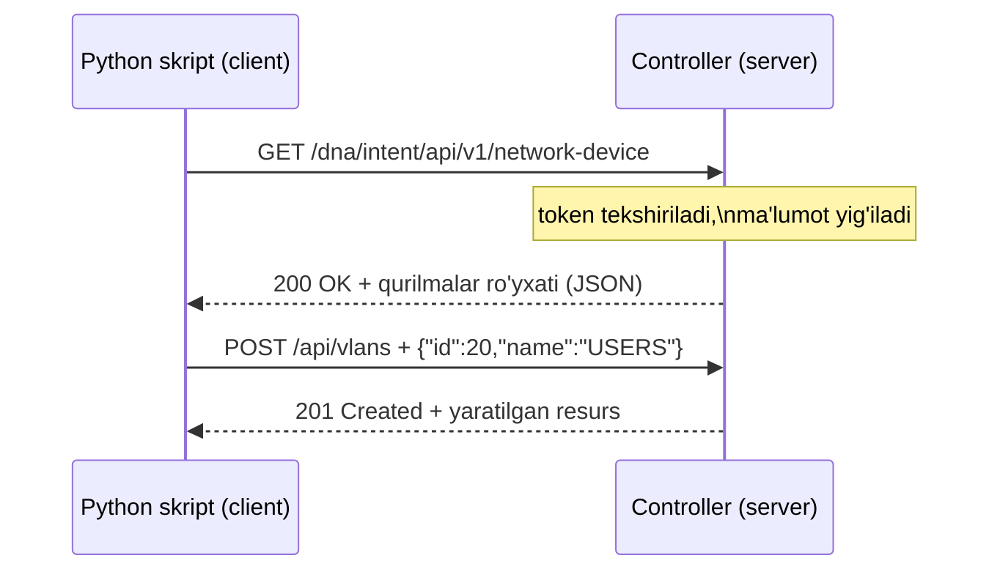
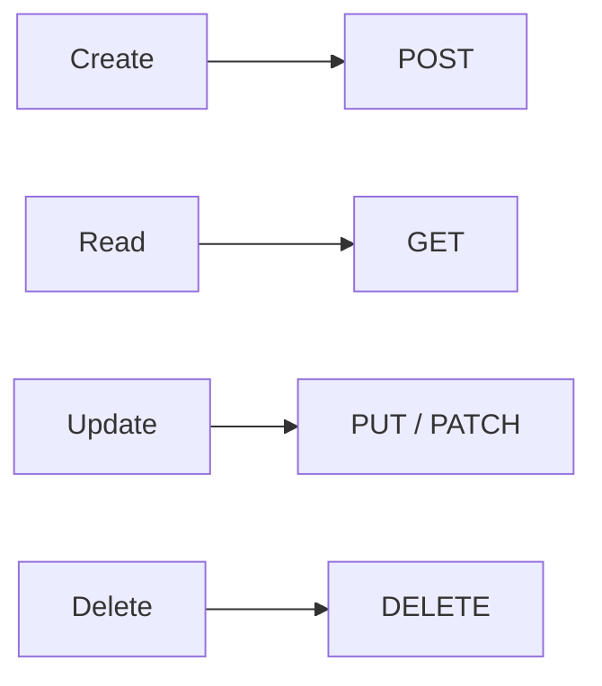
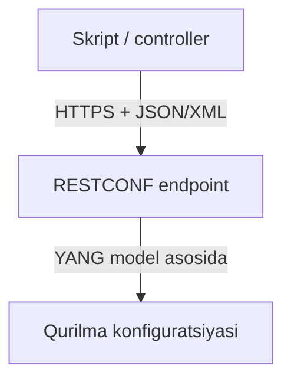

# REST API va Network Automation

## Muammo: skript switch bilan qanday "gaplashadi"?

O'tgan darsda controller butun tarmoqni bir joydan boshqarishini ko'rdik. Lekin
bitta savol ochiq qoldi: Python skripting yoki dashboard controller bilan
**qanday tilda** gaplashadi? Sen CLI'da `show interfaces` yozasan — skript nima
yozadi?

Agar har vendor o'z "tili"ni ixtiro qilsa, har integratsiya uchun yangi kod
yozish kerak bo'lardi. Bu — xaos.

> REST API aynan shu muammoni yechadi: skript va controller **HTTP** degan
> umumiy tilda, hamma tushunadigan qoidalar bilan gaplashadi.

## Analogiya: restoran ofitsianti

Sen oshxonaga kirib o'zing ovqat pishirmaysan. **Menyu** (API hujjati)dan
tanlaysan, **ofitsiant**ga (API) buyurtma berasan, u oshpazga (server) yetkazadi,
tayyor taom (response) qaytadi.

- Sen **oshxona ichini bilishing shart emas** — faqat menyu va ofitsiantni
  bilasan.
- **Menyu = API hujjati** — nima so'rash mumkinligini aytadi.
- **Buyurtma = HTTP request**, **taom = HTTP response**.

Chegara: ofitsiant faqat menyudagini olib keladi. API ham faqat hujjatda
belgilangan resurslar va amallarni beradi — "menyuda yo'q" narsani so'rasang,
`404` qaytadi.

## Sodda ta'rif

**REST API** (Representational State Transfer) — resurslarga **URL** orqali
murojaat qilib, **HTTP** ustidan ma'lumot almashadigan API uslubi. **Resurs** —
qurilma, interface, VLAN, policy kabi obyekt.

**API** (Application Programming Interface) — bir tizim boshqasi bilan qanday
gaplashishini belgilaydigan interfeys (kelishuv).

## Client-server suhbati



Har suhbat bitta qoidaga bo'ysunadi: **client so'raydi, server javob beradi**.

## HTTP verbs va CRUD: to'rt asosiy amal

Har qanday ma'lumot bilan sen 4 ta ish qilasan: yaratasan, o'qiysan,
o'zgartirasan, o'chirasan. Bu — **CRUD**. REST uni HTTP verb'larga bog'laydi.



| CRUD | HTTP verb | Ma'nosi | Network misol |
|---|---|---|---|
| Create | POST | yangi resurs yaratish | yangi VLAN yaratish |
| Read | GET | ma'lumot o'qish | qurilmalar ro'yxatini olish |
| Update | PUT / PATCH | resursni o'zgartirish | interface description almashtirish |
| Delete | DELETE | resursni o'chirish | eski policy'ni o'chirish |

**PUT** butun resursni to'liq almashtiradi, **PATCH** faqat bitta maydonni
o'zgartiradi. Aynan qaysi biri kerakligini vendor hujjati aytadi.

## HTTP status kodlari: server javobining "yuz ifodasi"

Server har javobda uch xonali kod qaytaradi. Uni guruhlab eslab qol.

| Kod | Ma'nosi | Oddiy tushuncha |
|---|---|---|
| 200 OK | muvaffaqiyat | so'rov bajarildi |
| 201 Created | yaratildi | yangi resurs paydo bo'ldi |
| 204 No Content | tanasiz muvaffaqiyat | o'chirish/update bo'ldi |
| 400 Bad Request | noto'g'ri so'rov | JSON yoki parametr xato |
| 401 Unauthorized | autentifikatsiya yo'q | token/login kerak |
| 403 Forbidden | ruxsat yo'q | login bor, huquq yetmaydi |
| 404 Not Found | topilmadi | URL/resurs noto'g'ri |
| 500 Internal Server Error | server xatosi | API tomonida muammo |

Guruh qoidasi: **2xx = yaxshi**, **4xx = sening xatoing**, **5xx = server
xatosi**.

## RESTCONF: qurilmani REST bilan boshqarish

REST API ko'pincha controller bilan gaplashadi. Lekin qurilmaning **o'zi** bilan
REST uslubida gaplashish uchun maxsus standart bor — **RESTCONF** (RFC 8040).

RESTCONF ostida **YANG** degan ma'lumot modeli yotadi. YANG — qurilmaning
konfiguratsiyasi va holati qanday tuzilishga ega ekanini tavsiflaydigan "sxema".



RESTCONF URL'i odatda `/restconf/data/...` bilan boshlanadi. Misol —
interface holatini o'qish:

```bash
# --- 1-qadam: RESTCONF orqali interface ma'lumotini olish ---
curl -k -X GET \
  "https://192.0.2.10/restconf/data/ietf-interfaces:interfaces" \
  -H "Accept: application/yang-data+json" \
  -u "admin:parol"
```

Javob (qisqartirilgan JSON):

```json
{
  "ietf-interfaces:interfaces": {
    "interface": [
      { "name": "GigabitEthernet1", "enabled": true }
    ]
  }
}
```

**RESTCONF vs NETCONF (2025 amaliyoti):** RESTCONF DevOps pipeline'lariga oson
qo'shiladi (GitLab CI/CD, Kubernetes — hammasi HTTP biladi). NETCONF esa qat'iy
transaksiya kafolati kerak bo'lganda ustun — masalan 500 ta router'ni bitta
oynada OSPF'dan EIGRP'ga ko'chirishda. Cisco Catalyst Center RESTCONF'ni
northbound, NETCONF'ni southbound sifatida ishlatadi.

## Worked example: Catalyst Center bilan ishlash

Cisco **Catalyst Center** (avvalgi DNA Center)da ish ikki bosqichli: avval
**token** olasan, keyin token bilan real so'rov yuborasan.

```bash
# --- 1-qadam: username/parol bilan token olish ---
curl -k -X POST \
  "https://dnac.example.local/dna/system/api/v1/auth/token" \
  -H "Content-Type: application/json" \
  -u "admin:parol"
```

Javob:

```json
{ "Token": "eyJhbGciOiJSUzI1NiIsImtpZCI6..." }
```

```bash
# --- 2-qadam: token bilan barcha qurilmalarni so'rash ---
curl -k -X GET \
  "https://dnac.example.local/dna/intent/api/v1/network-device" \
  -H "X-Auth-Token: eyJhbGciOiJSUzI1NiIsImtpZCI6..."
```

Bu yerda ish **intent-based**: sen "menga qurilmalar ro'yxati kerak" deysan,
Catalyst Center o'zining southbound protokollari (NETCONF/SNMP) orqali
ma'lumotni yig'ib beradi.

## Worked example: Python bilan qurilmalar ro'yxati

```python
import requests

# --- 1-qadam: URL va token header'ni tayyorlaymiz ---
url = "https://dnac.example.local/dna/intent/api/v1/network-device"
headers = {"X-Auth-Token": "TOKEN"}

# --- 2-qadam: GET so'rovini yuboramiz ---
response = requests.get(url, headers=headers, verify=False)

# --- 3-qadam: natijani tekshirib, chiqaramiz ---
if response.status_code == 200:
    for dev in response.json()["response"]:
        print(dev["hostname"], dev["managementIpAddress"])
else:
    print("API xato:", response.status_code)
```

Output namunasi:

```text
SW1 192.168.10.11
R1  192.168.10.1
```

Eslatma: `verify=False` faqat labda. Production'da HTTPS sertifikatlarini
to'g'ri sozlash kerak — bu 2025 xavfsizlik best practice'ining bir qismi.

## Authentication va authorization

Bu ikkisini chalkashtirma:

- **Authentication** — "sen kimsan?" (token/login orqali isbot).
- **Authorization** — "senga nima qilishga ruxsat bor?" (huquqlar, RBAC).

Keng uchraydigan usullar: username/parol orqali **token** olish, **API key**,
**Bearer token**, **OAuth**. Token odatda header'da yuboriladi:

```http
Authorization: Bearer TOKEN
X-Auth-Token: TOKEN
```

## Idempotency: bir amalni takrorlash xavfsizmi?

**Idempotent** amal bir necha marta bajarilsa ham natija o'zgarmaydi — bu
automation uchun juda muhim (skript ikki marta ishga tushib qolsa nima bo'ladi?).

| Verb | Idempotentmi? | Nega |
|---|---|---|
| GET | Ha | faqat o'qiydi, o'zgartirmaydi |
| PUT | Odatda ha | resursni aniq belgilangan holatga keltiradi |
| DELETE | Odatda ha | o'chirilgan resursni qayta o'chirish yangi holat yaratmaydi |
| POST | Odatda yo'q | har chaqiruvda yangi resurs yaratishi mumkin |

## Predict savoli

Sen POST bilan `VLAN 20` yaratding — `201 Created` keldi. Skript xato ketib,
**xuddi shu POST**ni yana yuboradi.

> 🤔 **O'ylab ko'r:** Ikkinchi POST'da nima bo'lishi mumkin? Nega bu PUT'dan
> farq qiladi?

<details>
<summary>💡 Javobni ko'rish</summary>

POST idempotent emas, shuning uchun API dizayniga qarab ikki xil natija bo'lishi
mumkin: (1) ikkinchi `VLAN 20` **dublikat** yaratiladi yoki (2) server "bu ID
allaqachon bor" deb `400`/`409` xato qaytaradi.

Agar sen **PUT** ishlatganingda — `PUT /api/vlans/20` — har chaqiruvda natija
bir xil bo'lardi: "VLAN 20 aynan shu holatda bo'lsin". PUT idempotent, shuning
uchun automation'da ko'proq xavfsiz.
</details>

## Ko'p uchraydigan xatolar

⚠️ **GET bilan o'zgartirishga urinish.** GET faqat o'qish uchun. O'zgartirish
kerak bo'lsa POST/PUT/PATCH/DELETE ishlat.

⚠️ **Content-Type qo'ymaslik.** JSON body yuborsang, `Content-Type:
application/json` kerak — aks holda server body'ni tushunmay `400` qaytaradi.

⚠️ **Token'ni body ichiga qo'yish.** Token deyarli har doim **header**da
yuboriladi (`Authorization` yoki `X-Auth-Token`), body'da emas.

⚠️ **401 va 403'ni chalkashtirish.** `401` — autentifikatsiya yo'q/noto'g'ri
(kim ekaning noma'lum). `403` — kim ekaning ma'lum, lekin huquqing yetmaydi.

⚠️ **HTTP ishlatish.** Token'ni ochiq HTTP'da yuborma — har doim HTTPS. Bu 2025
best practice'ining eng muhim bandi.

## Xulosa

- **REST API** — HTTP ustidan resurslar bilan ishlaydigan API uslubi;
  network automation'da controller/qurilma bilan gaplashadi.
- **CRUD** amallar HTTP verb'larga bog'lanadi: POST, GET, PUT/PATCH, DELETE.
- Status kodlar: **2xx** yaxshi, **4xx** sening xatoing, **5xx** server xatosi.
- **RESTCONF** (RFC 8040) — qurilmani REST uslubida, YANG model asosida boshqarish.
- **Catalyst Center** ishi ikki bosqichli: avval token, keyin token bilan so'rov.
- **Authentication** — kim ekaning; **authorization** — ruxsating.
- **Idempotency** automation uchun muhim: GET/PUT/DELETE idempotent, POST odatda emas.

## 🧠 Eslab qol

- GET o'qiydi, POST yaratadi, PUT/PATCH o'zgartiradi, DELETE o'chiradi.
- Token header'da yuboriladi, HTTPS orqali.
- 401 = kimliging noma'lum, 403 = huquqing yetmaydi.
- RESTCONF = REST uslubi + YANG model qurilma uchun.
- POST idempotent emas — takrorlansa dublikat yaratishi mumkin.

## ✅ O'z-o'zini tekshir (retrieval practice)

**1. Nega automation'da PUT ko'pincha POST'dan xavfsizroq?**

<details>
<summary>Javob</summary>

Chunki PUT idempotent — u resursni aniq belgilangan holatga keltiradi, necha
marta yuborsang ham natija bir xil. POST har chaqiruvda yangi resurs yaratishi
mumkin, shuning uchun skript takrorlansa dublikat paydo bo'lishi mumkin.
</details>

**2. Farqi nima: 401 va 403 status kodlari?**

<details>
<summary>Javob</summary>

401 Unauthorized — autentifikatsiya yo'q yoki noto'g'ri; server sen kimligingni
bilmayapti (token yo'q/eskirgan). 403 Forbidden — server sen kimligingni biladi,
lekin bu amalga huquqing yetmaydi (authorization muammosi).
</details>

**3. Nima bo'ladi, agar JSON body yuborsang-u, lekin Content-Type header'ni
qo'ymasang?**

<details>
<summary>Javob</summary>

Ko'p server body'ni to'g'ri parse qila olmaydi va `400 Bad Request` qaytaradi
(yoki body'ni umuman e'tiborsiz qoldiradi). Shuning uchun JSON yuborganda
`Content-Type: application/json` header'ni qo'yish shart.
</details>

**4. Nega RESTCONF NETCONF'dan ko'ra DevOps pipeline'ga oson qo'shiladi?**

<details>
<summary>Javob</summary>

Chunki RESTCONF oddiy HTTP/HTTPS ustida ishlaydi va CI/CD tizimlari, Kubernetes,
serverless funksiyalar HTTP so'rovlarni allaqachon biladi — SSH client kerak
emas. NETCONF esa maxsus SSH transport va qat'iy transaksiya modelidan
foydalanadi, u bulk va transaksion ishlar uchun kuchliroq.
</details>

## 🛠 Amaliyot

**1. Oson (Modify).** Yuqoridagi `curl` misolini o'zgartiring: `VLAN 20` yaratish
o'rniga `VLAN 30` "GUEST" yarating, keyin uni `PATCH` bilan "GUEST-WIFI" deb
nomlang. Qaysi status kodlarni kutasiz?

<details>
<summary>Hint</summary>

POST -> `201 Created`, PATCH -> `200 OK` yoki `204 No Content`. Body'da
`{"id":30,"name":"GUEST"}` va keyin `{"name":"GUEST-WIFI"}` bo'ladi. Content-Type
header'ni unutma.
</details>

**2. O'rta (faded example).** Python skript skeletonini to'ldiring:

```python
import requests

url = "https://dnac.example.local/dna/intent/api/v1/vlan"
headers = {
    "X-Auth-Token": "TOKEN",
    # TODO: JSON body yuborish uchun kerakli header'ni qo'sh
}
body = {"id": 40, "name": "IOT"}

# TODO: yangi VLAN yaratish uchun to'g'ri HTTP verb'ni tanla
response = requests.____(url, headers=headers, json=body, verify=False)

# TODO: muvaffaqiyatli yaratishning status kodini tekshir
if response.status_code == ____:
    print("VLAN yaratildi")
```

<details>
<summary>Hint</summary>

Header'ga `"Content-Type": "application/json"` qo'sh. Yaratish uchun
`requests.post`. Muvaffaqiyatli yaratish kodi `201`.
</details>

**3. Qiyin (Make).** Noldan Python funksiya yozing: `get_offline_devices(token)`.
U Catalyst Center'dan barcha qurilmalarni oladi va faqat `reachabilityStatus`
maydoni "Unreachable" bo'lganlarini ro'yxat qilib qaytaradi.

<details>
<summary>Hint</summary>

GET `/dna/intent/api/v1/network-device` -> `response.json()["response"]` -> list
comprehension bilan filtrlash: `[d for d in devices if d["reachabilityStatus"]
== "Unreachable"]`. Status kodni ham tekshir.
</details>

## 🔁 Takrorlash

**Bog'liq oldingi mavzular:**
- Bu moduldagi oldingi dars: [SDN va controller-based networking](01-sdn-controller-based.md)
  (northbound API aynan REST bo'lib chiqadi)
- Application layer (HTTP metodlari, status kodlari, headers)
- Bu moduldagi keyingi dars: [JSON va YAML](03-json-yaml.md) (API body formati)

**Takrorlash jadvali:**
- **Ertaga:** CRUD -> HTTP verb jadvalini yoddan tikla.
- **3 kundan keyin:** status kod guruhlarini (2xx/4xx/5xx) misol bilan ayt.
- **1 haftadan keyin:** token olish + so'rov yuborishning ikki bosqichini
  `curl` bilan yozib chiq.

**Feynman testi:** REST API'ni "restoran ofitsianti" analogiyasi bilan, kod
ishlatmasdan, bir do'stingga 3 jumlada tushuntira olasanmi?

## 📚 Manbalar

- Cisco DevNet — NETCONF and REST Device Management API: https://developer.cisco.com/docs/cisco-netconf-and-rest-device-management-api-documentation/
- Network Journey — Cisco DNA Center APIs (CCNP Enterprise): https://networkjourney.com/cisco-dna-center-apis-automating-the-network-the-smarter-way-ccnp-enterprise/
- NetworkersHome — NETCONF & RESTCONF model-driven programmability: https://www.networkershome.com/fundamentals/network-automation/netconf-restconf-model-driven-programmability/
- ITU Online — Implementing Network Automation Using Cisco Scripts and APIs: https://www.ituonline.com/blogs/implementing-network-automation-using-cisco-scripts-and-apis/
