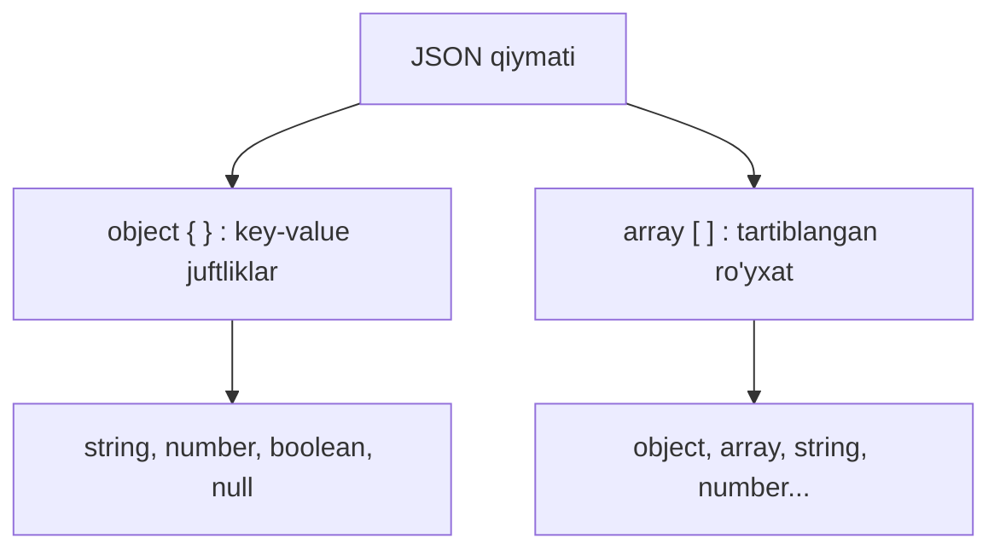
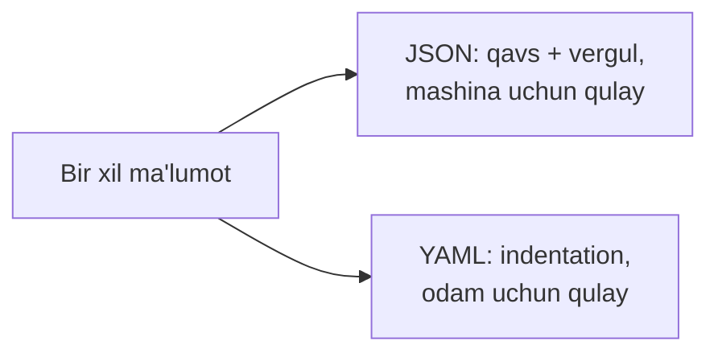

# JSON va YAML: Automation Ma'lumot Formatlari

## Muammo: ikki dastur bir-birini qanday tushunadi?

O'tgan darsda REST API request'da body yubordik:
`{"id":20,"name":"USERS"}`. Lekin nega aynan shu ko'rinishda? Python skript
tomonda bu bitta obyekt, controller tomonda esa boshqa til, boshqa xotira
tuzilishi. Ikkalasi bir-birini qanday tushunadi?

Javob — **umumiy matn formati**. Ma'lumotni ikkala tomon ham bir xil o'qiy
oladigan **matn** ko'rinishiga aylantirish kerak. Bu jarayon **serialization**
deyiladi.

> JSON va YAML aynan shu vazifani bajaradi: ichki ma'lumot tuzilmasini
> hamma tushunadigan matnga aylantiradi va qaytadi.

## Analogiya: xalqaro pochta yorlig'i

Sen O'zbekistondan Yaponiyaga posilka yuborasan. Ichida nima borligini yapon
pochtachi ham, o'zbek pochtachi ham tushunishi kerak. Shuning uchun **standart
yorliq** to'ldiriladi: "nomi: ..., og'irligi: ..., manzil: ...".

- **Posilka ichidagi narsa = dasturdagi ma'lumot** (obyekt, ro'yxat).
- **Standart yorliq = JSON/YAML** — hamma tushunadigan yozuv.

Chegara: yorliq — narsaning **o'zi emas**, uning **tavsifi**. Xuddi shunday,
JSON matn — ma'lumotning o'zi emas, uning matn ko'rinishidagi tasviri. Dastur
uni qayta "ochib" ichki obyektga aylantiradi (**deserialization**).

## Sodda ta'rif

**JSON** (JavaScript Object Notation) — ma'lumotni matn ko'rinishida
ifodalaydigan format; REST API request va response'larida eng ko'p ishlatiladi.

**Serialization** — ichki ma'lumotni matnga aylantirish; **deserialization** —
matnni qaytadan ichki ma'lumotga aylantirish.

## JSON qurilishi: ikki g'isht

JSON butunlay ikki asosiy "g'isht"dan quriladi: **object** va **array**.



**Object** `{}` — nomlangan juftliklar to'plami:

```json
{
  "hostname": "SW1",
  "managementIp": "192.168.10.11",
  "online": true
}
```

**Array** `[]` — tartiblangan ro'yxat:

```json
["SW1", "SW2", "R1"]
```

Ikkisi bir-biriga **ichma-ich** joylashishi mumkin — real API javoblari shunday
quriladi.

## JSON syntax qoidalari

Qat'iy qoidalar (birortasi buzilsa — parse xatosi):

- object `{}` bilan, array `[]` bilan yoziladi;
- **key har doim qo'shtirnoq** ichida: `"name"`;
- string qiymatlar qo'shtirnoq ichida: `"USERS"`;
- key va value orasida `:`;
- juftliklar `,` bilan ajraladi;
- **oxirgi elementdan keyin vergul yo'q** (trailing comma taqiqlangan).

To'g'ri:

```json
{
  "vlan": 10,
  "name": "USERS"
}
```

Noto'g'ri (ikki xato bor):

```json
{
  vlan: 10,
  "name": "USERS",
}
```

Xatolar: `vlan` key'i qo'shtirnoqsiz, va oxirida ortiqcha vergul.

## JSON data types

| Type | Misol | Izoh |
|---|---|---|
| string | `"SW1"` | matn, qo'shtirnoqda |
| number | `10`, `3.14` | son, qo'shtirnoqsiz |
| boolean | `true`, `false` | kichik harf bilan |
| null | `null` | qiymat yo'q |
| object | `{ "id": 1 }` | key-value tuzilma |
| array | `[1, 2, 3]` | ro'yxat |

> Diqqat: JSON'da `true`/`false`/`null` — **kichik harf**. Python'dagi
> `True`/`False`/`None` bilan aralashtirma.

## Real network API response

Katta API javob ko'pincha "array ichida object'lar" ko'rinishida bo'ladi:

```json
{
  "devices": [
    { "hostname": "SW1", "managementIp": "192.168.10.11", "online": true },
    { "hostname": "R1",  "managementIp": "192.168.10.1",  "online": true }
  ],
  "count": 2
}
```

Bu yerda: `devices` — array, uning ichida device object'lari; `count` — number;
`online` — boolean. Skript `data["devices"][0]["hostname"]` orqali `SW1` ga
yetadi.

## JSON va Python: o'xshash, lekin bir xil emas

Python `dict` JSON'ga juda o'xshaydi, lekin uch farq bor:

| Tushuncha | Python | JSON |
|---|---|---|
| Rost | `True` | `true` |
| Yolg'on | `False` | `false` |
| Bo'sh | `None` | `null` |

```python
import json

# --- 1-qadam: JSON matnni Python obyektiga aylantirish (deserialize) ---
text = '{"hostname": "SW1", "online": true}'
data = json.loads(text)
print(data["hostname"], data["online"])   # SW1 True

# --- 2-qadam: Python obyektni JSON matnga aylantirish (serialize) ---
device = {"hostname": "SW1", "vlans": [10, 20, 30]}
print(json.dumps(device, indent=2))
```

Output:

```text
SW1 True
{
  "hostname": "SW1",
  "vlans": [
    10,
    20,
    30
  ]
}
```

E'tibor ber: `json.loads` `true`ni Python `True`ga, `json.dumps` esa `True`ni
`true`ga avtomatik aylantirdi.

## YAML: odam uchun qulayroq format

Ansible playbook'lari JSON emas, **YAML** ishlatadi. YAML — o'sha ma'lumotni,
lekin **qavs va vergulsiz**, bo'sh joy (indentation) orqali ifodalaydi.



Bir xil ma'lumot, ikki format:

```json
{
  "vlan": 10,
  "name": "USERS",
  "ports": ["Gi1/0/1", "Gi1/0/2"]
}
```

```yaml
vlan: 10
name: USERS
ports:
  - Gi1/0/1
  - Gi1/0/2
```

Muhim fakt: **YAML — JSON'ning superset'i**. Ya'ni har qanday to'g'ri JSON
aynan vaqtda to'g'ri YAML hisoblanadi (YAML parser JSON'ni tushunadi), lekin
teskarisi shart emas.

## JSON vs YAML vs XML

| Xususiyat | JSON | YAML | XML |
|---|---|---|---|
| Asosiy joyi | REST API | Ansible playbook, config | NETCONF, eski API |
| Odam o'qishi | o'rtacha | oson | qiyinroq |
| Syntax qat'iyligi | qat'iy (qavs/vergul) | indentation'ga sezgir | teglar, verbose |
| Comment | yo'q | bor (`#`) | bor |
| Network misol | Catalyst Center | Ansible task | NETCONF RPC |

XML NETCONF'da ishlatiladi va teglar bilan yoziladi (`<vlan>10</vlan>`). U
verbose (uzun), lekin qat'iy strukturaga ega. Zamonaviy network automation
ko'proq JSON va YAML tomon siljigan, XML esa NETCONF/YANG dunyosida qoladi.

## Worked example: bitta ma'lumot uch formatda

Xuddi shu VLAN konfiguratsiyasi:

```json
{ "id": 30, "name": "GUEST", "status": "active" }
```

```yaml
id: 30
name: GUEST
status: active
```

```xml
<vlan>
  <id>30</id>
  <name>GUEST</name>
  <status>active</status>
</vlan>
```

Uchtasi bir xil ma'noni beradi — faqat "yorliq" ko'rinishi farq qiladi. Skript
qaysi tizim bilan gaplashsa, o'sha formatni ishlatadi.

## Predict savoli

Sen quyidagi "JSON"ni API'ga yubording:

```json
{
  "vlan": 30,
  "name": 'GUEST',
  "enabled": True,
}
```

> 🤔 **O'ylab ko'r:** Bu yerda **nechta** JSON xatosi bor? Server nima
> qaytaradi?

<details>
<summary>💡 Javobni ko'rish</summary>

**Uchta** xato bor:

1. `'GUEST'` — string uchun single quote ishlatilgan; JSON'da faqat qo'shtirnoq
   `"GUEST"`.
2. `True` — katta harf bilan; JSON'da `true` (kichik harf).
3. Oxirgi qatordagi `,` — trailing comma, JSON'da taqiqlangan.

Server bu body'ni parse qila olmaydi va `400 Bad Request` qaytaradi. To'g'risi:
`{ "vlan": 30, "name": "GUEST", "enabled": true }`.
</details>

## Ko'p uchraydigan xatolar

⚠️ **String'ga single quote.** JSON'da string faqat qo'shtirnoq `"..."` ichida.
`'GUEST'` — xato.

⚠️ **Trailing comma.** Oxirgi element/juftlikdan keyin vergul qo'yish JSON'da
taqiqlangan (Python'da mumkin — shu chalkashtiradi).

⚠️ **Boolean'ni katta harf bilan.** JSON: `true`/`false`. Python `True`/`False`
emas.

⚠️ **Key'ni qo'shtirnoqsiz.** JSON'da key ham string bo'lishi shart: `"vlan"`,
`vlan` emas.

⚠️ **IP'ni son deb yozish.** IP address **string**: `"192.168.1.1"`. Son
sifatida yozilsa (nuqtalar tufayli) baribir xato bo'ladi.

⚠️ **YAML'da indentation'ni tab bilan.** YAML **bo'sh joy** (space) talab
qiladi, tab ishlatilsa parse buziladi.

## Xulosa

- **Serialization** — ichki ma'lumotni matnga aylantirish; ikki dastur shu
  orqali bir-birini tushunadi.
- **JSON** ikki g'ishtdan quriladi: **object** `{}` va **array** `[]`.
- JSON qoidalari qat'iy: key qo'shtirnoqda, boolean kichik harf, trailing comma
  yo'q.
- Python `dict` JSON'ga o'xshaydi, lekin `True/False/None` -> `true/false/null`.
- **YAML** — o'sha ma'lumot, lekin indentation orqali; odam uchun qulay,
  Ansible ishlatadi.
- YAML — JSON'ning superset'i; XML esa NETCONF dunyosida qoladi.
- Har tizim o'ziga mos formatni ishlatadi: REST -> JSON, Ansible -> YAML,
  NETCONF -> XML.

## 🧠 Eslab qol

- Object = `{ key: value }`, array = `[ ... ]`.
- JSON boolean kichik harf: `true`/`false`/`null`.
- JSON'da trailing comma va single quote yo'q.
- YAML indentation'ga sezgir, tab emas, space.
- IP address har doim string.

## ✅ O'z-o'zini tekshir (retrieval practice)

**1. Nima bo'ladi, agar Python'da `json.dumps({"ok": True})` chaqirsang —
natijada `True` yoki `true` bo'ladimi?**

<details>
<summary>Javob</summary>

`true` (kichik harf). `json.dumps` Python'ning `True` qiymatini JSON standartiga
mos ravishda `true`ga aylantiradi. Aynan shuning uchun ham qo'lda JSON yozganda
`true` ishlatish kerak.
</details>

**2. Farqi nima: serialization va deserialization?**

<details>
<summary>Javob</summary>

Serialization — ichki ma'lumot obyektini matnga aylantirish (masalan
`json.dumps`). Deserialization — matnni qaytadan ichki obyektga aylantirish
(`json.loads`). Birinchisi yuborishdan oldin, ikkinchisi qabul qilgach ishlaydi.
</details>

**3. Nega YAML har qanday JSON'ni tushunadi, lekin JSON har qanday YAML'ni
tushunmaydi?**

<details>
<summary>Javob</summary>

Chunki YAML — JSON'ning superset'i (kengaytmasi). JSON syntax'i YAML'ning bir
qismi, shuning uchun to'g'ri JSON avtomatik to'g'ri YAML. Lekin YAML'da
indentation, comment, kalitsiz qiymatlar kabi JSON'da yo'q imkoniyatlar bor —
shuning uchun teskarisi ishlamaydi.
</details>

**4. Nima uchun `data["devices"][0]["hostname"]` ifodasi ishlaydi — bu yerda
qaysi tuzilmalar ketma-ket kelyapti?**

<details>
<summary>Javob</summary>

Avval `data` — object, `["devices"]` uning array maydonini oladi; `[0]` array'ning
birinchi elementini (object) oladi; `["hostname"]` esa o'sha object'ning
maydonini oladi. Ya'ni object -> array -> object -> qiymat zanjiri.
</details>

## 🛠 Amaliyot

**1. Oson (Modify).** Yuqoridagi VLAN JSON'iga (`id`, `name`, `status`) yangi
maydon qo'shing: `"ports"` — ikki port nomidan iborat array. So'ng shu ma'lumotni
YAML ko'rinishida ham yozing.

<details>
<summary>Hint</summary>

JSON: `"ports": ["Gi1/0/1", "Gi1/0/2"]`. YAML'da array — `-` bilan:
```yaml
ports:
  - Gi1/0/1
  - Gi1/0/2
```
</details>

**2. O'rta (faded example).** Quyidagi buzuq JSON'ni to'g'rilang (barcha
xatolarni toping):

```json
{
  device: "R1",
  'role': "router",
  "online": True
  "vlans": [10, 20,]
}
```

<details>
<summary>Hint</summary>

To'rt muammo: `device` key qo'shtirnoqsiz; `'role'` single quote; `True` katta
harf; `"online"` dan keyin vergul yo'q; `[10, 20,]` da trailing comma.
To'g'risi: barcha key/string'ni qo'shtirnoqqa ol, `true`, verguller to'g'rila.
</details>

**3. Qiyin (Make).** Python skript yozing: u `devices.json` faylini o'qiydi
(array ichida device object'lar), faqat `online: false` bo'lgan qurilmalar
hostname'larini yangi `offline.json` fayliga array sifatida yozadi.

<details>
<summary>Hint</summary>

`json.load(open(...))` bilan o'qi -> list comprehension bilan filtrlash ->
`json.dump(offline_list, open("offline.json","w"), indent=2)`. Boolean tekshiruv:
`if not d["online"]`.
</details>

## 🔁 Takrorlash

**Bog'liq oldingi mavzular:**
- Bu moduldagi oldingi dars: [REST API va network automation](02-rest-api-va-network-automation.md)
  (JSON aynan API body'da ishlatiladi)
- Bu moduldagi keyingi dars: [Ansible va Terraform](04-ansible-terraform.md)
  (Ansible playbook'lari YAML'da yoziladi)

**Takrorlash jadvali:**
- **Ertaga:** JSON data type jadvalini yoddan yoz.
- **3 kundan keyin:** bir VLAN ma'lumotini JSON, YAML, XML'da qayta yoz.
- **1 haftadan keyin:** buzuq JSON topshirig'iga qaytib, xatolarni sana.

**Feynman testi:** JSON va serialization'ni "xalqaro pochta yorlig'i"
analogiyasi bilan, kod ishlatmasdan bir do'stingga 3 jumlada tushuntira olasanmi?

## 📚 Manbalar

- NetworkLessons — Data Models and Structures (JSON, YAML, XML): https://networklessons.com/network-automation/data-models-and-structures
- CBT Nuggets — YANG, NETCONF & RESTCONF (CCNP): https://www.cbtnuggets.com/blog/certifications/cisco/ccnp-enterprise-what-are-yang-netconf-restconf
- Ansible — The Network CLI is Dead, Long Live XML (NETCONF+YANG): https://www.ansible.com/blog/the-network-cli-is-dead-long-live-xml-just-kidding
- Problem of Network — from spreadsheets to YANG: https://www.problemofnetwork.com/posts/yang-network-automation-spreadsheets/
