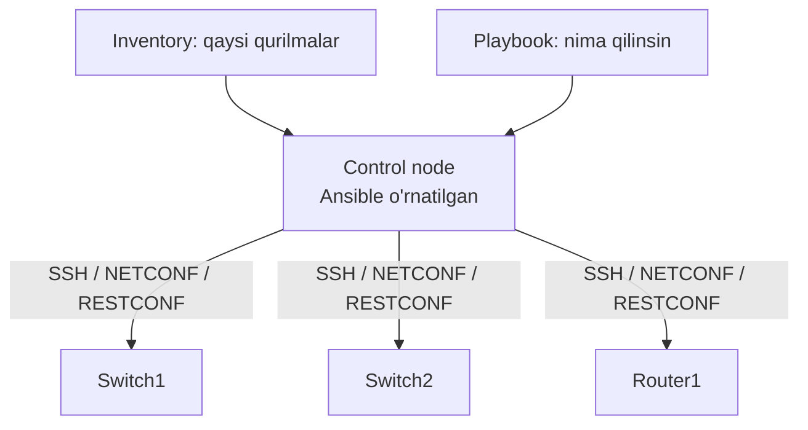
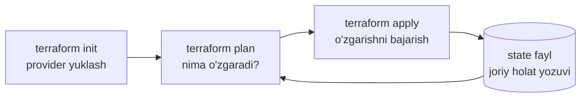
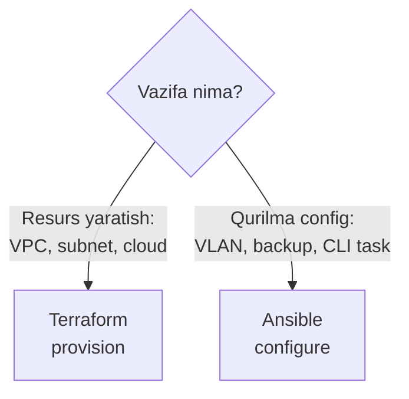

# Ansible va Terraform: Infratuzilmani Kod bilan Boshqarish

## Muammo: 500 ta switch va bitta VLAN, yana

Birinchi darsda muammoni ko'rdik: 500 ta switch'ga qo'lda kirish sekin va
xatoli. REST API'ni o'rgandik — endi skript orqali gaplashish mumkin. Lekin
har safar Python kodi yozib, token olib, loop qilib, xatolarni ushlab
o'tirasanmi?

Yo'q. Bu ish uchun **tayyor vositalar** bor. Ular takroriy ishni **shablon,
playbook yoki deklarativ konfiguratsiya** ko'rinishida saqlab, bir tugma bilan
yuzlab qurilmaga qo'llaydi.

> Ansible va Terraform — automation dunyosining ikki asosiy vositasi. Ikkalasi
> ham infratuzilmani **kod** sifatida boshqaradi, lekin falsafasi farq qiladi.

## Analogiya: oshpaz retsepti va IKEA yig'ish rejasi

Ikki xil "ko'rsatma" bor:

**Ansible = oshpaz retsepti** — qadamma-qadam: "avval piyozni to'g'ra, keyin
qovur, so'ng tuz sep". Sen **jarayon**ni tasvirlaysan.

**Terraform = IKEA yakuniy rasm** — "shkaf mana shunday ko'rinishda bo'lsin".
Sen **natija**ni tasvirlaysan, Terraform o'zi qanday yig'ishni hal qiladi.

- Ansible ko'proq **"qanday qilish"** (task ketma-ketligi).
- Terraform ko'proq **"qanday bo'lishi kerak"** (yakuniy holat).

Chegara: retsept ham, rasm ham yaxshi bo'lsa, ikki marta bajarganda **ovqat
buzilmasligi** kerak — bu **idempotency** (pastda).

## Sodda ta'rif

**Ansible** — konfiguratsiya boshqaruvi va task automation vositasi; vazifalarni
YAML **playbook** fayllar orqali bajaradi.

**Terraform** — infrastructure as code (IaC) vositasi; resurslarni **deklarativ**
konfiguratsiya orqali yaratadi, o'zgartiradi va o'chiradi.

## Ansible qanday ishlaydi: agentless model

Ansible'ning kuchli tomoni — u **agentless**. Ya'ni boshqariladigan qurilmaga
hech qanday maxsus dastur (agent) o'rnatish shart emas. U mavjud SSH, NETCONF
yoki RESTCONF orqali ulanadi.



Ansible asosiy tushunchalari:

| Tushuncha | Izoh |
|---|---|
| Inventory | qaysi qurilmalar boshqariladi |
| Playbook | bajariladigan vazifalar ro'yxati (YAML) |
| Task | bitta amal |
| Module | Ansible bajaradigan tayyor funksiya |
| Variable | qayta ishlatiladigan qiymat |
| Template | Jinja2 orqali config matni yaratish |

## Worked example: inventory va playbook

Avval **inventory** — kim boshqariladi:

```ini
[switches]
sw1 ansible_host=192.168.10.11
sw2 ansible_host=192.168.10.12

[routers]
r1 ansible_host=192.168.10.1
```

Endi **playbook** — nima qilinsin:

```yaml
---
# --- 1-qadam: qaysi guruhda ishlashni belgilaymiz ---
- name: Show version on switches
  hosts: switches
  gather_facts: no

  tasks:
    # --- 2-qadam: har switchda buyruqni bajarib, natijani saqlaymiz ---
    - name: Run show version
      ansible.netcommon.cli_command:
        command: show version
      register: output

    # --- 3-qadam: yig'ilgan natijani ekranga chiqaramiz ---
    - name: Print result
      debug:
        var: output.stdout
```

Bu playbook `switches` guruhidagi **hamma** qurilmada `show version`ni bajaradi.
Sen ikki switch uchun ham, ikki yuz switch uchun ham **bir xil** playbook
yozasan — faqat inventory o'sadi.

Ansible qachon eng foydali: bir xil config'ni ko'p qurilmaga tarqatish, backup
va audit, takroriy CLI tasklar, Jinja2 shablon orqali config yaratish.

## Terraform qanday ishlaydi: deklarativ + state

Terraform'da sen **"qanday holat bo'lishi kerakligini"** yozasan, u qanday
qilishni o'zi hal qiladi.

```hcl
# --- Ma'no: id=10, nomi USERS bo'lgan VLAN mavjud bo'lsin ---
resource "example_vlan" "users" {
  id   = 10
  name = "USERS"
}
```

Terraform **provider** orqali real platforma bilan gaplashadi — AWS, Azure,
Google Cloud, VMware yoki network controller.

Terraform tushunchalari:

| Tushuncha | Izoh |
|---|---|
| Provider | qaysi platforma bilan ishlash |
| Resource | yaratiladigan/boshqariladigan obyekt |
| Data source | mavjud obyektni o'qish |
| **State** | Terraform biladigan joriy holat |
| Plan | bajarishdan oldingi o'zgarishlar ro'yxati |
| Apply | rejalangan o'zgarishlarni bajarish |
| Destroy | resurslarni o'chirish |

## Terraform workflow va state

Terraform ishi uch buyruqdan iborat:



**State fayl** — Terraform'ning eng muhim va eng nozik qismi. U "men nimalarni
yaratganman va ular hozir qanday holatda" degan yozuvni saqlaydi. Terraform har
`plan`da state'ni real dunyo bilan solishtiradi va **faqat farqni** qo'llaydi.

Misol — cloud'da network va subnet:

```hcl
resource "cloud_network" "campus_lab" {
  name = "campus-lab"
}

resource "cloud_subnet" "users" {
  name       = "users-subnet"
  network_id = cloud_network.campus_lab.id
  cidr       = "10.10.10.0/24"
}
```

Ma'no: shu network va unga bog'langan subnet **mavjud bo'lsin**. Terraform
qanday API chaqiruv qilishni o'zi biladi.

## Ansible vs Terraform: qachon qaysi biri?



| Savol | Ansible | Terraform |
|---|---|---|
| Asosiy vazifa | config va task automation | resurslarni IaC bilan boshqarish |
| Til | YAML playbook | HCL konfiguratsiya |
| Yondashuv | procedural + declarative modullar | to'liq deklarativ |
| State | odatda markaziy state shart emas | **state juda muhim** |
| Kuchli tomoni | qurilma config, tasklar | cloud/infra resurslari |

Formula:

```text
Ansible   = configure and automate tasks (mavjud narsani sozla)
Terraform = provision and manage infrastructure (yangi narsani yarat)
```

**2025 best practice — birgalikda ishlatish.** Bugungi kunda ular raqib emas,
**sherik**. Odatiy handoff: **Terraform Day 0** infratuzilmani yaratadi (cloud
VPC, subnet, VM), so'ng **Ansible Day 1+** o'sha resurslarni sozlaydi (qurilma
config, dastur o'rnatish). Natija — provision'dan config'gacha to'liq, takror
ishlab bo'ladigan pipeline. Bu 2025-2026'da yuqori darajali jamoalarda odat
bo'lgan.

## Idempotency: automation'ning oltin qoidasi

Bu tushuncha REST API darsida ham uchradi. Automation'da u eng muhim g'oya.

> **Idempotency** — bir xil automation necha marta ishga tushsa ham, natija
> keraksiz o'zgarmasligi.

Misol — `VLAN 10` allaqachon bor:

- **Yaxshi automation:** "VLAN 10 bor, o'zgartirish shart emas" -> hech narsa
  qilmaydi.
- **Yomon automation:** har safar yangi VLAN yaratishga urinadi -> xato yoki
  dublikat.

Ansible modullari va Terraform state — ikkalasi ham aynan shu maqsad uchun
qurilgan. Ansible har taskda "hozirgi holat kerakli holatga tengmi?" deb
tekshiradi. Terraform state orqali "farq bormi?" deb solishtiradi va faqat
kerakli o'zgarishni qo'llaydi.

## Predict savoli

Sen Terraform bilan `campus-lab` network yaratding. Keyin **cloud
konsolidan qo'lda** o'sha network nomini `campus-prod`ga o'zgartirding. So'ng
yana `terraform apply` bajarding.

> 🤔 **O'ylab ko'r:** Terraform nima qiladi? State faylda nima yozilgan edi?

<details>
<summary>💡 Javobni ko'rish</summary>

Terraform **drift** (chetlanish)ni aniqlaydi. State faylda nom `campus-lab` deb
yozilgan, lekin real dunyoda `campus-prod`. Terraform buni "men bilgan holatdan
farq" deb ko'radi va `apply`da nomni **qaytadan `campus-lab`ga qaytaradi** —
chunki sening kodingda `campus-lab` yozilgan.

Xulosa: koddan tashqarida qo'lda o'zgartirish drift keltiradi. Shuning uchun
"IaC va manual o'zgarishni aralashtirma" — asosiy qoidalardan biri.
</details>

## Ko'p uchraydigan xatolar

⚠️ **Ansible va Terraform'ni bir xil deb bilish.** Ular bir-birini to'ldiradi:
Terraform yaratadi, Ansible sozlaydi. Vazifasi har xil.

⚠️ **State faylni e'tiborsiz qoldirish.** State noto'g'ri boshqarilsa (yo'qolsa,
qo'lda tahrirlansa), kod va real infratuzilma orasida farq paydo bo'ladi.
Team'da state remote va lock bilan saqlanadi.

⚠️ **Playbookni test qilmasdan production'ga qo'llash.** Avval labda yoki kichik
guruhda sinash kerak. `--check` (dry-run) rejimidan foydalan.

⚠️ **Credential'larni kod ichida ochiq yozish.** Token, parol, API key hech
qachon kodda ochiq bo'lmasin — vault/secret manager ishlatiladi.

⚠️ **Manual o'zgarish va IaC'ni aralashtirish.** Koddan tashqarida qo'lda
o'zgartirish drift keltiradi.

## Xulosa

- Ansible va Terraform — infratuzilmani **kod** sifatida boshqaradigan ikki
  asosiy vosita.
- **Ansible** — konfiguratsiya va task automation; **agentless**, YAML playbook.
- **Terraform** — infrastructure as code; **deklarativ**, HCL, **state** yuritadi.
- Ansible "qanday qilish"ga, Terraform "qanday bo'lishi kerak"ga yaqin.
- **State** Terraform'ning yuragi: farqni aniqlaydi, faqat kerakli o'zgarishni
  qo'llaydi.
- **Idempotency** — automation'ning oltin qoidasi: takrorlash xavfsiz.
- 2025 trend: ikkalasi birga — Terraform provision, Ansible configure.

## 🧠 Eslab qol

- Ansible = configure (sozlash), Terraform = provision (yaratish).
- Ansible agentless — qurilmaga agent kerak emas.
- Terraform state = "men nima yaratganman" yozuvi.
- Idempotency = takrorlansa ham keraksiz o'zgarish yo'q.
- Credential hech qachon kodda ochiq bo'lmaydi.

## ✅ O'z-o'zini tekshir (retrieval practice)

**1. Nega Ansible "agentless" ekani afzallik hisoblanadi?**

<details>
<summary>Javob</summary>

Chunki boshqariladigan har qurilmaga alohida dastur (agent) o'rnatish, yangilash
va boshqarish shart emas. Ansible mavjud SSH/NETCONF/RESTCONF orqali ulanadi —
bu ayniqsa network qurilmalarida qulay, chunki ko'p switch/router'ga uchinchi
tomon agentini o'rnatib bo'lmaydi.
</details>

**2. Farqi nima: Ansible va Terraform yondashuvi?**

<details>
<summary>Javob</summary>

Ansible ko'proq procedural — task ketma-ketligini bajaradi ("qanday qilish").
Terraform deklarativ — yakuniy holatni tasvirlaysan ("qanday bo'lishi kerak"),
u qanday erishishni o'zi hal qiladi. Ansible sozlaydi, Terraform yaratadi.
</details>

**3. Nima bo'ladi, agar Terraform state fayli yo'qolib ketsa?**

<details>
<summary>Javob</summary>

Terraform real infratuzilmani "bilmay" qoladi — u state'ni yagona haqiqat
manbasi deb hisoblaydi. Natijada u mavjud resurslarni "yo'q" deb o'ylab, qaytadan
yaratishga urinishi yoki noto'g'ri o'zgarishlar qilishi mumkin. Shuning uchun
state remote saqlanadi va zaxiralanadi.
</details>

**4. Nega qo'lda cloud konsolidan o'zgartirish IaC bilan xavfli?**

<details>
<summary>Javob</summary>

Chunki bu **drift** keltiradi: real holat kod/state bilan mos kelmay qoladi.
Keyingi `terraform apply` yo kutilmagan o'zgarish qiladi, yo qo'lda o'zgartirishni
bekor qiladi. Bir manbadan (koddan) boshqarish qoidasi buziladi.
</details>

## 🛠 Amaliyot

**1. Oson (Modify).** Yuqoridagi playbook'ni o'zgartiring: `switches` guruhi
o'rniga `routers` guruhida ishlab, `show version` o'rniga `show ip interface
brief` bajaradigan qiling.

<details>
<summary>Hint</summary>

`hosts: routers` va `command: show ip interface brief`. Qolgan struktura
o'zgarmaydi — bu Ansible'ning kuchi: bir shablon, ko'p qo'llash.
</details>

**2. O'rta (faded example).** Terraform konfiguratsiyasini to'ldiring:

```hcl
resource "cloud_network" "branch" {
  name = "branch-net"
}

resource "cloud_subnet" "guest" {
  name       = "guest-subnet"
  # TODO: bu subnet qaysi network'ga tegishli? campus network id'ni ulang
  network_id = ____
  # TODO: guest uchun 10.20.0.0/24 tarmoq bloki
  cidr       = ____
}
```

<details>
<summary>Hint</summary>

`network_id = cloud_network.branch.id` (resource'lar orasida bog'lanish shunday
yoziladi), `cidr = "10.20.0.0/24"` (string, qo'shtirnoqda).
</details>

**3. Qiyin (Make).** Noldan Ansible playbook yozing: u `switches` guruhidagi har
switch'da `VLAN 50` "IOT" yaratsin (ixtiyoriy modul yoki `cli_command` ishlatib).
Idempotent bo'lishi uchun nima e'tiborga olish kerakligini izohda yozing.

<details>
<summary>Hint</summary>

`ios_vlans` yoki `cli_config` moduli VLAN yaratadi. Idempotentlik uchun VLAN
allaqachon bor bo'lsa qayta yaratmaslik kerak — deklarativ modullar buni o'zi
tekshiradi, xom `cli_command` esa har safar buyruq yuboradi.
</details>

## 🔁 Takrorlash

**Bog'liq oldingi mavzular:**
- Bu moduldagi oldingi dars: [JSON va YAML](03-json-yaml.md) (playbook YAML'da yoziladi)
- Bu moduldagi dars: [REST API va network automation](02-rest-api-va-network-automation.md)
  (idempotency shu yerda ham uchragan)
- Bu moduldagi keyingi dars: [AI va cloud network management](05-ai-va-cloud-network-management.md)

**Takrorlash jadvali:**
- **Ertaga:** Ansible vs Terraform jadvalini yoddan tikla.
- **3 kundan keyin:** idempotency'ni misol bilan tushuntir.
- **1 haftadan keyin:** Terraform state nima uchun kerakligini yozib chiq.

**Feynman testi:** Ansible va Terraform farqini "oshpaz retsepti va IKEA rasmi"
analogiyasi bilan, kod ishlatmasdan bir do'stingga 3 jumlada tushuntira olasanmi?

## 📚 Manbalar

- Red Hat — Ansible vs Terraform: https://www.redhat.com/en/topics/automation/ansible-vs-terraform
- HashiCorp — Terraform & Ansible: Unifying provisioning and configuration: https://www.hashicorp.com/en/blog/terraform-ansible-unifying-infrastructure-provisioning-configuration-management
- Spacelift — Terraform vs Ansible: Differences and Comparison: https://spacelift.io/blog/ansible-vs-terraform
- Nucamp — Infrastructure as Code in 2026: https://www.nucamp.co/blog/infrastructure-as-code-in-2026-terraform-ansible-and-cloudformation-explained
