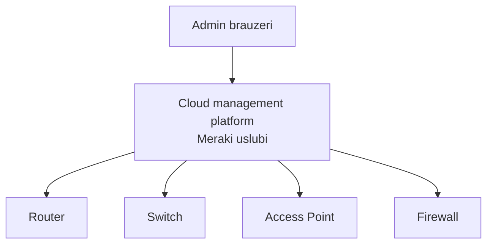
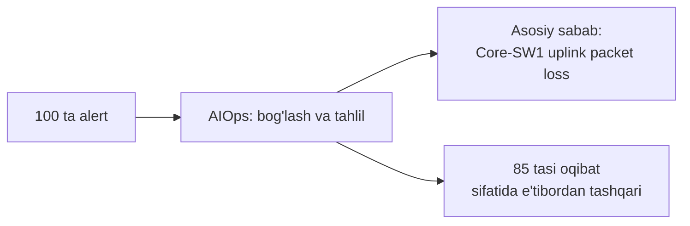
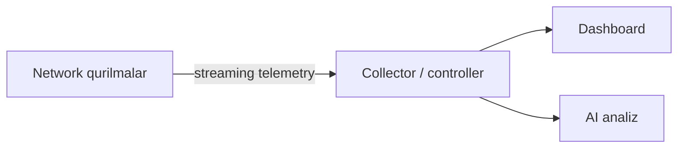
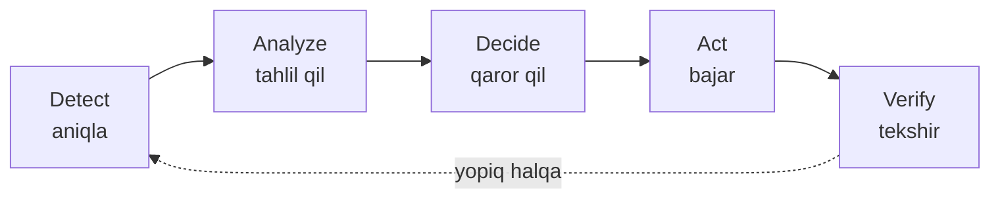

# AI, Cloud va Network Management

## Muammo: soatiga 170 000 ta alert va bitta odam

Katta tarmoqda bir uplink uzilsa, monitoring tizimi **yuzlab** alert yuboradi:
har ulangan qurilma, har servis, har link o'zicha "muammo bor!" deb qichqiradi.
Admin ekranga qaraydi — 200 ta qizil qator. Qaysi biri **haqiqiy sabab**, qaysi
biri shunchaki oqibat?

Cisco'ning AgenticOps tizimi bugun **soatiga 170 000 dan ortiq** alertni qayta
ishlaydi. Buni odam qo'lda ajrata olmaydi. Kerak bo'lgan narsa — shovqinni
kamaytirib, **asosiy sababni** ko'rsatadigan aqlli yordamchi.

> AI/ML va cloud boshqaruv aynan shu og'riqni yechadi: minglab signaldan
> muhimini ajratadi, muammoni oldindan sezadi va ba'zan o'zi tuzatadi.

## Analogiya: tibbiy monitor va shifokor

Reanimatsiya bo'limidagi bemor tanasiga o'nlab datchik ulangan: yurak, qon
bosimi, kislorod. **Monitor** (telemetry) hamma ko'rsatkichni real vaqtda
ko'rsatadi. Lekin shovqin ichida qaysi o'zgarish jiddiy?

Zamonaviy tizim **anomaliyani** o'zi belgilaydi ("kislorod normadan pastga
tushdi"), signal'ni saralaydi va shifokorga **tavsiya** beradi. Ammo dorini
yozadigan — hali ham **shifokor**.

- **Datchiklar = telemetry** — qurilmalardan uzluksiz ma'lumot oqimi.
- **Aqlli monitor = AI/ML** — anomaliya topadi, tavsiya beradi.
- **Shifokor = network admin** — yakuniy qaror va javobgarlik.

Chegara: monitor xato "signal" berishi mumkin. Shuning uchun tavsiya har doim
**tekshiriladi** — AI'ga ko'r-ko'rona ishonch xavfli.

## Sodda ta'rif

**Network management** — tarmoqni kuzatish, sozlash, muammolarni aniqlash va
hisobot berish jarayoni.

**AIOps** — IT operatsiyalarida AI/ML'dan foydalanib, ko'p signal ichidan
muhimini ajratish va tavsiya berish.

## Cloud-based network management

An'anaviy boshqaruvda vositalar bo'linib ketadi: SSH/CLI config uchun, SNMP
monitoring uchun, syslog log uchun, NetFlow trafik uchun, spreadsheet inventar
uchun. Katta tarmoqda bu ma'lumot **parchalanadi**.

Cloud-based boshqaruvda platforma cloud'da ishlaydi, qurilmalar unga ulanadi.



Cloud boshqaruvning misoli — **Cisco Meraki** uslubi: barcha qurilmalar bitta
cloud dashboard'dan boshqariladi.

| Xususiyat | On-premises | Cloud management |
|---|---|---|
| Platforma qayerda | kompaniya data center | vendor/cloud |
| Yangilash | admin bajaradi | ko'pincha vendor |
| Remote filial | VPN kerak bo'lishi mumkin | internet orqali oson |
| Nazorat | ko'proq local | servis modeliga bog'liq |
| Skalalash | resurs talab qiladi | odatda tezroq |

Ehtiyot: internet bog'lanishiga qaramlik, identity/access control, data privacy,
change control, vendor lock-in. Lekin qurilmalar odatda **local forwarding**ni
davom ettiradi — cloud uzilsa ham trafik ko'pincha oqadi.

## AI va ML: tarmoqda nima uchun?

**AI** (Artificial Intelligence) — "aqlli" vazifalarni bajaradigan
texnologiyalar umumiy nomi. **ML** (Machine Learning) — AI ichidagi yo'nalish,
tizim ma'lumotdan **pattern** o'rganadi.

Network'da ML nima qiladi:

- anomal trafikni aniqlash;
- odatiy bandwidth pattern'ini o'rganish;
- qurilma nosozligini **oldindan** taxmin qilish;
- alertlarni ustuvorlik bo'yicha saralash;
- root cause tavsiyasini berish.

**Generative AI** matn, kod, config yaratadi — yordamchi sifatida: log'ni sodda
tilda tushuntirish, config shabloni yaratish, playbook namunasi yozish. Ammo
uning javobi **har doim tekshiriladi** — u noto'g'ri buyruq yoki xavfli
o'zgarish taklif qilishi mumkin.

## AIOps: shovqindan sabab tomon

Bir uplink uziladi -> 100 ta alert. AIOps ularni bog'lab, asosiy sababni
ko'rsatadi.



```text
100 ta alert:
- 80 tasi bitta uplink muammosidan
- 15 tasi dependency sababli
- 5 tasi alohida tekshirilishi kerak

AIOps xulosasi: asosiy ehtimoliy sabab -> Core-SW1 uplink packet loss
```

Bu — odam 200 qatorni o'qishdan qutqaradigan aynan o'sha yordam.

## Telemetry: SNMP polling'ning zamonaviy avlodi

**Telemetry** — qurilmalardan holat va performance ma'lumotini yig'ish.
An'anaviy SNMP polling'da server har necha soniyada "holating qanday?" deb
**so'raydi**. Streaming telemetry'da qurilma o'zi **uzluksiz push** qiladi —
real vaqtga yaqinroq.



Yig'iladigan ma'lumot: CPU/memory, interface counters, packet drop, latency,
routing neighbor holati, wireless client tajribasi. Telemetry faqat monitoring
emas — **automation va analytics uchun asos**.

## Closed-loop automation: o'zini tuzatadigan tarmoq

Eng ilg'or bosqich — tizim muammoni **o'zi aniqlaydi, qaror qiladi va tuzatadi**.



Misol:

1. Controller branch router'da packet loss ko'payganini **aniqlaydi**.
2. Telemetry va log'larni **tahlil qiladi**.
3. Backup link yaxshi ekanini **ko'radi**.
4. Traffic policy'ni backup link tomon **o'zgartiradi**.
5. Natijani **tekshiradi**.

Kuchli, lekin xavfli: noto'g'ri siyosat muammoni kattalashtirishi mumkin.
Shuning uchun **approval, rollback va audit** shart.

## Agentic AI / AgenticOps: 2025-2026 trendi

An'anaviy AIOps faqat **insight** (xulosa) beradi. Yangi bosqich —
**AgenticOps / agentic AI** — insight beribgina qolmay, **keyingi eng yaxshi
amalni ko'rsatadi va bajaradi**.

Cisco AI Assistant Meraki, Catalyst Center, SD-WAN Manager, ISE, Nexus bo'ylab
ish oqimlarini avtomatlashtiradi: switch migratsiyasi, Wi-Fi sozlash, qurilma
onboarding — ilgari qo'lda qilinadigan ishlar. Prognoz: infratuzilma
operatsiyalarida agentic AI ulushi **2025'da 5% dan kam** bo'lsa, **2029'da 70%**
ga chiqadi.

> Muhim nyuans: agentic AI ham "sen nazoratda qolgan holda" ishlaydi. Yuqori
> xavfli va policy istisnolarida qaror hali ham **odamniki**.

## Xavfsizlik va governance

Automation, cloud va AI kirgani sari xavfsizlik **muhimroq** bo'ladi.

Yaxshi amaliyotlar:

- **least privilege** — faqat kerakli ruxsat;
- **MFA** ishlatish;
- API tokenlarni maxfiy (vault) saqlash;
- audit log'larni yoqish;
- change approval jarayonini saqlash;
- **rollback** rejasini tayyorlash;
- config'ni backup qilish.

## Worked example: Wi-Fi sekin, ikki yo'l

Muammo: filial foydalanuvchilari Wi-Fi sekinligidan shikoyat qilyapti.

```text
--- Traditional tekshiruv ---
1. AP holatini CLI/controllerdan tekshir
2. Interference, signal, client soni, uplinkni ko'r
3. Log'larni o'qi
4. Qo'lda xulosa chiqar

--- AI/cloud yordamidagi tekshiruv ---
1. Cloud dashboard "client experience score"ni ko'rsatadi
2. ML odatiy holatdan chetlanishni aniqlaydi
3. Tizim tavsiya beradi: "2.4 GHz bandda interference yuqori"
4. Admin tavsiyani tekshiradi, kanal/power siyosatini o'zgartiradi
```

E'tibor ber: oxirgi qadamda qaror hali ham adminniki — AI faqat yo'l ko'rsatdi.

## Predict savoli

Closed-loop tizim gece yarim packet loss'ni ko'rib, avtomatik ravishda trafikni
"backup link"ga ko'chirdi. Ammo backup link aslida test uchun sozlangan, past
tezlikdagi link edi.

> 🤔 **O'ylab ko'r:** Nima yuz berishi mumkin? Bu holatni oldini olish uchun
> qanday nazorat kerak edi?

<details>
<summary>💡 Javobni ko'rish</summary>

Trafik past tezlikdagi backup link'ga ko'chgani uchun **butun filial sekinlashib**
qolishi mumkin — closed-loop "tuzataman" deb muammoni kattalashtiradi.

Oldini olish nazoratlari: (1) **guardrail** — faqat ma'lum shartlarda avtomatik
harakat; (2) **approval** — muhim o'zgarishlarda odam tasdig'i; (3) **rollback** —
natija yomonlashsa avtomatik qaytarish; (4) **verify** bosqichi jiddiy — natija
tekshirilmasa halqa "yopiq" hisoblanmaydi.

Xulosa: closed-loop kuchli, lekin guardrail va audit bo'lmasa xavfli.
</details>

## Ko'p uchraydigan xatolar

⚠️ **"AI hamma muammoni o'zi hal qiladi."** AI — yordamchi. Yakuniy javobgar
odatda administrator. Agentic AI ham "odam nazoratda" modelida ishlaydi.

⚠️ **"Cloud dashboard bor — backup shart emas."** Backup va export hali ham
kerak; cloud ham uzilishi yoki data yo'qolishi mumkin.

⚠️ **Alert soniga qarab og'irlikni baholash.** Bitta asosiy muammo yuzlab alert
yaratishi mumkin — soni emas, **sababi** muhim.

⚠️ **Telemetry'ni faqat monitoring deb ko'rish.** Telemetry automation va
analytics uchun ham asos bo'ladi.

⚠️ **API token'larni oddiy faylda saqlash.** Maxfiylik, vault va access control
talab qilinadi.

## Xulosa

- **Network management** — kuzatish, sozlash, muammo aniqlash, hisobot.
- **Cloud-based management** (Meraki uslubi) — bitta dashboard, remote,
  tez deployment; lekin internet/vendor'ga qaramlik.
- **AI/ML** anomaliya topadi, nosozlikni oldindan sezadi, alertni saralaydi.
- **AIOps** shovqindan asosiy sababni ajratadi (soatiga 170 000 alert misoli).
- **Telemetry** — streaming, real vaqtga yaqin; SNMP polling'ning avlodi.
- **Closed-loop automation** o'zi tuzatadi, lekin approval/rollback/audit shart.
- Trend (2025-2026): **AgenticOps** — insight beribgina qolmay, amalni bajaradi;
  ulush 2029'da 70% ga chiqishi kutiladi.

## 🧠 Eslab qol

- AI yordamchi, yakuniy qaror odamniki.
- AIOps alert sonini emas, asosiy sababni ko'rsatadi.
- Telemetry = push, SNMP polling = pull.
- Closed-loop = Detect -> Analyze -> Decide -> Act -> Verify.
- Cloud dashboard borligi backup'ni bekor qilmaydi.

## ✅ O'z-o'zini tekshir (retrieval practice)

**1. Farqi nima: streaming telemetry va SNMP polling?**

<details>
<summary>Javob</summary>

SNMP polling'da collector qurilmadan ma'lumotni davriy **so'raydi** (pull) —
so'rovlar orasida bo'shliq bor. Streaming telemetry'da qurilma ma'lumotni o'zi
uzluksiz **push** qiladi — real vaqtga yaqinroq va batafsilroq. Ko'p tarmoqda
ikkalasi birga ishlaydi.
</details>

**2. Nega alert soni muammoning og'irligini to'g'ri ko'rsatmaydi?**

<details>
<summary>Javob</summary>

Chunki bitta asosiy muammo (masalan uplink uzilishi) yuzlab qaram alert yaratishi
mumkin. 200 ta alert bitta sababdan bo'lishi mumkin. AIOps aynan shu qaramlikni
bog'lab, sonni emas, asosiy sababni ko'rsatadi.
</details>

**3. Nima bo'ladi, agar closed-loop tizimda "verify" va "rollback" bo'lmasa?**

<details>
<summary>Javob</summary>

Tizim noto'g'ri qaror qilsa, uni tekshiradigan yoki qaytaradigan mexanizm yo'q —
avtomatik "tuzatish" muammoni kattalashtiradi va uzoq vaqt shu holatda qoladi.
Shuning uchun halqa "yopiq" bo'lishi uchun verify va rollback shart.
</details>

**4. Nega AgenticOps an'anaviy AIOps'dan farq qiladi?**

<details>
<summary>Javob</summary>

An'anaviy AIOps faqat insight/xulosa beradi (odam keyin harakat qiladi).
AgenticOps esa keyingi eng yaxshi amalni ko'rsatadi **va bajaradi** — cross-domain
ish oqimlarini (Meraki, Catalyst Center, ISE...) avtomatlashtiradi. Baribir odam
nazoratda qoladi.
</details>

## 🛠 Amaliyot

**1. Oson (Modify).** Yuqoridagi closed-loop misolini o'zgartiring: "packet
loss" o'rniga "yuqori CPU" ssenariysi uchun 5 qadamni (Detect -> Verify)
qayta yozing.

<details>
<summary>Hint</summary>

Detect: CPU 90% dan yuqori. Analyze: qaysi process yuklayotganini ko'r. Decide:
trafikni boshqa qurilmaga taqsimlash yoki process'ni cheklash. Act: policy
qo'llash. Verify: CPU normaga tushdimi.
</details>

**2. O'rta (faded example).** Bitta alert ssenariysini tahlil qiling — quyidagi
alertlarni guruhlang:

```text
Alertlar:
- Core-SW1 uplink down
- 40 ta access switch "gateway unreachable"
- 12 ta AP "controller lost"
- 1 ta "temperature high" R2 da

// TODO: qaysilari BITTA asosiy sababdan? Qaysi biri ALOHIDA?
// TODO: AIOps qaysi qatorni "root cause" deb ko'rsatadi?
```

<details>
<summary>Hint</summary>

Uplink down -> access switch va AP'lardagi alertlar oqibat (bitta sabab). "R2
temperature high" alohida, bog'liq emas. Root cause -> Core-SW1 uplink down.
</details>

**3. Qiyin (Make).** Noldan bir sahifalik "AI/automation governance checklist"
yozing: cloud + AI + closed-loop ishlatadigan jamoa uchun 7 ta majburiy nazorat
bandini o'z so'zlaringiz bilan sanang va har biriga bir jumla izoh bering.

<details>
<summary>Hint</summary>

least privilege, MFA, token vault, audit log, change approval, rollback rejasi,
config backup — har biriga "nega kerak"ni qo'sh. Guardrail va verify'ni ham
qo'shsang bo'ladi.
</details>

## 🔁 Takrorlash

**Bog'liq oldingi mavzular:**
- Bu moduldagi oldingi dars: [Ansible va Terraform](04-ansible-terraform.md)
  (automation asoslari)
- Bu moduldagi dars: [SDN va controller-based networking](01-sdn-controller-based.md)
  (controller, telemetry, dashboard)
- IP services (SNMP, syslog, NetFlow — an'anaviy management vositalari)

**Takrorlash jadvali:**
- **Ertaga:** closed-loop 5 qadamini yoddan yoz.
- **3 kundan keyin:** AIOps nima uchun kerakligini alert misoli bilan ayt.
- **1 haftadan keyin:** AgenticOps va an'anaviy AIOps farqini tushuntir.

**Feynman testi:** AIOps va telemetry'ni "tibbiy monitor va shifokor" analogiyasi
bilan, texnik jargon kamaytirib bir do'stingga 3 jumlada tushuntira olasanmi?

## 📚 Manbalar

- Cisco Blogs — From AgenticOps to Assurance: Redefining Network Operations: https://blogs.cisco.com/networking/from-agenticops-to-assurance-redefining-network-operations
- Cisco Blogs — Unlocking the AI Era (secure, simplified, scalable network): https://blogs.cisco.com/news/unlocking-the-ai-era-how-cisco-is-delivering-on-its-vision-for-a-secure-simplified-and-scalable-network
- Network World — 8 hot networking trends for 2026: https://www.networkworld.com/article/4126582/8-hot-networking-trends-for-2026.html
- FirstPassLab — Rise of Agentic AI in NetOps (2026): https://firstpasslab.com/blog/2026-04-15-rise-of-agentic-ai-when-networks-manage-themselves/
