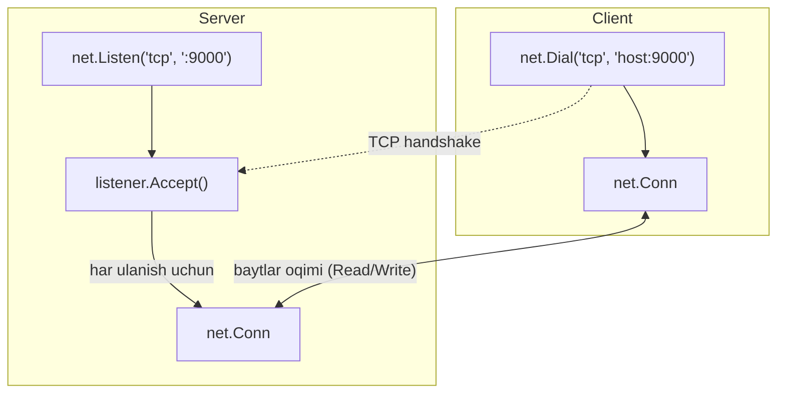
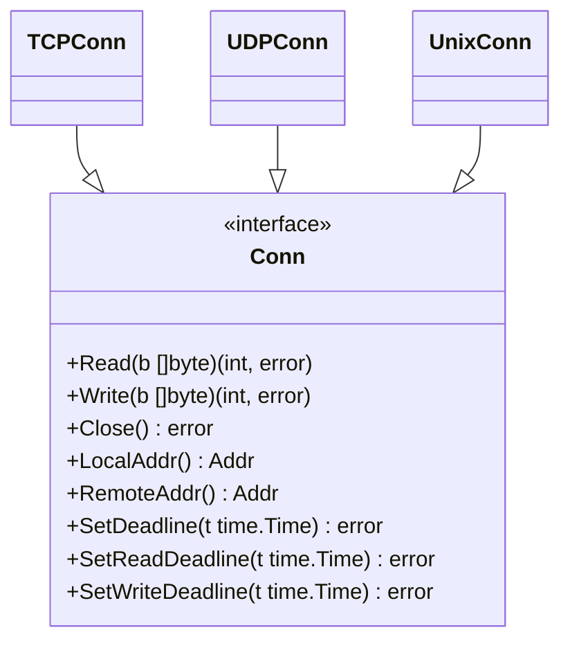

# 01. `net` package asoslari — Go'da tarmoq dasturlashning poydevori

## Muammo / Hook

Tasavvur qil: sen chat ilova, o'yin server yoki API gateway yozmoqchisan. Ular hammasi bir narsani talab qiladi — **ikki dastur tarmoq orqali bir-biri bilan gaplashishi kerak**. C tilida buni yozish uchun `socket()`, `bind()`, `listen()`, `accept()` kabi o'nlab past darajali (low-level) chaqiruvlarni qo'lda boshqarishing, xato kodlarini tekshirishing, xotira ajratishing kerak edi.

Go'da esa hammasi bitta paket ichida — `net`. Bir necha qatorda TCP server ko'tarasan, bir chaqiruvda ulanasan. Bu dars — butun modulning **poydevori**: keyingi barcha darslar (TCP, UDP, HTTP, WebSocket, gRPC, load balancer) shu yerdagi `net.Dial`, `net.Listen` va `Conn` interface ustiga quriladi.

> Bu darsni yaxshi tushunsang, qolgan hammasi "shu narsaning ustiga qurilgan qulaylik" bo'lib tuyuladi.

## Analogiya — telefon tarmog'i

`net` package'ni **telefon tarmog'i** deb tasavvur qil:

- **`net.Listen`** — o'z telefon raqamingni ro'yxatdan o'tkazish. Endi sen qo'ng'iroqlarni **kutib turasan**.
- **`net.Dial`** — kimgadir qo'ng'iroq qilish. Sen aloqani **boshlaysan**.
- **`Accept`** — jiringlagan telefonni ko'tarish. Har bir ko'tarilgan qo'ng'iroq alohida suhbat (alohida `Conn`).
- **`Conn`** — o'rnatilgan suhbat liniyasi. Ikkalasi ham gapirishi va eshitishi mumkin.
- **`Close`** — go'shakni qo'yish.

Analogiya chegarasi: telefonda faqat ovoz o'tadi, `Conn`da esa **baytlar oqimi** (stream of bytes) o'tadi. Yana bir farq — bitta raqam (bitta `Listener`) ayni vaqtda **minglab** suhbatni parallel qabul qila oladi, oddiy telefon esa bittasini.

## Sodda ta'rif

> **`net` package** — Go standart kutubxonasining tarmoq bilan ishlash uchun asosiy paketi: u TCP, UDP, Unix socket va IP darajasidagi ulanishlarni yagona, oddiy interface orqali beradi.

Uchta markaziy tushuncha bor:

| Tushuncha | Nima qiladi | Telefon analogiyasi |
| --- | --- | --- |
| `net.Listen` | Portni band qiladi, ulanish kutadi | Raqamni ro'yxatga olish |
| `net.Dial` | Boshqa tomondagi manzilga ulanadi | Qo'ng'iroq qilish |
| `net.Conn` | O'rnatilgan ulanish (o'qish/yozish) | Ochiq suhbat liniyasi |

## Diagramma — server va client oqimi



Diagramma matnni takrorlaydi: **server** kutadi (`Listen` -> `Accept`), **client** ulanadi (`Dial`), va ikkalasi o'rtasida `Conn` orqali baytlar ikki tomonlama oqadi.

## `Conn` interface — hamma narsaning markazi

Go'da `net.Conn` — bu **interface**, aniq tur emas. TCP, Unix socket, hatto TLS ulanish — hammasi shu interface'ni qanoatlantiradi. Shuning uchun bir marta `Conn` bilan ishlashni o'rgansang, hamma joyda ishlaydi.



**Notional machine (aslida nima bo'ladi):** `Conn` — bu operatsion tizim ichidagi **file descriptor** (OS ochib bergan tarmoq soketining raqamli tutqichi) ustiga o'ralgan Go obyekti. Sen `conn.Read(b)` chaqirganingda, Go runtime OS'dan "shu socketda kelgan baytlar bormi?" deb so'raydi. Agar hozircha yo'q bo'lsa, Go **goroutine'ni to'xtatib turadi** (bloklaydi), lekin OS thread'ni band qilmaydi — scheduler boshqa goroutine'larni ishga soladi. Baytlar kelganda goroutine yana uyg'onadi. Shuning uchun Go'da minglab ulanishni parallel ushlab turish arzon.

## Worked example — eng oddiy echo server va client

Keling, bir tomon yuborgan matnni ikkinchi tomon aynan qaytaradigan (echo) juftlikni yozamiz.

### Server

```go
package main

import (
	"io"
	"log"
	"net"
)

func main() {
	// --- 1-qadam: 9000-portni tinglashni boshlaymiz ("raqamni ro'yxatga olamiz") ---
	listener, err := net.Listen("tcp", ":9000")
	if err != nil {
		log.Fatalf("Listen xatosi: %v", err)
	}
	defer listener.Close()
	log.Println("Server 9000-portda tayyor")

	for {
		// --- 2-qadam: yangi ulanishni kutamiz ("jiringlagan telefonni ko'taramiz") ---
		conn, err := listener.Accept()
		if err != nil {
			log.Printf("Accept xatosi: %v", err)
			continue
		}
		// --- 3-qadam: har ulanishni alohida goroutine'da xizmatlaymiz ---
		go handle(conn)
	}
}

func handle(conn net.Conn) {
	defer conn.Close()
	log.Printf("Yangi client: %s", conn.RemoteAddr())
	// io.Copy kelgan baytlarni aynan orqaga yozadi (echo)
	if _, err := io.Copy(conn, conn); err != nil {
		log.Printf("Copy xatosi: %v", err)
	}
}
```

Bloklarga bo'lib tushuntiramiz:

- **1-qadam** — `net.Listen("tcp", ":9000")` OS'dan 9000-portni so'raydi. `:9000` degani "barcha tarmoq interfeyslarida". Agar port band bo'lsa, `err` qaytadi.
- **2-qadam** — `Accept()` **bloklaydi**: yangi client ulanmaguncha kutadi. Ulanganda yangi `Conn` qaytaradi — bu aynan shu client uchun alohida liniya.
- **3-qadam** — `go handle(conn)` orqali har bir client alohida **goroutine**'da xizmatlanadi, shuning uchun bitta sekin client boshqalarni to'sib qo'ymaydi.

`io.Copy(conn, conn)` — bu Go idiomasi: birinchi argument manzil (yoziladigan joy), ikkinchi manba (o'qiladigan joy). Ikkalasi ham bir xil `conn` bo'lgani uchun kelgan hamma narsa aynan qaytadi.

### Client

```go
package main

import (
	"bufio"
	"fmt"
	"log"
	"net"
	"os"
)

func main() {
	// --- 1-qadam: serverga ulanamiz ("qo'ng'iroq qilamiz") ---
	conn, err := net.Dial("tcp", "localhost:9000")
	if err != nil {
		log.Fatalf("Dial xatosi: %v", err)
	}
	defer conn.Close()

	// --- 2-qadam: klaviaturadan matn o'qiymiz ---
	fmt.Print("Xabar kiriting: ")
	text, _ := bufio.NewReader(os.Stdin).ReadString('\n')

	// --- 3-qadam: serverga yozamiz ---
	if _, err := conn.Write([]byte(text)); err != nil {
		log.Fatalf("Write xatosi: %v", err)
	}

	// --- 4-qadam: server javobini o'qiymiz ---
	buf := make([]byte, 1024)
	n, err := conn.Read(buf)
	if err != nil {
		log.Fatalf("Read xatosi: %v", err)
	}
	fmt.Printf("Serverdan qaytdi: %s", buf[:n])
}
```

**Ishga tushirish va output:**

```
# 1-terminal:
$ go run server.go
2026/07/10 12:00:01 Server 9000-portda tayyor
2026/07/10 12:00:05 Yangi client: 127.0.0.1:54123

# 2-terminal:
$ go run client.go
Xabar kiriting: salom Go
Serverdan qaytdi: salom Go
```

## PRIMM — bashorat qil

> 🤔 **O'ylab ko'r:** Server kodida `go handle(conn)` o'rniga oddiy `handle(conn)` (goroutine'siz) yozsak, ikkita client bir vaqtda ulanmoqchi bo'lsa nima bo'ladi?

<details>
<summary>💡 Javobni ko'rish</summary>

Ikkinchi client **kutib qoladi**. Chunki `handle(conn)` bloklovchi funksiya: u birinchi client bilan `io.Copy` ichida abadiy o'tirib qoladi (client ulanishni yopmaguncha). Bu vaqtda `main` sikldagi keyingi `Accept()`ga qaytmaydi, demak yangi ulanishlar **navbatda** turadi (OS backlog'ida).

`go` bilan har client alohida goroutine oladi va `main` darhol keyingi `Accept()`ga qaytadi — shuning uchun minglab client parallel xizmatlanadi. Bu Go'ning tarmoq serverlarida eng muhim idiomasi: **"bir ulanish = bir goroutine"**.
</details>

## Timeout va deadline — muhim production detali

Yuqoridagi `conn.Read(buf)` **abadiy** bloklashi mumkin — agar client ulanib, hech narsa yubormasa, server goroutine'i muzlab qoladi. Production'da bu **resurs sizishi** (goroutine leak). Yechim — **deadline**.

Go'da timeout `time.Duration` emas, **deadline** (aniq vaqt nuqtasi) orqali beriladi:

```go
// Bu Read/Write chaqiruvi 5 soniyadan ortiq bloklamaydi
conn.SetDeadline(time.Now().Add(5 * time.Second))

n, err := conn.Read(buf)
if errors.Is(err, os.ErrDeadlineExceeded) {
	log.Println("Client 5 soniyada javob bermadi")
	return
}
```

Muhim nuqtalar:

- **Deadline — absolyut vaqt**, timeout emas. `time.Now().Add(5*time.Second)` — "hozirdan 5 soniya keyin".
- Deadline **bir marta** o'rnatiladi va **barcha kelgusi** Read/Write'ga ta'sir qiladi. Har chaqiruvdan oldin yangilash kerak (masalan siklda).
- Deadline o'tsa, xato `os.ErrDeadlineExceeded`'ni o'raydi — `errors.Is` bilan tekshiriladi.
- `SetReadDeadline` faqat o'qishga, `SetWriteDeadline` faqat yozishga, `SetDeadline` ikkalasiga ham ta'sir qiladi.

## Context bilan dial — ulanishni bekor qilish

`net.Dial` ham abadiy kutishi mumkin (masalan server javob bermasa). Zamonaviy Go'da ulanishni **`context`** orqali boshqaramiz — bu chaqiruvni tashqaridan bekor qilish (cancellation) yoki muddat qo'yish imkonini beradi.

```go
// --- 1-qadam: 3 soniyalik muddatli context yaratamiz ---
ctx, cancel := context.WithTimeout(context.Background(), 3*time.Second)
defer cancel()

// --- 2-qadam: Dialer orqali context bilan ulanamiz ---
var d net.Dialer
conn, err := d.DialContext(ctx, "tcp", "example.com:80")
if err != nil {
	log.Fatalf("DialContext xatosi: %v", err)
}
defer conn.Close()
```

**Notional machine:** `DialContext` ichida Go bir necha ish qiladi — DNS'dan IP topadi, TCP handshake boshlaydi. Agar host bir nechta IP'ga ega bo'lsa, timeout **har bir IP orasida taqsimlanadi**: 4 ta IP va 60 soniyalik timeout bo'lsa, har biriga ~15 soniyadan beriladi. `context` bekor bo'lsa (`cancel()` chaqirilsa yoki muddat tugasa), Go darhol dial'ni to'xtatadi va xato qaytaradi. Muhim: ulanish **muvaffaqiyatli o'rnatilgach**, context muddati o'tishi ulanishga **ta'sir qilmaydi** — u faqat dial bosqichi uchun.

> Qoida: har doim tashqi manzilga ulanishda `DialContext` ishlat, oddiy `Dial` emas. Shunda "osilib qolgan" ulanishlar dasturingni bloklamaydi.

## `Addr` — manzil interface'i

Har `Conn`da ikki manzil bor: `LocalAddr()` (o'zimizniki) va `RemoteAddr()` (narigi tomonniki). Ular `net.Addr` interface'i:

```go
addr := conn.RemoteAddr()
fmt.Println(addr.Network()) // "tcp"
fmt.Println(addr.String())  // "127.0.0.1:54123"

// Aniq TCP manzil kerak bo'lsa, type assertion:
if tcpAddr, ok := addr.(*net.TCPAddr); ok {
	fmt.Println("IP:", tcpAddr.IP)     // 127.0.0.1
	fmt.Println("Port:", tcpAddr.Port) // 54123
}
```

## Ko'p uchraydigan xatolar

⚠️ **Xato 1 — `Read` bir martaga hamma narsani o'qiydi deb o'ylash.**
Noto'g'ri tasavvur: "client 1000 bayt yubordi, demak `conn.Read` 1000 baytni bir martaga qaytaradi." Nega noto'g'ri: TCP — bu **oqim** (stream), paket emas. `Read` mavjud bo'lgan **qancha bo'lsa shuncha** baytni qaytaradi — 200, keyin 800 bo'lishi mumkin. To'g'risi: siklda o'qi yoki `bufio.Reader` / `io.Copy` ishlat (buni 2-darsda chuqurlashtiramiz).

⚠️ **Xato 2 — `Close` ni unutish.**
Har ochilgan `Conn` va `Listener` yopilishi shart, aks holda file descriptor sizadi va "too many open files" xatosi chiqadi. To'g'risi: har doim `defer conn.Close()`.

⚠️ **Xato 3 — xatoni `_ =` bilan yutish.**
`conn.Write([]byte(x))` xato qaytarishi mumkin (masalan narigi tomon ulanishni uzgan). Uni e'tiborsiz qoldirsang, ma'lumot yo'qolganini bilmaysan. To'g'risi: `if _, err := conn.Write(...); err != nil { ... }`.

⚠️ **Xato 4 — timeout bilan deadline'ni chalkashtirish.**
`SetDeadline(5 * time.Second)` — **xato**, chunki bu 1970-yildan 5 soniya keyingi vaqtni beradi (ya'ni allaqachon o'tgan). To'g'risi: `SetDeadline(time.Now().Add(5 * time.Second))`.

## Xulosa

- `net` package — Go'da tarmoq dasturlashning poydevori: TCP, UDP, Unix socket'lar uchun yagona interface.
- **Server** oqimi: `net.Listen` -> `Accept` (siklda) -> har ulanish uchun `go handle(conn)`.
- **Client** oqimi: `net.Dial` (yoki `DialContext`) -> `conn.Read` / `conn.Write` -> `conn.Close`.
- `net.Conn` — interface: `Read`, `Write`, `Close`, `SetDeadline` va manzil metodlari. TCP/UDP/TLS hammasi shu interface'ni qanoatlantiradi.
- **Deadline** — timeout emas, aniq vaqt nuqtasi (`time.Now().Add(...)`), production'da goroutine leak'dan saqlaydi.
- **`DialContext`** — tashqi ulanishlarni bekor qilish va muddat qo'yish uchun to'g'ri yo'l.
- "Bir ulanish = bir goroutine" — Go tarmoq serverlarining asosiy idiomasi.

## 🧠 Eslab qol

- `Listen` kutadi, `Dial` ulanadi, `Conn` gaplashadi.
- `Accept` bloklaydi — yangi client kelmaguncha kutadi.
- Deadline = `time.Now().Add(...)`, hech qachon yalang'och `time.Duration` emas.
- TCP oqim, `Read` istalgan miqdorda bayt qaytarishi mumkin.
- Har `Conn`ni `defer conn.Close()` bilan yop.

## ✅ O'z-o'zini tekshir (retrieval practice)

**1.** Nega server siklida `go handle(conn)` yozamiz, oddiy `handle(conn)` emas? Goroutine'siz bo'lsa nima yomonlashadi?

<details>
<summary>Javob</summary>

`handle` bloklovchi (ulanish yopilmaguncha ishlaydi). Goroutine'siz `main` keyingi `Accept()`ga qaytmaydi, shuning uchun **bir vaqtda faqat bitta** client xizmatlanadi, qolganlari navbatda kutadi. `go` bilan har client parallel goroutine oladi va server minglab ulanishni bir vaqtda ushlaydi.
</details>

**2.** `conn.SetDeadline(time.Now().Add(5*time.Second))` chaqirdik, keyin siklda 10 marta `Read` qildik. Nega 6-yoki 7-`Read` `os.ErrDeadlineExceeded` qaytarishi mumkin?

<details>
<summary>Javob</summary>

Deadline **bir marta** o'rnatiladi va **absolyut vaqt** — "12:00:05". Barcha kelgusi Read'lar shu bir vaqtga bog'lanadi. 12:00:05 dan o'tgach, keyingi har qanday Read xato qaytaradi. To'g'ri yechim — har `Read`dan oldin deadline'ni **qayta** o'rnatish (siklda `SetReadDeadline` yangilash).
</details>

**3.** `Dial` va `DialContext` orasidagi asosiy farq nima, va qaysi biri production'da afzal?

<details>
<summary>Javob</summary>

`Dial` ichida `context.Background()` ishlatadi — uni tashqaridan bekor qilib bo'lmaydi va faqat OS'ning standart timeout'iga tayanadi (juda uzun). `DialContext` esa `context` qabul qiladi: muddat qo'yish yoki tashqaridan `cancel()` bilan to'xtatish mumkin. Production'da doim `DialContext` afzal, chunki osilib qolgan ulanish dasturni bloklamaydi.
</details>

**4.** Client 5000 bayt yubordi. Serverdagi bitta `conn.Read(buf)` (buf 1024 bayt) chaqiruvi nechta bayt qaytaradi?

<details>
<summary>Javob</summary>

Ko'pi bilan 1024 bayt (buf hajmi), lekin **kamroq** ham bo'lishi mumkin — masalan 300 bayt. TCP oqim bo'lgani uchun ma'lumot bo'laklarda keladi. Butun 5000 baytni olish uchun `Read`'ni **siklda** chaqirish yoki `io.ReadFull` / `bufio.Reader` ishlatish kerak.
</details>

## 🛠 Amaliyot

**1. Oson (Modify).** Echo server'ni shunday o'zgartir: kelgan matnni aynan qaytarish o'rniga, uni **katta harflarga** aylantirib qaytarsin (`strings.ToUpper`). `io.Copy` o'rniga qo'lda o'qib-yozishing kerak bo'ladi.

<details>
<summary>Hint</summary>

`io.Copy` o'rniga: `buf := make([]byte, 1024)`, siklda `n, err := conn.Read(buf)`, keyin `conn.Write([]byte(strings.ToUpper(string(buf[:n]))))`. `err == io.EOF` bo'lsa siklni to'xtat.
</details>

**2. O'rta (faded example — TODO to'ldirish).** Quyidagi client skeletini to'ldirib, serverga har 2 soniyada vaqtni yuboradigan qil:

```go
func main() {
	conn, err := net.Dial("tcp", "localhost:9000")
	if err != nil {
		log.Fatal(err)
	}
	defer conn.Close()

	ticker := time.NewTicker(2 * time.Second)
	defer ticker.Stop()

	for range ticker.C {
		// TODO: har chaqiruvdan oldin write deadline o'rnat (3 soniya)
		// TODO: hozirgi vaqtni (time.Now().Format(...)) conn ga yoz
		// TODO: xato bo'lsa log qilib, sikldan chiq
	}
}
```

<details>
<summary>Hint</summary>

`conn.SetWriteDeadline(time.Now().Add(3*time.Second))`, keyin `_, err := conn.Write([]byte(time.Now().Format("15:04:05") + "\n"))`, keyin `if err != nil { log.Println(err); break }`.
</details>

**3. Qiyin (Make — noldan).** "Time server" yoz: client ulanishi bilan server unga joriy vaqtni yuborib, darhol ulanishni yopadi. Client ulanadi, bitta o'qish qiladi, natijani chop etadi. Bir Listener'da bir necha client'ni goroutine bilan xizmatla va har ulanishga 5 soniyalik yozish deadline'i qo'y.

<details>
<summary>Hint</summary>

Server: `Listen` -> siklda `Accept` -> `go func(c net.Conn){ defer c.Close(); c.SetWriteDeadline(time.Now().Add(5*time.Second)); c.Write([]byte(time.Now().String()+"\n")) }(conn)`. Client: `Dial` -> `io.ReadAll(conn)` -> chop et.
</details>

## 🔁 Takrorlash

- **Bog'liq keyingi darslar:** [02-tcp-client-server.md](02-tcp-client-server.md) (bu yerdagi `Conn`ni chuqurlashtiradi), [03-udp-client-server.md](03-udp-client-server.md), [04-http-server-va-client.md](04-http-server-va-client.md).
- **Takrorlash jadvali:** bu darsning "O'z-o'zini tekshir" savollariga **ertaga**, keyin **3 kundan so'ng**, keyin **1 haftadan so'ng** qaytib javob berib ko'r. Ayniqsa "deadline vs timeout" va "TCP oqim" savollarini.
- **Feynman testi:** `net.Listen`, `net.Dial` va `Conn` so'zlarini **ishlatmasdan**, bir do'stingga "Go'da ikki dastur qanday gaplashadi?" degan savolga 3 jumlada javob berib ko'r. Agar telefon analogiyasi bilan tushuntira olsang — mavzuni o'zlashtirgansan.

## 📚 Manbalar

- [net package — Go Packages (pkg.go.dev)](https://pkg.go.dev/net)
- [Timeouts in Go: A Comprehensive Guide — Better Stack](https://betterstack.com/community/guides/scaling-go/golang-timeouts/)
- [Go feature: Context-aware Dialer methods — antonz.org](https://antonz.org/accepted/net-dialer-context/)
- [Efficient Use of net/http, net.Conn, and UDP — Go Optimization Guide](https://goperf.dev/02-networking/efficient-net-use/)
- [Mastering Network Timeouts and Retries in Go — DEV Community](https://dev.to/jones_charles_ad50858dbc0/mastering-network-timeouts-and-retries-in-go-a-practical-guide-for-devto-jdf)
