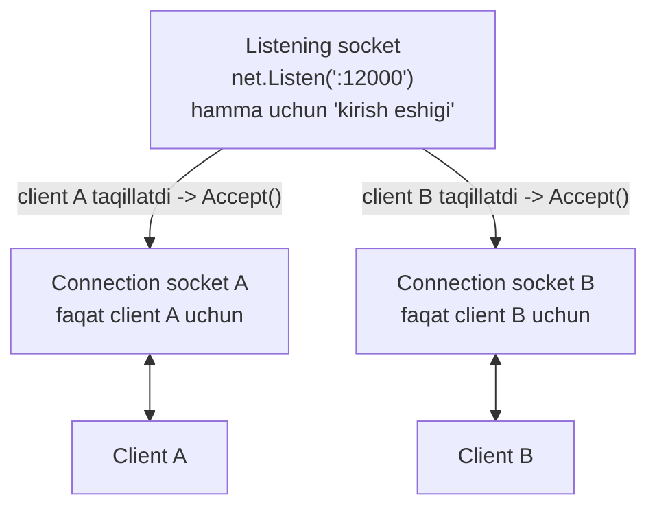
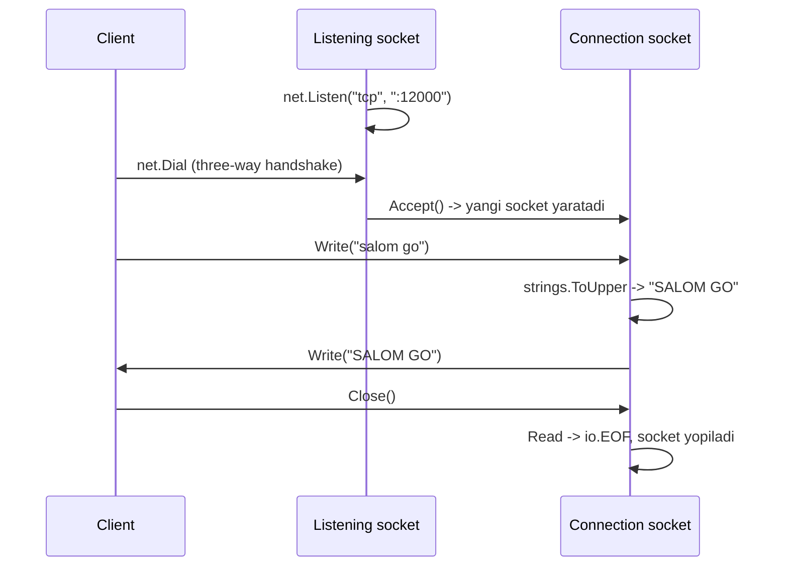
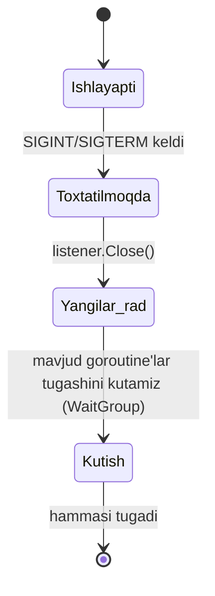
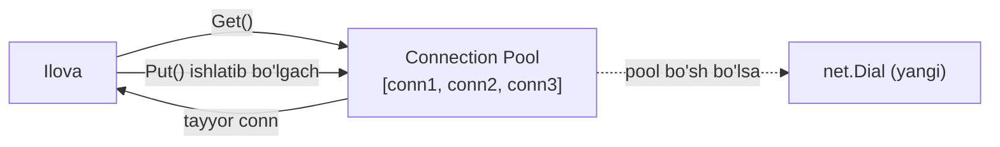

# 02. TCP client-server — ishonchli ulanish amaliyoti

## Muammo / Hook

Bir tomon ma'lumot yubordi — ikkinchi tomon uni **to'liq, tartibda va yo'qotishsiz** olishiga ishonch hosil qilish kerak. Fayl uzatish, chat, ma'lumotlar bazasi ulanishi — hammasi shu kafolatga muhtoj. Agar 3-baytdan keyin 5-bayt kelib, 4-bayt yo'qolib qolsa, dasturing buziladi.

Mana shu joyda **TCP** kirib keladi. TCP — bu **ishonchli, ulanishga asoslangan** (connection-oriented) protokol. 1-darsda `net.Conn` bilan tanishding; bu darsda o'sha `Conn`ni to'liq TCP client-server ilova qurish uchun ishlatamiz — echo serverdan boshlab, production darajasidagi graceful shutdown va connection pool tushunchasigacha.

> UDP darsidan farqli o'laroq, TCP'da "paketga manzil biriktirish" yo'q — bir marta ulaning, keyin oddiy faylga yozgandek yozing.

## Analogiya — telefon suhbati vs xat tashlash

TCP'ni **telefon suhbati** deb tasavvur qil (UDP esa xat tashlash — buni 3-darsda ko'ramiz):

- Avval **qo'ng'iroq qilib bog'lanasan** (three-way handshake). Aloqa o'rnatilmaguncha gapira olmaysan.
- Bir marta bog'langach, **gapiraveramiz** — har jumlaga "kimga" deb manzil yozmaymiz.
- Aytgan so'zlaring **tartib bilan** yetadi — "salom" dan oldin "xayr" eshitilmaydi.
- Aloqa uzilsa, ikkalasi ham **biladi** (go'shak qo'yilgani seziladi).

Analogiya chegarasi: telefonda ovoz yo'qolsa qayta so'raysan; TCP'da bu **avtomatik** — yo'qolgan bayt qayta yuboriladi, sen buni sezmaysan ham.

## Sodda ta'rif

> **TCP (Transmission Control Protocol)** — ikki tomon o'rtasida oldindan **ulanish o'rnatib**, ma'lumotni **baytlar oqimi** sifatida, **tartibda va yo'qotishsiz** yetkazadigan transport protokoli.

Asosiy farq (manba matndan): UDP'da server har paketga manzil biriktirib yuboradi; TCP'da bir marta ulanish o'rnatiladi va keyin ma'lumot shunchaki oqimga "tashlanadi".

## Diagramma — ikki xil socket

Manba matndagi eng muhim g'oya: serverda **ikki xil** socket bor. Ko'pchilik yangi o'rganuvchilar buni chalkashtiradi.



- **Listening socket** (`serverSocket`) — bitta, "kirish eshigi", hamma client shunga taqillaydi.
- **Connection socket** (`connectionSocket`) — har client uchun `Accept()` yangi yaratadi, faqat o'sha client bilan gaplashadi.

## Diagramma — client-server suhbat oqimi



## Worked example 1 — sodda TCP echo (uppercase) server

Manba matndagi klassik misolni Go 1.22+ idiomalari bilan qayta yozamiz: client bir qator yuboradi, server katta harflarga aylantirib qaytaradi.

### Server — asosiy skelet

```go
package main

import (
	"log"
	"net"
)

func main() {
	// --- 1-qadam: kirish eshigini ochamiz (listening socket) ---
	listener, err := net.Listen("tcp", ":12000")
	if err != nil {
		log.Fatalf("Listen xatosi: %v", err)
	}
	defer listener.Close()
	log.Println("Server tayyor, 12000-portda kutmoqda")

	for {
		// --- 2-qadam: taqillatgan client uchun connection socket yaratamiz ---
		conn, err := listener.Accept()
		if err != nil {
			log.Printf("Accept xatosi: %v", err)
			continue
		}
		// --- 3-qadam: har client alohida goroutine'da ---
		go handleConn(conn)
	}
}
```

### Server — ulanishni xizmatlash

```go
import (
	"bufio"
	"strings"
	// ... yuqoridagilar
)

func handleConn(conn net.Conn) {
	defer conn.Close()
	log.Printf("Ulandi: %s", conn.RemoteAddr())

	// --- 1-qadam: bufio.Reader qatorma-qator o'qishni osonlashtiradi ---
	reader := bufio.NewReader(conn)

	for {
		// --- 2-qadam: '\n' gacha bitta qatorni o'qiymiz ---
		line, err := reader.ReadString('\n')
		if err != nil {
			log.Printf("Client uzildi: %s", conn.RemoteAddr())
			return
		}
		// --- 3-qadam: katta harflarga aylantirib qaytaramiz ---
		upper := strings.ToUpper(line)
		if _, err := conn.Write([]byte(upper)); err != nil {
			log.Printf("Write xatosi: %v", err)
			return
		}
	}
}
```

Nega **`bufio.Reader`**? 1-darsda ko'rgan edik: TCP oqim, `conn.Read` istalgan miqdorda bayt qaytaradi. `bufio.NewReader(conn)` ichki bufer tutadi va `ReadString('\n')` bilan aniq **bitta qator** olishni kafolatlaydi — bo'lak-bo'lak kelgan baytlarni o'zi yig'ib beradi. Bu darsning eng muhim amaliy darsi.

### Client

```go
package main

import (
	"bufio"
	"fmt"
	"log"
	"net"
	"os"
)

func main() {
	// --- 1-qadam: serverga ulanamiz (handshake shu yerda bo'ladi) ---
	conn, err := net.Dial("tcp", "localhost:12000")
	if err != nil {
		log.Fatalf("Dial xatosi: %v", err)
	}
	defer conn.Close()

	stdin := bufio.NewReader(os.Stdin)
	server := bufio.NewReader(conn)

	for {
		// --- 2-qadam: klaviaturadan qator o'qiymiz ---
		fmt.Print("> ")
		text, err := stdin.ReadString('\n')
		if err != nil {
			return
		}
		// --- 3-qadam: serverga yuboramiz ---
		if _, err := conn.Write([]byte(text)); err != nil {
			log.Printf("Write xatosi: %v", err)
			return
		}
		// --- 4-qadam: javobni o'qib chop etamiz ---
		reply, err := server.ReadString('\n')
		if err != nil {
			log.Printf("Serverdan o'qish xatosi: %v", err)
			return
		}
		fmt.Print("Server: ", reply)
	}
}
```

**Output:**

```
# Server terminal:
$ go run server.go
2026/07/10 12:00:01 Server tayyor, 12000-portda kutmoqda
2026/07/10 12:00:07 Ulandi: 127.0.0.1:55010

# Client terminal:
$ go run client.go
> salom go
Server: SALOM GO
> tcp juda ishonchli
Server: TCP JUDA ISHONCHLI
```

## PRIMM — bashorat qil

> 🤔 **O'ylab ko'r:** Client `conn.Write([]byte("salom"))` yozdi, lekin **`\n` qo'shmadi**. Server tomonda `reader.ReadString('\n')` nima qiladi?

<details>
<summary>💡 Javobni ko'rish</summary>

Server **bloklanadi va kutadi** — `ReadString('\n')` `\n` belgisini topmaguncha qaytmaydi. "salom" baytlari bufer'da yotadi, lekin qator "tugallanmagan". Client keyin `\n` yuborsa yoki ulanishni yopsa (`io.EOF`) qaytadi.

Bu ko'p uchraydigan bug: agar sen delimiter (ajratuvchi belgi) sifatida `\n` ishlatayotgan bo'lsang, **yuboruvchi ham** har xabar oxiriga `\n` qo'shishi shart. Aks holda ikki tomon bir-birini kutib **deadlock**ka tushadi.
</details>

## Worked example 2 — graceful shutdown

Production serverni to'satdan "o'ldirib" bo'lmaydi: hozir xizmatlanayotgan client'lar yarim yo'lda uzilib qoladi. **Graceful shutdown** — yangi ulanishlarni to'xtatib, ammo mavjudlarni **tugatishga imkon berib**, keyin yopish.



```go
package main

import (
	"context"
	"log"
	"net"
	"os"
	"os/signal"
	"sync"
	"syscall"
)

func main() {
	// --- 1-qadam: SIGINT/SIGTERM signalini kuzatadigan context ---
	ctx, stop := signal.NotifyContext(context.Background(),
		syscall.SIGINT, syscall.SIGTERM)
	defer stop()

	listener, err := net.Listen("tcp", ":12000")
	if err != nil {
		log.Fatalf("Listen xatosi: %v", err)
	}

	// --- 2-qadam: signal kelsa listener'ni yopamiz -> Accept xato beradi ---
	go func() {
		<-ctx.Done()
		log.Println("Shutdown signali keldi, yangi ulanishlar to'xtatilmoqda")
		listener.Close()
	}()

	var wg sync.WaitGroup
	for {
		conn, err := listener.Accept()
		if err != nil {
			break // listener yopilgani uchun sikldan chiqamiz
		}
		// --- 3-qadam: har goroutine'ni WaitGroup'ga qo'shamiz ---
		wg.Add(1)
		go func(c net.Conn) {
			defer wg.Done()
			handleConn(c)
		}(conn)
	}

	// --- 4-qadam: barcha ulanishlar tugashini kutamiz ---
	log.Println("Mavjud ulanishlar tugashi kutilmoqda...")
	wg.Wait()
	log.Println("Server toza yopildi")
}
```

Bloklarni tushuntiramiz:

- **`signal.NotifyContext`** — Ctrl+C (SIGINT) yoki `kill` (SIGTERM) bosilganda `ctx.Done()` yopiladi. Bu Go 1.16+ dagi eng toza usul.
- **`listener.Close()`** — buni chaqirganda `Accept()` darhol xato qaytaradi, shuning uchun `for` siklidan chiqamiz. **Yangi** ulanish qabul qilinmaydi.
- **`sync.WaitGroup`** — har goroutine `wg.Add(1)` bilan ro'yxatga olinadi, tugaganda `wg.Done()`. `wg.Wait()` esa **hammasi tugaguncha** bloklaydi.
- Natija: dastur yangi ulanishni rad qiladi, lekin allaqachon boshlangan suhbatlarni **oxirigacha** yetkazadi.

**Notional machine:** `listener.Close()` OS'ga "bu portni endi tinglama" deydi. OS `Accept()` da kutayotgan goroutine'ni uyg'otib, xato beradi. Ammo mavjud connection socket'lar (file descriptor'lar) **hali ochiq** — ular alohida, listening socket'dan mustaqil. Shuning uchun mavjud client'lar suhbatni davom ettiradi.

## Connection pool — nega va qanday

Har safar `net.Dial` qilish **qimmat**: DNS qidiruv, TCP handshake (uch bosqichli), ba'zan TLS handshake. Agar dasturing bir serverga **minglab** so'rov yuborsa, har biriga yangi ulanish ochish resursni yeydi va sekin bo'ladi.

**Connection pool** — ochilgan ulanishlarni **qayta ishlatish** uchun saqlab turadigan "ombor". So'rov kerak bo'lganda pool'dan tayyor ulanishni olasan, ish tugagach **qaytarasan** (yopmaysan).



Eng oddiy pool — **buffered channel** ustiga qurilgan:

```go
type Pool struct {
	conns chan net.Conn
	addr  string
}

// --- pool yaratamiz, size ta joy bilan ---
func NewPool(addr string, size int) *Pool {
	return &Pool{conns: make(chan net.Conn, size), addr: addr}
}

// --- Get: pool'dan ol, bo'sh bo'lsa yangi dial ---
func (p *Pool) Get() (net.Conn, error) {
	select {
	case c := <-p.conns:
		return c, nil // qayta ishlatish
	default:
		return net.Dial("tcp", p.addr) // yangi ulanish
	}
}

// --- Put: ishlatib bo'lgach qaytar, pool to'la bo'lsa yop ---
func (p *Pool) Put(c net.Conn) {
	select {
	case p.conns <- c:
		// pool'ga qaytdi
	default:
		c.Close() // pool to'la, yopamiz
	}
}
```

`chan net.Conn` — bufer'li channel. `Get`: agar channelda tayyor ulanish bo'lsa oladi, bo'lmasa yangisini ochadi. `Put`: channelga joy bo'lsa qaytaradi (qayta ishlatish uchun), bo'lmasa yopadi. Bu 1-darsdagi "channel = navbat" g'oyasining amaliy qo'llanishi. (Amalda `net/http` va `database/sql` ichida ancha murakkab pool bor — sanog'imizni buni tushunish uchun soddalashtirdik.)

## Ko'p uchraydigan xatolar

⚠️ **Xato 1 — delimiter'siz oqimni qatorlarga bo'lmoqchi bo'lish.**
Noto'g'ri tasavvur: "har `Write` bir `Read`ga to'g'ri keladi." Nega noto'g'ri: TCP oqim, ikkita `Write` bitta `Read`da yoki bitta `Write` ikkita `Read`da kelishi mumkin. To'g'risi: xabar chegarasini o'zing belgila — `\n` delimiter yoki oldiga uzunlik (length prefix) qo'y va `bufio.Reader` ishlat.

⚠️ **Xato 2 — har `Accept`da `defer conn.Close()`ni `main`da yozish.**
`for` siklida `defer` **funksiya oxirigacha** ishlamaydi, `main` esa hech qachon tugamaydi -> ulanishlar yopilmaydi, leak bo'ladi. To'g'risi: `Close`ni `handleConn` ichida `defer` qil.

⚠️ **Xato 3 — graceful shutdown'siz deploy.**
`kill -9` (SIGKILL) bilan o'ldirsang, mavjud so'rovlar yarim yo'lda uziladi — mijoz "connection reset" oladi. To'g'risi: SIGTERM'ni ushlab, `listener.Close()` + `wg.Wait()` bilan toza yop.

⚠️ **Xato 4 — pool'ga o'lik ulanishni qaytarish.**
Uzoq turgan ulanish server tomonidan yopilgan bo'lishi mumkin. Uni pool'dan olib ishlatsang, `Write` xato beradi. Production pool'lar har olishda ulanish "tirikligini" tekshiradi yoki retry qiladi.

## Xulosa

- TCP — ulanishga asoslangan, ishonchli, tartibli baytlar oqimi beradi.
- Serverda **ikki xil socket**: listening socket (`Listen`, bitta) va connection socket (`Accept`, har client uchun).
- Oqimni qatorlarga bo'lish uchun **`bufio.Reader` + delimiter** (`\n`) ishlat — `Read` bir xabarni kafolatlamaydi.
- "Bir ulanish = bir goroutine" idiomasi TCP serverni parallel qiladi.
- **Graceful shutdown**: `signal.NotifyContext` -> `listener.Close()` -> `sync.WaitGroup.Wait()`.
- **Connection pool** ulanishlarni qayta ishlatib, handshake xarajatini kamaytiradi; oddiy holda buffered channel ustiga quriladi.

## 🧠 Eslab qol

- TCP = telefon suhbati: avval bog'lan, keyin manzasiz gaplash.
- Listening socket bitta, connection socket har client uchun.
- Xabar chegarasini o'zing belgila (`\n` yoki length prefix).
- Graceful shutdown = yangi rad, mavjudni tugat.
- Pool = ulanishni qayta ishlat, handshake'ni takrorlama.

## ✅ O'z-o'zini tekshir (retrieval practice)

**1.** Nega `conn.Read` o'rniga `bufio.NewReader(conn).ReadString('\n')` ishlatamiz? Oddiy `Read` bilan qanday bug chiqadi?

<details>
<summary>Javob</summary>

TCP oqim bo'lgani uchun bitta `Read` bir xabarni to'liq yoki yarim, yoki bir necha xabarni birga qaytarishi mumkin. `bufio.Reader` ichki bufer tutib, `ReadString('\n')` bilan aniq **bitta qator**ni (delimiter'gacha) yig'ib beradi. Oddiy `Read` bilan xabarlar bir-biriga yopishib yoki bo'linib ketadi — bu "message framing" bug'i.
</details>

**2.** Graceful shutdown'da `listener.Close()` chaqirilganda mavjud client suhbatlari nega uzilmaydi?

<details>
<summary>Javob</summary>

`listener.Close()` faqat **listening socket**'ni yopadi (yangi `Accept`'ni to'xtatadi). Mavjud **connection socket**'lar alohida file descriptor'lar — ular ochiq qoladi va o'z goroutine'larida ishlashda davom etadi. `wg.Wait()` esa shu goroutine'lar tugaguncha kutadi.
</details>

**3.** Connection pool'da `Get()` chaqirilganda pool bo'sh bo'lsa nima bo'ladi? Va `Put()`da pool to'la bo'lsa-chi?

<details>
<summary>Javob</summary>

`Get()`: `select`ning `default` shoxiga tushib, `net.Dial` bilan **yangi** ulanish ochadi. `Put()`: `default` shoxida ulanishni **yopadi** (`c.Close()`), chunki pool'da joy yo'q — cheksiz ulanish to'planib qolmasligi uchun.
</details>

**4.** Client `\n` qo'shmasdan xabar yubordi va serverda `ReadString('\n')` turibdi. Ikkalasi ham hech narsa yozmasa nima bo'ladi?

<details>
<summary>Javob</summary>

**Deadlock**ka o'xshash holat: server `\n`ni kutib bloklanadi, client ham javob kutib bloklanadi. Ikkalasi ham abadiy kutadi. Yechim: har xabar oxiriga `\n` qo'yish (delimiter kelishuvi) va read deadline o'rnatish.
</details>

## 🛠 Amaliyot

**1. Oson (Modify).** Uppercase echo server'ni "reverse" server'ga aylantir: kelgan qatorni **teskari** aylantirib qaytarsin ("salom" -> "molas"). Faqat `handleConn`ni o'zgartir.

<details>
<summary>Hint</summary>

`strings.ToUpper(line)` o'rniga qatorni rune'larga aylantirib teskari qil: `runes := []rune(strings.TrimRight(line, "\n"))`, ikki uchdan almashtir, keyin `string(runes) + "\n"` qaytar.
</details>

**2. O'rta (faded example — TODO to'ldirish).** Quyidagi graceful shutdown skeletiga har ulanishga **read deadline** qo'sh, shunda jim turgan client 30 soniyadan keyin uzilsin:

```go
func handleConn(conn net.Conn) {
	defer conn.Close()
	reader := bufio.NewReader(conn)
	for {
		// TODO: har o'qishdan oldin read deadline o'rnat (30 soniya)
		line, err := reader.ReadString('\n')
		if err != nil {
			// TODO: agar err deadline bo'lsa "timeout" deb log qil
			return
		}
		conn.Write([]byte(strings.ToUpper(line)))
	}
}
```

<details>
<summary>Hint</summary>

`conn.SetReadDeadline(time.Now().Add(30*time.Second))`. Xatoni tekshirish: `if errors.Is(err, os.ErrDeadlineExceeded) { log.Println("timeout"); }`. `errors` va `os` paketlarini import qil.
</details>

**3. Qiyin (Make — noldan).** "Length-prefixed" protokol yoz: har xabar oldidan uning uzunligini 4-baytlik `uint32` (big-endian) sifatida yubor. Server avval 4 baytni o'qib uzunlikni bilib olsin, keyin aynan shuncha baytni o'qisin. Bu `\n` delimiter'dan ishonchliroq (ikkilik ma'lumot uchun ham ishlaydi).

<details>
<summary>Hint</summary>

Yozish: `binary.Write(conn, binary.BigEndian, uint32(len(data)))`, keyin `conn.Write(data)`. O'qish: `var n uint32; binary.Read(conn, binary.BigEndian, &n)`, keyin `buf := make([]byte, n); io.ReadFull(conn, buf)`. `encoding/binary` va `io` paketlaridan foydalan.
</details>

## 🔁 Takrorlash

- **Bog'liq darslar:** [01-net-package-asoslari.md](01-net-package-asoslari.md) (bu yerdagi `Conn` va deadline shu darsda chuqurlashdi), keyingi [03-udp-client-server.md](03-udp-client-server.md) TCP bilan taqqoslash uchun.
- **Takrorlash jadvali:** "ikki xil socket" va "message framing" savollariga **ertaga**, **3 kundan so'ng**, **1 haftadan so'ng** qaytib javob ber.
- **Feynman testi:** "Nega TCP'da xabar chegarasini o'zim belgilashim kerak, agar TCP allaqachon ishonchli bo'lsa?" degan savolga 3 jumlada javob ber. (Kalit: TCP baytlarni yetkazadi, lekin **qayerda bir xabar tugab, ikkinchisi boshlanishini** bilmaydi.)

## 📚 Manbalar

- [net package — Go Packages (pkg.go.dev)](https://pkg.go.dev/net)
- [Efficient Use of net/http, net.Conn, and UDP — Go Optimization Guide](https://goperf.dev/02-networking/efficient-net-use/)
- [How to Implement Graceful Shutdown in Go — OneUptime](https://oneuptime.com/blog/post/2026-01-23-go-graceful-shutdown/view)
- [Timeouts in Go: A Comprehensive Guide — Better Stack](https://betterstack.com/community/guides/scaling-go/golang-timeouts/)
