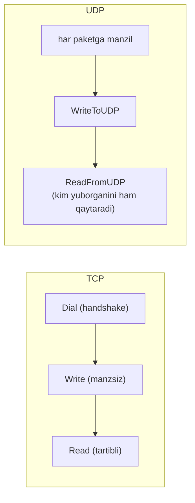
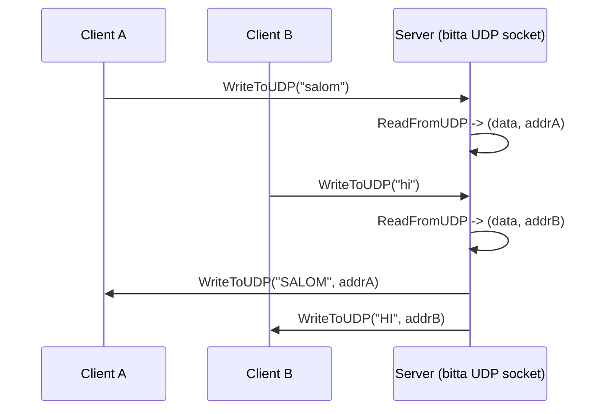
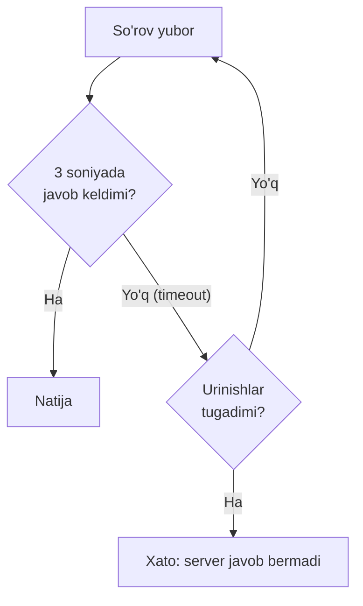

# 03. UDP client-server — tez, ammo kafolatsiz

## Muammo / Hook

Tasavvur qil: onlayn o'yin serverida o'yinchining pozitsiyasini har 20 millisekundda yuborasan. Agar bitta paket yo'qolsa — muammo yo'q, 20ms dan keyin yangi pozitsiya keladi. Endi TCP ishlatsang: yo'qolgan bitta eski pozitsiyani **qayta yuborishni kutib**, butun oqim to'xtab qoladi. O'yinchi "lag" ni sezadi.

Ba'zan **tezlik ishonchlilikdan muhimroq**. Video qo'ng'iroq, jonli translyatsiya, o'yin, DNS so'rovlari, metrika yuborish — bularning hammasi UDP'dan foydalanadi. Bu darsda TCP'ning "ishonchli, lekin sekin" dunyosidan **UDP'ning "tez, lekin kafolatsiz"** dunyosiga o'tamiz.

> TCP suhbat bo'lsa, UDP — pochta qutisiga xat tashlash: tashladingu ketding, yetgan-yetmaganini bilmaysan.

## Analogiya — xat tashlash (open kartochka)

UDP'ni **ochiq pochta kartochkasi tashlash** deb tasavvur qil:

- Har kartochkaga **manzilni yozasan** (har paketga qabul qiluvchi manzili biriktiriladi).
- Pochta qutisiga tashlaysan va **ketasan** — hech kim "yetdi" deb tasdiqlamaydi.
- Kartochka **yo'qolishi** mumkin, **kechikishi** yoki **tartibsiz** yetishi mumkin.
- Zato **tez** va **arzon** — qo'l berib ko'rishish (handshake) yo'q.

Analogiya chegarasi: pochtada kartochka odatda yetadi; UDP'da esa tarmoq band bo'lsa paket **jimgina tashlab yuboriladi** (dropped) — hech qanday xato ham bermaydi. Shuning uchun "yetdimi?" ni bilishing kerak bo'lsa, buni **o'zing** dasturda hal qilishing kerak.

## Sodda ta'rif

> **UDP (User Datagram Protocol)** — ulanish o'rnatmasdan, har bir paketni (**datagram**) mustaqil ravishda, manzili bilan birga yuboradigan, tezkor ammo yetkazishni **kafolatlamaydigan** transport protokoli.

Manba matndan asosiy g'oya: jo'natuvchi har paketga **manzil ma'lumotini biriktiradi** (qabul qiluvchining IP va porti), keyin paketni socketga tashlaydi. TCP'da esa bir marta ulanib, keyin manzsiz yozgan edik.

## Diagramma — TCP vs UDP oqimi



Farqni ko'rdingmi? UDP'da **handshake yo'q** va har yozishda **manzil** kerak. O'qishda esa `ReadFromUDP` sizga ma'lumotni **ham**, uni **kim yuborganini ham** qaytaradi — chunki bir socketga har xil manzillardan paket kelishi mumkin.

## Diagramma — bitta socket, ko'p client



Muhim: TCP'da har client uchun alohida connection socket bor edi. UDP'da esa **bitta socket** hamma bilan gaplashadi — javobni to'g'ri manzilga yuborish uchun `ReadFromUDP` qaytargan `addr`ni ishlatasan.

## Worked example 1 — UDP uppercase server va client

Manba matndagi klassik misolni Go idiomasi bilan yozamiz.

### Server

```go
package main

import (
	"log"
	"net"
	"strings"
)

func main() {
	// --- 1-qadam: server manzilini "hal qilamiz" (resolve) ---
	addr, err := net.ResolveUDPAddr("udp", ":12000")
	if err != nil {
		log.Fatalf("ResolveUDPAddr xatosi: %v", err)
	}

	// --- 2-qadam: 12000-portni band qilamiz (ListenUDP) ---
	conn, err := net.ListenUDP("udp", addr)
	if err != nil {
		log.Fatalf("ListenUDP xatosi: %v", err)
	}
	defer conn.Close()
	log.Println("UDP server 12000-portda tayyor")

	buf := make([]byte, 2048)
	for {
		// --- 3-qadam: paket va uni YUBORGAN manzilni o'qiymiz ---
		n, clientAddr, err := conn.ReadFromUDP(buf)
		if err != nil {
			log.Printf("ReadFromUDP xatosi: %v", err)
			continue
		}
		msg := strings.ToUpper(string(buf[:n]))

		// --- 4-qadam: javobni AYNAN o'sha manzilga qaytaramiz ---
		if _, err := conn.WriteToUDP([]byte(msg), clientAddr); err != nil {
			log.Printf("WriteToUDP xatosi: %v", err)
		}
	}
}
```

Bloklarni tushuntiramiz:

- **1-2-qadam** — `ResolveUDPAddr` matnli manzilni (`:12000`) `*net.UDPAddr` strukturaga aylantiradi, `ListenUDP` esa o'sha portni band qiladi. TCP'dagi `Accept` **yo'q** — chunki ulanish tushunchasi yo'q.
- **3-qadam** — `ReadFromUDP` **ikki** narsani qaytaradi: `n` bayt ma'lumot va `clientAddr` — kim yuborganligi. Bu manzil javob uchun hayotiy muhim.
- **4-qadam** — `WriteToUDP(data, clientAddr)` — javobga manzilni biriktirib yuboramiz. TCP'dagi manzsiz `Write`dan farqi shu.

**Notional machine:** UDP serverda **bitta** file descriptor bor va u OS ichidagi **navbat** (receive buffer) bilan bog'langan. Har xil client'lardan kelgan datagram'lar shu bitta navbatga tushadi. `ReadFromUDP` navbatdan bittasini oladi va uning "qaytish manzili"ni ham beradi. Agar navbat to'lib ketsa (server o'qishga ulgurmasa), yangi paketlar **jimgina tashlab yuboriladi** — bu UDP'dagi "packet loss"ning bir sababi.

### Client

```go
package main

import (
	"bufio"
	"fmt"
	"log"
	"net"
	"os"
	"time"
)

func main() {
	// --- 1-qadam: server manzilini resolve qilamiz ---
	serverAddr, err := net.ResolveUDPAddr("udp", "localhost:12000")
	if err != nil {
		log.Fatalf("ResolveUDPAddr xatosi: %v", err)
	}

	// --- 2-qadam: DialUDP "ulanadi" (aslida faqat manzilni eslab qoladi) ---
	conn, err := net.DialUDP("udp", nil, serverAddr)
	if err != nil {
		log.Fatalf("DialUDP xatosi: %v", err)
	}
	defer conn.Close()

	fmt.Print("Xabar kiriting: ")
	text, _ := bufio.NewReader(os.Stdin).ReadString('\n')

	// --- 3-qadam: yozamiz (DialUDP tufayli manzsiz Write ishlaydi) ---
	if _, err := conn.Write([]byte(text)); err != nil {
		log.Fatalf("Write xatosi: %v", err)
	}

	// --- 4-qadam: javobga read deadline qo'yamiz (UDP paket yo'qolishi mumkin!) ---
	conn.SetReadDeadline(time.Now().Add(3 * time.Second))
	buf := make([]byte, 2048)
	n, _, err := conn.ReadFromUDP(buf)
	if err != nil {
		log.Fatalf("Javob kelmadi (yo'qolgan bo'lishi mumkin): %v", err)
	}
	fmt.Printf("Serverdan: %s", buf[:n])
}
```

Muhim nuqta — **4-qadamdagi read deadline**. TCP'da bu ixtiyoriy edi; UDP'da **majburiy**, chunki paket yo'qolsa (`WriteToUDP` yoki serverning javobi), `ReadFromUDP` **abadiy** kutib qoladi. Deadline'siz UDP client — bu osilib qolgan dastur.

`DialUDP` haqida: bu aslida TCP'dagidek ulanish **o'rnatmaydi** (handshake yo'q). U shunchaki manzilni "eslab qoladi", shuning uchun keyin manzsiz `Write` ishlaydi va faqat o'sha manzildan kelgan paketlarni qabul qiladi.

**Output:**

```
# Server:
$ go run server.go
2026/07/10 12:00:01 UDP server 12000-portda tayyor

# Client:
$ go run client.go
Xabar kiriting: udp tez
Serverdan: UDP TEZ
```

## PRIMM — bashorat qil

> 🤔 **O'ylab ko'r:** Client kodidan `conn.SetReadDeadline(...)` qatorini olib tashladik, keyin server ishlamay turganda client'ni ishga tushirdik. Nima bo'ladi?

<details>
<summary>💡 Javobni ko'rish</summary>

Client `ReadFromUDP`da **abadiy muzlab qoladi**. Chunki:
1. `conn.Write` xato **bermaydi** — UDP'da yozish "muvaffaqiyatli" bo'ladi (paket shunchaki chiqib ketadi), server bor-yo'qligini bilmaydi.
2. Server javob bermaydi (u ishlamayapti), shuning uchun `ReadFromUDP`ga hech narsa kelmaydi.
3. Deadline yo'q -> abadiy kutish.

Bu TCP bilan asosiy farq: TCP'da server yo'q bo'lsa `Dial` **darhol** "connection refused" beradi. UDP'da esa "ulanish" tushunchasi yo'qligi uchun xato yo'q — o'zing timeout qo'yishing shart.
</details>

## Worked example 2 — packet loss bilan ishlash (retry)

UDP'ni "ishonchli" qilish uchun ba'zan sizga eng oddiy **so'rovni takrorlash** (retry) kerak bo'ladi: javob kelmasa, qayta yubor. Bu DNS client'lar aynan shunday qiladi.



```go
// sendWithRetry paket yo'qolsa, maxRetries martagacha qayta yuboradi.
func sendWithRetry(conn *net.UDPConn, msg []byte, maxRetries int) ([]byte, error) {
	buf := make([]byte, 2048)
	for attempt := 1; attempt <= maxRetries; attempt++ {
		// --- 1-qadam: so'rovni yuboramiz ---
		if _, err := conn.Write(msg); err != nil {
			return nil, fmt.Errorf("write: %w", err)
		}
		// --- 2-qadam: javobga qisqa deadline qo'yamiz ---
		conn.SetReadDeadline(time.Now().Add(2 * time.Second))
		n, _, err := conn.ReadFromUDP(buf)
		if err == nil {
			return buf[:n], nil // muvaffaqiyat
		}
		// --- 3-qadam: timeout bo'lsa qayta urinamiz ---
		if errors.Is(err, os.ErrDeadlineExceeded) {
			log.Printf("Urinish %d: javob kelmadi, qayta yuborilmoqda", attempt)
			continue
		}
		return nil, err // boshqa xato -> to'xta
	}
	return nil, fmt.Errorf("%d urinishdan keyin ham javob yo'q", maxRetries)
}
```

Bu funksiya UDP'ning "kafolatsiz" tabiatini **dastur darajasida** kompensatsiya qiladi:

- **1-qadam** — so'rovni yuboramiz.
- **2-qadam** — qisqa deadline (2s) qo'yib javobni kutamiz.
- **3-qadam** — deadline o'tsa (`os.ErrDeadlineExceeded`), paket yo'qolgan deb hisoblab **qayta yuboramiz**. Boshqa xato bo'lsa (masalan socket yopilgan), to'xtaymiz.

Bu — TCP ichida avtomatik bajariladigan narsaning **soddalashtirilgan qo'lda versiyasi**. Agar sizga tartib, oqim nazorati va yo'qotishni tiklash **hammasi** kerak bo'lsa — UDP ustiga bularni qo'lda qurishdan ko'ra TCP ishlatgan ma'qul. UDP faqat "tezlik muhim, ba'zi yo'qotish qabul qilinadi" holatlar uchun.

## TCP vs UDP — qachon qaysi biri

| Xususiyat | TCP | UDP |
| --- | --- | --- |
| Ulanish | Bor (handshake) | Yo'q |
| Yetkazish kafolati | Bor | Yo'q |
| Tartib kafolati | Bor | Yo'q |
| Tezlik | Sekinroq | Tez |
| Har paketga manzil | Yo'q (bir marta dial) | Har safar (`WriteToUDP`) |
| Go tipi | `net.Conn` | `*net.UDPConn` |
| Qachon | Fayl, chat, HTTP, DB | O'yin, video, DNS, metrika |

> Oltin qoida: **shubha bo'lsa — TCP**. UDP'ni faqat aniq sabab bilan (past kechikish, yo'qotishga chidamli ma'lumot) tanla.

## Ko'p uchraydigan xatolar

⚠️ **Xato 1 — UDP'da `Write` xato bermasa "yetdi" deb o'ylash.**
Noto'g'ri tasavvur: "`conn.Write` xato bermadi, demak server oldi." Nega noto'g'ri: UDP'da `Write` faqat paketni tarmoqqa chiqarganini bildiradi, yetganini emas. To'g'risi: yetganini bilish uchun serverdan **javob** (acknowledgment) kut.

⚠️ **Xato 2 — read deadline'siz UDP client.**
Server javob bermasa, `ReadFromUDP` abadiy bloklaydi. To'g'risi: har o'qishdan oldin `SetReadDeadline`.

⚠️ **Xato 3 — juda katta datagram yuborish.**
UDP paket bitta IP paketga sig'ishi kerak. ~1472 baytdan (Ethernet MTU) kattasi bo'laklarga bo'linadi (fragmentation) va bitta bo'lak yo'qolsa **butun** datagram yo'qoladi. To'g'risi: datagramni ~1400 bayt atrofida ushla.

⚠️ **Xato 4 — javobda `clientAddr`ni ishlatmaslik.**
Serverda `WriteToUDP` uchun `ReadFromUDP` qaytargan aniq `clientAddr` kerak. Uni saqlamasang, javobni qayerga yuborishni bilmaysan. To'g'risi: har o'qishda kelgan `addr`ni javob uchun ishlat.

## Xulosa

- UDP — ulanishsiz, tez, ammo yetkazish va tartibni **kafolatlamaydigan** protokol.
- Har `WriteToUDP`da qabul qiluvchi **manzili** kerak; `ReadFromUDP` ma'lumot **va** yuboruvchi manzilini qaytaradi.
- Serverda bitta socket hamma client bilan gaplashadi (TCP'dagi connection socket'lar yo'q).
- UDP client'da **read deadline majburiy** — aks holda yo'qolgan javob dasturni muzlatadi.
- Ishonchlilik kerak bo'lsa, uni **dastur darajasida** (retry, acknowledgment) o'zing qurasan.
- Shubha bo'lsa TCP tanla; UDP faqat past kechikish muhim va yo'qotishga chidamli holatlar uchun.

## 🧠 Eslab qol

- UDP = pochta kartochkasi: tashla-ket, tasdiq yo'q.
- Har paketga manzil, `ReadFromUDP` yuboruvchini ham beradi.
- UDP'da `Write` "yetdi" degani emas — javob kutmasang bilmaysan.
- Read deadline'siz UDP client = muzlab qolgan dastur.
- Ishonchlilik kerak bo'lsa qo'lda retry qur yoki TCP'ga o't.

## ✅ O'z-o'zini tekshir (retrieval practice)

**1.** UDP serverda nega TCP'dagi `Accept` yo'q? Bitta socket ko'p client bilan qanday gaplashadi?

<details>
<summary>Javob</summary>

UDP'da "ulanish" tushunchasi yo'q, shuning uchun qabul qilinadigan ulanish (`Accept`) ham yo'q. Bitta socketning OS ichidagi navbatiga barcha client'lardan datagram'lar tushadi. `ReadFromUDP` har paketni **uni yuborgan manzil** bilan birga qaytaradi, shuning uchun server javobni `WriteToUDP(data, addr)` bilan to'g'ri client'ga yuboradi.
</details>

**2.** Client `conn.Write` qildi, xato qaytmadi. Server paketni oldi deb ishonch hosil qilsak bo'ladimi?

<details>
<summary>Javob</summary>

Yo'q. UDP'da `Write` faqat paket **lokal tarmoqqa chiqdi** degani, yetgani emas. Paket yo'lda yo'qolishi mumkin va sen buni bilmaysan. Yetganini bilishning yagona yo'li — serverdan **javob** (acknowledgment) olish.
</details>

**3.** Nega UDP client'da read deadline TCP'dagidan ko'ra muhimroq?

<details>
<summary>Javob</summary>

TCP'da server o'lsa yoki ulanish uzilsa, `Read` xato beradi (`io.EOF` yoki connection reset). UDP'da esa "ulanish" yo'q — server javob bermasa `ReadFromUDP` **hech qanday xato bermasdan abadiy kutadi**. Faqat deadline uni to'xtata oladi, shuning uchun u majburiy.
</details>

**4.** O'yin serverida o'yinchi pozitsiyasi uchun UDP tanladik. Nega bu holatda paket yo'qolishi katta muammo emas?

<details>
<summary>Javob</summary>

Pozitsiya juda tez-tez (masalan har 20ms) yangilanadi. Bitta yo'qolgan eski pozitsiyani qayta yuborishning ma'nosi yo'q — 20ms dan keyin **yangi, aniqroq** pozitsiya keladi. TCP ishlatilsa, eski paketni qayta yuborishni kutib butun oqim to'xtar, bu esa "lag" hosil qilardi. UDP'da yangi ma'lumot eskisini almashtiradi.
</details>

## 🛠 Amaliyot

**1. Oson (Modify).** UDP server'ni shunday o'zgartir: kelgan qatordagi harflar sonini sanab, javobda "Sizning xabaringiz N ta belgidan iborat" deb qaytarsin.

<details>
<summary>Hint</summary>

`strings.ToUpper` o'rniga: `reply := fmt.Sprintf("Sizning xabaringiz %d ta belgidan iborat\n", n)`. `n` allaqachon `ReadFromUDP`dan kelgan bayt soni.
</details>

**2. O'rta (faded example — TODO to'ldirish).** Quyidagi UDP "ping" client skeletini to'ldir: server jonli bo'lsa "PONG" qaytaradi, retry bilan.

```go
func ping(conn *net.UDPConn) bool {
	for attempt := 1; attempt <= 3; attempt++ {
		// TODO: "PING" yubor
		// TODO: 1 soniyalik read deadline qo'y
		buf := make([]byte, 64)
		n, _, err := conn.ReadFromUDP(buf)
		// TODO: xato yo'q va javob "PONG" bo'lsa -> true qaytar
		// TODO: deadline xatosi bo'lsa -> keyingi urinishga o't
	}
	return false
}
```

<details>
<summary>Hint</summary>

`conn.Write([]byte("PING"))`, `conn.SetReadDeadline(time.Now().Add(time.Second))`. Tekshirish: `if err == nil && string(buf[:n]) == "PONG" { return true }`. Deadline: `if errors.Is(err, os.ErrDeadlineExceeded) { continue }`.
</details>

**3. Qiyin (Make — noldan).** Oddiy "reliable UDP" qatlam yoz: har yuborilgan xabarga ketma-ket raqam (sequence number) qo'sh. Server har xabarni olgach, o'sha raqamni "ACK" sifatida qaytarsin. Client ACK kelmasa xabarni qayta yuborsin. Shunday qilib UDP ustida oddiy ishonchli yetkazishni qur.

<details>
<summary>Hint</summary>

Xabar formati: `fmt.Sprintf("%d|%s", seq, payload)`. Server javobi: `fmt.Sprintf("ACK|%d", seq)`. Client: xabar yubor, ACK'da seq mos kelsa keyingisiga o't, timeout bo'lsa **o'sha** seq bilan qayta yubor. `strings.SplitN(msg, "|", 2)` bilan ajrat.
</details>

## 🔁 Takrorlash

- **Bog'liq darslar:** [02-tcp-client-server.md](02-tcp-client-server.md) (TCP bilan yonma-yon taqqoslash uchun), [01-net-package-asoslari.md](01-net-package-asoslari.md) (deadline tushunchasi shu yerdan).
- **Takrorlash jadvali:** "UDP'da Write yetganni bildirmaydi" va "read deadline majburiy" nuqtalariga **ertaga**, **3 kundan so'ng**, **1 haftadan so'ng** qaytib javob ber.
- **Feynman testi:** "Onlayn o'yinlar nega TCP emas, UDP ishlatadi?" degan savolga do'stingga 3 jumlada javob ber. (Kalit: eski ma'lumotni qayta yuborishdan ko'ra yangisini kutish yaxshiroq.)

## 📚 Manbalar

- [net package — Go Packages (pkg.go.dev)](https://pkg.go.dev/net)
- [Efficient Use of net/http, net.Conn, and UDP — Go Optimization Guide](https://goperf.dev/02-networking/efficient-net-use/)
- [Timeouts in Go: A Comprehensive Guide — Better Stack](https://betterstack.com/community/guides/scaling-go/golang-timeouts/)
