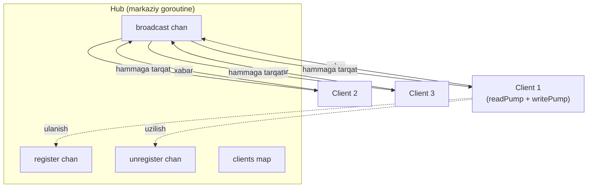
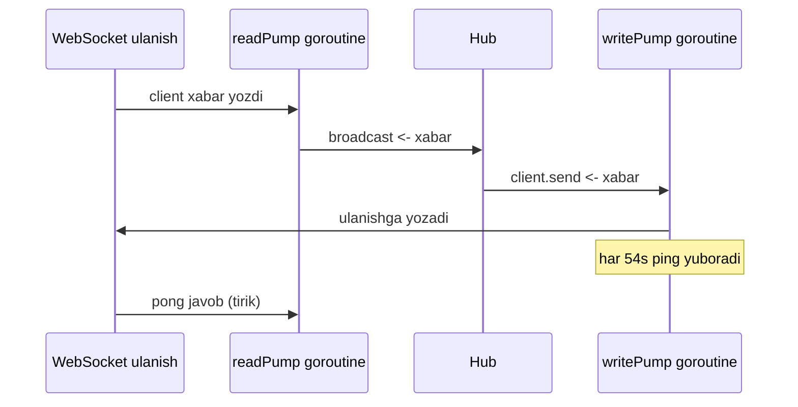

# 05. WebSocket chat — real vaqtli aloqa va hub pattern

## Muammo / Hook

4-darsda HTTP server yozdik. Lekin HTTP'da bitta muammo bor: **client so'raydi, server javob beradi** — server o'zi tashabbus bilan client'ga xabar **yubora olmaydi**. Chat qurmoqchisan: Ali xabar yozdi, uni Vali darhol ko'rishi kerak. HTTP'da Vali'ning brauzeri har soniyada "yangi xabar bormi?" deb so'rab turishi kerak (polling) — bu isrofgarchilik va sekin.

Kerak bo'lgan narsa — **ikki tomonlama, doim ochiq** kanal. Ali yozgan zahoti server uni Vali'ga **itaradi** (push). Bu — **WebSocket**. Bu darsda gorilla/websocket bilan real ishlaydigan chat quramiz va Go concurrency'ning eng chiroyli patternlaridan biri — **hub pattern**ni o'rganamiz.

> HTTP = xat yozishmasi (so'ra-javob ol). WebSocket = telefon liniyasi doim ochiq (ikkalasi istagan payt gapiradi).

## Analogiya — konferens-qo'ng'iroq

WebSocket chatni **konferens-qo'ng'iroq** deb tasavvur qil:

- Har ishtirokchi **doimiy ochiq liniya** bilan ulanadi (WebSocket connection).
- **Operator (hub)** markazda turadi: kim gapirsa, operator uni **hammaga** eshittiradi (broadcast).
- Yangi odam qo'shilsa — operatorga "ro'yxatga ol" (register), ketsa — "chiqar" (unregister).
- Hech kim boshqasiga to'g'ridan-to'g'ri ulanmaydi — hammasi operator orqali.

Analogiya chegarasi: konferensda hamma bir vaqtda gapirsa aralashib ketadi; hub'da har xabar **navbat bilan** (channel orqali) qayta ishlanadi, shuning uchun tartib buzilmaydi.

## Sodda ta'rif

> **WebSocket** — bitta HTTP so'rov bilan boshlanib (handshake), keyin **ikki tomonlama, doim ochiq** aloqa kanaliga aylanadigan protokol; **hub pattern** esa markaziy goroutine orqali barcha ulanishlarni boshqarish va xabarlarni tarqatish usuli.

WebSocket HTTP ustida boshlanadi: client `Upgrade: websocket` header bilan so'rov yuboradi, server "ha, o'tamiz" deb javob beradi — shundan keyin bu TCP ulanish oddiy HTTP emas, WebSocket'ga aylanadi.

## Diagramma — hub arxitekturasi



Butun sxema uchta channel ustiga qurilgan: `register` (yangi client), `unregister` (ketgan client), `broadcast` (tarqatiladigan xabar). Hub bitta goroutine'da `select` bilan shu uchtasini tinglaydi — shuning uchun `clients` map'ga **mutex kerak emas** (faqat bitta goroutine unga tegadi).

## Diagramma — har client'da ikkita pump



**Nega har client uchun ikkita goroutine?** gorilla/websocket'da bitta ulanishga **bir vaqtda faqat bitta goroutine yozishi** mumkin (aks holda frame'lar buziladi va panic bo'ladi). Shuning uchun:
- **readPump** — faqat **o'qiydi** (client -> server).
- **writePump** — faqat **yozadi** (server -> client) va ping yuboradi.

Ular bir-biriga **channel** orqali gaplashadi.

## Worked example — to'liq chat (4 qism)

### 1-qism: Client va Hub strukturasi

```go
package main

import (
	"log"
	"net/http"
	"time"

	"github.com/gorilla/websocket"
)

// --- Client — bitta WebSocket ulanishini ifodalaydi ---
type Client struct {
	hub  *Hub
	conn *websocket.Conn
	send chan []byte // shu client'ga yuboriladigan xabarlar navbati
}

// --- Hub — barcha client'larni boshqaradigan markaz ---
type Hub struct {
	clients    map[*Client]bool // ulangan client'lar
	broadcast  chan []byte      // hammaga tarqatiladigan xabar
	register   chan *Client     // yangi ulanish
	unregister chan *Client     // uzilgan ulanish
}

func newHub() *Hub {
	return &Hub{
		clients:    make(map[*Client]bool),
		broadcast:  make(chan []byte),
		register:   make(chan *Client),
		unregister: make(chan *Client),
	}
}
```

Har `Client`da o'zining `send` channel'i bor — bu uning shaxsiy "yozish navbati". Hub xabarni to'g'ridan-to'g'ri ulanishga yozmaydi, balki har client'ning `send` channel'iga qo'yadi, keyin o'sha client'ning writePump'i uni ulanishga yozadi.

### 2-qism: Hub'ning yuragi — run siklidagi select

```go
func (h *Hub) run() {
	for {
		select {
		// --- yangi client ro'yxatga olinadi ---
		case client := <-h.register:
			h.clients[client] = true
			log.Printf("Client ulandi, jami: %d", len(h.clients))

		// --- client uzildi: map'dan o'chiramiz va send'ni yopamiz ---
		case client := <-h.unregister:
			if _, ok := h.clients[client]; ok {
				delete(h.clients, client)
				close(client.send)
			}

		// --- broadcast: xabarni HAMMA client'ga tarqatamiz ---
		case message := <-h.broadcast:
			for client := range h.clients {
				select {
				case client.send <- message:
					// muvaffaqiyatli navbatga qo'yildi
				default:
					// client sekin (navbati to'la) -> uni uzamiz
					close(client.send)
					delete(h.clients, client)
				}
			}
		}
	}
}
```

Bu — butun chatning yuragi. Bitta goroutine, uchta channel:

- **`register`** — yangi client `clients` map'ga qo'shiladi.
- **`unregister`** — client o'chiriladi va uning `send` channel'i yopiladi (bu writePump'ga "to'xta" signali).
- **`broadcast`** — xabar har client'ning `send`iga qo'yiladi. Ichki `select`ning `default` shoxi muhim: agar client **sekin** bo'lsa (navbati to'lgan), uni kutib qolmasdan **uzamiz**. Aks holda bitta sekin client butun chatni bloklardi.

**Notional machine:** `clients` map'ga faqat `run` goroutine'i tegadi — register, unregister, broadcast hammasi shu bir goroutine ichida. Shuning uchun map'ga concurrent yozish (Go'da bu panic) hech qachon bo'lmaydi. Bu — mutex o'rniga **"bir egasi bo'lgan ma'lumot"** (share by communicating) idiomasi.

### 3-qism: readPump — client'dan o'qish

```go
const (
	pongWait   = 60 * time.Second    // pong shu vaqtda kelmasa uzamiz
	pingPeriod = 54 * time.Second    // har shu vaqtda ping yuboramiz
	maxMsgSize = 512
)

func (c *Client) readPump() {
	// --- 1-qadam: tozalash — pump tugasa hub'dan chiqamiz va ulanishni yopamiz ---
	defer func() {
		c.hub.unregister <- c
		c.conn.Close()
	}()

	// --- 2-qadam: xabar hajmi va pong deadline'ini sozlaymiz ---
	c.conn.SetReadLimit(maxMsgSize)
	c.conn.SetReadDeadline(time.Now().Add(pongWait))
	c.conn.SetPongHandler(func(string) error {
		// pong kelganda deadline'ni uzaytiramiz -> "client tirik"
		c.conn.SetReadDeadline(time.Now().Add(pongWait))
		return nil
	})

	// --- 3-qadam: cheksiz o'qish sikli ---
	for {
		_, message, err := c.conn.ReadMessage()
		if err != nil {
			if websocket.IsUnexpectedCloseError(err, websocket.CloseGoingAway) {
				log.Printf("o'qish xatosi: %v", err)
			}
			break // xato -> defer ishga tushadi (unregister)
		}
		// o'qilgan xabarni hub'ga -> hub hammaga tarqatadi
		c.hub.broadcast <- message
	}
}
```

Bloklar:
- **1-qadam** — `defer`: readPump qanday tugasa ham (xato, uzilish), client hub'dan chiqariladi va ulanish yopiladi.
- **2-qadam** — **ping/pong health check**ning o'qish tomoni. `pongWait` (60s) ichida pong kelmasa, `ReadMessage` deadline xatosi bilan qaytadi va biz ulanishni uzamiz. `SetPongHandler` esa har pong kelganda deadline'ni yangilaydi.
- **3-qadam** — o'qilgan har xabar `broadcast`ka boradi.

### 4-qism: writePump — client'ga yozish va ping

```go
func (c *Client) writePump() {
	ticker := time.NewTicker(pingPeriod)
	defer func() {
		ticker.Stop()
		c.conn.Close()
	}()

	for {
		select {
		// --- hub bu client uchun xabar yubordi ---
		case message, ok := <-c.send:
			c.conn.SetWriteDeadline(time.Now().Add(10 * time.Second))
			if !ok {
				// hub send'ni yopgan (unregister) -> close frame yuboramiz
				c.conn.WriteMessage(websocket.CloseMessage, []byte{})
				return
			}
			if err := c.conn.WriteMessage(websocket.TextMessage, message); err != nil {
				return
			}

		// --- har pingPeriod'da ping yuboramiz (client tirikligini tekshirish) ---
		case <-ticker.C:
			c.conn.SetWriteDeadline(time.Now().Add(10 * time.Second))
			if err := c.conn.WriteMessage(websocket.PingMessage, nil); err != nil {
				return // ping yuborilmadi -> client o'lgan
			}
		}
	}
}
```

writePump — **yagona** goroutine bu ulanishga yozadi (gorilla qoidasi). U ikki narsani qiladi:
- `c.send`dan kelgan xabarni ulanishga yozadi.
- Har 54 soniyada (`pingPeriod`) **ping** yuboradi. Client pong bilan javob berishi kerak (buni readPump `pongWait` bilan kutadi). Agar client "muzlab qolgan" bo'lsa (masalan noutbukni yopgan), ping yuborilmaydi yoki pong kelmaydi -> ikki tomon ham ulanishni uzadi. Bu — **o'lik ulanishlarni tozalash** mexanizmi.

### Handshake handler va main

```go
var upgrader = websocket.Upgrader{
	ReadBufferSize:  1024,
	WriteBufferSize: 1024,
	// Production'da Origin'ni TEKSHIR (bu yerda demo uchun ochiq)
	CheckOrigin: func(r *http.Request) bool { return true },
}

func serveWs(hub *Hub, w http.ResponseWriter, r *http.Request) {
	// --- 1-qadam: HTTP ulanishni WebSocket'ga "upgrade" qilamiz ---
	conn, err := upgrader.Upgrade(w, r, nil)
	if err != nil {
		log.Printf("upgrade xatosi: %v", err)
		return
	}
	// --- 2-qadam: client yaratamiz va hub'ga ro'yxatga olamiz ---
	client := &Client{hub: hub, conn: conn, send: make(chan []byte, 256)}
	hub.register <- client

	// --- 3-qadam: ikkita pump'ni alohida goroutine'da ishga tushiramiz ---
	go client.writePump()
	go client.readPump()
}

func main() {
	hub := newHub()
	go hub.run() // hub markaziy goroutine

	http.HandleFunc("/ws", func(w http.ResponseWriter, r *http.Request) {
		serveWs(hub, w, r)
	})
	log.Println("Chat server 8080-portda (ws://localhost:8080/ws)")
	if err := http.ListenAndServe(":8080", nil); err != nil {
		log.Fatal(err)
	}
}
```

`upgrader.Upgrade` — HTTP so'rovni WebSocket ulanishiga aylantiradi. Har yangi ulanishga **client + ikkita goroutine** (read/write pump) yaratiladi. `send` channel'i **256 bufer**li — bu client biroz sekin bo'lsa ham xabarlar navbatda kutadi, faqat 256 dan oshsa uziladi.

**Output (ikkita client ulanganda):**

```
$ go run .
2026/07/10 12:00:01 Chat server 8080-portda (ws://localhost:8080/ws)
2026/07/10 12:00:05 Client ulandi, jami: 1
2026/07/10 12:00:09 Client ulandi, jami: 2
# Ali "salom" yozadi -> ikkala client ham "salom" oladi
```

Sinash uchun brauzer console'da: `let ws = new WebSocket("ws://localhost:8080/ws"); ws.onmessage = e => console.log(e.data); ws.send("salom")`.

## PRIMM — bashorat qil

> 🤔 **O'ylab ko'r:** `broadcast` shoxidagi ichki `select`ning `default` bo'lagini olib tashlab, oddiy `client.send <- message` qilsak — bitta client noutbukini yopib, xabarlarni o'qimay qo'ysa nima bo'ladi?

<details>
<summary>💡 Javobni ko'rish</summary>

O'sha client'ning `send` channel'i (256 bufer) to'lib ketadi. Keyin `client.send <- message` **bloklanadi** — hub'ning `run` goroutine'i shu yerda muzlab qoladi. Natijada hub **hech kimga** xabar tarqata olmaydi: butun chat to'xtaydi, chunki bitta sekin client hammani bloklaydi.

`default` shoxi buni hal qiladi: navbat to'la bo'lsa, kutmasdan o'sha client'ni **uzadi** (`close(client.send); delete(...)`). Bu — "slow consumer" muammosining klassik yechimi. Real vaqtli tizimlarda **bitta sekin a'zo butun tizimni sekinlashtira olmaydi** degan qoida shu.
</details>

## gorilla/websocket vs coder/websocket — 2026 holati

WebSearch natijasiga ko'ra kutubxona tanlashda muhim yangilik bor:

| Xususiyat | gorilla/websocket | coder/websocket (avvalgi nhooyr) |
| --- | --- | --- |
| Maintain holati | Yaqqol tiklandi (Gorilla jamoasi qaytdi) | Faol maintain qilinadi |
| Concurrent yozish | **Xavfli** — sync kerak (writePump majburiy) | Xavfsiz |
| context.Context | Cheklangan | To'liq (cancel/timeout tabiiy) |
| Ping/pong | Qo'lda (handler'lar) | Avtomatikroq |
| API uslubi | Klassik, ko'p misol bor | Idiomatik, soddaroq |

**Xulosa:** yangi loyihada `coder/websocket` ko'rib chiqishga arziydi (context bilan ishlaydi, concurrent yozish xavfsiz, goroutine leak kamroq). Ammo hub pattern, read/write pump, ping/pong g'oyalari **ikkalasida ham bir xil** — bu darsda o'rgangan arxitektura universal. Gorilla hali ham keng qo'llaniladi va u bir vaqtlar arxivlangan bo'lsa-da, hozir yana faol.

## Ko'p uchraydigan xatolar

⚠️ **Xato 1 — bitta ulanishga bir necha goroutine'dan yozish.**
Noto'g'ri tasavvur: "readPump ham javob yoza qolsin." gorilla'da bu **frame'larni buzadi va panic** qiladi. To'g'risi: **faqat writePump** yozadi, boshqalar unga `send` channel orqali xabar beradi.

⚠️ **Xato 2 — ping/pong'siz chat.**
NAT/proxy o'rtadagi jim ulanishlarni uzib tashlaydi va sen "o'lik" client'larni ushlab yotasan (goroutine leak). To'g'risi: writePump'da davriy ping + readPump'da pong deadline.

⚠️ **Xato 3 — `CheckOrigin: true`ni production'da qoldirish.**
Bu har domendan WebSocket ulanishga ruxsat beradi (CSWSH hujumi). To'g'risi: production'da `CheckOrigin`da `r.Header.Get("Origin")`ni oq ro'yxat bilan tekshir.

⚠️ **Xato 4 — bufersiz `send` channel.**
`make(chan []byte)` bufersiz bo'lsa, hub har xabarda writePump'ni kutadi — bu hub'ni sekinlashtiradi. To'g'risi: `make(chan []byte, 256)` — biroz bufer client tebranishini yutadi.

## Xulosa

- WebSocket = bitta HTTP handshake'dan keyin **ikki tomonlama, doim ochiq** kanal; server client'ga **push** qila oladi.
- **Hub pattern** = markaziy goroutine `register`/`unregister`/`broadcast` channel'lari orqali barcha client'larni boshqaradi; `clients` map'ga faqat u tegadi, mutex kerak emas.
- Har client uchun **ikkita goroutine**: readPump (o'qish) va writePump (yozish + ping) — chunki gorilla'da bitta ulanishga faqat bitta goroutine yozishi mumkin.
- **Ping/pong** o'lik ulanishlarni aniqlaydi va tozalaydi (goroutine leak'dan saqlaydi).
- **Slow consumer** muammosi: `broadcast`da `default` shox bilan sekin client'ni uzib, butun chatni bloklashdan saqlaymiz.
- 2026'da yangi loyiha uchun `coder/websocket` ham kuchli variant, ammo arxitektura g'oyalari ikkalasida bir xil.

## 🧠 Eslab qol

- WebSocket = doim ochiq ikki tomonlama liniya; HTTP handshake bilan boshlanadi.
- Hub = bitta goroutine, uchta channel; map'ga faqat u tegadi.
- Bitta ulanish = readPump + writePump (faqat writePump yozadi).
- Ping/pong = o'lik ulanishni topib tozalash.
- Sekin client'ni uz, butun chatni bloklama (`default` shox).

## ✅ O'z-o'zini tekshir (retrieval practice)

**1.** Nega har WebSocket ulanish uchun **ikkita** goroutine ishlatamiz? Bittasi bilan bo'lmaydimi?

<details>
<summary>Javob</summary>

gorilla/websocket'da bitta ulanishga **bir vaqtda faqat bitta goroutine yozishi** mumkin — aks holda frame'lar aralashib buziladi va panic bo'ladi. readPump o'qiydi (client -> server), writePump esa yagona yozuvchi (server -> client) + ping yuboradi. Ular `send` channel orqali gaplashadi. Bittasi bilan o'qish va yozishni bir vaqtda ishonchli qilib bo'lmaydi.
</details>

**2.** Hub'ning `clients` map'iga nega mutex kerak emas, holbuki ko'p client parallel ulanadi?

<details>
<summary>Javob</summary>

`clients` map'ga **faqat bitta goroutine** — hub'ning `run` siklidagi goroutine — tegadi. Register, unregister va broadcast hammasi shu bir `select` ichida bajariladi. Boshqa goroutine'lar (pump'lar) map'ga to'g'ridan-to'g'ri tegmaydi, ular **channel** orqali hub'ga xabar beradi. "Ma'lumotni bitta egaga ber, boshqalar u bilan channel orqali gaplashsin" — Go idiomasi. Shuning uchun concurrent map yozish (panic sababi) hech qachon bo'lmaydi.
</details>

**3.** Ping/pong mexanizmi aynan qanday muammoni hal qiladi? Bo'lmasa nima bo'ladi?

<details>
<summary>Javob</summary>

U **o'lik ulanishlarni** aniqlaydi. Client noutbukini yopsa yoki tarmog'i uzilsa, TCP darhol bilmaydi — server "tirik" ulanishni ushlab, goroutine va xotira sarflaydi (leak). writePump har 54s ping yuboradi; client 60s ichida pong bermasa, readPump deadline xatosi oladi va ulanishni uzadi. Bu — jim, o'lik ulanishlarni tozalash yo'li.
</details>

**4.** Bitta client noutbukini yopib xabar o'qishni to'xtatdi. `broadcast`dagi `default` shox bo'lmasa, butun chatga nima bo'ladi?

<details>
<summary>Javob</summary>

O'sha client'ning `send` channel'i (256 bufer) to'ladi, keyin `client.send <- message` bloklanadi. Hub'ning `run` goroutine'i shu yerda muzlaydi va **hech kimga** xabar tarqata olmaydi — butun chat to'xtaydi. `default` shox sekin client'ni kutmasdan uzadi (`close(client.send)`), shunda bitta a'zo hammani bloklamaydi.
</details>

## 🛠 Amaliyot

**1. Oson (Modify).** Har xabar oldiga ulangan client sonini qo'sh: broadcast qilishdan oldin xabarni `fmt.Sprintf("[%d online] %s", len(hub.clients), msg)` ko'rinishida bezab yubor. (Bu hub'ning `run` ichida bo'lishi kerak — nega?)

<details>
<summary>Hint</summary>

`broadcast` shoxida `message`ni tarqatishdan oldin qayta yasay olmaysan, chunki u `[]byte`. Buni hub ichida qil: `decorated := []byte(fmt.Sprintf("[%d online] %s", len(h.clients), message))`, keyin `decorated`ni tarqat. `len(h.clients)`ga faqat hub goroutine'i xavfsiz tegadi.
</details>

**2. O'rta (faded example — TODO to'ldirish).** Chatga "xona" (room) qo'sh: har client bitta xona nomiga tegishli bo'lsin, xabar faqat o'sha xonadagilarga borsin.

```go
type Client struct {
	hub  *Hub
	conn *websocket.Conn
	send chan []byte
	room string // TODO: ulanishda query param'dan olib to'ldir
}

// broadcast shoxida:
case bm := <-h.broadcast: // bm.room va bm.data bor
	for client := range h.clients {
		// TODO: faqat client.room == bm.room bo'lganlarga yubor
	}
```

<details>
<summary>Hint</summary>

`broadcast` channel tipini `chan broadcastMsg` qil, `type broadcastMsg struct { room string; data []byte }`. `serveWs`da `room := r.URL.Query().Get("room")`. Broadcast siklida `if client.room == bm.room { ... }`.
</details>

**3. Qiyin (Make — noldan).** JSON xabar formatli chat yoz: har xabar `{"user": "Ali", "text": "salom", "time": "..."}`. Server kelgan JSON'ni parse qilib, `time`ni server tomonda qo'yib, hammaga qaytarsin. `encoding/json` ishlat. Bonus: `coder/websocket` bilan qayta yozib, farqni his qil.

<details>
<summary>Hint</summary>

`type Msg struct { User, Text, Time string }`. readPump'da `json.Unmarshal(message, &m)`, `m.Time = time.Now().Format("15:04:05")`, keyin `data, _ := json.Marshal(m); c.hub.broadcast <- data`.
</details>

## 🔁 Takrorlash

- **Bog'liq darslar:** [04-http-server-va-client.md](04-http-server-va-client.md) (WebSocket HTTP handshake ustiga quriladi), [01-net-package-asoslari.md](01-net-package-asoslari.md) va [02-tcp-client-server.md](02-tcp-client-server.md) (deadline, channel, "bir ulanish = goroutine" g'oyalari).
- **Takrorlash jadvali:** "nega ikkita pump", "hub'da mutex yo'q", "slow consumer" nuqtalariga **ertaga**, **3 kundan so'ng**, **1 haftadan so'ng** qaytib javob ber.
- **Feynman testi:** "WebSocket HTTP'dan nimasi bilan farq qiladi va hub pattern nima uchun kerak?" degan savolga do'stingga 3 jumlada javob ber. (Kalit: doim ochiq ikki tomonlama kanal + markaziy tarqatuvchi.)

## 📚 Manbalar

- [Go WebSocket Server Guide: coder/websocket vs Gorilla — WebSocket.org](https://websocket.org/guides/languages/go/)
- [Which Golang WebSocket Library Should You Use in 2025? — amf-co.com](https://amf-co.com/which-golang-websocket-library-should-you-use-in-2025/)
- [coder/websocket — GitHub](https://github.com/coder/websocket)
- [websocket package — gorilla/websocket (pkg.go.dev)](https://pkg.go.dev/github.com/gorilla/websocket)
- [How to Build WebSocket Servers with Gorilla WebSocket — OneUptime](https://oneuptime.com/blog/post/2026-02-01-go-websocket-gorilla/view)
