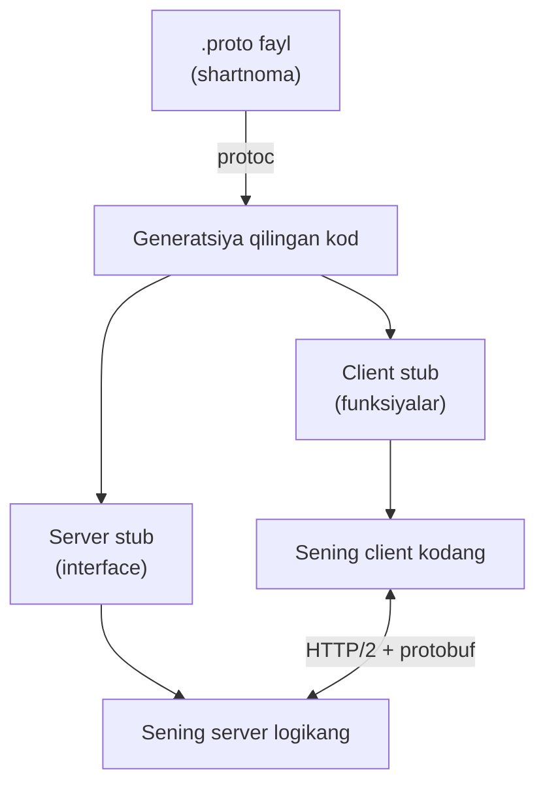
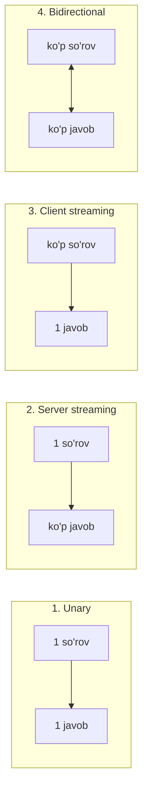
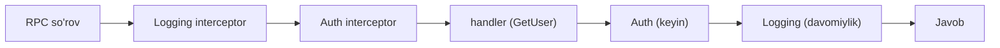
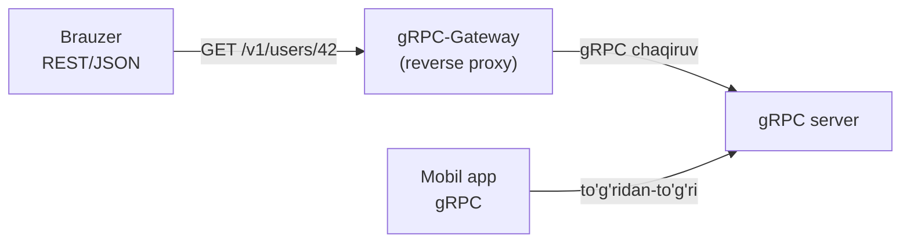

# 06. gRPC Go'da — protobuf, streaming, interceptor, gateway

## Muammo / Hook

Ikkita mikroservis bir-biri bilan gaplashishi kerak. REST/JSON bilan qilsang: har so'rovda JSON matn yasaysan, parse qilasan (sekin), API "shartnomasi" hech qayerda qat'iy yozilmagan (kimdir `user_id`ni `userId`ga o'zgartirsa — ish buziladi va sen buni faqat runtime'da bilasan). Bir necha tilda client yozsang, har biriga qo'lda model yozasan.

**gRPC** bularning hammasini hal qiladi: bitta `.proto` faylda **qat'iy shartnoma** yozasan, undan **avtomatik kod** generatsiya qilinadi (server va client uchun, istalgan tilda), ma'lumot ixcham **binary** formatda uzatiladi (JSON'dan tez), va u **streaming**ni tabiiy qo'llaydi. Bu darsda gRPC serverni noldan quramiz: protobuf, 4 xil chaqiruv turi, interceptor, gateway va TLS.

> REST = qo'lda yozilgan xat. gRPC = imzolangan shartnoma + avtomatik tarjimon.

## Analogiya — rasmiy shartnoma va tarjimon

gRPC'ni **ikki kompaniya orasidagi rasmiy shartnoma** deb tasavvur qil:

- **`.proto` fayl** — shartnoma matni: qaysi xizmatlar bor, har biri qanday kirish qabul qilib, qanday chiqish beradi. Ikkala tomon ham shu bitta hujjatga rozi.
- **`protoc` (kod generatori)** — notarius + tarjimon: shartnomadan har til uchun aniq kod chiqaradi. Qo'lda yozish yo'q — xato ham yo'q.
- **protobuf (binary format)** — ixcham til: matn (JSON) o'rniga siqilgan baytlar. Tez o'qiladi, kam joy oladi.
- **HTTP/2** — transport: bitta ulanishda ko'p so'rovni parallel, streaming bilan.

Analogiya chegarasi: shartnomani odam o'qiydi; `.proto`ni **mashina** o'qib kod chiqaradi. Bir marta yozasan — barcha tildagi client va serverlar avtomatik "bir tilda gaplashadi".

## Sodda ta'rif

> **gRPC** — Google'ning yuqori tezlikdagi RPC (Remote Procedure Call — masofaviy funksiya chaqiruvi) framework'i: `.proto` faylda xizmatni ta'riflaysan, `protoc` undan kod generatsiya qiladi, ma'lumot HTTP/2 ustida binary protobuf sifatida uzatiladi.

**RPC** g'oyasi: masofadagi serverda funksiyani xuddi lokal funksiyadek chaqirasan — `client.GetUser(ctx, req)`. Tarmoq detallari yashiriladi.

## Diagramma — gRPC ish oqimi



## Diagramma — 4 xil chaqiruv turi



## Worked example — qadam-baqadam gRPC servis

### 1-qadam: `.proto` shartnoma

`user.proto` faylini yaratamiz:

```protobuf
syntax = "proto3";

package user;
option go_package = "example.com/userpb";

// Xizmat: 4 xil chaqiruv turini ko'rsatamiz
service UserService {
  rpc GetUser(GetUserRequest) returns (User);                    // unary
  rpc ListUsers(ListRequest) returns (stream User);              // server streaming
  rpc CreateUsers(stream User) returns (CreateSummary);          // client streaming
  rpc Chat(stream ChatMessage) returns (stream ChatMessage);     // bidirectional
}

message GetUserRequest { string id = 1; }
message User { string id = 1; string name = 2; int32 age = 3; }
message ListRequest { int32 limit = 1; }
message CreateSummary { int32 created = 1; }
message ChatMessage { string user = 1; string text = 2; }
```

Har maydondagi raqam (`= 1`, `= 2`) — bu **field tag**, binary formatda maydonni belgilaydi. Nom o'zgarishi mumkin, lekin tag **hech qachon** o'zgarmasligi kerak — bu orqaga moslik (backward compatibility)ni ta'minlaydi.

### 2-qadam: kod generatsiya

```bash
# protoc va Go plaginlari o'rnatilgan bo'lishi kerak:
# protoc-gen-go, protoc-gen-go-grpc
protoc --go_out=. --go_opt=paths=source_relative \
       --go-grpc_out=. --go-grpc_opt=paths=source_relative \
       user.proto
```

Bu `user.pb.go` (message'lar) va `user_grpc.pb.go` (server/client stub) fayllarini yaratadi. Sen bu fayllarni **qo'lda tahrirlamaysan** — ular shartnomadan avtomatik chiqadi.

### 3-qadam: unary metodni amalga oshirish

```go
package main

import (
	"context"
	"fmt"

	"example.com/userpb"
)

// server — generatsiya qilingan UnimplementedUserServiceServer'ni "embed" qiladi
type server struct {
	userpb.UnimplementedUserServiceServer
}

// --- Unary: bitta so'rov -> bitta javob ---
func (s *server) GetUser(ctx context.Context, req *userpb.GetUserRequest) (*userpb.User, error) {
	if req.Id == "" {
		return nil, fmt.Errorf("id bo'sh bo'lishi mumkin emas")
	}
	// Real hayotda bu yerda DB'dan olinadi
	return &userpb.User{Id: req.Id, Name: "Ali", Age: 30}, nil
}
```

`UnimplementedUserServiceServer`ni embed qilish — muhim idioma: kelajakda `.proto`ga yangi metod qo'shsang, eski server kodi **buzilmaydi** (yangi metodning standart implementatsiyasi meros qoladi).

### 4-qadam: server streaming (1 so'rov -> ko'p javob)

```go
func (s *server) ListUsers(req *userpb.ListRequest, stream userpb.UserService_ListUsersServer) error {
	// --- limit ta user'ni birma-bir "oqim"ga yuboramiz ---
	for i := int32(0); i < req.Limit; i++ {
		user := &userpb.User{
			Id:   fmt.Sprintf("u%d", i),
			Name: fmt.Sprintf("User-%d", i),
		}
		if err := stream.Send(user); err != nil {
			return err // client uzilgan bo'lishi mumkin
		}
	}
	return nil // nil qaytarish oqim tugaganini bildiradi
}
```

Bu yerda `stream.Send`ni bir necha marta chaqiramiz — har biri client'ga bitta `User` yuboradi. `return nil` oqim tugaganini bildiradi. Katta ro'yxatni (masalan million qator) bir martaga JSON qilib yuborishdan ko'ra oqim bilan bo'lak-bo'lak yuborish **xotira** va **kechikish** jihatidan afzal.

### 5-qadam: serverni ishga tushirish

```go
import (
	"log"
	"net"
	"google.golang.org/grpc"
)

func main() {
	// --- 1-qadam: TCP listener (gRPC net.Listener ustida ishlaydi!) ---
	lis, err := net.Listen("tcp", ":50051")
	if err != nil {
		log.Fatalf("Listen xatosi: %v", err)
	}
	// --- 2-qadam: gRPC server yaratamiz ---
	grpcServer := grpc.NewServer()
	// --- 3-qadam: o'z implementatsiyamizni ro'yxatga olamiz ---
	userpb.RegisterUserServiceServer(grpcServer, &server{})

	log.Println("gRPC server 50051-portda")
	if err := grpcServer.Serve(lis); err != nil {
		log.Fatalf("Serve xatosi: %v", err)
	}
}
```

Diqqat qil: gRPC ham **1-darsdagi `net.Listen` ustida** ishlaydi. Butun modulning poydevori shu — gRPC ham oxir-oqibat TCP socket. `grpcServer.Serve(lis)` esa HTTP/2 va protobuf detallarini o'z ustiga oladi.

### 6-qadam: client

```go
import (
	"google.golang.org/grpc"
	"google.golang.org/grpc/credentials/insecure"
)

func main() {
	// --- 1-qadam: serverga ulanamiz (demo uchun TLS'siz) ---
	conn, err := grpc.NewClient("localhost:50051",
		grpc.WithTransportCredentials(insecure.NewCredentials()))
	if err != nil {
		log.Fatalf("ulanish xatosi: %v", err)
	}
	defer conn.Close()

	// --- 2-qadam: client stub yaratamiz ---
	client := userpb.NewUserServiceClient(conn)

	// --- 3-qadam: unary chaqiruv — xuddi lokal funksiyadek! ---
	ctx, cancel := context.WithTimeout(context.Background(), 5*time.Second)
	defer cancel()
	user, err := client.GetUser(ctx, &userpb.GetUserRequest{Id: "42"})
	if err != nil {
		log.Fatalf("GetUser xatosi: %v", err)
	}
	fmt.Printf("Olindi: %s (%d yosh)\n", user.Name, user.Age)
}
```

**Output:**

```
# Server:
$ go run ./server
2026/07/10 12:00:01 gRPC server 50051-portda

# Client:
$ go run ./client
Olindi: Ali (30 yosh)
```

`client.GetUser(ctx, req)` — masofadagi funksiyani xuddi lokaldek chaqiryapmiz. HTTP/2, protobuf serializatsiya — hammasi yashirin.

## PRIMM — bashorat qil

> 🤔 **O'ylab ko'r:** `.proto`da `User` message'ida `int32 age = 3;` maydonini keyinroq `int32 age = 5;` ga o'zgartirdik (tag 3 -> 5), lekin nomni saqladik. Eski client yangi server bilan gaplashsa nima bo'ladi?

<details>
<summary>💡 Javobni ko'rish</summary>

**Buziladi.** protobuf'da ma'lumot **nom bilan emas, tag raqami bilan** kodlanadi. Eski client `age`ni tag 3 bilan yuboradi/kutadi, yangi server esa tag 5 bilan. Server tag 3'ni "noma'lum maydon" deb e'tiborsiz qoldiradi, `age` esa **0** (default) bo'lib qoladi — ma'lumot jimgina yo'qoladi.

Qoida: `.proto`da **tag raqamini hech qachon o'zgartirma**. Nomni o'zgartirsang muammo yo'q (kod qayta generatsiya qilinadi), lekin tag — bu binary shartnoma. Maydon kerak bo'lmasa, uni o'chirish o'rniga `reserved` deb belgila, shunda tag qayta ishlatilmaydi.
</details>

## Interceptor — gRPC'ning middleware'i

4-darsdagi HTTP middleware'ni eslaysanmi? gRPC'da uning ekvivalenti — **interceptor**: har RPC chaqiruvidan oldin/keyin kod ishga tushiradi (logging, auth, metrika).



```go
import "google.golang.org/grpc"

// --- Unary interceptor: har chaqiruvni log qiladi va vaqtini o'lchaydi ---
func loggingInterceptor(
	ctx context.Context,
	req any,
	info *grpc.UnaryServerInfo,
	handler grpc.UnaryHandler,
) (any, error) {
	start := time.Now()
	// --- handler'ni chaqiramiz (asosiy metod) ---
	resp, err := handler(ctx, req)
	log.Printf("%s -> %v (xato: %v)", info.FullMethod, time.Since(start), err)
	return resp, err
}

// --- Auth interceptor: metadata'dan token tekshiradi ---
func authInterceptor(
	ctx context.Context, req any,
	info *grpc.UnaryServerInfo, handler grpc.UnaryHandler,
) (any, error) {
	md, ok := metadata.FromIncomingContext(ctx)
	if !ok || len(md.Get("authorization")) == 0 {
		return nil, status.Error(codes.Unauthenticated, "token yo'q")
	}
	return handler(ctx, req)
}

// --- Serverga ulaymiz (zanjir bilan) ---
grpcServer := grpc.NewServer(
	grpc.ChainUnaryInterceptor(loggingInterceptor, authInterceptor),
)
```

`handler(ctx, req)` — bu asosiy metodni (yoki keyingi interceptor'ni) chaqirish, xuddi HTTP'dagi `next.ServeHTTP` kabi. `codes.Unauthenticated` — gRPC'ning standart status kodlari (HTTP status kodlariga o'xshash). `metadata` — gRPC'da HTTP header'larning ekvivalenti (token, trace-id shu yerda o'tadi).

## gRPC-Gateway — REST qo'shish

Ba'zi client'lar (brauzer, eski tizimlar) gRPC'ni tushunmaydi, faqat REST/JSON bilan ishlaydi. **gRPC-Gateway** shu muammoni hal qiladi: bitta `.proto`dan **ham** gRPC, **ham** REST endpoint hosil qiladi. Gateway REST/JSON so'rovni qabul qilib, uni gRPC'ga tarjima qiladi.



`.proto`ga HTTP annotatsiya qo'shasan:

```protobuf
import "google/api/annotations.proto";

service UserService {
  rpc GetUser(GetUserRequest) returns (User) {
    option (google.api.http) = { get: "/v1/users/{id}" };
  }
}
```

Keyin `protoc-gen-grpc-gateway` plagini reverse-proxy kod generatsiya qiladi. Natijada `GET /v1/users/42` REST so'rovi ichkarida `GetUser` gRPC chaqiruviga aylanadi. Bir marta yozasan — ikki xil client'ni qo'llab-quvvatlaysan.

## TLS bilan xavfsizlik

Production gRPC **hech qachon** `insecure` bo'lmasligi kerak. Sertifikat bilan:

```go
// Server tomonda:
creds, err := credentials.NewServerTLSFromFile("server.crt", "server.key")
if err != nil {
	log.Fatalf("TLS yuklash xatosi: %v", err)
}
grpcServer := grpc.NewServer(grpc.Creds(creds))

// Client tomonda:
creds, err := credentials.NewClientTLSFromFile("ca.crt", "")
if err != nil {
	log.Fatalf("client TLS xatosi: %v", err)
}
conn, err := grpc.NewClient("server.example.com:50051",
	grpc.WithTransportCredentials(creds))
```

`insecure.NewCredentials()` faqat **lokal ishlab chiqish** uchun. Real tarmoqda ma'lumot ochiq (shifrsiz) o'tmasligi kerak — bu security modulida ko'rgan TLS tamoyillarining amaliy qo'llanishi.

## Ko'p uchraydigan xatolar

⚠️ **Xato 1 — `.proto`da field tag'ni o'zgartirish yoki qayta ishlatish.**
Tag — binary shartnoma. O'zgartirsang, eski client'lar bilan ma'lumot jimgina buziladi. To'g'risi: tag'ni saqla, o'chirilgan maydon uchun `reserved` ishlat.

⚠️ **Xato 2 — `UnimplementedUserServiceServer`ni embed qilmaslik.**
Uni embed qilmasang, `.proto`ga yangi metod qo'shilganda server kodi **kompilyatsiya bo'lmaydi**. To'g'risi: doim `struct`ga uni embed qil (forward compatibility).

⚠️ **Xato 3 — production'da `insecure` credentials.**
Ma'lumot shifrsiz o'tadi — o'rtadagi hujum (MITM) uchun ochiq. To'g'risi: real muhitda doim TLS.

⚠️ **Xato 4 — streaming'da `err`ni tekshirmaslik.**
`stream.Send` xato qaytarishi mumkin (client uzilgan). E'tiborsiz qoldirsang, o'lik oqimga yozishda davom etasan. To'g'risi: har `Send`/`Recv`da `err`ni tekshir va kerak bo'lsa oqimdan chiq.

## Xulosa

- gRPC = `.proto` shartnoma + `protoc` kod generatsiyasi + binary protobuf + HTTP/2; REST/JSON'dan tez va qat'iy.
- **4 xil chaqiruv**: unary, server streaming, client streaming, bidirectional.
- Server `net.Listen` ustida ishlaydi (modulning poydevori shu), `grpcServer.Serve(lis)` qolganini boshqaradi.
- **Interceptor** = gRPC middleware: logging, auth, metrika uchun; `handler(ctx, req)` = HTTP'dagi `next`.
- **gRPC-Gateway** bitta `.proto`dan REST endpoint ham hosil qiladi (brauzer/eski client uchun).
- Production'da **doim TLS**; field tag'ni hech qachon o'zgartirma.

## 🧠 Eslab qol

- `.proto` = qat'iy shartnoma; `protoc` = avtomatik kod.
- Field tag muqaddas — nomni o'zgartir, tagni hech qachon.
- 4 tur: unary, server-stream, client-stream, bidi.
- Interceptor = gRPC'ning middleware'i (`handler` = `next`).
- Gateway = bir `.proto`dan REST ham gRPC ham.

## ✅ O'z-o'zini tekshir (retrieval practice)

**1.** gRPC nega REST/JSON'dan tez va nega "shartnoma" qat'iyroq deb aytiladi?

<details>
<summary>Javob</summary>

Tezlik: ma'lumot matn (JSON) emas, ixcham **binary protobuf** sifatida uzatiladi — kamroq bayt, tez parse. Qat'iylik: `.proto` fayl **yagona haqiqat manbai** — undan server va client kodi avtomatik generatsiya qilinadi, shuning uchun maydon nomi/turi mos kelmasligi **kompilyatsiya** vaqtida ushlanadi, runtime'da emas.
</details>

**2.** `.proto`da maydon nomini `user_id`dan `id`ga o'zgartirdik, lekin tag raqamini saqladik. Bu xavfsizmi?

<details>
<summary>Javob</summary>

Ha, xavfsiz. protobuf ma'lumotni **tag raqami** bilan kodlaydi, nom bilan emas. Nom faqat generatsiya qilingan kodda ishlatiladi — qayta generatsiya qilsang, yangi nom bilan ishlaydi va binary format o'zgarmaydi. **Xavfli** narsa — tag raqamini o'zgartirish.
</details>

**3.** Interceptor HTTP middleware'ga qanday o'xshaydi? `handler(ctx, req)` nimaga to'g'ri keladi?

<details>
<summary>Javob</summary>

Ikkalasi ham asosiy logikadan oldin/keyin kod ishga tushiradi (logging, auth). `handler(ctx, req)` — bu asosiy metodni (yoki zanjirdagi keyingi interceptor'ni) chaqirish, xuddi HTTP middleware'dagi `next.ServeHTTP(w, r)` kabi. Undan oldingi kod so'rovdan oldin, keyingi kod javobdan keyin ishlaydi.
</details>

**4.** Brauzer to'g'ridan-to'g'ri gRPC bilan gaplasha olmaydi. Buni qanday hal qilamiz va bitta `.proto`dan qanday ikki xil interface chiqadi?

<details>
<summary>Javob</summary>

**gRPC-Gateway** ishlatamiz. `.proto`ga HTTP annotatsiya (`option (google.api.http)`) qo'shib, `protoc-gen-grpc-gateway` bilan reverse-proxy generatsiya qilamiz. Natijada brauzer REST/JSON (`GET /v1/users/42`) yuboradi, gateway uni gRPC chaqiruviga tarjima qiladi. Bir `.proto`dan ham gRPC (mobil/servis uchun), ham REST (brauzer uchun) hosil bo'ladi.
</details>

## 🛠 Amaliyot

**1. Oson (Modify).** `GetUser` metodiga tekshiruv qo'sh: agar `req.Id == "0"` bo'lsa, `status.Error(codes.NotFound, "user topilmadi")` qaytarsin. Client tomonda bu xatoni `status.FromError` bilan ushlab, kodini chop et.

<details>
<summary>Hint</summary>

Server: `if req.Id == "0" { return nil, status.Error(codes.NotFound, "user topilmadi") }`. Client: `st, ok := status.FromError(err); if ok { fmt.Println("kod:", st.Code(), st.Message()) }`. `google.golang.org/grpc/status` va `.../codes` import qil.
</details>

**2. O'rta (faded example — TODO to'ldirish).** `CreateUsers` client streaming metodini to'ldir: client bir necha `User` yuboradi, server ularni sanab, oxirida `CreateSummary` qaytaradi.

```go
func (s *server) CreateUsers(stream userpb.UserService_CreateUsersServer) error {
	count := int32(0)
	for {
		user, err := stream.Recv()
		// TODO: agar err == io.EOF bo'lsa -> oqim tugadi,
		//       stream.SendAndClose bilan CreateSummary{Created: count} qaytar
		// TODO: agar boshqa err bo'lsa -> uni qaytar
		// TODO: aks holda count++ va (ixtiyoriy) user'ni saqla
	}
}
```

<details>
<summary>Hint</summary>

`if err == io.EOF { return stream.SendAndClose(&userpb.CreateSummary{Created: count}) }`, keyin `if err != nil { return err }`, keyin `count++`. `io` paketini import qil.
</details>

**3. Qiyin (Make — noldan).** `Chat` bidirectional streaming metodini yoz: client va server bir vaqtda xabar yuborishi va olishi mumkin bo'lsin. Server har kelgan `ChatMessage`ni "server: " prefiksi bilan qaytarsin. Ikkala yo'nalishni ham (Recv va Send) alohida boshqar.

<details>
<summary>Hint</summary>

`func (s *server) Chat(stream userpb.UserService_ChatServer) error` ichida `for { msg, err := stream.Recv(); if err == io.EOF { return nil }; if err != nil { return err }; stream.Send(&userpb.ChatMessage{User: "server", Text: msg.Text}) }`. Client tomonda o'qish va yozishni ikki goroutine'ga bo'l.
</details>

## 🔁 Takrorlash

- **Bog'liq darslar:** [01-net-package-asoslari.md](01-net-package-asoslari.md) (gRPC `net.Listen` ustida ishlaydi), [04-http-server-va-client.md](04-http-server-va-client.md) (middleware = interceptor, context g'oyasi), [05-websocket-chat.md](05-websocket-chat.md) (streaming va goroutine bilan aloqa).
- **Takrorlash jadvali:** "field tag muqaddasligi", "4 xil chaqiruv", "interceptor = middleware" nuqtalariga **ertaga**, **3 kundan so'ng**, **1 haftadan so'ng** qaytib javob ber.
- **Feynman testi:** "gRPC REST'dan nimasi bilan yaxshiroq va `.proto` fayl nima uchun kerak?" degan savolga do'stingga 3 jumlada javob ber. (Kalit: qat'iy shartnoma + avtomatik kod + binary tezlik.)

## 📚 Manbalar

- [gRPC in Go: Streaming RPCs, Interceptors, and Metadata — VictoriaMetrics](https://victoriametrics.com/blog/go-grpc-basic-streaming-interceptor/)
- [Golang gRPC with Auth Interceptor, Streaming and Gateway in Practice — DEV Community](https://dev.to/truongpx396/golang-grpc-with-auth-interceptor-streaming-and-gateway-in-practice-24b8)
- [How to Implement gRPC Interceptors in Go — OneUptime](https://oneuptime.com/blog/post/2026-01-07-go-grpc-interceptors/view)
- [gRPC Gateway — Earthly Blog](https://earthly.dev/blog/golang-grpc-gateway/)
- [grpc package — google.golang.org/grpc (pkg.go.dev)](https://pkg.go.dev/google.golang.org/grpc)
