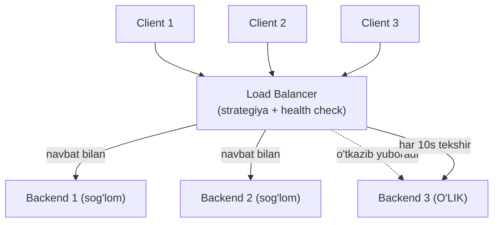
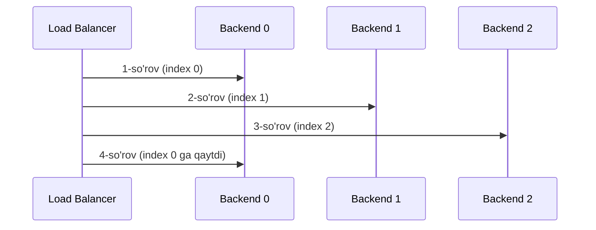
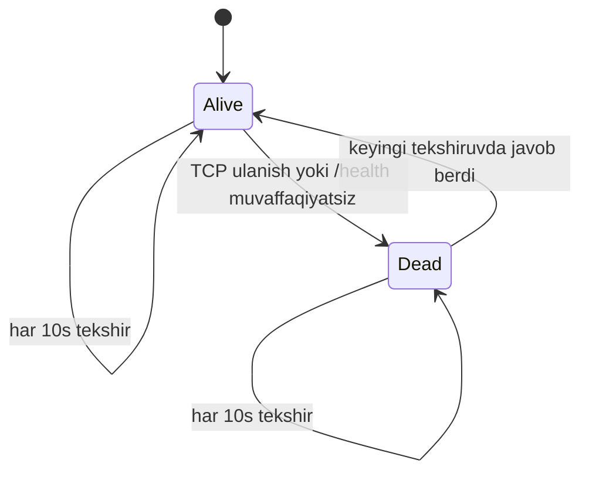

# 07. Load balancer yasash — Go'da o'z reverse proxy'ing

## Muammo / Hook

Ilovang mashhur bo'ldi: sekundiga 10 000 so'rov keladi. Bitta server buni ko'tara olmaydi — CPU 100%, so'rovlar kutadi, foydalanuvchilar ketadi. Yechim — **ko'p server** ishga tushirish. Lekin endi yangi savol: kelgan so'rovni **qaysi** serverga yuborish kerak? Va agar bitta server o'lsa, so'rovni unga yubormaslik uchun buni qanday bilamiz?

Bu ishni **load balancer** qiladi: u oldinda turadi, kelgan so'rovlarni sog'lom serverlarga **adolatli taqsimlaydi**. Bu dars — butun modulning cho'qqisi: 4-darsdagi HTTP, 2-darsdagi health check g'oyalari va standart `httputil.ReverseProxy`ni birlashtirib, **ishlaydigan load balancer** quramiz. Oxirida uni NGINX/HAProxy bilan taqqoslaymiz.

> Load balancer — restoranning administratori: kelgan mehmonni bo'sh ofitsiantga yo'naltiradi, band bo'lganini emas.

## Analogiya — supermarketdagi kassalar

Load balancer'ni **supermarket kassalari** deb tasavvur qil:

- Har **kassa** — bitta backend server.
- **Round-robin** — mijozlarni navbat bilan taqsimlash: 1-kassa, 2-kassa, 3-kassa, yana 1-kassa...
- **Least connections** — mijozni **eng qisqa navbatli** kassaga yuborish (eng kam band).
- **Health check** — administrator har kassaga qarab turadi: kassir ketib qolsa (server o'lsa), yangi mijozni u yerga yubormaydi.

Analogiya chegarasi: supermarketda mijoz o'zi kassa tanlaydi; load balancer'da **tanlovni tizim** qiladi — mijoz (client) faqat load balancer'ni ko'radi, orqadagi serverlarni bilmaydi ham.

## Sodda ta'rif

> **Load balancer** — client so'rovlarini bir nechta backend server o'rtasida biror strategiya bo'yicha (round-robin, least connections) taqsimlaydigan va sog'lom bo'lmagan serverlarni chetlab o'tadigan vositachi.

Biz **application-level** (7-qatlam, L7) load balancer quramiz — u HTTP darajasida ishlaydi. `httputil.ReverseProxy` esa "og'ir ishni" (so'rovni backend'ga uzatish, javobni qaytarish) o'z ustiga oladi.

## Diagramma — load balancer arxitekturasi



## Diagramma — round-robin tanlash



## Worked example — round-robin load balancer (4 qism)

### 1-qism: Backend strukturasi

```go
package main

import (
	"net/http"
	"net/http/httputil"
	"net/url"
	"sync"
	"sync/atomic"
)

// Backend — bitta orqa server haqidagi ma'lumot
type Backend struct {
	URL          *url.URL
	Alive        atomic.Bool           // sog'lommi? (thread-safe)
	Connections  atomic.Int64          // hozirgi aktiv ulanishlar
	ReverseProxy *httputil.ReverseProxy // so'rovni uzatuvchi
}

// SetAlive va IsAlive — atomic bilan poyga (race)dan himoyalangan
func (b *Backend) SetAlive(alive bool) { b.Alive.Store(alive) }
func (b *Backend) IsAlive() bool       { return b.Alive.Load() }
```

`atomic.Bool` va `atomic.Int64` — nega? Health check goroutine'i `Alive`ni **yozadi**, so'rovlarni qabul qiluvchi goroutine'lar uni **o'qiydi** — bu parallel kirish. `atomic` mutex'siz, xavfsiz o'qish/yozishni beradi (2-darsdagi concurrency himoyasining yengil varianti).

### 2-qism: ServerPool va round-robin tanlash

```go
type ServerPool struct {
	backends []*Backend
	current  atomic.Uint64 // aylanma indeks
}

// --- round-robin: keyingi indeksni atomik oshiramiz ---
func (p *ServerPool) nextIndex() int {
	return int(p.current.Add(1) % uint64(len(p.backends)))
}

// --- GetNextPeer: keyingi SOG'LOM backend'ni topamiz ---
func (p *ServerPool) GetNextPeer() *Backend {
	next := p.nextIndex()
	// bir aylana bo'ylab sog'lom backend qidiramiz
	for i := 0; i < len(p.backends); i++ {
		idx := (next + i) % len(p.backends)
		if p.backends[idx].IsAlive() {
			return p.backends[idx]
		}
	}
	return nil // hech biri sog'lom emas
}
```

Bloklar:
- **`nextIndex`** — `atomic.Uint64.Add(1)` bilan indeksni oshiradi va backend soniga bo'lib qoldiq oladi (aylanma). Atomik bo'lgani uchun ming goroutine parallel chaqirsa ham har biri **boshqa** raqam oladi.
- **`GetNextPeer`** — shunchaki keyingi indeks emas, keyingi **sog'lom** backend'ni topadi. Agar 1-backend o'lik bo'lsa, undan keyingisiga o'tadi. Hech biri sog'lom bo'lmasa `nil` qaytaradi.

### 3-qism: so'rovni uzatish (ServeHTTP)

```go
func (p *ServerPool) ServeHTTP(w http.ResponseWriter, r *http.Request) {
	// --- 1-qadam: keyingi sog'lom backend'ni olamiz ---
	peer := p.GetNextPeer()
	if peer == nil {
		http.Error(w, "hech qanday sog'lom server yo'q", http.StatusServiceUnavailable)
		return
	}
	// --- 2-qadam: aktiv ulanishni sanaymiz (least-conn uchun ham foydali) ---
	peer.Connections.Add(1)
	defer peer.Connections.Add(-1)

	// --- 3-qadam: so'rovni backend'ga uzatamiz ---
	peer.ReverseProxy.ServeHTTP(w, r)
}
```

`peer.ReverseProxy.ServeHTTP(w, r)` — bu sehr sodir bo'ladigan joy. `httputil.ReverseProxy` so'rovni backend'ga yuboradi, javobni kutadi va client'ga qaytaradi. Header'lar, body, streaming — hammasini o'zi boshqaradi. Biz faqat "qaysi backend"ni tanlaymiz.

### 4-qism: ReverseProxy yaratish va xato ushlash

```go
func NewBackend(rawURL string, pool *ServerPool) *Backend {
	serverURL, _ := url.Parse(rawURL)
	proxy := httputil.NewSingleHostReverseProxy(serverURL)

	b := &Backend{URL: serverURL, ReverseProxy: proxy}
	b.SetAlive(true)

	// --- backend so'rov paytida o'lsa, uni belgilaymiz va boshqasiga o'tamiz ---
	proxy.ErrorHandler = func(w http.ResponseWriter, r *http.Request, err error) {
		log.Printf("Backend %s xato berdi: %v", serverURL, err)
		b.SetAlive(false) // darhol o'lik deb belgilaymiz
		// so'rovni boshqa sog'lom backend'ga qayta yuboramiz
		if retryPeer := pool.GetNextPeer(); retryPeer != nil {
			retryPeer.ReverseProxy.ServeHTTP(w, r)
			return
		}
		http.Error(w, "server mavjud emas", http.StatusServiceUnavailable)
	}
	return b
}
```

`ErrorHandler` — muhim production detali. So'rov uzatilayotgan payt backend o'lib qolsa (masalan connection refused), `httputil.ReverseProxy` bu handler'ni chaqiradi. Biz backend'ni darhol o'lik deb belgilaymiz va so'rovni **boshqa** sog'lom backend'ga qayta yuboramiz — client umuman xatolikni sezmaydi (bu **failover**).

## Health check — o'lik serverlarni aniqlash

Load balancer o'lik serverga so'rov yubormasligi kerak. Buning uchun **passiv** (so'rov paytida xato -> o'lik) va **aktiv** (davriy tekshiruv) usullar bor. Aktivni quramiz:



```go
import (
	"context"
	"net"
	"time"
)

// --- backend jonli ekanini TCP ulanish bilan tekshiramiz ---
func isBackendAlive(u *url.URL) bool {
	timeout := 2 * time.Second
	conn, err := net.DialTimeout("tcp", u.Host, timeout)
	if err != nil {
		return false
	}
	conn.Close()
	return true
}

// --- har intervalda hamma backend'ni tekshiruvchi goroutine ---
func (p *ServerPool) HealthCheck(ctx context.Context, interval time.Duration) {
	ticker := time.NewTicker(interval)
	defer ticker.Stop()
	for {
		select {
		case <-ctx.Done():
			return
		case <-ticker.C:
			for _, b := range p.backends {
				alive := isBackendAlive(b.URL)
				b.SetAlive(alive)
				status := "sog'lom"
				if !alive {
					status = "O'LIK"
				}
				log.Printf("Health check %s: %s", b.URL, status)
			}
		}
	}
}
```

Bu 1-darsdagi `net.DialTimeout` va 3-darsdagi deadline g'oyalarining birlashmasi. Har 10 soniyada har backend'ga TCP ulanishga urinadi: ulansa — sog'lom, bo'lmasa — o'lik. `ctx` orqali graceful to'xtatiladi. Amalda TCP o'rniga `GET /health` endpoint'ga so'rov yuborish yaxshiroq (server "tirik lekin band" holatini ham aniqlaydi).

## Least connections strategiyasi

Round-robin oddiy, lekin bir kamchiligi bor: agar so'rovlar turli **og'irlikda** bo'lsa (biri 10ms, biri 10s), navbat bilan taqsimlash adolatsiz bo'lishi mumkin — bitta server og'ir so'rovlar bilan band bo'lib qoladi. **Least connections** buni hal qiladi: **eng kam aktiv ulanishli** serverga yuboradi.

```go
// --- eng kam aktiv ulanishli sog'lom backend'ni topamiz ---
func (p *ServerPool) GetLeastConnected() *Backend {
	var best *Backend
	var minConns int64 = -1
	for _, b := range p.backends {
		if !b.IsAlive() {
			continue
		}
		conns := b.Connections.Load()
		if minConns == -1 || conns < minConns {
			minConns = conns
			best = b
		}
	}
	return best
}
```

3-qismdagi `ServeHTTP`da `GetNextPeer()` o'rniga `GetLeastConnected()` chaqirsang — strategiya almashadi. `peer.Connections.Add(1)` / `defer peer.Connections.Add(-1)` allaqachon aktiv ulanishlarni sanayotgani uchun bu ishlaydi.

| Strategiya | Qachon yaxshi | Kamchilik |
| --- | --- | --- |
| Round-robin | So'rovlar bir xil og'irlikda | Og'ir so'rov bir serverda to'planishi mumkin |
| Least connections | So'rovlar turli davomiylikda | Har tanlashda hamma backend'ni ko'rish kerak |

## main — hammasini birlashtirish

```go
func main() {
	pool := &ServerPool{}
	// --- 1-qadam: backend'larni ro'yxatga olamiz ---
	for _, addr := range []string{
		"http://localhost:8081",
		"http://localhost:8082",
		"http://localhost:8083",
	} {
		pool.backends = append(pool.backends, NewBackend(addr, pool))
	}

	// --- 2-qadam: health check goroutine'ini ishga tushiramiz ---
	ctx, cancel := context.WithCancel(context.Background())
	defer cancel()
	go pool.HealthCheck(ctx, 10*time.Second)

	// --- 3-qadam: load balancer'ni 8080-portda ishga tushiramiz ---
	srv := &http.Server{
		Addr:         ":8080",
		Handler:      pool, // ServerPool o'zi http.Handler
		ReadTimeout:  5 * time.Second,
		WriteTimeout: 10 * time.Second,
	}
	log.Println("Load balancer 8080-portda")
	log.Fatal(srv.ListenAndServe())
}
```

`ServerPool` o'zi `ServeHTTP` metodiga ega, shuning uchun u to'g'ridan-to'g'ri `http.Handler` sifatida ishlaydi — 4-darsdagi handler g'oyasi.

**Output (backend 8082 o'chirilganda):**

```
$ go run .
2026/07/10 12:00:01 Load balancer 8080-portda
2026/07/10 12:00:11 Health check http://localhost:8081: sog'lom
2026/07/10 12:00:11 Health check http://localhost:8082: O'LIK
2026/07/10 12:00:11 Health check http://localhost:8083: sog'lom
# so'rovlar faqat 8081 va 8083 ga boradi, 8082 o'tkazib yuboriladi
```

## PRIMM — bashorat qil

> 🤔 **O'ylab ko'r:** `nextIndex`da `atomic.Uint64.Add(1)` o'rniga oddiy `p.current++` (atomik bo'lmagan) ishlatsak, 1000 so'rov bir vaqtda kelsa nima bo'ladi?

<details>
<summary>💡 Javobni ko'rish</summary>

**Data race** (poyga holati) yuzaga keladi. `p.current++` aslida uch amaldan iborat: o'qi, oshir, yoz. Ikki goroutine bir vaqtda o'qisa (masalan ikkalasi ham 5 ni o'qib, 6 yozsa), bitta qiymat **yo'qoladi** — indeks noto'g'ri hisoblanadi. Yomonroq: Go'da bu **aniqlanmagan xatti-harakat** (undefined behavior), `go run -race` bilan ogohlantirish beradi va production'da kutilmagan buglarga olib keladi.

`atomic.Add` esa "o'qi-oshir-yoz"ni **bo'linmas** (atomic) bitta amalga aylantiradi — hech qanday goroutine yarim yo'lda aralasha olmaydi. Shuning uchun parallel kirish bo'lgan har qanday hisoblagichda `atomic` yoki `mutex` majburiy. Bu — 5-darsdagi "ma'lumotni himoyala" qoidasining yana bir ko'rinishi.
</details>

## NGINX / HAProxy bilan taqqoslash

Biz o'z load balancer'imizni yozdik — **o'rganish** uchun ajoyib. Lekin production'da ko'pincha tayyor, jangda sinalgan vositalar ishlatiladi. Solishtiraylik:

**NGINX konfiguratsiyasi** (bir xil vazifa):

```nginx
upstream backend {
    least_conn;                      # strategiya
    server localhost:8081 max_fails=3 fail_timeout=10s;
    server localhost:8082 max_fails=3 fail_timeout=10s;
    server localhost:8083 max_fails=3 fail_timeout=10s;
}
server {
    listen 8080;
    location / {
        proxy_pass http://backend;   # bizning ReverseProxy'ga o'xshash
    }
}
```

**HAProxy konfiguratsiyasi:**

```
backend servers
    balance leastconn                # strategiya
    option httpchk GET /health       # aktiv health check
    server s1 localhost:8081 check
    server s2 localhost:8082 check
    server s3 localhost:8083 check
```

| Jihat | O'z Go LB | NGINX / HAProxy |
| --- | --- | --- |
| Sozlash | Kod yozasan | Konfiguratsiya fayli |
| Moslashuvchanlik | To'liq (istagan logika) | Cheklangan, lekin yetarli |
| Ishlash tezligi | Yaxshi | Juda yuqori (yillar davomida optimizatsiya) |
| Qachon ishlatiladi | Maxsus logika kerak bo'lsa | Standart holatlarning 95% |

> Xulosa: o'z LB'ingni **maxsus marshrutlash logikasi** kerak bo'lganda yoz (masalan foydalanuvchi ID'siga qarab). Oddiy taqsimlash uchun NGINX/HAProxy tez va ishonchli. Lekin o'zing yozib ko'rganing — ular ichida nima bo'layotganini tushunishga yordam beradi.

## Ko'p uchraydigan xatolar

⚠️ **Xato 1 — hisoblagichni `atomic`/`mutex`siz o'zgartirish.**
`p.current++` yoki `b.Connections++` parallel goroutine'larda data race beradi. To'g'risi: `atomic` tiplar yoki mutex.

⚠️ **Xato 2 — health check'siz load balancer.**
O'lik serverga so'rov yuborilaveradi — client'lar xato oladi. To'g'risi: aktiv (davriy) + passiv (`ErrorHandler`) health check.

⚠️ **Xato 3 — `ErrorHandler`siz `ReverseProxy`.**
Backend so'rov paytida o'lsa, client 502 oladi. To'g'risi: `ErrorHandler`da backend'ni o'lik belgila va boshqasiga retry qil (failover).

⚠️ **Xato 4 — sog'lom backend qolmaganini tekshirmaslik.**
`GetNextPeer` `nil` qaytarishi mumkin. Tekshirmasang nil pointer panic. To'g'risi: `if peer == nil { 503 qaytar }`.

## Xulosa

- Load balancer client so'rovlarini bir necha backend o'rtasida taqsimlaydi va o'lik serverlarni chetlab o'tadi.
- **`httputil.ReverseProxy`** so'rovni backend'ga uzatish/javob qaytarishning "og'ir ishini" bajaradi; biz faqat backend tanlaymiz.
- **Round-robin** — navbat bilan; **least connections** — eng kam bandiga. Turli og'irlikdagi so'rovlarda least-conn adolatliroq.
- **Health check**: aktiv (davriy TCP/HTTP tekshiruv) + passiv (`ErrorHandler`da xato -> o'lik + failover).
- Parallel kiriladigan hisoblagichlarda **`atomic`** (yoki mutex) majburiy — aks holda data race.
- Production'da ko'pincha NGINX/HAProxy; o'z LB — maxsus logika kerak bo'lganda va tushunish uchun.

## 🧠 Eslab qol

- Load balancer = so'rovni sog'lom backend'ga taqsimlaydigan vositachi.
- `httputil.ReverseProxy` uzatishni o'zi qiladi; sen backend tanlaysan.
- Round-robin = navbat bilan; least-conn = eng bo'shiga.
- Health check + `ErrorHandler` failover = o'lik serverni chetlab o'tish.
- Parallel hisoblagich = `atomic`, aks holda data race.

## ✅ O'z-o'zini tekshir (retrieval practice)

**1.** Round-robin va least connections orasidagi farq nima? Qaysi holatda least-conn afzal?

<details>
<summary>Javob</summary>

Round-robin so'rovlarni **navbat bilan** (1, 2, 3, 1, 2, 3...) taqsimlaydi — barcha so'rovlar taxminan bir xil davomiylikda bo'lganda yaxshi. Least connections esa **eng kam aktiv ulanishli** serverga yuboradi — so'rovlar turli davomiylikda bo'lganda (biri 10ms, biri 10s) afzal, chunki og'ir so'rov bilan band server yangi so'rov olmaydi.
</details>

**2.** So'rov uzatilayotgan payt backend to'satdan o'lsa, client xato ko'radimi? Buni qanday oldini olamiz?

<details>
<summary>Javob</summary>

`ErrorHandler` bo'lmasa — ha, client 502 oladi. Uni oldini olish uchun `httputil.ReverseProxy.ErrorHandler`da: backend'ni o'lik deb belgilaymiz **va** so'rovni boshqa sog'lom backend'ga **qayta yuboramiz** (failover). Shunda client umuman xatolikni sezmaydi.
</details>

**3.** Nega `Alive` va `current` uchun oddiy `bool`/`int` emas, `atomic` tiplar ishlatamiz?

<details>
<summary>Javob</summary>

Bularga **bir vaqtda ko'p goroutine** tegadi: health check goroutine'i `Alive`ni yozadi, so'rov goroutine'lari uni o'qiydi; `current`ni ming so'rov parallel oshiradi. Oddiy `bool`/`int` bilan bu **data race** — qiymatlar yo'qoladi yoki buziladi. `atomic` o'qish/yozishni bo'linmas qilib, poygani yo'q qiladi.
</details>

**4.** O'z Go load balancer'ing bilan NGINX orasida qachon qaysi birini tanlaysan?

<details>
<summary>Javob</summary>

O'z LB'ingni — **maxsus marshrutlash logikasi** kerak bo'lganda (masalan foydalanuvchi ID'si yoki so'rov turiga qarab). NGINX/HAProxy'ni — standart taqsimlash (round-robin, least-conn) yetarli bo'lgan holatlarning aksariyatida: ular jangda sinalgan, tez va konfiguratsiya bilan sozlanadi, kod yozish shart emas.
</details>

## 🛠 Amaliyot

**1. Oson (Modify).** Health check intervalini 10 soniyadan 5 soniyaga o'zgartir va TCP tekshiruv o'rniga `http.Get(u.String() + "/health")` bilan HTTP health check qil (status 200 bo'lsa sog'lom).

<details>
<summary>Hint</summary>

`isBackendAlive` ichida: `resp, err := http.Get(u.String() + "/health"); if err != nil { return false }; defer resp.Body.Close(); return resp.StatusCode == http.StatusOK`. `main`da `HealthCheck(ctx, 5*time.Second)`.
</details>

**2. O'rta (faded example — TODO to'ldirish).** "Weighted round-robin" qo'sh: har backend'ga og'irlik (weight) ber, og'irroq server ko'proq so'rov olsin.

```go
type Backend struct {
	URL    *url.URL
	Weight int   // TODO: NewBackend'da o'rnat
	// ...
}

func (p *ServerPool) GetWeightedPeer() *Backend {
	// TODO: har backend'ni Weight marta "takrorlangandek" hisobla
	// TODO: eng kam "hisoblangan/weight" nisbatli sog'lom backend'ni tanla
	// Sodda variant: weight ta nusxadan iborat slice yasab, round-robin qil
}
```

<details>
<summary>Hint</summary>

Eng sodda usul: `main`da har backend'ni `Weight` marta `pool.backends`ga qo'sh (masalan weight=3 bo'lsa uch marta). Keyin oddiy round-robin o'zi og'irroqqa ko'proq so'rov beradi. Aniqroq usul — "smooth weighted round-robin" algoritmi.
</details>

**3. Qiyin (Make — noldan).** Sinash uchun oddiy backend server yoz: `main`da `port` flag'ini olib, `/` ga o'z portini qaytaradigan HTTP server ko'tarsin. Uni 8081, 8082, 8083 portlarda uch marta ishga tushirib, load balancer orqali `curl localhost:8080` qilib, javoblar aylanishini kuzat.

<details>
<summary>Hint</summary>

Backend: `port := flag.String("port", "8081", ""); http.HandleFunc("/", func(w, r){ fmt.Fprintf(w, "Salom %s portdan\n", *port) }); http.HandleFunc("/health", func(w, r){ w.WriteHeader(200) }); http.ListenAndServe(":"+*port, nil)`. Uch terminalda uch portda ishga tushir.
</details>

## 🔁 Takrorlash

- **Bog'liq darslar:** [04-http-server-va-client.md](04-http-server-va-client.md) (handler, timeout g'oyalari), [01-net-package-asoslari.md](01-net-package-asoslari.md) (`net.DialTimeout` health check uchun), [02-tcp-client-server.md](02-tcp-client-server.md) (concurrency himoyasi).
- **Takrorlash jadvali:** "round-robin vs least-conn", "atomic nega kerak", "failover" nuqtalariga **ertaga**, **3 kundan so'ng**, **1 haftadan so'ng** qaytib javob ber.
- **Feynman testi:** "Load balancer nima qiladi va o'lik serverga so'rov yubormaslik uchun nima ishlatadi?" degan savolga do'stingga 3 jumlada javob ber. (Kalit: taqsimlash + health check + failover.)
- **Butun modul yakuni:** Bu moduldagi barcha 7 darsni bog'la — `net` poydevor, uning ustida TCP/UDP, keyin HTTP, keyin WebSocket/gRPC, va cho'qqida load balancer barcha g'oyalarni birlashtiradi.

## 📚 Manbalar

- [Building a simple load balancer in Go — DEV Community](https://dev.to/vivekalhat/building-a-simple-load-balancer-in-go-70d)
- [How to Build a Layer 7 Load Balancer with Health Checks in Go — OneUptime](https://oneuptime.com/blog/post/2026-01-25-layer-7-load-balancer-health-checks-go/view)
- [Let's Create a Simple Load Balancer With Go — kasvith.me](https://kasvith.me/posts/lets-create-a-simple-lb-go/)
- [Build Network Proxies and Reverse Proxies in Go — DEV Community](https://dev.to/jones_charles_ad50858dbc0/build-network-proxies-and-reverse-proxies-in-go-a-hands-on-guide-288j)
