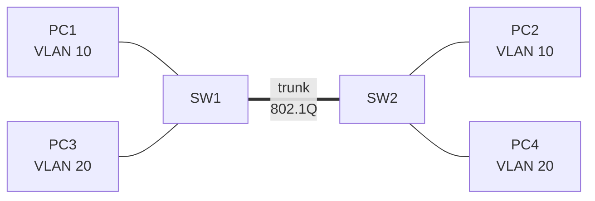
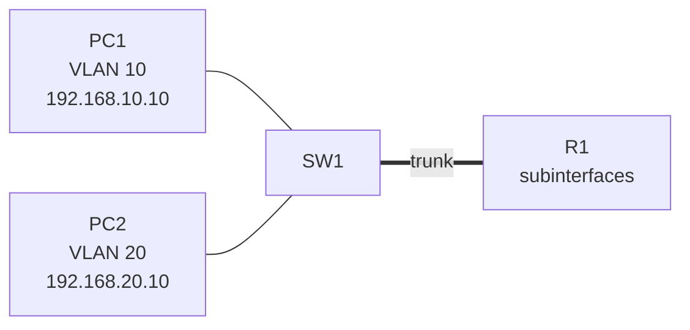
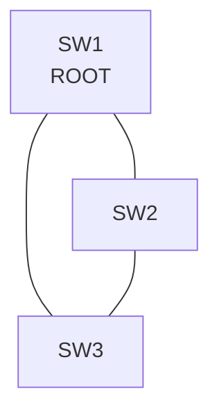
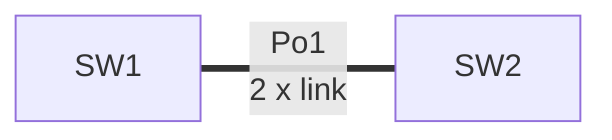
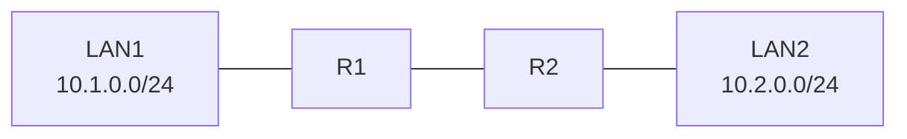
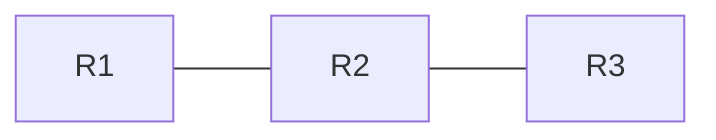
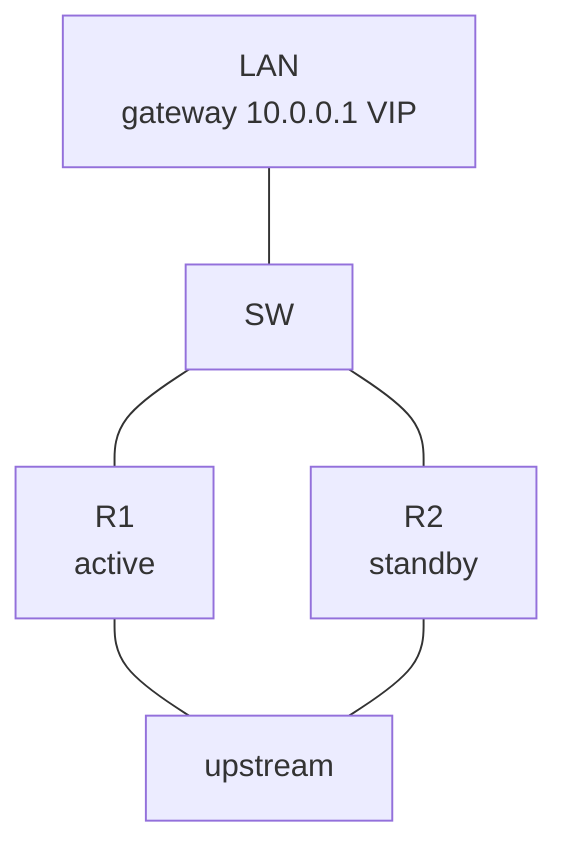
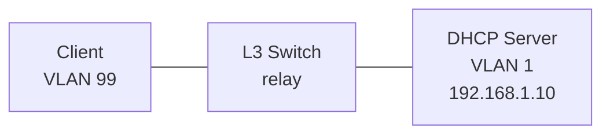
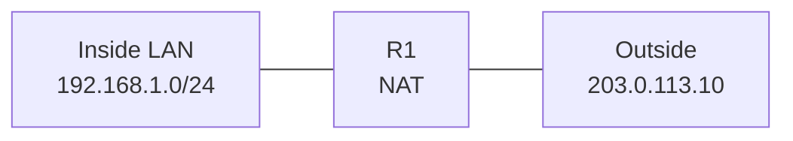
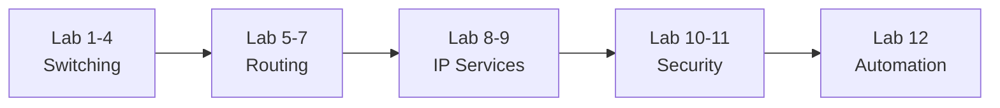

# Lab topologiyalar (Packet Tracer / GNS3)

Bu fayl kursning nazariy modullarini **amaliy lab** orqali mustahkamlaydi. Har bir lab uchun quyidagilar berilgan:

- **Maqsad** — nima o'rganiladi;
- **Qaysi moduldan keyin** — kurs ketma-ketligida joyi;
- **Topologiya** — qurilmalar ulanishi (Mermaid diagramma);
- **Vazifa** — bosqichma-bosqich sozlash;
- **Tekshirish** — `show` / `debug` buyruqlari;
- **Kutilgan natija** — lab muvaffaqiyatli bo'lsa nima ko'rinadi.

> **Falsafa:** Nazariyani o'qib chiqish yetarli emas. Har bir konfiguratsiyani o'z qo'ling bilan yozib, `show` buyruqlari bilan tekshirib ko'rmaguningcha, bilim mustahkam bo'lmaydi.

## Lablar xaritasi

| # | Lab | Modul | Asosiy ko'nikma |
|---|-----|-------|-----------------|
| 1 | VLAN va trunk | 01-network-access | L2 segmentatsiya |
| 2 | Inter-VLAN routing | 01-network-access | Router-on-a-stick |
| 3 | STP root bridge | 01-network-access | Loop oldini olish |
| 4 | EtherChannel LACP | 01-network-access | Link aggregation |
| 5 | Static routing | 03-routing | Qo'lda route |
| 6 | OSPF single area | 03-routing | Dynamic routing |
| 7 | HSRP | 03-routing | Gateway redundancy |
| 8 | DHCP relay | 07-ip-services | Cross-VLAN DHCP |
| 9 | NAT / PAT | 07-ip-services | Address translation |
| 10 | ACL | 08-security | Traffic filtering |
| 11 | Device management security | 08-security | SSH, AAA |
| 12 | Automation mini lab | 09-automation | REST API, JSON |

## Tayyorgarlik

Har qanday lab uchun quyidagi vositalardan bittasi kifoya:

- **Cisco Packet Tracer** — eng oson, yangi boshlovchilar uchun;
- **GNS3 + IOSvL2/IOSv** — real IOS image, ancha yaqin;
- **EVE-NG** — enterprise darajadagi topologiyalar.

---

## Lab 1: VLAN va trunk

**Maqsad:** Bitta jismoniy switch ustida ikkita mantiqiy tarmoq (VLAN) yaratish va ularni ikkinchi switch bilan trunk orqali bog'lash.

**Qaysi moduldan keyin:** 01-network-access (VLAN, 802.1Q darslaridan so'ng).

**Topologiya:**



**VLAN taqsimoti:** VLAN 10 = PC1, PC2; VLAN 20 = PC3, PC4.

**Vazifa:**

1. SW1 va SW2 da VLAN 10 va VLAN 20 yarat.
2. PC ulangan portlarni access mode ga o'tkaz va to'g'ri VLAN ga biriktir.
3. SW1-SW2 orasidagi linkni trunk qil.
4. Trunkdan faqat VLAN 10 va 20 o'tishiga ruxsat ber (allowed VLAN).

**Namuna konfiguratsiya (SW1):**

```text
vlan 10
 name USERS
vlan 20
 name SERVERS
interface Gi0/1
 switchport mode access
 switchport access vlan 10
interface Gi0/24
 switchport mode trunk
 switchport trunk allowed vlan 10,20
```

**Tekshirish:**

```text
show vlan brief
show interfaces trunk
show mac address-table
```

**Kutilgan natija:**

- `show interfaces trunk` da Gi0/24 trunk sifatida, allowed VLAN `10,20`;
- PC1 (VLAN 10) faqat PC2 ga ping qila oladi;
- PC1 (VLAN 10) PC3 (VLAN 20) ga ping qila **olmaydi** (routing yo'q).

---

## Lab 2: Inter-VLAN routing (Router-on-a-stick)

**Maqsad:** Turli VLAN lar orasida aloqa o'rnatish. VLAN lar L2 da izolyatsiya qilingan, ular orasida gaplashish uchun L3 qurilma kerak.

**Qaysi moduldan keyin:** 01-network-access (inter-VLAN routing darsidan so'ng), 02-network-layer-ip.

**Topologiya:**



**Router subinterfaces:**

```text
R1 Gi0/0.10 -> 192.168.10.1/24
R1 Gi0/0.20 -> 192.168.20.1/24
```

**Vazifa:**

1. Routerda subinterface sozla, har biriga `encapsulation dot1q <vlan>` yoz.
2. Switchdagi router ga ulangan portni trunk qil.
3. PC larda default gateway ni to'g'ri subinterface IP ga ber.

**Namuna konfiguratsiya (R1):**

```text
interface Gi0/0.10
 encapsulation dot1q 10
 ip address 192.168.10.1 255.255.255.0
interface Gi0/0.20
 encapsulation dot1q 20
 ip address 192.168.20.1 255.255.255.0
```

**Tekshirish:**

```text
show ip interface brief
show interfaces trunk
ping 192.168.20.10
```

**Kutilgan natija:**

- PC1 (VLAN 10) endi PC2 (VLAN 20) ga ping qila oladi;
- `traceroute` da paket routerdan (192.168.10.1) o'tayotgani ko'rinadi.

---

## Lab 3: STP root bridge

**Maqsad:** Redundant (ikkilangan) linklardagi Layer 2 loop ni oldini olish va root bridge ni qo'lda tanlash.

**Qaysi moduldan keyin:** 01-network-access (STP / Rapid PVST+ darsidan so'ng).

**Topologiya:**



**Vazifa:**

1. SW1 ni VLAN 10 uchun **root bridge** qil (`spanning-tree vlan 10 root primary`).
2. SW2 ni **secondary root** qil.
3. Access portlarda **PortFast** va **BPDU Guard** yoq.

**Namuna konfiguratsiya:**

```text
SW1(config)# spanning-tree vlan 10 root primary
SW2(config)# spanning-tree vlan 10 root secondary
SW1(config)# interface Gi0/1
SW1(config-if)# spanning-tree portfast
SW1(config-if)# spanning-tree bpduguard enable
```

**Tekshirish:**

```text
show spanning-tree vlan 10
show spanning-tree summary
```

**Kutilgan natija:**

- SW1 `This bridge is the root` deb ko'rsatadi;
- SW3 dagi bitta port `BLK` (blocking) holatida — loop shu yerda uzilgan;
- Access portga switch ulasang, BPDU Guard port ni `err-disabled` ga o'tkazadi.

---

## Lab 4: EtherChannel (LACP)

**Maqsad:** Ikki jismoniy linkni bitta mantiqiy kanalga birlashtirib, bandwidth ni oshirish va redundancy berish.

**Qaysi moduldan keyin:** 01-network-access (EtherChannel / LACP darsidan so'ng).

**Topologiya:**



**Vazifa:**

1. Ikki jismoniy linkni `Port-channel 1` ga birlashtir.
2. LACP `active` mode ishlat.
3. Port-channel ni trunk qil.

**Namuna konfiguratsiya:**

```text
interface range Gi0/1 - 2
 channel-group 1 mode active
interface Port-channel 1
 switchport mode trunk
```

**Tekshirish:**

```text
show etherchannel summary
show interfaces port-channel 1 trunk
```

**Kutilgan natija:**

- `show etherchannel summary` da Po1 statusi `SU` (in use), portlar `P` (bundled);
- Bitta link uzilsa ham trafik ikkinchi link orqali davom etadi.

---

## Lab 5: Static routing

**Maqsad:** Ikki router orasida qo'lda yozilgan route bilan aloqa o'rnatish, default va floating static route ishlatish.

**Qaysi moduldan keyin:** 03-routing (static routing darsidan so'ng).

**Topologiya:**



**Vazifa:**

1. R1 da LAN2 uchun static route yoz.
2. R2 da LAN1 uchun static route yoz.
3. Default route va floating static route (yuqori AD bilan) bilan test qil.

**Namuna konfiguratsiya:**

```text
R1(config)# ip route 10.2.0.0 255.255.255.0 10.0.0.2
R2(config)# ip route 10.1.0.0 255.255.255.0 10.0.0.1
R1(config)# ip route 0.0.0.0 0.0.0.0 10.0.0.2 200
```

**Tekshirish:**

```text
show ip route
show ip route static
traceroute 10.2.0.10
```

**Kutilgan natija:**

- `show ip route` da `S` (static) route ko'rinadi;
- LAN1 dan LAN2 ga ping ishlaydi;
- Floating route (AD 200) faqat asosiy route yo'qolganda paydo bo'ladi.

---

## Lab 6: OSPF single area

**Maqsad:** Dynamic routing bilan tarmoqni avtomatik o'rganish. Static route bilan farqni his qilish.

**Qaysi moduldan keyin:** 03-routing (OSPF darsidan so'ng).

**Topologiya:**



**Vazifa:**

1. Barcha routerlarda OSPF process yoq, `area 0` ishlat.
2. Router ID larni qo'lda belgila (`router-id`).
3. Barcha interfeyslarni OSPF ga qo'sh.

**Namuna konfiguratsiya (R2):**

```text
router ospf 1
 router-id 2.2.2.2
 network 10.0.12.0 0.0.0.3 area 0
 network 10.0.23.0 0.0.0.3 area 0
```

**Tekshirish:**

```text
show ip ospf neighbor
show ip ospf interface brief
show ip route ospf
```

**Kutilgan natija:**

- `show ip ospf neighbor` da qo'shnilar `FULL` holatida;
- `show ip route ospf` da `O` bilan belgilangan route lar avtomatik paydo bo'lgan;
- Bitta link uzilsa, OSPF yangi yo'lni o'zi topadi (convergence).

---

## Lab 7: HSRP (First Hop Redundancy)

**Maqsad:** Ikki router bitta virtual gateway berib, biri ishdan chiqsa ikkinchisi avtomatik o'rnini bosishi.

**Qaysi moduldan keyin:** 03-routing (FHRP / HSRP darsidan so'ng).

**Topologiya:**



**Vazifa:**

1. R1 va R2 orasida virtual default gateway (VIP) yarat.
2. R1 active (yuqori priority), R2 standby bo'lsin.
3. Preempt va interface tracking yoq: R1 uplink tushsa, R2 active bo'lsin.

**Namuna konfiguratsiya (R1):**

```text
interface Gi0/0
 standby 1 ip 10.0.0.1
 standby 1 priority 110
 standby 1 preempt
 standby 1 track Gi0/1 20
```

**Tekshirish:**

```text
show standby brief
```

**Kutilgan natija:**

- `show standby brief` da R1 `Active`, R2 `Standby`;
- R1 uplink (Gi0/1) tushganda priority 20 ga kamayadi va R2 active bo'ladi;
- PC lar gateway 10.0.0.1 dan uzilmasdan ishlashda davom etadi.

---

## Lab 8: DHCP relay (ip helper-address)

**Maqsad:** DHCP server boshqa VLAN da bo'lganda ham client IP olishini ta'minlash. DHCP DISCOVER broadcast VLAN chegarasini kesib o'ta olmaydi.

**Qaysi moduldan keyin:** 07-ip-services (DHCP relay darsidan so'ng).

**Topologiya:**



**Vazifa:**

1. VLAN99 SVI da `ip helper-address 192.168.1.10` yoz.
2. DHCP serverda VLAN99 uchun scope (range, gateway, DNS) yarat.

**Namuna konfiguratsiya (L3 switch):**

```text
interface Vlan99
 ip address 192.168.99.1 255.255.255.0
 ip helper-address 192.168.1.10
```

**Tekshirish:**

```text
show running-config interface vlan 99
debug ip dhcp server packet
```

**Kutilgan natija:**

- Client `169.254.x.x` (APIPA) o'rniga `192.168.99.x` oladi;
- Debug da relay giaddr (192.168.99.1) bilan unicast ketayotgani ko'rinadi.

> **Eslatma:** Bu lab troubleshooting-cases.md dagi "Case 15: DHCP lease olmayapti" bilan bevosita bog'liq.

---

## Lab 9: NAT / PAT

**Maqsad:** Ichki private IP larni bitta public IP orqali internetga chiqarish (PAT overload).

**Qaysi moduldan keyin:** 07-ip-services (NAT / PAT darsidan so'ng).

**Topologiya:**



**Vazifa:**

1. Inside va outside interfeyslarni belgila.
2. ACL bilan inside subnetni tanla.
3. PAT overload sozla.

**Namuna konfiguratsiya:**

```text
interface Gi0/0
 ip nat inside
interface Gi0/1
 ip nat outside
access-list 1 permit 192.168.1.0 0.0.0.255
ip nat inside source list 1 interface Gi0/1 overload
```

**Tekshirish:**

```text
show ip nat translations
show ip nat statistics
```

**Kutilgan natija:**

- Bir nechta ichki host bitta public IP orqali chiqadi, portlar bilan ajratiladi;
- `show ip nat translations` da inside local -> inside global mapping ko'rinadi.

---

## Lab 10: ACL (Access Control List)

**Maqsad:** Tarmoq trafigini filtrlash — kerakli portlarga ruxsat, keraksizlarni bloklash.

**Qaysi moduldan keyin:** 08-security (standard / extended ACL darsidan so'ng).

**Vazifa:**

1. VLAN10 dan VLAN20 ga ICMP (ping) ni blokla.
2. VLAN10 dan web serverga 80/443 portlarga ruxsat ber.
3. ACL ni to'g'ri interfeys va yo'nalishga (in/out) qo'y.

**Namuna konfiguratsiya:**

```text
ip access-list extended VLAN10-FILTER
 deny icmp 192.168.10.0 0.0.0.255 192.168.20.0 0.0.0.255
 permit tcp 192.168.10.0 0.0.0.255 host 192.168.20.10 eq 80
 permit tcp 192.168.10.0 0.0.0.255 host 192.168.20.10 eq 443
 permit ip any any
interface Gi0/0.10
 ip access-group VLAN10-FILTER in
```

**Tekshirish:**

```text
show access-lists
show ip interface Gi0/0.10
```

**Kutilgan natija:**

- VLAN10 dan VLAN20 ga ping ishlamaydi;
- Web server 80/443 ochiladi;
- `show access-lists` da har qatordagi match counter oshib boradi.

> **Eslatma:** ACL da qator tartibi muhim — birinchi mos kelgan qoida ishlaydi, oxirida yashirin `deny any` bor.

---

## Lab 11: Device management security

**Maqsad:** Qurilmani xavfsiz boshqarish — parol, SSH, telnet o'chirish.

**Qaysi moduldan keyin:** 08-security (SSH, AAA darsidan so'ng).

**Vazifa:**

1. `enable secret` sozla (hash bilan).
2. Local user yarat.
3. VTY faqat SSH qabul qilsin, telnet o'chirilsin.

**Namuna konfiguratsiya:**

```text
enable secret StrongPass123
username admin privilege 15 secret AdminPass123
ip domain-name lab.local
crypto key generate rsa modulus 2048
line vty 0 4
 transport input ssh
 login local
```

**Tekshirish:**

```text
show ip ssh
show running-config | section line vty
ssh -l admin 192.168.1.1
```

**Kutilgan natija:**

- `show ip ssh` SSH v2 yoqilganini ko'rsatadi;
- Telnet ulanish rad etiladi;
- SSH orqali `admin` user bilan kirish ishlaydi.

---

## Lab 12: Automation mini lab

**Maqsad:** Tarmoq qurilmasidan REST API orqali ma'lumot olish va JSON ni parse qilish — network automation ga birinchi qadam.

**Qaysi moduldan keyin:** 09-automation (REST API, JSON, Ansible darsidan so'ng).

**Vazifa:**

1. REST API endpointdan JSON output ol.
2. JSON ichidan hostname yoki interface statusni ajrat.
3. Oddiy Ansible inventory yoz.

**Namuna JSON:**

```json
{
  "hostname": "R1",
  "interfaces": [
    {"name": "GigabitEthernet0/0", "status": "up"},
    {"name": "GigabitEthernet0/1", "status": "down"}
  ]
}
```

**Namuna parse (Python):**

```python
import json

data = json.loads(raw)                     # matnni dict ga aylantir
print(data["hostname"])                     # R1
for iface in data["interfaces"]:            # har interfeys ustidan yur
    if iface["status"] == "down":
        print("DOWN:", iface["name"])       # GigabitEthernet0/1
```

**Namuna Ansible inventory:**

```ini
[routers]
r1 ansible_host=192.168.1.1

[routers:vars]
ansible_network_os=ios
ansible_connection=network_cli
```

**Kutilgan natija:**

- Script `down` holatidagi interfeysni topadi;
- `ansible routers -m ios_facts` bilan qurilma faktlari olinadi.

---

## Amaliyot yo'l xaritasi

Lablarni quyidagi tartibda bajarish tavsiya etiladi:



Har bir labni tugatgach, o'zingga savol ber:

1. Bu konfiguratsiyani **yoddan** qayta yoza olamanmi?
2. `show` buyruqlari natijasini **o'qib** tushuna olamanmi?
3. Agar ishlamasa, qaysi layer dan (L1 -> L7) tekshirishni boshlayman?

Uchinchi savolga javob berish uchun keyingi fayl — troubleshooting-cases.md juda muhim.

## 📚 Manbalar

- Manba lab g'oyalari: kurs ichki `new/00-lab-topologies.md`
- [Cisco Structured Troubleshooting Approaches](https://www.ciscopress.com/articles/article.asp?p=2273070&seqNum=2)
