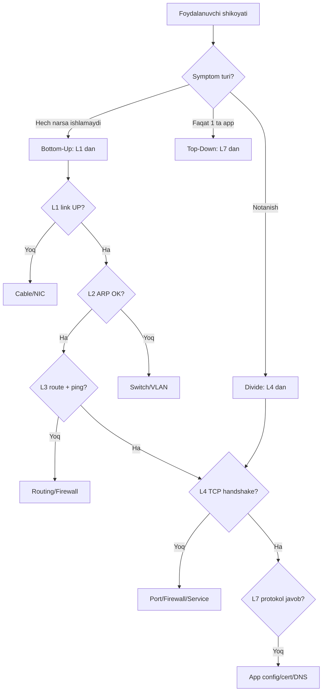
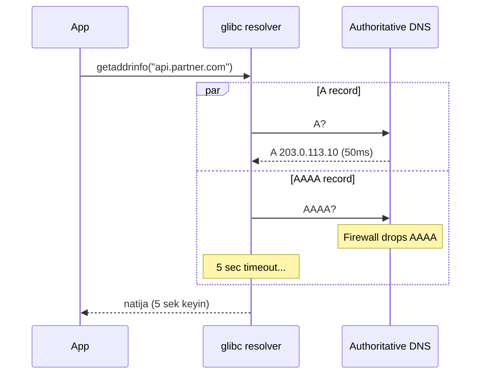
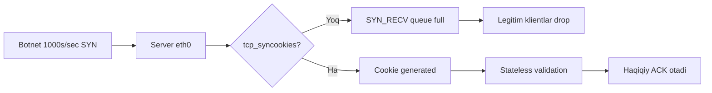
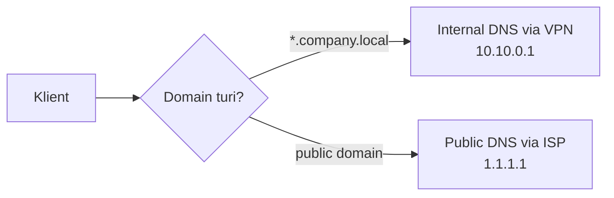
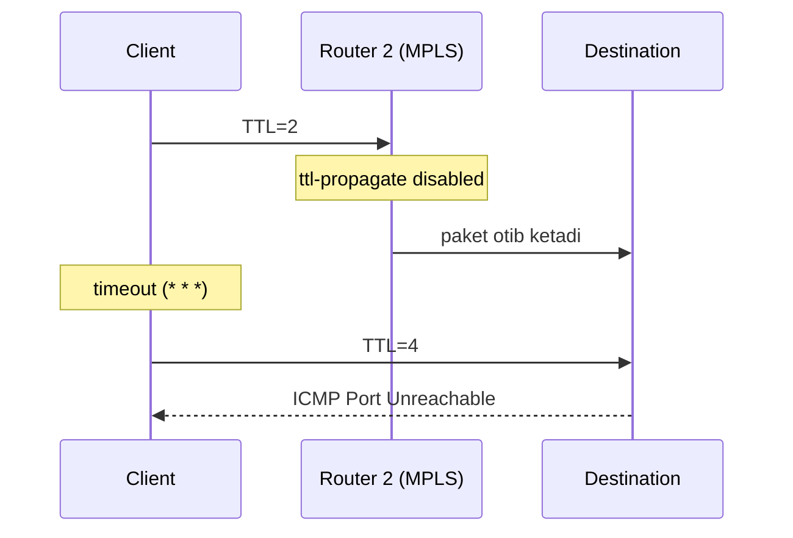
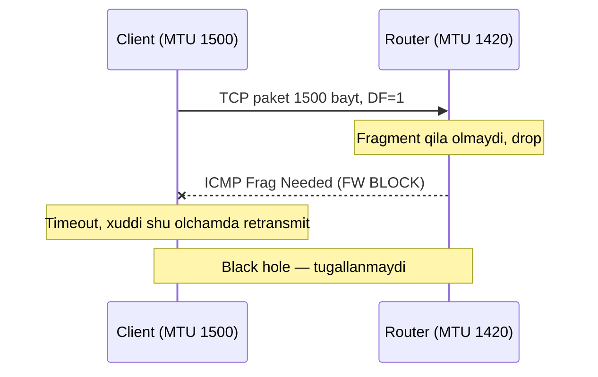
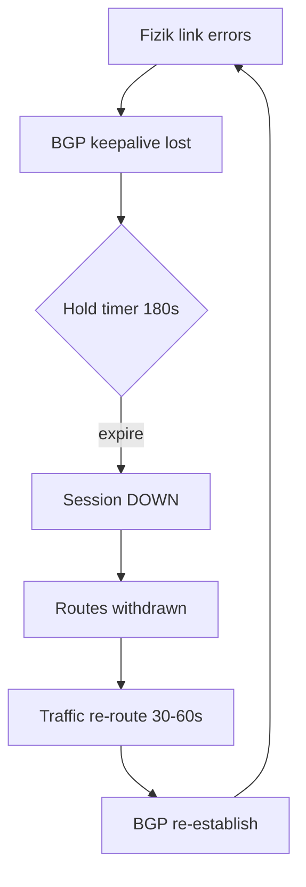
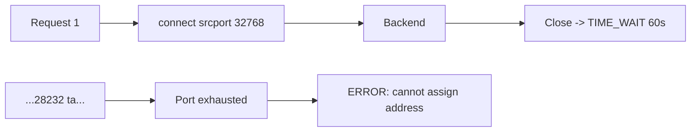
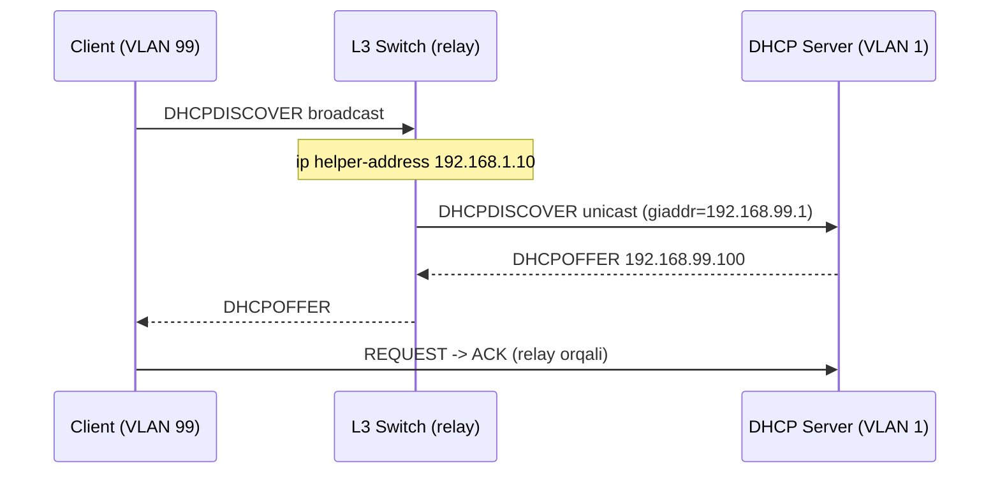
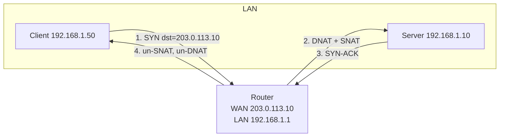

# Network Troubleshooting Cases

17 ta real hayotdan olingan case — diagnostika qadamlari, sabab tahlili va yechimlar bilan. Har biri **layer-by-layer** (OSI) yondashuvi orqali ko'rib chiqilgan.

> **Falsafa:** "Tarmoq ishlamayapti" — bu Senior Engineer uchun kasallikning simptomi. Haqiqiy tashxis (diagnosis) — **layer-by-layer** tekshirish va **gipoteza -> test -> natija** sikli.

## Tarkib

| #  | Case | Layer | Asosiy vositalar |
|----|------|-------|--------------|
| 1  | Internet ishlamayapti, LAN OK | L3/L7 | `ping`, `dig`, `ip route` |
| 2  | DNS resolution juda sekin | L7 | `dig`, `tcpdump`, `resolvectl` |
| 3  | HTTPS fail, HTTP ishlaydi | L6/L7 | `openssl`, `curl -v`, `tcpdump` |
| 4  | Webserver SYN flood ostida | L4 | `ss`, `nstat`, `iptables`, `sysctl` |
| 5  | TCP connection RST bilan tushadi | L4 | `tcpdump`, `conntrack`, `ss -i` |
| 6  | Wi-Fi kuchli signal, lekin sekin | L1/L2 | `iw`, `iwconfig`, `tcpdump` |
| 7  | VPN OK, DNS ishlamaydi | L7 | `resolvectl`, `dig`, `ip route` |
| 8  | `traceroute` da `* * *` | L3 | `mtr`, `traceroute -T`, `tcpdump` |
| 9  | Web server intermittent 502/504 | L7 | nginx logs, `ss`, `curl -w` |
| 10 | MTU mismatch — katta packet drop | L3 | `ping -s -M do`, `tracepath` |
| 11 | BGP session flapping | L3 | `vtysh`, `tcpdump port 179` |
| 12 | TCP TIME_WAIT exhaustion | L4 | `ss -tan`, `sysctl`, `nstat` |
| 13 | IPv6 ishlaydi, IPv4 yo'q | L3 | `ip -6`, `dig AAAA`, `curl -4/-6` |
| 14 | Ko'p ESTABLISHED (connection leak) | L4/L7 | `ss`, `lsof`, `netstat` |
| 15 | DHCP lease olmayapti | L2/L3 | `tcpdump port 67`, `dhclient -v` |
| 16 | NAT loopback (hairpinning) yo'q | L3 | `iptables -t nat`, `tcpdump` |
| 17 | Cron job networkga chiqmayapti | L7/Env | `env`, `strace`, `getent` |

---

## Diagnostika metodologiyasi

Tarmoq muammosini hal qilishda uch asosiy yondashuv bor. Manba: [Cisco Structured Troubleshooting](https://www.ciscopress.com/articles/article.asp?p=2273070&seqNum=2), [Petri OSI troubleshooting](https://petri.com/csc_how_to_use_the_osi_model_to_troubleshoot_networks/).

### 1. Bottom-Up (L1 -> L7)

- **Qachon:** Yangi infrastruktura, fizik muammo shubhasi, batafsil audit.
- **Afzallik:** Hech narsani o'tkazib yubormaydi.
- **Kamchilik:** Sekin.

### 2. Top-Down (L7 -> L1)

- **Qachon:** Application shikoyati ("websayt ochilmayapti").
- **Afzallik:** Tezkor — ko'pincha muammo yuqori layerda.
- **Kamchilik:** Fizik muammolarni o'tkazib yuborishi mumkin.

### 3. Divide & Conquer (yarmidan boshlash) — eng mashhur

- **L4 (TCP) dan boshla:** agar TCP handshake ishlasa — L1-L3 OK, pastga qarash shart emas; agar TCP OK, lekin app ishlamasa — yuqoriga; agar TCP fail bo'lsa — pastga.
- **G'oya:** foydalanuvchi tajribasini yig', simptomni hujjatlashtir, keyin qaysi layerdan boshlashni **ongli tanla** va o'sha yo'nalishda harakatlan.



### Universal checklist

```bash
# L1 — fizik link
ip link show
ethtool eth0 | grep -E "Link detected|Speed|Duplex"

# L2 — ARP/neighbor
ip neigh show
arping -I eth0 192.168.1.1

# L3 — IP, route, gateway
ip addr show
ip route show
ping -c 3 <gateway>
ping -c 3 8.8.8.8

# L4 — TCP/UDP port
ss -tlnp
nc -zv example.com 443

# L7 — DNS, HTTP, TLS
dig +short example.com
curl -v https://example.com
openssl s_client -connect example.com:443 -servername example.com </dev/null
```

> **Oltin qoida:** Har doim **eng arzon test'ni avval** ishga tushir. `ping` va `dig` bir soniyada javob beradi — kabelni tekshirishdan oldin ularni sina.

---

## Case 1: Internet ishlamayapti, LAN ichida ishlaydi

**Symptom:**

- Browser: `DNS_PROBE_FINISHED_NXDOMAIN`;
- `ping google.com` -> `Temporary failure in name resolution`;
- `ssh user@192.168.1.10` (ichki server) — ishlaydi;
- Butun office da bir xil muammo.

**Diagnostika (bottom-up):**

```bash
# L1 — link UP
$ ip link show eth0
2: eth0: <...,UP,LOWER_UP> mtu 1500 ...

# L2 — gateway ARP javob beradi
$ ip neigh show
192.168.1.1 dev eth0 lladdr 00:1a:2b:3c:4d:5e REACHABLE

# L3 — default route bor, gateway va tashqi IP ping ishlaydi
$ ping -c1 192.168.1.1   # OK
$ ping -c1 8.8.8.8        # OK  -> L3 routing SOG'LOM

# L7 — DNS test
$ dig google.com
;; connection timed out; no servers could be reached
$ cat /etc/resolv.conf
nameserver 192.168.1.2
$ ping -c1 192.168.1.2
Destination Host Unreachable   # <-- ichki DNS server o'lik

# Public resolver bilan test
$ dig @1.1.1.1 google.com
;; ANSWER: google.com. 300 IN A 142.250.184.46   # ishlaydi!
```

**Root cause:** Ichki DNS server (`192.168.1.2`) ishdan chiqqan. DHCP butun office ga shu DNS ni push qilgan. L3 konnektivlik butunlay sog'lom, faqat **DNS resolution** layeri buzilgan.

**Yechim:**

```bash
# Tezkor workaround — public DNS
sudo resolvectl dns eth0 1.1.1.1 8.8.8.8

# Asosiy yechim — DNS serverni ko'tarish
ssh admin@192.168.1.2
sudo systemctl restart named
```

**Oldini olish:** DHCP da **ikkita** DNS (primary + secondary); DNS uchun monitoring (blackbox exporter); anycast yoki keepalived HA pair.

> Bog'liq modul: 07-ip-services (DHCP/DNS), 05-application-layer (DNS).

---

## Case 2: DNS resolution juda sekin (5+ soniya)

**Symptom:**

- Birinchi `curl api.partner.com` — 5-7 soniya, keyingisi < 100 ms;
- 5 daqiqadan keyin (cache TTL tugagach) yana sekin.

**Diagnostika:**

```bash
$ time dig api.partner.com
;; Query time: 5234 msec

# Wire da nima ketayapti?
$ sudo tcpdump -i eth0 -nn port 53
IP client.51234 > 192.168.1.2.53: A? api.partner.com.
IP client.51234 > 192.168.1.2.53: AAAA? api.partner.com.
# ... 5 soniya jimlik ...
IP 192.168.1.2.53 > client.51234: A 203.0.113.10
IP 192.168.1.2.53 > client.51234: (no AAAA)
```

**Topilgan:** A va AAAA parallel yuboriladi, lekin **AAAA javobi 5 soniya kechikadi**. `getaddrinfo()` AAAA ni kutadi.

**Root cause:** **IPv6 fallback delay.** Authoritative DNS AAAA so'roviga javob bermaydi (yoki firewall drop qiladi). glibc resolver standart 5 soniya kutib, keyin IPv4 ni ishlatadi.



**Yechim:**

```bash
# Variant A: single-request-reopen
echo "options single-request-reopen" | sudo tee -a /etc/resolv.conf

# Variant C (eng yaxshi): local caching resolver
sudo apt install unbound   # prefetch, qname-minimisation
# resolv.conf -> nameserver 127.0.0.1
```

**Variant B (asosiy sabab):** Partner kompaniyaga xabar berish — AAAA so'roviga `NOERROR` (bo'sh javob) qaytarishi kerak, drop qilmasligi kerak.

**Oldini olish:** Har hostda local recursive resolver (Unbound, dnsmasq); DNS timeout monitoringi.

> Bog'liq modul: 05-application-layer (DNS), 02-network-layer-ip (IPv6).

---

## Case 3: HTTPS fail, HTTP ishlaydi

**Symptom:**

- `curl http://example.com` — 200 OK;
- `curl https://example.com` — `SSL_ERROR_SYSCALL` / connection reset;
- `curl https://google.com` — ishlaydi;
- Browser: `ERR_SSL_PROTOCOL_ERROR`.

**Diagnostika:**

```bash
# Port 443 ochiq — TCP OK
$ nc -zv example.com 443
Connection to example.com 443 succeeded!

# TLS handshake
$ openssl s_client -connect example.com:443 -servername example.com
write:errno=104          # Connection reset by peer
SSL handshake has read 0 bytes

# Server qanday cipher/TLS versiyani qollaydi?
$ nmap --script ssl-enum-ciphers -p 443 example.com
|   TLSv1.0: TLS_RSA_WITH_AES_128_CBC_SHA
|   TLSv1.2: No supported ciphers found   # <-- faqat TLS 1.0!
```

**Root cause:** Server faqat **eskirgan TLS 1.0** ni qo'llaydi. Modern OpenSSL 3.x standart `MinProtocol = TLSv1.2`. Klient TLS 1.2 ClientHello yuboradi, server qabul qilolmay RST beradi.

**Yechim:**

```nginx
# Variant A (eng togri): serverni yangilash
server {
    listen 443 ssl;
    ssl_protocols TLSv1.2 TLSv1.3;
    ssl_ciphers ECDHE-ECDSA-AES256-GCM-SHA384:ECDHE-RSA-AES256-GCM-SHA384;
}
```

**Variant C — MITM proxy:** Korporativ Zscaler/Squid SSL inspection CA klientda o'rnatilmagan bo'lishi mumkin:

```bash
$ openssl s_client -connect example.com:443 </dev/null 2>&1 | openssl x509 -noout -issuer
issuer=CN = Zscaler Intermediate Root CA   # CA ni klient store'ga qosh
```

**Oldini olish:** TLS auditing (`testssl.sh`, Qualys SSL Labs); certificate expiry monitoring.

> Bog'liq modul: 08-security (TLS/SSL), 06-api-protokollari (HTTPS).

---

## Case 4: Webserver SYN flood ostida

**Symptom:**

- Yangi ulanishlar timeout, CPU 20% (past);
- `ss -s`: `synrecv 58000`;
- `dmesg`: `Possible SYN flooding on port 443`.

**Diagnostika:**

```bash
$ ss -tan state syn-recv | wc -l
58000

# SYN manbai — spoofed IP lar
$ sudo tcpdump -i eth0 -nn 'tcp[tcpflags] == tcp-syn' -c 100 | \
    awk '{print $3}' | cut -d. -f1-4 | sort | uniq -c | sort -rn | head

$ nstat -az | grep -i syn
TcpExtListenOverflows   12345
TcpExtListenDrops       12500

$ ss -tlnp | grep 443    # backlog=511, lekin synrecv 58000 -> overflow
```

**Root cause:** **SYN flood DDoS** — botnet minglab SYN/sek yuboradi. Backlog overflow tufayli legitim ulanishlar drop bo'ladi.



**Yechim:**

```bash
# 1. SYN cookies + backlog
sudo sysctl -w net.ipv4.tcp_syncookies=1
sudo sysctl -w net.ipv4.tcp_max_syn_backlog=8192
sudo sysctl -w net.core.somaxconn=8192
sudo sysctl -w net.ipv4.tcp_synack_retries=2

# 2. iptables rate limit
sudo iptables -A INPUT -p tcp --syn --dport 443 \
    -m limit --limit 100/second --limit-burst 200 -j ACCEPT
sudo iptables -A INPUT -p tcp --syn --dport 443 -j DROP
```

**Persistent:** Cloudflare / AWS Shield (upstream DDoS); eBPF/XDP filtering; BGP blackhole.

**Oldini olish:** `tcp_syncookies=1` doimo; rate limiting baseline; Prometheus alert `SYN_RECV` uchun.

> Bog'liq modul: 04-transport-layer (TCP handshake), 08-security (DDoS).

---

## Case 5: TCP connection RST bilan tushadi

**Symptom:**

- Long-lived ulanish (PostgreSQL, RabbitMQ, MQTT) har 30-60 daqiqada uziladi;
- App log: `connection reset by peer` / `EPIPE`;
- LAN ichida (firewall'siz) muammo yo'q.

**Diagnostika:**

```bash
$ ss -tanp | grep 5432
ESTAB 0 0 10.0.1.5:54321 10.0.2.10:5432 users:(("app",pid=1234))

$ sudo tcpdump -i any -nn host 10.0.2.10 and port 5432
# 35 daqiqadan keyin:
10.0.2.10 > 10.0.1.5: TCP RST

# Firewall conntrack idle timeout
$ sudo conntrack -L -p tcp --dport 5432
tcp 6 3580 ESTABLISHED ...   # oraliq FW timeout < 30min bolishi mumkin

$ sysctl net.ipv4.tcp_keepalive_time
net.ipv4.tcp_keepalive_time = 7200   # 2 soat — juda uzun!
```

**Root cause:** **Stateful firewall/NAT idle timeout.** Cloud LB (AWS NLB ~350s) yoki korporativ firewall idle ulanishni conntrack jadvalidan o'chiradi. Keyingi paket kelganda RST yuboradi.

**Yechim (application-level keep-alive — eng to'g'ri):**

```go
// Go
tcpConn := conn.(*net.TCPConn)
tcpConn.SetKeepAlive(true)
tcpConn.SetKeepAlivePeriod(60 * time.Second)
```

```bash
# System-level keepalive
sudo sysctl -w net.ipv4.tcp_keepalive_time=60
sudo sysctl -w net.ipv4.tcp_keepalive_intvl=10
sudo sysctl -w net.ipv4.tcp_keepalive_probes=3
```

**App heartbeat:** PostgreSQL `tcp_keepalives_idle=60`; RabbitMQ `heartbeat=30`; MQTT `keepalive=60`.

**Oldini olish:** Long-lived ulanishda doim keep-alive; firewall idle timeout ni hujjatlashtirish (350s AWS NLB, 60min Azure).

> Bog'liq modul: 04-transport-layer (TCP), 07-ip-services (NAT/firewall).

---

## Case 6: Wi-Fi kuchli signal, lekin sekin

**Symptom:**

- Signal -45 dBm (a'lo), lekin speedtest 5 Mbps;
- `ping gateway` — 50-200 ms, packet loss bor;
- Wired ethernet 1 Gbps.

**Diagnostika:**

```bash
$ iw dev wlan0 link
    signal: -45 dBm
    tx bitrate: 24.0 MBit/s    # signal yaxshi, bitrate PAST -> interference

# Channel survey
$ sudo iw dev wlan0 scan | grep -E "SSID|freq"
# Hamma qoshni AP freq: 2437 (channel 6) — overcrowded

# Retry rate
$ iw dev wlan0 station dump
    tx retries: 3500   # 35% retry — juda yuqori!

# Airtime
$ sudo iw dev wlan0 survey dump
    channel busy time: 26000 ms / 30000 ms   # 87% busy!
```

**Root cause:** **2.4 GHz channel 6 da co-channel interference.** Qo'shni 5 ta AP shu kanalda. Signal yaxshi bo'lsa-da, interference tufayli adaptive bitrate pastga tushadi.

**Yechim:**

- **5 GHz ga o'tish** (yoki Wi-Fi 6E 6 GHz);
- 2.4 GHz da faqat **1, 6, 11** non-overlapping — bo'shroq kanalga o'tish;
- Channel width 20 MHz (2.4 GHz);
- Band steering (modern AP);
- ARP storm manbaini topish (`tcpdump -i wlan0 arp` -> buzilgan printer).

**Oldini olish:** Wi-Fi survey (NetSpot, Ekahau) har 6 oyda; enterprise WLAN controller auto-channel.

> Bog'liq modul: 00-tarmoq-asoslari (L1/L2), 01-network-access (WLAN).

---

## Case 7: VPN ulanish OK, DNS ishlamaydi

**Symptom:**

- WireGuard ulangan, `ping 10.20.30.40` (internal IP) ishlaydi;
- `ping internal-jira.company.local` — `Name resolution failed`.

**Diagnostika:**

```bash
$ resolvectl status
Link 5 (wg0)
       DNS Servers: (empty)   # <-- VPN interface DNS bo'sh

# Internal DNS o'zi javob beradi, lekin sistema unga so'ramaydi
$ dig @10.10.0.1 internal-jira.company.local
;; ANSWER: internal-jira.company.local. 300 IN A 10.20.30.40

# WireGuard config
[Interface]
Address = 10.10.0.5/32
# DNS = ... satri YO'Q!
```

**Root cause:** **Split-tunnel VPN — DNS push qilinmagan.** Sistema barcha DNS so'rovlarini internet resolver ga yuboradi, internal DNS ga kira olmaydi.



**Yechim:**

```ini
# Variant B: Split-DNS (faqat company.local VPN orqali)
[Interface]
PostUp = resolvectl dns %i 10.10.0.1; resolvectl domain %i ~company.local
PostDown = resolvectl revert %i
```

**DNS leak test:** `dig +short whoami.cloudflare TXT @1.1.1.1` — haqiqiy IP chiqsa, leak bor.

**Oldini olish:** VPN konfiguratsiyasini standartlashtirish (Ansible/MDM); split-DNS by default.

> Bog'liq modul: 08-security (VPN), 05-application-layer (DNS).

---

## Case 8: `traceroute` da `* * *`

**Symptom:**

```bash
$ traceroute google.com
 3  isp-gw.net    12 ms
 4  * * *
 5  * * *
 7  google.com    25 ms   # oxirida javob keladi
```

**Diagnostika:**

```bash
# UDP default fail, lekin ICMP/TCP ishlaydi
$ sudo traceroute -I google.com    # 4  10.50.0.1  18 ms
$ sudo traceroute -T -p 443 google.com

# End-to-end packet loss bormi?
$ ping -c 100 google.com
100 packets transmitted, 100 received, 0% packet loss
```

**Root cause (ko'pincha NORMAL):** uch sabab:

1. **ICMP rate-limiting** — router ICMP TTL Exceeded javoblarini cheklaydi (CPU tejash);
2. **MPLS hidden hops** — ISP `ttl-propagate disabled`;
3. **Firewall ICMP block**.

**Asosiy savol:** end-to-end ulanish ishlasa va packet loss yo'q bo'lsa — **muammo yo'q**, bu kosmetik.



**Diagnoz uchun:** `traceroute -T -p 443` (firewall'dan o'tadi); `mtr` (davomiy); `paris-traceroute` (ECMP hisobga oladi).

**Oldini olish:** Synthetic monitoring (smokeping); loss faqat oxirgi hopga muhim.

> Bog'liq modul: 03-routing, 02-network-layer-ip.

---

## Case 9: Web server intermittent 502/504

**Symptom:**

- nginx reverse proxy -> Go backend; random 502/504 (1% requests, peak hour);
- Backend healthcheck OK, CPU/memory normal.

**Diagnostika:**

```
nginx error: upstream prematurely closed connection ...
nginx error: upstream timed out (110) while connecting to upstream
```

```bash
$ ss -tan state time-wait | wc -l
3500   # ko'p TIME_WAIT

$ ss -tlnp | grep 8080
LISTEN Recv-Q:0 Send-Q:128 *:8080   # backlog 128 — kichik!

$ nstat -az | grep -E "Drop|Overflow"
TcpExtListenOverflows 234
TcpExtListenDrops      234

# nginx upstream — keepalive YO'Q -> har requestda yangi TCP
```

**Root cause:** **Connection pool exhaustion + backlog overflow.** nginx har requestda yangi TCP ochadi (keepalive yo'q). Peak da backend listen backlog (128) to'lib, ba'zi requestlar drop bo'ladi.

**Yechim:**

```nginx
upstream backend {
    server 10.0.1.10:8080;
    keepalive 64;
    keepalive_requests 1000;
}
server {
    location / {
        proxy_pass http://backend;
        proxy_http_version 1.1;
        proxy_set_header Connection "";
    }
}
```

```bash
sudo sysctl -w net.core.somaxconn=8192
```

**Circuit breaker:** `server 10.0.1.10:8080 max_fails=3 fail_timeout=30s;` + horizontal scaling.

**Oldini olish:** Load testing (k6, vegeta); Prometheus alert 5xx > 0.1%; connection pool monitoring.

> Bog'liq modul: 06-api-protokollari (HTTP), 04-transport-layer.

---

## Case 10: MTU mismatch — katta packet drop

**Symptom:**

- VPN tunnel (GRE+IPsec) ulandi;
- SSH va kichik sahifalar ishlaydi, lekin katta `wget` / `git clone` muzlab qoladi;
- `ping host` OK, `ping -s 1500 host` timeout.

**Diagnostika:**

```bash
$ ip link show wg0
3: wg0: <...,UP> mtu 1420    # VPN kichik MTU

# DF flag bilan PMTU topish
$ ping -M do -s 1472 -c1 remote-host
ping: local error: message too long, mtu=1420
$ ping -M do -s 1392 -c1 remote-host   # OK  (1392+28=1420)

$ tracepath remote-host
 2:  10.0.0.1   pmtu 1420

# ICMP "Frag Needed" kelayaptimi?
$ sudo tcpdump -i any -nn 'icmp[0]==3 and icmp[1]==4'
# Hech narsa kelmasa -> ICMP BLOCK qilingan
```

**Root cause:** **PMTUD buzilgan (black hole).** Oraliq router ICMP "Fragmentation Needed" ni block qiladi. Klient katta paket DF=1 bilan yuboradi, router drop qiladi, klient sababini bilmaydi -> cheksiz retransmit.



**Yechim:**

```bash
# Variant A (eng togri): MSS clamping
sudo iptables -t mangle -A FORWARD -p tcp --tcp-flags SYN,RST SYN \
    -j TCPMSS --clamp-mss-to-pmtu

# Variant B: klient MTU pasaytirish
sudo ip link set dev wg0 mtu 1380

# Variant D: black hole detection
sudo sysctl -w net.ipv4.tcp_mtu_probing=1
```

**Oldini olish:** VPN/tunnel uchun MSS clamping doimo; ICMP "Frag Needed" ni firewall'da ruxsat; tunnel MTU hujjati (GRE -24, IPsec -50/60, WireGuard -80).

> Bog'liq modul: 02-network-layer-ip (IP header, fragmentation), 04-transport-layer.

---

## Case 11: BGP session flapping

**Symptom:**

- BGP peer (uplink ISP) har 3-5 daqiqada UP/DOWN;
- syslog: `Hold Timer Expired`, `neighbor Down`;
- Trafik yo'qotish oynalari.

**Diagnostika:**

```bash
$ vtysh -c "show bgp summary"
198.51.100.1  4  65000  ... 00:02:14  Established   # Up/Down tez almashadi

$ vtysh -c "show bgp neighbor 198.51.100.1"
  Hold timer 180 sec, KeepAlive 60 sec
  Last reset due to Hold Timer Expired

# Network loss
$ mtr -rwbz -c 100 198.51.100.1
1.  198.51.100.1  15.0% loss   # <-- keepalive yoqoladi

# Fizik xatolar
$ ip -s link show eth0
    RX: errors 1234, overrun 567    # fizik muammo!
$ ethtool -m eth0
RX power: -25 dBm   # juda past — transceiver iflos
```

**Root cause:** **Fizik link muammosi (RX errors) + hold timer 180s.** 15% loss holatida BGP keepalive (60s) yo'qoladi, 3 ta miss dan keyin hold timer expire bo'ladi. Sabab — uplink fiber transceiver iflos/cable.



**Yechim:**

```text
# BFD — sub-second failure detection (hold timer 180s o'rniga)
router bgp 65535
 neighbor 198.51.100.1 bfd
bfd
 profile fast
  transmit-interval 300
  receive-interval 300
```

Fizik: cable swap, transceiver clean/replace.

**Oldini olish:** BFD majburiy; interface error monitoring (node_exporter); optical DDM/DOM; ikkilangan uplink; hold timer 30s / keepalive 10s (eBGP).

> Bog'liq modul: 03-routing (BGP), 02-network-layer-ip.

---

## Case 12: TCP TIME_WAIT exhaustion (port qolmagan)

**Symptom:**

- High-traffic API (Go, 50000 RPS) `connect: cannot assign requested address`;
- `ss -s`: 28000+ TIME_WAIT;
- Restart 10-15 daqiqaga yordam beradi.

**Diagnostika:**

```bash
$ ss -tan state time-wait | wc -l
28456

$ sysctl net.ipv4.ip_local_port_range
32768  60999    # mavjud port: ~28232

# Hammasi bitta backend IP:port ga
$ ss -tan | awk 'NR>1{print $5}' | cut -d: -f1 | sort | uniq -c | sort -rn | head
  28000  10.0.1.10
```

**Root cause:** **Outbound port exhaustion.** Go HTTP client har requestda yangi connection ochadi (pool yo'q). 4-tuple da faqat `srcport` o'zgaradi -> 28232 limit. TIME_WAIT 60s -> port to'lib qoladi.



**Yechim (connection pooling — eng to'g'ri):**

```go
// Singleton HTTP client
var httpClient = &http.Client{
    Transport: &http.Transport{
        MaxIdleConns:        100,
        MaxIdleConnsPerHost: 100,
        IdleConnTimeout:     90 * time.Second,
    },
}
```

```bash
# Kernel-level
sudo sysctl -w net.ipv4.tcp_tw_reuse=1
sudo sysctl -w net.ipv4.ip_local_port_range="1024 65535"
```

> **Eslatma:** `tcp_tw_recycle` kernel 4.12+ da OLIB TASHLANGAN (NAT bilan buziladi).

**Oldini olish:** HTTP client doimo singleton (pool); `tcp_tw_reuse=1`; TIME_WAIT count alerts.

> Bog'liq modul: 04-transport-layer (TCP), 10-go-network-programming.

---

## Case 13: IPv6 ishlaydi, IPv4 yo'q

**Symptom:**

- `curl -4 https://example.com` — timeout;
- `curl -6 https://example.com` — ishlaydi;
- IPv4-only saytlar ochilmaydi.

**Diagnostika:**

```bash
$ ip -4 addr show eth0    # 192.168.1.45/24 bor
$ ip -6 addr show eth0    # 2001:db8::abc/64 bor
$ ip -4 route show        # default via 192.168.1.1 bor

$ ping -4 -c3 8.8.8.8
100% packet loss          # <-- IPv4 internetga chiqmaydi
$ ping -6 -c3 2001:4860:4860::8888
0% loss                   # IPv6 OK

# Router NAT
$ sudo iptables -t nat -L POSTROUTING -v -n
Chain POSTROUTING          # BO'SH — NAT yo'q!
```

**Root cause:** Router'da **IPv4 MASQUERADE/SNAT yo'q**. IPv6 public address ishlatadi (NAT shart emas) -> ishlaydi. IPv4 private source ISP tomonidan drop qilinadi.

**Yechim:**

```bash
sudo sysctl -w net.ipv4.ip_forward=1
sudo iptables -t nat -A POSTROUTING -o wan0 -j MASQUERADE
sudo netfilter-persistent save
```

**Teskari (IPv6 yo'q):** `net.ipv6.conf.all.forwarding=1` + ip6tables FORWARD ruxsat (IPv6 NAT kerak emas).

**Oldini olish:** Dual-stack to'g'ri konfiguratsiya; `-4` va `-6` alohida synthetic monitoring.

> Bog'liq modul: 02-network-layer-ip (IPv6), 07-ip-services (NAT).

---

## Case 14: Ko'p ESTABLISHED (connection leak)

**Symptom:**

- Long-running Go service, `ss -s` ESTABLISHED har kuni ortadi;
- 7 kun keyin 50000+, OOM xavfi;
- Restart -> 0, yana o'sa boshlaydi.

**Diagnostika:**

```bash
# O'sish trendi
$ ss -tan state established | wc -l    # +300/soat leak

# Qaysi process, qaysi target
$ ss -tanp state established | grep pid=1234 | awk '{print $5}' | \
    cut -d: -f1 | sort | uniq -c | sort -rn | head
  20000  10.0.2.50   # postgres

$ ls /proc/1234/fd | wc -l
50000    # socket FD lar leak

# Go pprof
$ curl http://localhost:6060/debug/pprof/goroutine?debug=1
# 50000+ goroutine hold — pool buggy
```

**Root cause:** **Connection leak.** Har requestda yangi connection, `defer Close()` yo'q. GC socket'ni tozalamaydi (socket — OS resource).

```go
// YOMON
func handleRequest(req Request) {
    conn, _ := pgx.Connect(ctx, "postgres://...")
    // conn.Close() YO'Q!
}
```

**Yechim:**

```go
// Singleton pool
var pool *pgxpool.Pool   // init da yaratiladi, MaxConns=50

func handleRequest(req Request) {
    rows, err := pool.Query(ctx, "SELECT ...")
    if err != nil { return }
    defer rows.Close()   // MUHIM!
}
```

**Oldini olish:** Code review — har `Open/Connect` uchun `defer Close()`; linter (`bodyclose`, `errcheck`); connections o'sish trendi alert; 1 soatlik load test.

> Bog'liq modul: 10-go-network-programming, 04-transport-layer.

---

## Case 15: DHCP lease olmayapti

**Symptom:**

- Yangi VLAN99 ga ulangan workstation IP olmaydi;
- `ip addr` -> `169.254.x.x` (APIPA);
- `dhclient -v` -> `No DHCPOFFERS received`.

**Diagnostika:**

```bash
$ sudo tcpdump -i eth0 -nn 'udp port 67 or udp port 68' -e
# Faqat DISCOVER (broadcast ff:ff:ff:ff:ff:ff), OFFER yo'q

# L3 SVI
switch# show running-config interface Vlan99
interface Vlan99
 ip address 192.168.99.1 255.255.255.0
 # ip helper-address YO'Q!
```

**Root cause:** **DHCP relay (ip helper) sozlanmagan.** DHCP DISCOVER broadcast (`255.255.255.255`) VLAN chegarasini kesib o'ta olmaydi. L3 device relay bo'lib, broadcast ni unicast qilib server ga forward qilishi kerak.



**Yechim:**

```text
switch(config)# interface Vlan99
switch(config-if)# ip helper-address 192.168.1.10
switch(config-if)# ip helper-address 192.168.1.11   ! HA
```

DHCP serverda VLAN99 subnet uchun scope (range, routers, DNS) bo'lishi shart.

**Oldini olish:** VLAN provisioning checklist (ip helper + scope + routing); lease usage alerts.

> Bog'liq modul: 07-ip-services (DHCP relay), 01-network-access (VLAN). Bu Lab 8 bilan bevosita bog'liq.

---

## Case 16: NAT loopback (hairpinning) ishlamaydi

**Symptom:**

- Web server `192.168.1.10:443`, public `www.company.com -> 203.0.113.10`;
- Tashqi foydalanuvchilar kira oladi;
- **Office ichidan** `https://www.company.com` — timeout;
- LAN dan `https://192.168.1.10` — ishlaydi.

**Diagnostika:**

```bash
$ dig +short www.company.com
203.0.113.10    # public IP

# Router LAN tomonida — SYN keladi
$ sudo tcpdump -i lan0 -nn host 203.0.113.10
192.168.1.50.51234 > 203.0.113.10.443: SYN

# Router WAN tomonida — hech narsa yo'q (internetga yubormagan)
$ sudo iptables -t nat -L PREROUTING -v -n
DNAT tcp -- wan0 * ... to:192.168.1.10:443   # faqat wan0 dan!
```

**Root cause:** **NAT loopback sozlanmagan.** LAN klient public IP ga so'rov yuboradi -> router ga keladi -> DNAT faqat WAN interfeysdan kelgan paketlarga qo'llanadi. Hatto DNAT bo'lsa ham SNAT kerak, aks holda server javobni to'g'ridan-to'g'ri klientga yuboradi va klient RST qiladi.



**Yechim:**

```bash
# LAN tomondan ham DNAT + SNAT
sudo iptables -t nat -A PREROUTING -i lan0 -d 203.0.113.10 \
    -p tcp --dport 443 -j DNAT --to-destination 192.168.1.10:443
sudo iptables -t nat -A POSTROUTING -s 192.168.1.0/24 -d 192.168.1.10 \
    -p tcp --dport 443 -j SNAT --to-source 192.168.1.1
```

**Variant B (eng yaxshi): Split-horizon DNS** — LAN ichida internal DNS `www.company.com -> 192.168.1.10` qaytarsin. Bu hairpinning'ni butunlay olib tashlaydi.

**Oldini olish:** Split-horizon DNS baseline; public servicelar uchun internal DNS record.

> Bog'liq modul: 07-ip-services (NAT), 05-application-layer (DNS).

---

## Case 17: Cron job networkga chiqmayapti, manual OK

**Symptom:**

- Backup script `rclone copy` S3 ga — manual ishlaydi, cron dan fail;
- Email: `Could not resolve host` yoki `Permission denied`.

**Diagnostika:**

```bash
# Manual vs cron environment solishtirish
$ env > /tmp/manual.env
# crontab: * * * * * env > /tmp/cron.env
$ diff /tmp/manual.env /tmp/cron.env
< PATH=/usr/local/sbin:/usr/local/bin:/usr/sbin:...
< http_proxy=http://proxy.company.com:3128
> PATH=/usr/bin:/bin              # <-- qisqargan!
                                   # http_proxy YO'Q!
```

**Root cause:** Cron minimal environment bilan ishlaydi:

1. **`http_proxy` yo'q** — manual da `~/.profile` orqali yuklanadi, cron da yo'q;
2. **PATH qisqa** — `rclone` `/usr/local/bin` da, cron PATH da yo'q;
3. **PAM session** — manual ssh login PAM dan o'tadi (env, limits), cron o'tmaydi.

**Yechim:**

```bash
# crontab boshida environment
SHELL=/bin/bash
PATH=/usr/local/sbin:/usr/local/bin:/usr/sbin:/usr/bin:/sbin:/bin
http_proxy=http://proxy.company.com:3128
https_proxy=http://proxy.company.com:3128
0 2 * * * /opt/backup.sh
```

**Yoki systemd timer (cron'dan yaxshiroq):**

```ini
[Service]
Type=oneshot
Environment="https_proxy=http://proxy.company.com:3128"
ExecStart=/opt/backup.sh
[Unit]
After=network-online.target
Wants=network-online.target
```

**Oldini olish:** Production da cron o'rniga systemd timer (env, logging, dependency); script boshida `set -euo pipefail` + pre-flight check (DNS, proxy, credentials).

> Bog'liq modul: 05-application-layer (DNS), 09-automation.

---

## Universal Toolbox — layer bo'yicha vositalar

| Layer | Vositalar |
|-------|-----------|
| **L1** | `ethtool`, `mii-tool`, `iw`, `dmesg`, `lspci` |
| **L2** | `ip neigh`, `arping`, `bridge`, `tcpdump arp`, `wireshark` |
| **L3** | `ip route`, `ping`, `traceroute`, `mtr`, `tracepath`, `ip rule` |
| **L4** | `ss`, `nstat`, `tcpdump`, `nc`, `nmap`, `iperf3`, `conntrack` |
| **L5/6** | `openssl s_client`, `testssl.sh`, `nmap --script ssl-*` |
| **L7** | `curl -v`, `dig`, `httpie`, `wrk`, `ab`, `nslookup` |
| **Firewall** | `iptables`, `nftables`, `ufw`, `firewalld` |
| **Trace** | `strace`, `ltrace`, `perf`, `bpftrace` |

## Eslab qol — Top 10 saboq

1. **DNS doim shubhada** — har case da `dig` bilan boshla.
2. **Divide & conquer** — L4 (TCP) dan boshlash ko'pincha tezroq.
3. **`tcpdump` — eng kuchli qurol** — wire da nima bo'layotganini ko'r.
4. **Stateful firewall idle timeout** — long connectionlarga keep-alive majburiy.
5. **MTU/PMTUD** — VPN/tunnel da doim MSS clamping.
6. **Connection pooling** — doimo, har joyda. Yangi connection = yangi muammo.
7. **`ss -s` baseline** — connection trendlarni Prometheus ga eksport qil.
8. **Split-horizon DNS** — NAT loopback dan yaxshiroq.
9. **BFD > hold timer** — sub-second failure detection.
10. **Cron != ssh shell** — environment farq qiladi, systemd timer afzal.

## Amaliyot — o'zingni sinab ko'r

1. **Lab:** 3 ta VM (client, router, server) yarat. NAT, DNAT, firewall qoidalari yozib, Case 1 va 16 ni qayta sinab ko'r.
2. **tcpdump mashqi:** Browserda sayt ochib, `tcpdump -i any -nn -w cap.pcap` yoz. Wireshark da TLS handshake va HTTP/2 streamlarni top.
3. **Chaos:** `iptables -A OUTPUT -p udp --dport 53 -j DROP` qo'y. Nima ishlaydi, nima yo'q? `dig`, `curl`, `ssh` xatti-harakatini tahlil qil.
4. **Rate limit:** nginx + Go backend. `vegeta attack -rate=1000` bilan yuk ber, Case 4/9 yechimlarini qo'llab RPS ni o'lcha.
5. **MTU:** WireGuard tunnel, `ping -M do -s 1472` bilan PMTU top, MSS clamping bilan farqni ko'r.

> **Yakuniy hikmat:** Network troubleshooting — **gipotezalarni tezda yo'q qilish** san'ati. Senior bo'lish — shubhalarni tartiblash va **eng arzon test'ni avval** ishga tushirishni bilish.

## 📚 Manbalar

- Manba case'lar: kursning eski `network-knowledge` konspektlaridan singdirilgan (git tarixida saqlangan)
- [Cisco Structured Troubleshooting Approaches](https://www.ciscopress.com/articles/article.asp?p=2273070&seqNum=2)
- [Petri: How to use the OSI Model for Network Troubleshooting](https://petri.com/csc_how_to_use_the_osi_model_to_troubleshoot_networks/)
- [HowToNetwork: Troubleshooting Methodologies](https://www.howtonetwork.com/technical/troubleshooting-technical/troubleshooting-methodologies/)
- [HAProxy: HTTP keep-alive, multiplexing & connection pooling](https://www.haproxy.com/blog/http-keep-alive-pipelining-multiplexing-and-connection-pooling)
