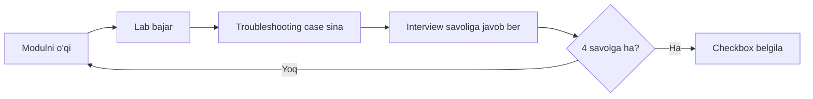

# Bilim checklisti (Coverage Checklist)

Bu checklist kursning 12 moduli bo'yicha "bilishim kerak" bandlarini yig'adi. Har bandni belgilashdan oldin o'zingga savol ber:

```text
1. Tushuntirib bera olamanmi?
2. Cisco command yoki kod bilan sozlay olamanmi?
3. show/debug/log bilan tekshira olamanmi?
4. Oddiy troubleshooting scenario ni yecha olamanmi?
```

Faqat checkbox emas — to'rttasiga ham "ha" desang, chinakam o'zlashtirgan bo'lasan.

---

## 00 — Tarmoq asoslari

- [ ] Network nima, nima uchun kerak
- [ ] OSI 7 layer va har birining vazifasi
- [ ] TCP/IP 4 layer modeli
- [ ] OSI vs TCP/IP taqqoslash
- [ ] Encapsulation / decapsulation
- [ ] PDU nomlari (segment, packet, frame, bit)
- [ ] Hub, switch, router farqi
- [ ] Bandwidth, latency, throughput, jitter
- [ ] Packet-switching vs circuit-switching

## 01 — Network Access (L2)

- [ ] VLAN tushunchasi
- [ ] Access port va trunk port
- [ ] 802.1Q tag
- [ ] Native VLAN va allowed VLAN
- [ ] Inter-VLAN routing (router-on-a-stick)
- [ ] Layer 3 switch SVI
- [ ] STP / Rapid PVST+
- [ ] Root bridge, root port, designated port
- [ ] PortFast va BPDU Guard
- [ ] EtherChannel va LACP
- [ ] CDP / LLDP
- [ ] WLAN asoslari
- [ ] MAC address table

## 02 — Network Layer / IP

- [ ] IPv4 address strukturasi (32 bit, octet)
- [ ] Subnet mask va CIDR
- [ ] Network, broadcast, host range
- [ ] Usable host hisobi (`2^n - 2`)
- [ ] Private vs public IP (RFC 1918)
- [ ] Special address (loopback, APIPA, 0.0.0.0)
- [ ] Classful va classless
- [ ] VLSM
- [ ] Longest Prefix Match
- [ ] Gateway, ARP, next-hop
- [ ] IPv4 header, TTL, fragmentation
- [ ] IPv6 addressing
- [ ] SLAAC va NDP
- [ ] ICMP

## 03 — Routing

- [ ] Routing table komponentlari
- [ ] Administrative Distance
- [ ] Metric
- [ ] Connected route
- [ ] Static route
- [ ] Default route
- [ ] Host route va floating static route
- [ ] Single-area OSPFv2
- [ ] OSPF neighbor adjacency (Hello, state machine)
- [ ] OSPF router ID
- [ ] OSPF DR / BDR
- [ ] FHRP (HSRP, VRRP, GLBP)
- [ ] BGP asoslari (AS, eBGP/iBGP, AS_PATH)
- [ ] IPv6 static routing

## 04 — Transport Layer

- [ ] Transport layer nima uchun kerak (process-to-process)
- [ ] Port va socket
- [ ] Multiplexing / demultiplexing
- [ ] TCP vs UDP
- [ ] TCP 3-way handshake
- [ ] TCP connection teardown (FIN, TIME_WAIT)
- [ ] Sequence va acknowledgment number
- [ ] Flow control (window)
- [ ] Congestion control (slow start, Cubic, BBR)
- [ ] TCP half-open va SYN flood
- [ ] Keep-alive

## 05 — Application Layer

- [ ] DNS (recursive/iterative, record turlari)
- [ ] DNS caching va TTL
- [ ] HTTP metodlari va status kodlari
- [ ] HTTP/1.1, HTTP/2, HTTP/3
- [ ] DHCP (DORA)
- [ ] SMTP, IMAP, POP3
- [ ] FTP / TFTP
- [ ] URL / URI / URN

## 06 — API protokollari

- [ ] REST constraints va resource naming
- [ ] HTTP verbs (GET/POST/PUT/PATCH/DELETE) va CRUD
- [ ] JSON syntax
- [ ] HTTPS va TLS handshake
- [ ] gRPC asoslari
- [ ] WebSocket
- [ ] CORS
- [ ] JWT vs session cookie
- [ ] Idempotency

## 07 — IP Services

- [ ] DHCP relay (`ip helper-address`)
- [ ] NAT (SNAT, DNAT)
- [ ] PAT (overload)
- [ ] Static NAT / port forwarding
- [ ] NAT loopback (hairpinning)
- [ ] NTP
- [ ] SNMPv2c / SNMPv3
- [ ] Syslog
- [ ] QoS (classification, marking, queuing, policing, shaping)
- [ ] SSH management
- [ ] TFTP / FTP backup

## 08 — Security

- [ ] Threat, vulnerability, exploit, mitigation
- [ ] Standard va extended ACL
- [ ] ACL placement (in/out, tartib)
- [ ] SSH-only access
- [ ] Password security (`enable secret`)
- [ ] AAA (authentication, authorization, accounting)
- [ ] RADIUS vs TACACS+
- [ ] DHCP snooping
- [ ] Dynamic ARP Inspection
- [ ] Port security
- [ ] Wireless security (WPA2/WPA3)
- [ ] IPsec overview
- [ ] TLS / SSL
- [ ] DDoS turlari va himoya

## 09 — Automation va Programmability

- [ ] Traditional vs controller-based networking
- [ ] Control plane, data plane, management plane
- [ ] Northbound / southbound API
- [ ] Overlay, underlay, fabric
- [ ] REST API va CRUD
- [ ] HTTP verbs
- [ ] JSON syntax
- [ ] Ansible overview
- [ ] Terraform overview
- [ ] Cloud network management
- [ ] AI/ML asoslari (network kontekstida)

## 10 — Go Network Programming

- [ ] Socket asoslari (TCP, UDP)
- [ ] `net` package (Dial, Listen)
- [ ] TCP server / client yozish
- [ ] UDP server / client yozish
- [ ] Goroutine bilan concurrent server
- [ ] Connection pooling (`http.Transport`)
- [ ] Keep-alive sozlash (`SetKeepAlive`)
- [ ] Timeout va context
- [ ] TLS klient/server (`crypto/tls`)
- [ ] Graceful shutdown

## 11 — Amaliyot va Interview

- [ ] 12 ta lab topologiyasini bajarish
- [ ] Layer-by-layer troubleshooting metodologiyasi
- [ ] 17 troubleshooting case ni tahlil qilish
- [ ] Universal diagnostika vositalari (ping, dig, ss, tcpdump)
- [ ] Interview savollariga javob bera olish
- [ ] "URL yozganda nima bo'ladi?" ni to'liq tushuntirish

---

## Qanday ishlatish kerak?



**Tavsiya etilgan tartib:**

1. Har modulni o'qib, tegishli **lab** ni [01-lab-topologies.md](./01-lab-topologies.md) dan bajar.
2. Modulga tegishli **troubleshooting case** ni [02-troubleshooting-cases.md](./02-troubleshooting-cases.md) dan sina.
3. **Interview savollari** ga [03-interview-questions.md](./03-interview-questions.md) dan javob ber.
4. To'rttala savolga "ha" desang — checkbox ni belgila.

> **Feynman testi:** Har modul oxirida uni do'stingga (yoki o'zingga) **kod/command so'zlarisiz** 3 jumlada tushuntirib ber. Tushuntira olsang — o'zlashtirgansan.
