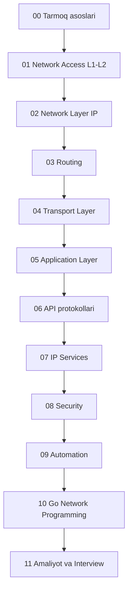

# Network — to'liq kurs

Kompyuter tarmoqlari bo'yicha yaxlit o'quv kursi: fizik qatlamdan Go bilan tarmoq dasturlashgacha. Kurs **o'rganish tartibida** joylashtirilgan — modullar 00 dan 11 gacha ketma-ket o'qiladi, har modul avvalgisiga tayanadi.

Har bir dars bir xil formatda: muammo/hook → analogiya → sodda ta'rif → Mermaid diagramma → worked example → **Xulosa** → **🧠 Eslab qol** → **✅ O'z-o'zini tekshir** → **🛠 Amaliyot** → **🔁 Takrorlash** → **📚 Manbalar**. Materiallar eski konspektlar (Kurose, CCNA, deep-dive'lar) va 2025-2026 web manbalari aralashmasidan tuzilgan.

## Kurs xaritasi

## Modullar

### [00 — Tarmoq asoslari](00-tarmoq-asoslari/README.md)
Internet nima, protokol nima, access networks, packet switching, ISP ierarxiyasi, latency/loss/throughput, OSI va TCP/IP modellari, glossary. *9 dars.*

### [01 — Network Access (L1-L2)](01-network-access/README.md)
Physical layer, Ethernet/MAC, VLAN, trunk 802.1Q, inter-VLAN routing, STP, EtherChannel, CDP/LLDP, wireless WLAN. *9 dars.*

### [02 — Network Layer (IP)](02-network-layer-ip/README.md)
IPv4 header/TTL/fragmentation, IP addressing, subnetting/CIDR/VLSM, network/broadcast/host range, address turlari, ARP va gateway, NAT, IPv6 addressing/NDP. *8 dars.*

### [03 — Routing](03-routing/README.md)
Routing table va longest prefix match, static routing, routing protokollari (RIP/EIGRP/OSPF/BGP), OSPF, BGP, ICMP/ping/traceroute, FHRP, IPv6 routing. *8 dars.*

### [04 — Transport Layer](04-transport-layer/README.md)
Transport layer vazifasi, multiplexing/demultiplexing, UDP, TCP, handshake/TIME_WAIT/SYN flood, flow va congestion control (CUBIC/BBR). *6 dars.*

### [05 — Application Layer](05-application-layer/README.md)
Socketlar, DNS, HTTP, HTTP evolyutsiyasi (1.0→3/QUIC), HTTPS/TLS, SMTP/email, FTP/SFTP, P2P/BitTorrent, SMPP. *9 dars.*

### [06 — API protokollari](06-api-protokollari/README.md)
REST nima, REST constraints, resource naming, API autentifikatsiya (Basic/JWT/OAuth2), WebSocket, gRPC. *6 dars.*

### [07 — IP Services](07-ip-services/README.md)
DHCP, NTP, SNMP, Syslog, QoS, device management (SSH/TFTP/FTP). *6 dars.*

### [08 — Security](08-security/README.md)
Security tushunchalari va hujumlar, firewall, ACL, device access security, AAA (RADIUS/TACACS+), L2 security, wireless security, VPN/IPsec. *8 dars.*

### [09 — Automation](09-automation/README.md)
SDN va controller-based networking, REST API bilan network automation, JSON/YAML, Ansible/Terraform, AI va cloud network management. *5 dars.*

### [10 — Go Network Programming](10-go-network-programming/README.md)
net package, TCP/UDP client-server, production HTTP server/client, WebSocket chat (hub pattern), gRPC (streaming, interceptor, gateway), load balancer yasash. *7 dars — kursning amaliy cho'qqisi.*

### [11 — Amaliyot va Interview](11-amaliyot-interview/README.md)
Lab topologiyalar (Packet Tracer/GNS3), troubleshooting case'lar (17 ta), interview savollari (56 ta, javoblar bilan), bilim checklist. *4 fayl.*

## Qanday o'qish kerak

1. **Ketma-ket yur** — har modul avvalgisiga tayanadi. Backend dasturchi bo'lsang va vaqt kam bo'lsa, minimal yo'l: 00 → 02 → 04 → 05 → 06 → 10.
2. **Har dars oxiridagi "O'z-o'zini tekshir"** savollariga javob bermasdan keyingi darsga o'tma.
3. **Modul tugagach** — [11-amaliyot-interview/04-coverage-checklist.md](11-amaliyot-interview/04-coverage-checklist.md) dagi tegishli bandlarni belgila.
4. **Takrorlash jadvali** — har dars oxiridagi 🔁 bo'limga amal qil: ertaga → 3 kun → 1 hafta.
5. **Lab'lar** — 01, 02, 03, 07, 08 modullardan keyin [lab topologiyalarni](11-amaliyot-interview/01-lab-topologies.md) Packet Tracer'da qil.
