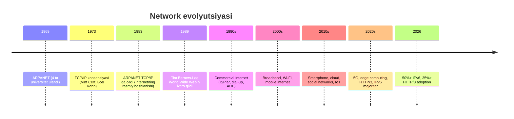
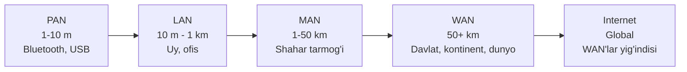
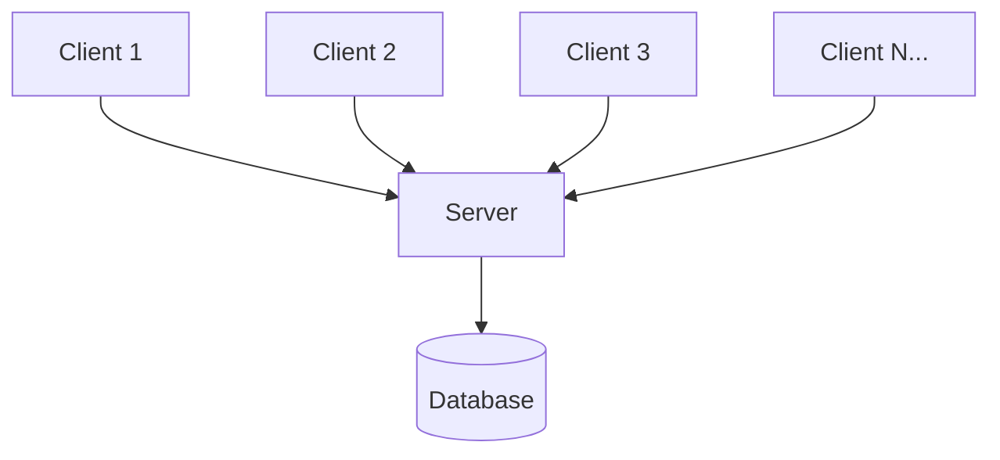
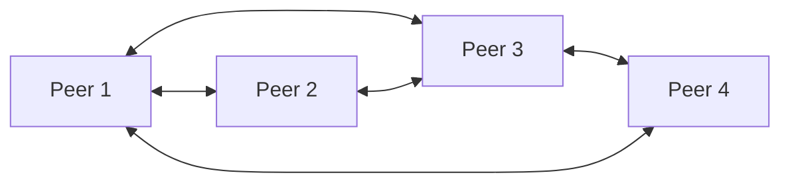
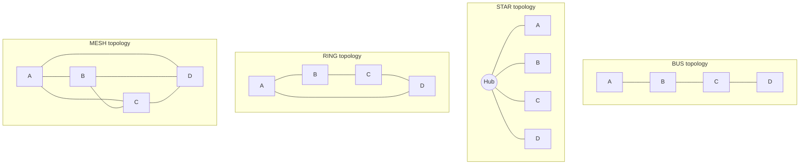
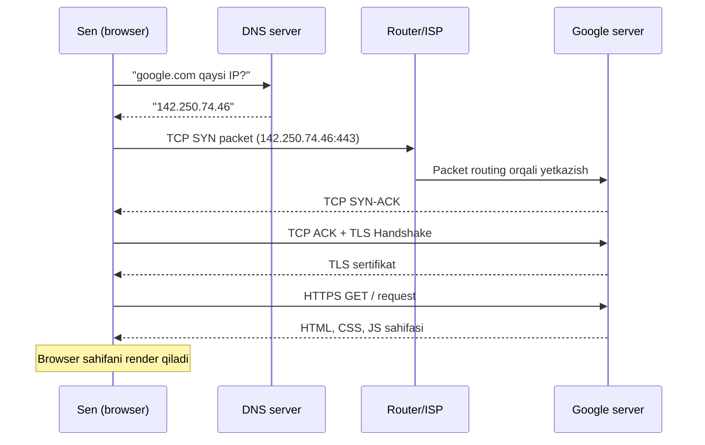
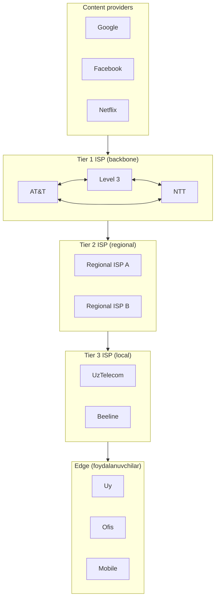
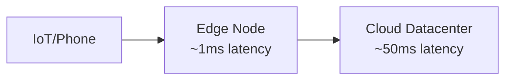

# Network nima? — Asosiy tushunchalar va tarix

> "Internet — bu, ehtimol, insoniyat tomonidan yaratilgan eng katta muhandislik tizimi."
> — Kurose & Ross, *Computer Networking: A Top-Down Approach*, 6-nashr

## 1. Qisqacha (TL;DR)

**Network** — bu bir-biri bilan ma'lumot almashish uchun ulangan qurilmalar (computer, smartphone, server, sensor, hatto kir yuvish mashinasi) majmuasi. **Internet** — bu networklarning network'i, ya'ni dunyo bo'ylab millionlab kichik network'lar bir-biri bilan birlashib hosil qilgan ulkan tizim. Network ishlashi uchun qurilmalar **protocol** (qoidalar to'plami) bo'yicha kelishilgan tilda gaplashishlari kerak.

---

## 2. Network qanday paydo bo'ldi? — Qisqa tarix

Network tarixi taxminan 60 yillik yo'lni bosib o'tgan. Quyidagi vaqt chizig'i muhim bosqichlarni ko'rsatadi:



### 2.1 ARPANET — bobosi (1969)

1969-yilda AQSh Mudofaa vazirligining **ARPA** (Advanced Research Projects Agency) loyihasi doirasida birinchi packet-switched network yaratildi. UCLA, Stanford, UC Santa Barbara va Utah universitetlari bir-biriga ulandi. Birinchi yuborilgan xabar "LOGIN" so'zi edi — lekin "LO" yuborilgandan keyin tizim crash bo'lgan. Shu "LO" — Internetning birinchi xabarlari edi.

### 2.2 TCP/IP tug'ilishi (1973-1983)

Vint Cerf va Bob Kahn turli tarmoqlarni bir-biriga ulash uchun **TCP/IP** stack'ini ishlab chiqishdi. 1983-yil 1-yanvar — barcha ARPANET hostlari NCP'dan TCP/IP'ga o'tdi. Bu sanani Internetning tug'ilgan kuni deb hisoblash mumkin.

### 2.3 World Wide Web (1989-1991)

CERN'da ishlagan Tim Berners-Lee **HTTP**, **HTML** va **URL** kontseptsiyasini ishlab chiqdi. WWW Internet'ni oddiy odamlar uchun ham foydali qildi.

### 2.4 Commercial Internet va bugungi kun

1990-yillarda dial-up modemlar (56 Kbit/s), 2000-yillarda DSL/cable broadband, 2010-yillarda 4G LTE va Wi-Fi kelib, 2020-yillarda **5G**, **edge computing** va **HTTP/3** asosiy oqimga aylandi.

---

## 3. Internet vs Intranet vs Extranet

| Atama | Kim foydalanadi | Misol |
|-------|----------------|-------|
| **Internet** | Hamma (public) | google.com, youtube.com |
| **Intranet** | Faqat tashkilot ichidagi xodimlar | Kompaniya HR portali |
| **Extranet** | Tashkilot + ishonchli sheriklar | B2B partner portal, supplier dashboard |

Texnik jihatdan ularning hammasi bir xil TCP/IP protocoldan foydalanadi — farqi faqat **kirish (access)** darajasida.

---

## 4. Network turlari — masshtab bo'yicha

Network'lar geografik kattalik (radius) bo'yicha tasniflanadi:



### 4.1 PAN (Personal Area Network)

- **Radius:** 1-10 metr
- **Texnologiya:** Bluetooth, NFC, USB, Zigbee
- **Misol:** Telefon va simsiz quloqchin orasidagi ulanish, Apple Watch va iPhone

### 4.2 LAN (Local Area Network)

- **Radius:** 10 metr - 1 km
- **Texnologiya:** Ethernet (IEEE 802.3), Wi-Fi (IEEE 802.11)
- **Misol:** Uydagi router'ga ulangan barcha qurilmalar, ofis tarmog'i, maktab kompyuter sinfi
- **Tezlik:** 1 Gbit/s (gigabit Ethernet) - 10 Gbit/s

### 4.3 MAN (Metropolitan Area Network)

- **Radius:** 1-50 km (bitta shahar)
- **Texnologiya:** Optik tola (fiber), WiMAX
- **Misol:** Toshkent shahar bo'ylab davlat idoralarini bog'lovchi tarmoq, universitet kampusi tarmog'i

### 4.4 WAN (Wide Area Network)

- **Radius:** 50+ km, davlat yoki kontinent
- **Texnologiya:** MPLS, satellite, undersea fiber cable
- **Misol:** Beeline, Ucell, UzTelecom backbone tarmoqlari, Internet o'zi ham WAN'larning birikmasidir

### Vizual taqqoslash

```
[Bluetooth quloqchin] ---PAN--- [Telefoning]
                                     |
                                    Wi-Fi
                                     |
[Laptop] [Smart TV] ---LAN--- [Uy router]
                                     |
                                    DSL/Fiber
                                     |
                              [ISP coverage]  ---MAN
                                     |
                              [ISP backbone]  ---WAN
                                     |
                                  Internet
```

---

## 5. Arxitektura: Client-Server vs P2P

Network'larda ma'lumot almashishning ikkita asosiy modeli mavjud:

### 5.1 Client-Server



- **Client** — xizmat **so'raydigan** taraf (browser, mobile app)
- **Server** — xizmat **beradigan** taraf (web server, API, database)
- **Misol:** youtube.com'dan video tomosha qilish, Telegram dan xabar yuborish

### 5.2 Peer-to-Peer (P2P)



- Har bir node ham client, ham server vazifasini bajaradi
- **Misol:** BitTorrent, Bitcoin, eski Skype, IPFS

| Xususiyat | Client-Server | P2P |
|-----------|---------------|-----|
| Boshqaruv | Markazlashgan | Decentralized |
| Reliability | Server crash bo'lsa, hammasi to'xtaydi | Bitta peer crash bo'lsa, boshqalari ishlaydi |
| Misol | google.com, Facebook | BitTorrent, Bitcoin |

---

## 6. Network topologiyalari

**Topology** — bu qurilmalar fizik yoki mantiqiy jihatdan qanday joylashganligi.



| Topology | Plus | Minus | Qaerda |
|----------|------|-------|--------|
| **Bus** | Arzon, sodda | Bitta cable uzilsa, hammasi to'xtaydi | Eski Ethernet (10BASE2) |
| **Star** | Hub o'lmasa, har bir ulanish mustaqil | Hub failure = hamma o'ladi | Zamonaviy LAN (switch markazi) |
| **Ring** | Predictable performance | Bitta uzilish — hammasi buziladi | Token Ring, FDDI (eski) |
| **Mesh** | Maksimal reliability | Juda qimmat (N*(N-1)/2 cable) | Internet backbone, military |
| **Tree** | Hierarchical, kengaytirilishi oson | Root crash — hammasi o'ladi | Korporativ network |

---

## 7. "Sen google.com ga kirganda nima sodir bo'ladi?" — Yuqori darajadagi tushuntirish

Bu savol — Internetni tushunishning eng yaxshi yo'li. Quyida juda yuqori darajadan tushuntirib o'taman, har bir layer fayllarida batafsil bo'ladi.



**Bosqichlar:**

1. **DNS lookup** — `google.com` matnini IP address'ga aylantirish (`142.250.74.46`). Bu — internetning telefon kitobi.
2. **TCP three-way handshake** — sening computeringg va Google serveri o'rtasida ishonchli ulanish o'rnatiladi (SYN → SYN-ACK → ACK).
3. **TLS handshake** — HTTPS uchun shifrlangan channel yaratiladi. Sertifikat tekshiriladi.
4. **HTTP request** — `GET / HTTP/2` so'rovi yuboriladi.
5. **HTTP response** — Google HTML, CSS, JS, rasmlarni qaytaradi.
6. **Render** — Browser sahifani chizadi.

Bu jarayon odatda **100-500 millisekund** ichida sodir bo'ladi. Har birida nima bo'layotganini bilish uchun [TCP/IP layer fayllari](../tcp-ip/)ni o'qib chiq.

---

## 8. Internet topologiyasi — qanday qurilgan

Internet — bu networklarning network'i. U **iyerarxik tuzilishga** ega:



- **Tier 1** — Hech kimga to'lamaydi, butun Internetga to'g'ridan-to'g'ri ulangan (peering). Misol: AT&T, NTT, Level 3.
- **Tier 2** — Tier 1'dan traffic sotib oladi, lekin ba'zi peering aloqalari ham bor.
- **Tier 3** — Faqat Tier 2'dan traffic sotib oladi (oxirgi mile ISP).
- **Edge** — Sen, men, oxirgi foydalanuvchilar.
- **Content providers** (Google, Netflix) — odatda Tier 1 bilan to'g'ridan-to'g'ri peering qiladi (CDN orqali).

---

## 9. Kelajak: SDN, IoT, 5G, Edge Computing

### 9.1 SDN (Software-Defined Networking)

An'anaviy network'da har bir router o'z routing jadvalini saqlaydi. **SDN** esa control plane (qaror qabul qilish) va data plane (packet uzatish) ni ajratadi. Routerlar — "soqov" qurilmalar, markaziy controller esa ularni dasturiy yo'l bilan boshqaradi.

**Misol:** Google'ning B4 backbone tarmog'i, OpenFlow protocol.

### 9.2 IoT (Internet of Things)

Hammasi internetga ulanadi: kir yuvish mashinasi, lampa, soat, eshik qulfi. 2026-yilda dunyo bo'ylab 30+ milliard IoT qurilma mavjud. Bu yangi muammolarni keltirib chiqaradi: xavfsizlik, IPv6'ga ehtiyoj (IPv4 endi yetishmaydi), past energiya iste'mol qiladigan protokollar (MQTT, CoAP, LoRaWAN).

### 9.3 5G

5G — bu shunchaki tezroq mobile internet emas. Asosiy farqlari:

- **Tezlik:** 10+ Gbit/s peak
- **Latency:** 1 ms (4G da ~50 ms)
- **Density:** km² ga 1 million qurilma
- **Network slicing:** bitta fizik tarmoq ichida virtual tarmoqlar

### 9.4 Edge Computing

An'anaviy cloud (AWS) — markazlashgan, foydalanuvchidan ming kilometr uzoqda. **Edge computing** — hisob-kitobni foydalanuvchiga **yaqinlashtirish** (5G base station, ISP POP, hatto telefoning o'zida).



**Misollar:** AR/VR, autonomous cars, real-time AI inference, remote surgery. NVIDIA va T-Mobile 2026-yilda **AI-RAN** (5G base stationlar AI workload bajarishi) demolarini ko'rsatishdi.

---

## 10. Yodda saqlash kerak bo'lgan asosiy fikrlar

- **Network** = ulangan qurilmalar majmuasi, **Internet** = networklarning network'i
- ARPANET (1969) → TCP/IP (1983) → WWW (1989) → mobile/cloud → 5G/edge (bugungi)
- Network turlari masshtab bo'yicha: **PAN < LAN < MAN < WAN < Internet**
- Ikki asosiy arxitektura: **Client-Server** (markazlashgan) va **P2P** (decentralized)
- 5 ta asosiy topology: **bus, star, ring, mesh, tree** — zamonaviy LAN'lar asosan **star** topologyda
- Internet **iyerarxik**: Tier 1 → Tier 2 → Tier 3 → edge
- Kelajak: **SDN, IoT, 5G, edge computing, IPv6, HTTP/3**

---

## 11. Cross-references

- Layer modellar haqida batafsil: [./osi-vs-tcpip.md](./osi-vs-tcpip.md)
- Atamalar lug'ati: [./glossary.md](./glossary.md)
- Physical layer (fizik kabel/signal): [../osi/01-physical.md](../osi/01-physical.md)
- Network layer (IP, routing): [../osi/03-network.md](../osi/03-network.md)
- Transport layer (TCP, UDP): [../osi/04-transport.md](../osi/04-transport.md)
- Application layer (HTTP, DNS): [../osi/07-application.md](../osi/07-application.md)
- DNS deep-dive: [../deep-dives/dns-resolution.md](../deep-dives/dns-resolution.md)

---

## 12. Manbalar

- **Kitob:** Kurose & Ross, *Computer Networking: A Top-Down Approach*, 6-nashr, Bob 1, sahifa 23-50
- **RFC 1122** — [Requirements for Internet Hosts](https://datatracker.ietf.org/doc/html/rfc1122)
- **RFC 791** — [Internet Protocol (IP)](https://datatracker.ietf.org/doc/html/rfc791)
- **Tarix:** [Brief History of the Internet — Internet Society](https://www.internetsociety.org/internet/history-internet/brief-history-internet/)
- **HTTP/3 adoption (2026):** [HTTP/3 Is at 35% Adoption — DEV Community](https://dev.to/linou518/http3-is-at-35-adoption-you-cant-call-quic-a-future-technology-anymore-2ghm)
- **IPv6 deployment (2026):** [18 Years Later, IPv6 Reaches Majority — Internet Society Pulse](https://pulse.internetsociety.org/en/blog/2026/04/18-years-later-ipv6-reaches-majority/)
- **5G + Edge:** [NVIDIA and T-Mobile push AI-RAN — Edge Infrastructure Review](https://www.edgeir.com/nvidia-and-t-mobile-push-ai-ran-to-turn-5g-networks-into-distributed-edge-compute-platforms-20260407)
- **Edge computing:** [Edge Computing 2026 Complete Guide — Calmops](https://calmops.com/emerging-technology/edge-computing-complete-guide-2026/)
