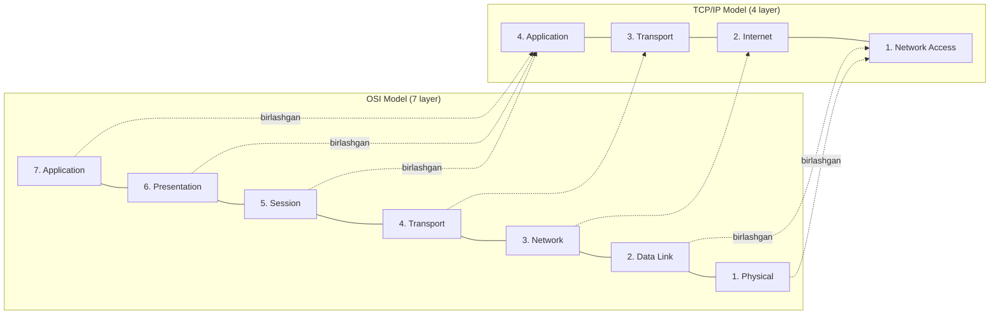
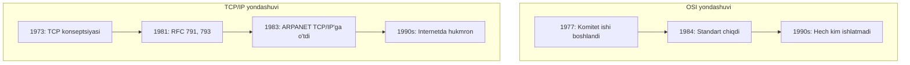
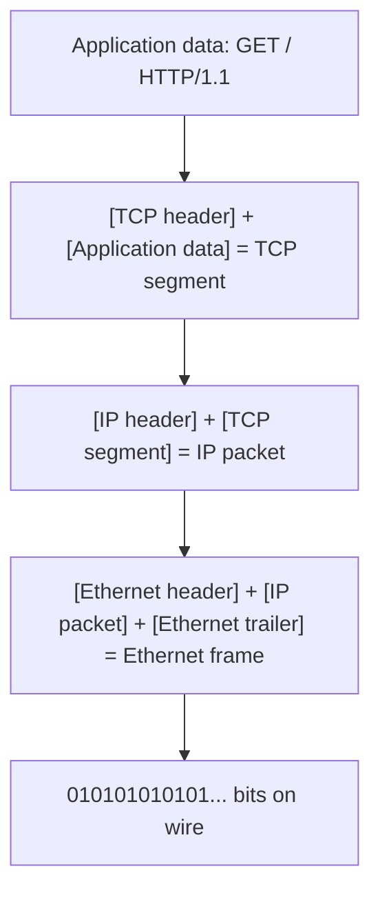
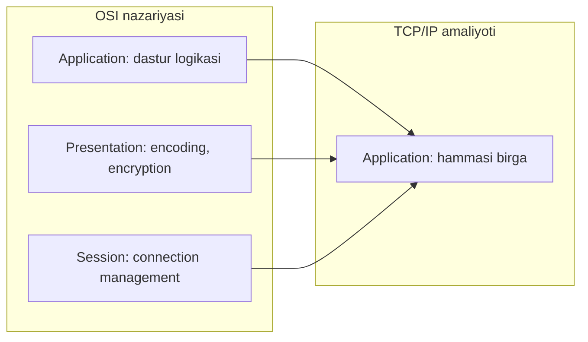

# OSI vs TCP/IP — Ikki modelni taqqoslash

> "OSI model — bu darslik uchun, TCP/IP — amaliyot uchun."
> — Network engineer'lar orasidagi mashhur gap

## 1. Qisqacha (TL;DR)

Network'ni tushunish uchun ikki konseptual model mavjud:

- **OSI (Open Systems Interconnection)** — 7 layerli, 1984-yilda ISO tomonidan ishlab chiqilgan akademik (nazariy) model
- **TCP/IP** — 4 (yoki 5) layerli, 1980-yillarda IETF tomonidan amalda ishlatilgan model

**TCP/IP yutdi** — chunki u oldin ishlaydigan kod chiqardi, OSI esa qog'ozda qoldi. Lekin OSI haligacha **konseptual asbob** sifatida ishlatiladi: muhandislar "Layer 7 muammosi" yoki "Layer 4 load balancer" degan iboralarni o'sha modeldan oladi.

---

## 2. Yonma-yon taqqoslash



### Jadval ko'rinishida

| OSI Layer | TCP/IP Layer | PDU | Misol protokollar | Qurilma |
|-----------|--------------|-----|-------------------|---------|
| 7. Application | Application | Message/Data | HTTP, FTP, SMTP, DNS, SSH | — |
| 6. Presentation | Application | Message/Data | TLS, SSL, JPEG, ASCII, UTF-8 | — |
| 5. Session | Application | Message/Data | NetBIOS, RPC, sockets | — |
| 4. Transport | Transport | Segment (TCP) / Datagram (UDP) | TCP, UDP, QUIC, SCTP | Load balancer (L4) |
| 3. Network | Internet | Packet | IP, ICMP, ARP, OSPF, BGP | Router |
| 2. Data Link | Network Access (Link) | Frame | Ethernet, Wi-Fi, PPP | Switch, bridge |
| 1. Physical | Network Access (Link) | Bit | Cable, fiber, radio waves | Hub, repeater, NIC |

---

## 3. Tarix — qanday paydo bo'ldi?

### 3.1 OSI tarixi (1977-1984)

**ISO** (International Organization for Standardization) 1977-yilda turli ishlab chiqaruvchilarning network'lari bir-biri bilan gaplashishi uchun **universal standart** kerakligini his qildi (o'sha paytda IBM SNA, DECnet, XNS, AppleTalk kabi turli stack'lar mavjud edi).

8 yil davomida komitet ishladi va **1984-yilda** OSI model rasmiy chiqdi. Bu — **top-down** (yuqoridan pastga) yondashuv: avval to'liq spetsifikatsiya yozildi, keyin amalga oshirilishi kerak edi.

**Muammo:** Spetsifikatsiya ulkan, murakkab va qog'ozdagi standartlar amaliy kodga aylantirilishi sekin kechdi.

### 3.2 TCP/IP tarixi (1973-1983)

Vint Cerf va Bob Kahn 1973-yilda TCP konseptsiyasini taqdim etdi. **IETF** (Internet Engineering Task Force) **bottom-up** yondashuvni qo'lladi:

> "We reject kings, presidents, and voting. We believe in rough consensus and running code."
> — David Clark, IETF moto

Ya'ni: **avval ishlaydigan kod yoz, keyin standart**. Bu yondashuv tezroq ishladi. 1983-yilda ARPANET to'liq TCP/IP'ga o'tdi va kengayib ketdi.

### 3.3 Nima uchun TCP/IP yutdi?



**Sabablar:**

1. **Working code first** — TCP/IP allaqachon ishlab turgan tarmoqda mavjud edi
2. **Free va ochiq RFC'lar** — har kim o'qib, amalga oshirishi mumkin edi
3. **Unix bilan integratsiya** — BSD Unix'da bepul TCP/IP stack
4. **Komitet siyosati emas** — IETF rough consensus, ISO esa rasmiy ovoz berish
5. **Soddaroq** — 4 layer 7 dan tushunarliroq

OSI'dan **terminologiya** qoldi (layer 1-7 raqamlari), lekin **stack** sifatida TCP/IP hukmron.

---

## 4. Layerlar nima qiladi?

Quyida har bir layer'ning vazifasi qisqacha. Batafsil layer fayllarida:

### Application (L5-L7 / TCP-IP L4)
- **Vazifa:** Foydalanuvchi ko'radigan dastur protokollari
- **Misol:** Browser HTTP so'rov yuboradi, email client SMTP'dan foydalanadi
- **Protokollar:** HTTP, HTTPS, FTP, SMTP, DNS, SSH, IMAP

### Transport (L4)
- **Vazifa:** End-to-end ulanish, port'lar, ishonchlilik
- **Misol:** TCP — ishonchli, tartibli, slow; UDP — fast, no guarantee
- **Protokollar:** TCP, UDP, QUIC

### Network/Internet (L3 / TCP-IP L2)
- **Vazifa:** Logical addressing (IP), routing
- **Misol:** Sening packet'ing 100 ta router orqali Google'ga yetadi
- **Protokollar:** IP, ICMP, ARP (texnik jihatdan L2/L3 orasida), OSPF, BGP

### Data Link (L2)
- **Vazifa:** Bir hop'dagi (qo'shni qurilma) ulanish, MAC address
- **Misol:** Wi-Fi orqali router bilan gaplashish
- **Protokollar:** Ethernet, Wi-Fi, PPP

### Physical (L1)
- **Vazifa:** Bitlarni elektr signallariga, yorug'lik signallariga, radio to'lqinlarga aylantirish
- **Misol:** Ethernet kabelida volt o'zgarishi, optik tolada lazer impulslari
- **Protokollar:** 10BASE-T, 1000BASE-T, IEEE 802.11 PHY

---

## 5. Encapsulation — eng muhim tushuncha

Sen `GET / HTTP/1.1` yuborganingda, bu HTTP message **bevosita** kabel orqali yuborilmaydi. Har bir layer o'z **header**'ini qo'shadi (encapsulation):



### Vizual sxema (har layer headeri qo'shiladi)

```
         APPLICATION (HTTP)
         +---------------+
         |  HTTP message |
         +---------------+
              |
              v
         TRANSPORT (TCP) — TCP header qo'shiladi
         +-----+---------------+
         | TCP |  HTTP message |  ← TCP segment (PDU = segment)
         +-----+---------------+
              |
              v
         NETWORK (IP) — IP header qo'shiladi
         +----+-----+---------------+
         | IP | TCP |  HTTP message |  ← IP packet (PDU = packet)
         +----+-----+---------------+
              |
              v
         DATA LINK (Ethernet) — Ethernet header + trailer
         +-----+----+-----+---------------+--------+
         | Eth | IP | TCP |  HTTP message | Eth FCS|  ← Frame (PDU = frame)
         +-----+----+-----+---------------+--------+
              |
              v
         PHYSICAL — bits on wire
         010101010101010101010101010101010101...
```

### Decapsulation — qabul qilish

Qabul tarafda bu jarayon **teskari** ravishda boradi: physical → frame → packet → segment → message. Har layer o'z header'ini olib tashlaydi va keyingi layer'ga uzatadi.

---

## 6. Header overhead misoli — necha byte qo'shimcha?

Aytaylik, sen 10 byte'lik xabar yubormoqchisan: `"Hello!"`.

| Layer | Header hajmi | Qo'shilgan |
|-------|-------------|-----------|
| Ethernet | 14 byte header + 4 byte FCS = 18 byte | +18 |
| IPv4 | 20 byte (minimum, options yo'q) | +20 |
| TCP | 20 byte (minimum, options yo'q) | +20 |
| HTTP | ~100-500 byte (headerlar) | +200 (tipik) |
| **Jami overhead** | | **~258 byte** |

Ya'ni 6 byte payload uchun **258 byte qo'shimcha**! TCP keep-alive, HTTP cookies, User-Agent header'lari og'irlikni oshiradi. Shuning uchun mobil tarmoqlarda **HTTP/2** (header compression: HPACK) va **HTTP/3** (QPACK) muhim.

---

## 7. Nima uchun L5/L6/L7 birlashtirilgan?

OSI'da Session, Presentation, Application alohida layerlar. Lekin TCP/IP'da ular birlashgan. Sabab:



**Amaliy sabab:** Real protocollar (HTTP, FTP, DNS) bu funksiyalarni alohida ajratmaydi:

- **HTTP** o'zi session management qiladi (cookies, keep-alive)
- **TLS** o'zi encryption + presentation qiladi (lekin bu transport va application orasida)
- **JSON encoding** — bu application'ning ichida

Shuning uchun real software'da L5/L6/L7 ajratish ortiqcha murakkablik beradi. TCP/IP'da: socket'dan keyin nima qilsang — sening ishing.

---

## 8. Hozirgi developer qaysi modelni o'rganishi kerak?

**Javob: ikkalasini ham, lekin TCP/IP — ko'proq amaliy.**

### TCP/IP nima uchun amaliy
- Real RFC'lar TCP/IP atrofida yoziladi
- Linux `netstat`, `ss`, `tcpdump` — TCP/IP terminologiyasida
- AWS, Cloudflare, nginx — barchasi TCP/IP layer'larida ishlaydi

### OSI nima uchun foydali
- Iborali. "L4 load balancer" (NLB) vs "L7 load balancer" (ALB) tafovutini OSI'siz tushunish qiyin
- Network engineerlar suhbatida L1, L2, L3 qisqartmalari — OSI'dan
- Sertifikatlar (CCNA, Network+) — ikkalasini so'raydi

### Tavsiya
1. OSI 7 layer'ni **yodda saqla** (Please Do Not Throw Sausage Pizza Away — Physical, Data Link, Network, Transport, Session, Presentation, Application)
2. Real ishni TCP/IP terminologiyasida o'rgan (HTTP, TCP, IP, Ethernet)
3. PDU'larni eslab qol: **bit → frame → packet → segment → data**

---

## 9. Real misol — Wireshark capture'da nima ko'rinadi?

Sen `curl https://example.com` ishlatganingda Wireshark quyidagicha ko'rsatadi:

```
Frame 42: 583 bytes on wire (4664 bits)
    ┌─ Layer 1 (Physical) — qancha bit, qaysi interfaceda
    │
Ethernet II, Src: aa:bb:cc:dd:ee:ff, Dst: 11:22:33:44:55:66
    ┌─ Layer 2 (Data Link) — MAC addresslar
    │  Type: IPv4 (0x0800)
    │
Internet Protocol Version 4, Src: 192.168.1.10, Dst: 93.184.216.34
    ┌─ Layer 3 (Network) — IP addresslar
    │  TTL: 64, Protocol: TCP (6)
    │
Transmission Control Protocol, Src Port: 54321, Dst Port: 443
    ┌─ Layer 4 (Transport) — port'lar, sequence number
    │  Sequence Number: 1, Acknowledgment Number: 1
    │  Flags: 0x018 (PSH, ACK)
    │
Transport Layer Security
    ┌─ Layer 5/6 (TLS — Presentation/Session)
    │  TLSv1.3 Application Data
    │
Hypertext Transfer Protocol
    ┌─ Layer 7 (Application)
    │  GET / HTTP/2
    │  Host: example.com
    │  User-Agent: curl/7.81.0
```

Har bir layer o'z header'ini ko'rsatadi. Bu **encapsulation amaliyotda**.

### tcpdump misoli

```bash
$ sudo tcpdump -i any -n 'port 443' -X
12:34:56.789012 IP 192.168.1.10.54321 > 93.184.216.34.443:
    Flags [P.], seq 1:518, ack 1, win 502, length 517
    0x0000:  4500 0229 1234 4000 4006 0000 c0a8 010a  E..).4@.@.......
    0x0010:  5db8 d822 d431 01bb 0000 0001 0000 0001  ]..".1..........
    ...
```

---

## 10. FAQ

**S:** Nima uchun OSI 7 layer va TCP/IP 4 layer?
**J:** OSI nazariy ravishda har bir vazifani alohida layer'ga ajratdi (separation of concerns). TCP/IP esa amaliy: agar ikki layer doim birga ishlasa, ularni birlashtir. Masalan, Session va Presentation Application'ga qo'shildi.

**S:** Hub, switch, router qaysi layerda ishlaydi?
**J:** Hub — L1 (faqat bit'larni nusxalaydi), switch — L2 (MAC address'larni biladi), router — L3 (IP address'larni biladi). Modern "L3 switch" — bu ikkala vazifani bajaradi.

**S:** TLS qaysi layerda?
**J:** Texnik jihatdan TLS L4 (TCP) ustida ishlaydi va L7 (HTTP) ostida — ya'ni OSI'da L5-L6 oraliqda. TCP/IP'da odatda Application layer'ga kiritiladi.

**S:** ARP qaysi layerda?
**J:** Bu — bahsli savol. ARP IP address'ni MAC'ga aylantiradi, ya'ni L2 va L3 orasida ishlaydi. Ba'zi kitoblar L2.5 deb ataydi. RFC'da L2 protokol deb yoziladi.

**S:** WebSockets qaysi layerda?
**J:** Application layer (L7), TCP ustida ishlaydi. HTTP'dan boshlab HTTP Upgrade orqali full-duplex stream'ga aylanadi.

**S:** QUIC qaysi layerda?
**J:** Transport (L4), lekin UDP ustida. QUIC = TCP + TLS + multiplexing'ni UDP ustida amalga oshirgan. HTTP/3 — bu HTTP over QUIC.

---

## 11. Yodda saqlash kerak

- **OSI 7 layer**: Physical, Data Link, Network, Transport, Session, Presentation, Application (yodlash: "Please Do Not Throw Sausage Pizza Away")
- **TCP/IP 4 layer**: Network Access, Internet, Transport, Application
- **PDU** ketma-ketligi: **bit → frame → packet → segment → message/data**
- TCP/IP yutdi sababi: **working code first**, free RFC, soddaroq
- Encapsulation: har layer o'z header'ini qo'shadi
- L5/L6/L7 TCP/IP'da Application'ga birlashgan — chunki amaliyotda ajratish ortiqcha
- **Header overhead** — kichik xabar uchun ham 50+ byte qo'shimcha boradi

---