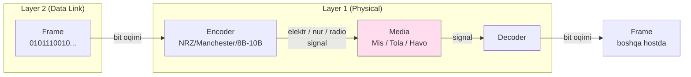
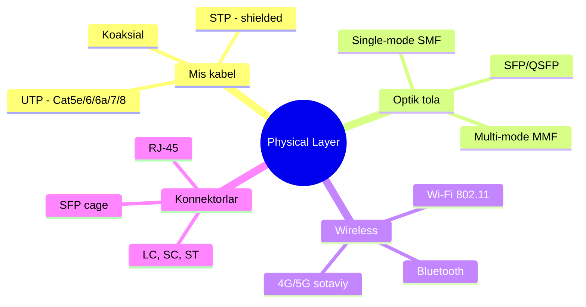

# Layer 1: Physical

## 1. Qisqacha tushuncha (TL;DR)

Physical layer (fizik sath) — bu OSI modelining eng quyi layeri va uning vazifasi **bit larni fizikaviy signalga aylantirib uzatish**. 
Bu yerda 0 va 1 raqamlari
- mis kabel bo'yicha elektr voltaj
- optik kabel bo'yicha lazer nuri
- yoki havo bo'yicha radio to'lqinlarga aylanadi.
 
 Physical layer **logikani bilmaydi** — u faqat signal, frequency, voltage, modulation, encoding bilan ishlaydi. 
 Asosiy uchta uzatish muhiti: 
 - **mis kabel** (Cat5e, Cat6, Cat8)
 - **optik tola** (single-mode, multi-mode)
 - **wireless** (Wi-Fi, 5G, Bluetooth)

## 2. Asosiy vazifalari

- **Bit-to-signal aylantirish:** raqamli bit larni elektromagnit signalga (voltage level, light pulse, radio wave) kodlash.
- **Encoding (kodlash):** Manchester, NRZ, 4B/5B, 8B/10B kabi sxemalar bilan bit oqimini chiziq bo'ylab uzatishga moslab kodlash.
- **Synchronization (sinxronlash):** receiver va sender clock larini moslab, bit chegaralarini aniqlash imkonini berish (preamble shu maqsadda ishlatiladi).
- **Bandwidth ta'minoti:** fizik media qancha Hz frequency band bera oladi va shu orqali necha Mbps/Gbps data uzatilishi mumkin.
- **Connectorlar va interfeyslar:** RJ-45, LC, SC, SFP — kabel va portlarning standartlangan fizik formati.
- **Topology fizik amalga oshirish:** star, bus, ring — kabel layout va elektr signal yo'li.

## 3. Vizual sxema





## 4. Protocol Data Unit (PDU)

Bu layerda data eng kichik birlik — **bit** deb ataladi. Aslida fizik darajada bit ham mavjud emas — faqat signal level (voltaj, nur intensivligi yoki radio amplituda).
Layer 2 dan kelgan frame to'liq bit oqimiga (bit stream) aylantiriladi va kabelga jo'natiladi. Encapsulation tugaydi shu yerda — Physical layer hech qanday header qo'shmaydi (preamble Layer 2 ning bir qismi sanaladi, ba'zi adabiyotlarda L1 deb ko'rsatiladi).

## 5. Asosiy uzatish muhitlari

### 5.1 Mis kabel (Copper)

Eng mashhur — **UTP (Unshielded Twisted Pair)**. Ichida 4 juft buralgan mis sim. Buralish electromagnetic interference (EMI) ni kamaytiradi.

**Twisted Pair kabel kategoriyalari (taqqoslash):**

| Kategoriya | Frequency | Max speed | Distance | Foydalanish |
|------------|-----------|-----------|----------|-------------|
| Cat5e      | 100 MHz   | 1 Gbps    | 100 m    | Eski LAN, ofis |
| Cat6       | 250 MHz   | 1 Gbps (10G — 55m) | 100 m | Standart ofis |
| Cat6a      | 500 MHz   | 10 Gbps   | 100 m    | Server room |
| Cat7       | 600 MHz   | 10 Gbps   | 100 m    | Industrial, shielded |
| Cat8       | 2000 MHz  | 25/40 Gbps| 30 m     | Data center, switch-to-switch |

**Cat8** zamonaviy data center larda switch-to-switch ulanish uchun, faqat 30 metr masofada 40 Gbps beradi. RJ-45 connector bilan, lekin S/FTP shielded.

**Koaksial kabel** — eski Ethernet (10BASE-2, 10BASE-5), kabel TV. Hozir Ethernet uchun ishlatilmaydi.

### 5.2 Optika (Fiber Optic)

Mis o'rniga shisha tola, signal — **lazer yoki LED nuri**. EMI ga befarq, uzun masofa (10+ km), juda yuqori bandwidth.

**Ikki turi:**

| Tur | Yadro diametri | Manba | Distance | Bandwidth | Narx |
|-----|----------------|-------|----------|-----------|------|
| **Multi-mode (MMF)** | 50/62.5 µm | LED, VCSEL | 300m-2km | 10-100 Gbps | Arzon |
| **Single-mode (SMF)** | 8-10 µm    | Lazer | 10-100+ km | 100 Gbps - 1 Tbps | Qimmat |

MMF — bino ichidagi server room, kampus. SMF — ISP, telecom, datacenterlar orasida.

**Transceiver modullari:**
- **SFP** — 1 Gbps
- **SFP+** — 10 Gbps
- **QSFP+** / **QSFP28** — 40/100 Gbps (4 ta lane)
- **QSFP-DD / OSFP** — 400/800 Gbps (datacenter)

**Konnektorlar:**
- **LC** — kichik, eng keng tarqalgan (datacenter)
- **SC** — kvadrat, push-pull
- **ST** — yumaloq bayonet (eski)
- **MPO/MTP** — 12+ tola, parallel optika

### 5.3 Wireless (Radio to'lqinlar)

Signal — havoda elektromagnit to'lqin. Tashqaridan EMI, multi-path fading, signal attenuation kuchli ta'sir qiladi.

**Wi-Fi standartlari taqqoslash:**

| Nom | IEEE | Yili | Frequency | Max speed | Channel width |
|-----|------|------|-----------|-----------|---------------|
| Wi-Fi 1 | 802.11b | 1999 | 2.4 GHz | 11 Mbps | 22 MHz |
| Wi-Fi 2 | 802.11a/g | 1999/2003 | 5 / 2.4 GHz | 54 Mbps | 20 MHz |
| Wi-Fi 4 | 802.11n | 2009 | 2.4 / 5 GHz | 600 Mbps | 40 MHz |
| Wi-Fi 5 | 802.11ac | 2014 | 5 GHz | 6.9 Gbps | 80/160 MHz |
| Wi-Fi 6 | 802.11ax | 2019 | 2.4 / 5 GHz | 9.6 Gbps | 160 MHz |
| Wi-Fi 6E | 802.11ax | 2021 | + 6 GHz | 9.6 Gbps | 160 MHz |
| **Wi-Fi 7** | **802.11be** | **2024** | **2.4/5/6 GHz** | **46 Gbps** | **320 MHz** |

**Wi-Fi 7 (2024-2026) zamonaviy holati:**
- Final standart 2025-iyul da chop etildi.
- Max teoretik tezlik — 46 Gbps (bitta band da 23 Gbps).
- 320 MHz channel + 4096-QAM modulation.
- **MLO (Multi-Link Operation)** — bir vaqtda 2.4, 5 va 6 GHz ni ishlatish.
- Real qurilmalar: iPhone 16 Pro, Galaxy S25, Intel Core Ultra laptoplar.

**Sotaviy aloqa (Cellular):**
- **4G LTE** — 100 Mbps - 1 Gbps
- **5G** — 1-10 Gbps, mmWave da 20 Gbps gacha, past latency (1 ms)

**Bluetooth** — qisqa masofa (10 m), past quvvat. Bluetooth 5.x — 2 Mbps, IoT uchun.

## 6. Encoding va modulation

Bit oqimini fizik signalga aylantirish texnikalari:

- **NRZ (Non-Return-to-Zero):** 1 = high voltage, 0 = low voltage. Sodda, lekin clock recovery qiyin.
- **Manchester encoding:** har bitda transition bor (1 = high→low, 0 = low→high). 10BASE-T da ishlatilgan. Self-clocking.
- **4B/5B:** har 4 data bit ni 5 bit ga kodlaydi (Fast Ethernet 100BASE-TX). Long run of zeros ni oldini oladi.
- **8B/10B:** Gigabit Ethernet, fiber channel, USB 3 da ishlatiladi. DC balance va clock recovery uchun.
- **64B/66B:** 10G Ethernet — kam overhead.
- **PAM4 (Pulse Amplitude Modulation):** 4 ta voltage level, har symbol 2 bit kodlaydi. 25/50/100/400G Ethernet da.

Wireless da modulation: **BPSK, QPSK, 16-QAM, 64-QAM, 256-QAM, 1024-QAM, 4096-QAM** (Wi-Fi 7 da). Yuqoriroq QAM = ko'proq bit har symbolda, lekin SNR yuqori bo'lishi shart.

## 7. Real hayot misoli

Sen `google.com` ga kirganda, brauzer Layer 7 → 6 → 5 → 4 → 3 → 2 ga tushib, frame yasaladi. Endi bu frame bit oqimiga aylantirilib, sening laptopdagi NIC tomonidan kabel/havoga jo'natiladi:

1. Agar sen **Wi-Fi** orqali ulanseng: NIC bit larni 5 GHz frequency dagi radio to'lqinga modulyatsiya qiladi (256-QAM, OFDM). Antenna nurlatadi. Router antennasi qabul qilib, demodulate qilib, frame ni tiklaydi.
2. Agar **Ethernet** kabel bilan: NIC bit larni Cat6 ichidagi 4 ta twisted pair bo'yicha 4 ta differential signalga aylantiradi (1000BASE-T, PAM5 modulation). Switch portga keladi.
3. Switch dan keyin signal **fiber** ga o'tadi (uplink). Optical transceiver (SFP+) bit larni 850 nm yoki 1310 nm to'lqindagi lazer nuriga aylantiradi.
4. ISP routeri bilan **dark fiber** orqali ulanish. Yuzlab kilometrga single-mode tola orqali 100 Gbps signal yuriladi (DWDM bir tola ustidan 80+ wavelength bilan ko'paytiriladi).

Har bosqichda fizik media o'zgaradi, lekin bit lar bir xil bo'lib qoladi.

## 8. Tez-tez beriladigan savollar (FAQ)

**S:** Bandwidth va throughput farqi nima?
**J:** Bandwidth — channel **maksimal sig'imi** (masalan 1 Gbps). Throughput — **haqiqatda erishilgan tezlik** (masalan 850 Mbps). Bandwidth nazariy, throughput amaliy.

**S:** Latency va jitter?
**J:** Latency — packet borib-kelish vaqti (RTT). Jitter — latency ning **o'zgaruvchanligi** (variance). VoIP va gaming da jitter — eng katta dushman.

**S:** Full-duplex va half-duplex farqi?
**J:** Full-duplex — bir vaqtda send va receive (modern Ethernet, telefon). Half-duplex — birin-ketin (walkie-talkie, eski hub-based Ethernet). Wi-Fi yarim-duplex.

**S:** Auto-negotiation nima?
**J:** Ethernet portlar ulanganda speed va duplex ni avtomatik tanlash mexanizmi (IEEE 802.3 auto-neg). Eski qurilmalarda manual sozlash kerak bo'lgan, hozir 99% avtomatik.

**S:** SNR qanday o'lchanadi?
**J:** Signal-to-Noise Ratio — signal kuchining shovqinga nisbati. Decibel (dB) da: `SNR = 10 log10(Psignal / Pnoise)`. SNR > 20 dB — yaxshi, < 10 dB — yomon. Wi-Fi da 25+ dB tavsiya etiladi.

**S:** Attenuation nima?
**J:** Signal masofa bo'yicha **zaiflashishi**. Mis da: 100 m dan keyin 1G signal sezilarli zaiflashadi. Fiber da: dB/km bilan o'lchanadi (SMF da ~0.3 dB/km, MMF da ~3 dB/km).

**S:** Cat6 va Cat6a qaysi biri kerak?
**J:** Agar 10 Gbps kerak bo'lsa va 100 m gacha — Cat6a. Faqat 1 Gbps va < 55 m bo'lsa — Cat6 yetarli. Cat8 — faqat datacenter.

## 9. Troubleshooting

```bash
# 1. Link va speed/duplex
ethtool eth0
# Speed: 1000Mb/s
# Duplex: Full
# Auto-negotiation: on
# Link detected: yes

# 2. NIC statistikasi
ethtool -S eth0 | grep -i error
# rx_errors, tx_errors, rx_crc_errors, rx_frame_errors

# 3. Kabel test (qoll esh kerak: ethtool -t)
sudo ethtool -t eth0 offline

# 4. Wi-Fi info
iw dev wlan0 link
iw dev wlan0 station dump
# signal: -55 dBm  (yaxshi: -30...-67, yomon: < -80)
# tx bitrate: 866.7 MBit/s

# 5. Wi-Fi scan — qo'shni tarmoqlar
sudo iw dev wlan0 scan | grep -E "SSID|signal|freq"

# 6. dmesg da link events
dmesg | grep -E "eth0|wlan0|Link"
# eth0: Link is Up - 1Gbps/Full
```

**Typical muammolar:**

| Muammo | Belgi | Yechim |
|--------|-------|--------|
| Cable noisy / damaged | rx_crc_errors o'sib bormoqda | Kabelni almashtirish |
| Speed downgraded | 1G port lekin 100M ko'rsatadi | Auto-neg, kabel sifati (Cat5 emas, Cat5e+) |
| Link flapping | dmesg "Link Up/Down" har necha soniyada | Kabel, port, NIC nuqsoni |
| Wi-Fi weak signal | -75 dBm dan past | Antenna, masofa, devor, channel |
| Wi-Fi interference | jitter, drop | 2.4 GHz dan 5/6 GHz ga o'tish, channel o'zgartirish |
| Fiber dirty | optical loss > spec | Cleaning kit bilan tozalash, OTDR test |
| SFP not detected | `ethtool` da `Cannot get module info` | SFP vendor-locked, transceiver almashtirish |


Savollar

1. 