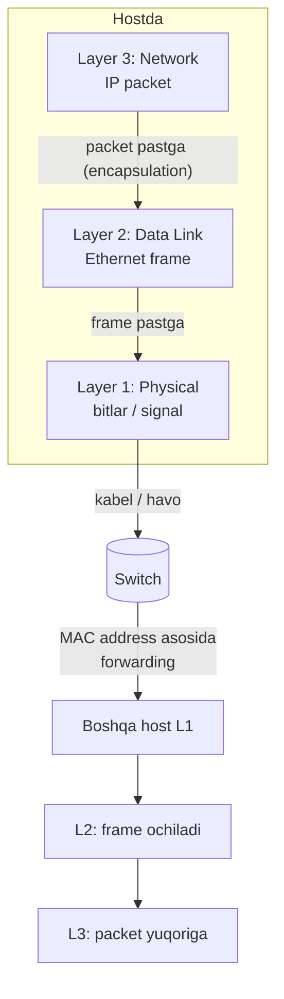
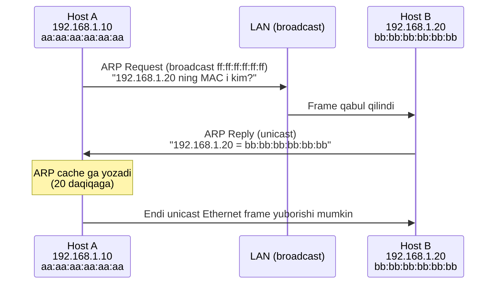
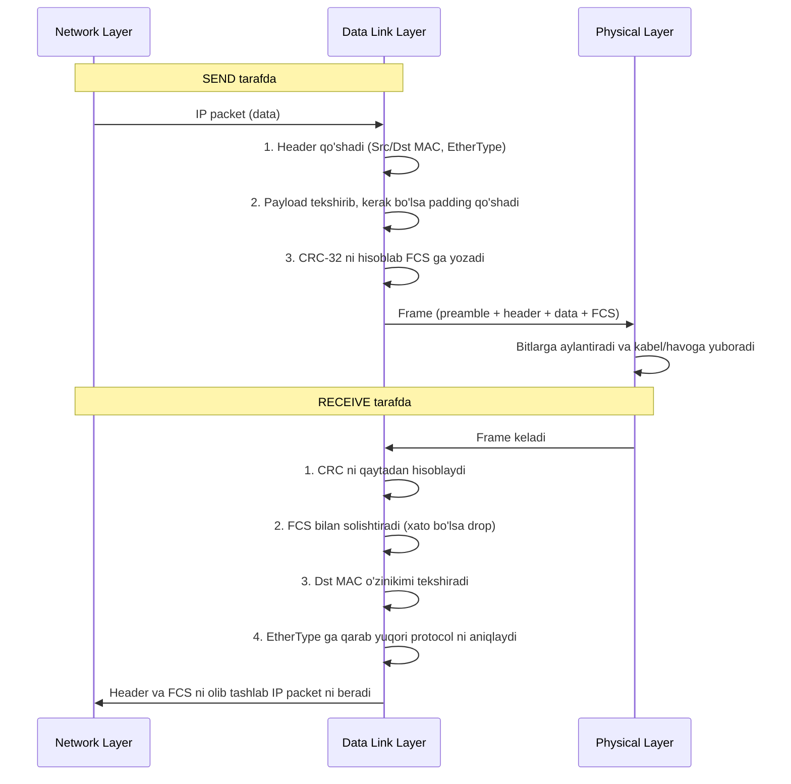

# Layer 2: Data Link

## 1. Qisqacha tushuncha (TL;DR)

Data Link layer (kanal sathi) — bu OSI modelining 2-layeri bo'lib, uning asosiy vazifasi **bitta network segment ichida** (ya'ni bitta LAN yoki bitta point-to-point liniyada) frame larni uzatishdir. Bu layer Network layer dan kelgan packet larni **frame** ga inkapsulyatsiya qiladi, **MAC address** orqali nodes (qurilmalar) ni manzillaydi va kabel bo'yicha bit larni jo'natishni boshqaradi. Eng mashhur protocol — **Ethernet** (IEEE 802.3) va **Wi-Fi** (IEEE 802.11). Switch — bu Layer 2 qurilmasi, u MAC address asosida frame larni forwarding qiladi.

## 2. Asosiy vazifalari

- **Framing:** Network layer dan kelgan packet ga header va FCS (Frame Check Sequence) qo'shib frame yasash. Frame boshlanishi va tugashini aniqlash uchun preamble va delimiter ishlatadi.
- **MAC addressing:** Har bir network interface (NIC) ning unikal 48-bitli MAC address ga ega bo'lishi. Source va destination MAC frame ichida yoziladi.
- **Media Access Control (MAC):** Bitta umumiy channel (broadcast medium) ni bir nechta nodes qanday ulashishini boshqarish — CSMA/CD (klassik Ethernet), CSMA/CA (Wi-Fi).
- **Error detection (xatolarni topish):** Frame ichida bit xatolari yuzaga kelganda, ularni topish uchun **CRC** (Cyclic Redundancy Check) hisoblanadi va FCS field ga yoziladi.
- **Switching va forwarding:** Switch frame ni faqat kerakli portga yo'naltirish uchun MAC address table (CAM table) ni ishlatadi.
- **Logical link control:** Yuqori layer protokollarini (IP, IPv6, ARP) farqlash — Ethernet da bu **EtherType** field orqali amalga oshiriladi.

## 3. Vizual sxema



## 4. Protocol Data Unit (PDU)

Bu layerda data **frame** deb ataladi (kadr, freym). 
- Ethernet frame
- Wi-Fi frame
- PPP frame

bularning hammasi frame. Frame nima uchun shunday nomlangan? Chunki u **boshlanish va tugash chegarasi** aniq belgilangan, "kadr" (rasm kadri kabi) ma'lumot bo'lagi. Encapsulation jarayonida Network layer dan kelgan IP packet (datagram) Ethernet header (14 byte) bilan oldindan va FCS (4 byte) bilan ortdan o'rab olinadi. Wi-Fi da bu 802.11 frame deb ataladi va header sezilarli darajada katta bo'ladi (24+ byte).

## 5. Asosiy protokollar

### 5.1 Ethernet (IEEE 802.3)

LAN da hukmron texnologiya. 1970-yillarda Bob Metcalfe tomonidan o'ylab topilgan, hozir 10 Mbps dan 400 Gbps gacha mavjud. Frame format 30+ yildan beri o'zgarmagan.

**Ethernet II frame format (byte-by-byte):**

```
+----------+-----+----------+----------+-----------+--------------+-----+
| Preamble | SFD | Dst MAC  | Src MAC  | EtherType | Payload      | FCS |
|  7 byte  | 1 B | 6 byte   | 6 byte   | 2 byte    | 46-1500 byte | 4 B |
+----------+-----+----------+----------+-----------+--------------+-----+
   <-- L1 sinxronizatsiya -->     <-- L2 header -->    <-- data -->  <-CRC->
```

- **Preamble (7 byte):** `10101010` takrorlanuvchi bit lar — receiver clock ni sinxronlash uchun.
- **SFD (Start Frame Delimiter, 1 byte):** `10101011` — frame boshlandi degan signal.
- **Destination MAC (6 byte):** qabul qiluvchi NIC ning MAC address.
- **Source MAC (6 byte):** jo'natuvchi NIC ning MAC address.
- **EtherType (2 byte):** payload qaysi protocol ekanligini aytadi: `0x0800` = IPv4, `0x86DD` = IPv6, `0x0806` = ARP, `0x8100` = 802.1Q VLAN.
- **Payload (46-1500 byte):** IP datagram. MTU = 1500 byte. Agar 46 byte dan kichik bo'lsa, padding (to'ldirgich) qo'shiladi.
- **FCS (4 byte):** CRC-32 checksum — frame buzilganmi yo'qligini tekshirish uchun.

**Real misol (`tcpdump -e -i any`):**
```
14:23:01.123 aa:bb:cc:11:22:33 > dd:ee:ff:44:55:66, ethertype IPv4 (0x0800),
length 98: 192.168.1.10 > 192.168.1.20: ICMP echo request
```

### 5.2 MAC Address

MAC (Media Access Control) address — 48 bit (6 byte), odatda hex formatda: `aa:bb:cc:dd:ee:ff`. NIC zavodda yopishtiriladi (BIA — Burned-In Address), lekin software bilan o'zgartirish mumkin.

```
+-----------+-----------+
|  OUI      |  NIC ID   |
| 24 bit    |  24 bit   |
| (vendor)  | (serial)  |
+-----------+-----------+
```

- **OUI (Organizationally Unique Identifier):** birinchi 3 byte — vendor (Intel, Cisco, Apple) ni aniqlaydi.
- **Broadcast MAC:** `ff:ff:ff:ff:ff:ff` — segmentdagi barcha qurilmalarga.
- **Multicast MAC:** birinchi byte ning eng past bit i = 1 (masalan `01:00:5e:...` — IPv4 multicast).

### 5.3 ARP (Address Resolution Protocol) — RFC 826

ARP IP address ni MAC address ga aylantiradi. Bitta LAN ichida ishlaydi. Host packet jo'natmoqchi bo'lsa, lekin destination ning MAC address ini bilmasa, ARP request yuboradi.

**ARP jarayoni:**



**ARP cache ni ko'rish:**
```bash
ip neigh show          # zamonaviy
arp -a                 # eski usul
# 192.168.1.20 dev eth0 lladdr bb:bb:bb:bb:bb:bb REACHABLE
```

**Gratuitous ARP** — host o'zining IP-MAC mapping ini broadcast qiladi (ulanganda yoki IP o'zgarganda). Kollizyon detection va failover uchun ishlatiladi.

**ARP Spoofing (security threat):** zararli host noto'g'ri ARP reply yuborib, gateway ning MAC address i o'rniga o'z MAC address ini "joylab" oladi va MITM (man-in-the-middle) hujum o'tkazadi. Himoya: dynamic ARP inspection (DAI), `arpwatch`.

### 5.4 Wi-Fi (IEEE 802.11) frame

Wi-Fi frame Ethernet dan murakkabroq, chunki wireless muhitda boshqaruv kerak (acknowledgment, multiple access).

```
+----+----+----+--------+--------+--------+------+--------+--------+-----+
|Frm |Dur |Addr| Addr2  | Addr3  | Seq    |Addr4 |Payload | FCS    |     |
|Ctrl|ID  | 1  | (Src)  | (BSSID)| Ctrl   |(opt) |0-2312  | 4 byte |     |
| 2 B|2 B | 6B |  6 B   |  6 B   | 2 byte | 6 B  |  byte  |        |     |
+----+----+----+--------+--------+--------+------+--------+--------+-----+
```

802.11 da **4 ta address field** bor (Ethernet da 2 ta), chunki frame access point orqali o'tishi kerak. Wi-Fi **CSMA/CA** ishlatadi — collision detection emas, **avoidance**, chunki radio da o'zining signalini eshitib bo'lmaydi.

## 6. Encapsulation/Decapsulation jarayoni



## 7. Real hayot misoli

Sen brauzerdan `google.com` ga kirganda, payload Layer 4 (TCP), Layer 3 (IP) dan o'tib L2 ga yetadi. Sening laptopingda IP packet `142.250.180.78` ga ketishi kerak. Lekin bu IP butunlay boshqa networkda — internetda. Shuning uchun:

1. Laptop routing table ga qaraydi: "142.250.180.78 — bu mening LAN imda emas, default gateway ga jo'natay" (`192.168.1.1`).
2. Laptop ARP cache ni tekshiradi: `192.168.1.1` ning MAC i bormi? Yo'q bo'lsa, ARP request broadcast qiladi.
3. Router (`192.168.1.1`) ARP reply qaytaradi: `e8:de:27:aa:bb:cc`.
4. Laptop Ethernet frame yasaydi: **Dst MAC = router MAC**, **Src MAC = laptop MAC**, payload = IP packet (Dst IP = Google).
5. Switch bu frame ni qabul qiladi, MAC table ga qaraydi, router portiga forward qiladi.
6. Router IP packet ni ochadi va keyingi hop ga jo'natadi (yana yangi Ethernet frame, lekin endi Src MAC = router, Dst MAC = ISP gateway).

**Diqqat:** har bir L2 hop da Ethernet frame **qaytadan yasaladi**. IP packet o'zgarmaydi (TTL dan tashqari), lekin MAC address har gal yangilanadi.

## 8. Tez-tez beriladigan savollar (FAQ)

**S:** Switch va Hub farqi nima?
**J:** Hub — bu bitta portdan kelgan signalni hamma boshqa portlarga ko'r-ko'rona uzatuvchi Layer 1 qurilmasi. Switch — Layer 2, u MAC address table tutadi va frame ni faqat to'g'ri portga forward qiladi. Hub bitta katta collision domain yaratadi, switch — har bir port alohida collision domain.

**S:** Collision domain va broadcast domain farqi?
**J:** Collision domain — qurilmalar simultan jo'natganda kollizyon bo'ladigan zona. Modern switched Ethernet da har bir port = alohida collision domain (CSMA/CD endi kerak emas). Broadcast domain — broadcast frame yetadigan zona. Switch broadcast ni bloklamaydi; uni faqat router yoki VLAN ajratadi.

**S:** Nega ARP request broadcast, lekin reply unicast?
**J:** Request da hech kim destination MAC ni bilmaydi — shuning uchun hammaga "kim 192.168.1.20?" deb so'rash kerak. Reply da esa source aniq ma'lum (uni ARP request ichidan olamiz), shuning uchun unicast yetarli — boshqalarning vaqtini olishning hojati yo'q.

**S:** MTU 1500 byte qayerdan kelgan?
**J:** 1980-yillarda Ethernet kabel uzunligi va kollizyon detection limitidan kelib chiqib tanlangan. Hozir Jumbo Frames (9000 byte) ham bor — data center va storage tarmoqlarida ishlatiladi.

**S:** Wi-Fi nima uchun CSMA/CD emas, CSMA/CA?
**J:** Radio da NIC o'z transmissiyasi vaqtida boshqa signalni eshita olmaydi (full-duplex emas). Shuning uchun kollizyon ni "topib" bo'lmaydi — uning oldini olish kerak: kanal bo'shashini kutish + random backoff + RTS/CTS.

**S:** VLAN nima?
**J:** Virtual LAN — bitta fizik switch da bir nechta logik LAN yaratish. **802.1Q** standart, frame ga 4 byte tag qo'shadi (VLAN ID 1-4094). Bir VLAN ichidagi qurilmalar bir-birini ko'radi, boshqa VLAN dagilarni ko'rmaydi (router orqali "trunk" qilingan bo'lsa).

## 9. Troubleshooting

```bash
# 1. NIC holati va MAC address
ip link show eth0
ip -s link show eth0          # statistika: rx/tx, errors, drops

# 2. Link speed va duplex
ethtool eth0
# Speed: 1000Mb/s, Duplex: Full, Link detected: yes

# 3. ARP table
ip neigh show
arp -a

# 4. ARP traffic ni ko'rish
sudo tcpdump -e -i eth0 arp
# 14:32 aa:bb:.. > ff:ff:.. ARP, Request who-has 192.168.1.1 tell 192.168.1.10

# 5. Switch port (agar managed switch bo'lsa) — sshlanib MAC table ko'rish
# show mac address-table  (Cisco)

# 6. Layer 2 da ping (arping) — to'g'ridan-to'g'ri MAC level test
sudo arping -I eth0 192.168.1.1
```

**Typical muammolar:**
- **Cable issue:** `ip link` da `NO-CARRIER` yoki `state DOWN` — kabel uzilgan yoki port o'chiq.
- **Duplex mismatch:** bir tomon full, ikkinchisi half — packet loss, slow speed. `ethtool` bilan tekshir.
- **MAC flooding (security):** attacker switch CAM table ni soxta MAC lar bilan to'ldiradi, switch hub kabi ishlay boshlaydi. `port-security` bilan oldini olish.
- **ARP spoofing:** `arpwatch` yoki `arp-scan` bilan duplicate IP-MAC mapping ni topish.
- **Broadcast storm:** STP (Spanning Tree Protocol) yo'q yoki sinmagan — frame loop bo'lib qoladi va network "qulab" tushadi.

**STP (Spanning Tree Protocol)** — switched LAN da loop ni oldini oladi. Switch lar BPDU exchange qilib bitta loop-free topology tuzadi va kerak bo'lmagan portlarni `BLOCKING` holatga qo'yadi.

---


