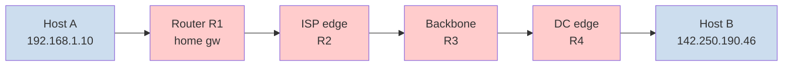
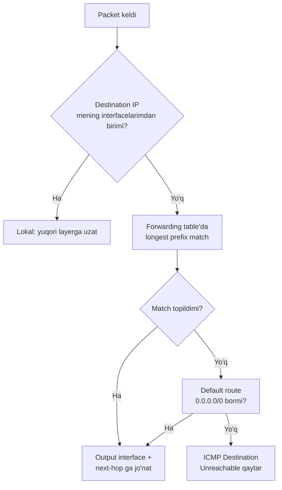
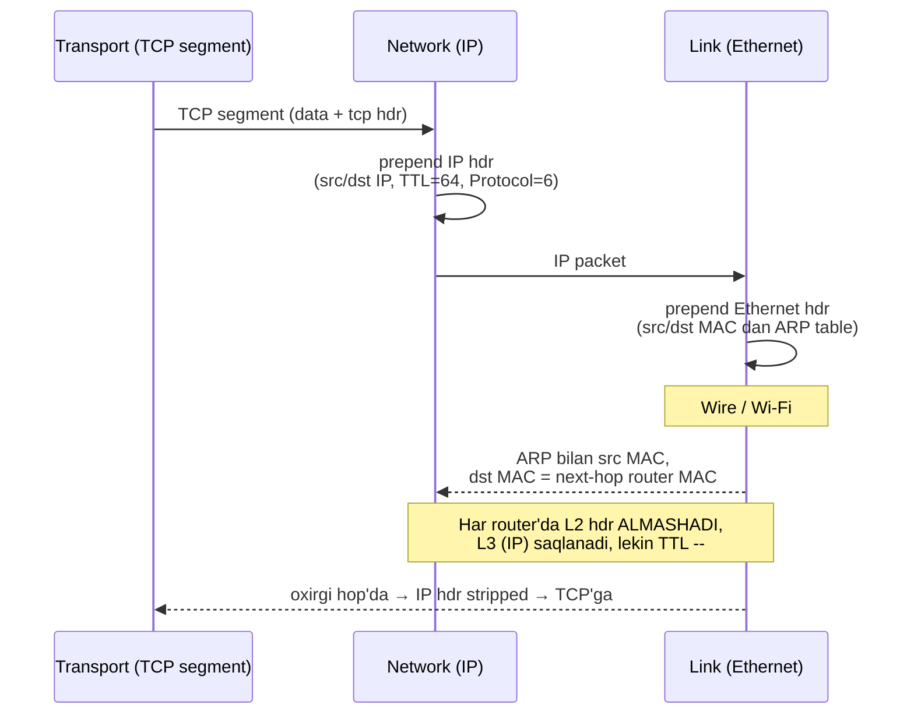

# Layer 3: Network Layer

## 1. Qisqacha tushuncha (TL;DR)

Network layer — bu OSI 3-layeri bo'lib, **packet**larni **manba host**dan **qabul qiluvchi host**ga (turli network'lar orqali, ko'p router'lar orqali) yetkazadi. Transport layer process-process aloqasini qursa, network layer host-host aloqasini quradi. Asosiy protokol — **IP** (Internet Protocol, IPv4 va IPv6). Bu layer ikki asosiy vazifani bajaradi: **forwarding** (router ichida — packetni to'g'ri output interface'ga) va **routing** (butun network bo'ylab yo'lni hisoblash). Yordamchi protokollar: **ICMP** (diagnostika), **ARP** (L2 bilan ko'prik), **routing protocols** (OSPF, BGP).

## 2. Asosiy vazifalari

- **Logical addressing:** Har bir host ga unique **IP address** beriladi (IPv4 32-bit, IPv6 128-bit). Bu address network'dagi joyini aniqlaydi.
- **Routing:** Manba'dan qabul qiluvchiga eng yaxshi yo'lni topish. Algorithmlar: distance-vector (RIP), link-state (OSPF), path-vector (BGP).
- **Forwarding:** Har bir router'ning forwarding table'iga ko'ra packetni to'g'ri interface'ga uzatish (millisekundlarda).
- **Fragmentation va reassembly:** MTU dan katta packetni bo'laklash (IPv4'da har router'da, IPv6'da faqat sender'da).
- **Best-effort delivery:** IP **kafolatsiz** xizmat — yo'qotish, dublikat, tartibsiz yetkazish bo'lishi mumkin. Reliability — yuqori layer (TCP) vazifasi.
- **Error reporting:** ICMP orqali muammo haqida xabar qaytarish (Destination Unreachable, Time Exceeded va h.k.).
- **Address translation:** NAT orqali private IP'larni public IP'ga (va aksincha) o'tkazish.

## 3. Vizual sxema



Har bir router quyidagi qaror qabul qiladi: **"bu packet'ning destination IP'si forwarding table'imda qaysi entry bilan eng uzun mos keladi?"** (longest prefix match) — va shu output interface'ga jo'natadi.



## 4. Protocol Data Unit (PDU)

Network layer'da PDU **packet** (yoki RFC tilida **datagram**) deb ataladi. Encapsulation:
- Transport segment'i ustiga IP header qo'shiladi: `[IP header | TCP/UDP segment]`.
- IPv4 header — minimum **20 byte**, max 60 byte (Options bilan).
- IPv6 header — fixed **40 byte**.

Decapsulation: qabul qiluvchi host IP header'ni o'qib, `Protocol` maydoni bo'yicha (6=TCP, 17=UDP, 1=ICMP) yuqori layerga uzatadi.

## 5. Asosiy protokollar

### 5.1 IPv4 — Internet Protocol version 4 (RFC 791)

IPv4 — 32-bit address (4.3 mlrd unique). 1981-yildan beri internetning asosiy protokoli. 2026-yilgacha hali ham trafikning yarmidan ko'pi IPv4'da.

#### IPv4 Header (20 byte minimum)

```
 0                   1                   2                   3
 0 1 2 3 4 5 6 7 8 9 0 1 2 3 4 5 6 7 8 9 0 1 2 3 4 5 6 7 8 9 0 1
+-+-+-+-+-+-+-+-+-+-+-+-+-+-+-+-+-+-+-+-+-+-+-+-+-+-+-+-+-+-+-+-+
|Version|  IHL  |Type of Service|          Total Length         |
+-+-+-+-+-+-+-+-+-+-+-+-+-+-+-+-+-+-+-+-+-+-+-+-+-+-+-+-+-+-+-+-+
|         Identification        |Flags|      Fragment Offset    |
+-+-+-+-+-+-+-+-+-+-+-+-+-+-+-+-+-+-+-+-+-+-+-+-+-+-+-+-+-+-+-+-+
|  Time to Live |    Protocol   |         Header Checksum       |
+-+-+-+-+-+-+-+-+-+-+-+-+-+-+-+-+-+-+-+-+-+-+-+-+-+-+-+-+-+-+-+-+
|                       Source Address                          |
+-+-+-+-+-+-+-+-+-+-+-+-+-+-+-+-+-+-+-+-+-+-+-+-+-+-+-+-+-+-+-+-+
|                    Destination Address                        |
+-+-+-+-+-+-+-+-+-+-+-+-+-+-+-+-+-+-+-+-+-+-+-+-+-+-+-+-+-+-+-+-+
|                    Options                    |    Padding    |
+-+-+-+-+-+-+-+-+-+-+-+-+-+-+-+-+-+-+-+-+-+-+-+-+-+-+-+-+-+-+-+-+
|                             data                              |
+-+-+-+-+-+-+-+-+-+-+-+-+-+-+-+-+-+-+-+-+-+-+-+-+-+-+-+-+-+-+-+-+
```

Asosiy maydonlar:
- **Version** (4 bit) — `4` IPv4 uchun.
- **IHL** (4 bit) — header uzunligi 32-bit so'zlarda (5 = 20 byte).
- **Total Length** (2 byte) — butun packet uzunligi (max 65535 byte).
- **Identification + Flags + Fragment Offset** — fragmentation uchun.
- **TTL** (1 byte) — Time To Live, har router 1 ga kamaytiradi. 0 ga yetsa, packet o'chiriladi (cheksiz aylanishni oldini oladi).
- **Protocol** (1 byte) — yuqori layer: `1=ICMP`, `6=TCP`, `17=UDP`, `41=IPv6`, `89=OSPF`.
- **Header Checksum** (2 byte) — faqat header uchun (IPv6'da yo'q).
- **Source / Destination Address** (4+4 byte) — IP'lar.

#### IPv4 address formati

`192.168.1.10` — to'rtta `octet` (8 bit), nuqta bilan. Mantiqan **network qismi + host qismi** ga bo'linadi (CIDR notation: `192.168.1.0/24` — birinchi 24 bit network, oxirgi 8 bit host).

Maxsus diapazonlar:
- **Private (RFC 1918):** `10.0.0.0/8`, `172.16.0.0/12`, `192.168.0.0/16` — internet'ga chiqmaydi, NAT orqali tarjima qilinadi.
- **Loopback:** `127.0.0.0/8` (asosan `127.0.0.1`).
- **Link-local:** `169.254.0.0/16` (DHCP ishlamaganda avtomatik).
- **Multicast:** `224.0.0.0/4`.
- **Broadcast:** `255.255.255.255` (limited), yoki subnet broadcast `192.168.1.255`.

### 5.2 IPv6 — Internet Protocol version 6 (RFC 8200)

IPv6 — 128-bit address (3.4×10^38 unique). 2026 holatida global IPv6 trafik **50%** dan oshdi. Yetakchi davlatlar: Fransiya 86%, Hindiston, Vyetnam, Germaniya. Asosiy yutuqlari: katta address space, NAT'ga ehtiyoj yo'q, sodda header, built-in security (IPsec).

#### IPv6 Header (fixed 40 byte)

```
 0                   1                   2                   3
 0 1 2 3 4 5 6 7 8 9 0 1 2 3 4 5 6 7 8 9 0 1 2 3 4 5 6 7 8 9 0 1
+-+-+-+-+-+-+-+-+-+-+-+-+-+-+-+-+-+-+-+-+-+-+-+-+-+-+-+-+-+-+-+-+
|Version| Traffic Class |           Flow Label                  |
+-+-+-+-+-+-+-+-+-+-+-+-+-+-+-+-+-+-+-+-+-+-+-+-+-+-+-+-+-+-+-+-+
|         Payload Length        |  Next Header  |   Hop Limit   |
+-+-+-+-+-+-+-+-+-+-+-+-+-+-+-+-+-+-+-+-+-+-+-+-+-+-+-+-+-+-+-+-+
|                                                               |
+                                                               +
|                                                               |
+                       Source Address (128 bits)               +
|                                                               |
+                                                               +
|                                                               |
+-+-+-+-+-+-+-+-+-+-+-+-+-+-+-+-+-+-+-+-+-+-+-+-+-+-+-+-+-+-+-+-+
|                                                               |
+                                                               +
|                                                               |
+                    Destination Address (128 bits)             +
|                                                               |
+                                                               +
|                                                               |
+-+-+-+-+-+-+-+-+-+-+-+-+-+-+-+-+-+-+-+-+-+-+-+-+-+-+-+-+-+-+-+-+
|                       data / extension hdrs                   |
+-+-+-+-+-+-+-+-+-+-+-+-+-+-+-+-+-+-+-+-+-+-+-+-+-+-+-+-+-+-+-+-+
```

Maydonlar:
- **Version** = 6.
- **Traffic Class** — QoS/DSCP (IPv4'dagi ToS).
- **Flow Label** — bir oqimga tegishli packetlarni belgilash (router'larga signal).
- **Payload Length** — header'dan keyingi data hajmi.
- **Next Header** — keyingi header turi (TCP, UDP, ICMPv6, yoki extension header).
- **Hop Limit** — IPv4 TTL ekvivalenti.
- **Source / Destination** — 128-bit.

#### IPv6 address formati

`2001:0db8:85a3:0000:0000:8a2e:0370:7334` — sakkizta guruh, har biri 16-bit hex. Qisqartirish:
- Boshidagi nol'lar: `0db8` → `db8`.
- Ketma-ket nol guruhlar: `::` (faqat bir marta). Misol: `2001:db8:85a3::8a2e:370:7334`.
- Loopback: `::1`. "Hammasi nol": `::`.
- Link-local: `fe80::/10`.
- Unique local: `fc00::/7`.
- Multicast: `ff00::/8`.

#### IPv4 vs IPv6 farqlari

| Xususiyat | IPv4 | IPv6 |
|---|---|---|
| Address uzunligi | 32 bit | 128 bit |
| Header size | 20-60 byte | 40 byte (fixed) |
| Header checksum | Bor | **Yo'q** (L2/L4 hisoblanadi) |
| Fragmentation | Router yoki host | Faqat **host** (PMTUD majburiy) |
| Configuration | DHCP yoki manual | SLAAC (auto) yoki DHCPv6 |
| Broadcast | Bor | **Yo'q** (multicast bor) |
| NAT | Keng tarqalgan | Asosan kerak emas |
| IPsec | Optional | Standart qism |
| Address yozuv | `192.168.1.1` | `2001:db8::1` |

### 5.3 ICMP — Internet Control Message Protocol (RFC 792 / RFC 4443 v6)

ICMP — IP'ning "javob beruvchi qo'li". Diagnostika va xato xabarlari uchun. ICMP IP ichida ishlaydi (Protocol = 1, IPv6'da 58).

Asosiy turlar (Type / Code):
- **Type 0 — Echo Reply** + **Type 8 — Echo Request** → `ping` aynan shularni ishlatadi.
- **Type 3 — Destination Unreachable** (Code: 0=net, 1=host, 3=port, 4=fragmentation needed).
- **Type 5 — Redirect** — router yaxshiroq yo'l haqida ogohlantiradi.
- **Type 11 — Time Exceeded** — TTL=0 bo'ldi (`traceroute` shu xabarga tayanadi).
- **Type 12 — Parameter Problem**.

### 5.4 Routing protocols (qisqacha)

- **Static route** — admin qo'lda yozadi (`ip route add ...`).
- **RIP** (distance-vector, hop-count, max 15) — eski, kichik network'lar.
- **OSPF** (link-state, Dijkstra, area'lar bilan ierarxiya) — enterprise interior gateway.
- **IS-IS** — telecom/ISP'larda mashhur.
- **BGP** (path-vector) — internet'ning "yelkasi", ASN'lar orasida (deep-dive `../deep-dives/routing-protocols.md`).

### 5.5 CIDR va subnetting (asosiy)

CIDR (Classless Inter-Domain Routing) — `network/prefix-length` formati. Misol `192.168.10.0/24`:
- `/24` = 24 bit network, 8 bit host → 256 address (254 ishlatish mumkin, 1 network ID, 1 broadcast).
- `/16` = 65 536, `/8` = 16 mln.
- `/30` = 4 address (point-to-point link), `/32` = bitta host.

To'liq subnetting — VLSM, supernetting, route summarization — `../deep-dives/subnetting-cidr.md`.

### 5.6 Fragmentation

Agar packet MTU (mas. Ethernet 1500 byte) dan katta bo'lsa, IPv4 router uni bo'laklarga ajratadi. Har fragmentda original `Identification`, `Flags` (MF=More Fragments) va `Fragment Offset` saqlanadi. Reassembly qabul qiluvchi host'da bo'ladi.

IPv6'da router fragment qilmaydi — agar katta packet kelsa, **ICMPv6 "Packet Too Big"** qaytaradi va host **PMTUD** (Path MTU Discovery) qiladi.

### 5.7 NAT — Network Address Translation (qisqacha)

IPv4 address tugashidan keyin NAT keng tarqaldi. Home router 192.168.1.0/24 (private) ni bitta public IP'ga (mas. 88.234.x.x) tarjima qiladi. Ichki port'lar bilan birgalikda ko'rinadi (PAT/NAPT). To'liq: `../deep-dives/nat-and-firewall.md`.

## 6. Encapsulation/Decapsulation jarayoni



**Muhim:** Har router'da packet'ning **MAC address'lari almashadi** (har link uchun yangi src/dst MAC), lekin **IP address'lari o'zgarmaydi** (NAT bo'lmasa). TTL har hop'da 1 ga kamayadi.

## 7. Real hayot misoli — `traceroute google.com`

`traceroute` har hop'ning IP'sini topish uchun hiylekorlik qiladi:
1. TTL=1 bilan packet yuboradi → 1-router TTL=0 qiladi va **ICMP Time Exceeded** qaytaradi.
2. TTL=2 → 2-router javob qaytaradi.
3. ... gacha destination'ga yetguncha.

Real misol:
```
$ traceroute -n google.com
traceroute to google.com (142.250.184.142), 30 hops max, 60 byte packets
 1  192.168.1.1            1.234 ms   home gateway
 2  10.50.0.1              5.678 ms   ISP edge
 3  77.72.144.17           8.123 ms   ISP backbone
 4  213.197.241.45        12.456 ms   peering
 5  72.14.222.122         15.789 ms   Google edge
 6  108.170.245.65        16.123 ms
 7  142.250.184.142       16.456 ms   destination
```

`ping -c 4 8.8.8.8`:
```
PING 8.8.8.8 (8.8.8.8) 56(84) bytes of data.
64 bytes from 8.8.8.8: icmp_seq=1 ttl=117 time=12.3 ms
64 bytes from 8.8.8.8: icmp_seq=2 ttl=117 time=11.8 ms
64 bytes from 8.8.8.8: icmp_seq=3 ttl=117 time=12.1 ms
64 bytes from 8.8.8.8: icmp_seq=4 ttl=117 time=12.5 ms
--- 8.8.8.8 ping statistics ---
4 packets transmitted, 4 received, 0% packet loss
rtt min/avg/max/mdev = 11.8/12.175/12.5/0.265 ms
```

`ip a` (interfaces):
```
2: enp3s0: <BROADCAST,MULTICAST,UP,LOWER_UP> mtu 1500 ...
    inet 192.168.1.10/24 brd 192.168.1.255 scope global dynamic enp3s0
    inet6 fe80::a00:27ff:fe4e:66a1/64 scope link
```

`ip r` (routing table):
```
default via 192.168.1.1 dev enp3s0 proto dhcp metric 100
192.168.1.0/24 dev enp3s0 proto kernel scope link src 192.168.1.10
169.254.0.0/16 dev enp3s0 scope link metric 1000
```

`ip route get 8.8.8.8`:
```
8.8.8.8 via 192.168.1.1 dev enp3s0 src 192.168.1.10 uid 1000
```

`ip neigh` (ARP cache):
```
192.168.1.1 dev enp3s0 lladdr 9c:c9:eb:1a:2b:3c REACHABLE
192.168.1.20 dev enp3s0 lladdr a4:5e:60:11:22:33 STALE
```

`tcpdump -i any icmp`:
```
14:23:01.111 IP 192.168.1.10 > 8.8.8.8: ICMP echo request, id 4567, seq 1
14:23:01.123 IP 8.8.8.8 > 192.168.1.10: ICMP echo reply, id 4567, seq 1
```

## 8. Tez-tez beriladigan savollar (FAQ)

**S:** Nima uchun IP "unreliable"? Bu yomon emasmi?
**J:** "Unreliable" — bu dizayn tanlovi. Reliability TCP'da yuqori darajada qilinadi, IP esa sodda va tez. Bu ko'p xil link'larda ishlashga imkon beradi.

**S:** Public va private IP farqi nima?
**J:** Public — internet'da unique va routable. Private (10/8, 172.16/12, 192.168/16) — faqat ichki network'da, internet'ga chiqishda NAT qilinadi.

**S:** TTL nima uchun kerak?
**J:** Routing loop bo'lib qolsa (mas. R1→R2→R1→...), packet abadiy aylanmasin uchun. Har router 1 ga kamaytiradi, 0 da o'chiradi va ICMP Time Exceeded qaytaradi.

**S:** IPv6 to'liq IPv4'ni almashtiradimi?
**J:** Hech qachon birdaniga emas. **Dual-stack** (host'da ikkalasi parallel) odatiy yondashuv. 2026'da global IPv6 50% dan oshdi, lekin IPv4 hali ham keng ishlatiladi.

**S:** ICMP'ni firewall'da to'liq block qilish to'g'rimi?
**J:** Yo'q! ICMP butunlay block qilinsa, PMTUD ishlamaydi → packet "qora tuynukda" yo'qoladi. Echo Request'ni filter qilish mumkin, lekin **Type 3 (Destination Unreachable) va Type 11 (Time Exceeded)** o'tkaziladi.

**S:** Router va switch farqi?
**J:** **Switch — L2** (MAC address'lar bilan), **router — L3** (IP address'lar bilan, network'lar orasida). Modern "L3 switch" — ikkalasi qo'shilgan qurilma.

**S:** Subnet mask `/24` va `255.255.255.0` bir narsami?
**J:** Ha — `255.255.255.0` = `11111111.11111111.11111111.00000000` = 24 ta birga oldin = `/24`.

**S:** Default gateway nima?
**J:** Lokal subnet'da bo'lmagan packetlarni jo'natish uchun "default" router. `ip r` da `default via X.X.X.X` ko'rinadi.

## 9. Troubleshooting

```bash
# Reachability
ping -c 4 8.8.8.8         # L3 ishlaydimi (loss, RTT)
ping6 2001:4860:4860::8888 # IPv6
mtr google.com            # ping + traceroute live
traceroute -n -T -p 443 google.com  # TCP traceroute (firewall ICMP block qilsa)

# Interface va routing
ip a                      # interfaces
ip r                      # routing table
ip route get 8.8.8.8      # qaysi yo'l ishlatiladi
ip neigh                  # ARP / NDP cache
ip -6 a                   # IPv6 only

# Packet capture
sudo tcpdump -i any icmp
sudo tcpdump -i any -n 'icmp[icmptype] == icmp-echo or icmp[icmptype] == icmp-echoreply'
sudo tcpdump -i any host 8.8.8.8 and not arp

# MTU testlari
ping -M do -s 1472 8.8.8.8   # DF=1, payload 1472 (=1500-28). Agar fail bo'lsa, MTU kam.
tracepath 8.8.8.8

# Firewall / NAT
sudo iptables -L -n -v
sudo nft list ruleset
sudo conntrack -L           # NAT translations

# IPv6 specific
ip -6 route
ndp -an    # macOS; Linux: ip -6 neigh
```

**"Internet ishlamayapti — qaerdan boshlaymiz?"**
1. `ip a` — interface UP mi, IP olganmi?
2. `ip r` — default gateway bormi?
3. `ping <gateway>` — lokal yetib boryaptimi (L2/ARP)?
4. `ping 8.8.8.8` — internetga ulana olyaptimi (L3)?
5. `ping google.com` — DNS ishlaydimi?
6. `traceroute 8.8.8.8` — qaysi hop'da to'xtaydi?
7. `tcpdump -i any icmp` — packet chiqyapti, javob kelyaptimi?

Tipik muammolar: **DHCP olmagan**, **gateway noto'g'ri**, **routing loop** (TTL bilan biladigan), **MTU mismatch**, **firewall block**, **asymmetric routing** (packet bir yo'lda boryapti, javob boshqa yo'ldan kelmayapti).

---
