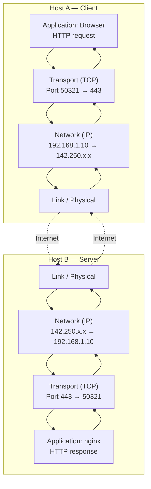
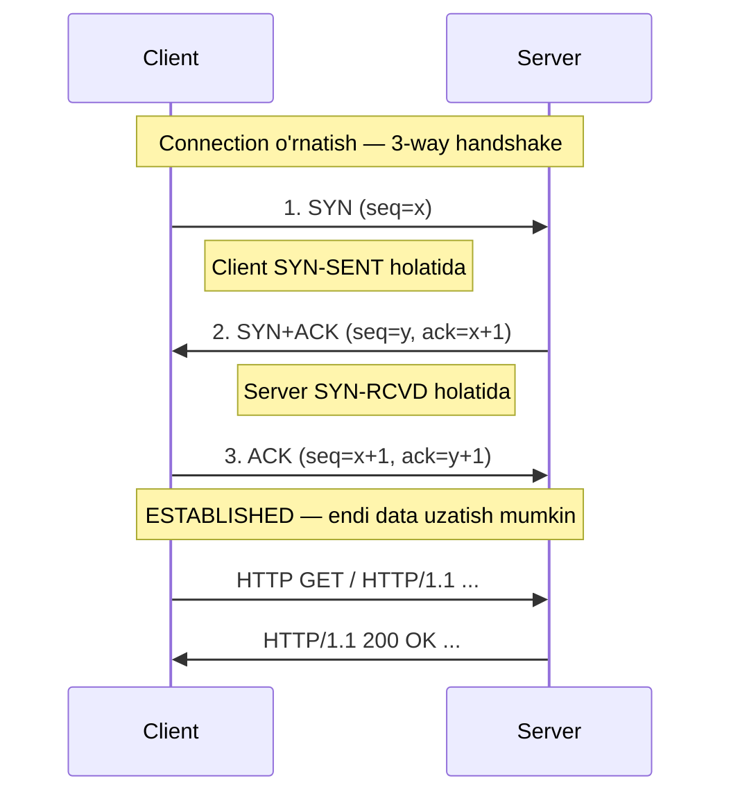
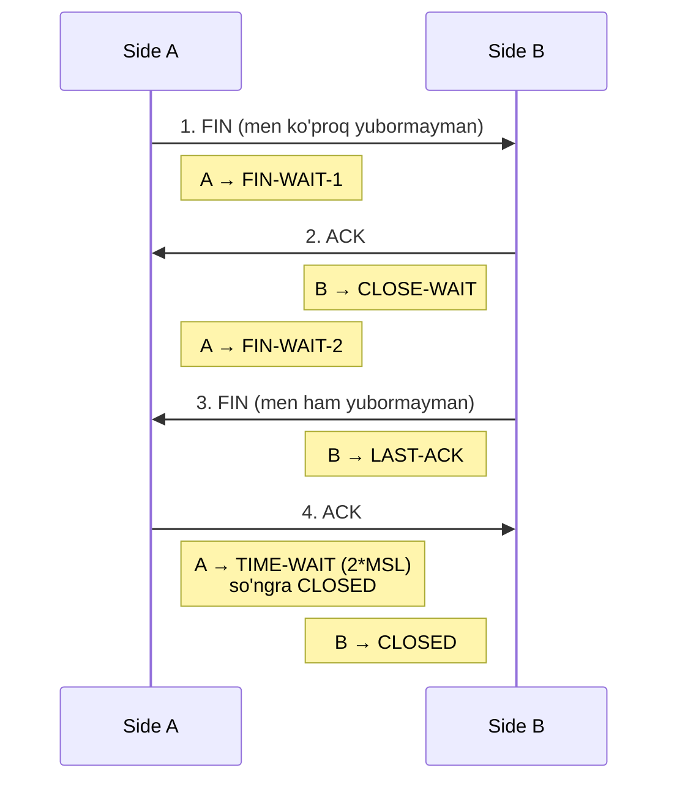
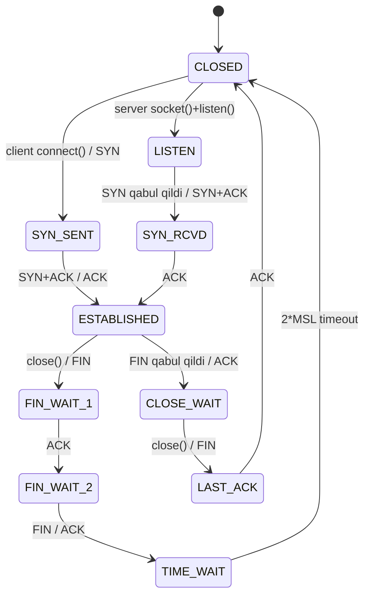

# Layer 4: Transport Layer (Transport uchi)

## 1. Qisqacha tushuncha (TL;DR)

Transport layer — bu OSI modelining 4-layeri bo'lib, **ikki connection uchi** (end-to-end) — ya'ni manba va qabul qiluvchi process'lar — o'rtasida ma'lumot uzatishni ta'minlaydi. Network layer packetlarni **host-host** orasida yetkazsa, transport layer ularni **process-process** ga (port raqami orqali) yetkazadi. Internet stack'ida ikkita asosiy protokol mavjud: **TCP** (reliable, connection-oriented) va **UDP** (unreliable, connectionless). Transport layer'da PDU `segment` (TCP) yoki `datagram` (UDP) deb ataladi, va u port raqami yordamida multiplexing/demultiplexing bajaradi.

## 2. Asosiy vazifalari

- **Segmentation va reassembly:** Application layer'dan keladigan katta xabarni MSS (Maximum Segment Size) ga bo'lib, segmentlar ko'rinishida uzatadi; qabul tarafda esa qaytadan birlashtiradi.
- **Multiplexing / Demultiplexing:** Bitta IP address ostida ishlayotgan **bir nechta** application'larni port raqami orqali ajratadi. Misol: brauzer (HTTP — 443), SSH client (22), Telegram (turli portlar) — hammasi bitta IP da ishlaydi.
- **End-to-end reliability (TCP):** Yo'qolgan segmentlarni qayta yuborish (retransmission), tartibni saqlash (sequence number bilan), duplicate'larni o'chirish.
- **Flow control:** Qabul qiluvchining buffer'i to'lib qolmasligi uchun, sender'ning yuborish tezligini cheklash (TCP receive window orqali).
- **Congestion control (TCP):** Network qattiq band bo'lganda, packet yo'qotishni kamaytirish uchun yuborish tezligini avtomatik kamaytirish.
- **Error detection:** Header va payload uchun **checksum** orqali korrupsiyani aniqlash.
- **Connection establishment va teardown (TCP):** 3-way handshake bilan connection o'rnatish va 4-way FIN bilan yopish.

## 3. Vizual sxema



Transport layer mantiqiy (logical) end-to-end channel yaratadi — go'yo client process to'g'ridan-to'g'ri server process bilan gaplashayotgandek. Aslida ostidagi router'lar L3/L2/L1 bilan ishlaydi.

## 4. Protocol Data Unit (PDU)

Transport layer'da PDU **segment** (TCP) yoki **datagram** (UDP) deb ataladi. RFC'larda ham segment atamasi TCP uchun, datagram esa UDP va IP uchun ishlatiladi.

Encapsulation tartibida:
1. Application layer `message` ni transport'ga beradi.
2. Transport layer unga **TCP/UDP header** qo'shadi: `[TCP/UDP header | data]` = segment.
3. Bu segment network layer'ga uzatiladi va u IP header qo'shib `packet` qiladi: `[IP header | TCP header | data]`.
4. Link layer Ethernet header/trailer qo'shib `frame` qiladi.

Decapsulation — teskari tartibda. Receiver tarafida transport layer header'ni o'qib, port raqami bo'yicha to'g'ri socket'ga yo'naltiradi.

## 5. Asosiy protokollar

### 5.1 TCP — Transmission Control Protocol (RFC 9293, eski RFC 793)

TCP — **reliable, connection-oriented, byte-stream** protokol. Ya'ni:
- Reliable: ma'lumot yo'qolmaydi, tartibda yetkazadi.
- Connection-oriented: ma'lumot yuborishdan oldin 3-way handshake bilan connection o'rnatadi.
- Byte-stream: TCP application'ga uzluksiz oqim ko'rinishida yetkazib beradi (segment chegaralarini ko'rsatmaydi).

#### TCP Header strukturasi (20 byte minimum, 60 byte max — Options bilan)

```
 0                   1                   2                   3
 0 1 2 3 4 5 6 7 8 9 0 1 2 3 4 5 6 7 8 9 0 1 2 3 4 5 6 7 8 9 0 1
+-+-+-+-+-+-+-+-+-+-+-+-+-+-+-+-+-+-+-+-+-+-+-+-+-+-+-+-+-+-+-+-+
|          Source Port          |       Destination Port        |
+-+-+-+-+-+-+-+-+-+-+-+-+-+-+-+-+-+-+-+-+-+-+-+-+-+-+-+-+-+-+-+-+
|                        Sequence Number                        |
+-+-+-+-+-+-+-+-+-+-+-+-+-+-+-+-+-+-+-+-+-+-+-+-+-+-+-+-+-+-+-+-+
|                    Acknowledgment Number                      |
+-+-+-+-+-+-+-+-+-+-+-+-+-+-+-+-+-+-+-+-+-+-+-+-+-+-+-+-+-+-+-+-+
|  Data |           |U|A|P|R|S|F|                               |
| Offset| Reserved  |R|C|S|S|Y|I|            Window             |
|       |           |G|K|H|T|N|N|                               |
+-+-+-+-+-+-+-+-+-+-+-+-+-+-+-+-+-+-+-+-+-+-+-+-+-+-+-+-+-+-+-+-+
|           Checksum            |         Urgent Pointer        |
+-+-+-+-+-+-+-+-+-+-+-+-+-+-+-+-+-+-+-+-+-+-+-+-+-+-+-+-+-+-+-+-+
|                    Options                    |    Padding    |
+-+-+-+-+-+-+-+-+-+-+-+-+-+-+-+-+-+-+-+-+-+-+-+-+-+-+-+-+-+-+-+-+
|                             data                              |
+-+-+-+-+-+-+-+-+-+-+-+-+-+-+-+-+-+-+-+-+-+-+-+-+-+-+-+-+-+-+-+-+
```

Asosiy maydonlar:
- **Source/Destination Port** (2+2 byte) — qaysi process'dan/process'ga.
- **Sequence Number** (4 byte) — bu segmentdagi birinchi byte'ning oqimdagi raqami.
- **Acknowledgment Number** (4 byte) — qabul qiluvchi keyin kutayotgan byte raqami.
- **Data Offset** (4 bit) — header uzunligi (32-bit so'zlarda).
- **Flags** (URG, ACK, PSH, RST, SYN, FIN) — control bayroqlari.
- **Window** (2 byte) — qabul qiluvchi yana qancha byte qabul qila oladi (flow control).
- **Checksum** (2 byte) — error detection.
- **Options** — MSS, SACK, Window Scale, Timestamps va h.k.

#### 3-way handshake



3 marta xabar almashish — har ikki taraf ham bir-birining ketma-ket raqami (sequence number) ni bilib oladi, bu reliable ma'lumot uzatishning asosi.

#### Reliability mexanizmlari

- **Sequence number + ACK:** Har bir byte'ning raqami bor. Sender yuborgan segment uchun receiver `ACK = seq + len` qaytaradi. Agar timeout ichida ACK kelmasa, sender qayta yuboradi.
- **Sliding window:** Sender bir vaqtning o'zida `Window` byte gacha ACK kutmasdan yuborishi mumkin (pipelining). Bu RTT (Round Trip Time) ni samarali ishlatadi.
- **Flow control:** Receiver `Window` maydoni orqali "menda hali shuncha joy bor" deb aytadi — sender shu chegaradan oshmaydi.
- **Cumulative + selective ACK (SACK):** Standart ACK kumulyativ — "shu raqamgacha hammasini oldim". SACK option — "shularni oldim, mana shu segmentlar yo'q".

#### Congestion control (qisqacha)

TCP network'ning haddan tashqari band bo'lishini oldini olish uchun **congestion window** (cwnd) ishlatadi. Asosiy fazalar:
- **Slow start:** cwnd eksponental o'sadi (1 → 2 → 4 → 8 ...).
- **Congestion avoidance:** Threshold'dan keyin chiziqli (har RTT da +1).
- **Fast retransmit / fast recovery:** 3 ta duplicate ACK kelsa, timeout kutmasdan qayta yuborish.

Modern algoritmlar: **Reno** (klassik), **CUBIC** (Linux'da default 2026 yilgacha keng tarqalgan), **BBR** (Google ishlab chiqqan, RTT va bandwidth modellari asosida — yo'qotishga emas, kutish vaqtiga qaraydi). BBR yuqori-RTT, lossy network'larda CUBIC dan ancha tezroq ishlaydi (100ms RTT, 1% loss da CUBIC 25 Mbps, BBR 650 Mbps). To'liq versiya: `../deep-dives/tcp-handshake.md`.

#### 4-way termination (FIN handshake)



`TIME-WAIT` — taxminan 2*MSL (Maximum Segment Lifetime, odatda 2 daqiqa) — eski packetlar adashib kelishidan saqlanish uchun.

#### TCP holat (state) diagrammasi



### 5.2 UDP — User Datagram Protocol (RFC 768)

UDP — **connectionless, unreliable, message-oriented** protokol. Header bor-yo'g'i 8 byte. Hech qanday handshake, ACK, retransmission yo'q. Sotuvga sodda — fire and forget.

#### UDP Header strukturasi (8 byte)

```
 0                   1                   2                   3
 0 1 2 3 4 5 6 7 8 9 0 1 2 3 4 5 6 7 8 9 0 1 2 3 4 5 6 7 8 9 0 1
+-+-+-+-+-+-+-+-+-+-+-+-+-+-+-+-+-+-+-+-+-+-+-+-+-+-+-+-+-+-+-+-+
|          Source Port          |       Destination Port        |
+-+-+-+-+-+-+-+-+-+-+-+-+-+-+-+-+-+-+-+-+-+-+-+-+-+-+-+-+-+-+-+-+
|             Length            |           Checksum            |
+-+-+-+-+-+-+-+-+-+-+-+-+-+-+-+-+-+-+-+-+-+-+-+-+-+-+-+-+-+-+-+-+
|                             data                              |
+-+-+-+-+-+-+-+-+-+-+-+-+-+-+-+-+-+-+-+-+-+-+-+-+-+-+-+-+-+-+-+-+
```

UDP **use cases:**
- **DNS** (53/udp) — kichik so'rov-javob, TCP overhead'i shart emas.
- **DHCP** (67/68 udp) — broadcast, hali IP yo'q paytda ishlaydi.
- **NTP** (123/udp) — vaqt sinxronizatsiyasi.
- **Video streaming, VoIP, online gaming** — yo'qolgan packet retransmission'siz yaxshiroq, kechikish katta dushman.
- **VPN (WireGuard, OpenVPN-UDP), QUIC** — encryption ostida o'zlari reliability quradi.

### 5.3 QUIC — Modern transport (RFC 9000)

QUIC — Google ishlab chiqqan, 2021 yilda RFC bo'lgan modern transport protokol. **UDP ustida** ishlaydi (chunki butun internet TCP+UDP bilan ishlashga moslashgan, yangi L4 ni o'rnatish qiyin), lekin TCP funksiyalarini takrorlaydi va yaxshilaydi:

- **Built-in TLS 1.3:** encryption transport bilan birga (alohida handshake yo'q).
- **Stream multiplexing:** Bitta connection ichida bir nechta stream — bittasidagi packet yo'qolsa, boshqalari to'xtamaydi (HTTP/2 dagi head-of-line blocking yechilgan).
- **0-RTT resumption:** qaytib kelgan client darhol ma'lumot yubora oladi.
- **Connection migration:** IP o'zgarsa ham connection saqlanadi (Connection ID orqali).

**HTTP/3** — bu HTTP/QUIC, 2026 holatida top 10 mln site'larning ~34% i, brauzerlarning 95%+ tomonidan qo'llab-quvvatlanadi.

### 5.4 TCP vs UDP taqqoslash jadvali

| Xususiyat | TCP | UDP |
|---|---|---|
| Connection | Connection-oriented (3-way handshake) | Connectionless |
| Reliability | Reliable (ACK, retransmission) | Unreliable (best-effort) |
| Order | Tartibda yetkazadi | Tartib kafolati yo'q |
| Header size | 20-60 byte | 8 byte |
| Speed | Sekinroq (overhead bor) | Tezroq (overhead minimal) |
| Flow control | Bor (sliding window) | Yo'q |
| Congestion control | Bor (CUBIC, BBR, Reno) | Yo'q |
| Use cases | HTTP, HTTPS, SSH, FTP, SMTP, DB | DNS, DHCP, VoIP, gaming, video |

### 5.5 Port raqamlari

Port — 16-bit raqam (0-65535). IANA bo'limlari:
- **Well-known (0-1023)** — system port'lar: 22 (SSH), 25 (SMTP), 53 (DNS), 80 (HTTP), 443 (HTTPS).
- **Registered (1024-49151)** — ro'yxatdan o'tgan: 3306 (MySQL), 5432 (PostgreSQL), 6379 (Redis), 8080.
- **Dynamic / Ephemeral (49152-65535)** — client'lar vaqtinchalik ishlatadi (Linux odatda 32768-60999).

**Socket** = `(IP address, port)` jufti. **TCP connection** = `(src IP, src port, dst IP, dst port)` 4-tupli — shu 4 ta qiymat unique connection'ni aniqlaydi. Shuning uchun bitta server 443-port'da minglab client'larga xizmat ko'rsata oladi.

## 6. Encapsulation/Decapsulation jarayoni

```mermaid
sequenceDiagram
    participant App as Application
    participant TCP as TCP Layer
    participant IP as IP Layer
    participant Link as Link Layer
    App->>TCP: send("GET / HTTP/1.1\r\n...") (~100 byte)
    TCP->>TCP: split into segments<br/>(MSS=1460), add seq/ack/ports/checksum
    TCP->>IP: segment (TCP hdr 20B + data)
    IP->>IP: add IP hdr 20B, src/dst IP
    IP->>Link: packet
    Link->>Link: add Ethernet hdr 14B + FCS 4B
    Note over Link: Frame wire'ga chiqadi
    Note over Link,App: Receiver tarafda — teskari tartibda
    Link-->>IP: frame → strip Ethernet
    IP-->>TCP: packet → strip IP hdr<br/>look at protocol=6 (TCP)
    TCP-->>App: segment → strip TCP hdr<br/>demux by dst port → socket
```

## 7. Real hayot misoli — `https://google.com` ga kirish

1. Brauzer DNS so'roviga **UDP/53** ga `A google.com` yuboradi.
2. DNS resolver `142.250.190.46` qaytaradi.
3. Brauzer ephemeral port tanlaydi (mas. **50321**), `(192.168.1.10:50321 → 142.250.190.46:443)` socket ochadi.
4. **3-way handshake (TCP):**
   - Client: `SYN seq=1000`
   - Server: `SYN+ACK seq=8000, ack=1001`
   - Client: `ACK seq=1001, ack=8001`
5. **TLS handshake** (segment'lar ichida) — sertifikat almashinadi, kalitlar kelishiladi.
6. **HTTP request** TCP segment ichida yuboriladi; HTML response qaytadi (sliding window, ACK'lar).
7. Yopish: ikki tomondan **FIN+ACK** — connection TIME-WAIT ga o'tadi.

`tcpdump -i any -n port 443` natijasi (qisqartirilgan):
```
14:02:11.234 IP 192.168.1.10.50321 > 142.250.190.46.443: Flags [S], seq 1000, win 64240, options [mss 1460,sackOK,TS,wscale 7]
14:02:11.301 IP 142.250.190.46.443 > 192.168.1.10.50321: Flags [S.], seq 8000, ack 1001, win 65535, options [mss 1460,sackOK]
14:02:11.301 IP 192.168.1.10.50321 > 142.250.190.46.443: Flags [.], ack 8001, win 502
14:02:11.302 IP 192.168.1.10.50321 > 142.250.190.46.443: Flags [P.], seq 1001:1518, ack 8001, length 517 (Client Hello)
...
```

`ss -tnp` natijasi:
```
State    Recv-Q  Send-Q  Local Address:Port    Peer Address:Port    Process
ESTAB    0       0       192.168.1.10:50321   142.250.190.46:443   users:(("firefox",pid=4521,fd=87))
LISTEN   0       128     0.0.0.0:22           0.0.0.0:*            users:(("sshd",pid=812,fd=3))
TIME-WAIT 0      0       192.168.1.10:50319   142.250.190.46:443
```

## 8. Tez-tez beriladigan savollar (FAQ)

**S:** TCP va UDP qaysi biri tezroq?
**J:** UDP — handshake va ACK yo'q. Lekin "tezlik" nisbatan: katta fayl uzatishda TCP sliding window+congestion control bilan ko'p marta tezroq bo'lishi mumkin, chunki UDP'da application o'zi reliability qurishi kerak (bu odatda kamroq optimal).

**S:** Nega DNS UDP'da, lekin katta DNS javoblar uchun TCP ham bor?
**J:** Klassik DNS UDP/53 — kichik so'rov, kichik javob, sodda. Agar javob 512 byte'dan oshsa (DNSSEC, katta TXT) — TCP/53 ga o'tiladi (truncated bit orqali signal).

**S:** TIME-WAIT nima uchun shunchalik uzoq (2*MSL)?
**J:** Eski adashgan segment kelib, yangi connection'ga noto'g'ri ta'sir qilmasligi uchun. Server'da juda ko'p TIME-WAIT yig'ilsa — `tcp_tw_reuse` sozlamasi bilan tezlashtirish mumkin.

**S:** Bitta port'da bir nechta connection bo'la oladimi?
**J:** Ha. Server `LISTEN 443` da minglab connection'ni qabul qiladi — chunki connection 4-tupli (src IP, src port, dst IP, dst port) bilan unique aniqlanadi. Faqat dst port bir xil.

**S:** SYN flood attack nima?
**J:** Hujumchi minglab SYN yuboradi, lekin oxirgi ACK yubormaydi. Server SYN-RCVD holatida resurs sarflaydi. Yechim: **SYN cookies**, rate limit.

**S:** QUIC TCP'ni o'rniga olib boradimi?
**J:** Hozircha — yo'q. Web (HTTP/3) uchun keng tarqalmoqda, lekin SSH, mail, ko'p enterprise app'lar TCP'da qoladi. UDP block qilingan network'larda QUIC ishlamaydi.

**S:** Checksum qachon mandatory?
**J:** TCP — har doim. UDP IPv4'da ixtiyoriy (lekin amalda har doim hisoblanadi), IPv6'da esa **majburiy**.

## 9. Troubleshooting

Transport layer muammolari va Linux komandalari:

```bash
# Faol TCP connection'lar va process'lar
ss -tnp                  # tcp + numeric + process
ss -tunlp                # tcp+udp listening
ss -tan state established # filter holat bo'yicha

# Eski variant
netstat -tunap

# Port band qilingan process'ni topish
lsof -i :443
fuser 443/tcp

# Manual TCP/UDP test
nc -vz google.com 443    # tcp port ochiqmi?
nc -u -vz host 53        # udp test (cheklangan)
nc -l 9999               # listener boshlash

# Bandwidth test
iperf3 -s                # serverda
iperf3 -c server.ip -t 30 # client

# Live capture
sudo tcpdump -i any -n port 443
sudo tcpdump -i any 'tcp[tcpflags] & (tcp-syn) != 0 and not (tcp[tcpflags] & tcp-ack != 0)'  # faqat SYN
sudo tcpdump -i any -w cap.pcap host 8.8.8.8

# Wireshark filter'lar
# tcp.port == 443
# tcp.flags.syn == 1 && tcp.flags.ack == 0
# tcp.analysis.retransmission

# TCP parametrlar
sysctl net.ipv4.tcp_congestion_control   # cubic / bbr
sysctl -w net.ipv4.tcp_congestion_control=bbr
```

**"Internet ishlamayapti" — qaerdan boshlaysiz?**
1. `ping 8.8.8.8` — L3 ishlaydimi?
2. `ping google.com` — DNS ishlaydimi?
3. `curl -v https://google.com` — TCP+TLS+HTTP zanjiri?
4. `ss -tn` — connection o'rnatilyaptimi?
5. `tcpdump port 443` — packet chiqyaptimi, javob kelyaptimi?

Tipik muammolar: **firewall** port'ni block qilgan, **MTU mismatch** (PMTUD ishlamayapti), **TIME-WAIT** to'planib qolgan, **RST** kelayotgan (server crash yoki port yopiq).

## 10. Cross-references

- Yuqori layer: [`./05-session.md`](./05-session.md), [`./07-application.md`](./07-application.md)
- Quyi layer: [`./03-network.md`](./03-network.md)
- Deep-dive: [`../deep-dives/tcp-handshake.md`](../deep-dives/tcp-handshake.md)
- Glossary: [`../00-foundations/glossary.md`](../00-foundations/glossary.md)

## 11. Manbalar

- **Kitob:** Kurose & Ross, *Computer Networking: A Top-Down Approach*, 6/7-nashr, **3-bob** (Transport Layer), sahifalar 215-336.
- **RFC 9293** — Transmission Control Protocol (2022, RFC 793 ni almashtirgan): https://datatracker.ietf.org/doc/html/rfc9293
- **RFC 768** — User Datagram Protocol: https://datatracker.ietf.org/doc/html/rfc768
- **RFC 9000** — QUIC: A UDP-Based Multiplexed and Secure Transport: https://datatracker.ietf.org/doc/html/rfc9000
- **RFC 9114** — HTTP/3: https://datatracker.ietf.org/doc/html/rfc9114
- **RFC 5681** — TCP Congestion Control
- **Cloudflare Learning:** https://www.cloudflare.com/learning/ddos/glossary/tcp-ip/
- **Google Cloud BBR:** https://cloud.google.com/blog/products/networking/tcp-bbr-congestion-control-comes-to-gcp-your-internet-just-got-faster
- **TCP Congestion Control (Wikipedia):** https://en.wikipedia.org/wiki/TCP_congestion_control
